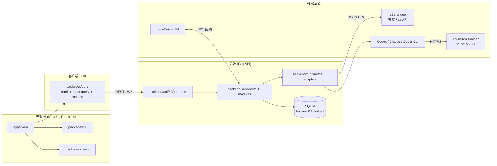

# 系统架构图

> 生成时间: 2026-06-26 | 层级: 8 | 核心组件: 12 | 数据流: 5

## 概览

Tide 是面向 AI 编码代理（Codex / Claude / Qoder / 第三方 A2A Agent）的多智能体任务编排与协同平台。其架构由
**Next.js 前端单页应用 + FastAPI 后端 + SQLite 数据持久化 + Lark/A2A 集成**
构成，外加一个独立的 a2a-bridge 服务和 CC Switch 反向代理 sidecar。



## 架构分层

| 层级 | 路径前缀 | 描述 |
|------|----------|------|
| presentation | `apps/web/app/`, `packages/views/src/`, `packages/ui/src/` | Next.js 15 App Router + React 19；@tide/ui 基础组件、@tide/views 业务视图 |
| client-sdk | `packages/core/src/` | fetch client + React Query hooks + Zustand store + WS provider |
| api | `backend/api/` | 30 个 FastAPI Router，按业务域拆分，提供 REST + WebSocket |
| service | `backend/services/` | 业务编排：任务/计划/工作流/看板/审批/调度/Lark/知识库，31 个模块 |
| runtime | `backend/runtime/` | Codex/Claude/Qoder CLI 适配器、a2a_client、plan/task 执行器、git 工具 |
| data | `backend/db/`, `backend/models/` | SQLAlchemy async + aiosqlite；init.sql + ensure_column 增量迁移 |
| integration | `a2a-bridge/`, `backend/services/lark_*.py` | Lark IM/Card 长连接 + 回调；A2A JSON-RPC；CLI 子进程；CC Switch 代理 |
| deployment | `Dockerfile.*`, `docker-compose.yml` | 三容器（backend/frontend/cc-switch）+ 共享卷 |

## 核心组件

### 前端 / SDK

| 组件 | 层级 | 路径 | 职责 | 主要依赖 |
|------|------|------|------|----------|
| @tide/web | presentation | `apps/web` | App Router 主应用 | @tide/core, @tide/ui, @tide/views |
| @tide/ui | presentation | `packages/ui` | 基础组件（Radix UI 包装） | @radix-ui/*, lucide-react, clsx |
| @tide/views | presentation | `packages/views` | 业务视图（Dashboard/Kanban/Workflow/Plans/Schedules/Git Audit/Knowledge/Work Items/Code Editor） | @tide/core, @tide/ui, @monaco-editor/react |
| @tide/core | client-sdk | `packages/core` | API SDK + React Query hooks + Zustand auth store + WS provider | @tanstack/react-query, zustand |

### 后端

| 组件 | 层级 | 路径 | 职责 |
|------|------|------|------|
| backend.main | api | `backend/main.py` | FastAPI 入口；注册全部 router、init_db、启动 schedule、恢复 active plan、CORS |
| backend.api | api | `backend/api/` | 30 router：tasks/plans/workflows/work_items/kanban/projects/sessions/schedules/auth/admin/approvals/lark_*/knowledge/git_audit/security/rules/skills/hooks/files/dashboard/conversations/agents/events/versions/ws |
| backend.services | service | `backend/services/` | 31 模块：task/plan/workflow/work_item/kanban/auth/approval/schedule/skill/rule/security_scanner/hook_engine/knowledge/cost/event_emitter/ws_hub/lark_*/message_handler/card_*/conversation/chat_state/archive/project_*/session_discovery/a2a_discovery/ai_decompose/plan_executor/workflow_engine |
| backend.runtime | runtime | `backend/runtime/` | adapters / a2a_client / plan_runtime / task_runtime / git_utils / config / executor |
| backend.db.engine | data | `backend/db/engine.py` | SQLAlchemy async engine + session factory + init_db |

### 集成 / 部署

| 组件 | 类型 | 端口 | 职责 |
|------|------|------|------|
| tide-cc-switch | sidecar | 15721 / 15722 / 15723 | 反向代理 Anthropic / OpenAI 接口 |
| a2a-bridge | fastapi-sidecar | — | A2A JSON-RPC（agent.json + message/send / stream / tasks/get / tasks/cancel） |
| lark-bridge | ws-listener | — | lark-oapi 长连接 + Lark 回调（services/lark_listener, lark_bridge, message_handler） |

## 关键数据流

### 1. 用户在 Web 端发起任务
```
Web → @tide/core fetch
  → POST /api/tasks (backend.api.tasks)
    → task_service.create_task
      → runtime.executor 启动 Codex/Claude/Qoder 子进程
        → event_emitter.emit_task_* → ws_hub.broadcast
          → 前端 ws-provider → React Query 失效 → UI 刷新
```

### 2. 飞书消息进入
```
Lark IM (WS / 回调) → lark_listener / api.lark_callback
  → message_handler.on_text / on_card_action
    → task_service.create_task + card_builder.build_task_card
      → lark_bridge.send_card / patch_message
        → event_emitter.emit_lark_task_* + ws_hub.broadcast
```

### 3. Plan / Workflow 执行
```
POST /api/plans/{id}/start | /api/workflows/{id}/run
  → plan_executor / workflow_engine 解析 DAG
    → 每个节点 task_service.create_task → runtime
      → emit plan.task.completed / workflow.node.completed
        → 全部完成回写 DB 并广播 run.completed
```

### 4. 定时任务
```
backend/main.py lifespan → schedule_service.start()
  → APScheduler 触发 schedule run
    → 调起 plan_executor / workflow_engine
      → emit schedule.run.started / completed
```

### 5. A2A 第三方 Agent
```
a2a-bridge:/a2a (JSON-RPC)
  ← runtime.a2a_client 或外部客户端
    → executor 调起子代理 (Codex/Claude/Qoder)
      → SSE / JSON-RPC stream 返回事件
        → Tide 后端通过 services.a2a_discovery 注册/调用
```

## 部署边界

| 容器 | 镜像 | 端口 | 卷 | 依赖 |
|------|------|------|----|------|
| tide-backend | tide-backend:latest | 8000 | tide-data, tide-runtime, tide-agent-home, tide-qoder-home, tide-claude-home | tide-cc-switch |
| tide-frontend | tide-frontend:latest | 3000 | — | tide-backend |
| tide-cc-switch | tide-cc-switch:latest | 15721/15722/15723 | cc-switch-data | — |

## 外部服务

| 名称 | 协议 | 用途 |
|------|------|------|
| Lark/Feishu Open API | WS + HTTPS | IM 消息、卡片交互、长连接事件 |
| Anthropic API (via CC Switch) | HTTPS | Claude CLI |
| OpenAI 兼容 (via CC Switch) | HTTPS | Codex |
| 第三方 A2A Agents | JSON-RPC over HTTP | 外部 Agent 协作 |
