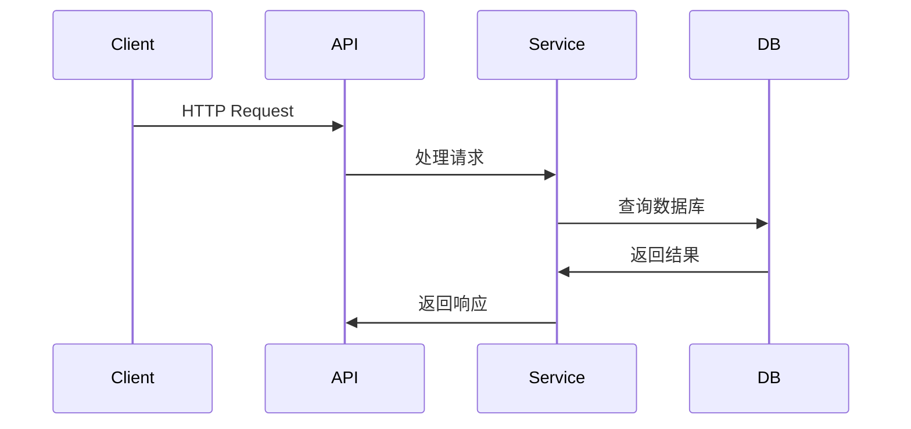

# 数据流图谱

> 生成时间:  | 链路数: 21 | 节点数: 1

## 请求链路

### Admin

> API: admin

### Agents

> API: agents

### Approvals

> API: approvals

### Auth

> API: auth

### Conversations

> API: conversations

### Dashboard

> API: dashboard

### Events

> API: events

### Files

> API: files

### Git Audit

> API: git_audit

### Hooks

> API: hooks

### Kanban

> API: kanban

### Knowledge

> API: knowledge

### Lark Bridge

> API: lark_bridge

### Lark Callback

> API: lark_callback

### Plans

> API: plans

### Project Groups

> API: project_groups

### Project Members

> API: project_members

### Projects

> API: projects

### Remote Agents

> API: remote_agents

### Rules

> API: rules

## 异步流程

### WebSocket 推送

**触发**: 状态变更

- 事件发布
- WebSocket Hub
- 推送到客户端

## 外部集成

### 飞书

- **方向**: 
- **协议**: 
