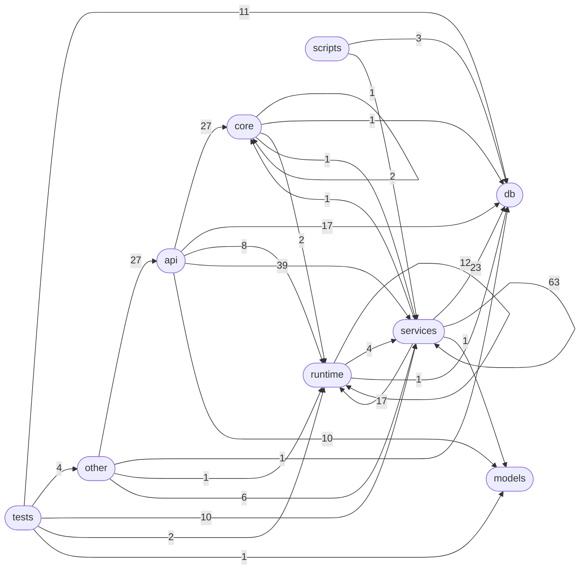

# 模块依赖图

> 生成时间: 2026-06-24T02:53:15Z | 模块数: 92 | 依赖边数: 296

## 分层概览

| 层 | 模块数 | 说明 |
|----|-------|------|
| api | 27 | API 路由层 |
| services | 31 | 业务服务层 |
| runtime | 8 | 底层执行层 |
| db | 1 | 数据库引擎 |
| core | 2 | 核心依赖与安全 |
| models | 1 | 数据模型 |
| scripts | 6 | 脚本工具 |
| tests | 14 | 测试 |

## 跨层依赖统计

## 模块详情

### api

| 模块 | 文件 | 行数 | 内部依赖 | 被依赖 | 说明 |
|------|------|------|---------|--------|------|
| `admin` | `backend/api/admin.py` | 442 | 5 | 1 | 管理员后台 API：用户的增删改查与密码重置。 |
| `agents` | `backend/api/agents.py` | 94 | 4 | 1 | Agent 运行时状态 API。 |
| `approvals` | `backend/api/approvals.py` | 226 | 3 | 1 | Approvals API — 审批流 REST 接口。 |
| `auth` | `backend/api/auth.py` | 334 | 5 | 1 | 认证 API 路由。 |
| `conversations` | `backend/api/conversations.py` | 107 | 2 | 1 | Conversations API — 会话管理路由。 |
| `dashboard` | `backend/api/dashboard.py` | 1097 | 7 | 1 |  |
| `events` | `backend/api/events.py` | 69 | 2 | 1 | 事件补偿 API — 重连后拉取缺失事件 |
| `hooks` | `backend/api/hooks.py` | 140 | 2 | 1 | Hooks 事件驱动 API 路由。 |
| `kanban` | `backend/api/kanban.py` | 180 | 5 | 1 | Kanban 聚合 API 路由。 |
| `knowledge` | `backend/api/knowledge.py` | 252 | 2 | 1 | 知识图谱 API。 |
| `lark_bridge` | `backend/api/lark_bridge.py` | 48 | 2 | 1 | Lark Bridge API 端点。 |
| `lark_callback` | `backend/api/lark_callback.py` | 151 | 1 | 1 | Lark 卡片回调 webhook 路由。 |
| `plans` | `backend/api/plans.py` | 304 | 5 | 1 | Plan API 路由。 |
| `project_groups` | `backend/api/project_groups.py` | 794 | 6 | 1 | 项目组 API 路由。 |
| `project_members` | `backend/api/project_members.py` | 303 | 2 | 1 | 项目成员管理 API。 |
| `projects` | `backend/api/projects.py` | 899 | 10 | 1 | 项目 API 路由。 |
| `remote_agents` | `backend/api/remote_agents.py` | 539 | 2 | 1 | 远程 A2A Agent 管理 API。 |
| `rules` | `backend/api/rules.py` | 143 | 2 | 1 | Rules 规则引擎 API 路由。 |
| `schedules` | `backend/api/schedules.py` | 209 | 4 | 1 | Schedule API — 定时任务调度 CRUD + 触发。 |
| `security` | `backend/api/security.py` | 261 | 2 | 1 | Security 安全审查 API 路由。 |
| `sessions` | `backend/api/sessions.py` | 604 | 6 | 1 | 会话 API：合并 SQLite tasks 表（按 session_id 聚合）+ 本地 Agent 会话文件扫描。 |
| `skills` | `backend/api/skills.py` | 147 | 2 | 1 | Skills 知识库 API 路由。 |
| `tasks` | `backend/api/tasks.py` | 447 | 6 | 1 | 任务 API 路由。 |
| `versions` | `backend/api/versions.py` | 252 | 3 | 1 | 项目版本管理 API。 |
| `work_items` | `backend/api/work_items.py` | 655 | 4 | 1 | 工作项 API 路由。 |
| `workflows` | `backend/api/workflows.py` | 311 | 5 | 1 | Workflow API 路由。 |
| `ws` | `backend/api/ws.py` | 40 | 3 | 1 |  |

### core

| 模块 | 文件 | 行数 | 内部依赖 | 被依赖 | 说明 |
|------|------|------|---------|--------|------|
| `dependencies` | `backend/core/dependencies.py` | 211 | 4 | 24 | FastAPI 认证依赖注入。 |
| `security` | `backend/core/security.py` | 107 | 1 | 5 | JWT 生成/验证 + bcrypt 密码哈希工具。 |

### db

| 模块 | 文件 | 行数 | 内部依赖 | 被依赖 | 说明 |
|------|------|------|---------|--------|------|
| `engine` | `backend/db/engine.py` | 169 | 0 | 57 |  |

### models

| 模块 | 文件 | 行数 | 内部依赖 | 被依赖 | 说明 |
|------|------|------|---------|--------|------|
| `schemas` | `backend/models/schemas.py` | 435 | 0 | 12 |  |

### other

| 模块 | 文件 | 行数 | 内部依赖 | 被依赖 | 说明 |
|------|------|------|---------|--------|------|
| `__init__` | `backend/__init__.py` | 1 | 0 | 0 |  |
| `main` | `backend/main.py` | 135 | 35 | 4 |  |

### runtime

| 模块 | 文件 | 行数 | 内部依赖 | 被依赖 | 说明 |
|------|------|------|---------|--------|------|
| `__init__` | `backend/runtime/__init__.py` | 150 | 4 | 1 | backend.runtime — 从 tide_ws.py 提取的核心可复用模块。 |
| `a2a_client` | `backend/runtime/a2a_client.py` | 473 | 0 | 2 | A2A (Agent-to-Agent) JSON-RPC protocol client. |
| `adapters` | `backend/runtime/adapters.py` | 1292 | 6 | 6 | Agent 适配器：AgentAdapter 基类及 Codex / Claude / Qoder 三个子类。 |
| `config` | `backend/runtime/config.py` | 172 | 0 | 17 | 环境变量配置与常量。 |
| `executor` | `backend/runtime/executor.py` | 694 | 6 | 5 | AgentExecutor: 异步 Agent CLI 执行器 |
| `git_utils` | `backend/runtime/git_utils.py` | 919 | 0 | 5 | Git 异步操作工具模块。 |
| `plan_runtime` | `backend/runtime/plan_runtime.py` | 67 | 1 | 1 | 计划（Plan）运行时数据模型。 |
| `task_runtime` | `backend/runtime/task_runtime.py` | 104 | 0 | 5 | 任务运行时数据模型。 |

### scripts

| 模块 | 文件 | 行数 | 内部依赖 | 被依赖 | 说明 |
|------|------|------|---------|--------|------|
| `import_ecc_skills` | `backend/scripts/import_ecc_skills.py` | 208 | 2 | 0 | ECC Skills 批量导入脚本。 |
| `import_security_rules` | `backend/scripts/import_security_rules.py` | 184 | 1 | 0 | 导入预置安全规则到指定 workspace。 |
| `init_admin` | `backend/scripts/init_admin.py` | 41 | 2 | 0 | 独立脚本：初始化管理员用户。 |
| `migrate_auth` | `backend/scripts/migrate_auth.py` | 208 | 0 | 0 | 迁移脚本：将现有 Lark 用户关联到 users 表。 |
| `migrate_conversations` | `backend/scripts/migrate_conversations.py` | 453 | 0 | 0 | 从 .tide_state.json 以及本地 Codex/Claude/Qoder |
| `migrate_plans` | `backend/scripts/migrate_plans.py` | 164 | 0 | 0 | 将旧数据库 `lark2agent.db` 中的 plans / plan_tasks / conversations 数据 |

### services

| 模块 | 文件 | 行数 | 内部依赖 | 被依赖 | 说明 |
|------|------|------|---------|--------|------|
| `a2a_discovery` | `backend/services/a2a_discovery.py` | 545 | 1 | 0 | A2A Agent 发现与健康检查服务。 |
| `ai_decompose_service` | `backend/services/ai_decompose_service.py` | 304 | 2 | 1 | AI 需求分解服务。 |
| `approval_service` | `backend/services/approval_service.py` | 459 | 6 | 5 | ApprovalService — 审批流持久化 + 完整生命周期管理。 |
| `archive_service` | `backend/services/archive_service.py` | 205 | 0 | 5 | 归档状态服务 — 维护项目/会话的软删除标记。 |
| `auth_service` | `backend/services/auth_service.py` | 526 | 3 | 6 | AuthService — 认证业务逻辑层。 |
| `card_action_handler` | `backend/services/card_action_handler.py` | 554 | 5 | 1 | CardActionHandler — Lark 卡片按钮回调分发。 |
| `card_builder` | `backend/services/card_builder.py` | 941 | 0 | 3 | Lark 交互卡片构建工具（纯函数）。 |
| `chat_state` | `backend/services/chat_state.py` | 101 | 2 | 1 | chat_state.py — 聊天运行时状态管理 |
| `conversation_service` | `backend/services/conversation_service.py` | 285 | 1 | 5 | ConversationService — 会话管理持久化服务。 |
| `cost_service` | `backend/services/cost_service.py` | 287 | 1 | 2 | Token 成本计算与统计服务。 |
| `event_emitter` | `backend/services/event_emitter.py` | 232 | 3 | 8 | 统一事件发射系统 |
| `hook_engine` | `backend/services/hook_engine.py` | 460 | 3 | 3 | HookEngine — Hooks 事件驱动执行引擎。 |
| `kanban_service` | `backend/services/kanban_service.py` | 819 | 5 | 1 | KanbanService — 四维看板数据聚合。 |
| `knowledge_service` | `backend/services/knowledge_service.py` | 580 | 2 | 1 | 知识图谱服务。 |
| `lark_bridge` | `backend/services/lark_bridge.py` | 496 | 5 | 4 | LarkBridge: Lark API 发送/更新封装 + Web ↔ Lark 双向同步 |
| `lark_listener` | `backend/services/lark_listener.py` | 507 | 1 | 2 | LarkListener: Lark WebSocket 事件监听器 |
| `message_handler` | `backend/services/message_handler.py` | 1812 | 16 | 1 | MessageHandler: Lark 消息指令处理器 |
| `plan_executor` | `backend/services/plan_executor.py` | 948 | 7 | 3 | Plan 并行执行引擎（asyncio 驱动）。 |
| `plan_service` | `backend/services/plan_service.py` | 495 | 5 | 7 | PlanService — Plan CRUD + DAG 解析 + 时间线聚合。 |
| `project_discovery` | `backend/services/project_discovery.py` | 334 | 0 | 3 | 项目发现服务 - 通过扫描本地 Agent 会话文件发现项目 |
| `project_group_service` | `backend/services/project_group_service.py` | 312 | 1 | 9 | 项目组服务 — 管理跨仓库项目分组。 |
| `rule_service` | `backend/services/rule_service.py` | 321 | 1 | 2 | RuleService — Rules 规则引擎 CRUD + 分层匹配。 |
| `schedule_service` | `backend/services/schedule_service.py` | 642 | 6 | 4 | ScheduleService — 定时任务调度管理。 |
| `security_scanner` | `backend/services/security_scanner.py` | 358 | 1 | 2 | SecurityScanner — 安全扫描服务。 |
| `session_discovery` | `backend/services/session_discovery.py` | 551 | 1 | 6 | 会话发现服务 - 从本地 Agent 会话文件提供历史会话/任务数据。 |
| `skill_service` | `backend/services/skill_service.py` | 353 | 1 | 3 | SkillService — Skills 知识库 CRUD + 批量导入。 |
| `task_service` | `backend/services/task_service.py` | 926 | 10 | 11 | TaskService — 任务 CRUD + Agent 执行桥接层。 |
| `work_item_service` | `backend/services/work_item_service.py` | 2626 | 7 | 10 | WorkItemService — 工作项 CRUD + 流转引擎。 |
| `workflow_engine` | `backend/services/workflow_engine.py` | 1356 | 8 | 4 | WorkflowEngine — DAG 工作流执行引擎。 |
| `workflow_service` | `backend/services/workflow_service.py` | 287 | 1 | 3 | WorkflowService — 工作流定义 CRUD + 版本管理。 |
| `ws_hub` | `backend/services/ws_hub.py` | 73 | 0 | 9 |  |

### tests

| 模块 | 文件 | 行数 | 内部依赖 | 被依赖 | 说明 |
|------|------|------|---------|--------|------|
| `conftest` | `backend/tests/conftest.py` | 66 | 1 | 0 | Pytest 全局 fixture：数据库隔离 |
| `test_api_tasks` | `backend/tests/test_api_tasks.py` | 98 | 3 | 0 | API 端点集成测试 |
| `test_db_init` | `backend/tests/test_db_init.py` | 79 | 1 | 0 | 数据库初始化测试 |
| `test_git_config` | `backend/tests/test_git_config.py` | 79 | 1 | 0 |  |
| `test_git_merge_node` | `backend/tests/test_git_merge_node.py` | 248 | 1 | 0 | Tests for git_merge workflow node and work-item worktree isolation. |
| `test_kanban` | `backend/tests/test_kanban.py` | 157 | 4 | 0 | Tests for Kanban 聚合 API. |
| `test_plan_service` | `backend/tests/test_plan_service.py` | 88 | 2 | 0 | Tests for PlanService — Plan CRUD + DAG 解析. |
| `test_project_groups` | `backend/tests/test_project_groups.py` | 526 | 5 | 0 | 项目组功能单元测试。 |
| `test_projects_chat_count` | `backend/tests/test_projects_chat_count.py` | 55 | 2 | 0 | 列表接口 /api/projects 的 chat_count 必须为 None（JSON null）回归测试。 |
| `test_schedule_service` | `backend/tests/test_schedule_service.py` | 134 | 2 | 0 | Tests for ScheduleService — Schedule CRUD + toggle. |
| `test_task_service` | `backend/tests/test_task_service.py` | 101 | 2 | 0 | TaskService 单元测试 |
| `test_work_item_service` | `backend/tests/test_work_item_service.py` | 114 | 3 | 0 | WorkItemService 创建分支测试。 |
| `test_workflow_engine` | `backend/tests/test_workflow_engine.py` | 166 | 2 | 0 | Tests for WorkflowEngine — 线性工作流执行 (start→agent→end). |
| `test_ws_hub` | `backend/tests/test_ws_hub.py` | 118 | 1 | 0 | WebSocket Hub 测试 |
