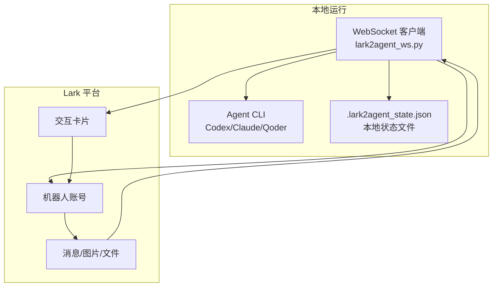
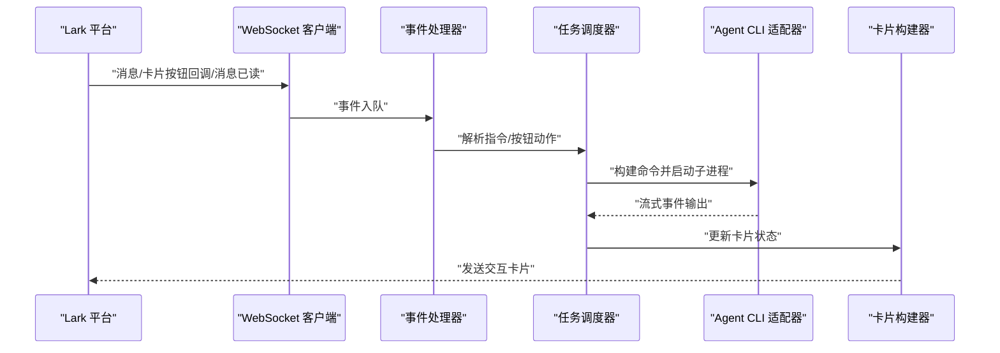
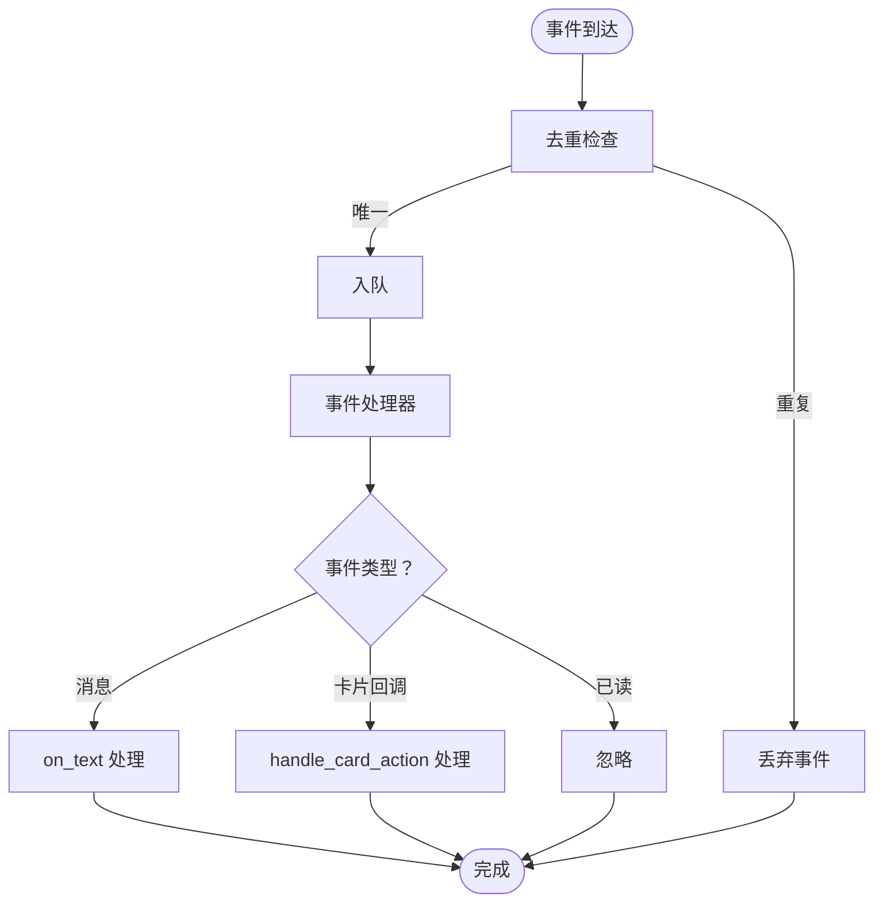
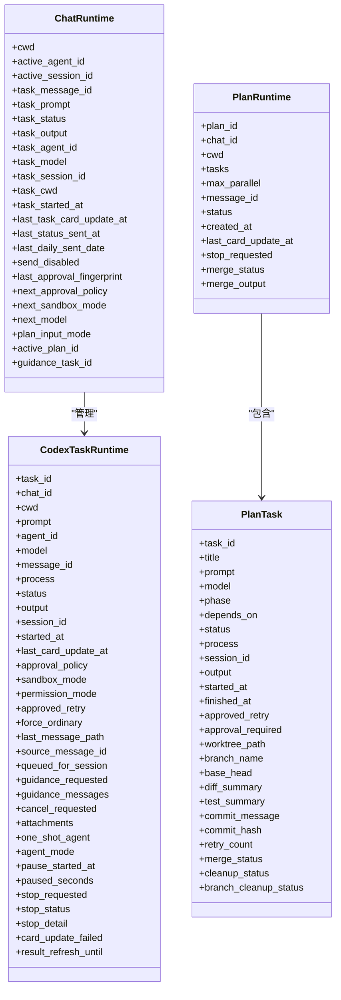
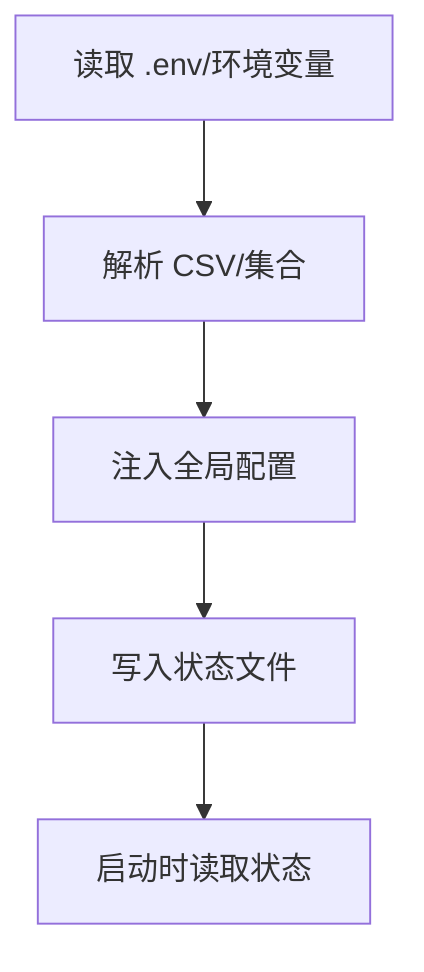
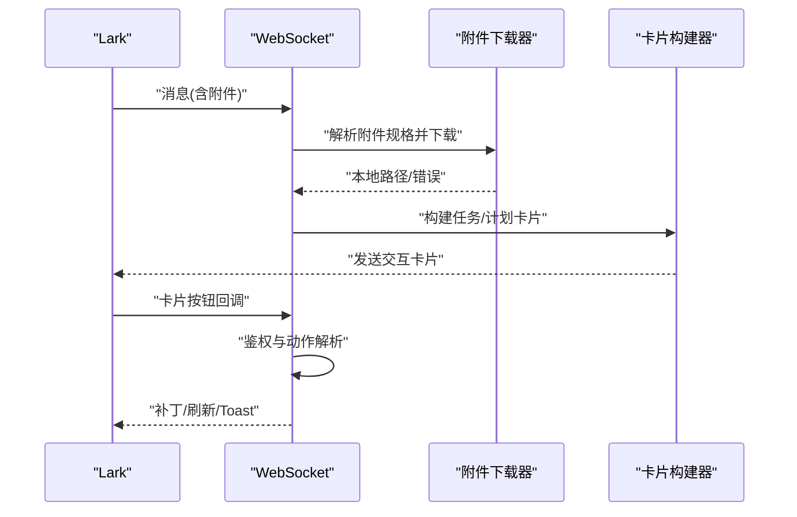
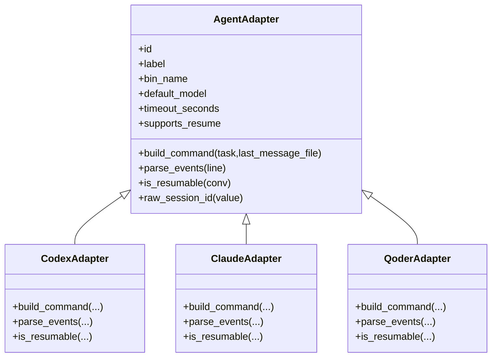
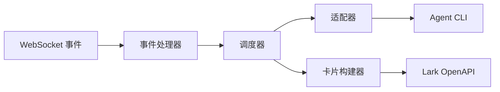

# API 参考

<cite>
**本文档引用的文件**
- [README.md](file://README.md)
- [lark2agent_ws.py](file://lark2agent_ws.py)
- [.gitignore](file://.gitignore)
</cite>

## 目录
1. [简介](#简介)
2. [项目结构](#项目结构)
3. [核心组件](#核心组件)
4. [架构总览](#架构总览)
5. [详细组件分析](#详细组件分析)
6. [依赖关系分析](#依赖关系分析)
7. [性能考量](#性能考量)
8. [故障排查指南](#故障排查指南)
9. [结论](#结论)
10. [附录](#附录)

## 简介
本文件为 Lark2Agent 的 API 参考文档，覆盖以下方面：
- 事件处理 API：消息接收、卡片按钮回调、消息已读事件的处理机制与 WebSocket 连接。
- 任务管理 API：普通任务与 Plan 并行任务的生命周期、状态、并发控制与持久化。
- 配置管理 API：环境变量、运行态持久化与访问控制。
- Lark 平台集成点：消息卡片构建、按钮回调、审批与状态同步。
- Agent CLI 集成：Codex、Claude Code、Qoder CLI 的命令行参数映射与输出解析。
- 使用示例、错误处理策略与最佳实践。

## 项目结构
- lark2agent_ws.py：主程序，包含 Lark WebSocket 事件处理、消息卡片构建、任务执行、审批与 Plan 并行调度、状态持久化与 macOS 保活。
- README.md：功能说明、安装与运行、Lark 使用方式、环境变量参考与常见问题。
- .gitignore：忽略文件与目录（含状态文件与日志）。

**图表来源**
- [lark2agent_ws.py:8569-8584](file://lark2agent_ws.py#L8569-L8584)
- [README.md:33-47](file://README.md#L33-L47)

**章节来源**
- [README.md:33-47](file://README.md#L33-L47)
- [.gitignore:1-14](file://.gitignore#L1-L14)

## 核心组件
- 事件处理与 WebSocket
  - WebSocket 客户端初始化与启动，注册事件处理器，启用消息、卡片按钮回调与消息已读事件。
  - 事件去重、重复事件过滤与队列化处理，保证高并发下的稳定性。
- 任务管理
  - 普通任务：任务运行态、卡片渲染、状态更新、审批与重试。
  - Plan 并行：任务解析、依赖与阶段、并发调度、worktree 隔离、测试与提交审批。
- 配置管理
  - 环境变量注入与默认值、CSV/集合解析、访问控制白名单与管理员权限。
  - 运行态持久化：聊天会话、任务、Plan、消息引用与附件缓存。
- Lark 平台集成
  - 交互卡片构建与更新、按钮回调处理、消息与附件下载、消息已读事件忽略。
- Agent CLI 集成
  - 适配器模式：Codex、Claude Code、Qoder CLI 的命令行参数拼装与流式输出解析。
  - 会话索引与续写、权限模式与超时控制、Qoder Quest 模式支持。

**章节来源**
- [lark2agent_ws.py:8569-8584](file://lark2agent_ws.py#L8569-L8584)
- [lark2agent_ws.py:8515-8528](file://lark2agent_ws.py#L8515-L8528)
- [lark2agent_ws.py:3663-3700](file://lark2agent_ws.py#L3663-L3700)
- [lark2agent_ws.py:8047-8182](file://lark2agent_ws.py#L8047-L8182)
- [lark2agent_ws.py:648-801](file://lark2agent_ws.py#L648-L801)
- [lark2agent_ws.py:804-846](file://lark2agent_ws.py#L804-L846)

## 架构总览
Lark2Agent 通过 lark-oapi WebSocket 客户端订阅 Lark 事件，解析消息与卡片按钮回调，驱动本地 Agent CLI 子进程执行任务，并将进度、结果与审批状态回写到 Lark 交互卡片。运行态与 Plan 状态持久化于本地 JSON 文件，支持脚本重启后的状态恢复。

**图表来源**
- [lark2agent_ws.py:8515-8528](file://lark2agent_ws.py#L8515-L8528)
- [lark2agent_ws.py:3897-4060](file://lark2agent_ws.py#L3897-L4060)
- [lark2agent_ws.py:648-801](file://lark2agent_ws.py#L648-L801)

## 详细组件分析

### 事件处理 API
- WebSocket 连接与启动
  - 初始化 lark-oapi WebSocket 客户端，设置 App ID/Secret 与域名。
  - 启动事件循环，打印启动提示与默认目录、会话目录信息。
- 事件类型与处理
  - 消息事件：解析文本、附件、引用消息，入事件队列。
  - 卡片按钮回调：解析 action 名称与元数据，授权校验后执行对应动作。
  - 消息已读事件：当前实现为忽略处理。
- 事件去重与队列
  - 基于事件 ID 去重，防止重复处理。
  - 事件队列最大积压受 LARK_EVENT_QUEUE_MAXSIZE 控制，满载时丢弃新事件。

**图表来源**
- [lark2agent_ws.py:8355-8368](file://lark2agent_ws.py#L8355-L8368)
- [lark2agent_ws.py:8515-8528](file://lark2agent_ws.py#L8515-L8528)

**章节来源**
- [lark2agent_ws.py:8569-8584](file://lark2agent_ws.py#L8569-L8584)
- [lark2agent_ws.py:8511-8513](file://lark2agent_ws.py#L8511-L8513)
- [lark2agent_ws.py:8047-8182](file://lark2agent_ws.py#L8047-L8182)

### 任务管理 API
- 普通任务
  - 任务运行态：任务 ID、聊天 ID、工作目录、提示词、模型、会话 ID、状态与输出、附件、审批策略与权限模式等。
  - 卡片渲染：根据状态选择颜色与按钮，支持自动刷新与结果回显。
  - 执行与解析：基于 Agent 适配器构建命令，启动子进程，解析流式事件，更新卡片。
  - 审批与重试：触发审批后，按批准后的策略重试原任务。
- Plan 并行任务
  - 任务解析：支持多种清单格式与阶段/依赖声明。
  - 并发调度：受 PLAN_MAX_PARALLEL 限制，按依赖满足情况启动子任务。
  - 隔离与收尾：默认使用 Git worktree 与分支隔离，子任务结束后运行 PLAN_TEST_COMMAND，进入“等待提交”状态，支持合并与清理。
- 并发与配额
  - 全局与单会话并发上限：MAX_RUNNING_TASKS、MAX_RUNNING_TASKS_PER_CHAT。
  - 自动刷新：TASK_CARD_REFRESH_INTERVAL_SECONDS 控制卡片刷新频率。

**图表来源**
- [lark2agent_ws.py:209-273](file://lark2agent_ws.py#L209-L273)
- [lark2agent_ws.py:343-385](file://lark2agent_ws.py#L343-L385)

**章节来源**
- [lark2agent_ws.py:3897-4060](file://lark2agent_ws.py#L3897-L4060)
- [lark2agent_ws.py:5651-5687](file://lark2agent_ws.py#L5651-L5687)
- [lark2agent_ws.py:6160-6167](file://lark2agent_ws.py#L6160-L6167)
- [lark2agent_ws.py:7237-7266](file://lark2agent_ws.py#L7237-L7266)

### 配置管理 API
- 环境变量注入
  - Lark：App ID/Secret、Domain、Encrypt Key、Verification Token。
  - Agent CLI：Bin 路径、Home、会话目录、默认模型、超时、权限模式、额外参数、项目根目录等。
  - 卡片与消息：消息分片、最终回复长度、面板展示数量、附件目录与大小限制、附件暂存 TTL、消息引用缓存上限等。
  - 审批与状态：审批等待与轮询间隔、定时状态推送、每日推送时间、状态文件位置、显示归档、Include Plan worktree、卡片转发、日志内容记录与级别等。
  - macOS 保活：接入电源自动保持、检查间隔、禁用睡眠开关。
  - 访问控制：允许的聊天群 ID、允许的用户 open_id、管理员 open_id、是否要求已知聊天。
- CSV/集合解析
  - LARK_ALLOWED_CHAT_IDS、LARK_ALLOWED_OPEN_IDS、LARK_ADMIN_OPEN_IDS 支持逗号/分号/空白分隔。
- 运行态持久化
  - 本地状态文件：.lark2agent_state.json，保存已知聊天、运行态、Plan 与消息引用缓存。
  - 读写原子化：临时文件写入后替换，确保一致性。

**图表来源**
- [lark2agent_ws.py:34-49](file://lark2agent_ws.py#L34-L49)
- [lark2agent_ws.py:154-159](file://lark2agent_ws.py#L154-L159)
- [lark2agent_ws.py:869-891](file://lark2agent_ws.py#L869-L891)
- [lark2agent_ws.py:1175-1182](file://lark2agent_ws.py#L1175-L1182)

**章节来源**
- [lark2agent_ws.py:34-49](file://lark2agent_ws.py#L34-L49)
- [lark2agent_ws.py:154-159](file://lark2agent_ws.py#L154-L159)
- [lark2agent_ws.py:869-891](file://lark2agent_ws.py#L869-L891)
- [lark2agent_ws.py:1175-1182](file://lark2agent_ws.py#L1175-L1182)

### Lark 平台集成 API
- 交互卡片
  - 构建与发送：send_card 将交互卡片内容通过 Lark OpenAPI 发送。
  - 卡片更新：支持补丁更新与刷新。
- 消息与附件
  - 附件下载：根据消息中的 file_key 下载图片/文件至本地目录，支持大小限制与去重。
  - 附件暂存：无文本消息的附件在 LARK_PENDING_ATTACHMENT_TTL_SECONDS 内可被下一条指令消费。
  - 消息引用缓存：记录消息引用关系，支持回复/引用找回附件。
- 按钮回调
  - 支持的动作：看板、项目、会话、状态、日报、任务刷新、任务引导、任务取消、桌面会话刷新、Plan 审批/合并/清理等。
  - 权限控制：敏感动作需要管理员权限。

**图表来源**
- [lark2agent_ws.py:1449-1539](file://lark2agent_ws.py#L1449-L1539)
- [lark2agent_ws.py:3663-3700](file://lark2agent_ws.py#L3663-L3700)
- [lark2agent_ws.py:8047-8182](file://lark2agent_ws.py#L8047-L8182)

**章节来源**
- [lark2agent_ws.py:1449-1539](file://lark2agent_ws.py#L1449-L1539)
- [lark2agent_ws.py:3663-3700](file://lark2agent_ws.py#L3663-L3700)
- [lark2agent_ws.py:8047-8182](file://lark2agent_ws.py#L8047-L8182)

### Agent CLI 集成 API
- 适配器模式
  - CodexAdapter：构建 codex exec 命令，支持模型、审批策略、沙箱模式与会话续写。
  - ClaudeAdapter：构建 claude --print --output-format stream-json 命令，支持模型、权限模式与额外参数。
  - QoderAdapter：构建 qodercli --print --output-format stream-json 命令，支持模型、权限模式、HOME 覆盖与 Quest 模式。
- 流式输出解析
  - Codex：解析 JSON 事件，提取 message/result/tool_output 等。
  - Claude/Qoder：解析 JSON 事件，提取 system/assistant/user/result/tool_* 等。
- 会话与权限
  - 会话索引：扫描各 Agent 会话目录，构建会话索引，支持续写。
  - 权限模式：Codex 使用 approval policy 与 sandbox mode；Claude/Qoder 使用 permission mode。

**图表来源**
- [lark2agent_ws.py:626-646](file://lark2agent_ws.py#L626-L646)
- [lark2agent_ws.py:648-681](file://lark2agent_ws.py#L648-L681)
- [lark2agent_ws.py:702-769](file://lark2agent_ws.py#L702-L769)
- [lark2agent_ws.py:771-801](file://lark2agent_ws.py#L771-L801)

**章节来源**
- [lark2agent_ws.py:626-646](file://lark2agent_ws.py#L626-L646)
- [lark2agent_ws.py:648-681](file://lark2agent_ws.py#L648-L681)
- [lark2agent_ws.py:702-769](file://lark2agent_ws.py#L702-L769)
- [lark2agent_ws.py:771-801](file://lark2agent_ws.py#L771-L801)

## 依赖关系分析
- 组件耦合
  - 事件处理器与任务调度器解耦，通过事件队列传递消息。
  - 适配器与 Agent CLI 解耦，通过命令行参数与流式输出解析对接。
  - 卡片构建器与 Lark OpenAPI 解耦，通过统一的 send_card 接口发送。
- 外部依赖
  - lark-oapi：WebSocket 事件订阅与消息发送。
  - Agent CLI：Codex、Claude Code、Qoder CLI。
  - macOS：caffeinate 与 pmset 用于保活。

**图表来源**
- [lark2agent_ws.py:8569-8584](file://lark2agent_ws.py#L8569-L8584)
- [lark2agent_ws.py:3663-3700](file://lark2agent_ws.py#L3663-L3700)

**章节来源**
- [lark2agent_ws.py:8569-8584](file://lark2agent_ws.py#L8569-L8584)
- [lark2agent_ws.py:3663-3700](file://lark2agent_ws.py#L3663-L3700)

## 性能考量
- 事件队列与并发
  - LARK_EVENT_QUEUE_MAXSIZE 控制事件积压上限，避免内存膨胀。
  - MAX_RUNNING_TASKS 与 MAX_RUNNING_TASKS_PER_CHAT 控制全局与会话并发，防止资源争用。
- 刷新与更新
  - TASK_CARD_REFRESH_INTERVAL_SECONDS 控制卡片自动刷新频率，平衡实时性与 Lark API 调用压力。
- 附件与 IO
  - LARK_ATTACHMENT_MAX_BYTES 限制单附件大小，避免大文件拖慢下载与解析。
  - 附件下载采用分块写入与临时文件，提升可靠性。
- macOS 保活
  - KEEP_AWAKE_ON_AC_POWER 与 KEEP_AWAKE_DISABLE_SLEEP 降低因系统休眠导致的中断风险。

[本节为通用指导，无需特定文件分析]

## 故障排查指南
- 收不到 Lark 消息
  - 检查机器人是否加入目标群聊、IM 权限是否开通、App ID/Secret/Encrypt Key/Verification Token 是否正确。
  - 查看日志中 send_card/send_msg 失败与权限错误。
- 审批批准后未继续执行
  - 确认脚本已重启并加载最新代码，检查 APPROVED_* 环境变量是否符合预期。
- Git 提交失败
  - 常见 .git/index.lock 权限不足，通过审批后使用批准后的 sandbox 配置单次重试。
- 电脑仍然睡眠
  - 普通 idle sleep 可用 caffeinate；合盖睡眠需 KEEP_AWAKE_DISABLE_SLEEP=1 或 sudo pmset -a disablesleep 1。

**章节来源**
- [README.md:474-511](file://README.md#L474-L511)

## 结论
Lark2Agent 通过轻量的 WebSocket 客户端与适配器模式，将 Lark 协作入口与本地 Agent CLI 执行能力高效整合，提供任务卡片、审批、Plan 并行与状态同步等工程化能力。通过完善的配置管理与运行态持久化，满足团队协作与远程工程控制的需求。

[本节为总结，无需特定文件分析]

## 附录

### API 使用示例
- 启动与运行
  - 前台运行：python3 lark2agent_ws.py
  - 后台运行：nohup python3 lark2agent_ws.py > lark2agent_ws.log 2>&1 &
  - Lark 内重启：/restart
- 常用指令
  - /panel、/projects、/convos、/status、/daily、/plan、/agent、/stop、/restart 等。
- 图片与文件
  - 发送图片/文件后，附件下载至 .lark2agent/attachments/<chat_id>/<message_id>/；无文本消息的附件可在 LARK_PENDING_ATTACHMENT_TTL_SECONDS 内被下一条指令消费。

**章节来源**
- [README.md:75-152](file://README.md#L75-L152)
- [README.md:211-218](file://README.md#L211-L218)

### 错误处理策略
- 事件去重：基于事件 ID 的去重集合，防止重复处理。
- 队列满载：丢弃新事件并记录错误日志。
- 发送失败：send_card 失败时禁用对应聊天发送并记录原因。
- 审批超时：PENDING_APPROVAL_WAIT_SECONDS 控制等待时间，超时后按默认策略继续。

**章节来源**
- [lark2agent_ws.py:8355-8368](file://lark2agent_ws.py#L8355-L8368)
- [lark2agent_ws.py:8506-8508](file://lark2agent_ws.py#L8506-L8508)
- [lark2agent_ws.py:3688-3698](file://lark2agent_ws.py#L3688-L3698)
- [lark2agent_ws.py:410-418](file://lark2agent_ws.py#L410-L418)

### 最佳实践
- 严格控制并发：合理设置 MAX_RUNNING_TASKS 与 MAX_RUNNING_TASKS_PER_CHAT，避免资源争用。
- 合理刷新频率：TASK_CARD_REFRESH_INTERVAL_SECONDS 不宜过低，避免频繁更新卡片。
- 附件管理：限制附件大小与数量，避免占用过多磁盘与网络带宽。
- 审批与权限：优先使用 Agent CLI 的 sandbox/approval policy，Lark 审批作为补充闭环。
- 状态持久化：定期检查 .lark2agent_state.json 权限与大小，避免影响运行。

**章节来源**
- [lark2agent_ws.py:6160-6167](file://lark2agent_ws.py#L6160-L6167)
- [lark2agent_ws.py:7237-7266](file://lark2agent_ws.py#L7237-L7266)
- [lark2agent_ws.py:1175-1182](file://lark2agent_ws.py#L1175-L1182)