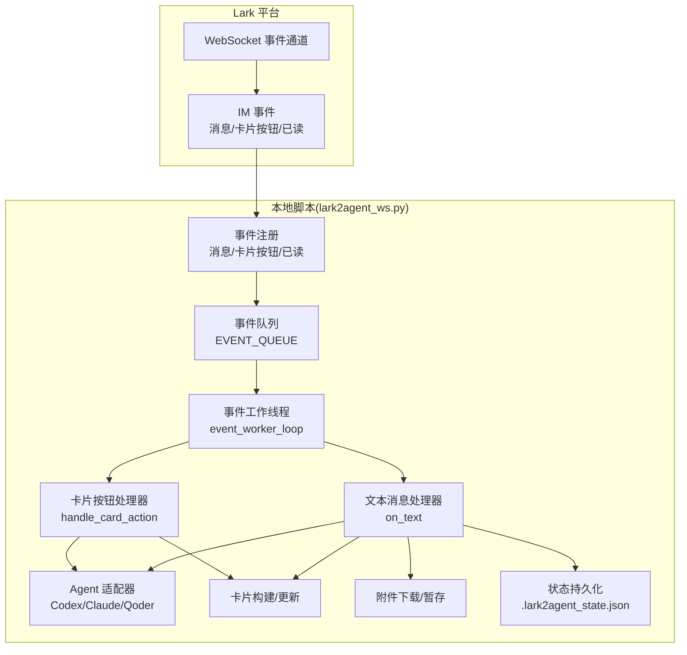
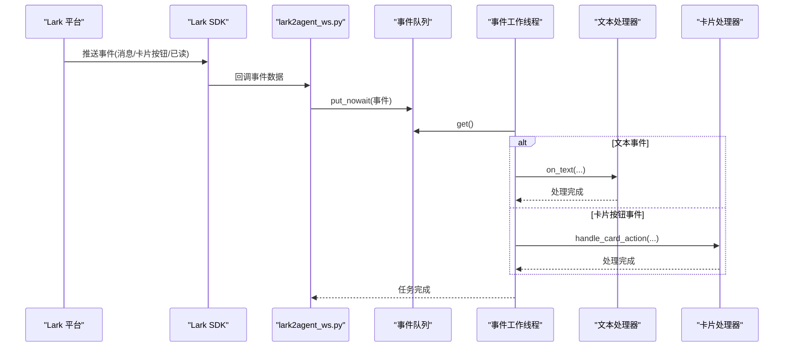
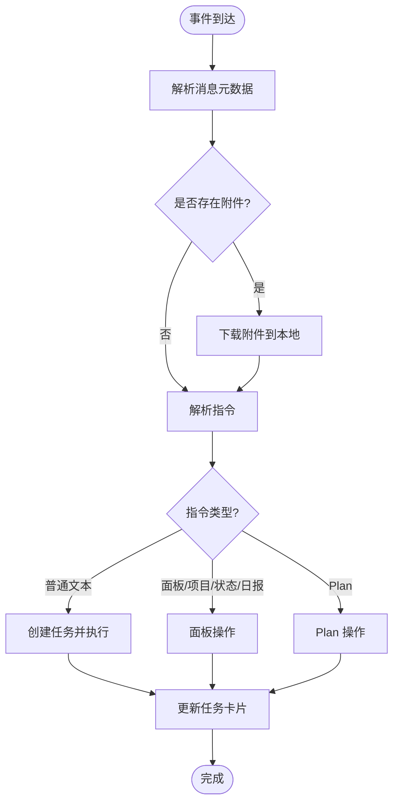
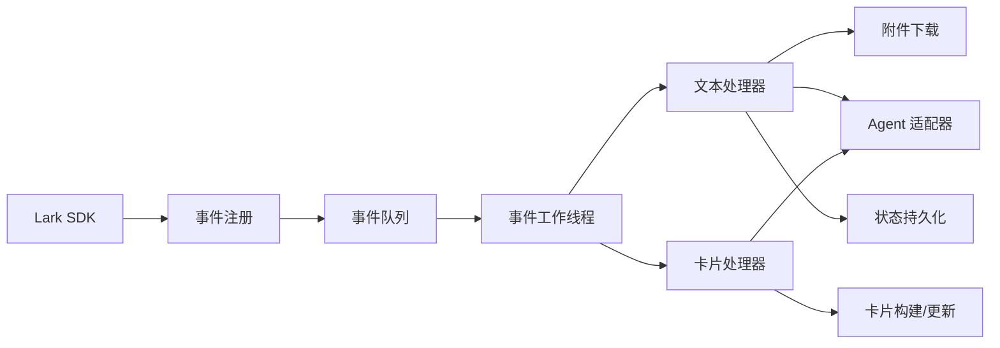

# WebSocket API

<cite>
**本文引用的文件**
- [lark2agent_ws.py](file://lark2agent_ws.py)
- [README.md](file://README.md)
</cite>

## 目录
1. [简介](#简介)
2. [项目结构](#项目结构)
3. [核心组件](#核心组件)
4. [架构总览](#架构总览)
5. [详细组件分析](#详细组件分析)
6. [依赖关系分析](#依赖关系分析)
7. [性能考量](#性能考量)
8. [故障排查指南](#故障排查指南)
9. [结论](#结论)
10. [附录](#附录)

## 简介
本文件系统性梳理 Lark2Agent 的 WebSocket API 设计与实现，覆盖连接建立、消息接收、事件处理、消息格式、事件类型、认证与安全、心跳与重连策略、序列化与反序列化、错误处理与异常、客户端集成与最佳实践等内容。目标是帮助开发者快速理解并正确集成 Lark WebSocket 事件通道，实现消息接收、卡片按钮回调、消息已读等事件的可靠处理。

## 项目结构
- 事件订阅与 WebSocket 连接由 Lark 官方 SDK 管理，本脚本负责事件路由与业务处理。
- 事件到达后统一进入事件队列，由事件工作线程分发到具体处理器（文本消息、卡片按钮回调等）。
- 事件处理器根据消息内容与上下文，驱动 Agent 执行、卡片更新、审批流程与状态同步。

图表来源
- [lark2agent_ws.py](file://lark2agent_ws.py)
- [README.md](file://README.md)

章节来源
- [lark2agent_ws.py](file://lark2agent_ws.py)
- [README.md](file://README.md)

## 核心组件
- 事件注册与路由
  - 通过 Lark SDK 订阅消息接收、卡片按钮回调、消息已读等事件。
  - 事件到达后统一放入事件队列，避免阻塞网络层。
- 事件队列与工作线程
  - 使用有界队列承载事件，防止内存膨胀。
  - 工作线程循环取出事件并分发至对应处理器。
- 事件处理器
  - 文本消息处理器：解析指令、处理附件、触发 Agent 执行、更新卡片。
  - 卡片按钮处理器：处理审批、停止、重启、计划操作等回调。
- 附件与状态管理
  - 附件下载与本地暂存，支持消息引用与回复/引用找回附件。
  - 运行时状态与计划状态持久化至本地文件，便于重启恢复。
- Agent 适配器
  - 统一 Codex、Claude Code、Qoder CLI 的命令构建与事件解析。

章节来源
- [lark2agent_ws.py](file://lark2agent_ws.py)

## 架构总览
WebSocket 事件在本地脚本内的流转如下：

图表来源
- [lark2agent_ws.py](file://lark2agent_ws.py)

章节来源
- [lark2agent_ws.py](file://lark2agent_ws.py)

## 详细组件分析

### 1) 连接建立与事件订阅
- 事件订阅范围
  - 消息接收事件
  - 消息已读事件
  - 卡片按钮回调事件
- 事件注册与回调
  - 通过 Lark SDK 注册事件回调，事件到达后统一进入本地处理器。
  - 重复事件检测：基于事件头的 event_id 去重，避免重复处理。
- 认证与安全
  - 使用 LARK_APP_ID、LARK_APP_SECRET、LARK_DOMAIN、LARK_ENCRYPT_KEY、LARK_VERIFICATION_TOKEN 等环境变量配置。
  - 事件来源校验：对 sender_id、sender_type、chat_id 等进行访问控制与授权判断。

章节来源
- [README.md](file://README.md)
- [lark2agent_ws.py](file://lark2agent_ws.py)

### 2) 消息接收与事件处理
- 文本消息处理流程
  - 解析消息元数据（sender_id、sender_type、message_id、root_id、parent_id、thread_id）。
  - 附件收集与下载：根据消息内容提取附件规格，调用资源接口下载到本地暂存目录。
  - 指令解析：根据指令前缀（如 /panel、/projects、/status、/daily、/plan、/agent 等）执行相应业务逻辑。
  - 任务创建与卡片更新：为每个任务生成 task_id，构建任务卡片并持续更新状态与输出。
  - 附件消费：若附件消息无文本，下一条普通指令可自动带上暂存附件。
- 卡片按钮回调处理
  - 审批：批准/拒绝高风险操作，按批准策略重试任务。
  - 停止：停止当前 Agent 任务。
  - 重启：原地重启脚本。
  - 计划：Plan 子任务的启动、停止、重试、合并、清理等操作。
- 消息已读事件
  - 当前实现为忽略处理，避免对业务造成干扰。

图表来源
- [lark2agent_ws.py](file://lark2agent_ws.py)

章节来源
- [lark2agent_ws.py](file://lark2agent_ws.py)

### 3) 消息格式与字段定义
- 事件头字段
  - event_id：事件唯一标识，用于去重。
  - sender_type：发送者类型（如 app 机器人）。
- 消息体字段
  - message_id：消息唯一标识。
  - root_id/parent_id/thread_id：用于消息树形关系（回复/引用）。
  - message_type：消息类型（如 text、image、file）。
  - content：消息内容（JSON 字符串），需解析为对象。
- 附件字段
  - image_key/file_key：资源标识。
  - file_name：文件名。
  - size：文件大小。
  - content_type：MIME 类型。
- 附件暂存与引用
  - 附件下载后保存在本地目录，路径与 message_id 关联。
  - 通过消息引用表（message_refs）记录任务、会话、工作目录、附件等上下文，支持回复/引用找回附件。

章节来源
- [lark2agent_ws.py](file://lark2agent_ws.py)

### 4) 事件类型与处理机制
- 消息接收事件
  - 文本消息：解析指令、处理附件、触发任务执行。
  - 图片/文件消息：下载附件并暂存，支持后续指令自动消费。
- 卡片按钮回调事件
  - 审批：批准/拒绝高风险操作，按批准策略重试。
  - 停止：停止当前任务。
  - 重启：原地重启脚本。
  - 计划：子任务的启动、停止、重试、合并、清理等。
- 消息已读事件
  - 当前忽略处理，避免对业务产生副作用。

章节来源
- [lark2agent_ws.py](file://lark2agent_ws.py)

### 5) 连接参数配置
- 认证参数
  - LARK_APP_ID、LARK_APP_SECRET、LARK_DOMAIN、LARK_ENCRYPT_KEY、LARK_VERIFICATION_TOKEN。
- 事件队列
  - LARK_EVENT_QUEUE_MAXSIZE：事件队列最大容量，满载时丢弃新事件。
- 附件与消息
  - LARK_ATTACHMENTS_DIR、LARK_ATTACHMENT_MAX_BYTES、LARK_PENDING_ATTACHMENT_TTL_SECONDS、MAX_LARK_ATTACHMENTS_PER_MESSAGE、MAX_LARK_MESSAGE_REFS。
- 状态与持久化
  - LARK2AGENT_STATE_FILE：本地状态文件路径。
  - LARK2AGENT_SHOW_ARCHIVED：是否显示归档内容。
- 访问控制
  - LARK_ALLOWED_CHAT_IDS、LARK_ALLOWED_OPEN_IDS、LARK_ADMIN_OPEN_IDS、LARK_REQUIRE_KNOWN_CHAT。
- 其他
  - LOG_MESSAGE_CONTENT：是否在日志中记录消息内容片段。
  - LOG_LEVEL：日志级别。

章节来源
- [README.md](file://README.md)
- [lark2agent_ws.py](file://lark2agent_ws.py)

### 6) 心跳机制与重连策略
- 心跳与保活
  - 脚本未内置 WebSocket 心跳发送逻辑；通过 Lark SDK 与平台协商维持连接。
  - macOS 保活：通过 KEEP_AWAKE_ON_AC_POWER、KEEP_AWAKE_CHECK_INTERVAL_SECONDS、KEEP_AWAKE_DISABLE_SLEEP 等参数在接入电源时保持网络活跃。
- 重连与补偿
  - 未实现客户端主动重连与事件补偿；若连接中断，需依赖平台重试与脚本重启恢复。
  - 事件去重：基于 event_id 的去重集合，避免重复处理。

章节来源
- [README.md](file://README.md)
- [lark2agent_ws.py](file://lark2agent_ws.py)

### 7) 消息序列化与反序列化
- 事件数据
  - 事件头与消息体均为 JSON 结构，使用标准 JSON 解析。
- 附件规格
  - 从消息内容中递归提取 image_key/file_key 等字段，构造附件规格列表。
- 本地状态
  - 任务运行时状态与计划状态以 JSON 写入本地文件，重启后恢复。

章节来源
- [lark2agent_ws.py](file://lark2agent_ws.py)

### 8) 错误处理与异常
- 事件去重
  - 基于 event_id 的去重集合，超过阈值自动清理。
- 事件队列满载
  - 丢弃新事件并记录错误日志，避免阻塞。
- 附件下载
  - 超过大小限制、下载异常、保存失败等情况均记录错误并返回错误信息。
- 访问控制
  - 对未授权的 chat_id、sender_id、admin_required 操作进行拒绝并记录警告。
- Agent 执行
  - 通过 Agent 适配器解析流式输出事件，统一转换为消息/进度/工具输出/完成等事件类型。

章节来源
- [lark2agent_ws.py](file://lark2agent_ws.py)

### 9) 客户端集成与最佳实践
- 集成步骤
  - 配置 Lark 应用与事件订阅，填写必要环境变量。
  - 启动脚本，确认 WebSocket 启动成功与欢迎语发送。
  - 在群聊中发送指令或点击卡片按钮，观察任务卡片状态变化。
- 最佳实践
  - 合理设置 LARK_EVENT_QUEUE_MAXSIZE，避免事件积压导致丢弃。
  - 对附件大小与数量进行限制，防止资源占用过高。
  - 使用访问控制参数限制允许的群聊与用户，提升安全性。
  - 定期备份本地状态文件，避免重启丢失运行态。
  - 在 macOS 上按需启用保活参数，确保长时间运行稳定性。

章节来源
- [README.md](file://README.md)
- [lark2agent_ws.py](file://lark2agent_ws.py)

## 依赖关系分析
- 组件耦合
  - 事件注册与路由与业务处理解耦，通过事件队列实现异步处理。
  - 事件处理器依赖附件下载、状态持久化、卡片构建等子系统。
- 外部依赖
  - Lark SDK：事件订阅与资源下载。
  - Agent CLI：Codex、Claude Code、Qoder CLI 的命令行接口。
- 潜在风险
  - 事件队列满载可能导致事件丢失。
  - 附件下载失败或超时影响任务执行。
  - 未实现心跳与重连，连接中断后需人工干预恢复。

图表来源
- [lark2agent_ws.py](file://lark2agent_ws.py)

章节来源
- [lark2agent_ws.py](file://lark2agent_ws.py)

## 性能考量
- 事件队列容量与吞吐
  - 合理设置 LARK_EVENT_QUEUE_MAXSIZE，避免频繁丢弃事件。
- 附件处理
  - 控制附件大小与数量，避免磁盘与内存压力。
- 并发与锁
  - 会话级运行锁避免并发写入会话文件。
  - 全局锁保护状态读写，注意临界区开销。
- 日志与调试
  - 适度开启 LOG_MESSAGE_CONTENT 与 LOG_LEVEL，平衡可观测性与性能。

章节来源
- [lark2agent_ws.py](file://lark2agent_ws.py)

## 故障排查指南
- 收不到 Lark 消息
  - 检查机器人是否加入目标群聊、权限是否开通、环境变量是否正确。
  - 查看日志中是否有 send_card/send_msg 失败或权限错误。
- 审批批准后未继续执行
  - 确认脚本已重启并加载最新代码。
  - 检查批准后的策略配置（APPROVED_*）是否符合预期。
- Git 提交失败
  - 通常为 sandbox 权限不足，批准后按批准策略重试。
- 电脑睡眠或合盖
  - 检查 KEEP_AWAKE_* 参数与系统权限，必要时手动设置 pmset。

章节来源
- [README.md](file://README.md)

## 结论
本 WebSocket API 通过 Lark SDK 事件通道实现消息接收、卡片按钮回调与已读事件的统一处理。脚本采用事件队列与工作线程解耦网络层与业务层，配合附件下载、状态持久化与 Agent 适配器，形成完整的任务执行闭环。当前实现未内置心跳与重连，建议结合平台能力与保活参数保证稳定性；未来可扩展事件补偿与客户端重连机制以提升鲁棒性。

## 附录
- 环境变量一览（节选）
  - LARK_APP_ID、LARK_APP_SECRET、LARK_DOMAIN、LARK_ENCRYPT_KEY、LARK_VERIFICATION_TOKEN
  - LARK_EVENT_QUEUE_MAXSIZE、LARK_ATTACHMENTS_DIR、LARK_ATTACHMENT_MAX_BYTES、LARK_PENDING_ATTACHMENT_TTL_SECONDS、MAX_LARK_ATTACHMENTS_PER_MESSAGE、MAX_LARK_MESSAGE_REFS
  - LARK2AGENT_STATE_FILE、LARK2AGENT_SHOW_ARCHIVED、LARK_ALLOWED_CHAT_IDS、LARK_ALLOWED_OPEN_IDS、LARK_ADMIN_OPEN_IDS、LARK_REQUIRE_KNOWN_CHAT
  - LOG_MESSAGE_CONTENT、LOG_LEVEL
  - KEEP_AWAKE_ON_AC_POWER、KEEP_AWAKE_CHECK_INTERVAL_SECONDS、KEEP_AWAKE_DISABLE_SLEEP

章节来源
- [README.md](file://README.md)
- [lark2agent_ws.py](file://lark2agent_ws.py)