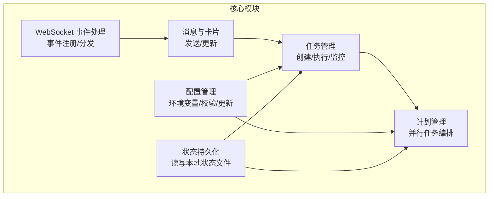
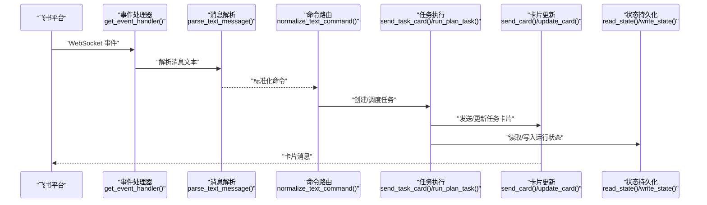
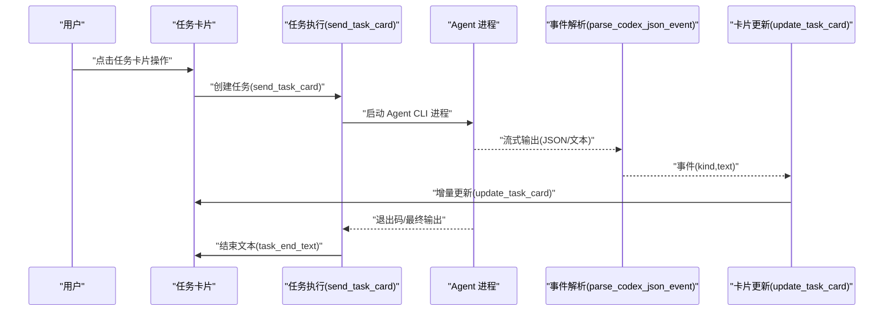
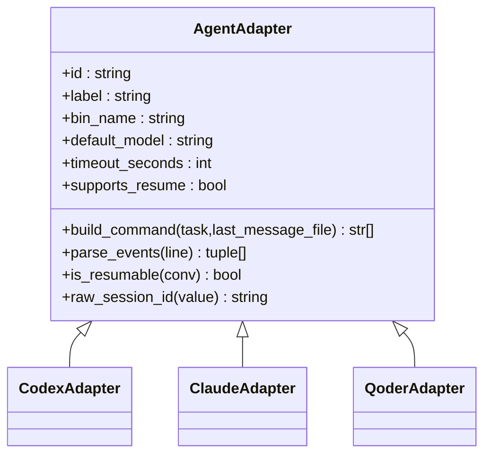
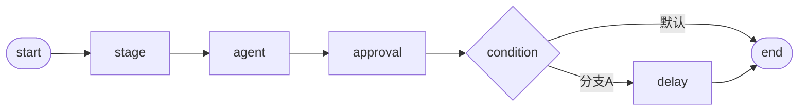
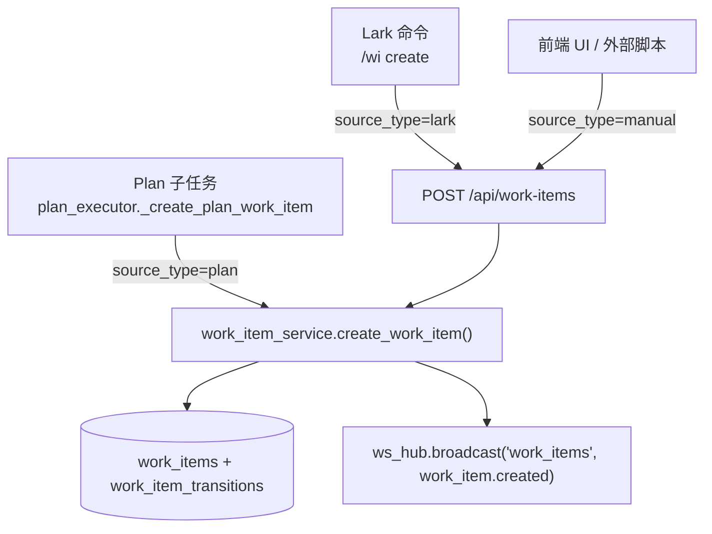
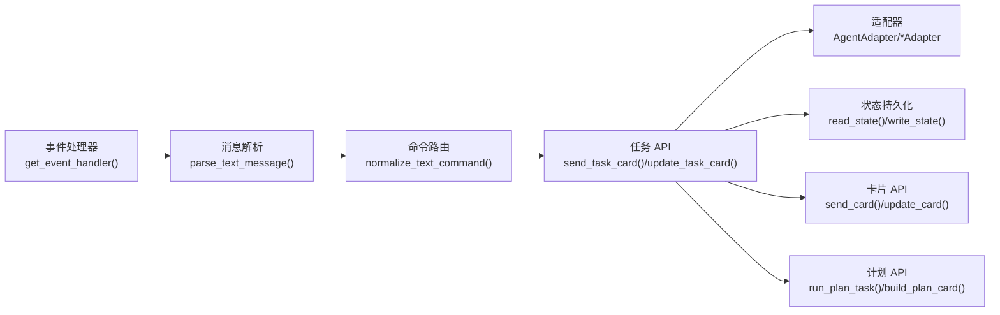

# 核心 API

<cite>
**本文档引用的文件**
- [tide_ws.py](file://tide_ws.py)
- [README.md](file://README.md)
- [backend/api/work_items.py](file://backend/api/work_items.py)
- [backend/api/kanban.py](file://backend/api/kanban.py)
- [backend/api/projects.py](file://backend/api/projects.py)
- [backend/services/work_item_service.py](file://backend/services/work_item_service.py)
- [backend/services/message_handler.py](file://backend/services/message_handler.py)
- [backend/services/plan_executor.py](file://backend/services/plan_executor.py)
- [backend/models/schemas.py](file://backend/models/schemas.py)
- [backend/db/init.sql](file://backend/db/init.sql)
</cite>

## 目录
1. [简介](#简介)
2. [项目结构](#项目结构)
3. [核心组件](#核心组件)
4. [架构总览](#架构总览)
5. [详细组件分析](#详细组件分析)
6. [工作项系统 API](#工作项系统-api)
7. [依赖分析](#依赖分析)
8. [性能考虑](#性能考虑)
9. [故障排查指南](#故障排查指南)
10. [结论](#结论)
11. [附录](#附录)

## 简介
本文件面向 Tide 的核心 API，聚焦三大领域：
- 事件处理 API：WebSocket 事件接收、消息解析与处理流程
- 任务管理 API：任务创建、执行、监控与状态更新
- 配置管理 API：环境变量加载、配置校验与运行时配置更新

文档提供函数原型、参数类型、默认值、返回值格式、使用示例、错误处理机制、异常类型与调试信息，并阐明各 API 之间的调用关系与依赖。

## 项目结构
- 主程序入口与核心逻辑集中在 tide_ws.py
- README.md 提供功能说明、安装与运行指引、环境变量说明与常见问题
- 项目采用模块化设计，围绕数据模型、适配器、消息与卡片、任务与计划、状态持久化等维度组织



**图表来源**
- [tide_ws.py:1642-1652](file://tide_ws.py#L1642-L1652)
- [tide_ws.py:3482-3524](file://tide_ws.py#L3482-L3524)
- [tide_ws.py:4029-4091](file://tide_ws.py#L4029-L4091)
- [tide_ws.py:4682-4701](file://tide_ws.py#L4682-L4701)
- [tide_ws.py:869-891](file://tide_ws.py#L869-L891)

**章节来源**
- [tide_ws.py:1642-1652](file://tide_ws.py#L1642-L1652)
- [tide_ws.py:3482-3524](file://tide_ws.py#L3482-L3524)
- [tide_ws.py:4029-4091](file://tide_ws.py#L4029-L4091)
- [tide_ws.py:4682-4701](file://tide_ws.py#L4682-L4701)
- [tide_ws.py:869-891](file://tide_ws.py#L869-L891)

## 核心组件
- 数据模型与运行时
  - ConversationInfo、ProjectInfo、ChatRuntime、CodexTaskRuntime、PlanRuntime、PlanTask、PendingApproval、DesktopSyncRuntime、LarkAttachment、LarkReferenceContext
- 适配器体系
  - AgentAdapter 及其子类 CodexAdapter、ClaudeAdapter、QoderAdapter，负责构建命令与解析事件
- 事件与消息
  - get_event_handler、send_msg、send_card、update_card、base_card、fields、action_row、md 等
- 任务与计划
  - send_task_card、update_task_card、build_task_card、run_plan_task、build_plan_card、update_plan_card 等
- 配置与状态
  - load_dotenv、read_state、write_state、save_runtime、load_known_chats、save_plans_state、load_plans_state 等

**章节来源**
- [tide_ws.py:173-397](file://tide_ws.py#L173-L397)
- [tide_ws.py:626-801](file://tide_ws.py#L626-L801)
- [tide_ws.py:1642-1652](file://tide_ws.py#L1642-L1652)
- [tide_ws.py:3482-3733](file://tide_ws.py#L3482-L3733)
- [tide_ws.py:4029-4143](file://tide_ws.py#L4029-L4143)
- [tide_ws.py:4682-4701](file://tide_ws.py#L4682-L4701)
- [tide_ws.py:869-1173](file://tide_ws.py#L869-L1173)

## 架构总览
Tide 通过 lark-oapi 的 EventDispatcherHandler 注册消息、已读、卡片动作三类事件回调，统一进入消息解析与路由逻辑。随后根据命令前缀与上下文选择 Agent 执行（Codex/Claude/Qoder），并以卡片形式持续反馈任务状态与结果。



**图表来源**
- [tide_ws.py:1642-1652](file://tide_ws.py#L1642-L1652)
- [tide_ws.py:1795-1847](file://tide_ws.py#L1795-L1847)
- [tide_ws.py:4029-4091](file://tide_ws.py#L4029-L4091)
- [tide_ws.py:3482-3524](file://tide_ws.py#L3482-L3524)
- [tide_ws.py:869-891](file://tide_ws.py#L869-L891)

## 详细组件分析

### 事件处理 API
- 事件注册与分发
  - get_event_handler(): 返回基于 LARK_ENCRYPT_KEY 与 LARK_VERIFICATION_TOKEN 的事件处理器，注册消息接收、消息已读、卡片动作触发回调
  - on_message/on_message_read/on_card_action: 事件回调入口，负责消息解析、命令识别与任务下发
- 消息解析与标准化
  - parse_text_message(): 从 Lark JSON 内容中提取纯文本
  - normalize_text_command(): 将中文别名与简写转换为标准命令前缀
  - strip_bridge_instruction_prefix()/strip_leading_lark_mentions(): 清洗与去噪
- Lark 附件处理
  - download_lark_message_attachments(): 下载图片/文件资源至本地目录
  - stash_pending_lark_attachments()/consume_pending_lark_attachments(): 附件暂存与消费
  - build_lark_attachment_prompt()/lark_attachment_summary_text(): 生成带附件的 Prompt 与摘要
- 引用上下文
  - lark_reference_ids()/lark_message_relation_meta(): 提取引用消息 ID
  - resolve_lark_reference_context()/apply_lark_reference_context(): 解析并应用引用上下文
  - record_incoming_lark_message()/record_task_lark_refs(): 记录消息引用，便于后续追踪

典型调用链
- WebSocket 事件到达 → get_event_handler() 注册回调 → on_message() 解析消息 → normalize_text_command() 标准化命令 → send_task_card()/run_plan_task() 创建任务 → send_card()/update_card() 更新卡片

**章节来源**
- [tide_ws.py:1642-1652](file://tide_ws.py#L1642-L1652)
- [tide_ws.py:1795-1847](file://tide_ws.py#L1795-L1847)
- [tide_ws.py:1449-1539](file://tide_ws.py#L1449-L1539)
- [tide_ws.py:1561-1580](file://tide_ws.py#L1561-L1580)
- [tide_ws.py:1622-1639](file://tide_ws.py#L1622-L1639)
- [tide_ws.py:1859-1964](file://tide_ws.py#L1859-L1964)
- [tide_ws.py:1877-1920](file://tide_ws.py#L1877-L1920)

### 任务管理 API
- 任务生命周期
  - send_task_card(): 创建任务并发送初始卡片，返回 task_id；设置 runtime/task 状态字段
  - update_task_card(): 更新任务卡片，控制刷新节流与失败重试
  - build_task_card(): 构建任务卡片元素（状态、Agent、目录、模型、耗时、附件、Session、排队/引导/审批等）
- 任务执行与流式输出
  - codex_task_command()/codex_command(): 基于当前 runtime 与任务参数构建 Agent CLI 命令
  - parse_codex_json_event()/parse_claude_conversation()/parse_qoder_json_event(): 解析 Agent 流式事件，产出 message/tool_output/progress/complete 等事件
  - send_stream_update()/update_existing_task_card(): 将流式输出写入卡片，避免重复消息
- 任务状态与结果
  - task_end_text()/synced_task_complete_text(): 生成任务结束文本（含耗时、目录、Agent、模型、Session、Git 状态等）
  - resolve_task_result(): 从会话文件或最后消息文件解析最终结果与用户问题
- 任务控制
  - cancel_queued_task()/request_task_guidance()/append_task_guidance(): 取消排队任务、追加引导
  - task_can_accept_guidance()/task_can_cancel(): 判断可否追加引导或取消
- 会话与上下文
  - get_runtime()/activate_conversation()/activate_project()/project_session_summary(): 维护会话与项目上下文
  - find_conversation_for_run()/conversation_matches_run(): 匹配运行中的会话



**图表来源**
- [tide_ws.py:4029-4091](file://tide_ws.py#L4029-L4091)
- [tide_ws.py:5012-5035](file://tide_ws.py#L5012-L5035)
- [tide_ws.py:5207-5254](file://tide_ws.py#L5207-L5254)
- [tide_ws.py:3185-3228](file://tide_ws.py#L3185-L3228)
- [tide_ws.py:4146-4143](file://tide_ws.py#L4146-L4143)

**章节来源**
- [tide_ws.py:4029-4091](file://tide_ws.py#L4029-L4091)
- [tide_ws.py:4094-4143](file://tide_ws.py#L4094-L4143)
- [tide_ws.py:5012-5035](file://tide_ws.py#L5012-L5035)
- [tide_ws.py:5207-5254](file://tide_ws.py#L5207-L5254)
- [tide_ws.py:3185-3228](file://tide_ws.py#L3185-L3228)
- [tide_ws.py:4146-4143](file://tide_ws.py#L4146-L4143)

### 计划管理 API（并行任务）
- 计划生命周期
  - build_plan_card()/update_plan_card(): 构建与更新 Plan 卡片，显示状态、并发、进度、依赖、工作树/分支、提交/合并/清理状态
  - build_plan_task_card()/build_plan_merge_card(): 子任务详情、合并总览卡片
  - build_plan_cleanup_confirm_card(): 清理确认卡片
- 子任务执行
  - run_plan_task(): 并行执行子任务，支持 worktree 隔离、测试命令、diff 摘要、提交信息生成与审批/提交流程
  - plan_task_command()/prepare_plan_worktree(): 构建命令与准备 worktree
- 依赖与状态
  - plan_task_dependencies_satisfied()/plan_status_label()/plan_summary(): 依赖满足性判断、状态标签与统计
  - plan_task_successful()/plan_task_terminal(): 结果判定与终止条件

#### Plan REST 端点（backend/api/plans.py）

以 `backend/api/plans.py` 中 `APIRouter(prefix="/api/plans")` 实际路由为准，端点清单如下：

| 方法 | 路径 | 说明 |
|---|---|---|
| POST | `/api/plans` | 创建 Plan，请求体为 `PlanCreate`（`workspace_id`、`definition`、`cwd`、`model`）；创建后自动开始执行，无需独立的 run 接口 |
| GET | `/api/plans` | Plan 列表，支持 `workspace_id`、`status`、`project`（按 cwd 精确匹配）、`session_id`（按子任务关联会话筛选）、`limit`（1–200，默认 50）、`offset` 查询参数 |
| GET | `/api/plans/{plan_id}` | Plan 详情，返回 `PlanResponse` |
| POST | `/api/plans/{plan_id}/stop` | 停止 Plan（取代旧 `cancel`，停止流程内置清理逻辑） |
| GET | `/api/plans/{plan_id}/dag` | 获取 DAG 结构（React Flow 格式 `PlanDAGResponse`），用于前端 DAG 可视化 |
| GET | `/api/plans/{plan_id}/timeline` | 获取 Gantt 时间线数据，返回 `list[PlanTimelineItem]` |
| GET | `/api/plans/{plan_id}/tasks` | 获取子任务列表，返回 `list[PlanTaskResponse]` |
| POST | `/api/plans/{plan_id}/tasks/{task_id}/retry` | 重试子任务 |
| POST | `/api/plans/{plan_id}/tasks/{task_id}/approve` | 审批子任务，以 approved 模式重启；非待审批状态返回 400 |
| POST | `/api/plans/{plan_id}/tasks/{task_id}/commit` | 提交或跳过子任务改动，请求体 `{ "commit": bool }`，默认 `true` |
| POST | `/api/plans/{plan_id}/tasks/{task_id}/merge` | cherry-pick 合并单个已提交子任务，冲突或失败返回 409 |
| POST | `/api/plans/{plan_id}/merge-all` | 按依赖顺序合并所有 committed 子任务（取代旧 `merge`，合并流程内置清理逻辑） |

说明：
- 旧版 `POST /api/plans/{id}/run` 已移除，Plan 在创建时自动进入执行流程。
- 旧版 `POST /api/plans/{id}/cancel` 已重命名为 `POST /api/plans/{id}/stop`。
- 旧版 `POST /api/plans/{id}/merge` 已重命名为 `POST /api/plans/{id}/merge-all`；同时新增针对单个子任务的 `POST /api/plans/{plan_id}/tasks/{task_id}/merge`。
- 旧版 `POST /api/plans/{id}/cleanup` 已移除，相应清理动作内置于 `stop` 与 `merge-all` 流程中。


**图表来源**
- [tide_ws.py:5471-5599](file://tide_ws.py#L5471-L5599)
- [tide_ws.py:4329-4340](file://tide_ws.py#L4329-L4340)
- [tide_ws.py:3046-3075](file://tide_ws.py#L3046-L3075)
- [tide_ws.py:3132-3166](file://tide_ws.py#L3132-L3166)

**章节来源**
- [tide_ws.py:4405-4505](file://tide_ws.py#L4405-L4505)
- [tide_ws.py:4508-4572](file://tide_ws.py#L4508-L4572)
- [tide_ws.py:4575-4627](file://tide_ws.py#L4575-L4627)
- [tide_ws.py:5471-5599](file://tide_ws.py#L5471-L5599)
- [tide_ws.py:4329-4340](file://tide_ws.py#L4329-L4340)
- [tide_ws.py:3046-3075](file://tide_ws.py#L3046-L3075)
- [tide_ws.py:3132-3166](file://tide_ws.py#L3132-L3166)

### 配置管理 API
- 环境变量加载
  - load_dotenv(path): 从 .env 文件注入环境变量，仅在未设置时写入
- 配置校验与默认值
  - normalize_agent_id()/normalize_agent_mode(): 标准化 Agent 与模式
  - normalize_qoder_permission_mode(): 校验并规范化 Qoder permission mode
  - parse_csv_set(): 解析逗号/分号/空格分隔的集合
  - is_allowed_cwd()/configured_allowed_roots(): 校验工作目录是否在允许范围内
- 运行时配置更新
  - set_runtime_agent()/active_agent_id(): 切换当前会话默认 Agent
  - runtime_task_cwd()/plan_task_cwd(): 获取任务/计划任务的工作目录
  - save_runtime()/load_known_chats(): 保存/加载运行时状态
  - save_plans_state()/load_plans_state(): 保存/加载计划状态
- 状态持久化
  - read_state()/write_state(): 读写本地状态文件（.tide_state.json），含 chats、message_refs、plans 等



**图表来源**
- [tide_ws.py:626-801](file://tide_ws.py#L626-L801)
- [tide_ws.py:409-425](file://tide_ws.py#L409-L425)
- [tide_ws.py:477-488](file://tide_ws.py#L477-L488)
- [tide_ws.py:557-568](file://tide_ws.py#L557-L568)
- [tide_ws.py:162-164](file://tide_ws.py#L162-L164)

**章节来源**
- [tide_ws.py:34-49](file://tide_ws.py#L34-L49)
- [tide_ws.py:409-425](file://tide_ws.py#L409-L425)
- [tide_ws.py:477-488](file://tide_ws.py#L477-L488)
- [tide_ws.py:557-568](file://tide_ws.py#L557-L568)
- [tide_ws.py:162-164](file://tide_ws.py#L162-L164)
- [tide_ws.py:869-1173](file://tide_ws.py#L869-L1173)

## 工作项系统 API

工作项（Work Item）是 Tide 项目侧的执行载体：每个工作项绑定到一个项目，由项目所绑定的工作流（Workflow Definition，含 `nodes` / `edges`）驱动状态流转。本节覆盖 [work_items.py](file://backend/api/work_items.py)、[kanban.py](file://backend/api/kanban.py) 中工作项相关路由、[projects.py](file://backend/api/projects.py) 中的项目-工作流绑定路由，以及背后的 [work_item_service.py](file://backend/services/work_item_service.py) 流转引擎。

### 端点总览

| 方法 | 路径 | 入参 | 响应 | 功能 |
| --- | --- | --- | --- | --- |
| `POST` | `/api/work-items` | `WorkItemCreate` | `WorkItemResponse` | 创建工作项；自动定位首个可见节点作为初始 `current_node_id`，若初始节点为 `agent` 则异步派发 task |
| `GET` | `/api/work-items` | query: `project_id?`, `status?` (`active`/`completed`) | `WorkItemResponse[]` | 列出工作项，按 `created_at DESC` 返回 |
| `GET` | `/api/work-items/{item_id}` | path: `item_id` | `WorkItemResponse` | 获取工作项详情，404 表示不存在 |
| `PATCH` | `/api/work-items/{item_id}` | `WorkItemUpdate` | `WorkItemResponse` | 仅更新 `title` / `description` / `priority` / `assignee` / `tags` / `metadata`，不触发流转 |
| `DELETE` | `/api/work-items/{item_id}` | path: `item_id` | `{ ok: true }` | 同时删除关联的 `work_item_transitions` 记录 |
| `POST` | `/api/work-items/{item_id}/transition` | `WorkItemTransitionRequest` | `WorkItemTransitionResponse` | 手动流转到任意 `target_node_id`（自由拖拽语义），并按节点类型触发后续动作 |
| `GET` | `/api/work-items/{item_id}/transitions` | path: `item_id` | `WorkItemTransitionResponse[]` | 获取该工作项的全部流转历史，按 `created_at ASC` |
| `GET` | `/api/kanban/work-items` | query: `project_id` (必填) | `WorkItemKanbanResponse` | 工作项看板：以 workflow 可见节点（含 `end`）作为列，按 `current_node_id` 分组 |
| `POST` | `/api/kanban/work-items/{item_id}/move` | `WorkItemTransitionRequest` | `WorkItemTransitionResponse` | 看板拖拽流转入口（与 `/transition` 等价，trigger_type=`manual`） |
| `PUT` | `/api/projects/{project_id}/workflow` | `ProjectSettingsUpdate` (`workflow_id` 必填) | `ProjectSettingsResponse` | 绑定项目到工作流（UPSERT `project_settings`） |
| `GET` | `/api/projects/{project_id}/workflow` | path: `project_id` | `ProjectSettingsResponse` | 查询项目的工作流绑定信息，404 表示未绑定 |
| `DELETE` | `/api/projects/{project_id}/workflow` | path: `project_id` | `{ ok: true, project_id }` | 解绑项目工作流 |

**章节来源**
- [backend/api/work_items.py:19-96](file://backend/api/work_items.py#L19-L96)
- [backend/api/kanban.py:51-74](file://backend/api/kanban.py#L51-L74)
- [backend/api/projects.py:498-529](file://backend/api/projects.py#L498-L529)

### 请求 / 响应模型

以下模型定义于 [backend/models/schemas.py](file://backend/models/schemas.py#L296-L378)，与 SQLite 表结构一一对应。

#### WorkItemCreate（请求体）
```json
{
  "project_id": "<string, 必填>",
  "title": "<string, 必填>",
  "description": "<string?>",
  "priority": 0,
  "assignee": "<string?>",
  "tags": ["<string>"],
  "source_type": "manual",
  "source_id": "<string?>",
  "metadata": { }
}
```
- `source_type` 取值：`manual`（默认，前端 UI / 直接 API 创建）、`lark`（Lark `/wi` 命令）、`plan`（Plan 子任务派生）；`source_id` 用于回链来源（chat_id、plan_task_id 等）。
- 若项目未通过 `/api/projects/{project_id}/workflow` 绑定工作流，创建会以 HTTP 400 报错：`Project {project_id} has no workflow bound. Use set_project_workflow first.`。

#### WorkItemUpdate（请求体）
```json
{
  "title": "<string?>",
  "description": "<string?>",
  "priority": 0,
  "assignee": "<string?>",
  "tags": ["<string>"],
  "metadata": { }
}
```
仅传入需要修改的字段；`current_node_id` / `workflow_id` / `project_id` 不可通过此接口修改。

#### WorkItemResponse（响应体）
```json
{
  "id": "<uuid>",
  "project_id": "<string>",
  "workflow_id": "<uuid>",
  "current_node_id": "<node_id>",
  "title": "<string>",
  "description": "<string?>",
  "priority": 0,
  "assignee": "<string?>",
  "tags": ["<string>"],
  "source_type": "manual|lark|plan",
  "source_id": "<string?>",
  "metadata": { },
  "started_at": "<ISO8601>",
  "completed_at": "<ISO8601?>",
  "created_at": "<ISO8601>",
  "updated_at": "<ISO8601>"
}
```
`completed_at` 仅在工作项流转到 `end` 节点时由后端写入。

#### WorkItemTransitionRequest / Response
```json
// Request
{
  "target_node_id": "<node_id, 必填>",
  "operator": "<string?>"  // 缺省记为 "system"
}

// Response
{
  "id": "<uuid>",
  "work_item_id": "<uuid>",
  "from_node_id": "<node_id?>",  // 首次创建时为 null
  "to_node_id": "<node_id>",
  "trigger_type": "create|manual|condition|delay|agent_completed|approval_approved",
  "task_id": "<uuid?>",          // agent 节点关联的 task
  "operator": "<string?>",
  "output": "<string?>",          // agent 节点完成后写回的结果
  "created_at": "<ISO8601>"
}
```

#### WorkItemKanbanResponse（看板响应）
```json
{
  "columns": [
    {
      "id": "<node_id>",
      "label": "<string>",
      "category": "stage|agent|approval|delay|end",
      "items": [WorkItemResponse]
    }
  ],
  "workflow": { "id": "<uuid>", "name": "<string>" }
}
```
看板列由 workflow definition 中的可见节点（`stage` / `agent` / `approval` / `delay` / `end`）按拓扑序生成；未绑定工作流时返回 `{ "columns": [], "workflow": null }`。

#### ProjectSettingsUpdate / Response
```json
// Update（PUT body）
{ "workflow_id": "<uuid?>", "default_assignee": "<string?>", "metadata": { } }

// Response
{
  "project_id": "<string>",
  "workflow_id": "<uuid?>",
  "default_assignee": "<string?>",
  "metadata": { },
  "updated_at": "<ISO8601>"
}
```

**章节来源**
- [backend/models/schemas.py:296-378](file://backend/models/schemas.py#L296-L378)
- [backend/db/init.sql:202-242](file://backend/db/init.sql#L202-L242)

### 数据表结构

```sql
-- work_items：工作项主表
CREATE TABLE work_items (
    id TEXT PRIMARY KEY,
    project_id TEXT NOT NULL,
    workflow_id TEXT NOT NULL,
    current_node_id TEXT NOT NULL,
    title TEXT NOT NULL,
    description TEXT,
    priority INTEGER DEFAULT 0,
    assignee TEXT,
    tags TEXT,                 -- JSON list
    source_type TEXT DEFAULT 'manual',
    source_id TEXT,
    metadata TEXT,             -- JSON object
    started_at TIMESTAMP,
    completed_at TIMESTAMP,    -- 仅在到达 end 节点时写入
    created_at TIMESTAMP DEFAULT CURRENT_TIMESTAMP,
    updated_at TIMESTAMP DEFAULT CURRENT_TIMESTAMP
);

-- work_item_transitions：流转流水（每次推进一条）
CREATE TABLE work_item_transitions (
    id TEXT PRIMARY KEY,
    work_item_id TEXT NOT NULL REFERENCES work_items(id),
    from_node_id TEXT,          -- 首次创建为 NULL
    to_node_id TEXT NOT NULL,
    trigger_type TEXT DEFAULT 'manual',
    task_id TEXT,               -- agent 节点关联的 task
    operator TEXT,
    output TEXT,                -- task 完成后回填
    created_at TIMESTAMP DEFAULT CURRENT_TIMESTAMP
);

-- project_settings：项目-工作流绑定
CREATE TABLE project_settings (
    project_id TEXT PRIMARY KEY,
    workflow_id TEXT,
    default_assignee TEXT,
    metadata TEXT,
    updated_at TIMESTAMP DEFAULT CURRENT_TIMESTAMP
);
```

**章节来源**
- [backend/db/init.sql:202-242](file://backend/db/init.sql#L202-L242)

### 工作项状态流转规则

工作项不存在传统的 `pending/running/done` 字段，而是以 `current_node_id` 指向工作流中的某个节点；节点类型决定到达后的行为：

| 节点类型 | 是否可见列 | 到达节点时的动作 | trigger_type 写入 |
| --- | --- | --- | --- |
| `start` | 否 | 仅作为入口，BFS 跳过；创建工作项时自动落到下游第一个可见节点 | `create`（首次记录） |
| `stage` | 是 | 纯停留，等待外部手动推进 | 调用方传入（默认 `manual`） |
| `agent` | 是 | 自动调用 `task_service.create_task` 创建 task；task 完成后通过 `on_work_item_task_completed` 回写 `transition.output` 并自动推进到下一节点 | `agent_completed` |
| `approval` | 是 | 调用 `approval_service.create_approval`，等待审批回调 `on_work_item_approval_resolved`；通过则推进，拒绝则停留 | `approval_approved` |
| `condition` | 否 | 评估 `data.conditions`（`eq` / `neq` / `contains` / `gt` / `lt`）选定下游边，递归调用 `transition_work_item` | `condition` |
| `delay` | 是 | `asyncio.sleep(seconds)` 后自动推进到第一个下游节点 | `delay` |
| `end` | 是（看板列） | 写入 `work_items.completed_at`，工作项进入完成态 | 调用方传入 |

关键约束：
- **自由拖拽**：`POST /transition` 不强制 `target_node_id` 必须是 `from_node_id` 的直接下游，只校验该节点存在于 workflow definition 中（`Node {node_id} not found in workflow.` → HTTP 400）。
- **幂等性**：agent 节点完成回调同时由事件驱动 + 后台轮询兜底（`_wait_and_record_output`，最长 ~2 小时），`on_work_item_task_completed` 通过比对 `current_node_id` 防止重复推进。
- **可见节点**：仅 `stage / agent / approval / delay` 计入 `VISIBLE_NODE_TYPES`；看板列额外纳入 `end`（`BOARD_COLUMN_NODE_TYPES`），让已完成工作项也能在最后一列展示。
- **WebSocket 广播**：`create` / `update` / `delete` / `transition` 均通过 `ws_hub.broadcast("work_items", ...)` 推送 `work_item.created` / `work_item.updated` / `work_item.deleted` / `work_item.transitioned` 事件。



**章节来源**
- [backend/services/work_item_service.py:50-103](file://backend/services/work_item_service.py#L50-L103)
- [backend/services/work_item_service.py:476-569](file://backend/services/work_item_service.py#L476-L569)
- [backend/services/work_item_service.py:589-820](file://backend/services/work_item_service.py#L589-L820)
- [backend/services/work_item_service.py:823-1002](file://backend/services/work_item_service.py#L823-L1002)

### 三大创建入口

所有入口最终都汇聚到 `work_item_service.create_work_item()`，差异仅在 `source_type` / `source_id` 与触发上下文：

#### 1. Lark 命令 `/wi create`
聊天侧通过 `MessageHandler._cmd_work_item` 处理 `/wi create <标题>`：先用当前会话的 `active_project_key` 解析 `project_id`（base64 路径编码），再调用 `create_work_item`，写入 `source_type="lark"`、`source_id=chat_id`，结果以纯文本形式回复用户。
- 用法：`/wi create <标题>` / `/wi list` / `/wi move <item_id> <stage_label>`
- 失败时返回 `❌ 请先使用 /cd 切换到项目目录` 或具体异常文本。

#### 2. 手动 API / UI 创建（`source_type="manual"`）
前端工作项页面与外部脚本通过 `POST /api/work-items` 直接创建，body 即 `WorkItemCreate`。这是默认 `source_type`，对应纯人工录入或第三方系统集成。

#### 3. Plan 子任务派生（`source_type="plan"`）
Plan 执行器在为子任务派发 agent 任务的同时，调用 `PlanExecutor._create_plan_work_item`：
- 通过 Plan 的 `workflow_id` 反查 `project_settings` 找到绑定项目；
- 以 task 的 `prompt` 首行作为 `title`（截断 120 字符），`description` 为完整 prompt；
- `source_type="plan"`、`source_id=plan_task_id`，并在 `metadata` 写入 `plan_id` / `plan_task_id` / `workflow_id`，便于反向追踪；
- 异常被吞下，不影响 Plan 主流程。

> 说明：定时调度（Schedule）侧的 `task_type="workflow"` 通过 [WorkflowEngine.start_run](file://backend/services/workflow_engine.py) 触发 DAG 执行（`trigger_type="schedule"`），属于另一条 workflow run 路径，并不直接产生 `work_items` 记录；如需让 Schedule 派生工作项，应改用 `task_type="agent"` 或在工作流节点内显式调用 `create_work_item`。



**章节来源**
- [backend/services/message_handler.py:711-760](file://backend/services/message_handler.py#L711-L760)
- [backend/services/plan_executor.py:878-944](file://backend/services/plan_executor.py#L878-L944)
- [backend/services/work_item_service.py:226-327](file://backend/services/work_item_service.py#L226-L327)

### 错误码与异常

| HTTP | 触发条件 |
| --- | --- |
| 400 | `target_node_id` 缺失；项目未绑定工作流；`Node {id} not found in workflow.`；`Workflow {id} has no visible nodes.` |
| 404 | `Work item not found`；`Workflow {id} not found.`；`Project workflow not bound`（GET 项目工作流） |
| 500 | `Failed to create work item`（service 返回 None）；`Failed to bind workflow` |

## 依赖分析
- 组件耦合
  - 事件处理依赖消息解析与命令标准化，再驱动任务管理
  - 任务管理依赖适配器体系与状态持久化
  - 计划管理在任务管理之上，增加并行与依赖控制
- 外部依赖
  - lark-oapi：事件回调与消息/卡片发送
  - Agent CLI：Codex、Claude Code、Qoder CLI
  - Git：工作树隔离与状态检查
- 关键依赖关系图



**图表来源**
- [tide_ws.py:1642-1652](file://tide_ws.py#L1642-L1652)
- [tide_ws.py:1795-1847](file://tide_ws.py#L1795-L1847)
- [tide_ws.py:4029-4091](file://tide_ws.py#L4029-L4091)
- [tide_ws.py:626-801](file://tide_ws.py#L626-L801)
- [tide_ws.py:869-891](file://tide_ws.py#L869-L891)
- [tide_ws.py:3482-3524](file://tide_ws.py#L3482-L3524)
- [tide_ws.py:4682-4701](file://tide_ws.py#L4682-L4701)

**章节来源**
- [tide_ws.py:1642-1652](file://tide_ws.py#L1642-L1652)
- [tide_ws.py:4029-4091](file://tide_ws.py#L4029-L4091)
- [tide_ws.py:626-801](file://tide_ws.py#L626-L801)
- [tide_ws.py:869-891](file://tide_ws.py#L869-L891)
- [tide_ws.py:3482-3524](file://tide_ws.py#L3482-L3524)
- [tide_ws.py:4682-4701](file://tide_ws.py#L4682-L4701)

## 性能考虑
- 事件解析与卡片更新节流：update_task_card/update_plan_card 控制最小更新间隔，避免频繁网络请求
- 流式输出缓冲：send_stream_update/事件解析缓冲，累积到阈值再更新，减少卡片更新次数
- 并行执行：PLAN_MAX_PARALLEL 控制子任务并发度，PLAN_USE_WORKTREES 与 PLAN_WORKTREE_ROOT 提升隔离与稳定性
- 目录限制：CODEX_ALLOWED_ROOTS 与 is_allowed_cwd 限制执行范围，降低越权与性能风险
- 超时控制：各 Agent timeout_seconds 与 PLAN_TEST_TIMEOUT_SECONDS 保障长时间任务可控

[本节为通用指导，无需特定文件分析]

## 故障排查指南
- 事件接收失败
  - 确认 LARK_APP_ID/LARK_APP_SECRET/LARK_ENCRYPT_KEY/LARK_VERIFICATION_TOKEN 配置正确
  - 检查日志中 send_card/send_msg 失败与权限错误
- 审批未生效
  - 确认脚本已重启并加载最新代码
  - 检查 APPROVED_* 环境变量是否符合预期
- Git 提交失败
  - Sandbox 权限不足导致 .git/index.lock 错误；通过审批后单次重试
- 任务卡更新失败
  - update_card 返回失败时会记录警告，脚本会保留 message_id 以便重试
- macOS 保活
  - KEEP_AWAKE_ON_AC_POWER=1 仅在接入电源时启用 caffeinate；如需合盖运行，参考 README 设置 KEEP_AWAKE_DISABLE_SLEEP

**章节来源**
- [tide_ws.py:3688-3702](file://tide_ws.py#L3688-L3702)
- [tide_ws.py:5427-5447](file://tide_ws.py#L5427-L5447)
- [README.md:474-511](file://README.md#L474-L511)

## 结论
Tide 通过清晰的事件处理、任务管理与配置管理 API，实现了从 Lark 消息到多 Agent CLI 的无缝桥接。其设计强调：
- 事件驱动与命令标准化
- 任务卡片化反馈与状态持久化
- 计划并行与依赖控制
- 配置校验与运行时更新
- 错误处理与调试可观测性

[本节为总结性内容，无需特定文件分析]

## 附录

### API 参考（函数原型、参数、返回值与示例）

- 事件处理
  - get_event_handler() → lark.EventDispatcherHandler
    - 作用：注册消息接收、消息已读、卡片动作回调
    - 示例：参见 [tide_ws.py:1642-1652](file://tide_ws.py#L1642-L1652)
  - parse_text_message(raw_content: str) → str
    - 作用：从 Lark JSON 内容提取纯文本
    - 示例：参见 [tide_ws.py:1795-1812](file://tide_ws.py#L1795-L1812)
  - normalize_text_command(content: str) → str
    - 作用：将中文别名与简写转换为标准命令前缀
    - 示例：参见 [tide_ws.py:1823-1847](file://tide_ws.py#L1823-L1847)
  - download_lark_message_attachments(chat_id: str, msg, meta: dict[str, str]) → (list[dict], list[str])
    - 作用：下载图片/文件资源并返回本地附件规范与错误列表
    - 示例：参见 [tide_ws.py:1449-1539](file://tide_ws.py#L1449-L1539)

- 消息与卡片
  - send_msg(chat_id: str, text: str) → void
    - 作用：发送交互式卡片消息
    - 示例：参见 [tide_ws.py:3482-3524](file://tide_ws.py#L3482-L3524)
  - send_card(chat_id: str, card: dict[str, Any]) → str
    - 作用：发送卡片并返回 message_id
    - 示例：参见 [tide_ws.py:3663-3703](file://tide_ws.py#L3663-L3703)
  - update_card(message_id: str, card: dict[str, Any]) → bool
    - 作用：更新已有卡片
    - 示例：参见 [tide_ws.py:3705-3732](file://tide_ws.py#L3705-L3732)
  - base_card(title: str, elements: list[dict], template: str = "blue") → dict
    - 作用：构造基础卡片结构
    - 示例：参见 [tide_ws.py:3735-3743](file://tide_ws.py#L3735-L3743)

- 任务管理
  - send_task_card(chat_id: str, prompt: str, status: str, model: str = "", agent_id: str = "", ...) → str
    - 作用：创建任务并发送初始卡片，返回 task_id
    - 示例：参见 [tide_ws.py:4029-4091](file://tide_ws.py#L4029-L4091)
  - update_task_card(chat_id: str, status: str = "", output: str = "", detail: str = "", force: bool = False, task_id: str = "") → bool
    - 作用：更新任务卡片，支持强制刷新与节流
    - 示例：参见 [tide_ws.py:4094-4143](file://tide_ws.py#L4094-L4143)
  - build_task_card(...) → dict
    - 作用：构建任务卡片元素
    - 示例：参见 [tide_ws.py:3897-4026](file://tide_ws.py#L3897-L4026)
  - codex_task_command(task: CodexTaskRuntime, last_message_file: Optional[Path] = None) → list[str]
    - 作用：构建 Agent CLI 命令
    - 示例：参见 [tide_ws.py:5033-5034](file://tide_ws.py#L5033-L5034)
  - parse_codex_json_event(line: str) → tuple[str, str]
    - 作用：解析 Codex 流式事件
    - 示例：参见 [tide_ws.py:5207-5254](file://tide_ws.py#L5207-L5254)

- 计划管理
  - run_plan_task(plan_id: str, task_id: str) → void
    - 作用：并行执行子任务，支持 worktree 隔离与测试命令
    - 示例：参见 [tide_ws.py:5471-5599](file://tide_ws.py#L5471-L5599)
  - build_plan_card(plan: PlanRuntime) → dict
    - 作用：构建 Plan 卡片
    - 示例：参见 [tide_ws.py:4405-4505](file://tide_ws.py#L4405-L4505)
  - build_plan_task_card(plan: PlanRuntime, task: PlanTask) → dict
    - 作用：构建子任务详情卡片
    - 示例：参见 [tide_ws.py:4508-4572](file://tide_ws.py#L4508-L4572)
  - build_plan_merge_card(plan: PlanRuntime) → dict
    - 作用：构建合并总览卡片
    - 示例：参见 [tide_ws.py:4575-4627](file://tide_ws.py#L4575-L4627)

- 配置管理
  - load_dotenv(path: Path = Path(".env")) → void
    - 作用：从 .env 注入环境变量
    - 示例：参见 [tide_ws.py:34-49](file://tide_ws.py#L34-L49)
  - read_state() → dict
    - 作用：读取本地状态文件
    - 示例：参见 [tide_ws.py:869-876](file://tide_ws.py#L869-L876)
  - write_state(state: dict) → void
    - 作用：写入本地状态文件
    - 示例：参见 [tide_ws.py:879-891](file://tide_ws.py#L879-L891)
  - save_runtime(chat_id: str) → void
    - 作用：保存运行时状态
    - 示例：参见 [tide_ws.py:983-1014](file://tide_ws.py#L983-L1014)
  - load_known_chats() → void
    - 作用：加载已知聊天的运行时状态
    - 示例：参见 [tide_ws.py:1017-1043](file://tide_ws.py#L1017-L1043)
  - save_plans_state() → void
    - 作用：保存计划状态
    - 示例：参见 [tide_ws.py:1152-1157](file://tide_ws.py#L1152-L1157)
  - load_plans_state() → void
    - 作用：加载计划状态
    - 示例：参见 [tide_ws.py:1160-1172](file://tide_ws.py#L1160-L1172)

**章节来源**
- [tide_ws.py:1642-1652](file://tide_ws.py#L1642-L1652)
- [tide_ws.py:1795-1812](file://tide_ws.py#L1795-L1812)
- [tide_ws.py:1823-1847](file://tide_ws.py#L1823-L1847)
- [tide_ws.py:1449-1539](file://tide_ws.py#L1449-L1539)
- [tide_ws.py:3482-3524](file://tide_ws.py#L3482-L3524)
- [tide_ws.py:3663-3703](file://tide_ws.py#L3663-L3703)
- [tide_ws.py:3705-3732](file://tide_ws.py#L3705-L3732)
- [tide_ws.py:3735-3743](file://tide_ws.py#L3735-L3743)
- [tide_ws.py:4029-4091](file://tide_ws.py#L4029-L4091)
- [tide_ws.py:4094-4143](file://tide_ws.py#L4094-L4143)
- [tide_ws.py:3897-4026](file://tide_ws.py#L3897-L4026)
- [tide_ws.py:5033-5034](file://tide_ws.py#L5033-L5034)
- [tide_ws.py:5207-5254](file://tide_ws.py#L5207-L5254)
- [tide_ws.py:5471-5599](file://tide_ws.py#L5471-L5599)
- [tide_ws.py:4405-4505](file://tide_ws.py#L4405-L4505)
- [tide_ws.py:4508-4572](file://tide_ws.py#L4508-L4572)
- [tide_ws.py:4575-4627](file://tide_ws.py#L4575-L4627)
- [tide_ws.py:34-49](file://tide_ws.py#L34-L49)
- [tide_ws.py:869-876](file://tide_ws.py#L869-L876)
- [tide_ws.py:879-891](file://tide_ws.py#L879-L891)
- [tide_ws.py:983-1014](file://tide_ws.py#L983-L1014)
- [tide_ws.py:1017-1043](file://tide_ws.py#L1017-L1043)
- [tide_ws.py:1152-1157](file://tide_ws.py#L1152-L1157)
- [tide_ws.py:1160-1172](file://tide_ws.py#L1160-L1172)