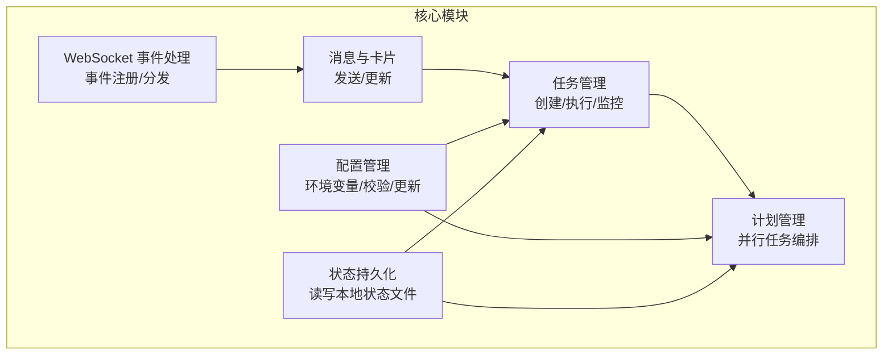
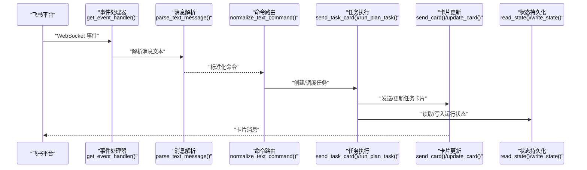
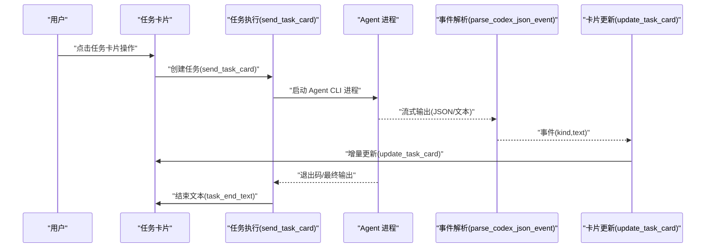
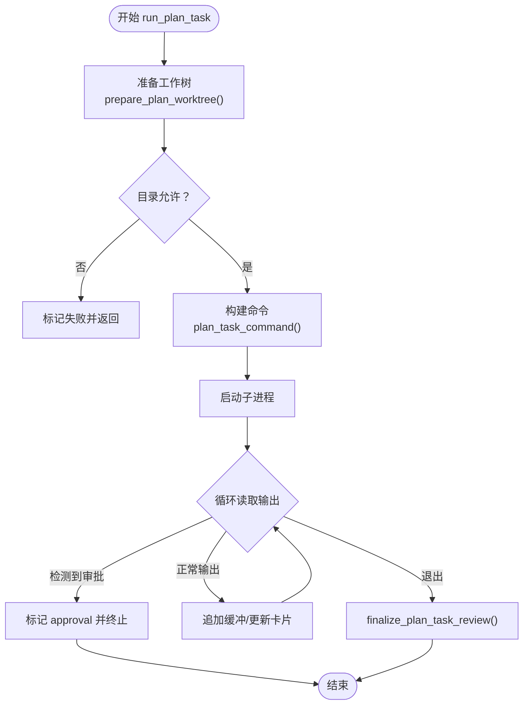
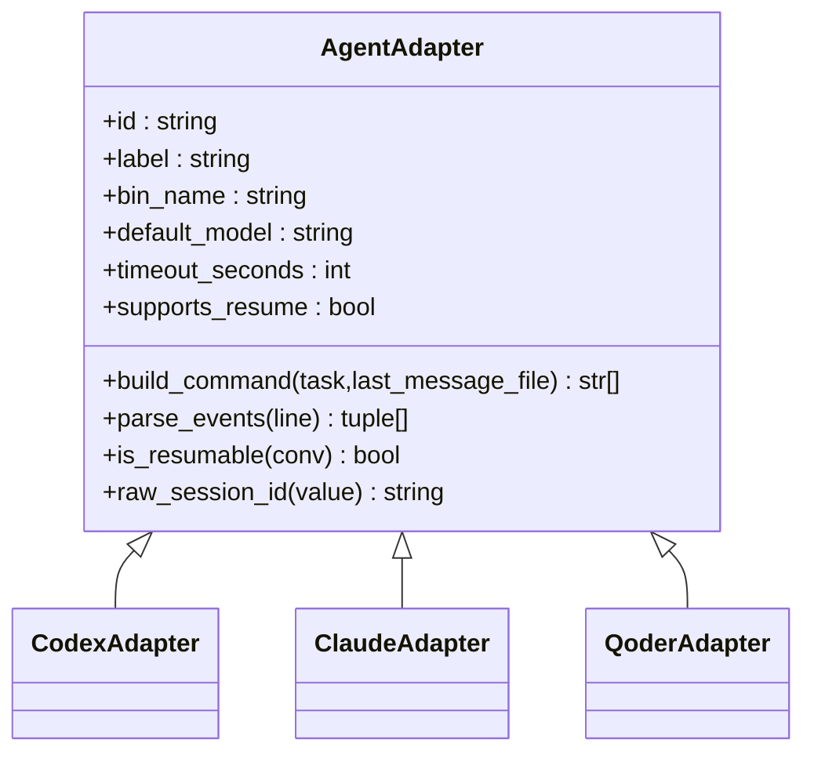
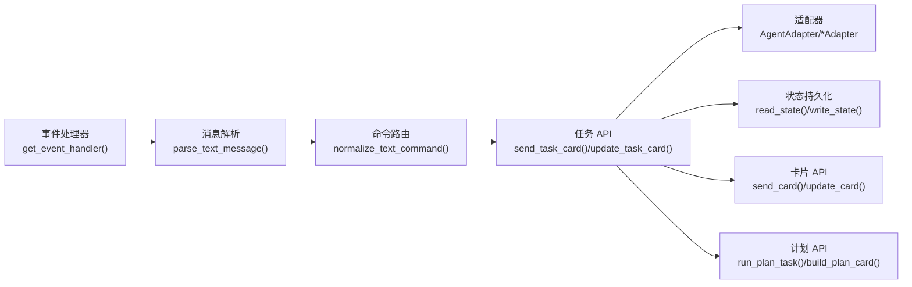

# 核心 API

<cite>
**本文档引用的文件**
- [lark2agent_ws.py](file://lark2agent_ws.py)
- [README.md](file://README.md)
</cite>

## 目录
1. [简介](#简介)
2. [项目结构](#项目结构)
3. [核心组件](#核心组件)
4. [架构总览](#架构总览)
5. [详细组件分析](#详细组件分析)
6. [依赖分析](#依赖分析)
7. [性能考虑](#性能考虑)
8. [故障排查指南](#故障排查指南)
9. [结论](#结论)
10. [附录](#附录)

## 简介
本文件面向 Lark2Agent 的核心 API，聚焦三大领域：
- 事件处理 API：WebSocket 事件接收、消息解析与处理流程
- 任务管理 API：任务创建、执行、监控与状态更新
- 配置管理 API：环境变量加载、配置校验与运行时配置更新

文档提供函数原型、参数类型、默认值、返回值格式、使用示例、错误处理机制、异常类型与调试信息，并阐明各 API 之间的调用关系与依赖。

## 项目结构
- 主程序入口与核心逻辑集中在 lark2agent_ws.py
- README.md 提供功能说明、安装与运行指引、环境变量说明与常见问题
- 项目采用模块化设计，围绕数据模型、适配器、消息与卡片、任务与计划、状态持久化等维度组织

**图表来源**
- [lark2agent_ws.py:1642-1652](file://lark2agent_ws.py#L1642-L1652)
- [lark2agent_ws.py:3482-3524](file://lark2agent_ws.py#L3482-L3524)
- [lark2agent_ws.py:4029-4091](file://lark2agent_ws.py#L4029-L4091)
- [lark2agent_ws.py:4682-4701](file://lark2agent_ws.py#L4682-L4701)
- [lark2agent_ws.py:869-891](file://lark2agent_ws.py#L869-L891)

**章节来源**
- [lark2agent_ws.py:1642-1652](file://lark2agent_ws.py#L1642-L1652)
- [lark2agent_ws.py:3482-3524](file://lark2agent_ws.py#L3482-L3524)
- [lark2agent_ws.py:4029-4091](file://lark2agent_ws.py#L4029-L4091)
- [lark2agent_ws.py:4682-4701](file://lark2agent_ws.py#L4682-L4701)
- [lark2agent_ws.py:869-891](file://lark2agent_ws.py#L869-L891)

## 核心组件
- 数据模型与运行时
  - ConversationInfo、ProjectInfo、ChatRuntime、CodexTaskRuntime、PlanRuntime、PlanTask、PendingApproval、DesktopSyncRuntime、LarkAttachment、LarkReferenceContext
- 适配器体系
  - AgentAdapter 及其子类 CodexAdapter、ClaudeAdapter、QoderAdapter，负责构建命令与解析事件
- 事件与消息
  - get_event_handler、send_msg、send_card、update_card、base_card、fields、action_row、md 等
- 任务与计划
  - send_task_card、update_task_card、build_task_card、run_plan_task、build_plan_card、update_plan_card 等
- 配置与状态
  - load_dotenv、read_state、write_state、save_runtime、load_known_chats、save_plans_state、load_plans_state 等

**章节来源**
- [lark2agent_ws.py:173-397](file://lark2agent_ws.py#L173-L397)
- [lark2agent_ws.py:626-801](file://lark2agent_ws.py#L626-L801)
- [lark2agent_ws.py:1642-1652](file://lark2agent_ws.py#L1642-L1652)
- [lark2agent_ws.py:3482-3733](file://lark2agent_ws.py#L3482-L3733)
- [lark2agent_ws.py:4029-4143](file://lark2agent_ws.py#L4029-L4143)
- [lark2agent_ws.py:4682-4701](file://lark2agent_ws.py#L4682-L4701)
- [lark2agent_ws.py:869-1173](file://lark2agent_ws.py#L869-L1173)

## 架构总览
Lark2Agent 通过 lark-oapi 的 EventDispatcherHandler 注册消息、已读、卡片动作三类事件回调，统一进入消息解析与路由逻辑。随后根据命令前缀与上下文选择 Agent 执行（Codex/Claude/Qoder），并以卡片形式持续反馈任务状态与结果。

**图表来源**
- [lark2agent_ws.py:1642-1652](file://lark2agent_ws.py#L1642-L1652)
- [lark2agent_ws.py:1795-1847](file://lark2agent_ws.py#L1795-L1847)
- [lark2agent_ws.py:4029-4091](file://lark2agent_ws.py#L4029-L4091)
- [lark2agent_ws.py:3482-3524](file://lark2agent_ws.py#L3482-L3524)
- [lark2agent_ws.py:869-891](file://lark2agent_ws.py#L869-L891)

## 详细组件分析

### 事件处理 API
- 事件注册与分发
  - get_event_handler(): 返回基于 LARK_ENCRYPT_KEY 与 LARK_VERIFICATION_TOKEN 的事件处理器，注册消息接收、消息已读、卡片动作触发回调
  - on_message/on_message_read/on_card_action: 事件回调入口，负责消息解析、命令识别与任务下发
- 消息解析与标准化
  - parse_text_message(): 从 Lark JSON 内容中提取纯文本
  - normalize_text_command(): 将中文别名与简写转换为标准命令前缀
  - strip_bridge_instruction_prefix()/strip_leading_lark_mentions(): 清洗与去噪
- Lark 附件处理
  - download_lark_message_attachments(): 下载图片/文件资源至本地目录
  - stash_pending_lark_attachments()/consume_pending_lark_attachments(): 附件暂存与消费
  - build_lark_attachment_prompt()/lark_attachment_summary_text(): 生成带附件的 Prompt 与摘要
- 引用上下文
  - lark_reference_ids()/lark_message_relation_meta(): 提取引用消息 ID
  - resolve_lark_reference_context()/apply_lark_reference_context(): 解析并应用引用上下文
  - record_incoming_lark_message()/record_task_lark_refs(): 记录消息引用，便于后续追踪

典型调用链
- WebSocket 事件到达 → get_event_handler() 注册回调 → on_message() 解析消息 → normalize_text_command() 标准化命令 → send_task_card()/run_plan_task() 创建任务 → send_card()/update_card() 更新卡片

**章节来源**
- [lark2agent_ws.py:1642-1652](file://lark2agent_ws.py#L1642-L1652)
- [lark2agent_ws.py:1795-1847](file://lark2agent_ws.py#L1795-L1847)
- [lark2agent_ws.py:1449-1539](file://lark2agent_ws.py#L1449-L1539)
- [lark2agent_ws.py:1561-1580](file://lark2agent_ws.py#L1561-L1580)
- [lark2agent_ws.py:1622-1639](file://lark2agent_ws.py#L1622-L1639)
- [lark2agent_ws.py:1859-1964](file://lark2agent_ws.py#L1859-L1964)
- [lark2agent_ws.py:1877-1920](file://lark2agent_ws.py#L1877-L1920)

### 任务管理 API
- 任务生命周期
  - send_task_card(): 创建任务并发送初始卡片，返回 task_id；设置 runtime/task 状态字段
  - update_task_card(): 更新任务卡片，控制刷新节流与失败重试
  - build_task_card(): 构建任务卡片元素（状态、Agent、目录、模型、耗时、附件、Session、排队/引导/审批等）
- 任务执行与流式输出
  - codex_task_command()/codex_command(): 基于当前 runtime 与任务参数构建 Agent CLI 命令
  - parse_codex_json_event()/parse_claude_conversation()/parse_qoder_json_event(): 解析 Agent 流式事件，产出 message/tool_output/progress/complete 等事件
  - send_stream_update()/update_existing_task_card(): 将流式输出写入卡片，避免重复消息
- 任务状态与结果
  - task_end_text()/synced_task_complete_text(): 生成任务结束文本（含耗时、目录、Agent、模型、Session、Git 状态等）
  - resolve_task_result(): 从会话文件或最后消息文件解析最终结果与用户问题
- 任务控制
  - cancel_queued_task()/request_task_guidance()/append_task_guidance(): 取消排队任务、追加引导
  - task_can_accept_guidance()/task_can_cancel(): 判断可否追加引导或取消
- 会话与上下文
  - get_runtime()/activate_conversation()/activate_project()/project_session_summary(): 维护会话与项目上下文
  - find_conversation_for_run()/conversation_matches_run(): 匹配运行中的会话

**图表来源**
- [lark2agent_ws.py:4029-4091](file://lark2agent_ws.py#L4029-L4091)
- [lark2agent_ws.py:5012-5035](file://lark2agent_ws.py#L5012-L5035)
- [lark2agent_ws.py:5207-5254](file://lark2agent_ws.py#L5207-L5254)
- [lark2agent_ws.py:3185-3228](file://lark2agent_ws.py#L3185-L3228)
- [lark2agent_ws.py:4146-4143](file://lark2agent_ws.py#L4146-L4143)

**章节来源**
- [lark2agent_ws.py:4029-4091](file://lark2agent_ws.py#L4029-L4091)
- [lark2agent_ws.py:4094-4143](file://lark2agent_ws.py#L4094-L4143)
- [lark2agent_ws.py:5012-5035](file://lark2agent_ws.py#L5012-L5035)
- [lark2agent_ws.py:5207-5254](file://lark2agent_ws.py#L5207-L5254)
- [lark2agent_ws.py:3185-3228](file://lark2agent_ws.py#L3185-L3228)
- [lark2agent_ws.py:4146-4143](file://lark2agent_ws.py#L4146-L4143)

### 计划管理 API（并行任务）
- 计划生命周期
  - build_plan_card()/update_plan_card(): 构建与更新 Plan 卡片，显示状态、并发、进度、依赖、工作树/分支、提交/合并/清理状态
  - build_plan_task_card()/build_plan_merge_card(): 子任务详情、合并总览卡片
  - build_plan_cleanup_confirm_card(): 清理确认卡片
- 子任务执行
  - run_plan_task(): 并行执行子任务，支持 worktree 隔离、测试命令、diff 摘要、提交信息生成与审批/提交流程
  - plan_task_command()/prepare_plan_worktree(): 构建命令与准备 worktree
- 依赖与状态
  - plan_task_dependencies_satisfied()/plan_status_label()/plan_summary(): 依赖满足性判断、状态标签与统计
  - plan_task_successful()/plan_task_terminal(): 结果判定与终止条件

**图表来源**
- [lark2agent_ws.py:5471-5599](file://lark2agent_ws.py#L5471-L5599)
- [lark2agent_ws.py:4329-4340](file://lark2agent_ws.py#L4329-L4340)
- [lark2agent_ws.py:3046-3075](file://lark2agent_ws.py#L3046-L3075)
- [lark2agent_ws.py:3132-3166](file://lark2agent_ws.py#L3132-L3166)

**章节来源**
- [lark2agent_ws.py:4405-4505](file://lark2agent_ws.py#L4405-L4505)
- [lark2agent_ws.py:4508-4572](file://lark2agent_ws.py#L4508-L4572)
- [lark2agent_ws.py:4575-4627](file://lark2agent_ws.py#L4575-L4627)
- [lark2agent_ws.py:5471-5599](file://lark2agent_ws.py#L5471-L5599)
- [lark2agent_ws.py:4329-4340](file://lark2agent_ws.py#L4329-L4340)
- [lark2agent_ws.py:3046-3075](file://lark2agent_ws.py#L3046-L3075)
- [lark2agent_ws.py:3132-3166](file://lark2agent_ws.py#L3132-L3166)

### 配置管理 API
- 环境变量加载
  - load_dotenv(path): 从 .env 文件注入环境变量，仅在未设置时写入
- 配置校验与默认值
  - normalize_agent_id()/normalize_agent_mode(): 标准化 Agent 与模式
  - normalize_qoder_permission_mode(): 校验并规范化 Qoder permission mode
  - parse_csv_set(): 解析逗号/分号/空格分隔的集合
  - is_allowed_cwd()/configured_allowed_roots(): 校验工作目录是否在允许范围内
- 运行时配置更新
  - set_runtime_agent()/active_agent_id(): 切换当前会话默认 Agent
  - runtime_task_cwd()/plan_task_cwd(): 获取任务/计划任务的工作目录
  - save_runtime()/load_known_chats(): 保存/加载运行时状态
  - save_plans_state()/load_plans_state(): 保存/加载计划状态
- 状态持久化
  - read_state()/write_state(): 读写本地状态文件（.lark2agent_state.json），含 chats、message_refs、plans 等

**图表来源**
- [lark2agent_ws.py:626-801](file://lark2agent_ws.py#L626-L801)
- [lark2agent_ws.py:409-425](file://lark2agent_ws.py#L409-L425)
- [lark2agent_ws.py:477-488](file://lark2agent_ws.py#L477-L488)
- [lark2agent_ws.py:557-568](file://lark2agent_ws.py#L557-L568)
- [lark2agent_ws.py:162-164](file://lark2agent_ws.py#L162-L164)

**章节来源**
- [lark2agent_ws.py:34-49](file://lark2agent_ws.py#L34-L49)
- [lark2agent_ws.py:409-425](file://lark2agent_ws.py#L409-L425)
- [lark2agent_ws.py:477-488](file://lark2agent_ws.py#L477-L488)
- [lark2agent_ws.py:557-568](file://lark2agent_ws.py#L557-L568)
- [lark2agent_ws.py:162-164](file://lark2agent_ws.py#L162-L164)
- [lark2agent_ws.py:869-1173](file://lark2agent_ws.py#L869-L1173)

## 依赖分析
- 组件耦合
  - 事件处理依赖消息解析与命令标准化，再驱动任务管理
  - 任务管理依赖适配器体系与状态持久化
  - 计划管理在任务管理之上，增加并行与依赖控制
- 外部依赖
  - lark-oapi：事件回调与消息/卡片发送
  - Agent CLI：Codex、Claude Code、Qoder CLI
  - Git：工作树隔离与状态检查
- 关键依赖关系图

**图表来源**
- [lark2agent_ws.py:1642-1652](file://lark2agent_ws.py#L1642-L1652)
- [lark2agent_ws.py:1795-1847](file://lark2agent_ws.py#L1795-L1847)
- [lark2agent_ws.py:4029-4091](file://lark2agent_ws.py#L4029-L4091)
- [lark2agent_ws.py:626-801](file://lark2agent_ws.py#L626-L801)
- [lark2agent_ws.py:869-891](file://lark2agent_ws.py#L869-L891)
- [lark2agent_ws.py:3482-3524](file://lark2agent_ws.py#L3482-L3524)
- [lark2agent_ws.py:4682-4701](file://lark2agent_ws.py#L4682-L4701)

**章节来源**
- [lark2agent_ws.py:1642-1652](file://lark2agent_ws.py#L1642-L1652)
- [lark2agent_ws.py:4029-4091](file://lark2agent_ws.py#L4029-L4091)
- [lark2agent_ws.py:626-801](file://lark2agent_ws.py#L626-L801)
- [lark2agent_ws.py:869-891](file://lark2agent_ws.py#L869-L891)
- [lark2agent_ws.py:3482-3524](file://lark2agent_ws.py#L3482-L3524)
- [lark2agent_ws.py:4682-4701](file://lark2agent_ws.py#L4682-L4701)

## 性能考虑
- 事件解析与卡片更新节流：update_task_card/update_plan_card 控制最小更新间隔，避免频繁网络请求
- 流式输出缓冲：send_stream_update/事件解析缓冲，累积到阈值再更新，减少卡片更新次数
- 并行执行：PLAN_MAX_PARALLEL 控制子任务并发度，PLAN_USE_WORKTREES 与 PLAN_WORKTREE_ROOT 提升隔离与稳定性
- 目录限制：CODEX_ALLOWED_ROOTS 与 is_allowed_cwd 限制执行范围，降低越权与性能风险
- 超时控制：各 Agent timeout_seconds 与 PLAN_TEST_TIMEOUT_SECONDS 保障长时间任务可控

[本节为通用指导，无需特定文件分析]

## 故障排查指南
- 事件接收失败
  - 确认 LARK_APP_ID/LARK_APP_SECRET/LARK_ENCRYPT_KEY/LARK_VERIFICATION_TOKEN 配置正确
  - 检查日志中 send_card/send_msg 失败与权限错误
- 审批未生效
  - 确认脚本已重启并加载最新代码
  - 检查 APPROVED_* 环境变量是否符合预期
- Git 提交失败
  - Sandbox 权限不足导致 .git/index.lock 错误；通过审批后单次重试
- 任务卡更新失败
  - update_card 返回失败时会记录警告，脚本会保留 message_id 以便重试
- macOS 保活
  - KEEP_AWAKE_ON_AC_POWER=1 仅在接入电源时启用 caffeinate；如需合盖运行，参考 README 设置 KEEP_AWAKE_DISABLE_SLEEP

**章节来源**
- [lark2agent_ws.py:3688-3702](file://lark2agent_ws.py#L3688-L3702)
- [lark2agent_ws.py:5427-5447](file://lark2agent_ws.py#L5427-L5447)
- [README.md:474-511](file://README.md#L474-L511)

## 结论
Lark2Agent 通过清晰的事件处理、任务管理与配置管理 API，实现了从 Lark 消息到多 Agent CLI 的无缝桥接。其设计强调：
- 事件驱动与命令标准化
- 任务卡片化反馈与状态持久化
- 计划并行与依赖控制
- 配置校验与运行时更新
- 错误处理与调试可观测性

[本节为总结性内容，无需特定文件分析]

## 附录

### API 参考（函数原型、参数、返回值与示例）

- 事件处理
  - get_event_handler() → lark.EventDispatcherHandler
    - 作用：注册消息接收、消息已读、卡片动作回调
    - 示例：参见 [lark2agent_ws.py:1642-1652](file://lark2agent_ws.py#L1642-L1652)
  - parse_text_message(raw_content: str) → str
    - 作用：从 Lark JSON 内容提取纯文本
    - 示例：参见 [lark2agent_ws.py:1795-1812](file://lark2agent_ws.py#L1795-L1812)
  - normalize_text_command(content: str) → str
    - 作用：将中文别名与简写转换为标准命令前缀
    - 示例：参见 [lark2agent_ws.py:1823-1847](file://lark2agent_ws.py#L1823-L1847)
  - download_lark_message_attachments(chat_id: str, msg, meta: dict[str, str]) → (list[dict], list[str])
    - 作用：下载图片/文件资源并返回本地附件规范与错误列表
    - 示例：参见 [lark2agent_ws.py:1449-1539](file://lark2agent_ws.py#L1449-L1539)

- 消息与卡片
  - send_msg(chat_id: str, text: str) → void
    - 作用：发送交互式卡片消息
    - 示例：参见 [lark2agent_ws.py:3482-3524](file://lark2agent_ws.py#L3482-L3524)
  - send_card(chat_id: str, card: dict[str, Any]) → str
    - 作用：发送卡片并返回 message_id
    - 示例：参见 [lark2agent_ws.py:3663-3703](file://lark2agent_ws.py#L3663-L3703)
  - update_card(message_id: str, card: dict[str, Any]) → bool
    - 作用：更新已有卡片
    - 示例：参见 [lark2agent_ws.py:3705-3732](file://lark2agent_ws.py#L3705-L3732)
  - base_card(title: str, elements: list[dict], template: str = "blue") → dict
    - 作用：构造基础卡片结构
    - 示例：参见 [lark2agent_ws.py:3735-3743](file://lark2agent_ws.py#L3735-L3743)

- 任务管理
  - send_task_card(chat_id: str, prompt: str, status: str, model: str = "", agent_id: str = "", ...) → str
    - 作用：创建任务并发送初始卡片，返回 task_id
    - 示例：参见 [lark2agent_ws.py:4029-4091](file://lark2agent_ws.py#L4029-L4091)
  - update_task_card(chat_id: str, status: str = "", output: str = "", detail: str = "", force: bool = False, task_id: str = "") → bool
    - 作用：更新任务卡片，支持强制刷新与节流
    - 示例：参见 [lark2agent_ws.py:4094-4143](file://lark2agent_ws.py#L4094-L4143)
  - build_task_card(...) → dict
    - 作用：构建任务卡片元素
    - 示例：参见 [lark2agent_ws.py:3897-4026](file://lark2agent_ws.py#L3897-L4026)
  - codex_task_command(task: CodexTaskRuntime, last_message_file: Optional[Path] = None) → list[str]
    - 作用：构建 Agent CLI 命令
    - 示例：参见 [lark2agent_ws.py:5033-5034](file://lark2agent_ws.py#L5033-L5034)
  - parse_codex_json_event(line: str) → tuple[str, str]
    - 作用：解析 Codex 流式事件
    - 示例：参见 [lark2agent_ws.py:5207-5254](file://lark2agent_ws.py#L5207-L5254)

- 计划管理
  - run_plan_task(plan_id: str, task_id: str) → void
    - 作用：并行执行子任务，支持 worktree 隔离与测试命令
    - 示例：参见 [lark2agent_ws.py:5471-5599](file://lark2agent_ws.py#L5471-L5599)
  - build_plan_card(plan: PlanRuntime) → dict
    - 作用：构建 Plan 卡片
    - 示例：参见 [lark2agent_ws.py:4405-4505](file://lark2agent_ws.py#L4405-L4505)
  - build_plan_task_card(plan: PlanRuntime, task: PlanTask) → dict
    - 作用：构建子任务详情卡片
    - 示例：参见 [lark2agent_ws.py:4508-4572](file://lark2agent_ws.py#L4508-L4572)
  - build_plan_merge_card(plan: PlanRuntime) → dict
    - 作用：构建合并总览卡片
    - 示例：参见 [lark2agent_ws.py:4575-4627](file://lark2agent_ws.py#L4575-L4627)

- 配置管理
  - load_dotenv(path: Path = Path(".env")) → void
    - 作用：从 .env 注入环境变量
    - 示例：参见 [lark2agent_ws.py:34-49](file://lark2agent_ws.py#L34-L49)
  - read_state() → dict
    - 作用：读取本地状态文件
    - 示例：参见 [lark2agent_ws.py:869-876](file://lark2agent_ws.py#L869-L876)
  - write_state(state: dict) → void
    - 作用：写入本地状态文件
    - 示例：参见 [lark2agent_ws.py:879-891](file://lark2agent_ws.py#L879-L891)
  - save_runtime(chat_id: str) → void
    - 作用：保存运行时状态
    - 示例：参见 [lark2agent_ws.py:983-1014](file://lark2agent_ws.py#L983-L1014)
  - load_known_chats() → void
    - 作用：加载已知聊天的运行时状态
    - 示例：参见 [lark2agent_ws.py:1017-1043](file://lark2agent_ws.py#L1017-L1043)
  - save_plans_state() → void
    - 作用：保存计划状态
    - 示例：参见 [lark2agent_ws.py:1152-1157](file://lark2agent_ws.py#L1152-L1157)
  - load_plans_state() → void
    - 作用：加载计划状态
    - 示例：参见 [lark2agent_ws.py:1160-1172](file://lark2agent_ws.py#L1160-L1172)

**章节来源**
- [lark2agent_ws.py:1642-1652](file://lark2agent_ws.py#L1642-L1652)
- [lark2agent_ws.py:1795-1812](file://lark2agent_ws.py#L1795-L1812)
- [lark2agent_ws.py:1823-1847](file://lark2agent_ws.py#L1823-L1847)
- [lark2agent_ws.py:1449-1539](file://lark2agent_ws.py#L1449-L1539)
- [lark2agent_ws.py:3482-3524](file://lark2agent_ws.py#L3482-L3524)
- [lark2agent_ws.py:3663-3703](file://lark2agent_ws.py#L3663-L3703)
- [lark2agent_ws.py:3705-3732](file://lark2agent_ws.py#L3705-L3732)
- [lark2agent_ws.py:3735-3743](file://lark2agent_ws.py#L3735-L3743)
- [lark2agent_ws.py:4029-4091](file://lark2agent_ws.py#L4029-L4091)
- [lark2agent_ws.py:4094-4143](file://lark2agent_ws.py#L4094-L4143)
- [lark2agent_ws.py:3897-4026](file://lark2agent_ws.py#L3897-L4026)
- [lark2agent_ws.py:5033-5034](file://lark2agent_ws.py#L5033-L5034)
- [lark2agent_ws.py:5207-5254](file://lark2agent_ws.py#L5207-L5254)
- [lark2agent_ws.py:5471-5599](file://lark2agent_ws.py#L5471-L5599)
- [lark2agent_ws.py:4405-4505](file://lark2agent_ws.py#L4405-L4505)
- [lark2agent_ws.py:4508-4572](file://lark2agent_ws.py#L4508-L4572)
- [lark2agent_ws.py:4575-4627](file://lark2agent_ws.py#L4575-L4627)
- [lark2agent_ws.py:34-49](file://lark2agent_ws.py#L34-L49)
- [lark2agent_ws.py:869-876](file://lark2agent_ws.py#L869-L876)
- [lark2agent_ws.py:879-891](file://lark2agent_ws.py#L879-L891)
- [lark2agent_ws.py:983-1014](file://lark2agent_ws.py#L983-L1014)
- [lark2agent_ws.py:1017-1043](file://lark2agent_ws.py#L1017-L1043)
- [lark2agent_ws.py:1152-1157](file://lark2agent_ws.py#L1152-L1157)
- [lark2agent_ws.py:1160-1172](file://lark2agent_ws.py#L1160-L1172)