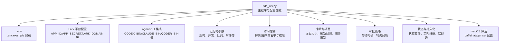
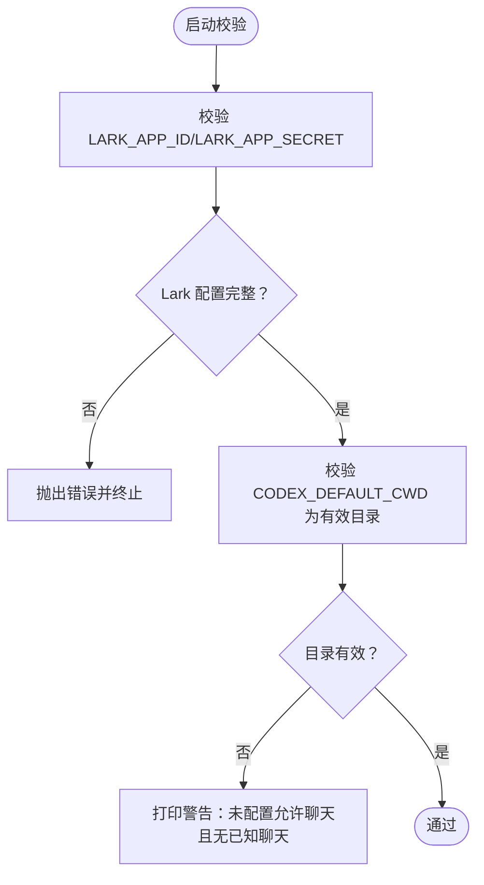

# 配置参数参考

<cite>
**本文引用的文件**
- [README.md](file://README.md)
- [tide_ws.py](file://tide_ws.py)
</cite>

## 目录
1. [简介](#简介)
2. [项目结构](#项目结构)
3. [核心组件](#核心组件)
4. [架构总览](#架构总览)
5. [详细组件分析](#详细组件分析)
6. [依赖分析](#依赖分析)
7. [性能考虑](#性能考虑)
8. [故障排查指南](#故障排查指南)
9. [结论](#结论)
10. [.env 文件与加载机制](#env-文件与加载机制)

## 简介
本文件为 Tide 的完整配置参数参考，覆盖 Lark 平台集成、Agent CLI 集成、运行时参数、访问控制、卡片与消息、审批策略、状态持久化、macOS 保活等全部配置项。每项均给出用途说明、数据类型、默认值、取值范围、典型取值、使用场景、配置示例与注意事项，并总结配置间的依赖关系与约束条件。

## 项目结构
- 主程序入口负责加载 .env、解析环境变量、初始化运行时配置与各组件。
- README.md 提供了配置项表格、使用说明与常见问题，是配置参考的主要来源。

图表来源
- [tide_ws.py:34-49](file://tide_ws.py#L34-L49)
- [tide_ws.py:54-151](file://tide_ws.py#L54-L151)

章节来源
- [README.md:317-456](file://README.md#L317-L456)
- [tide_ws.py:34-49](file://tide_ws.py#L34-L49)
- [tide_ws.py:54-151](file://tide_ws.py#L54-L151)

## 核心组件
- 环境变量加载：程序启动时自动加载当前目录的 .env 文件，若不存在则跳过；.env 中未覆盖的键才会注入到 os.environ。
- 配置解析：所有配置项通过 os.getenv 读取，配合类型转换（如 int、bool、Path）与默认值处理，形成全局配置常量。
- 验证与约束：启动前进行关键配置校验（如 Lark App ID/Secret、默认工作目录有效性），并打印必要警告。

章节来源
- [tide_ws.py:34-49](file://tide_ws.py#L34-L49)
- [tide_ws.py:54-151](file://tide_ws.py#L54-L151)
- [tide_ws.py:8531-8557](file://tide_ws.py#L8531-L8557)

## 架构总览
下图展示了配置参数在系统中的分布与影响范围：

```mermaid
graph TB
subgraph "平台与认证"
LARK["Lark 平台配置<br/>APP_ID/APP_SECRET/LARK_DOMAIN/LARK_ENCRYPT_KEY/LARK_VERIFICATION_TOKEN"]
end
subgraph "Agent CLI 集成"
CODEX["Codex 配置<br/>BIN/MODEL/APPROVAL/SANDBOX/TIMEOUT/PROJECTS_ROOT/ALLOWED_ROOTS"]
CLAUDE["Claude Code 配置<br/>BIN/MODEL/POLICY/TIMEOUT/EXTRA_ARGS"]
QODER["Qoder CLI 配置<br/>BIN/MODEL/POLICY/TIMEOUT/QUEST_TIMEOUT/EXTRA_ARGS/HOME/OVERRIDE_HOME"]
end
subgraph "运行时与并发"
RUNTIME["运行时参数<br/>TIMEOUT/并发/队列/附件/面板大小"]
end
subgraph "访问控制"
ACL["访问控制<br/>ALLOWED_CHAT_IDS/ALLOWED_OPEN_IDS/ADMIN_OPEN_IDS/REQUIRE_KNOWN_CHAT"]
end
subgraph "卡片与消息"
CARD["卡片与消息<br/>面板容量/刷新/附件/引用缓存"]
end
subgraph "审批与状态"
APPROVAL["审批策略<br/>等待/轮询"]
STATE["状态与持久化<br/>状态文件/定时推送/欢迎语"]
end
subgraph "macOS 保活"
KEEP["macOS 保活<br/>caffeinate/pmset"]
end
LARK --> RUNTIME
CODEX --> RUNTIME
CLAUDE --> RUNTIME
QODER --> RUNTIME
ACL --> RUNTIME
CARD --> RUNTIME
APPROVAL --> RUNTIME
STATE --> RUNTIME
KEEP --> RUNTIME
```

图表来源
- [tide_ws.py:54-151](file://tide_ws.py#L54-L151)
- [README.md:317-456](file://README.md#L317-L456)

## 详细组件分析

### Lark 平台配置
- LARK_APP_ID
  - 类型：字符串
  - 默认值：空
  - 取值范围：非空字符串
  - 用途：Lark 自建应用 App ID
  - 依赖与约束：必须与 LARK_APP_SECRET 同时配置；缺失会导致启动校验失败
  - 示例：LARK_APP_ID=cli_xxx
  - 场景：首次部署或迁移时必须正确填写
- LARK_APP_SECRET
  - 类型：字符串
  - 默认值：空
  - 取值范围：非空字符串
  - 用途：Lark 自建应用 App Secret
  - 依赖与约束：必须与 LARK_APP_ID 同时配置；缺失会导致启动校验失败
  - 示例：LARK_APP_SECRET=xxx
  - 场景：与 APP_ID 配对使用
- LARK_DOMAIN
  - 类型：字符串（URL）
  - 默认值：https://open.larksuite.com
  - 取值范围：合法域名
  - 用途：Lark OpenAPI 域名，国内飞书可按实际环境调整
  - 示例：LARK_DOMAIN=https://open.larksuite.com
  - 场景：内网或合规域名
- LARK_ENCRYPT_KEY
  - 类型：字符串
  - 默认值：空
  - 取值范围：非空字符串
  - 用途：事件订阅 Encrypt Key
  - 示例：LARK_ENCRYPT_KEY=xxx
  - 场景：启用事件订阅时必需
- LARK_VERIFICATION_TOKEN
  - 类型：字符串
  - 默认值：空
  - 取值范围：非空字符串
  - 用途：事件订阅 Verification Token
  - 示例：LARK_VERIFICATION_TOKEN=xxx
  - 场景：启用事件订阅时必需

章节来源
- [README.md:319-328](file://README.md#L319-L328)
- [tide_ws.py:56-60](file://tide_ws.py#L56-L60)
- [tide_ws.py:8531-8545](file://tide_ws.py#L8531-L8545)

### Codex 配置
- CODEX_HOME
  - 类型：路径
  - 默认值：~/.codex
  - 取值范围：有效目录
  - 用途：Codex home 目录
  - 示例：CODEX_HOME=/opt/codex
- CODEX_SESSIONS_DIR
  - 类型：路径
  - 默认值：$CODEX_HOME/sessions
  - 取值范围：有效目录
  - 用途：Codex 会话文件目录
  - 示例：CODEX_SESSIONS_DIR=/opt/codex/sessions
- CODEX_BIN
  - 类型：字符串（命令）
  - 默认值：codex
  - 取值范围：可执行命令
  - 用途：Codex CLI 命令路径
  - 示例：CODEX_BIN=/usr/local/bin/codex
- CODEX_TIMEOUT_SECONDS
  - 类型：整数（秒）
  - 默认值：1800
  - 取值范围：正整数
  - 用途：单次 Codex 任务超时时间
  - 示例：CODEX_TIMEOUT_SECONDS=3600
- CODEX_MODEL
  - 类型：字符串
  - 默认值：空
  - 取值范围：Agent 支持的模型名
  - 用途：默认 Codex 模型；为空时使用 CLI 自身配置
  - 示例：CODEX_MODEL=gpt-4
- CODEX_PROJECTS_ROOT
  - 类型：路径
  - 默认值：CODEX_DEFAULT_CWD 的父目录
  - 取值范围：有效目录
  - 用途：/project=new 创建项目目录的位置
  - 示例：CODEX_PROJECTS_ROOT=/projects
- CODEX_APPROVAL_POLICY
  - 类型：字符串
  - 默认值：on-request
  - 取值范围：Agent 支持的策略
  - 用途：普通任务的 Codex approval policy
  - 示例：CODEX_APPROVAL_POLICY=on-request
- CODEX_SANDBOX_MODE
  - 类型：字符串
  - 默认值：workspace-write
  - 取值范围：Agent 支持的沙箱模式
  - 用途：普通任务的 Codex sandbox 模式
  - 示例：CODEX_SANDBOX_MODE=workspace-write
- APPROVED_CODEX_APPROVAL_POLICY
  - 类型：字符串
  - 默认值：on-request
  - 取值范围：Agent 支持的策略
  - 用途：Lark 审批批准后，单次重试使用的 approval policy
  - 示例：APPROVED_CODEX_APPROVAL_POLICY=on-request
- APPROVED_CODEX_SANDBOX_MODE
  - 类型：字符串
  - 默认值：workspace-write
  - 取值范围：Agent 支持的沙箱模式
  - 用途：Lark 审批批准后，单次重试使用的 sandbox 模式
  - 示例：APPROVED_CODEX_SANDBOX_MODE=workspace-write
- CODEX_ALLOWED_ROOTS
  - 类型：字符串（路径集合）
  - 默认值：CODEX_PROJECTS_ROOT 和 CODEX_DEFAULT_CWD
  - 取值范围：多个路径，用 : 或 , 分隔
  - 用途：允许 Codex 执行、/cd、项目创建和 Plan worktree 运行的目录范围
  - 示例：CODEX_ALLOWED_ROOTS=/proj1:/proj2,/home/user

章节来源
- [README.md:329-344](file://README.md#L329-L344)
- [tide_ws.py:62-65](file://tide_ws.py#L62-L65)
- [tide_ws.py:74-98](file://tide_ws.py#L74-L98)

### Agent、Claude Code 与 Qoder CLI 配置
- DEFAULT_AGENT_ID
  - 类型：字符串
  - 默认值：codex
  - 取值范围：codex、claude、qoder
  - 用途：当前 Lark chat 未显式指定时使用的默认 Agent
  - 示例：DEFAULT_AGENT_ID=claude
- CLAUDE_BIN
  - 类型：字符串（命令）
  - 默认值：claude
  - 取值范围：可执行命令
  - 用途：Claude Code CLI 命令路径
  - 示例：CLAUDE_BIN=/usr/local/bin/claude
- CLAUDE_HOME
  - 类型：路径
  - 默认值：~/.claude
  - 取值范围：有效目录
  - 用途：Claude Code home 目录
  - 示例：CLAUDE_HOME=/opt/claude
- CLAUDE_PROJECTS_DIR
  - 类型：路径
  - 默认值：$CLAUDE_HOME/projects
  - 取值范围：有效目录
  - 用途：Claude Code 会话 JSONL 索引目录
  - 示例：CLAUDE_PROJECTS_DIR=/opt/claude/projects
- CLAUDE_TIMEOUT_SECONDS
  - 类型：整数（秒）
  - 默认值：CODEX_TIMEOUT_SECONDS
  - 取值范围：正整数
  - 用途：单次 Claude Code 任务超时时间
  - 示例：CLAUDE_TIMEOUT_SECONDS=3600
- CLAUDE_MODEL
  - 类型：字符串
  - 默认值：空
  - 取值范围：Agent 支持的模型名
  - 用途：默认 Claude Code 模型；为空时使用 CLI 自身配置
  - 示例：CLAUDE_MODEL=claude-3-opus
- CLAUDE_PERMISSION_MODE
  - 类型：字符串
  - 默认值：dontAsk
  - 取值范围：dontAsk（默认）、acceptEdits、bypass_permissions、auto
  - 用途：Claude Code --permission-mode 参数；Bridge 默认不走本机终端弹窗
  - 示例：CLAUDE_PERMISSION_MODE=acceptEdits
- APPROVED_CLAUDE_PERMISSION_MODE
  - 类型：字符串
  - 默认值：acceptEdits
  - 取值范围：acceptEdits（批准后重试）
  - 用途：Lark 审批批准后，单次 Claude Code 重试使用的 --permission-mode
  - 示例：APPROVED_CLAUDE_PERMISSION_MODE=acceptEdits
- CLAUDE_EXTRA_ARGS
  - 类型：字符串（shell 参数）
  - 默认值：空
  - 取值范围：符合 shell 规则的安全参数
  - 用途：追加给 Claude Code CLI 的额外参数，按 shell 规则解析
  - 示例：CLAUDE_EXTRA_ARGS="--some-flag"
- QODER_BIN
  - 类型：字符串（命令）
  - 默认值：qodercli
  - 取值范围：可执行命令
  - 用途：Qoder CLI 命令路径
  - 示例：QODER_BIN=/usr/local/bin/qodercli
- QODER_HOME
  - 类型：路径
  - 默认值：~/.qoder
  - 取值范围：有效目录
  - 用途：Qoder CLI home 目录
  - 示例：QODER_HOME=/opt/qoder
- QODER_PROJECTS_DIR
  - 类型：路径
  - 默认值：$QODER_HOME/projects
  - 取值范围：有效目录
  - 用途：Qoder CLI 会话 JSONL 索引目录
  - 示例：QODER_PROJECTS_DIR=/opt/qoder/projects
- QODER_PROCESS_HOME
  - 类型：字符串（路径）
  - 默认值：空
  - 取值范围：有效目录或空
  - 用途：启动 Qoder CLI 子进程时覆盖 HOME；为空时从 QODER_HOME 推导
  - 示例：QODER_PROCESS_HOME=/tmp/home
- QODER_TIMEOUT_SECONDS
  - 类型：整数（秒）
  - 默认值：CODEX_TIMEOUT_SECONDS
  - 取值范围：正整数
  - 用途：单次 Qoder CLI 任务超时时间
  - 示例：QODER_TIMEOUT_SECONDS=3600
- QODER_QUEST_TIMEOUT_SECONDS
  - 类型：整数（秒）
  - 默认值：43200（12 小时）
  - 取值范围：正整数
  - 用途：Qoder Quest 模式超时时间
  - 示例：QODER_QUEST_TIMEOUT_SECONDS=72000
- QODER_MODEL
  - 类型：字符串
  - 默认值：空
  - 取值范围：Agent 支持的模型名
  - 用途：默认 Qoder 模型；为空时使用 CLI 自身配置
  - 示例：QODER_MODEL=deepseek-coder
- QODER_PERMISSION_MODE
  - 类型：字符串
  - 默认值：dont_ask
  - 取值范围：default、accept_edits、bypass_permissions、dont_ask、auto
  - 用途：Qoder CLI --permission-mode 参数；若误配为 ask，Bridge 会兼容映射为 dont_ask
  - 示例：QODER_PERMISSION_MODE=dont_ask
- APPROVED_QODER_PERMISSION_MODE
  - 类型：字符串
  - 默认值：bypass_permissions
  - 取值范围：bypass_permissions（批准后重试）
  - 用途：Lark 审批批准后，单次 Qoder CLI 重试使用的 --permission-mode；批准后会启动新的 Qoder session，避免继承旧 session 的 dont_ask 拒写状态
  - 示例：APPROVED_QODER_PERMISSION_MODE=bypass_permissions
- QODER_EXTRA_ARGS
  - 类型：字符串（shell 参数）
  - 默认值：空
  - 取值范围：符合 shell 规则的安全参数
  - 用途：追加给 Qoder CLI 的额外参数，按 shell 规则解析
  - 示例：QODER_EXTRA_ARGS="--some-flag"

章节来源
- [README.md:346-369](file://README.md#L346-L369)
- [tide_ws.py:66-73](file://tide_ws.py#L66-L73)
- [tide_ws.py:85-91](file://tide_ws.py#L85-L91)
- [tide_ws.py:539-569](file://tide_ws.py#L539-L569)

### 访问控制
- LARK_ALLOWED_CHAT_IDS
  - 类型：字符串（ID 集合）
  - 默认值：空
  - 取值范围：多个 ID，用逗号、分号或空白分隔；支持通配符 *
  - 用途：允许使用 bridge 的 Lark 群聊 ID；为空时按 LARK_REQUIRE_KNOWN_CHAT 处理
  - 示例：LARK_ALLOWED_CHAT_IDS=oc_xxx,oc_yyy 或 LARK_ALLOWED_CHAT_IDS="*"
- LARK_ALLOWED_OPEN_IDS
  - 类型：字符串（open_id 集合）
  - 默认值：空
  - 取值范围：多个 open_id，用逗号、分号或空白分隔；支持通配符 *
  - 用途：允许操作 bridge 的用户 open_id；为空表示不按用户过滤
  - 示例：LARK_ALLOWED_OPEN_IDS=open_xxx,open_yyy 或 LARK_ALLOWED_OPEN_IDS="*"
- LARK_ADMIN_OPEN_IDS
  - 类型：字符串（open_id 集合）
  - 默认值：空
  - 取值范围：多个 open_id，用逗号、分号或空白分隔；支持通配符 *
  - 用途：可执行审批、停止、重启、切目录、提交等敏感操作的用户 open_id；为空时沿用允许用户
  - 示例：LARK_ADMIN_OPEN_IDS=open_xxx
- LARK_REQUIRE_KNOWN_CHAT
  - 类型：布尔
  - 默认值：1
  - 取值范围：0/1
  - 用途：未配置 LARK_ALLOWED_CHAT_IDS 时，仅允许状态文件里已有的 chat
  - 示例：LARK_REQUIRE_KNOWN_CHAT=0

章节来源
- [README.md:370-377](file://README.md#L370-L377)
- [tide_ws.py:145-148](file://tide_ws.py#L145-L148)
- [tide_ws.py:1211-1271](file://tide_ws.py#L1211-L1271)

### 卡片与消息
- LARK_MESSAGE_CHUNK_SIZE
  - 类型：整数（字符）
  - 默认值：1800
  - 取值范围：正整数
  - 用途：长消息分片长度
  - 示例：LARK_MESSAGE_CHUNK_SIZE=2000
- LARK_FINAL_REPLY_MAX_CHARS
  - 类型：整数（字符）
  - 默认值：4000
  - 取值范围：正整数
  - 用途：最终回复最大展示长度
  - 示例：LARK_FINAL_REPLY_MAX_CHARS=5000
- LARK_FINAL_QUESTION_MAX_CHARS
  - 类型：整数（字符）
  - 默认值：1200
  - 取值范围：正整数
  - 用途：用户问题最大展示长度
  - 示例：LARK_FINAL_QUESTION_MAX_CHARS=1500
- MAX_PROJECTS_IN_PANEL
  - 类型：整数
  - 默认值：8
  - 取值范围：正整数
  - 用途：面板最多展示项目数
  - 示例：MAX_PROJECTS_IN_PANEL=12
- MAX_CONVERSATIONS_IN_PANEL
  - 类型：整数
  - 默认值：8
  - 取值范围：正整数
  - 用途：面板最多展示对话数
  - 示例：MAX_CONVERSATIONS_IN_PANEL=10
- MAX_SESSION_FILES
  - 类型：整数
  - 默认值：300
  - 取值范围：正整数
  - 用途：每类 Agent 索引的 session 文件数量上限
  - 示例：MAX_SESSION_FILES=500
- MAX_RUNNING_TASKS
  - 类型：整数
  - 默认值：6
  - 取值范围：整数（小于等于 0 表示不限制）
  - 用途：全局同时运行的 Agent 子进程上限
  - 示例：MAX_RUNNING_TASKS=10
- MAX_RUNNING_TASKS_PER_CHAT
  - 类型：整数
  - 默认值：4
  - 取值范围：整数（小于等于 0 表示不限制）
  - 用途：单个 Lark chat 同时运行的 Agent 子进程上限
  - 示例：MAX_RUNNING_TASKS_PER_CHAT=6
- LARK_EVENT_QUEUE_MAXSIZE
  - 类型：整数
  - 默认值：200
  - 取值范围：正整数
  - 用途：Lark 事件队列最大积压数量
  - 示例：LARK_EVENT_QUEUE_MAXSIZE=500
- LARK_ATTACHMENTS_DIR
  - 类型：字符串（路径）
  - 默认值：.tide/attachments
  - 取值范围：有效相对或绝对路径
  - 用途：Lark 图片/文件下载目录；相对路径会落到当前 Agent 工作目录下
  - 示例：LARK_ATTACHMENTS_DIR=./attachments
- LARK_ATTACHMENT_MAX_BYTES
  - 类型：整数（字节）
  - 默认值：52428800（50MB）
  - 取值范围：正整数
  - 用途：单个附件最大下载字节数
  - 示例：LARK_ATTACHMENT_MAX_BYTES=104857600
- LARK_PENDING_ATTACHMENT_TTL_SECONDS
  - 类型：整数（秒）
  - 默认值：900
  - 取值范围：正整数
  - 用途：只有附件、没有文字的消息可被下一条指令自动消费的暂存时间
  - 示例：LARK_PENDING_ATTACHMENT_TTL_SECONDS=1800
- MAX_LARK_ATTACHMENTS_PER_MESSAGE
  - 类型：整数
  - 默认值：8
  - 取值范围：正整数
  - 用途：单条 Lark 消息最多处理的附件数量
  - 示例：MAX_LARK_ATTACHMENTS_PER_MESSAGE=10
- MAX_LARK_MESSAGE_REFS
  - 类型：整数
  - 默认值：1000
  - 取值范围：整数（小于等于 0 表示不限制）
  - 用途：缓存的 Lark 消息引用（用于回复/引用找回附件）上限；超过后按更新时间裁剪
  - 示例：MAX_LARK_MESSAGE_REFS=2000
- TASK_CARD_REFRESH_INTERVAL_SECONDS
  - 类型：整数（秒）
  - 默认值：15
  - 取值范围：正整数
  - 用途：Agent 指令面板自动刷新间隔
  - 示例：TASK_CARD_REFRESH_INTERVAL_SECONDS=30
- PLAN_MAX_PARALLEL
  - 类型：整数
  - 默认值：3
  - 取值范围：正整数
  - 用途：/plan 并行执行的最大子任务数
  - 示例：PLAN_MAX_PARALLEL=5
- PLAN_TASK_OUTPUT_MAX_CHARS
  - 类型：整数（字符）
  - 默认值：1200
  - 取值范围：正整数
  - 用途：Plan 面板中每个子任务输出的最大展示长度
  - 示例：PLAN_TASK_OUTPUT_MAX_CHARS=2000
- PLAN_USE_WORKTREES
  - 类型：布尔
  - 默认值：1
  - 取值范围：0/1
  - 用途：是否为 Plan 子任务启用 Git worktree 隔离
  - 示例：PLAN_USE_WORKTREES=0
- PLAN_WORKTREE_ROOT
  - 类型：字符串（路径）
  - 默认值：空
  - 取值范围：有效路径或空
  - 用途：自定义 worktree 根目录；为空时使用当前仓库的 .tide/worktrees
  - 示例：PLAN_WORKTREE_ROOT=/tmp/worktrees
- PLAN_TEST_COMMAND
  - 类型：字符串（命令）
  - 默认值：git diff --check
  - 取值范围：可执行命令
  - 用途：子任务完成后、进入提交审批前执行的检查命令
  - 示例：PLAN_TEST_COMMAND=make check
- PLAN_TEST_COMMAND_SHELL
  - 类型：布尔
  - 默认值：0
  - 取值范围：0/1
  - 用途：是否用 shell 执行 PLAN_TEST_COMMAND
  - 示例：PLAN_TEST_COMMAND_SHELL=1
- PLAN_TEST_TIMEOUT_SECONDS
  - 类型：整数（秒）
  - 默认值：120
  - 取值范围：正整数
  - 用途：Plan 检查命令超时时间
  - 示例：PLAN_TEST_TIMEOUT_SECONDS=300

章节来源
- [README.md:379-405](file://README.md#L379-L405)
- [tide_ws.py:101-124](file://tide_ws.py#L101-L124)
- [tide_ws.py:118-124](file://tide_ws.py#L118-L124)

### 审批
- PENDING_APPROVAL_WAIT_SECONDS
  - 类型：整数（秒）
  - 默认值：300
  - 取值范围：正整数
  - 用途：推送审批后等待用户处理的时间；超时后按 Codex 默认结果继续收尾
  - 示例：PENDING_APPROVAL_WAIT_SECONDS=600
- PENDING_APPROVAL_POLL_SECONDS
  - 类型：整数（秒）
  - 默认值：2
  - 取值范围：正整数
  - 用途：审批等待轮询间隔
  - 示例：PENDING_APPROVAL_POLL_SECONDS=5

章节来源
- [README.md:406-412](file://README.md#L406-L412)
- [tide_ws.py:116-117](file://tide_ws.py#L116-L117)

### 状态、同步与持久化
- STATUS_INTERVAL_SECONDS
  - 类型：整数（秒）
  - 默认值：0（关闭）
  - 取值范围：非负整数（大于 0 时开启定时状态推送）
  - 用途：定时推送状态的间隔
  - 示例：STATUS_INTERVAL_SECONDS=3600
- DAILY_REPORT_TIME
  - 类型：字符串（时间）
  - 默认值：19:00
  - 取值范围：合法时间 HH:mm
  - 用途：每日项目进展日报推送时间
  - 示例：DAILY_REPORT_TIME=09:00
- TIDE_STATE_FILE
  - 类型：字符串（路径）
  - 默认值：.tide_state.json
  - 取值范围：有效路径
  - 用途：本地运行状态文件，用于保存已知 chat、运行面板状态和 Plan/子任务状态
  - 示例：TIDE_STATE_FILE=/var/lib/tide/state.json
- TIDE_SHOW_ARCHIVED
  - 类型：布尔
  - 默认值：0
  - 取值范围：0/1
  - 用途：是否在查询结果中显示已归档项目、普通对话和会话
  - 示例：TIDE_SHOW_ARCHIVED=1
- TIDE_INCLUDE_PLAN_WORKTREES
  - 类型：布尔
  - 默认值：0
  - 取值范围：0/1
  - 用途：是否把 /plan 创建的 worktree 子目录作为项目/对话统计进看板和日报；默认不统计
  - 示例：TIDE_INCLUDE_PLAN_WORKTREES=1
- TIDE_WELCOME_MESSAGE
  - 类型：字符串
  - 默认值：I'm Tide, a lightweight multi-agent bridge for Lark.
  - 取值范围：任意文本
  - 用途：WebSocket 脚本启动时向已知 Lark 会话发送的欢迎语；为空则不发送
  - 示例：TIDE_WELCOME_MESSAGE=欢迎使用 Tide
- SYNC_DESKTOP_SESSIONS
  - 类型：布尔
  - 默认值：0
  - 取值范围：0/1
  - 用途：是否监听 Codex Desktop 会话更新
  - 示例：SYNC_DESKTOP_SESSIONS=1
- SESSION_WATCH_INTERVAL_SECONDS
  - 类型：整数（秒）
  - 默认值：3
  - 取值范围：正整数
  - 用途：Codex Desktop 会话监听间隔
  - 示例：SESSION_WATCH_INTERVAL_SECONDS=5
- LARK_CARD_ENABLE_FORWARD
  - 类型：布尔
  - 默认值：0
  - 取值范围：0/1
  - 用途：是否允许 Lark 卡片被转发
  - 示例：LARK_CARD_ENABLE_FORWARD=1
- LOG_MESSAGE_CONTENT
  - 类型：布尔
  - 默认值：0
  - 取值范围：0/1
  - 用途：是否在日志中记录 Lark 消息和 Agent prompt 内容片段
  - 示例：LOG_MESSAGE_CONTENT=1
- LOG_LEVEL
  - 类型：字符串
  - 默认值：INFO
  - 取值范围：DEBUG/INFO/WARNING/ERROR/CRITICAL
  - 用途：日志级别
  - 示例：LOG_LEVEL=DEBUG

章节来源
- [README.md:413-427](file://README.md#L413-L427)
- [tide_ws.py:114-151](file://tide_ws.py#L114-L151)

### macOS 保活
- KEEP_AWAKE_ON_AC_POWER
  - 类型：布尔
  - 默认值：1
  - 取值范围：0/1
  - 用途：接入电源时自动启动 caffeinate，保持脚本和网络活跃
  - 示例：KEEP_AWAKE_ON_AC_POWER=0
- KEEP_AWAKE_CHECK_INTERVAL_SECONDS
  - 类型：整数（秒）
  - 默认值：60
  - 取值范围：正整数
  - 用途：电源状态检查间隔
  - 示例：KEEP_AWAKE_CHECK_INTERVAL_SECONDS=120
- KEEP_AWAKE_DISABLE_SLEEP
  - 类型：布尔
  - 默认值：0
  - 取值范围：0/1
  - 用途：是否尝试执行 sudo pmset -a disablesleep 1；用于无外接显示器时合盖继续运行，通常需要管理员权限
  - 示例：KEEP_AWAKE_DISABLE_SLEEP=1

章节来源
- [README.md:429-456](file://README.md#L429-L456)
- [tide_ws.py:142-144](file://tide_ws.py#L142-L144)

## 依赖分析
- Lark 平台配置
  - APP_ID 与 APP_SECRET 必须同时存在，否则启动校验失败
  - DOMAIN 与 Encrypt Key/Verification Token 与平台事件订阅相关
- Agent CLI 配置
  - TIMEOUT_SECONDS 与各 Agent 的默认模型、权限模式、extra args 共同决定任务行为
  - QODER_PERMISSION_MODE 与 APPROVED_QODER_PERMISSION_MODE 存在互斥与兼容性约束
- 运行时与并发
  - MAX_RUNNING_TASKS 与 MAX_RUNNING_TASKS_PER_CHAT 共同限制全局与单聊天并发
  - PLAN_MAX_PARALLEL 与 PLAN_USE_WORKTREES 决定 Plan 的隔离与并发策略
- 访问控制
  - ALLOWED_CHAT_IDS 与 REQUIRE_KNOWN_CHAT 共同决定聊天准入策略
  - ADMIN_OPEN_IDS 与 ALLOWED_OPEN_IDS 决定敏感操作权限
- 状态与持久化
  - STATE_FILE 与 SHOW_ARCHIVED、INCLUDE_PLAN_WORKTREES 决定面板与日报统计范围
- macOS 保活
  - DISABLE_SLEEP 与 CHECK_INTERVAL 共同决定合盖运行策略

图表来源
- [tide_ws.py:8531-8557](file://tide_ws.py#L8531-L8557)

章节来源
- [tide_ws.py:8531-8557](file://tide_ws.py#L8531-L8557)

## 性能考虑
- 并发与队列
  - 合理设置 MAX_RUNNING_TASKS 与 MAX_RUNNING_TASKS_PER_CHAT，避免资源争用导致任务阻塞
  - LARK_EVENT_QUEUE_MAXSIZE 控制事件积压，过大可能导致内存压力
- I/O 与附件
  - LARK_ATTACHMENT_MAX_BYTES 与 MAX_LARK_ATTACHMENTS_PER_MESSAGE 控制附件下载与处理成本
  - LARK_PENDING_ATTACHMENT_TTL_SECONDS 影响附件暂存与回收周期
- Plan 并行
  - PLAN_MAX_PARALLEL 与 PLAN_USE_WORKTREES 影响磁盘与 Git 操作开销
  - PLAN_TEST_COMMAND 与 PLAN_TEST_TIMEOUT_SECONDS 影响 Plan 流程整体耗时
- 日志与监控
  - LOG_LEVEL 与 LOG_MESSAGE_CONTENT 影响 I/O 与存储开销

## 故障排查指南
- 收不到 Lark 消息
  - 检查机器人是否加入目标群聊
  - 确认 Lark 应用已发布并开通 IM 事件和发消息权限
  - 确认 LARK_APP_ID、LARK_APP_SECRET、LARK_ENCRYPT_KEY、LARK_VERIFICATION_TOKEN 正确
  - 查看脚本日志中是否有 send_card failed、send_msg failed 或权限错误
- 审批批准后没有继续执行
  - 确认脚本已重启并加载最新代码
  - 确认 APPROVED_* 系列配置符合预期
- Git 提交失败
  - 若出现 index.lock 权限问题，通过审批面板批准后，脚本会用批准后的 Codex sandbox 配置单次重试
- 电脑仍然睡眠
  - 只防止普通 idle sleep 时，默认 caffeinate 即可
  - MacBook 合盖睡眠不一定能被 caffeinate 阻止
  - 稳定合盖运行推荐接电源、外接显示器、键盘和鼠标
  - 无外接显示器合盖运行需要 KEEP_AWAKE_DISABLE_SLEEP=1 或手动 sudo pmset -a disablesleep 1

章节来源
- [README.md:474-511](file://README.md#L474-L511)

## 结论
- 本参考文档基于源码与 README 的配置表格整理，覆盖 Lark 平台、Agent CLI、运行时参数、访问控制、卡片与消息、审批策略、状态持久化与 macOS 保活等全量配置项
- 建议在生产环境按需调整超时、并发、附件与日志级别，并结合访问控制策略严格限定聊天与用户范围
- 首次部署务必补齐 Lark 平台配置与默认工作目录，确保启动校验通过

## .env 文件与加载机制
- 文件位置与命名
  - 程序启动时会尝试加载当前目录的 .env 文件；若不存在则跳过
  - README 提供了 .env.example 模板，建议复制为 .env 并按需填写
- 加载流程
  - load_dotenv 会逐行解析 .env，忽略空行、注释行与不含等号的行
  - 仅当环境变量未被设置时才注入，避免覆盖已有环境变量
- 典型用法
  - 在容器或 CI 环境中，可通过 export 或 docker -e 覆盖 .env 中的值
  - 对于敏感信息，建议优先使用系统环境变量而非 .env

章节来源
- [tide_ws.py:34-49](file://tide_ws.py#L34-L49)
- [README.md:514-517](file://README.md#L514-L517)