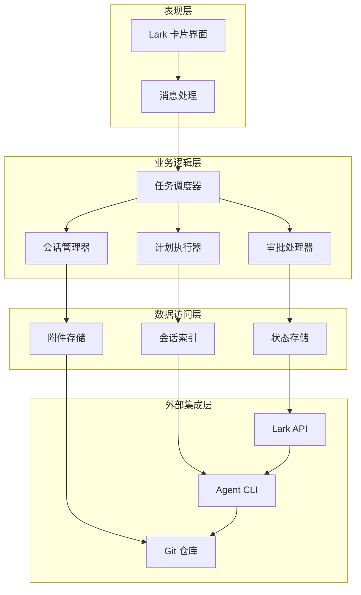
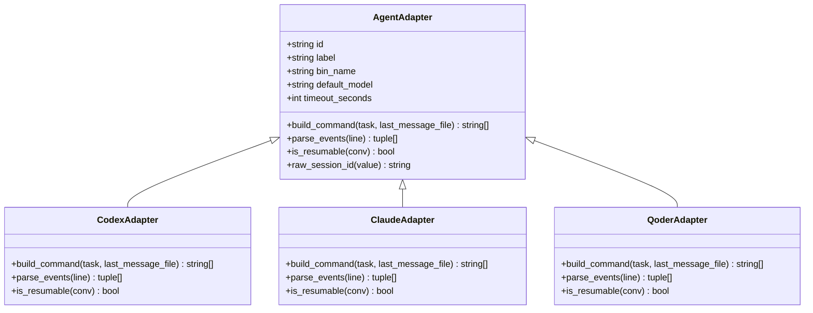
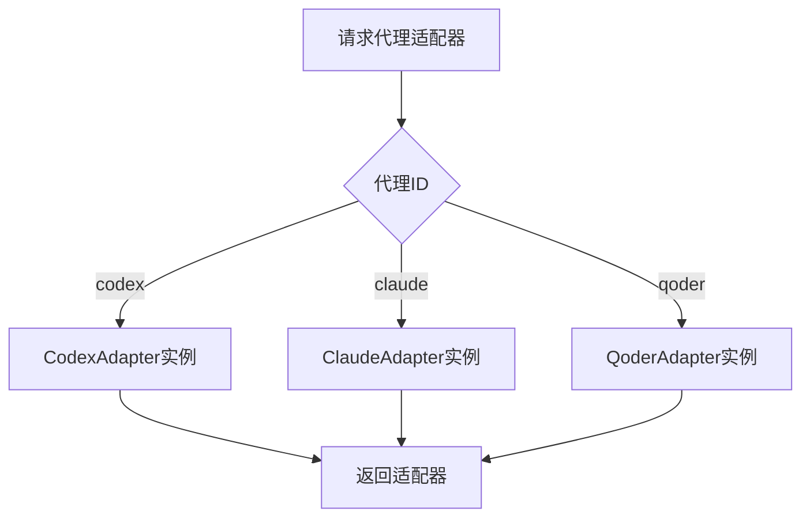
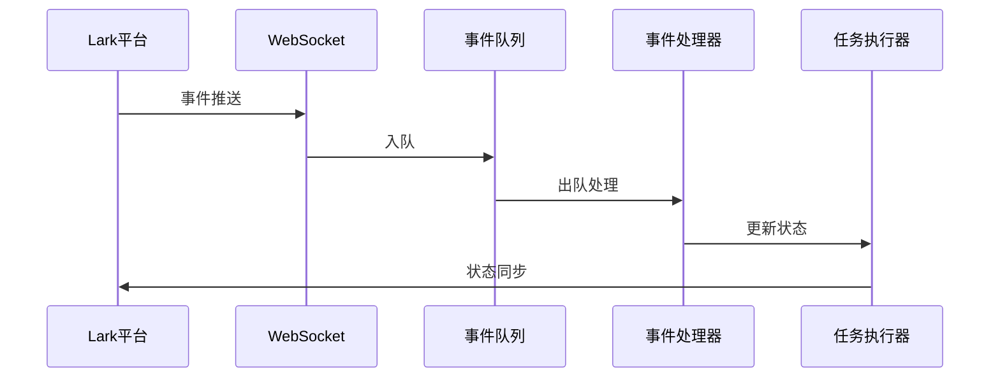
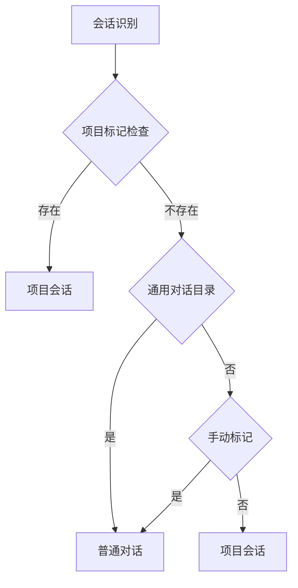
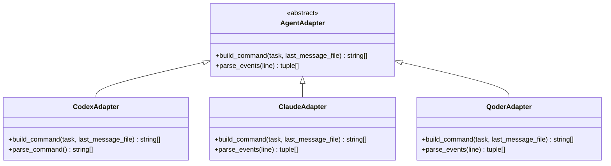
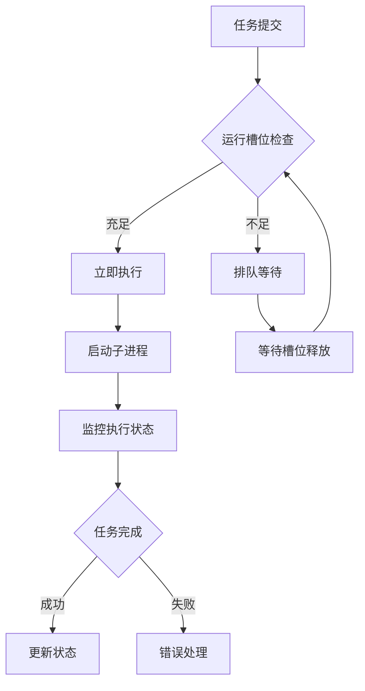
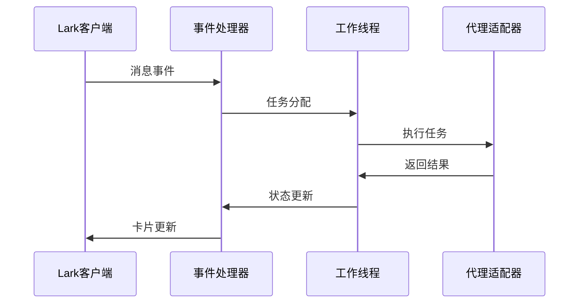
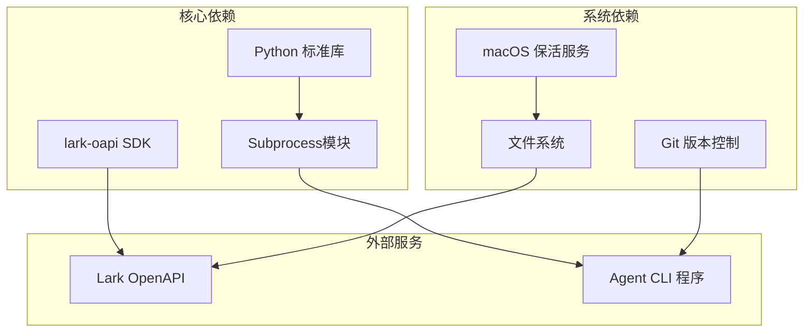

# 代码结构分析

<cite>
**本文档引用的文件**
- [tide_ws.py](file://tide_ws.py)
- [README.md](file://README.md)
</cite>

## 目录
1. [简介](#简介)
2. [项目结构](#项目结构)
3. [核心组件](#核心组件)
4. [架构概览](#架构概览)
5. [详细组件分析](#详细组件分析)
6. [依赖分析](#依赖分析)
7. [性能考虑](#性能考虑)
8. [故障排除指南](#故障排除指南)
9. [结论](#结论)
10. [附录](#附录)

## 简介

Tide 是一个将飞书/Lark 群聊消息转换为多代理 CLI 任务的轻量级桥接系统。该系统支持 Codex、Claude Code 和 Qoder CLI 等多种 AI 代理，能够将执行进度、任务结果、审批操作和项目状态同步回 Lark 卡片。

该系统采用模块化设计，通过适配器模式支持不同类型的代理 CLI，通过工厂模式管理代理适配器的创建，通过观察者模式实现任务状态通知机制。系统具备强大的扩展性，支持添加新的代理集成、扩展审批策略和定制附件处理。

## 项目结构

项目采用单一文件架构设计，将所有功能集中在 `tide_ws.py` 主文件中，通过清晰的模块化组织实现功能分离：

```mermaid
graph TB
subgraph "主程序模块"
A[tide_ws.py]
end
subgraph "数据模型层"
B[ConversationInfo]
C[ProjectInfo]
D[ChatRuntime]
E[CodexTaskRuntime]
F[LarkAttachment]
G[LarkReferenceContext]
H[DesktopSyncRuntime]
I[PendingApproval]
J[PendingRestart]
K[PlanTask]
L[PlanRuntime]
end
subgraph "Agent 适配器层"
M[AgentAdapter]
N[CodexAdapter]
O[ClaudeAdapter]
P[QoderAdapter]
end
subgraph "任务调度层"
Q[任务队列]
R[计划执行器]
S[审批处理器]
T[状态监控器]
end
subgraph "事件处理层"
U[WebSocket事件]
V[卡片按钮回调]
W[消息读取事件]
X[附件下载处理]
end
A --> B
A --> C
A --> D
A --> E
A --> F
A --> G
A --> H
A --> I
A --> J
A --> K
A --> L
A --> M
A --> N
A --> O
A --> P
A --> Q
A --> R
A --> S
A --> T
A --> U
A --> V
A --> W
A --> X
```

**图表来源**
- [tide_ws.py:173-386](file://tide_ws.py#L173-L386)
- [tide_ws.py:626-802](file://tide_ws.py#L626-L802)

**章节来源**
- [tide_ws.py:1-150](file://tide_ws.py#L1-L150)
- [README.md:1-517](file://README.md#L1-L517)

## 核心组件

### 数据模型层

系统定义了完整的数据模型体系，用于管理对话、项目、任务和运行时状态：

#### 会话信息模型
- `ConversationInfo`: 管理单个对话的元数据和统计信息
- `ProjectInfo`: 管理项目级别的对话集合
- `ChatRuntime`: 管理聊天会话的运行时状态

#### 任务执行模型
- `CodexTaskRuntime`: 管理单个任务的执行状态和参数
- `PlanTask`: 管理计划中的子任务
- `PlanRuntime`: 管理整个计划的执行状态

#### 附件和引用模型
- `LarkAttachment`: 管理 Lark 附件信息
- `LarkReferenceContext`: 管理消息引用上下文

**章节来源**
- [tide_ws.py:173-386](file://tide_ws.py#L173-L386)

### Agent 适配器层

系统采用适配器模式设计，支持多种 AI 代理的统一接口：

#### 基础适配器
- `AgentAdapter`: 定义所有代理的通用接口
  - `build_command()`: 构建代理命令行参数
  - `parse_events()`: 解析代理输出事件
  - `is_resumable()`: 判断会话是否可续写

#### 具体适配器实现
- `CodexAdapter`: Codex CLI 适配器
- `ClaudeAdapter`: Claude Code CLI 适配器  
- `QoderAdapter`: Qoder CLI 适配器

**章节来源**
- [tide_ws.py:626-802](file://tide_ws.py#L626-L802)

### 任务调度层

系统实现了复杂的任务调度和执行管理机制：

#### 任务队列管理
- 全局任务队列 `TASKS` 管理所有活动任务
- 会话级运行锁确保任务执行的线程安全
- 运行槽位控制防止系统过载

#### 计划执行器
- `PlanRuntime`: 管理多任务计划的执行
- 依赖关系解析和并行执行控制
- 工作树隔离和 Git 集成

#### 审批管理系统
- `PendingApproval`: 管理待审批任务
- 审批超时和自动处理机制
- 批准/拒绝的完整生命周期

**章节来源**
- [tide_ws.py:387-406](file://tide_ws.py#L387-L406)
- [tide_ws.py:3423-3999](file://tide_ws.py#L3423-L3999)

### 事件处理层

系统通过 WebSocket 实现与 Lark 的实时通信：

#### WebSocket 事件处理
- `on_message`: 处理消息接收事件
- `on_card_action`: 处理卡片按钮回调
- `on_message_read`: 处理消息已读事件

#### 事件队列系统
- `EVENT_QUEUE`: 异步事件处理队列
- 事件优先级和容量控制
- 错误处理和重试机制

#### 附件处理系统
- 自动下载和存储 Lark 附件
- 附件元数据管理和去重
- 附件与任务的关联机制

**章节来源**
- [tide_ws.py:848-8588](file://tide_ws.py#L848-L8588)

## 架构概览

系统采用分层架构设计，各层之间通过清晰的接口进行交互：

**图表来源**
- [tide_ws.py:8569-8588](file://tide_ws.py#L8569-L8588)

### 设计模式应用

#### 适配器模式
系统通过 `AgentAdapter` 基类和具体适配器实现，为不同类型的代理提供统一接口：

**图表来源**
- [tide_ws.py:626-802](file://tide_ws.py#L626-L802)

#### 工厂模式
系统使用字典 `AGENT_ADAPTERS` 作为工厂，集中管理代理适配器的创建和配置：

**图表来源**
- [tide_ws.py:849-853](file://tide_ws.py#L849-L853)

#### 观察者模式
系统通过事件队列和回调机制实现观察者模式，监控任务状态变化：

**图表来源**
- [tide_ws.py:8515-8528](file://tide_ws.py#L8515-L8528)

**章节来源**
- [tide_ws.py:626-853](file://tide_ws.py#L626-L853)

## 详细组件分析

### 主程序模块

主程序模块负责系统的整体协调和生命周期管理：

#### 初始化和配置
- 环境变量加载和验证
- 全局状态初始化
- 客户端和服务端连接建立

#### 主循环和调度
- WebSocket 事件循环
- 任务调度器循环
- 系统监控和维护

**章节来源**
- [tide_ws.py:34-49](file://tide_ws.py#L34-L49)
- [tide_ws.py:8569-8588](file://tide_ws.py#L8569-L8588)

### 数据模型层深度分析

#### 会话和项目管理
系统通过智能的会话分类和项目识别机制：

**图表来源**
- [tide_ws.py:2015-2220](file://tide_ws.py#L2015-L2220)

#### 状态持久化
- 运行时状态文件 `.tide_state.json`
- 会话索引和缓存机制
- 系统重启后的状态恢复

**章节来源**
- [tide_ws.py:869-891](file://tide_ws.py#L869-L891)
- [tide_ws.py:1017-1173](file://tide_ws.py#L1017-L1173)

### Agent 适配器层详细分析

#### 命令构建机制
每个适配器都实现了特定的命令构建逻辑：

**图表来源**
- [tide_ws.py:648-802](file://tide_ws.py#L648-L802)

#### 事件解析系统
不同代理的输出格式差异通过统一的事件解析接口处理：

**章节来源**
- [tide_ws.py:674-765](file://tide_ws.py#L674-L765)
- [tide_ws.py:804-846](file://tide_ws.py#L804-L846)

### 任务调度层深入分析

#### 并行执行控制
系统实现了智能的并行任务调度：

**图表来源**
- [tide_ws.py:6160-6167](file://tide_ws.py#L6160-L6167)

#### 计划执行引擎
计划执行器支持复杂的任务依赖关系和并行控制：

**章节来源**
- [tide_ws.py:5606-5648](file://tide_ws.py#L5606-L5648)
- [tide_ws.py:4350-4374](file://tide_ws.py#L4350-L4374)

### 事件处理层详细分析

#### WebSocket 事件处理
系统通过事件处理器注册不同的事件类型：

**图表来源**
- [tide_ws.py:1642-1652](file://tide_ws.py#L1642-L1652)

#### 附件处理流水线
系统实现了完整的附件处理流程：

**章节来源**
- [tide_ws.py:1449-1599](file://tide_ws.py#L1449-L1599)

## 依赖分析

系统的主要依赖关系如下：

**图表来源**
- [tide_ws.py:21-28](file://tide_ws.py#L21-L28)

### 外部依赖管理

系统通过环境变量管理外部依赖配置，支持灵活的部署场景：

**章节来源**
- [tide_ws.py:56-92](file://tide_ws.py#L56-L92)
- [README.md:317-427](file://README.md#L317-L427)

## 性能考虑

### 并发控制
- 线程安全的数据结构和锁机制
- 运行槽位限制防止系统过载
- 事件队列容量控制和背压处理

### 资源管理
- 子进程生命周期管理
- 文件句柄和网络连接的及时释放
- 内存使用优化和垃圾回收

### 缓存策略
- 会话索引缓存减少磁盘 I/O
- 附件元数据缓存提高访问速度
- 状态文件的增量更新

## 故障排除指南

### 常见问题诊断

#### Lark 通信问题
- 检查应用配置和权限设置
- 验证事件订阅和回调地址
- 确认网络连接和防火墙设置

#### 代理执行问题
- 验证代理 CLI 程序的可执行性和版本
- 检查工作目录权限和空间
- 确认代理配置参数的正确性

#### 系统稳定性问题
- 监控内存使用和进程数量
- 检查磁盘空间和文件描述符限制
- 验证依赖服务的可用性

**章节来源**
- [README.md:474-511](file://README.md#L474-L511)

## 结论

Tide 展示了一个设计精良的多代理桥接系统的最佳实践。通过采用适配器模式、工厂模式和观察者模式，系统实现了高度的模块化和可扩展性。

系统的关键优势包括：
- **模块化设计**: 清晰的功能分离和职责划分
- **可扩展性**: 易于添加新的代理集成和功能扩展
- **稳定性**: 完善的错误处理和状态管理机制
- **用户体验**: 直观的卡片界面和实时状态反馈

该系统为构建类似的多代理集成平台提供了优秀的参考架构。

## 附录

### 扩展点识别和使用指南

#### 添加新的 Agent CLI 集成
1. 继承 `AgentAdapter` 基类
2. 实现 `build_command()` 和 `parse_events()` 方法
3. 在 `AGENT_ADAPTERS` 字典中注册新适配器
4. 测试命令构建和事件解析逻辑

#### 扩展审批策略
1. 修改 `should_create_approval()` 函数逻辑
2. 更新审批状态判断条件
3. 扩展审批通知和处理机制
4. 测试不同场景下的审批行为

#### 定制附件处理
1. 修改 `download_lark_message_attachments()` 函数
2. 扩展支持的附件类型和处理逻辑
3. 更新附件元数据存储和检索机制
4. 测试不同大小和类型的附件处理

**章节来源**
- [tide_ws.py:626-853](file://tide_ws.py#L626-L853)
- [tide_ws.py:5581-5597](file://tide_ws.py#L5581-L5597)
- [tide_ws.py:1449-1599](file://tide_ws.py#L1449-L1599)