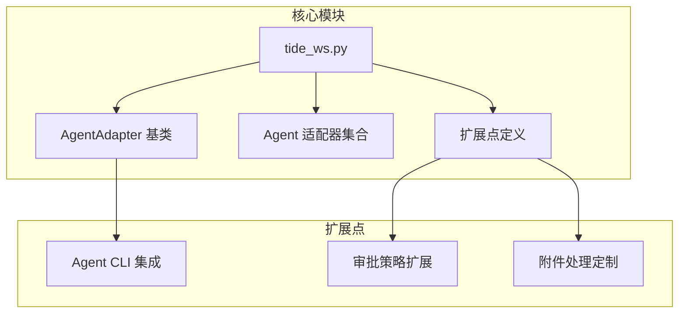
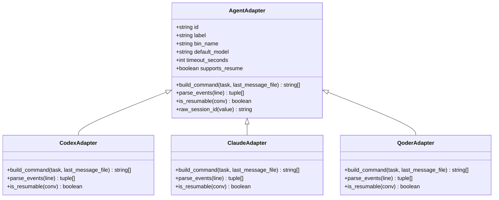
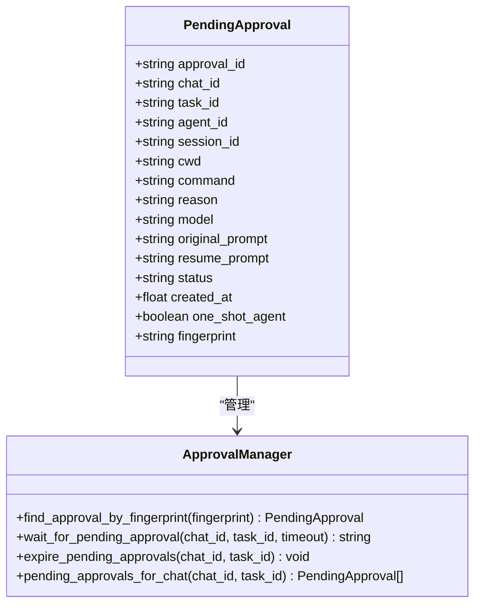
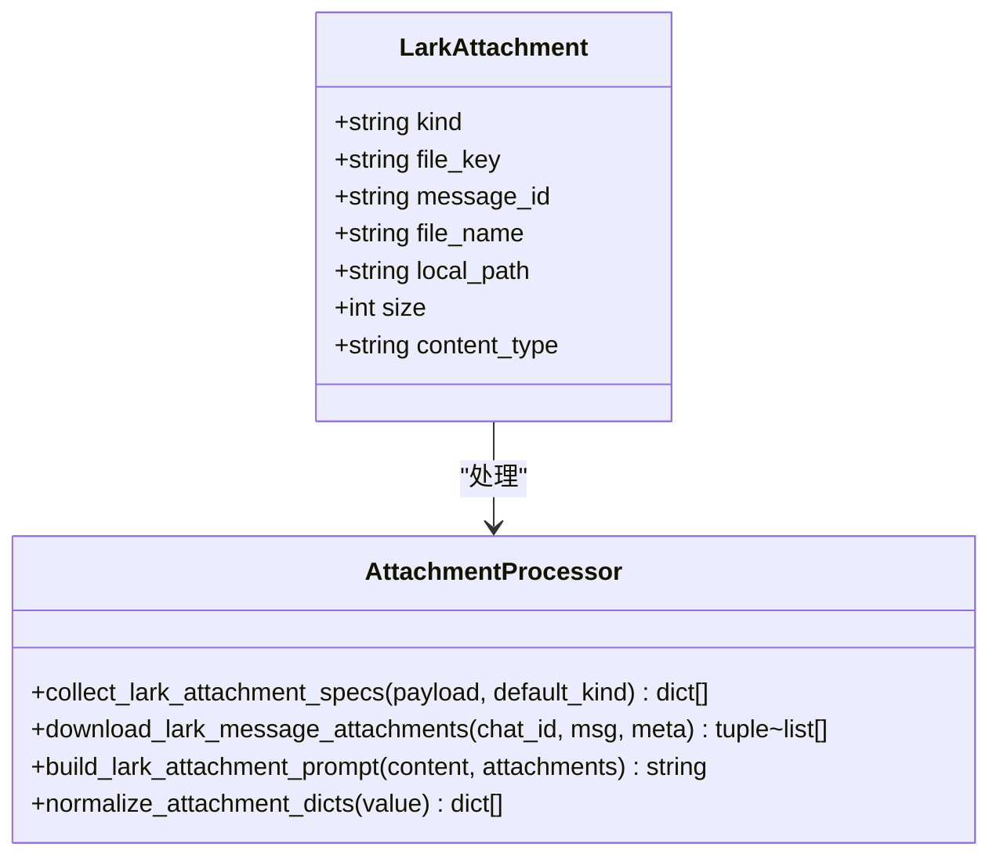
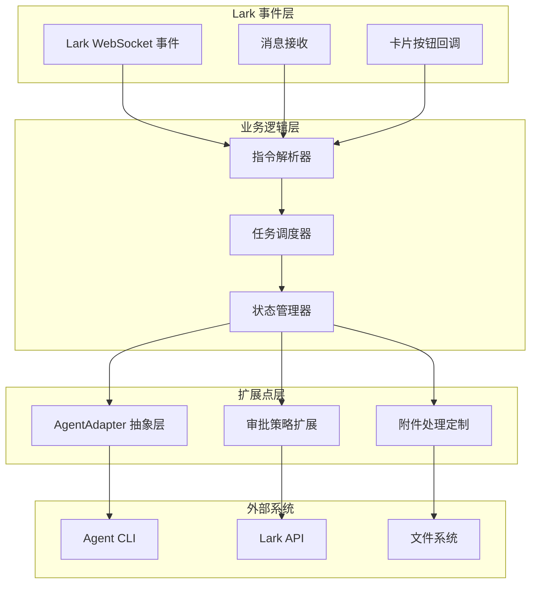
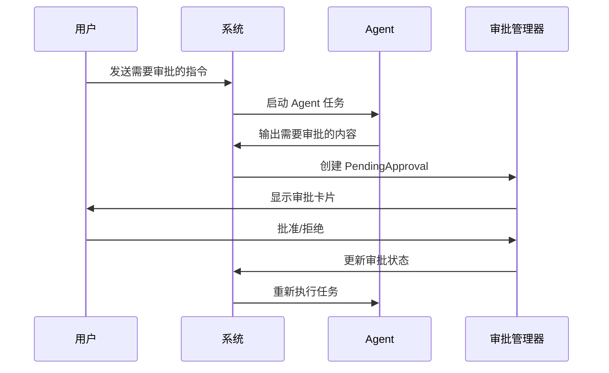
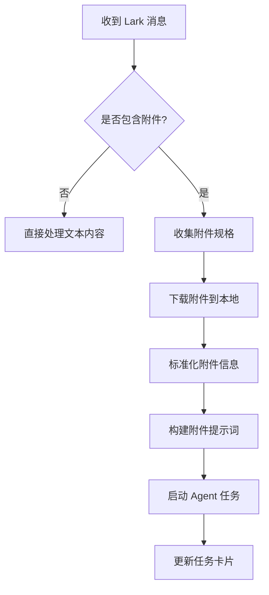
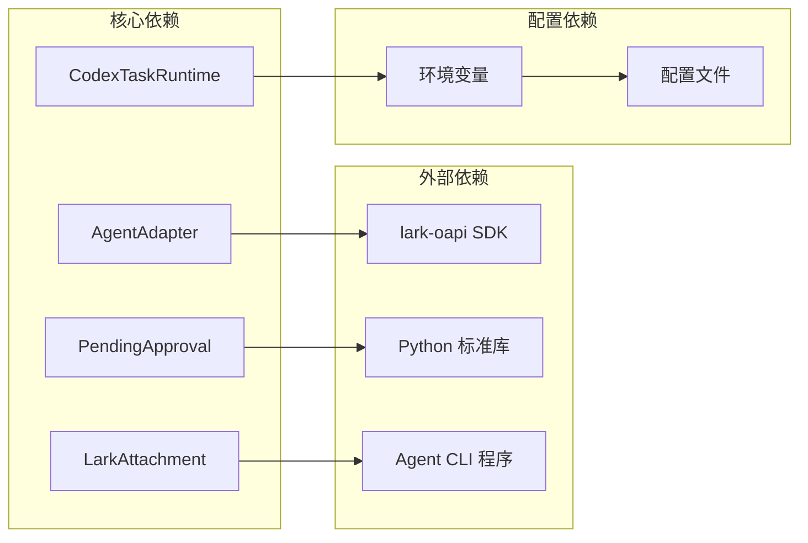

# 扩展点识别与实现

<cite>
**本文档引用的文件**
- [tide_ws.py](file://tide_ws.py)
- [README.md](file://README.md)
</cite>

## 目录
1. [简介](#简介)
2. [项目结构](#项目结构)
3. [核心扩展点](#核心扩展点)
4. [架构概览](#架构概览)
5. [详细组件分析](#详细组件分析)
6. [依赖关系分析](#依赖关系分析)
7. [性能考虑](#性能考虑)
8. [故障排除指南](#故障排除指南)
9. [结论](#结论)

## 简介

Tide 是一个将飞书/Lark 群聊消息转换为 Codex、Claude Code 等 Agent CLI 任务的系统。本文档专注于分析代码中的扩展点，特别是如何添加新的 Agent CLI 集成、扩展审批策略和定制附件处理。

## 项目结构



**图表来源**
- [tide_ws.py:626-853](file://tide_ws.py#L626-L853)

**章节来源**
- [tide_ws.py:1-50](file://tide_ws.py#L1-L50)
- [README.md:1-50](file://README.md#L1-L50)

## 核心扩展点

### Agent CLI 集成扩展点

系统提供了完整的 Agent CLI 集成框架，通过继承 `AgentAdapter` 基类来添加新的 Agent：



**图表来源**
- [tide_ws.py:626-801](file://tide_ws.py#L626-L801)

### 审批策略扩展点

系统通过 `PendingApproval` 数据类和相关的审批管理函数提供审批策略扩展：



**图表来源**
- [tide_ws.py:312-340](file://tide_ws.py#L312-L340)
- [tide_ws.py:3277-3365](file://tide_ws.py#L3277-L3365)

### 附件处理扩展点

系统通过 `LarkAttachment` 数据类和附件处理函数提供附件处理扩展：



**图表来源**
- [tide_ws.py:276-284](file://tide_ws.py#L276-L284)
- [tide_ws.py:1359-1599](file://tide_ws.py#L1359-L1599)

**章节来源**
- [tide_ws.py:626-801](file://tide_ws.py#L626-L801)
- [tide_ws.py:312-340](file://tide_ws.py#L312-L340)
- [tide_ws.py:276-284](file://tide_ws.py#L276-L284)

## 架构概览



**图表来源**
- [tide_ws.py:1642-1652](file://tide_ws.py#L1642-L1652)
- [tide_ws.py:849-853](file://tide_ws.py#L849-L853)

## 详细组件分析

### AgentAdapter 抽象层设计

`AgentAdapter` 是系统的核心扩展点，定义了 Agent CLI 集成的标准接口：

#### 核心接口规范

| 方法 | 参数 | 返回值 | 描述 |
|------|------|--------|------|
| `build_command` | `task: CodexTaskRuntime, last_message_file: Optional[Path]` | `list[str]` | 构建 Agent CLI 命令行参数 |
| `parse_events` | `line: str` | `list[tuple[str, str]]` | 解析 Agent 流式输出事件 |
| `is_resumable` | `conv: Optional[ConversationInfo]` | `boolean` | 判断会话是否可续写 |
| `raw_session_id` | `value: str` | `str` | 提取原始会话 ID |

#### 扩展实现步骤

1. **继承 AgentAdapter 基类**
2. **实现必需方法**
3. **注册到 AGENT_ADAPTERS 映射表**
4. **配置环境变量**

**章节来源**
- [tide_ws.py:626-646](file://tide_ws.py#L626-L646)
- [tide_ws.py:849-853](file://tide_ws.py#L849-L853)

### 审批策略扩展机制

系统通过 `PendingApproval` 数据类和审批管理函数实现灵活的审批策略：

#### 审批生命周期



**图表来源**
- [tide_ws.py:3346-3365](file://tide_ws.py#L3346-L3365)
- [tide_ws.py:3982-4005](file://tide_ws.py#L3982-L4005)

#### 审批策略配置

| 环境变量 | 默认值 | 描述 |
|----------|--------|------|
| `PENDING_APPROVAL_WAIT_SECONDS` | `300` | 等待审批时间（秒） |
| `PENDING_APPROVAL_POLL_SECONDS` | `2` | 审批轮询间隔（秒） |

**章节来源**
- [tide_ws.py:3346-3365](file://tide_ws.py#L3346-L3365)
- [tide_ws.py:116-117](file://tide_ws.py#L116-L117)

### 附件处理扩展框架

系统提供了完整的附件处理框架，支持多种类型的文件和图片：

#### 附件处理流程



**图表来源**
- [tide_ws.py:1449-1539](file://tide_ws.py#L1449-L1539)
- [tide_ws.py:1622-1639](file://tide_ws.py#L1622-L1639)

#### 附件配置选项

| 环境变量 | 默认值 | 描述 |
|----------|--------|------|
| `LARK_ATTACHMENTS_DIR` | `.tide/attachments` | 附件存储目录 |
| `LARK_ATTACHMENT_MAX_BYTES` | `52428800` | 单个附件最大字节数 |
| `LARK_PENDING_ATTACHMENT_TTL_SECONDS` | `900` | 附件暂存超时时间 |

**章节来源**
- [tide_ws.py:1449-1539](file://tide_ws.py#L1449-L1539)
- [tide_ws.py:110-117](file://tide_ws.py#L110-L117)

## 依赖关系分析



**图表来源**
- [tide_ws.py:21-28](file://tide_ws.py#L21-L28)
- [tide_ws.py:34-49](file://tide_ws.py#L34-L49)

**章节来源**
- [tide_ws.py:21-28](file://tide_ws.py#L21-L28)
- [tide_ws.py:34-49](file://tide_ws.py#L34-L49)

## 性能考虑

### 扩展点性能优化

1. **Agent CLI 调用优化**
   - 使用进程池管理 Agent 子进程
   - 实现会话锁避免并发写入冲突
   - 支持任务排队和并发控制

2. **审批处理性能**
   - 审批轮询间隔可配置
   - 支持超时自动处理
   - 审批状态缓存减少查询开销

3. **附件处理性能**
   - 附件下载异步处理
   - 文件大小限制防止内存溢出
   - 附件清理机制避免磁盘占用

### 最佳实践

1. **扩展点设计原则**
   - 保持向后兼容性
   - 提供完善的错误处理
   - 支持配置驱动的扩展

2. **性能监控**
   - 监控 Agent CLI 响应时间
   - 跟踪审批处理延迟
   - 监控附件处理吞吐量

## 故障排除指南

### 常见扩展问题

1. **Agent CLI 集成失败**
   - 检查 `build_command` 方法实现
   - 验证环境变量配置
   - 确认 Agent CLI 可执行权限

2. **审批处理异常**
   - 检查审批超时配置
   - 验证 Lark API 凭据
   - 确认审批状态同步

3. **附件处理错误**
   - 检查文件权限设置
   - 验证磁盘空间充足
   - 确认网络连接正常

### 调试建议

1. **启用详细日志**
   ```bash
   export LOG_LEVEL=DEBUG
   ```

2. **测试扩展点**
   - 使用最小化配置验证
   - 逐步增加复杂度
   - 监控资源使用情况

3. **性能基准测试**
   - 测量扩展点响应时间
   - 验证并发处理能力
   - 评估内存使用情况

**章节来源**
- [tide_ws.py:166-169](file://tide_ws.py#L166-L169)
- [README.md:474-511](file://README.md#L474-L511)

## 结论

Tide 通过精心设计的扩展点架构，为 Agent CLI 集成、审批策略扩展和附件处理定制提供了强大的支持。系统采用抽象基类、数据类和配置驱动的方式，确保了扩展的安全性和可维护性。

### 设计原则总结

1. **开放封闭原则**：对扩展开放，对修改封闭
2. **依赖倒置原则**：依赖抽象而非具体实现
3. **单一职责原则**：每个扩展点职责明确
4. **配置优先原则**：通过配置而非硬编码实现扩展

### 最佳实践建议

1. **渐进式扩展**：从小规模功能开始，逐步完善
2. **充分测试**：为每个扩展点编写单元测试
3. **文档同步**：扩展实现与文档保持一致
4. **性能监控**：持续监控扩展点的性能表现

通过遵循这些原则和实践，开发者可以安全地扩展 Tide 的功能，满足各种复杂的集成需求。