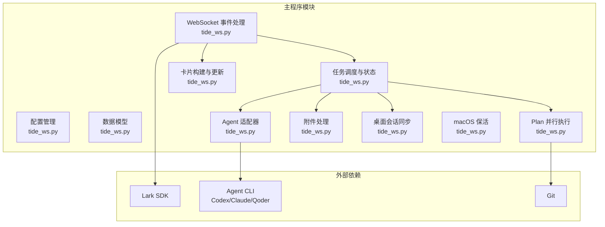
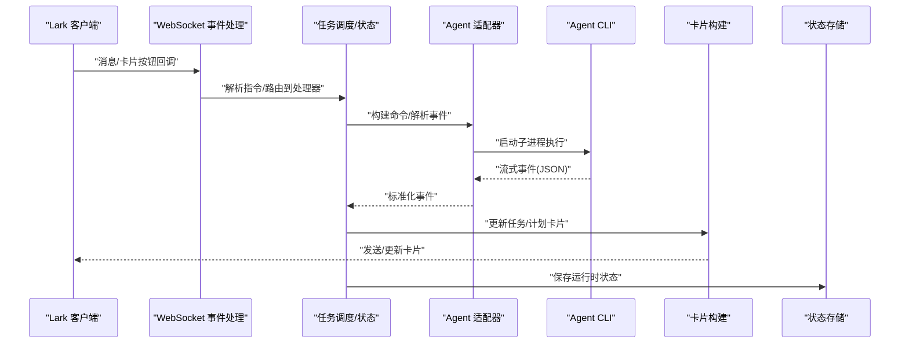
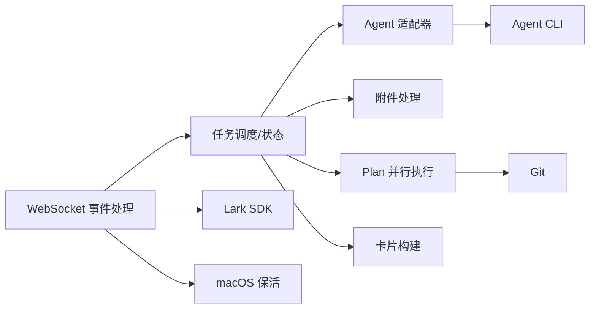

# 模块组织与职责划分

<cite>
**本文档引用的文件**
- [tide_ws.py](file://tide_ws.py)
- [README.md](file://README.md)
- [PPT_OUTLINE.md](file://PPT_OUTLINE.md)
- [ppt_outline_deck.html](file://ppt_outline_deck.html)
</cite>

## 目录
1. [简介](#简介)
2. [项目结构](#项目结构)
3. [核心组件](#核心组件)
4. [架构总览](#架构总览)
5. [详细组件分析](#详细组件分析)
6. [依赖关系分析](#依赖关系分析)
7. [性能考虑](#性能考虑)
8. [故障排除指南](#故障排除指南)
9. [结论](#结论)
10. [附录](#附录)

## 简介
本项目是一个基于 Python 的 Lark（飞书）WebSocket 客户端桥接程序，将 Lark 群聊消息转化为对本地 Agent CLI（如 Codex、Claude Code、Qoder CLI）的执行任务，并将任务状态、审批、结果与项目信息回写到 Lark 卡片中。项目采用模块化设计，围绕配置管理、事件处理、数据模型、Agent 适配器、任务调度与状态管理等模块协同工作。

## 项目结构
- 主程序文件：tide_ws.py（包含配置、事件处理、数据模型、适配器、任务调度、状态管理、卡片构建、计划（Plan）并行执行等）
- 说明文档：README.md（功能、安装、运行、环境变量、常见问题等）
- 概念文档：PPT_OUTLINE.md（功能特性、对比、后续规划等）
- 展示页面：ppt_outline_deck.html（概念性演示页面）

图表来源
- [tide_ws.py:54-151](file://tide_ws.py#L54-L151)
- [tide_ws.py:856-866](file://tide_ws.py#L856-L866)
- [tide_ws.py:1642-1652](file://tide_ws.py#L1642-L1652)
- [tide_ws.py:3423-3480](file://tide_ws.py#L3423-L3480)
- [tide_ws.py:3897-4026](file://tide_ws.py#L3897-L4026)
- [tide_ws.py:4405-4505](file://tide_ws.py#L4405-L4505)

章节来源
- [tide_ws.py:54-151](file://tide_ws.py#L54-L151)
- [README.md:1-517](file://README.md#L1-L517)

## 核心组件
- 配置管理模块：负责读取与解析环境变量、CSV 设置、默认路径与超时等配置，提供统一的配置访问接口。
- WebSocket 事件处理模块：注册并处理 Lark 的消息接收、消息已读、卡片按钮回调等事件，驱动后续业务流程。
- 数据模型模块：定义会话、任务、计划、附件、引用上下文、桌面同步等运行时数据结构，支撑状态持久化与卡片渲染。
- Agent 适配器模块：抽象不同 Agent CLI 的命令构建、事件解析、会话续写能力，屏蔽底层差异。
- 任务调度模块：负责任务创建、排队、执行、卡片更新、审批等待、超时与暂停/继续/终止等控制。
- 状态管理模块：维护运行时状态（聊天、任务、计划）、持久化到本地状态文件、恢复与清理。
- 卡片构建与更新模块：将任务、计划、桌面同步等状态转换为 Lark 卡片，支持交互按钮与动态刷新。
- Plan 并行执行模块：将任务清单拆分为子任务，使用 Git worktree/分支隔离并行执行，提供测试、提交审批、合并与清理。
- 附件处理模块：下载与管理 Lark 附件，支持引用消息找回附件、暂存与消费。
- 桌面会话同步模块：监听 Codex Desktop 会话变化，将结果同步到 Lark 卡片。
- macOS 保活模块：在接入电源时保持脚本与网络活跃，必要时禁用系统睡眠。

章节来源
- [tide_ws.py:54-151](file://tide_ws.py#L54-L151)
- [tide_ws.py:856-866](file://tide_ws.py#L856-L866)
- [tide_ws.py:1642-1652](file://tide_ws.py#L1642-L1652)
- [tide_ws.py:3423-3480](file://tide_ws.py#L3423-L3480)
- [tide_ws.py:3897-4026](file://tide_ws.py#L3897-L4026)
- [tide_ws.py:4405-4505](file://tide_ws.py#L4405-L4505)
- [tide_ws.py:1449-1599](file://tide_ws.py#L1449-L1599)
- [tide_ws.py:4146-4250](file://tide_ws.py#L4146-L4250)
- [tide_ws.py:1751-1770](file://tide_ws.py#L1751-L1770)

## 架构总览
系统采用“事件驱动 + 模块化适配”的架构：
- WebSocket 事件驱动：接收 Lark 事件，分派到相应处理器。
- 适配器抽象：统一不同 Agent CLI 的命令与事件解析。
- 任务与计划：以任务卡片与 Plan 卡片为核心载体，串联执行、审批与状态回写。
- 状态持久化：通过本地状态文件与内存状态共同维护运行态。
- 外部集成：与 Lark SDK、Agent CLI、Git、macOS 系统命令集成。

图表来源
- [tide_ws.py:1642-1652](file://tide_ws.py#L1642-L1652)
- [tide_ws.py:626-801](file://tide_ws.py#L626-L801)
- [tide_ws.py:3897-4026](file://tide_ws.py#L3897-L4026)
- [tide_ws.py:4405-4505](file://tide_ws.py#L4405-L4505)

## 详细组件分析

### 配置管理模块
- 职责边界
  - 读取 .env/.env.example 中的环境变量，提供默认值与校验。
  - 解析 CSV 白名单、权限模式、超时、并发、附件大小与 TTL 等配置。
  - 提供路径规范化、根目录限制、项目标记识别等辅助函数。
- 接口定义
  - 环境变量读取与解析函数（如 parse_csv_set、load_dotenv）。
  - 路径与根目录合法性判断（如 is_allowed_cwd、configured_allowed_roots）。
  - 项目标记与归档状态管理（如 has_project_marker、archive_project_path）。
- 依赖关系
  - 依赖 os、pathlib、re、shlex 等标准库。
  - 依赖运行时状态文件进行项目/会话分类与归档。

章节来源
- [tide_ws.py:34-49](file://tide_ws.py#L34-L49)
- [tide_ws.py:154-164](file://tide_ws.py#L154-L164)
- [tide_ws.py:2074-2101](file://tide_ws.py#L2074-L2101)
- [tide_ws.py:2131-2141](file://tide_ws.py#L2131-L2141)
- [tide_ws.py:2143-2164](file://tide_ws.py#L2143-L2164)

### WebSocket 事件处理模块
- 职责边界
  - 注册 Lark 事件回调：消息接收、消息已读、卡片按钮回调。
  - 校验聊天与发送者权限，过滤无效事件。
  - 解析 Lark 文本、引用上下文、附件规格，构建任务与计划。
- 接口定义
  - get_event_handler：返回事件处理器实例。
  - on_message/on_message_read/on_card_action：事件回调入口。
  - normalize_text_command/strip_bridge_instruction_prefix：指令标准化。
- 依赖关系
  - 依赖 lark_oapi SDK 的事件分发器与消息资源下载接口。
  - 依赖附件处理模块与任务调度模块。

章节来源
- [tide_ws.py:1642-1652](file://tide_ws.py#L1642-L1652)
- [tide_ws.py:1815-1848](file://tide_ws.py#L1815-L1848)
- [tide_ws.py:1859-1874](file://tide_ws.py#L1859-L1874)
- [tide_ws.py:1877-1899](file://tide_ws.py#L1877-L1899)

### 数据模型模块
- 职责边界
  - 定义运行时数据结构：ChatRuntime、CodexTaskRuntime、PlanRuntime、PlanTask、LarkAttachment、LarkReferenceContext、DesktopSyncRuntime、PendingApproval、PendingRestart 等。
  - 提供状态序列化/反序列化（save_runtime/load_known_chats、plan_to_state/plan_from_state）。
  - 提供会话激活、项目识别、分类标记与归档。
- 接口定义
  - get_runtime/get_active_conversation/activate_conversation 等运行时查询与切换。
  - project_* 系列函数：项目识别、显示名、阶段状态。
- 依赖关系
  - 依赖本地状态文件与会话文件索引（Codex/Claude/Qoder）。

章节来源
- [tide_ws.py:173-397](file://tide_ws.py#L173-L397)
- [tide_ws.py:983-1014](file://tide_ws.py#L983-L1014)
- [tide_ws.py:1045-1107](file://tide_ws.py#L1045-L1107)
- [tide_ws.py:1110-1173](file://tide_ws.py#L1110-L1173)
- [tide_ws.py:2028-2058](file://tide_ws.py#L2028-L2058)
- [tide_ws.py:2171-2220](file://tide_ws.py#L2171-L2220)

### Agent 适配器模块
- 职责边界
  - 抽象 Agent CLI 的命令构建、事件解析、会话续写能力。
  - 支持 Codex、Claude Code、Qoder CLI 三种适配器。
- 接口定义
  - AgentAdapter 抽象基类：build_command、parse_events、is_resumable、raw_session_id。
  - 各适配器实现：CodexAdapter、ClaudeAdapter、QoderAdapter。
- 依赖关系
  - 依赖各 Agent CLI 的命令行参数与输出格式（JSON 流）。

章节来源
- [tide_ws.py:626-801](file://tide_ws.py#L626-L801)
- [tide_ws.py:849-853](file://tide_ws.py#L849-L853)

### 任务调度与状态模块
- 职责边界
  - 任务生命周期管理：创建、排队、执行、更新卡片、停止/取消/暂停/继续、重试。
  - 审批等待与指纹匹配，超时与轮询。
  - 会话锁与并发控制，避免同一会话并发写入。
- 接口定义
  - send_task_card/update_task_card/build_task_card。
  - cancel_queued_task/request_task_guidance/append_task_guidance。
  - wait_for_pending_approval/find_approval_by_fingerprint。
- 依赖关系
  - 依赖 Agent 适配器、附件处理、卡片构建、状态持久化。

章节来源
- [tide_ws.py:3897-4026](file://tide_ws.py#L3897-L4026)
- [tide_ws.py:4029-4091](file://tide_ws.py#L4029-L4091)
- [tide_ws.py:4094-4143](file://tide_ws.py#L4094-L4143)
- [tide_ws.py:3277-3365](file://tide_ws.py#L3277-L3365)
- [tide_ws.py:1199-1209](file://tide_ws.py#L1199-L1209)

### 卡片构建与更新模块
- 职责边界
  - 将任务、计划、桌面同步等状态渲染为 Lark 卡片。
  - 提供按钮元素、字段布局、Markdown 渲染与卡片更新。
- 接口定义
  - send_card/update_card/base_card/md/fields/action_row/divider。
  - 任务卡、计划卡、桌面同步卡、重启确认卡等专用卡片构建函数。
- 依赖关系
  - 依赖 Lark SDK 的消息创建/更新接口。

章节来源
- [tide_ws.py:3423-3480](file://tide_ws.py#L3423-L3480)
- [tide_ws.py:3663-3703](file://tide_ws.py#L3663-L3703)
- [tide_ws.py:3705-3733](file://tide_ws.py#L3705-L3733)
- [tide_ws.py:3735-3770](file://tide_ws.py#L3735-L3770)
- [tide_ws.py:3897-4026](file://tide_ws.py#L3897-L4026)
- [tide_ws.py:4405-4505](file://tide_ws.py#L4405-L4505)
- [tide_ws.py:4146-4250](file://tide_ws.py#L4146-L4250)

### Plan 并行执行模块
- 职责边界
  - 解析任务清单，拆分子任务，设置阶段与依赖。
  - 使用 Git worktree/分支隔离并行执行，测试、提交审批、合并与清理。
  - 提供 Plan 卡片、子任务详情、合并总览与清理确认。
- 接口定义
  - parse_plan_task_specs/plan_task_from_text/plan_task_successful。
  - prepare_plan_worktree/git_diff_summary/run_plan_test_command。
  - build_plan_card/build_plan_task_card/build_plan_merge_card。
- 依赖关系
  - 依赖 Git 命令与本地仓库状态。

章节来源
- [tide_ws.py:4252-4323](file://tide_ws.py#L4252-L4323)
- [tide_ws.py:4329-4340](file://tide_ws.py#L4329-L4340)
- [tide_ws.py:3040-3076](file://tide_ws.py#L3040-L3076)
- [tide_ws.py:3101-3125](file://tide_ws.py#L3101-L3125)
- [tide_ws.py:4405-4505](file://tide_ws.py#L4405-L4505)
- [tide_ws.py:4508-4572](file://tide_ws.py#L4508-L4572)
- [tide_ws.py:4575-4627](file://tide_ws.py#L4575-L4627)
- [tide_ws.py:4630-4680](file://tide_ws.py#L4630-L4680)

### 附件处理模块
- 职责边界
  - 下载 Lark 图片/文件资源，规范化文件名与路径，去重与限制数量。
  - 暂存附件并在 TTL 内与后续指令关联，支持引用消息找回附件。
- 接口定义
  - download_lark_message_attachments/stash_pending_lark_attachments/consume_pending_lark_attachments。
  - collect_lark_attachment_specs/normalize_attachment_dicts。
- 依赖关系
  - 依赖 Lark SDK 的资源下载接口与本地文件系统。

章节来源
- [tide_ws.py:1449-1599](file://tide_ws.py#L1449-L1599)
- [tide_ws.py:1595-1640](file://tide_ws.py#L1595-L1640)

### 桌面会话同步模块
- 职责边界
  - 监听 Codex Desktop 会话变化，将用户输入、Agent 输出与完成状态同步到 Lark 卡片。
  - 维护同步运行时状态，支持刷新与打开会话。
- 接口定义
  - get_desktop_sync/build_desktop_sync_card/update_desktop_sync_card。
- 依赖关系
  - 依赖会话文件索引与本地状态。

章节来源
- [tide_ws.py:4146-4250](file://tide_ws.py#L4146-L4250)

### macOS 保活模块
- 职责边界
  - 在接入电源时启动 caffeinate，必要时设置 disablesleep，定期检查电源状态。
- 接口定义
  - keep_awake_loop/start_caffeinate/set_disable_sleep/stop_power_management。
- 依赖关系
  - 依赖系统命令 pmset/caffeinate。

章节来源
- [tide_ws.py:1751-1770](file://tide_ws.py#L1751-L1770)
- [tide_ws.py:1659-1744](file://tide_ws.py#L1659-L1744)

## 依赖关系分析
- 模块耦合
  - 事件处理模块与任务调度模块强耦合，事件驱动任务创建与更新。
  - 适配器模块与任务调度模块弱耦合，通过统一接口解耦不同 Agent CLI。
  - 卡片模块与任务/计划模块弱耦合，通过状态渲染卡片。
  - 附件与引用上下文模块与任务调度模块弱耦合，提供输入增强。
- 外部依赖
  - Lark SDK：事件分发、消息创建/更新、资源下载。
  - Agent CLI：Codex/Claude/Qoder，通过命令行与 JSON 流交互。
  - Git：Plan 并行执行与工作树/分支管理。
  - 系统命令：macOS caffeinate/pmset。

图表来源
- [tide_ws.py:1642-1652](file://tide_ws.py#L1642-L1652)
- [tide_ws.py:3897-4026](file://tide_ws.py#L3897-L4026)
- [tide_ws.py:4405-4505](file://tide_ws.py#L4405-L4505)
- [tide_ws.py:3040-3076](file://tide_ws.py#L3040-L3076)

章节来源
- [tide_ws.py:856-866](file://tide_ws.py#L856-L866)
- [tide_ws.py:1642-1652](file://tide_ws.py#L1642-L1652)
- [tide_ws.py:3423-3480](file://tide_ws.py#L3423-L3480)

## 性能考虑
- 事件队列与并发
  - 事件队列最大积压（LARK_EVENT_QUEUE_MAXSIZE）限制内存占用。
  - 任务与会话锁避免并发写入，提高稳定性。
- I/O 与磁盘
  - 附件下载限制单文件大小与总数量，避免磁盘压力。
  - 本地状态文件采用原子写入与权限保护，减少损坏风险。
- 网络与外部调用
  - Lark API 调用加锁，避免并发冲突。
  - Agent CLI 子进程超时控制，防止阻塞。
- macOS 保活
  - 电源状态检查周期可配置，平衡能耗与保活需求。

## 故障排除指南
- 常见问题
  - 收不到 Lark 消息：检查 App ID/Secret、Encrypt Key、Verification Token、权限与机器人加入情况。
  - 审批批准后未继续：确认重启后加载最新代码与批准后的配置（APPROVED_*）。
  - Git 提交失败：检查 sandbox 权限，使用批准后的策略重试。
  - 电脑睡眠：macOS 下可启用 keep-awake 与 disablesleep，注意权限。
- 日志与诊断
  - 通过 LOG_LEVEL 调整日志级别，关注 send_card/send_msg 失败与权限错误。
  - 使用 /status 与 /daily 查看状态与统计，辅助定位问题。

章节来源
- [README.md:474-511](file://README.md#L474-L511)

## 结论
本项目通过清晰的模块划分与事件驱动架构，实现了 Lark 与本地 Agent CLI 的高效桥接。配置管理、事件处理、数据模型、适配器、任务调度、状态管理、卡片构建、Plan 并行、附件处理、桌面同步与 macOS 保活等模块协同工作，既满足工程任务的远程控制、审批与状态管理需求，又保持了较低的侵入性与良好的扩展性。

## 附录
- 环境变量与配置项参考：README.md 的“环境变量”章节。
- 功能特性与对比：PPT_OUTLINE.md 的“主要功能和特性”、“开源项目对比”等章节。
- 运行与调试：README.md 的“运行”、“停止/重启”、“日志”等章节。