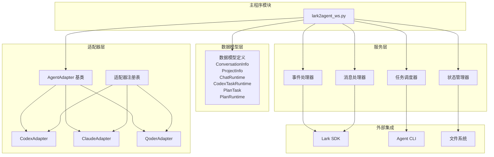
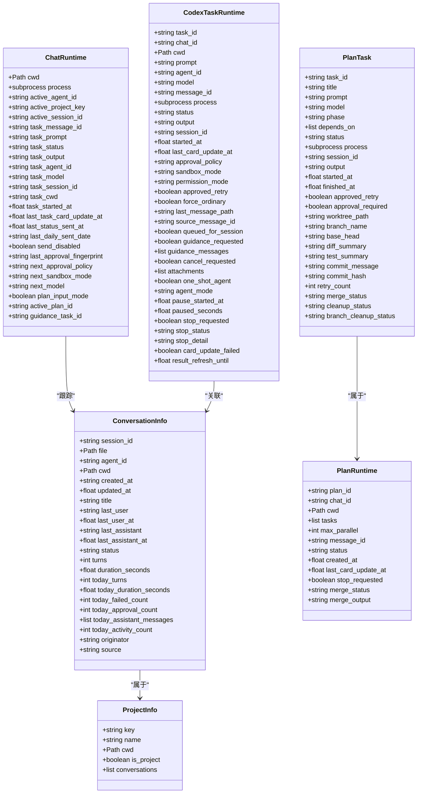
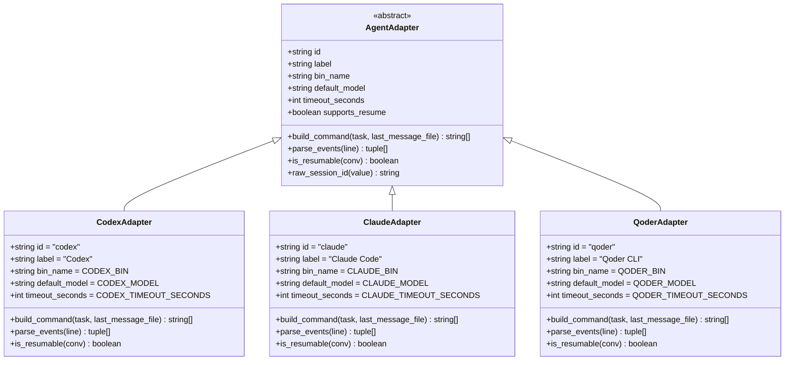
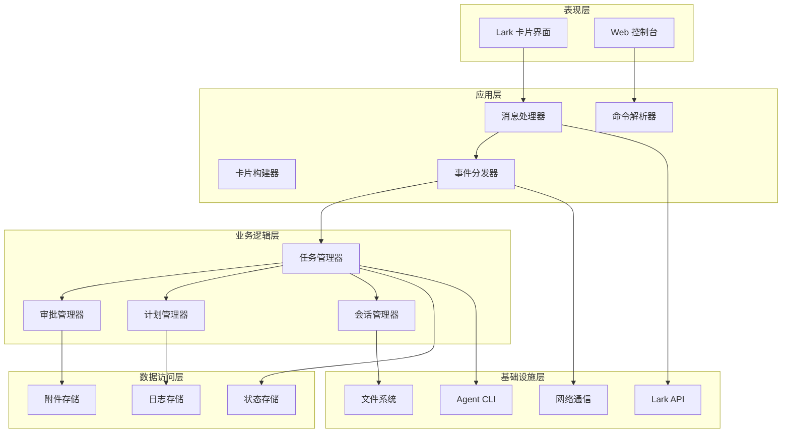
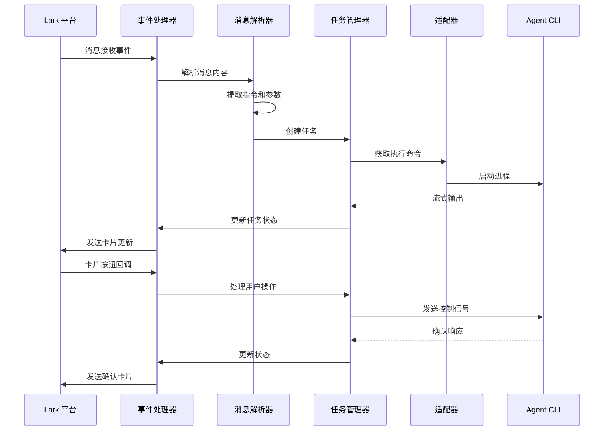
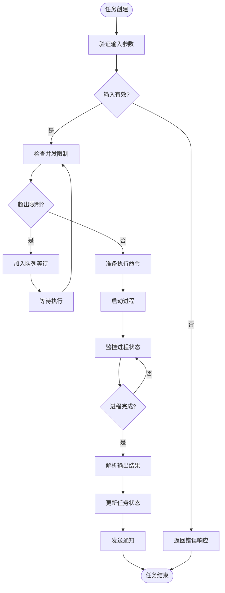
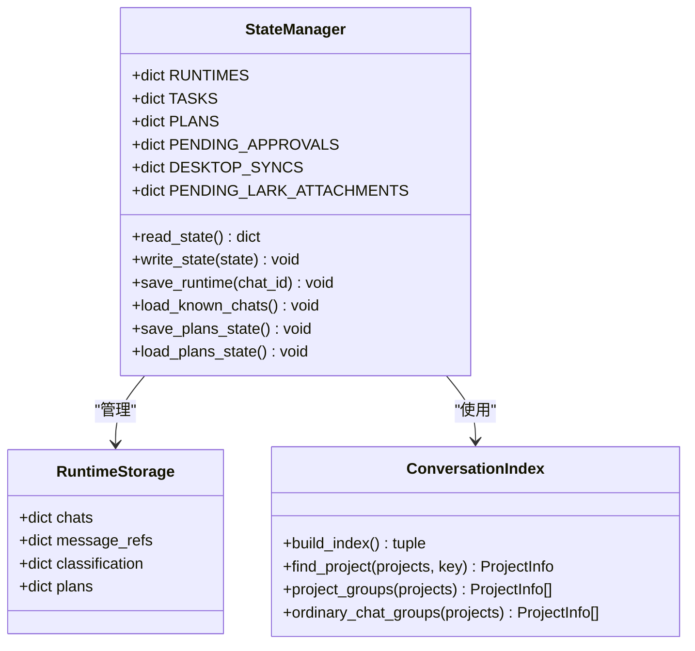
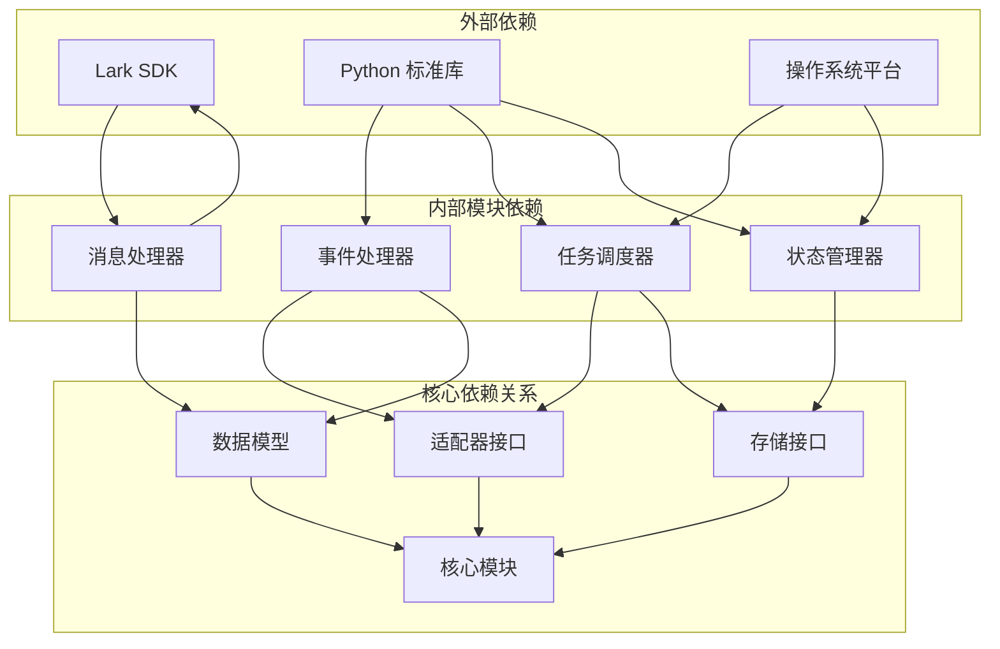

# 组件交互与依赖关系

<cite>
**本文档引用的文件**
- [lark2agent_ws.py](file://lark2agent_ws.py)
- [README.md](file://README.md)
</cite>

## 目录
1. [简介](#简介)
2. [项目结构](#项目结构)
3. [核心组件](#核心组件)
4. [架构概览](#架构概览)
5. [详细组件分析](#详细组件分析)
6. [依赖关系分析](#依赖关系分析)
7. [性能考虑](#性能考虑)
8. [故障排除指南](#故障排除指南)
9. [结论](#结论)

## 简介

Lark2Agent 是一个将飞书/Lark 群聊消息转换为多代理 CLI 任务的系统，支持 Codex、Claude Code 和 Qoder CLI 等多种 AI 代理。该系统通过 WebSocket 长连接接收 Lark 事件，将用户指令转换为相应的代理任务，实时监控任务执行状态，并将进度和结果同步回 Lark 卡片。

## 项目结构

**图表来源**
- [lark2agent_ws.py:173-385](file://lark2agent_ws.py#L173-L385)
- [lark2agent_ws.py:626-853](file://lark2agent_ws.py#L626-L853)

**章节来源**
- [lark2agent_ws.py:1-150](file://lark2agent_ws.py#L1-L150)
- [README.md:1-517](file://README.md#L1-L517)

## 核心组件

### 数据模型组件

系统定义了完整的数据模型层次结构：

**图表来源**
- [lark2agent_ws.py:173-385](file://lark2agent_ws.py#L173-L385)

### 适配器组件

系统采用适配器模式支持多个 AI 代理：

**图表来源**
- [lark2agent_ws.py:626-853](file://lark2agent_ws.py#L626-L853)

**章节来源**
- [lark2agent_ws.py:173-853](file://lark2agent_ws.py#L173-L853)

## 架构概览

系统采用分层架构设计，各层职责清晰分离：

**图表来源**
- [lark2agent_ws.py:856-891](file://lark2agent_ws.py#L856-L891)
- [lark2agent_ws.py:1642-1652](file://lark2agent_ws.py#L1642-L1652)

## 详细组件分析

### 事件处理器组件

事件处理器负责接收和处理来自 Lark 的各种事件：

**图表来源**
- [lark2agent_ws.py:1642-1652](file://lark2agent_ws.py#L1642-L1652)
- [lark2agent_ws.py:4029-4091](file://lark2agent_ws.py#L4029-L4091)

### 任务调度器组件

任务调度器管理任务的生命周期和执行顺序：

**图表来源**
- [lark2agent_ws.py:5471-5599](file://lark2agent_ws.py#L5471-L5599)
- [lark2agent_ws.py:4029-4091](file://lark2agent_ws.py#L4029-L4091)

### 状态管理器组件

状态管理器负责维护系统的持久化状态：

**图表来源**
- [lark2agent_ws.py:869-891](file://lark2agent_ws.py#L869-L891)
- [lark2agent_ws.py:1017-1173](file://lark2agent_ws.py#L1017-L1173)

**章节来源**
- [lark2agent_ws.py:869-1173](file://lark2agent_ws.py#L869-L1173)

## 依赖关系分析

系统采用松耦合设计，通过接口和抽象类实现组件间的解耦：

**图表来源**
- [lark2agent_ws.py:626-853](file://lark2agent_ws.py#L626-L853)
- [lark2agent_ws.py:856-891](file://lark2agent_ws.py#L856-L891)

### 耦合度分析

**低耦合特性**：
- 适配器模式实现了代理实现与核心逻辑的解耦
- 数据模型与业务逻辑分离
- 事件处理器与具体实现解耦

**内聚性分析**：
- 每个模块职责单一，内聚性良好
- 相关功能集中在同一模块中
- 接口设计清晰，便于维护

**章节来源**
- [lark2agent_ws.py:626-1173](file://lark2agent_ws.py#L626-L1173)

## 性能考虑

系统在设计时充分考虑了性能优化：

### 并发控制
- 使用线程锁保护共享资源
- 限制同时运行的任务数量
- 实现任务队列管理

### 内存管理
- 及时清理临时文件
- 限制状态文件大小
- 优化数据结构存储

### 网络优化
- 批量处理消息
- 合并卡片更新
- 异步处理长耗时操作

## 故障排除指南

### 常见问题诊断

**Lark 消息接收问题**：
- 检查应用配置和权限
- 验证事件订阅设置
- 确认 WebSocket 连接状态

**任务执行失败**：
- 检查代理 CLI 可用性
- 验证工作目录权限
- 查看任务超时设置

**审批流程异常**：
- 检查审批状态同步
- 验证用户权限
- 确认审批超时配置

**章节来源**
- [README.md:474-517](file://README.md#L474-L517)

## 结论

Lark2Agent 系统通过清晰的分层架构和适配器模式，成功实现了多代理任务调度和状态管理。系统具有良好的扩展性和维护性，能够有效处理复杂的多用户、多任务场景。通过合理的并发控制和状态管理机制，系统在保证性能的同时提供了可靠的用户体验。

未来可以考虑的改进方向包括：
- 增强错误恢复机制
- 优化性能监控和告警
- 扩展更多代理支持
- 改进用户界面交互