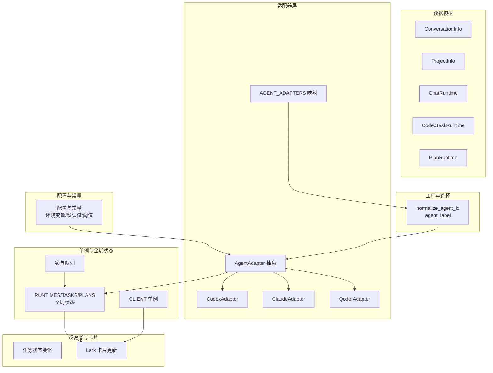
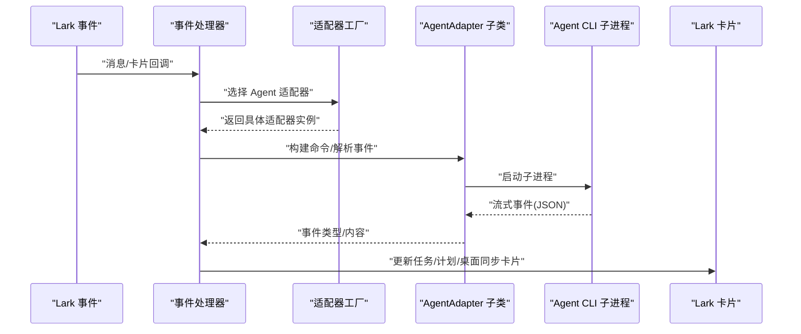
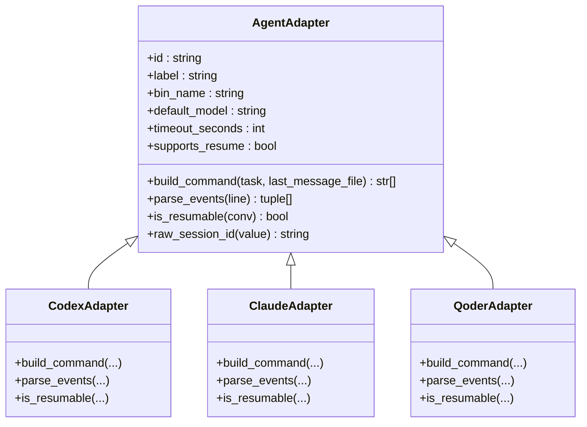
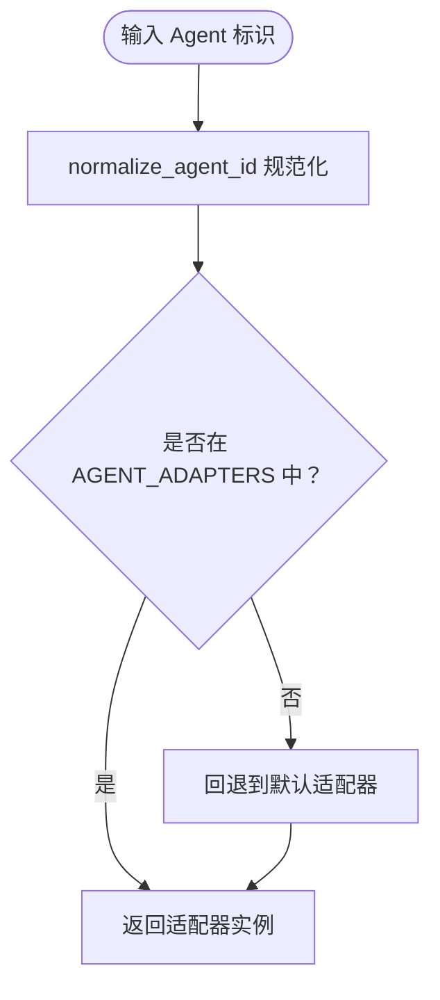
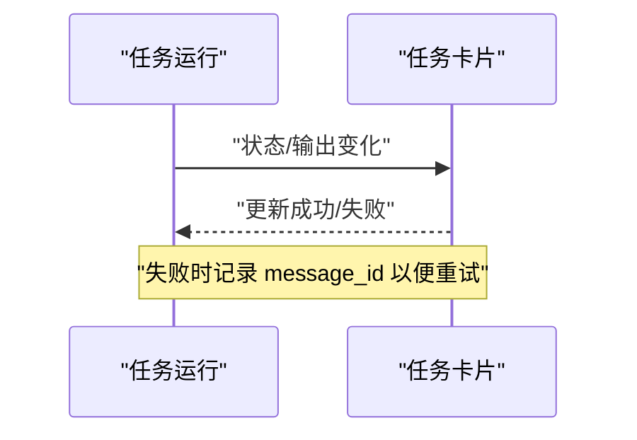
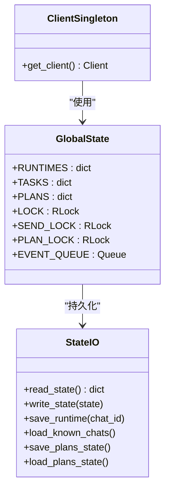
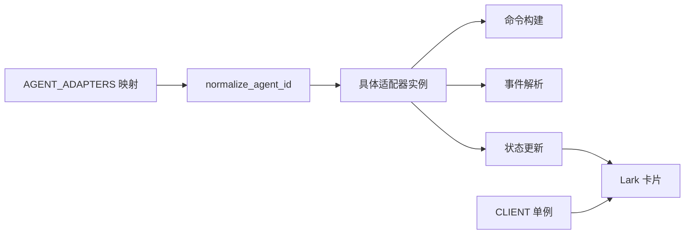

# 设计模式应用

<cite>
**本文档引用的文件**
- [lark2agent_ws.py](file://lark2agent_ws.py)
- [README.md](file://README.md)
</cite>

## 目录
1. [简介](#简介)
2. [项目结构](#项目结构)
3. [核心组件](#核心组件)
4. [架构总览](#架构总览)
5. [详细组件分析](#详细组件分析)
6. [依赖关系分析](#依赖关系分析)
7. [性能考虑](#性能考虑)
8. [故障排查指南](#故障排查指南)
9. [结论](#结论)

## 简介
本文件围绕 Lark2Agent 的代码实现，系统梳理并深入分析其中应用的设计模式，重点包括：
- 适配器模式：AgentAdapter 及其子类 CodexAdapter、ClaudeAdapter、QoderAdapter
- 工厂模式：Agent 适配器的创建与选择
- 观察者模式：任务状态通知与卡片更新机制
- 单例模式：全局状态管理（客户端、运行时、计划等）

通过对这些模式的实现细节、应用场景与带来的收益进行说明，并辅以 UML 图与代码示例路径，帮助读者理解如何通过设计模式提升系统的可扩展性与可维护性。

## 项目结构
Lark2Agent 的核心逻辑集中在单文件中，采用模块化数据类与函数组织，配合全局状态字典与锁实现线程安全的运行时管理。关键模块包括：
- 配置与常量：环境变量注入、默认值与阈值
- 数据模型：ConversationInfo、ProjectInfo、ChatRuntime、CodexTaskRuntime、PlanRuntime 等
- 适配器层：AgentAdapter 及其子类，统一 Agent CLI 的命令构建与事件解析
- 工厂与选择：AGENT_ADAPTERS 映射与 normalize_agent_id
- 观察者与卡片：任务状态变化驱动 Lark 卡片更新
- 单例与全局状态：CLIENT、RUNTIMES、TASKS、PLANS 等

**图表来源**
- [lark2agent_ws.py:387-406](file://lark2agent_ws.py#L387-L406)
- [lark2agent_ws.py:626-801](file://lark2agent_ws.py#L626-L801)
- [lark2agent_ws.py:849-853](file://lark2agent_ws.py#L849-L853)
- [lark2agent_ws.py:1175-1182](file://lark2agent_ws.py#L1175-L1182)
- [lark2agent_ws.py:3423-3743](file://lark2agent_ws.py#L3423-L3743)

**章节来源**
- [lark2agent_ws.py:54-151](file://lark2agent_ws.py#L54-L151)
- [lark2agent_ws.py:173-386](file://lark2agent_ws.py#L173-L386)
- [lark2agent_ws.py:3423-3743](file://lark2agent_ws.py#L3423-L3743)

## 核心组件
- AgentAdapter 抽象类：定义统一接口（命令构建、事件解析、会话恢复能力）
- CodexAdapter/ClaudeAdapter/QoderAdapter：针对不同 Agent CLI 的具体实现
- AGENT_ADAPTERS：适配器工厂映射
- ChatRuntime/CodexTaskRuntime/PlanRuntime：运行时状态与任务生命周期管理
- 全局状态：RUNTIMES、TASKS、PLANS、CLIENT 等

这些组件共同构成“适配器 + 工厂 + 观察者 + 单例”的设计骨架，既保证了对多 Agent 的统一抽象，又实现了对 Lark 卡片状态的可观测与可更新。

**章节来源**
- [lark2agent_ws.py:626-801](file://lark2agent_ws.py#L626-L801)
- [lark2agent_ws.py:849-853](file://lark2agent_ws.py#L849-L853)
- [lark2agent_ws.py:173-386](file://lark2agent_ws.py#L173-L386)
- [lark2agent_ws.py:387-406](file://lark2agent_ws.py#L387-L406)

## 架构总览
Lark2Agent 的运行时架构以“适配器层 + 工厂层 + 观察者层 + 单例层”为核心，通过全局状态与锁实现线程安全，通过 Lark 事件回调与卡片更新实现任务状态的可视化与可交互。

**图表来源**
- [lark2agent_ws.py:1642-1652](file://lark2agent_ws.py#L1642-L1652)
- [lark2agent_ws.py:849-853](file://lark2agent_ws.py#L849-L853)
- [lark2agent_ws.py:626-801](file://lark2agent_ws.py#L626-L801)
- [lark2agent_ws.py:3423-3743](file://lark2agent_ws.py#L3423-L3743)

## 详细组件分析

### 适配器模式：AgentAdapter 与子类
- 抽象接口：build_command、parse_events、is_resumable、raw_session_id
- 具体实现：
  - CodexAdapter：面向 Codex CLI，支持 resume 与 exec
  - ClaudeAdapter：面向 Claude Code CLI，支持 --permission-mode 与 --resume
  - QoderAdapter：面向 Qoder CLI，支持 --permission-mode 与 --resume，支持 quest 模式
- 作用：屏蔽不同 Agent CLI 的差异，统一命令构建与事件解析流程

**图表来源**
- [lark2agent_ws.py:626-801](file://lark2agent_ws.py#L626-L801)

**章节来源**
- [lark2agent_ws.py:626-801](file://lark2agent_ws.py#L626-L801)

### 工厂模式：Agent 适配器创建
- AGENT_ADAPTERS 映射：将字符串标识映射到具体适配器实例
- normalize_agent_id：规范化 Agent 标识（含别名映射），并回退到默认
- agent_label：根据标识获取人类可读标签
- 应用场景：根据用户指令或会话上下文动态选择合适的 Agent

**图表来源**
- [lark2agent_ws.py:409-425](file://lark2agent_ws.py#L409-L425)
- [lark2agent_ws.py:446-448](file://lark2agent_ws.py#L446-L448)
- [lark2agent_ws.py:849-853](file://lark2agent_ws.py#L849-L853)

**章节来源**
- [lark2agent_ws.py:409-425](file://lark2agent_ws.py#L409-L425)
- [lark2agent_ws.py:446-448](file://lark2agent_ws.py#L446-L448)
- [lark2agent_ws.py:849-853](file://lark2agent_ws.py#L849-L853)

### 观察者模式：任务状态通知机制
- 任务状态驱动卡片更新：任务状态变化时，通过 build_task_card/update_task_card 更新 Lark 卡片
- 计划状态驱动卡片更新：PlanRuntime 的状态变化通过 build_plan_card/update_plan_card 更新卡片
- 桌面同步卡片：Codex Desktop 会话变化通过 build_desktop_sync_card/update_desktop_sync_card 更新卡片
- 事件驱动：Lark 事件回调触发状态更新与卡片发送

**图表来源**
- [lark2agent_ws.py:3897-4026](file://lark2agent_ws.py#L3897-L4026)
- [lark2agent_ws.py:4094-4143](file://lark2agent_ws.py#L4094-L4143)
- [lark2agent_ws.py:4405-4505](file://lark2agent_ws.py#L4405-L4505)
- [lark2agent_ws.py:4691-4701](file://lark2agent_ws.py#L4691-L4701)
- [lark2agent_ws.py:4176-4203](file://lark2agent_ws.py#L4176-L4203)
- [lark2agent_ws.py:4206-4249](file://lark2agent_ws.py#L4206-L4249)

**章节来源**
- [lark2agent_ws.py:3897-4026](file://lark2agent_ws.py#L3897-L4026)
- [lark2agent_ws.py:4094-4143](file://lark2agent_ws.py#L4094-L4143)
- [lark2agent_ws.py:4405-4505](file://lark2agent_ws.py#L4405-L4505)
- [lark2agent_ws.py:4691-4701](file://lark2agent_ws.py#L4691-L4701)
- [lark2agent_ws.py:4176-4203](file://lark2agent_ws.py#L4176-L4203)
- [lark2agent_ws.py:4206-4249](file://lark2agent_ws.py#L4206-L4249)

### 单例模式：全局状态管理
- CLIENT：Lark 客户端单例，懒加载与缓存
- RUNTIMES/TASKS/PLANS：全局运行时、任务与计划状态字典
- 锁与队列：LOCK、SEND_LOCK、PLAN_LOCK、EVENT_QUEUE 等，保证并发安全
- 状态持久化：read_state/write_state 与 save_runtime/load_known_chats/save_plans_state/load_plans_state

**图表来源**
- [lark2agent_ws.py:856-866](file://lark2agent_ws.py#L856-L866)
- [lark2agent_ws.py:387-406](file://lark2agent_ws.py#L387-L406)
- [lark2agent_ws.py:869-891](file://lark2agent_ws.py#L869-L891)
- [lark2agent_ws.py:983-1014](file://lark2agent_ws.py#L983-L1014)
- [lark2agent_ws.py:1017-1043](file://lark2agent_ws.py#L1017-L1043)
- [lark2agent_ws.py:1152-1173](file://lark2agent_ws.py#L1152-L1173)
- [lark2agent_ws.py:1160-1171](file://lark2agent_ws.py#L1160-L1171)

**章节来源**
- [lark2agent_ws.py:856-866](file://lark2agent_ws.py#L856-L866)
- [lark2agent_ws.py:387-406](file://lark2agent_ws.py#L387-L406)
- [lark2agent_ws.py:869-891](file://lark2agent_ws.py#L869-L891)
- [lark2agent_ws.py:983-1014](file://lark2agent_ws.py#L983-L1014)
- [lark2agent_ws.py:1017-1043](file://lark2agent_ws.py#L1017-L1043)
- [lark2agent_ws.py:1152-1173](file://lark2agent_ws.py#L1152-L1173)
- [lark2agent_ws.py:1160-1171](file://lark2agent_ws.py#L1160-L1171)

## 依赖关系分析
- 适配器依赖：具体适配器依赖于各自 CLI 的命令行约定与输出格式
- 工厂依赖：normalize_agent_id 依赖 AGENT_ADAPTERS 映射
- 观察者依赖：卡片更新依赖 Lark 客户端与事件回调
- 单例依赖：CLIENT 单例被卡片发送与消息处理广泛使用

**图表来源**
- [lark2agent_ws.py:849-853](file://lark2agent_ws.py#L849-L853)
- [lark2agent_ws.py:409-425](file://lark2agent_ws.py#L409-L425)
- [lark2agent_ws.py:626-801](file://lark2agent_ws.py#L626-L801)
- [lark2agent_ws.py:3423-3743](file://lark2agent_ws.py#L3423-L3743)
- [lark2agent_ws.py:856-866](file://lark2agent_ws.py#L856-L866)

**章节来源**
- [lark2agent_ws.py:849-853](file://lark2agent_ws.py#L849-L853)
- [lark2agent_ws.py:409-425](file://lark2agent_ws.py#L409-L425)
- [lark2agent_ws.py:626-801](file://lark2agent_ws.py#L626-L801)
- [lark2agent_ws.py:3423-3743](file://lark2agent_ws.py#L3423-L3743)
- [lark2agent_ws.py:856-866](file://lark2agent_ws.py#L856-L866)

## 性能考虑
- 事件解析与卡片更新：通过节流（如 last_card_update_at）减少频繁更新
- 并发控制：使用 RLock 与线程安全的数据结构，避免竞态条件
- 超时与重试：不同 Agent 的超时策略与重试逻辑（批准后重试）降低阻塞
- 会话锁：session_run_lock 保证同一会话串行执行，避免并发写入

[本节为通用指导，无需特定文件分析]

## 故障排查指南
- 任务卡更新失败：检查 update_card 返回值与 message_id，必要时重建卡片
- 审批状态：通过 wait_for_pending_approval 与 pending_approvals_for_chat 获取审批状态
- 状态持久化：read_state/write_state 与 save_runtime/load_known_chats 用于恢复运行态
- 附件与消息引用：record_lark_message_ref/find_lark_message_ref 支持消息引用与附件溯源

**章节来源**
- [lark2agent_ws.py:4132-4143](file://lark2agent_ws.py#L4132-L4143)
- [lark2agent_ws.py:3346-3365](file://lark2agent_ws.py#L3346-L3365)
- [lark2agent_ws.py:922-953](file://lark2agent_ws.py#L922-L953)
- [lark2agent_ws.py:956-961](file://lark2agent_ws.py#L956-L961)

## 结论
Lark2Agent 通过“适配器 + 工厂 + 观察者 + 单例”的设计模式组合，实现了对多 Agent CLI 的统一抽象、灵活选择、可观测的状态更新与可靠的全局状态管理。这种架构在保证可扩展性的同时，也提升了系统的可维护性与稳定性，便于未来新增 Agent 类型与增强卡片交互体验。