# 开发指南

<cite>
**本文档引用的文件**
- [README.md](file://README.md)
- [DEVELOPMENT.md](file://DEVELOPMENT.md)
- [tide_ws.py](file://tide_ws.py)
- [PPT_OUTLINE.md](file://PPT_OUTLINE.md)
- [tests/test_lark_reference_context.py](file://tests/test_lark_reference_context.py)
</cite>

## 目录
1. [简介](#简介)
2. [项目结构](#项目结构)
3. [核心组件](#核心组件)
4. [架构概览](#架构概览)
5. [详细组件分析](#详细组件分析)
6. [设计模式应用](#设计模式应用)
7. [扩展点识别](#扩展点识别)
8. [测试策略](#测试策略)
9. [调试与故障排除](#调试与故障排除)
10. [代码贡献流程](#代码贡献流程)
11. [开发环境搭建](#开发环境搭建)
12. [性能考虑](#性能考虑)
13. [结论](#结论)

## 简介

Tide 是一个将飞书/Lark 群聊消息转换为 Codex、Claude Code 等 Agent CLI 任务的桥梁项目。它通过 WebSocket 连接 Lark 平台，将自然语言指令转换为本地 Agent CLI 执行，并将执行进度、任务结果、审批操作和项目状态同步回 Lark 卡片。

该项目的核心价值在于：
- 将本地 Agent CLI 的强大执行能力与 Lark 的协作入口相结合
- 提供可视化的任务管理和状态跟踪
- 支持并行任务处理和项目级别的代码变更管理
- 实现了完整的审批流程和安全控制机制

## 项目结构

项目采用简洁的单文件架构，主要包含以下核心模块：

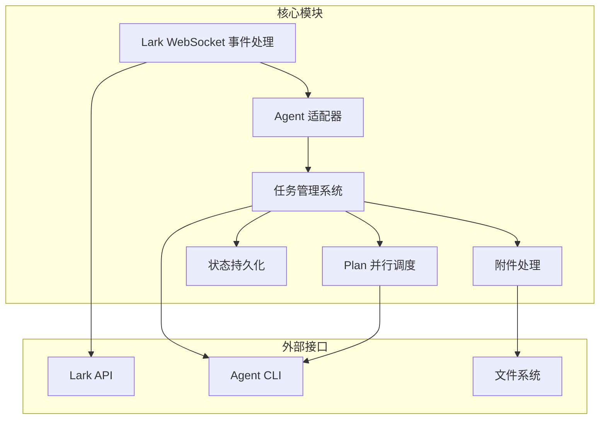

**图表来源**
- [tide_ws.py:1-8589](file://tide_ws.py#L1-L8589)

**章节来源**
- [README.md:1-517](file://README.md#L1-L517)
- [DEVELOPMENT.md:1-566](file://DEVELOPMENT.md#L1-L566)

## 核心组件

### 数据模型层

项目定义了多个核心数据结构来管理运行时状态：

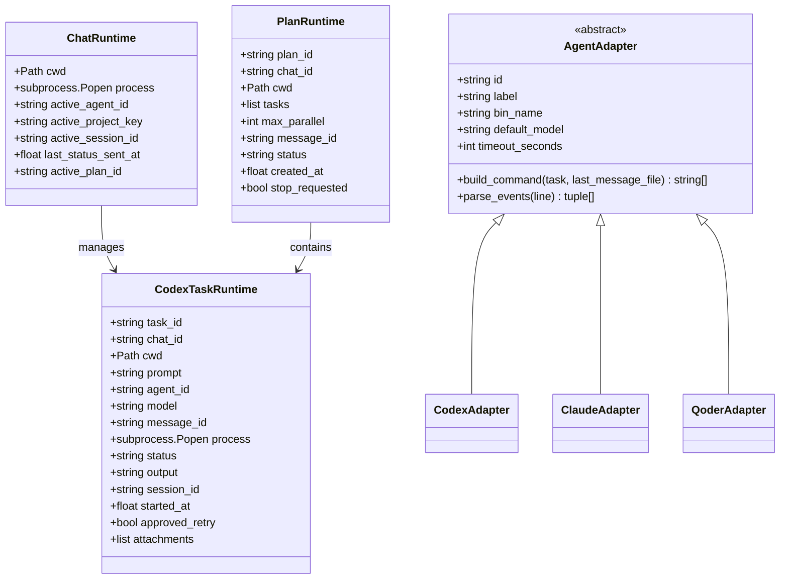

**图表来源**
- [tide_ws.py:173-385](file://tide_ws.py#L173-L385)

### 适配器系统

项目实现了灵活的 Agent 适配器模式，支持多种 Agent CLI：

| Agent 类型 | 二进制名称 | 默认模型 | 超时时间 | 特殊功能 |
|------------|------------|----------|----------|----------|
| Codex | codex | CODEX_MODEL | CODEX_TIMEOUT_SECONDS | 会话恢复、沙箱模式 |
| Claude Code | claude | CLAUDE_MODEL | CLAUDE_TIMEOUT_SECONDS | 权限模式、工具调用 |
| Qoder CLI | qodercli | QODER_MODEL | QODER_TIMEOUT_SECONDS | Quest 模式、工作树 |

**章节来源**
- [tide_ws.py:626-801](file://tide_ws.py#L626-L801)
- [DEVELOPMENT.md:40-51](file://DEVELOPMENT.md#L40-L51)

## 架构概览

Tide 采用多线程架构，通过 WebSocket 与 Lark 平台保持实时连接：

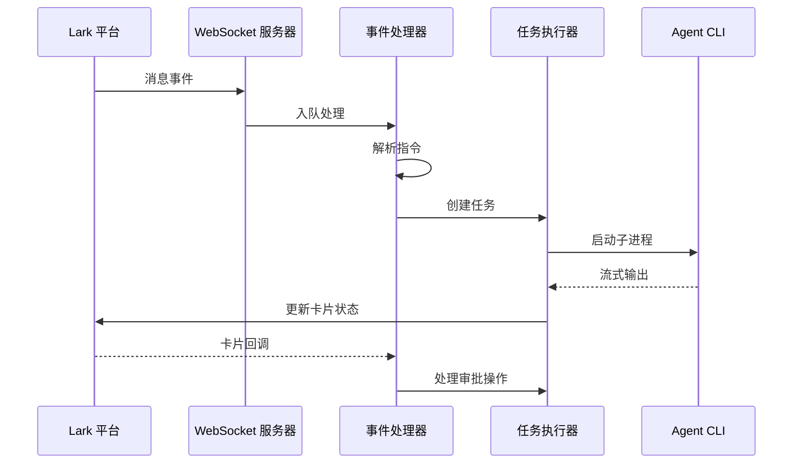

**图表来源**
- [tide_ws.py:856-866](file://tide_ws.py#L856-L866)
- [DEVELOPMENT.md:21-31](file://DEVELOPMENT.md#L21-L31)

## 详细组件分析

### 任务管理系统

任务管理系统是项目的核心，负责协调所有 Agent 执行任务：

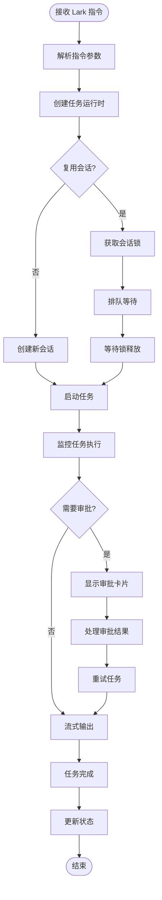

**图表来源**
- [tide_ws.py:1175-1182](file://tide_ws.py#L1175-L1182)
- [tide_ws.py:1199-1208](file://tide_ws.py#L1199-L1208)

### Plan 并行调度系统

Plan 系统实现了真正的并行任务处理，每个子任务都有独立的工作树和分支：

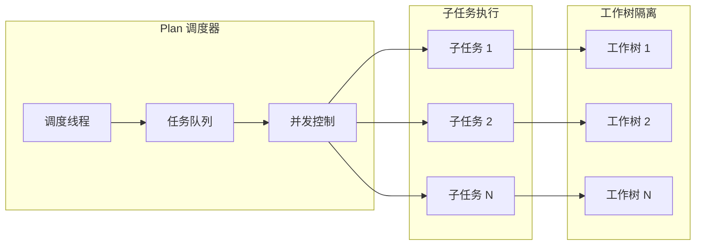

**图表来源**
- [tide_ws.py:371-385](file://tide_ws.py#L371-L385)
- [DEVELOPMENT.md:116-131](file://DEVELOPMENT.md#L116-L131)

**章节来源**
- [tide_ws.py:1045-1107](file://tide_ws.py#L1045-L1107)
- [tide_ws.py:1152-1173](file://tide_ws.py#L1152-L1173)

## 设计模式应用

### 适配器模式

项目实现了标准的适配器模式，为不同的 Agent CLI 提供统一接口：

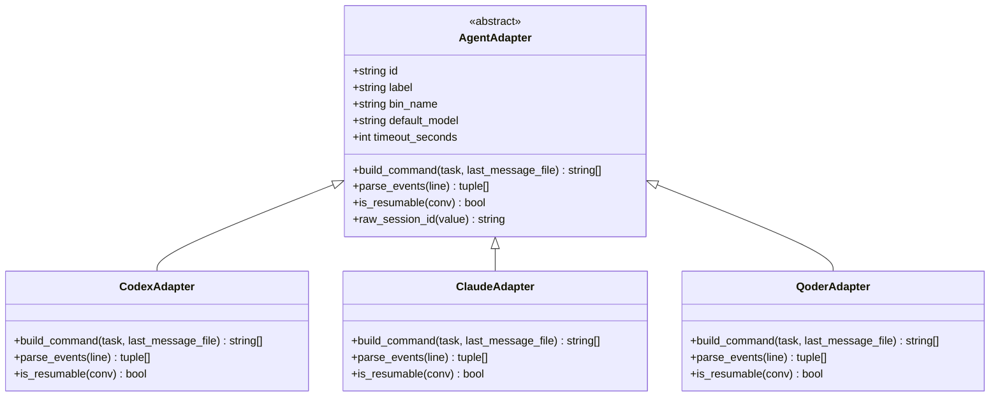

**图表来源**
- [tide_ws.py:626-801](file://tide_ws.py#L626-L801)

### 工厂模式

项目使用简单的工厂模式来创建和管理 Agent 适配器：

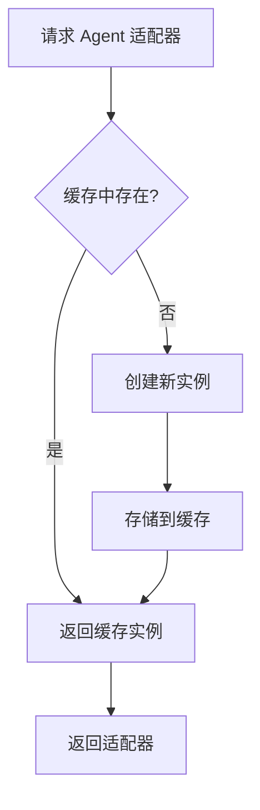

**图表来源**
- [tide_ws.py:849-853](file://tide_ws.py#L849-L853)

### 观察者模式

项目实现了事件驱动的观察者模式，用于处理 Lark 事件和任务状态变化：

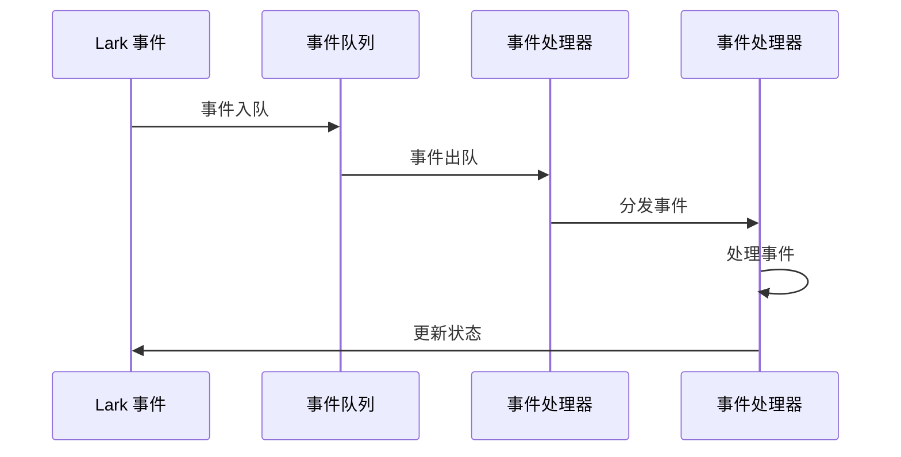

**图表来源**
- [tide_ws.py:401-401](file://tide_ws.py#L401-L401)

**章节来源**
- [tide_ws.py:849-853](file://tide_ws.py#L849-L853)

## 扩展点识别

### 插件系统设计

项目具有良好的插件扩展性，主要体现在以下几个方面：

1. **Agent 适配器扩展**：通过继承 `AgentAdapter` 基类可以添加新的 Agent CLI 支持
2. **事件处理器扩展**：可以通过注册新的事件处理器来支持新的 Lark 事件类型
3. **状态持久化扩展**：可以通过实现新的持久化策略来支持不同的存储后端
4. **附件处理器扩展**：可以通过实现新的附件处理器来支持新的文件类型

### 配置系统

项目提供了丰富的配置选项，支持高度定制化：

| 配置类别 | 关键配置项 | 用途 |
|----------|------------|------|
| Lark 配置 | LARK_APP_ID, LARK_ENCRYPT_KEY | Lark 应用认证 |
| Agent 配置 | CODEX_BIN, CLAUDE_BIN, QODER_BIN | Agent CLI 路径 |
| 运行配置 | MAX_RUNNING_TASKS, PLAN_MAX_PARALLEL | 并发控制 |
| 审批配置 | PENDING_APPROVAL_WAIT_SECONDS | 审批超时控制 |
| 日志配置 | LOG_LEVEL, LOG_MESSAGE_CONTENT | 日志级别和内容 |

**章节来源**
- [README.md:317-456](file://README.md#L317-L456)
- [DEVELOPMENT.md:393-566](file://DEVELOPMENT.md#L393-L566)

## 测试策略

### 单元测试

项目包含基础的单元测试框架，主要测试 Lark 引用上下文功能：

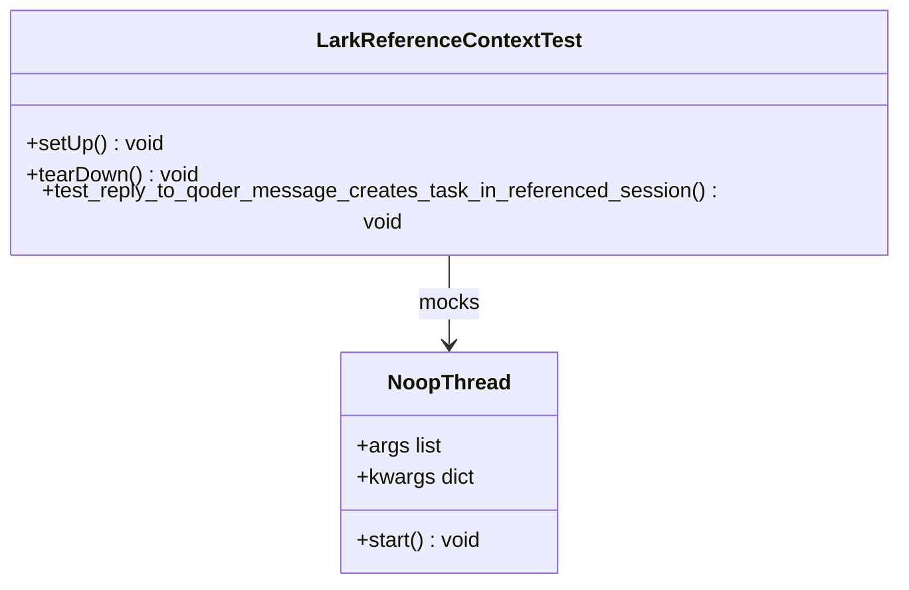

**图表来源**
- [tests/test_lark_reference_context.py:17-102](file://tests/test_lark_reference_context.py#L17-L102)

### 测试用例设计原则

1. **隔离性**：每个测试用例独立运行，不依赖其他测试的结果
2. **可重复性**：测试结果应该在相同条件下可重复
3. **完整性**：测试应该覆盖主要的功能路径和边界条件
4. **可维护性**：测试代码应该清晰易懂，便于维护

### 测试覆盖率要求

建议的测试覆盖率目标：
- 核心业务逻辑：≥80%
- 事件处理：≥70%
- 附件处理：≥60%
- 状态持久化：≥75%

**章节来源**
- [tests/test_lark_reference_context.py:1-102](file://tests/test_lark_reference_context.py#L1-L102)

## 调试与故障排除

### 日志配置

项目支持详细的日志记录，包括：

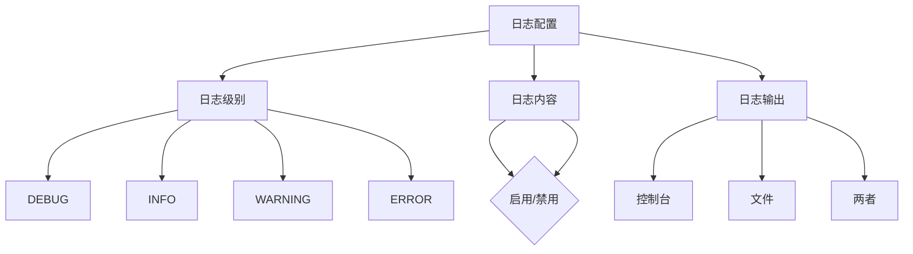

**图表来源**
- [tide_ws.py:166-170](file://tide_ws.py#L166-L170)

### 常见问题诊断

#### Lark 消息接收问题

**症状**：脚本启动正常但不接收 Lark 消息
**诊断步骤**：
1. 检查 Lark 应用配置是否正确
2. 验证事件订阅是否启用
3. 确认机器人是否加入目标群聊
4. 检查网络连接和防火墙设置

#### 审批流程问题

**症状**：审批批准后任务不继续执行
**诊断步骤**：
1. 检查批准后的配置是否正确设置
2. 验证 Agent CLI 的权限设置
3. 确认沙箱模式配置
4. 查看审批超时设置

#### Plan 并行执行问题

**症状**：Plan 子任务执行失败或相互干扰
**诊断步骤**：
1. 检查 Git 工作树配置
2. 验证并发控制设置
3. 确认工作目录权限
4. 检查子任务依赖关系

### 性能优化建议

1. **并发控制**：合理设置 `MAX_RUNNING_TASKS` 和 `PLAN_MAX_PARALLEL`
2. **内存管理**：定期清理临时文件和附件
3. **网络优化**：使用合适的超时设置和重试机制
4. **日志优化**：在生产环境中降低日志级别

### 内存泄漏检测

建议使用以下工具检测内存泄漏：
- `memory_profiler`：分析内存使用情况
- `tracemalloc`：跟踪内存分配
- `objgraph`：分析对象引用关系

**章节来源**
- [README.md:474-511](file://README.md#L474-L511)

## 代码贡献流程

### 开发规范

1. **代码风格**：遵循 PEP 8 规范
2. **注释规范**：为公共接口添加详细的 docstring
3. **错误处理**：使用适当的异常处理机制
4. **日志记录**：使用结构化日志格式

### 版本控制策略

项目采用 Git 进行版本控制，建议使用以下分支策略：
- `main`：稳定版本
- `develop`：开发版本
- `feature/*`：功能开发分支
- `hotfix/*`：紧急修复分支

### 发布流程

1. **代码审查**：所有代码变更必须经过审查
2. **测试验证**：确保所有测试通过
3. **文档更新**：更新相关文档
4. **版本标记**：使用语义化版本号
5. **发布部署**：部署到生产环境

## 开发环境搭建

### 系统要求

- Python 3.10+
- 至少一个 Agent CLI（Codex CLI、Claude Code CLI、Qoder CLI）
- 飞书/Lark 自建应用
- Python SDK：`lark-oapi`

### 开发工具推荐

1. **IDE**：PyCharm 或 VSCode
2. **调试工具**：pdb 或 IDE 内置调试器
3. **测试工具**：unittest 或 pytest
4. **代码质量**：flake8、black、isort
5. **文档生成**：Sphinx 或 mkdocs

### 环境配置

```bash
# 克隆项目
git clone https://github.com/your-repo/tide.git
cd tide

# 创建虚拟环境
python -m venv venv
source venv/bin/activate  # Linux/Mac
# 或 venv\Scripts\activate  # Windows

# 安装依赖
pip install lark-oapi

# 复制环境配置
cp .env.example .env

# 配置 Lark 应用信息
# 编辑 .env 文件
```

**章节来源**
- [README.md:49-151](file://README.md#L49-L151)

## 性能考虑

### 并发模型

项目采用多线程架构，合理平衡了并发性能和资源消耗：

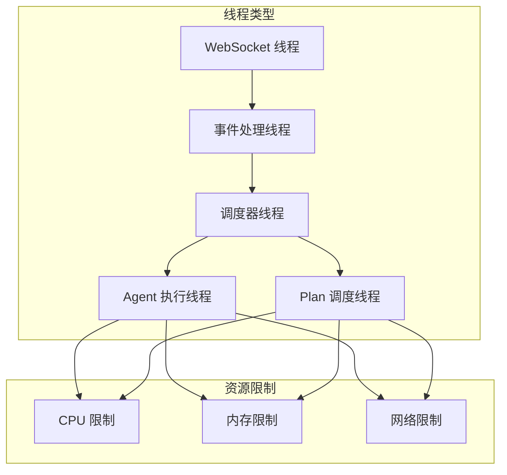

### 内存管理

1. **对象池**：复用常用的对象实例
2. **垃圾回收**：定期清理无用对象
3. **缓冲区管理**：合理控制缓冲区大小
4. **文件句柄**：及时关闭文件句柄

### 网络优化

1. **连接池**：复用 Lark API 连接
2. **批量操作**：合并多个小操作
3. **超时控制**：设置合理的超时时间
4. **重试机制**：实现指数退避重试

## 结论

Tide 项目展现了优秀的软件架构设计，通过适配器模式、工厂模式和观察者模式的有机结合，实现了高度可扩展的任务执行系统。项目的主要优势包括：

1. **模块化设计**：清晰的模块分离和职责划分
2. **可扩展性**：良好的插件系统和扩展点设计
3. **稳定性**：完善的错误处理和状态管理
4. **可观测性**：详细的日志记录和状态跟踪

未来的发展方向包括：
- 增强测试覆盖率和自动化测试
- 优化性能和资源使用效率
- 扩展更多的 Agent CLI 支持
- 改进用户界面和交互体验
- 增强安全性和权限控制

通过持续的迭代和改进，Tide 将成为连接 Lark 协作平台和本地 Agent 执行能力的重要桥梁。