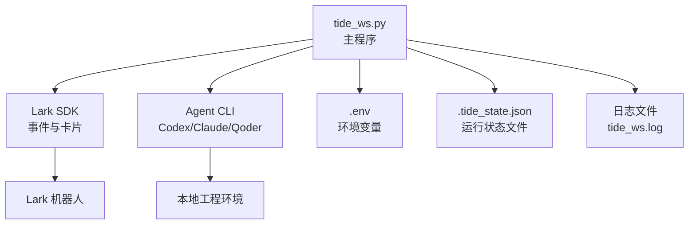
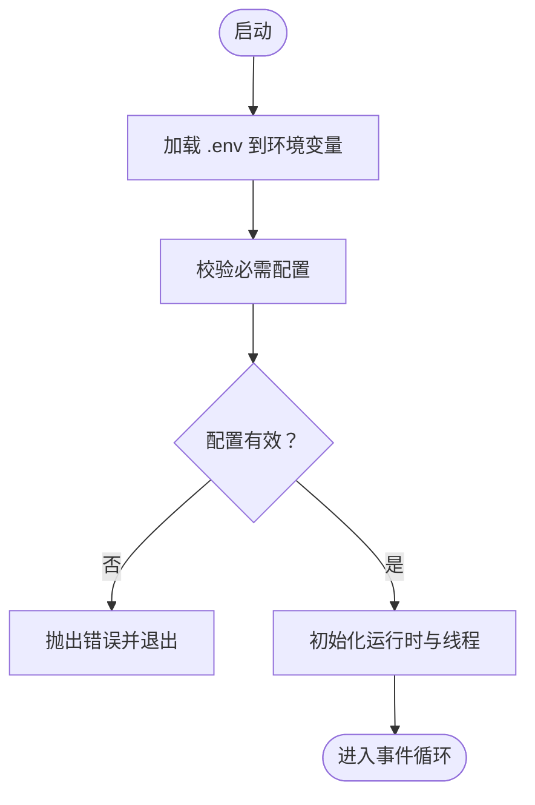
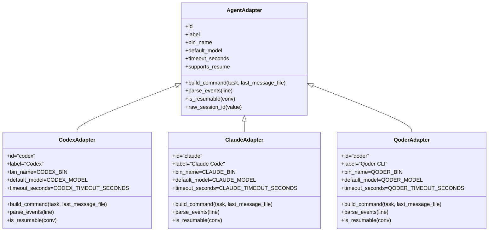
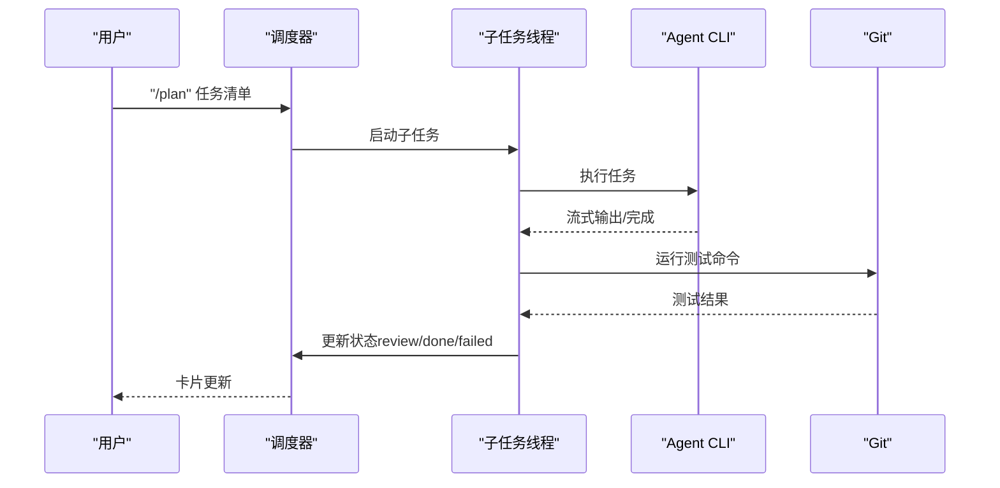
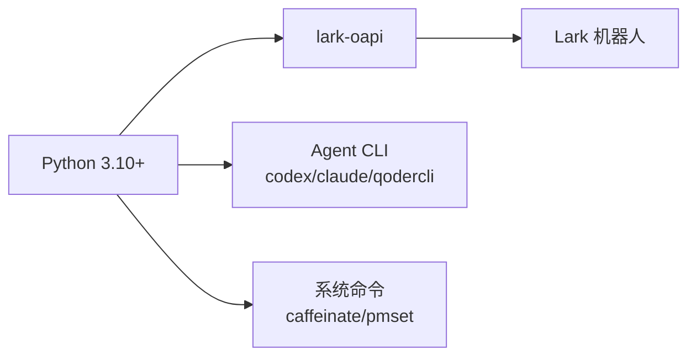

# 开发环境搭建

<cite>
**本文引用的文件**
- [README.md](file://README.md)
- [DEVELOPMENT.md](file://DEVELOPMENT.md)
- [ROADMAP.md](file://ROADMAP.md)
- [tide_ws.py](file://tide_ws.py)
- [.gitignore](file://.gitignore)
</cite>

## 目录
1. [简介](#简介)
2. [项目结构](#项目结构)
3. [核心组件](#核心组件)
4. [架构总览](#架构总览)
5. [详细组件分析](#详细组件分析)
6. [依赖分析](#依赖分析)
7. [性能考虑](#性能考虑)
8. [故障排查指南](#故障排查指南)
9. [结论](#结论)
10. [附录](#附录)

## 简介
本指南面向 Tide 项目的开发者，提供从环境准备、依赖安装、IDE 配置、开发工具链到版本控制与工作流的最佳实践。内容基于仓库中的 README、DEVELOPMENT 与 ROADMAP 文档，以及主程序 tide_ws.py 的实现细节，帮助你快速搭建可运行的开发环境并高效开展迭代。

## 项目结构
仓库采用“单脚本 + 环境变量 + 状态文件”的轻量结构，核心文件与职责如下：
- tide_ws.py：主程序，负责 Lark WebSocket 事件、消息卡片、Agent CLI 执行、审批、会话同步与 macOS 保活。
- README.md：功能说明、安装与运行、Lark 应用配置、环境变量、常见问题等。
- DEVELOPMENT.md：开发设计、运行模型、任务隔离、审批模型、Plan 并行、项目与对话、后台运行与重启、macOS 保活等。
- ROADMAP.md：Web 工作台实施路线图（与本指南的本地开发环境互补）。
- .gitignore：忽略 .env、状态文件与日志等本地产物。



**图示来源**
- [tide_ws.py:34-49](file://tide_ws.py#L34-L49)
- [README.md:49-150](file://README.md#L49-L150)

**章节来源**
- [README.md:17-117](file://README.md#L17-L117)
- [.gitignore:1-14](file://.gitignore#L1-L14)

## 核心组件
- 环境变量加载：启动时从 .env 注入环境变量，避免硬编码密钥与路径。
- Lark SDK 集成：通过 lark-oapi 处理消息、卡片按钮回调与资源下载。
- Agent 适配器：Codex、Claude Code、Qoder CLI 的命令构建与事件解析。
- 任务运行时：每条指令创建独立任务运行态，支持审批、重试、超时与输出流。
- Plan 并行：任务清单拆分为子任务，支持 Git worktree 隔离与测试命令。
- macOS 保活：电源接入时自动保持脚本与网络活跃，必要时禁用睡眠。

**章节来源**
- [tide_ws.py:34-49](file://tide_ws.py#L34-L49)
- [tide_ws.py:626-800](file://tide_ws.py#L626-L800)
- [tide_ws.py:342-386](file://tide_ws.py#L342-L386)
- [tide_ws.py:409-499](file://tide_ws.py#L409-L499)
- [DEVELOPMENT.md:21-31](file://DEVELOPMENT.md#L21-L31)

## 架构总览
Tide 的本地运行模型由多线程组成：WebSocket 事件线程、事件队列工作者、调度器、会话观察器、macOS 保活循环、Agent 任务线程与 Plan 调度线程。所有配置通过环境变量注入，运行状态写入本地文件。

```mermaid
graph TB
subgraph "本地进程"
WS["WebSocket 事件线程"] --> EQ["事件队列"]
EQ --> EW["事件工作者"]
EW --> SCH["调度器"]
SCH --> DESK["会话观察器"]
SCH --> KA["macOS 保活"]
EW --> TASK["Agent 任务线程"]
SCH --> PLAN["Plan 调度线程"]
PLAN --> PTASK["Plan 子任务线程"]
end
subgraph "外部系统"
LARK["Lark 机器人"]
CLI["Agent CLI<br/>Codex/Claude/Qoder"]
FS["本地文件系统"]
end
LARK <- --> WS
CLI <- --> TASK
CLI <- --> PTASK
FS <- --> TASK
FS <- --> PTASK
```

**图示来源**
- [DEVELOPMENT.md:21-31](file://DEVELOPMENT.md#L21-L31)
- [tide_ws.py:8559-8567](file://tide_ws.py#L8559-L8567)

## 详细组件分析

### 环境变量与配置加载
- .env 示例与关键变量：LARK_*、Agent CLI 路径与模型、工作目录、超时、审批策略、macOS 保活等。
- 启动时加载 .env，未设置的变量将使用默认值或触发运行前校验。



**图示来源**
- [tide_ws.py:34-49](file://tide_ws.py#L34-L49)
- [tide_ws.py:8531-8557](file://tide_ws.py#L8531-L8557)

**章节来源**
- [README.md:57-66](file://README.md#L57-L66)
- [README.md:317-427](file://README.md#L317-L427)
- [tide_ws.py:54-151](file://tide_ws.py#L54-L151)

### Agent 适配器与任务执行
- 适配器抽象：Codex、Claude Code、Qoder CLI 的命令构建与事件解析。
- 任务运行时：每条指令创建独立任务，绑定 chat_id、cwd、prompt、model、session_id 等。
- 超时与模式：根据任务类型与模式（如 Qoder Quest）设置超时；审批后按批准策略重试。



**图示来源**
- [tide_ws.py:626-800](file://tide_ws.py#L626-L800)

**章节来源**
- [tide_ws.py:626-800](file://tide_ws.py#L626-L800)

### Plan 并行与工作树隔离
- 并发上限：PLAN_MAX_PARALLEL 控制子任务并发数。
- 隔离策略：默认启用 Git worktree 隔离，每个子任务独立分支与工作目录。
- 收尾流程：子任务结束后运行测试命令，生成 diff 摘要，进入审批或完成。



**图示来源**
- [tide_ws.py:3101-3165](file://tide_ws.py#L3101-L3165)
- [tide_ws.py:342-386](file://tide_ws.py#L342-L386)

**章节来源**
- [DEVELOPMENT.md:116-200](file://DEVELOPMENT.md#L116-L200)
- [README.md:283-316](file://README.md#L283-L316)

### macOS 保活与电源管理
- 接入电源时自动保持活跃，必要时尝试禁用睡眠（需管理员权限）。
- 保活状态与睡眠策略通过配置项控制，日志中会提示权限相关失败。

**章节来源**
- [README.md:429-456](file://README.md#L429-L456)
- [tide_ws.py:140-144](file://tide_ws.py#L140-L144)

## 依赖分析
- Python 版本：Python 3.10+。
- 依赖包：lark-oapi（Lark SDK）。
- Agent CLI：Codex CLI、Claude Code CLI、Qoder CLI。
- 系统命令：macOS 保活依赖 caffeinate、pmset。
- 环境变量：LARK_*、Agent CLI 路径与模型、工作目录、超时、审批策略、macOS 保活等。



**图示来源**
- [README.md:19-32](file://README.md#L19-L32)

**章节来源**
- [README.md:19-32](file://README.md#L19-L32)

## 性能考虑
- 事件处理：使用事件队列与串行工作者，避免阻塞 SDK 回调。
- 并发控制：通过全局与单会话并发上限限制 Agent 子进程数量，避免资源争用。
- I/O 优化：附件下载与本地缓存，减少重复下载；日志级别与消息内容记录按需开启。
- macOS 保活：电源状态轮询间隔可调，避免频繁系统调用。

**章节来源**
- [DEVELOPMENT.md:21-31](file://DEVELOPMENT.md#L21-L31)
- [tide_ws.py:107-108](file://tide_ws.py#L107-L108)
- [tide_ws.py:142-143](file://tide_ws.py#L142-L143)

## 故障排查指南
- 收不到 Lark 消息：确认机器人已加入群聊、应用已发布并开通权限、凭据正确、日志无权限错误。
- 审批批准后未继续：确认脚本已重启并加载最新代码，批准后的配置符合预期。
- Git 提交失败：通常为 sandbox 权限不足，审批后按批准策略重试。
- 电脑睡眠：电源接入时默认 caffeinate；合盖运行需管理员权限禁用睡眠，注意散热风险。

**章节来源**
- [README.md:474-511](file://README.md#L474-L511)

## 结论
Tide 的开发环境以“单脚本 + 环境变量 + 本地状态文件”为核心，配合 Lark SDK 与 Agent CLI 实现远程控制、协作可见与可审批的工程任务执行。遵循本指南的环境准备、IDE 配置与开发流程，可快速搭建稳定可迭代的开发环境。

## 附录

### 开发环境要求
- Python：3.10+
- 依赖：lark-oapi
- Agent CLI：codex、claude、qodercli
- macOS 保活：caffeinate、pmset

**章节来源**
- [README.md:19-32](file://README.md#L19-L32)

### 依赖包安装与虚拟环境
- 建议使用 Python 3.10+ 的虚拟环境隔离依赖。
- 安装 lark-oapi：pip3 install lark-oapi
- 确认 Agent CLI 可用：codex --help、claude --help、qodercli --help

**章节来源**
- [README.md:49-73](file://README.md#L49-L73)

### IDE 配置建议
- VSCode
  - Python 解释器指向虚拟环境
  - 安装 Python 扩展，启用 Pylance 与 Flake8
  - 设置任务/调试：使用 launch.json 调用 python3 tide_ws.py
- PyCharm
  - 项目解释器选择虚拟环境
  - 启用 Python Console 与内置终端
  - 配置运行/调试配置，指向主程序入口

[本节为通用 IDE 配置建议，不直接分析具体文件，故无“章节来源”]

### 开发工具推荐
- 代码格式化：black（按项目风格配置）
- 静态分析：flake8、pylint 或 ruff
- 调试：VSCode/PyCharm 断点调试；必要时开启 LOG_MESSAGE_CONTENT 与更详细日志级别
- 版本控制：Git，遵循分支与提交规范

[本节为通用工具建议，不直接分析具体文件，故无“章节来源”]

### 版本控制策略
- 分支管理：主分支保护，功能开发在 feature/*，修复在 hotfix/*
- 提交规范：简明主题 + 说明，引用 Issue 编号
- 代码审查：Pull Request + 代码审查 + CI 检查
- 环境变量：.env 不提交，使用 .gitignore 管控

**章节来源**
- [.gitignore:1-14](file://.gitignore#L1-L14)

### 开发工作流与最佳实践
- 从 README 的安装与运行开始，先本地验证 Lark 应用配置与 Agent CLI 可用性
- 使用 .env.example 创建 .env，按需调整 Lark 凭据、Agent CLI 路径与模型
- 启动后通过 Lark 发送 /panel、/status、/daily 等指令验证功能
- 使用后台运行与 /restart 命令验证稳定性
- 遇到问题先查看日志，再对照常见问题定位

**章节来源**
- [README.md:49-150](file://README.md#L49-L150)
- [README.md:474-511](file://README.md#L474-L511)