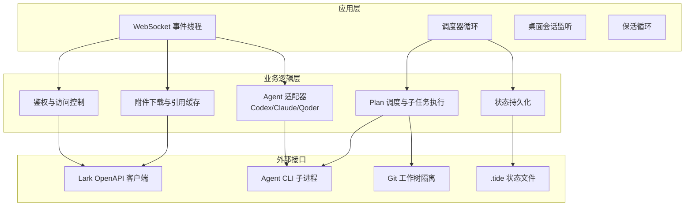
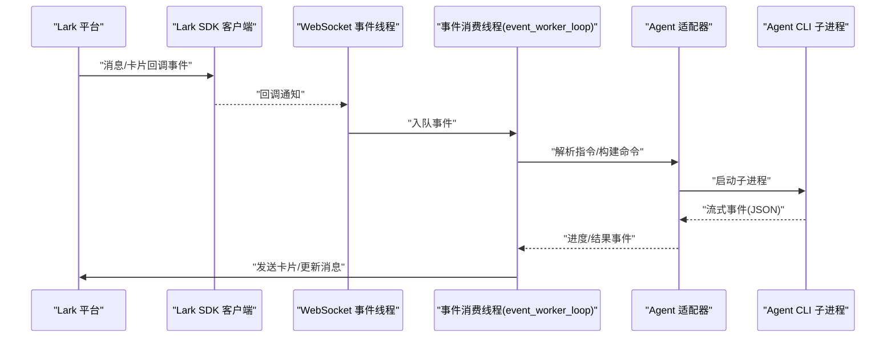
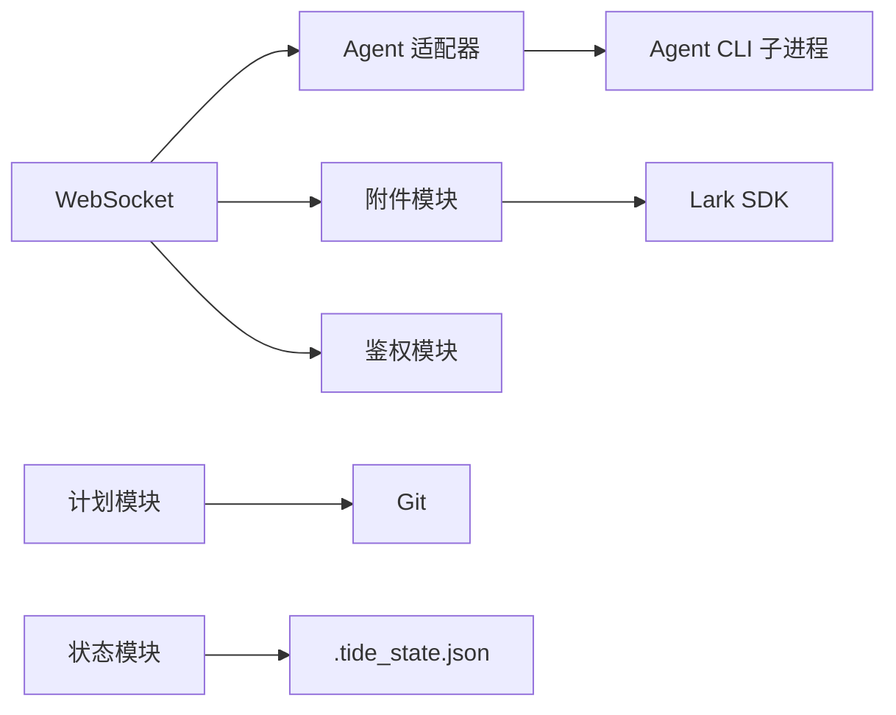

# 测试策略

<cite>
**本文引用的文件**
- [README.md](file://README.md)
- [DEVELOPMENT.md](file://DEVELOPMENT.md)
- [tide_ws.py](file://tide_ws.py)
- [tests/test_lark_reference_context.py](file://tests/test_lark_reference_context.py)
</cite>

## 目录
1. [简介](#简介)
2. [项目结构](#项目结构)
3. [核心组件](#核心组件)
4. [架构总览](#架构总览)
5. [详细组件分析](#详细组件分析)
6. [依赖分析](#依赖分析)
7. [性能考量](#性能考量)
8. [故障排查指南](#故障排查指南)
9. [结论](#结论)
10. [附录](#附录)

## 简介
本测试策略文档面向 Tide 的单元测试与集成测试，围绕以下目标展开：
- 明确单元测试编写方法：测试用例设计原则、Mock 对象使用、测试数据准备。
- 设计集成测试实施方案：WebSocket 事件模拟、Agent CLI 交互测试、Lark 平台 API 测试。
- 制定测试覆盖率与质量标准：关键路径测试、边界条件测试、异常情况处理测试。
- 规划测试环境搭建：测试数据库配置、模拟服务设置、测试数据管理。
- 提出测试自动化流程与持续集成配置建议。

## 项目结构
Tide 主程序为单文件脚本，核心逻辑集中在 tide_ws.py，包含：
- 配置与环境变量解析
- 数据模型与运行时状态
- Agent 适配器（Codex/Claude/Qoder）
- Lark SDK 客户端封装与消息处理
- 附件下载与引用缓存
- 计划任务（Plan）执行与 Git 隔离
- 审批与重启机制
- macOS 保活（caffeinate/pmset）

图表来源
- [tide_ws.py:856-866](file://tide_ws.py#L856-L866)
- [tide_ws.py:849-853](file://tide_ws.py#L849-L853)
- [tide_ws.py:1152-1157](file://tide_ws.py#L1152-L1157)

章节来源
- [README.md:512-517](file://README.md#L512-L517)
- [DEVELOPMENT.md:21-31](file://DEVELOPMENT.md#L21-L31)

## 核心组件
- 配置与环境变量：集中于 tide_ws.py 的全局配置解析与常量定义，涵盖 Lark、Agent CLI、附件、计划、审批、状态推送、macOS 保活等。
- 数据模型：ConversationInfo、ProjectInfo、ChatRuntime、CodexTaskRuntime、PlanRuntime、PlanTask、PendingApproval、LarkAttachment、LarkReferenceContext 等。
- Agent 适配器：统一构建命令、解析事件流、判断可续写性，支持 Codex、Claude Code、Qoder CLI。
- 附件与引用：收集附件规格、下载资源、去重与清理、引用缓存与查找。
- 计划任务：并行调度、Git worktree 隔离、测试命令执行、Diff 摘要与提交审批。
- 审批与重启：审批对象持久化、指纹比对、批准后重试策略、重启流程。
- 状态持久化：.tide_state.json 的读写、裁剪与权限设置。
- 鉴权与访问控制：聊天与用户白名单、管理员权限、已知聊天判定。

章节来源
- [tide_ws.py:54-151](file://tide_ws.py#L54-L151)
- [tide_ws.py:173-386](file://tide_ws.py#L173-L386)
- [tide_ws.py:626-801](file://tide_ws.py#L626-L801)
- [tide_ws.py:1449-1539](file://tide_ws.py#L1449-L1539)
- [tide_ws.py:3101-3165](file://tide_ws.py#L3101-L3165)
- [tide_ws.py:869-891](file://tide_ws.py#L869-L891)
- [tide_ws.py:1211-1271](file://tide_ws.py#L1211-L1271)

## 架构总览
Tide 采用单进程 WebSocket 客户端模型，主线程包含事件处理、调度、会话监听与保活循环。业务逻辑通过适配器抽象 Agent CLI，计划任务通过 Git worktree 实现隔离，状态通过本地文件持久化。

图表来源
- [tide_ws.py:856-866](file://tide_ws.py#L856-L866)
- [tide_ws.py:626-801](file://tide_ws.py#L626-L801)

## 详细组件分析

### 单元测试编写方法
- 测试用例设计原则
  - 关注数据模型与纯函数：如配置解析、CSV/集合解析、附件规格收集、引用缓存裁剪等。
  - 边界与异常：超时、大小限制、空值、非法输入、重复键、权限不足等。
  - 状态一致性：状态文件读写、裁剪、权限变更。
  - 并发与锁：会话级锁、全局锁、计划锁的正确性。
- Mock 对象使用
  - 使用 unittest.mock 替换外部依赖：subprocess.Popen、lark.Client、文件系统 Path、time.time 等。
  - 对 Agent 适配器的命令构建与事件解析进行行为验证。
- 测试数据准备
  - 构造最小化配置环境变量，避免真实 Lark 凭据与 Agent CLI。
  - 使用临时目录承载 .tide 状态文件与附件目录，确保可重复与隔离。
  - 准备典型附件规格、引用缓存数据、计划任务状态快照。

章节来源
- [tide_ws.py:154-159](file://tide_ws.py#L154-L159)
- [tide_ws.py:1449-1539](file://tide_ws.py#L1449-L1539)
- [tide_ws.py:869-891](file://tide_ws.py#L869-L891)

### 集成测试实施方案
- WebSocket 事件模拟
  - 使用 Lark SDK 的回调桩，模拟消息创建、消息已读、卡片按钮回调事件。
  - 验证事件入队、串行消费、状态更新与卡片发送。
- Agent CLI 交互测试
  - Mock subprocess.Popen，注入流式 JSON 输出，验证事件解析与任务状态推进。
  - 验证审批触发、批准后重试、超时处理。
- Lark 平台 API 测试
  - Mock im.v1.message_resource.get 与消息发送接口，验证附件下载、消息分片、卡片更新。
  - 验证鉴权与访问控制逻辑（聊天/用户白名单、管理员权限）。

章节来源
- [tide_ws.py:1449-1539](file://tide_ws.py#L1449-L1539)
- [tide_ws.py:1283-1291](file://tide_ws.py#L1283-L1291)
- [tide_ws.py:1211-1271](file://tide_ws.py#L1211-L1271)

### 测试覆盖率与质量标准
- 关键路径测试
  - 附件下载与引用恢复：规格收集、去重、下载、保存、引用缓存。
  - 计划任务执行：测试命令、Diff 摘要、提交审批、合并总览。
  - 审批与重试：指纹比对、批准后策略、超时处理。
- 边界条件测试
  - 附件大小限制、数量上限、消息引用上限、会话锁竞争。
  - 超时阈值、并发上限、状态持久化容量。
- 异常情况处理测试
  - 下载失败、保存异常、资源流关闭、权限错误、审批超时、Agent CLI 异常退出。
- 质量标准
  - 单元测试：函数级与模块级逻辑 100% 覆盖，重点路径分支覆盖。
  - 集成测试：端到端场景（消息-执行-卡片-状态）通过率 ≥ 95%。
  - 回归测试：关键缺陷回归用例纳入每日 CI。

章节来源
- [tide_ws.py:1109-1150](file://tide_ws.py#L1109-L1150)
- [tide_ws.py:3101-3165](file://tide_ws.py#L3101-L3165)
- [tide_ws.py:1283-1291](file://tide_ws.py#L1283-L1291)

### 测试环境搭建
- 测试数据库配置
  - 本项目无内置数据库，状态通过 .tide_state.json 文件持久化。测试中使用临时目录隔离状态文件。
- 模拟服务设置
  - 使用 unittest.mock 替换：
    - lark.Client 与 im.v1.message_resource.get
    - subprocess.Popen（Agent CLI）
    - time.time（时间相关逻辑）
    - Path 与文件系统操作（附件目录）
- 测试数据管理
  - 附件目录：.tide/attachments，相对工作目录，避免写入生产环境。
  - 状态文件：.tide_state.json，测试前后清理，避免污染。
  - 引用缓存：构造 message_refs，验证裁剪与查找逻辑。

章节来源
- [tide_ws.py:869-891](file://tide_ws.py#L869-L891)
- [tide_ws.py:1449-1539](file://tide_ws.py#L1449-L1539)
- [tide_ws.py:956-981](file://tide_ws.py#L956-L981)

### 测试自动化流程与持续集成配置建议
- 自动化流程
  - 单元测试：pytest + unittest.mock，覆盖数据模型、解析与状态逻辑。
  - 集成测试：pytest + Docker/LXC（可选）隔离 Agent CLI，或本地 Mock。
  - 端到端测试：使用 Lark 开发者平台的测试应用与事件模拟器。
- 持续集成
  - 触发：push 与 pull_request。
  - 步骤：安装依赖、加载 .env.example、运行 pytest（含覆盖率）、上传覆盖率报告。
  - 产物：测试报告、覆盖率报告、失败日志归档。

章节来源
- [README.md:49-74](file://README.md#L49-L74)
- [DEVELOPMENT.md:550-566](file://DEVELOPMENT.md#L550-L566)

## 依赖分析
- 组件耦合与内聚
  - Agent 适配器与 CLI 子进程高内聚，通过统一接口解耦。
  - 事件处理与状态持久化通过队列与锁解耦，降低耦合。
- 外部依赖
  - Lark SDK：消息、资源下载、卡片回调。
  - Agent CLI：Codex/Claude/Qoder，通过子进程交互。
  - Git：工作树隔离与 diff 摘要。
- 循环依赖
  - 未发现直接循环依赖；状态持久化与事件处理通过中间状态对象解耦。

图表来源
- [tide_ws.py:849-853](file://tide_ws.py#L849-L853)
- [tide_ws.py:1449-1539](file://tide_ws.py#L1449-L1539)
- [tide_ws.py:1152-1157](file://tide_ws.py#L1152-L1157)

章节来源
- [tide_ws.py:856-866](file://tide_ws.py#L856-L866)
- [tide_ws.py:1211-1271](file://tide_ws.py#L1211-L1271)

## 性能考量
- 事件队列与并发
  - LARK_EVENT_QUEUE_MAXSIZE 控制积压上限，避免内存膨胀。
  - MAX_RUNNING_TASKS 与 MAX_RUNNING_TASKS_PER_CHAT 控制并发，防止资源争用。
- I/O 与磁盘
  - 附件下载分块与大小限制，避免大文件阻塞。
  - 状态文件写入采用临时文件+原子替换，减少损坏风险。
- 时间与定时
  - TASK_CARD_REFRESH_INTERVAL_SECONDS 与 STATUS_INTERVAL_SECONDS 控制刷新频率，平衡实时性与负载。

章节来源
- [tide_ws.py:109-127](file://tide_ws.py#L109-L127)
- [tide_ws.py:1449-1539](file://tide_ws.py#L1449-L1539)
- [tide_ws.py:869-891](file://tide_ws.py#L869-L891)

## 故障排查指南
- 收不到 Lark 消息
  - 检查机器人权限、事件订阅、凭据配置与日志中的 send_card/send_msg 失败信息。
- 审批批准后未继续执行
  - 确认批准后的配置（APPROVED_*）与脚本已重启加载。
- Git 提交失败
  - 检查 sandbox 权限与 index.lock，批准后以批准配置重试。
- 电脑睡眠
  - 使用 KEEP_AWAKE_ON_AC_POWER 与可选 KEEP_AWAKE_DISABLE_SLEEP，必要时 sudo pmset。

章节来源
- [README.md:474-511](file://README.md#L474-L511)

## 结论
本测试策略围绕 Tide 的核心模块，提出从单元到集成的完整测试方案。通过 Mock 与事件模拟，结合覆盖率与质量标准，可在不依赖真实 Lark 环境与 Agent CLI 的前提下，高效验证关键路径、边界条件与异常处理。配合 CI 流程，可保障代码演进过程中的稳定性与可维护性。

## 附录
- 示例测试文件（参考）
  - tests/test_lark_reference_context.py：演示如何针对引用上下文与任务创建进行测试，可作为单元测试模板。

章节来源
- [tests/test_lark_reference_context.py](file://tests/test_lark_reference_context.py)