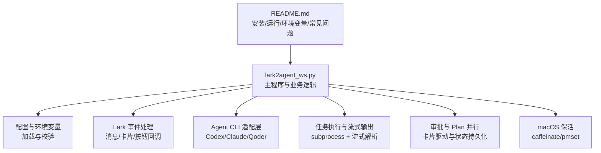
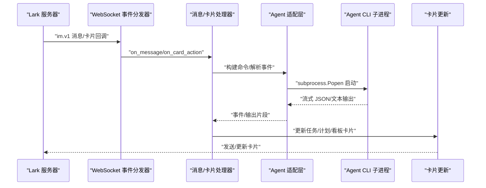
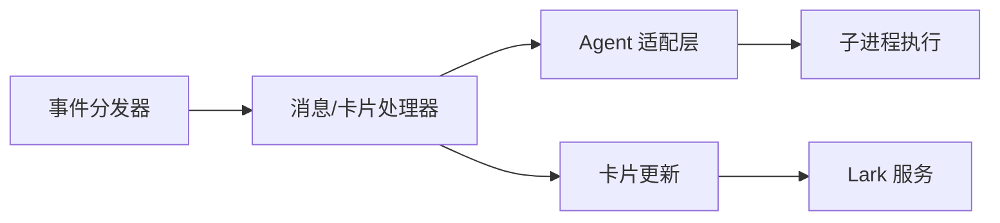

# 调试和故障排除

<cite>
**本文引用的文件**
- [lark2agent_ws.py](file://lark2agent_ws.py)
- [README.md](file://README.md)
</cite>

## 目录
1. [简介](#简介)
2. [项目结构](#项目结构)
3. [核心组件](#核心组件)
4. [架构概览](#架构概览)
5. [详细组件分析](#详细组件分析)
6. [依赖分析](#依赖分析)
7. [性能考虑](#性能考虑)
8. [故障排除指南](#故障排除指南)
9. [结论](#结论)
10. [附录](#附录)

## 简介
本指南面向 Lark2Agent 的运维与开发人员，聚焦于调试与故障排除实践，涵盖日志配置与分析、常见问题诊断流程（WebSocket 连接、Agent CLI 执行失败、任务超时、内存泄漏）、性能优化建议（线程池与队列、资源清理）、错误代码对照与解决方案、生产环境监控与告警配置等内容。文档基于仓库源码与使用说明进行系统化整理，既适用于新手快速上手，也能满足资深用户的深度排查需求。

## 项目结构
- 主程序入口与核心逻辑集中在单文件脚本中，采用模块化设计，包含配置加载、消息与卡片处理、任务执行、审批与 Plan 并行执行、桌面会话同步、macOS 保活等功能。
- README 提供安装、运行、Lark 使用方式、环境变量说明与常见问题解答，是部署与排障的重要参考。

图示来源
- [lark2agent_ws.py:1-200](file://lark2agent_ws.py#L1-L200)
- [README.md:1-200](file://README.md#L1-L200)

章节来源
- [lark2agent_ws.py:1-200](file://lark2agent_ws.py#L1-L200)
- [README.md:1-200](file://README.md#L1-L200)

## 核心组件
- 配置与环境变量：集中于文件顶部，包含 Lark 凭据、Agent CLI 路径与超时、附件与队列容量、审批等待时间、macOS 保活开关等。
- 日志系统：基于 Python logging，统一格式包含时间戳、日志级别、线程名与消息体。
- 数据模型：ConversationInfo、ProjectInfo、ChatRuntime、CodexTaskRuntime、PlanRuntime 等，承载会话、任务、计划等运行态。
- 事件处理：Lark 事件分发器注册消息接收、已读、卡片按钮回调，统一入口 on_message/on_message_read/on_card_action。
- 任务执行：AgentAdapter 抽象不同 Agent CLI 的命令构建与事件解析，支持流式输出与审批触发。
- 审批与 Plan：PendingApproval、PlanRuntime/PlanTask，配合卡片驱动的审批与并行执行。
- macOS 保活：keep_awake_loop 结合 caffeinate 与 pmset 实现接入电源时的网络与脚本活跃。

章节来源
- [lark2agent_ws.py:54-170](file://lark2agent_ws.py#L54-L170)
- [lark2agent_ws.py:173-400](file://lark2agent_ws.py#L173-L400)
- [lark2agent_ws.py:1642-1652](file://lark2agent_ws.py#L1642-L1652)
- [lark2agent_ws.py:626-853](file://lark2agent_ws.py#L626-L853)
- [lark2agent_ws.py:1751-1770](file://lark2agent_ws.py#L1751-L1770)

## 架构概览
Lark2Agent 通过 Lark 事件订阅建立 WebSocket 长连接，接收消息与卡片按钮事件，解析为内部任务模型，调用 Agent CLI 执行，实时解析流式输出并更新卡片。审批与 Plan 并行执行通过卡片驱动状态机推进。

图示来源
- [lark2agent_ws.py:1642-1652](file://lark2agent_ws.py#L1642-L1652)
- [lark2agent_ws.py:626-853](file://lark2agent_ws.py#L626-L853)
- [lark2agent_ws.py:3482-3703](file://lark2agent_ws.py#L3482-L3703)

## 详细组件分析

### 日志系统与配置
- 日志初始化：通过 basicConfig 设置日志级别与格式，格式包含时间、级别、线程名与消息体。
- 关键日志点：
  - 任务卡片发送/更新失败：send_card/send_msg 返回码与消息记录。
  - 附件下载异常：文件大小超限、下载失败、保存异常、流关闭。
  - 任务执行异常：找不到 CLI、启动失败、执行异常、超时。
  - 审批与 Plan：审批指纹、等待超时、状态变更。
  - macOS 保活：caffeinate 启停、pmset 设置。
- 日志级别与格式：
  - 级别：通过环境变量 LOG_LEVEL 控制，默认 INFO。
  - 格式：asctime、levelname、threadName、message。
- 消息内容保护：LOG_MESSAGE_CONTENT 控制是否在日志中记录消息与 prompt 片段。

章节来源
- [lark2agent_ws.py:166-170](file://lark2agent_ws.py#L166-L170)
- [lark2agent_ws.py:3482-3703](file://lark2agent_ws.py#L3482-L3703)
- [lark2agent_ws.py:1449-1540](file://lark2agent_ws.py#L1449-L1540)
- [lark2agent_ws.py:5514-5599](file://lark2agent_ws.py#L5514-L5599)
- [lark2agent_ws.py:1751-1770](file://lark2agent_ws.py#L1751-L1770)
- [README.md:427-427](file://README.md#L427-L427)

### 附件与消息处理
- 附件下载：根据消息中的 file_key 下载至本地目录，支持大小限制与去重，记录引用关系以便后续指令复用。
- 消息解析：支持富文本/Markdown 结构，提取纯文本内容，去除提及与多余空白。
- 引用上下文：通过 message_id/threads 关系找回历史消息与附件，拼接为上下文 prompt。

章节来源
- [lark2agent_ws.py:1449-1540](file://lark2agent_ws.py#L1449-L1540)
- [lark2agent_ws.py:1772-1813](file://lark2agent_ws.py#L1772-L1813)
- [lark2agent_ws.py:1922-1981](file://lark2agent_ws.py#L1922-L1981)

### 任务执行与流式输出
- 命令构建：根据 Agent 类型与模式（如 Qoder Quest）组装 CLI 参数，支持模型、权限模式、沙箱策略、工作目录等。
- 流式解析：解析 Agent CLI 的 JSON/文本输出，识别会话 ID、进度、消息、工具调用与结果，动态更新任务卡片。
- 超时控制：不同 Agent 与模式具有独立超时阈值，支持暂停/继续/终止（Qoder Quest）。
- 审批触发：当输出包含需要人工批准的信号时，创建 PendingApproval 并阻塞执行，等待 Lark 审批后重试。

章节来源
- [lark2agent_ws.py:626-853](file://lark2agent_ws.py#L626-L853)
- [lark2agent_ws.py:5207-5255](file://lark2agent_ws.py#L5207-L5255)
- [lark2agent_ws.py:514-518](file://lark2agent_ws.py#L514-L518)
- [lark2agent_ws.py:5353-5425](file://lark2agent_ws.py#L5353-L5425)

### 审批与 Plan 并行
- 审批状态机：检测到需要审批的输出后，创建 PendingApproval，更新任务卡片并等待 Lark 审批；超时后按默认策略继续。
- Plan 并行：将任务清单拆分为 PlanTask，支持阶段、依赖、并发度、worktree 隔离、测试命令、diff 摘要、提交与合并、清理等全生命周期管理。

章节来源
- [lark2agent_ws.py:3346-3365](file://lark2agent_ws.py#L3346-L3365)
- [lark2agent_ws.py:3277-3291](file://lark2agent_ws.py#L3277-L3291)
- [lark2agent_ws.py:4252-4323](file://lark2agent_ws.py#L4252-L4323)
- [lark2agent_ws.py:4340-4403](file://lark2agent_ws.py#L4340-L4403)

### macOS 保活
- keep_awake_loop：接入电源时启动 caffeinate，必要时设置 pmset disablesleep，断电或退出时清理。
- 管理命令：pmset -a disablesleep 1/0，需管理员权限；caffeinate -dimsu -w 绑定当前进程。

章节来源
- [lark2agent_ws.py:1751-1770](file://lark2agent_ws.py#L1751-L1770)
- [lark2agent_ws.py:1677-1744](file://lark2agent_ws.py#L1677-L1744)
- [README.md:439-456](file://README.md#L439-L456)

## 依赖分析
- 外部依赖：lark-oapi SDK、Python 标准库（subprocess、queue、threading、logging、json、tempfile 等）。
- 内部模块耦合：
  - 事件分发器与处理器：EventDispatcherHandler 注册多类回调，统一入口 on_message/on_card_action。
  - 适配层与执行：AgentAdapter 抽象不同 Agent CLI 的命令与事件解析。
  - 卡片与状态：send_card/update_card/refresh_task_latest_reply 等围绕卡片状态机。
- 潜在循环依赖：当前文件内未见循环导入；注意在扩展功能时避免在适配层引入对主流程的反向依赖。

图示来源
- [lark2agent_ws.py:1642-1652](file://lark2agent_ws.py#L1642-L1652)
- [lark2agent_ws.py:626-853](file://lark2agent_ws.py#L626-L853)
- [lark2agent_ws.py:3482-3703](file://lark2agent_ws.py#L3482-L3703)

章节来源
- [lark2agent_ws.py:1642-1652](file://lark2agent_ws.py#L1642-L1652)
- [lark2agent_ws.py:626-853](file://lark2agent_ws.py#L626-L853)
- [lark2agent_ws.py:3482-3703](file://lark2agent_ws.py#L3482-L3703)

## 性能考虑
- 线程与锁：多处使用 RLock/锁保护共享状态（RUNTIMES/TASKS/PLANS/PENDING_APPROVALS），避免竞态；注意在持有锁时避免长时间 IO 或阻塞操作。
- 队列与背压：EVENT_QUEUE 限制事件积压，避免内存膨胀；附件下载与卡片更新均受锁保护，建议合理设置 LARK_EVENT_QUEUE_MAXSIZE。
- I/O 与缓冲：子进程 stdout 逐行读取并流式解析，减少一次性大块内存占用；定期 flush 与批量更新卡片，降低频繁网络调用。
- 资源清理：
  - 临时文件：last_message_file 与临时文件在任务结束后清理。
  - 附件目录：下载目录按 chat/message 维度组织，定期裁剪引用缓存。
  - 计划 worktree：任务完成后提供清理确认，避免磁盘膨胀。
- 并发控制：MAX_RUNNING_TASKS/MAX_RUNNING_TASKS_PER_CHAT 限制全局与单会话并发；PLAN_MAX_PARALLEL 控制 Plan 并发度。

章节来源
- [lark2agent_ws.py:393-401](file://lark2agent_ws.py#L393-L401)
- [lark2agent_ws.py:5514-5599](file://lark2agent_ws.py#L5514-L5599)
- [lark2agent_ws.py:4682-4702](file://lark2agent_ws.py#L4682-L4702)
- [README.md:389-391](file://README.md#L389-L391)

## 故障排除指南

### 日志配置与分析
- 启用详细日志：设置 LOG_LEVEL=DEBUG（谨慎在生产使用），必要时开启 LOG_MESSAGE_CONTENT 记录消息片段（默认关闭）。
- 关键日志定位：
  - 任务卡片发送失败：send_card/send_msg 返回码与消息记录，若出现 invalid receive_id，将禁用该会话发送。
  - 附件下载失败：大小超限、响应无文件流、保存异常、下载异常。
  - Agent CLI 执行失败：找不到命令、启动异常、执行异常、超时。
  - 审批等待超时：PENDING_APPROVAL_WAIT_SECONDS 到期后自动过期。
- 日志查看：README 提供 tail/tail -f 查看日志的方法，建议结合时间戳与线程名定位问题。

章节来源
- [lark2agent_ws.py:166-170](file://lark2agent_ws.py#L166-L170)
- [lark2agent_ws.py:3482-3703](file://lark2agent_ws.py#L3482-L3703)
- [lark2agent_ws.py:1449-1540](file://lark2agent_ws.py#L1449-L1540)
- [lark2agent_ws.py:3346-3365](file://lark2agent_ws.py#L3346-L3365)
- [README.md:118-130](file://README.md#L118-L130)

### WebSocket 连接问题
- 症状：收不到 Lark 消息、卡片按钮回调未触发。
- 排查要点：
  - 确认 Lark 应用已发布并开通 IM 权限，事件订阅使用 WebSocket。
  - 检查 LARK_APP_ID/LARK_APP_SECRET/LARK_ENCRYPT_KEY/LARK_VERIFICATION_TOKEN 是否正确。
  - 查看日志中 send_card/send_msg 的失败码与消息，若 invalid receive_id，系统会禁用该会话发送。
  - 若按钮 200340 未投递，README 提示可改用 /project 1 或 /latest 1 操作。
- 重启：Lark 中发送 /restart 可原地重启脚本，或使用 nohup + pkill 方式重启。

章节来源
- [README.md:33-48](file://README.md#L33-L48)
- [lark2agent_ws.py:3663-3703](file://lark2agent_ws.py#L3663-L3703)
- [lark2agent_ws.py:3630-3654](file://lark2agent_ws.py#L3630-L3654)
- [README.md:152-152](file://README.md#L152-L152)

### Agent CLI 执行失败
- 症状：任务卡显示失败、无输出或超时。
- 排查要点：
  - 检查 CODEX_BIN/CLAUDE_BIN/QODER_BIN 是否可执行，工作目录是否在允许范围内（CODEX_ALLOWED_ROOTS）。
  - 审批触发：若输出包含需要人工批准的信号，系统会创建 PendingApproval 并阻塞；等待 Lark 审批后重试。
  - 超时：不同 Agent 与模式具有独立超时阈值，Qoder Quest 默认 12 小时。
  - 权限问题：Codex 输出 .git/index.lock 等权限相关错误时，审批后会用批准后的 sandbox 配置单次重试。
- 临时绕过：可在任务卡中使用“停止/取消/取消排队”等按钮进行干预。

章节来源
- [lark2agent_ws.py:514-518](file://lark2agent_ws.py#L514-L518)
- [lark2agent_ws.py:5353-5425](file://lark2agent_ws.py#L5353-L5425)
- [lark2agent_ws.py:5514-5599](file://lark2agent_ws.py#L5514-L5599)
- [README.md:474-511](file://README.md#L474-L511)

### 任务超时处理
- 超时判定：根据 Agent 类型与模式选择 timeout_seconds；Qoder Quest 使用 QODER_QUEST_TIMEOUT_SECONDS。
- 处理策略：
  - 子进程超时：子进程被终止，任务状态标记为 cancelled/failed。
  - Plan 子任务：stop_requested 时主动终止，标记为 cancelled。
  - 任务卡：超时后更新卡片状态，必要时保留最后输出片段。
- 建议：适当提高超时阈值或优化任务本身，避免频繁超时。

章节来源
- [lark2agent_ws.py:514-518](file://lark2agent_ws.py#L514-L518)
- [lark2agent_ws.py:5514-5599](file://lark2agent_ws.py#L5514-L5599)
- [lark2agent_ws.py:4691-4702](file://lark2agent_ws.py#L4691-L4702)

### 内存泄漏检测
- 症状：长时间运行后内存持续增长。
- 排查要点：
  - 检查是否存在大量未释放的子进程句柄或未关闭的文件描述符。
  - 关注附件下载临时文件是否清理、last_message_file 是否及时删除。
  - 事件队列是否溢出（EVENT_QUEUE_MAXSIZE），导致对象堆积。
  - 卡片更新过于频繁，建议合并更新或增加最小刷新间隔。
- 建议：定期巡检日志中的异常与警告，结合系统监控（RSS/FD 数）观察趋势。

章节来源
- [lark2agent_ws.py:5514-5599](file://lark2agent_ws.py#L5514-L5599)
- [lark2agent_ws.py:4094-4144](file://lark2agent_ws.py#L4094-L4144)
- [lark2agent_ws.py:393-401](file://lark2agent_ws.py#L393-L401)

### 错误代码对照与解决方案
- 230001/invalid receive_id：会话无效或权限不足，系统会禁用该会话发送，需检查机器人权限与加入群组。
- 200340：卡片按钮回调未投递到长连接，README 建议改用 /project 1 或 /latest 1 操作。
- 典型审批信号：confirmation_required/requires approval/permission denied 等，系统自动创建 PendingApproval 并等待处理。
- Git 相关：.git/index.lock 等权限错误，审批后用批准后的 sandbox 配置重试。

章节来源
- [lark2agent_ws.py:3514-3524](file://lark2agent_ws.py#L3514-L3524)
- [lark2agent_ws.py:3691-3703](file://lark2agent_ws.py#L3691-L3703)
- [lark2agent_ws.py:5353-5425](file://lark2agent_ws.py#L5353-L5425)
- [README.md:474-511](file://README.md#L474-L511)

### 生产环境监控与告警
- 建议指标：
  - 运行态：进程存活、WebSocket 连接状态、事件队列长度、任务并发数、Plan 并发度。
  - 执行态：任务成功率、平均耗时、超时率、审批等待时长、卡片更新失败次数。
  - 资源态：CPU/内存/IO、磁盘空间（尤其是附件与 worktree）、文件描述符数。
- 告警规则示例：
  - 连接断开/事件队列积压超阈值。
  - 任务失败率/超时率连续上升。
  - 审批等待超过阈值未处理。
  - 磁盘空间低于阈值或 worktree 占用异常增长。
- 工具与采集：结合系统监控（如进程状态、netstat、iostat）、日志聚合（ELK/OTEL）、卡片埋点与业务指标上报。

[本节为通用指导，无需特定文件引用]

## 结论
Lark2Agent 通过清晰的模块划分与卡片驱动的状态机，实现了从 Lark 到 Agent CLI 的高效闭环。调试与排障的关键在于：规范的日志配置与分析、对 WebSocket 与 Agent CLI 执行链路的分层排查、对审批与 Plan 生命周期的精细化管理，以及针对资源与并发的持续优化。遵循本指南的流程与建议，可显著提升问题定位效率与系统稳定性。

## 附录

### 常用命令与工具
- 启动/停止/重启：README 提供 nohup 启动、查询进程、停止与重启方法。
- 日志查看：tail/tail -f 查看日志，结合时间戳与线程名定位问题。
- macOS 保活：caffeinate/pmset 管理，必要时 sudo 提权。

章节来源
- [README.md:75-152](file://README.md#L75-L152)