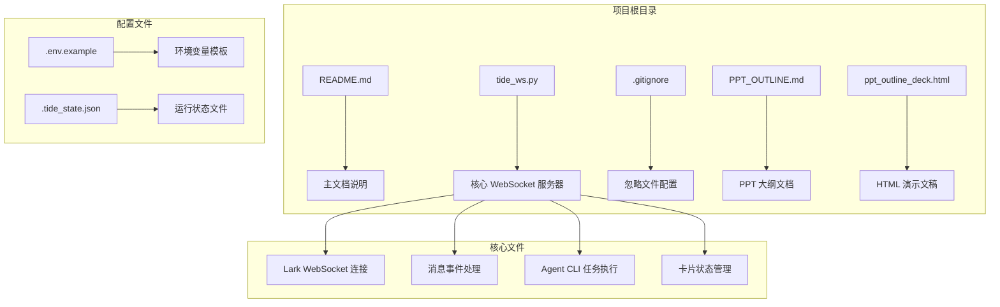
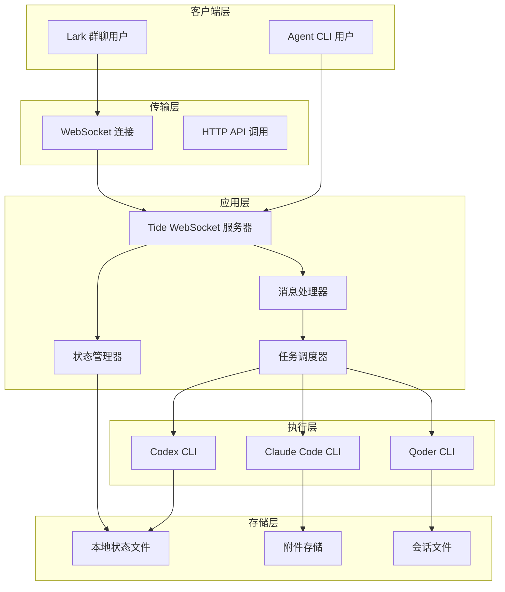
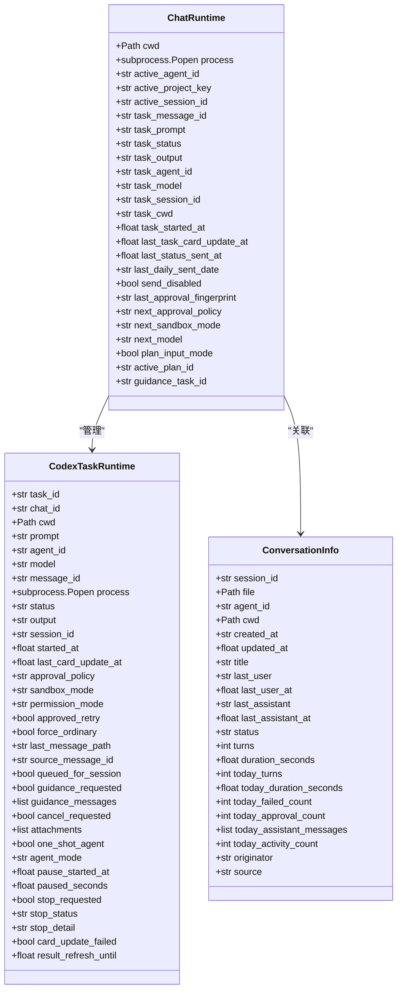
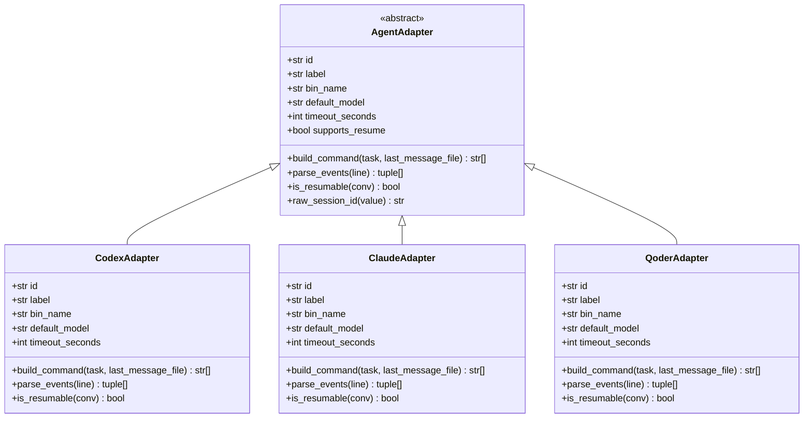
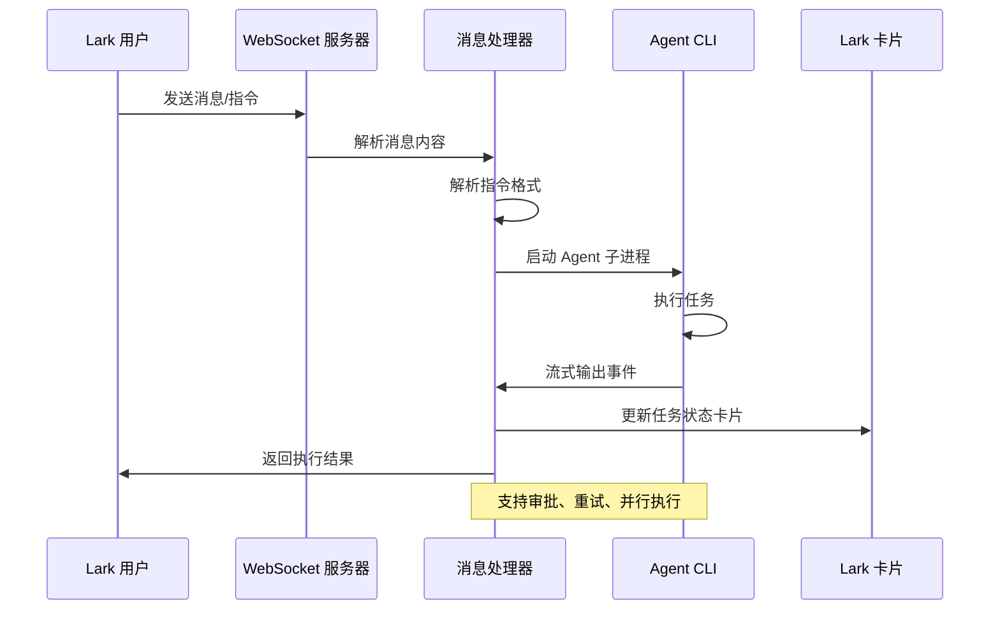
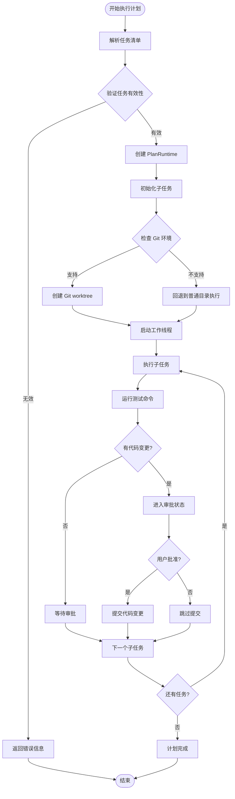
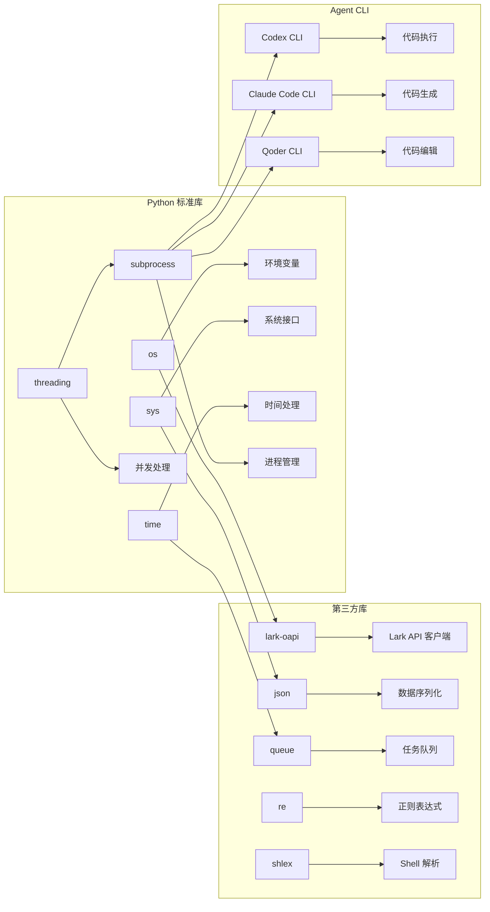
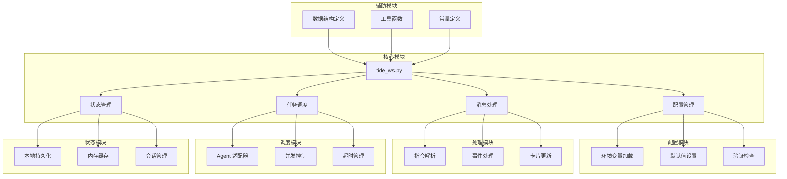

# 快速开始

<cite>
**本文档引用的文件**
- [README.md](file://README.md)
- [tide_ws.py](file://tide_ws.py)
- [.gitignore](file://.gitignore)
- [PPT_OUTLINE.md](file://PPT_OUTLINE.md)
- [ppt_outline_deck.html](file://ppt_outline_deck.html)
</cite>

## 目录
1. [简介](#简介)
2. [项目结构](#项目结构)
3. [核心组件](#核心组件)
4. [架构概览](#架构概览)
5. [详细组件分析](#详细组件分析)
6. [依赖关系分析](#依赖关系分析)
7. [性能考虑](#性能考虑)
8. [故障排除指南](#故障排除指南)
9. [结论](#结论)
10. [附录](#附录)

## 简介

Tide 是一个将飞书/Lark 群聊消息转换为 Codex、Claude Code 等 Agent CLI 任务的强大工具。它能够：
- 在 Lark 中直接发送自然语言指令，启动或续写 Agent CLI 任务
- 通过 Agent 指令面板查看当前任务状态、最新结果、待审批项
- 将执行进度、任务结果、审批操作和项目状态同步回 Lark 卡片
- 支持并行计划模式，将任务清单拆成多个子任务并行处理
- 提供 macOS 保活功能，确保脚本在电源接入时保持运行

## 项目结构



**图表来源**
- [README.md:1-517](file://README.md#L1-L517)
- [tide_ws.py:1-8589](file://tide_ws.py#L1-L8589)

**章节来源**
- [README.md:1-517](file://README.md#L1-L517)
- [tide_ws.py:1-8589](file://tide_ws.py#L1-L8589)

## 核心组件

### 环境准备

#### Python 3.10+ 安装
- 确保系统已安装 Python 3.10 或更高版本
- 验证安装：`python3 --version`

#### Agent CLI 工具安装
支持的 Agent CLI 工具有：
- **Codex CLI**：默认命令为 `codex`
- **Claude Code CLI**：默认命令为 `claude`  
- **Qoder CLI**：默认命令为 `qodercli`

验证安装：
```bash
codex --help
claude --help
qodercli --help
```

#### Lark-oapi SDK 安装
```bash
pip3 install lark-oapi
```

**章节来源**
- [README.md:17-26](file://README.md#L17-L26)
- [README.md:49-74](file://README.md#L49-L74)

### Lark 应用配置

#### 创建自建应用
1. 登录飞书开发者后台
2. 创建自建应用
3. 获取以下配置信息：
   - `LARK_APP_ID`：应用 ID
   - `LARK_APP_SECRET`：应用密钥
   - `LARK_ENCRYPT_KEY`：事件订阅加密密钥
   - `LARK_VERIFICATION_TOKEN`：事件订阅验证令牌

#### 权限配置
- 启用机器人能力
- 将机器人加入目标群聊
- 开通和发布 IM 相关权限
- 确保机器人能收消息、发消息、下载图片/文件资源、接收卡片按钮回调

#### 事件订阅设置
使用 WebSocket 长连接，注册以下事件：
- 消息接收事件
- 消息已读事件  
- 卡片按钮回调事件

**章节来源**
- [README.md:33-48](file://README.md#L33-L48)

### 环境变量配置

#### 基础配置
创建 `.env` 文件并填入以下必需变量：

| 变量名 | 示例值 | 说明 |
|--------|--------|------|
| `LARK_APP_ID` | `cli_xxx` | Lark 应用 ID |
| `LARK_APP_SECRET` | `xxx` | Lark 应用密钥 |
| `LARK_ENCRYPT_KEY` | `xxx` | 事件订阅加密密钥 |
| `LARK_VERIFICATION_TOKEN` | `xxx` | 事件订阅验证令牌 |
| `CODEX_DEFAULT_CWD` | `` | 默认工作目录 |

#### 可选配置
```env
LARK_DOMAIN=https://open.larksuite.com
TIDE_WELCOME_MESSAGE=I'm Tide, a lightweight multi-agent bridge for Lark.
STATUS_INTERVAL_SECONDS=0
TIDE_SHOW_ARCHIVED=0
```

**章节来源**
- [README.md:57-66](file://README.md#L57-L66)
- [README.md:317-428](file://README.md#L317-L428)

## 架构概览



**图表来源**
- [tide_ws.py:1-8589](file://tide_ws.py#L1-L8589)

## 详细组件分析

### WebSocket 服务器组件

#### 核心数据结构



**图表来源**
- [tide_ws.py:173-396](file://tide_ws.py#L173-L396)

#### Agent 适配器模式



**图表来源**
- [tide_ws.py:626-800](file://tide_ws.py#L626-L800)

**章节来源**
- [tide_ws.py:173-800](file://tide_ws.py#L173-L800)

### 消息处理流程



**图表来源**
- [tide_ws.py:1-8589](file://tide_ws.py#L1-L8589)

### 计划执行流程



**图表来源**
- [tide_ws.py:371-385](file://tide_ws.py#L371-L385)

**章节来源**
- [tide_ws.py:371-385](file://tide_ws.py#L371-L385)

## 依赖关系分析

### 外部依赖



**图表来源**
- [tide_ws.py:1-30](file://tide_ws.py#L1-L30)

### 内部模块依赖



**图表来源**
- [tide_ws.py:34-151](file://tide_ws.py#L34-L151)

**章节来源**
- [tide_ws.py:1-151](file://tide_ws.py#L1-L151)

## 性能考虑

### 并发处理
- 支持全局同时运行的 Agent 子进程上限：`MAX_RUNNING_TASKS`
- 单个 Lark chat 同时运行的 Agent 子进程上限：`MAX_RUNNING_TASKS_PER_CHAT`
- `/plan` 并行执行的最大子任务数：`PLAN_MAX_PARALLEL`

### 资源管理
- Lark 事件队列最大积压数量：`LARK_EVENT_QUEUE_MAXSIZE`
- 单条 Lark 消息最多处理的附件数量：`MAX_LARK_ATTACHMENTS_PER_MESSAGE`
- 单个附件最大下载字节数：`LARK_ATTACHMENT_MAX_BYTES`

### 状态持久化
- 本地运行状态文件：`.tide_state.json`
- 附件下载目录：`.tide/attachments`
- 会话文件索引：`CODEX_SESSIONS_DIR`、`CLAUDE_PROJECTS_DIR`、`QODER_PROJECTS_DIR`

**章节来源**
- [README.md:389-405](file://README.md#L389-L405)

## 故障排除指南

### 常见安装问题

#### Python 版本问题
**症状**：启动时报错，提示 Python 版本过低
**解决方案**：
1. 检查 Python 版本：`python3 --version`
2. 确保使用 Python 3.10 或更高版本
3. 如需升级，请参考官方 Python 安装指南

#### Agent CLI 未找到
**症状**：执行 `codex --help` 报错，提示命令不存在
**解决方案**：
1. 确认 Agent CLI 已正确安装
2. 检查 PATH 环境变量
3. 验证命令是否可执行：`which codex`

#### Lark SDK 安装失败
**症状**：pip 安装 lark-oapi 失败
**解决方案**：
1. 检查网络连接
2. 尝试使用国内镜像源：`pip3 install lark-oapi -i https://pypi.tuna.tsinghua.edu.cn/simple/`
3. 确认 pip 版本：`pip3 --version`

### 运行时问题

#### WebSocket 连接失败
**症状**：启动后无法接收 Lark 消息
**解决方案**：
1. 检查网络连接
2. 验证 Lark 应用配置是否正确
3. 查看日志文件：`tail -f tide_ws.log`

#### 机器人权限不足
**症状**：消息发送失败，提示权限错误
**解决方案**：
1. 确认机器人已加入目标群聊
2. 检查 Lark 应用权限配置
3. 验证 `LARK_ALLOWED_CHAT_IDS` 设置

#### Agent CLI 执行失败
**症状**：任务执行过程中出现错误
**解决方案**：
1. 检查 Agent CLI 配置
2. 验证工作目录权限
3. 查看具体错误信息并相应调整

### macOS 保活问题

#### 电脑仍然睡眠
**症状**：脚本在合盖或空闲时停止运行
**解决方案**：
1. 接入电源时自动保持运行：`KEEP_AWAKE_ON_AC_POWER=1`
2. 如需合盖运行，启用：`KEEP_AWAKE_DISABLE_SLEEP=1`
3. 注意：合盖运行有发热风险，建议配合外接显示器使用

**章节来源**
- [README.md:474-511](file://README.md#L474-L511)

## 结论

Tide 为飞书/Lark 用户提供了强大的 Agent CLI 集成解决方案。通过本文档的快速开始指南，您应该能够：

1. **成功安装**：完成 Python 环境、Agent CLI 工具和 Lark SDK 的安装
2. **正确配置**：设置 Lark 应用和环境变量
3. **顺利运行**：启动 WebSocket 服务器并验证基本功能
4. **故障排除**：识别和解决常见问题

项目的核心优势在于其简洁的设计和强大的功能组合，既保持了 Agent CLI 的本地执行特性，又提供了 Lark 协作界面的便利性。随着使用深入，您可以探索更多高级配置选项和功能特性。

## 附录

### 基本使用示例

#### 启动脚本
```bash
# 前台运行
python3 tide_ws.py

# 后台运行
nohup python3 tide_ws.py > tide_ws.log 2>&1 &
```

#### 基本指令
- `/help`：查看可用指令列表
- `/panel`：打开 Tide 看板
- `/projects`：查看项目面板
- `/status`：查看当前项目状态
- `/daily`：输出项目进展日报

#### 高级功能
- `/plan`：进入并行计划模式
- `/agent=claude`：切换到 Claude Code
- `/agent=qoder`：切换到 Qoder CLI
- `/model=gpt-5.5 +指令`：指定模型执行

### 验证步骤

1. **启动验证**：查看控制台输出包含 "Tide WebSocket 启动成功"
2. **功能测试**：在 Lark 群聊中发送 `/status` 指令
3. **日志检查**：查看 `tide_ws.log` 文件中的错误信息
4. **权限验证**：确认机器人已加入群聊并具备必要权限

**章节来源**
- [README.md:75-210](file://README.md#L75-L210)