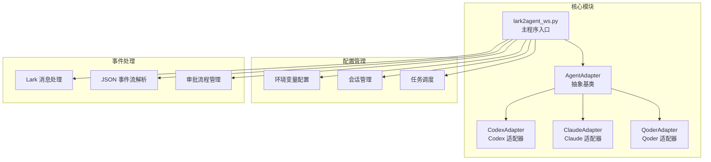
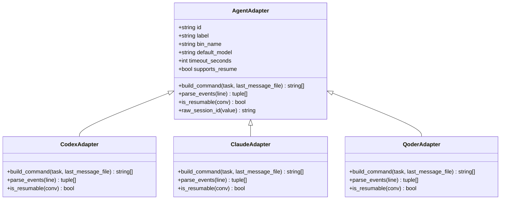
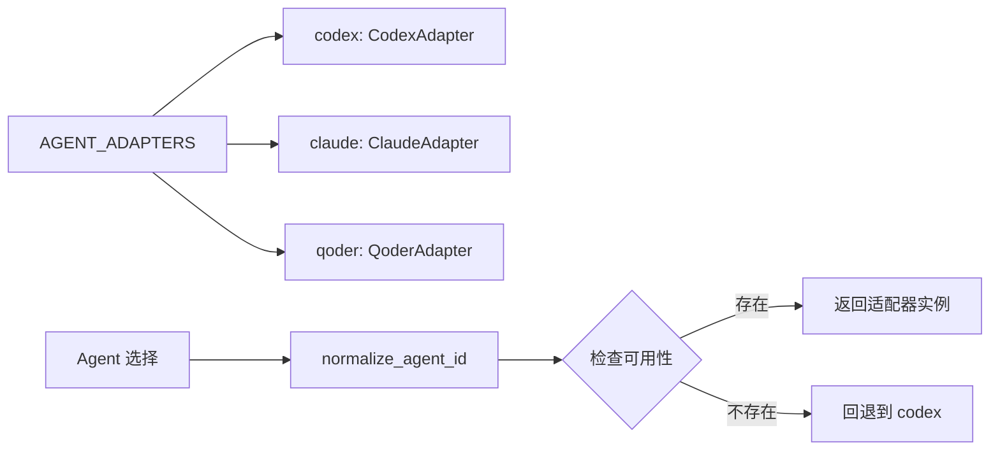
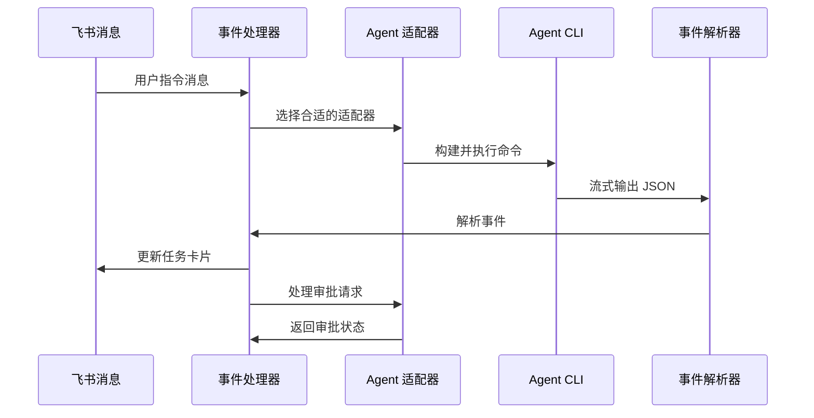
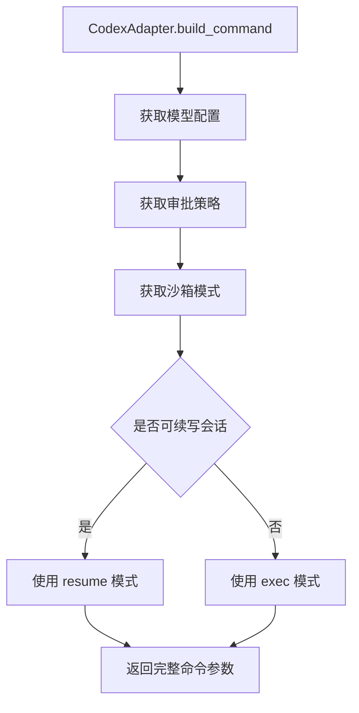
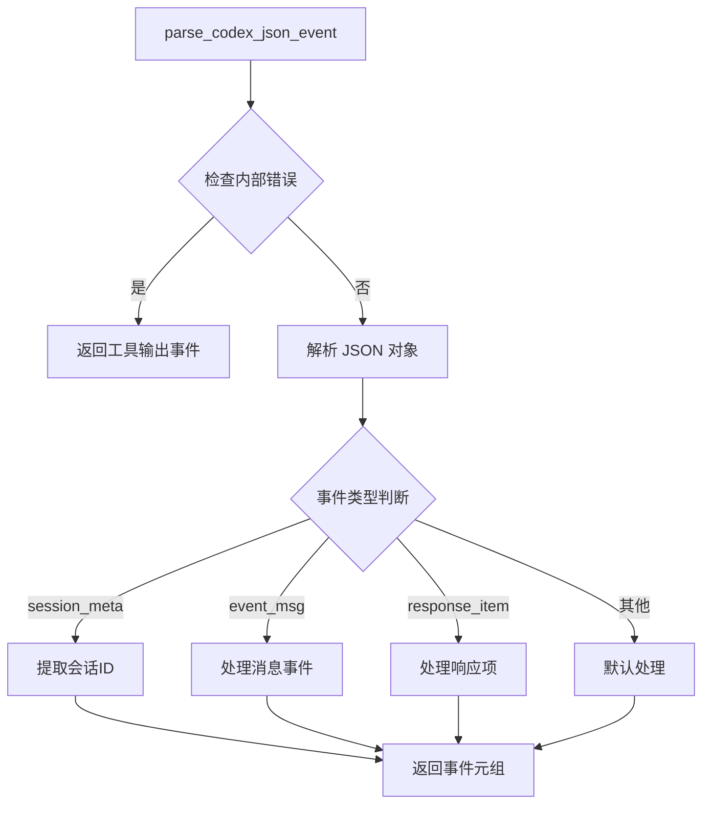
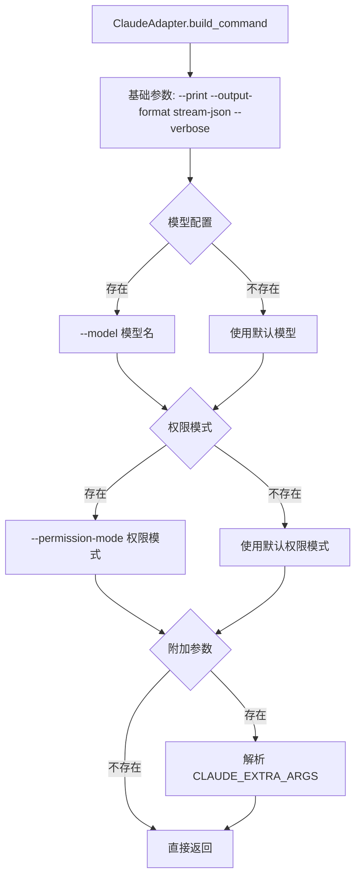
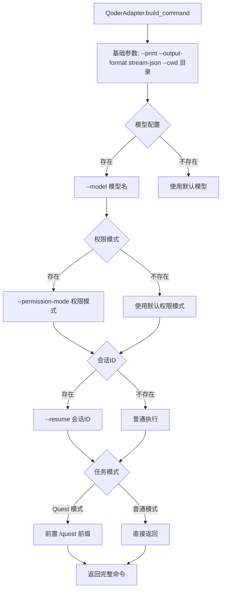
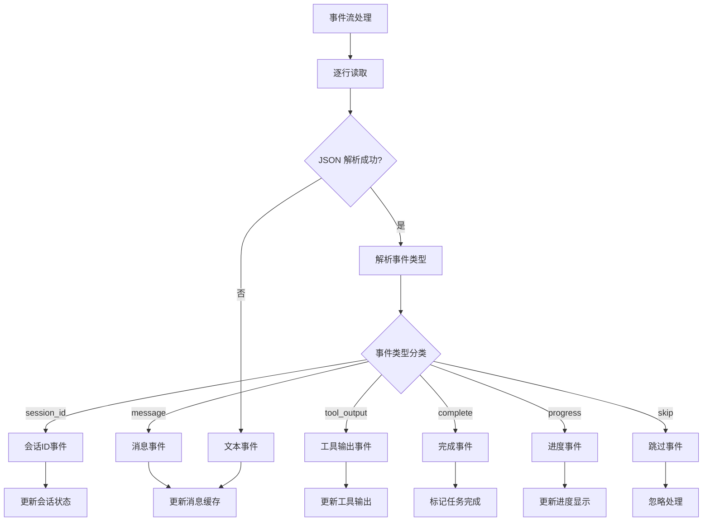
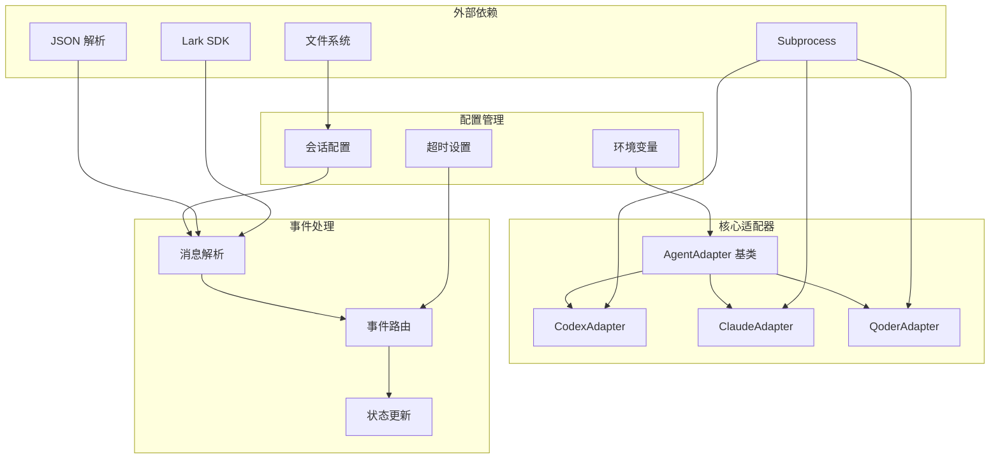

# Agent CLI 集成

<cite>
**本文档引用的文件**
- [lark2agent_ws.py](file://lark2agent_ws.py)
- [README.md](file://README.md)
</cite>

## 目录
1. [简介](#简介)
2. [项目结构](#项目结构)
3. [核心组件](#核心组件)
4. [架构概览](#架构概览)
5. [详细组件分析](#详细组件分析)
6. [依赖关系分析](#依赖关系分析)
7. [性能考虑](#性能考虑)
8. [故障排除指南](#故障排除指南)
9. [结论](#结论)

## 简介

Lark2Agent 是一个将飞书/Lark 群聊消息转换为多种 AI Agent CLI 任务的桥接系统。本文档专注于 Agent CLI 集成功能，深入解释 Codex CLI、Claude Code CLI、Qoder CLI 的集成方式和适配器模式的实现原理。

该系统通过适配器模式实现了对不同 Agent CLI 的统一抽象，使得开发者可以轻松添加新的 Agent 集成而无需修改核心业务逻辑。每个 Agent 都有自己的适配器实现，负责命令构建、事件解析和会话管理等特定功能。

## 项目结构

项目采用模块化设计，主要文件结构如下：

**图表来源**
- [lark2agent_ws.py:626-853](file://lark2agent_ws.py#L626-L853)

**章节来源**
- [lark2agent_ws.py:1-50](file://lark2agent_ws.py#L1-L50)
- [README.md:1-50](file://README.md#L1-L50)

## 核心组件

### AgentAdapter 抽象基类

AgentAdapter 是所有 Agent 适配器的抽象基类，定义了统一的接口规范：

**图表来源**
- [lark2agent_ws.py:626-801](file://lark2agent_ws.py#L626-L801)

### 适配器注册与管理

系统通过 AGENT_ADAPTERS 字典统一管理所有可用的 Agent 适配器：

**图表来源**
- [lark2agent_ws.py:849-853](file://lark2agent_ws.py#L849-L853)

**章节来源**
- [lark2agent_ws.py:626-853](file://lark2agent_ws.py#L626-L853)

## 架构概览

系统采用事件驱动架构，通过适配器模式实现多 Agent CLI 的统一集成：

**图表来源**
- [lark2agent_ws.py:4029-4091](file://lark2agent_ws.py#L4029-L4091)
- [lark2agent_ws.py:5427-5447](file://lark2agent_ws.py#L5427-L5447)

## 详细组件分析

### CodexAdapter 实现

CodexAdapter 负责与 Codex CLI 的集成，具有以下特点：

#### 命令构建机制

**图表来源**
- [lark2agent_ws.py:655-672](file://lark2agent_ws.py#L655-L672)

#### 事件解析流程

CodexAdapter 使用专门的解析器处理 Codex 特有的 JSON 事件格式：

**图表来源**
- [lark2agent_ws.py:5207-5254](file://lark2agent_ws.py#L5207-L5254)

**章节来源**
- [lark2agent_ws.py:648-681](file://lark2agent_ws.py#L648-L681)
- [lark2agent_ws.py:5207-5254](file://lark2agent_ws.py#L5207-L5254)

### ClaudeAdapter 实现

ClaudeAdapter 提供 Claude Code CLI 的集成能力：

#### 命令构建特性

ClaudeAdapter 支持额外的权限模式和扩展参数：

**图表来源**
- [lark2agent_ws.py:709-726](file://lark2agent_ws.py#L709-L726)

#### 事件解析机制

ClaudeAdapter 的事件解析支持多种 Claude 特有的事件类型：

**章节来源**
- [lark2agent_ws.py:702-769](file://lark2agent_ws.py#L702-L769)

### QoderAdapter 实现

QoderAdapter 专为 Qoder CLI 设计，具有独特的 Quest 模式支持：

#### 命令构建与权限管理

**图表来源**
- [lark2agent_ws.py:778-795](file://lark2agent_ws.py#L778-L795)

#### Quest 模式的特殊处理

QoderAdapter 实现了独特的 Quest 模式，支持暂停、继续和终止操作：

**章节来源**
- [lark2agent_ws.py:771-801](file://lark2agent_ws.py#L771-L801)
- [lark2agent_ws.py:501-511](file://lark2agent_ws.py#L501-L511)

### 事件解析机制

系统实现了统一的事件解析框架，支持多种 Agent 的事件格式：

**图表来源**
- [lark2agent_ws.py:797-846](file://lark2agent_ws.py#L797-L846)

**章节来源**
- [lark2agent_ws.py:797-846](file://lark2agent_ws.py#L797-L846)

## 依赖关系分析

系统采用松耦合设计，各组件之间的依赖关系如下：

**图表来源**
- [lark2agent_ws.py:1-50](file://lark2agent_ws.py#L1-L50)
- [lark2agent_ws.py:849-853](file://lark2agent_ws.py#L849-L853)

**章节来源**
- [lark2agent_ws.py:1-50](file://lark2agent_ws.py#L1-L50)
- [lark2agent_ws.py:849-853](file://lark2agent_ws.py#L849-L853)

## 性能考虑

### 并发处理优化

系统通过线程锁和进程池管理实现高效的并发处理：

- **会话级锁**：每个会话使用独立的锁，避免并发冲突
- **全局锁管理**：使用 RLock 确保线程安全
- **进程生命周期管理**：合理管理 Agent 进程的创建和销毁

### 内存管理

- **事件缓冲**：使用列表缓冲流式输出，避免频繁的卡片更新
- **状态持久化**：关键状态保存到本地文件，支持脚本重启后的状态恢复
- **资源清理**：及时清理临时文件和进程句柄

### 网络和 I/O 优化

- **批量消息处理**：支持批量发送和更新消息卡片
- **超时控制**：为所有外部调用设置合理的超时时间
- **错误重试**：实现智能的错误重试机制

## 故障排除指南

### 常见问题诊断

#### Agent CLI 无法找到

**症状**：任务启动失败，提示找不到 Agent CLI 命令

**解决方案**：
1. 检查环境变量配置（CODEX_BIN、CLAUDE_BIN、QODER_BIN）
2. 验证 CLI 命令在系统 PATH 中的可用性
3. 确认 CLI 版本满足最低要求

#### 权限相关错误

**症状**：任务执行过程中出现权限拒绝或需要人工批准

**解决方案**：
1. 检查权限模式配置（CLAUDE_PERMISSION_MODE、QODER_PERMISSION_MODE）
2. 使用审批流程自动处理权限请求
3. 调整沙箱模式和审批策略

#### 会话恢复失败

**症状**：无法续写之前的会话，总是创建新的会话

**解决方案**：
1. 验证会话文件的完整性和可读性
2. 检查会话 ID 的正确性
3. 确认工作目录的访问权限

**章节来源**
- [lark2agent_ws.py:5353-5378](file://lark2agent_ws.py#L5353-L5378)
- [lark2agent_ws.py:5427-5447](file://lark2agent_ws.py#L5427-L5447)

## 结论

Lark2Agent 的 Agent CLI 集成通过适配器模式实现了高度模块化的架构设计。该设计的主要优势包括：

1. **统一抽象**：AgentAdapter 基类提供了清晰的接口规范，使得不同 Agent 的集成变得标准化
2. **灵活扩展**：新增 Agent 只需实现必要的抽象方法，无需修改核心逻辑
3. **事件驱动**：基于流式 JSON 事件的处理机制，支持实时的状态更新和用户交互
4. **健壮性**：完善的错误处理和状态管理机制，确保系统的稳定运行

通过这种设计，Lark2Agent 成功地将多种不同的 Agent CLI 集成到统一的平台中，为用户提供了一致的使用体验。同时，模块化的架构也为未来的功能扩展和技术演进奠定了良好的基础。