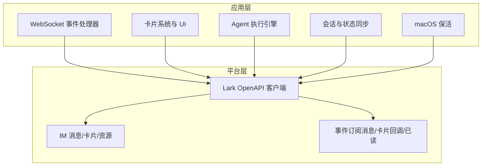
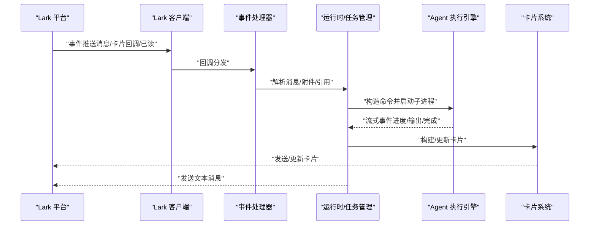
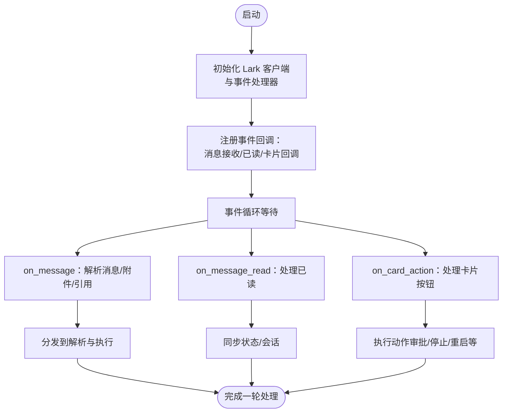
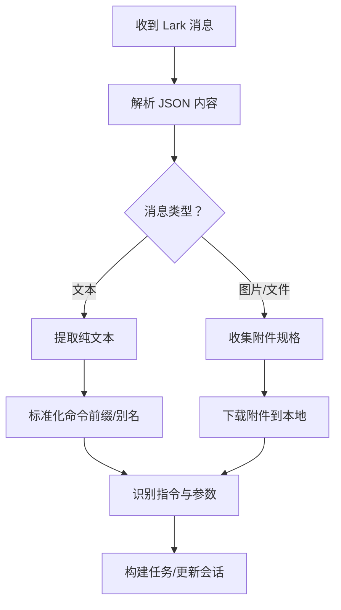
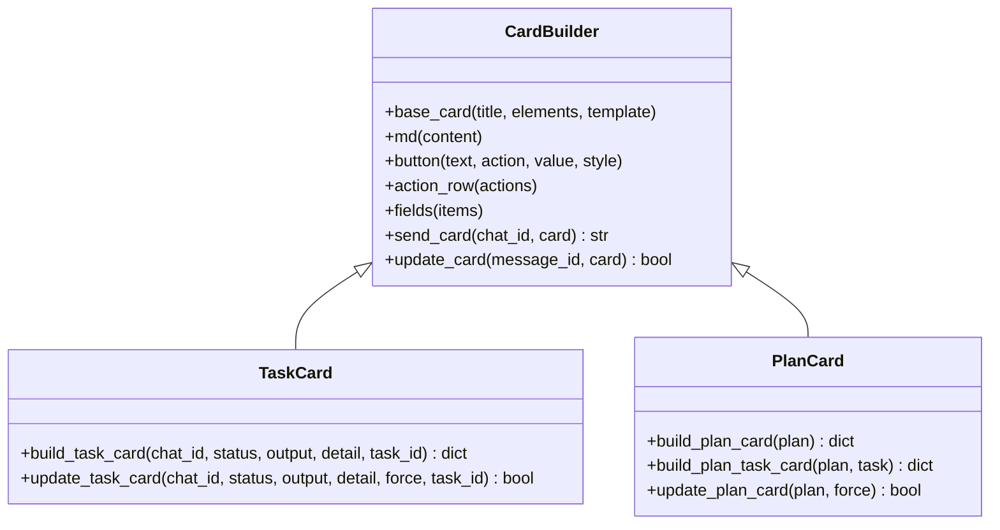
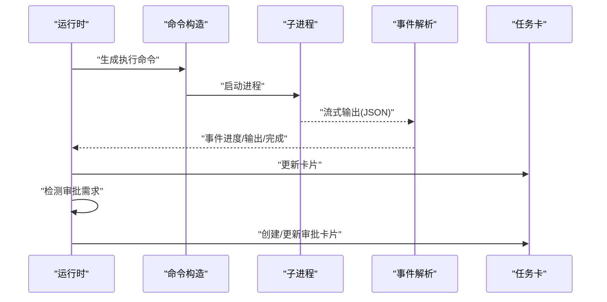
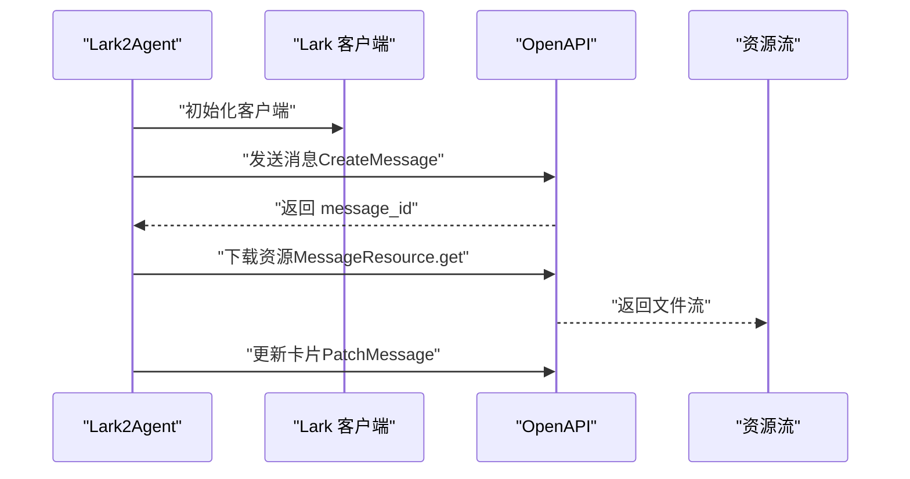
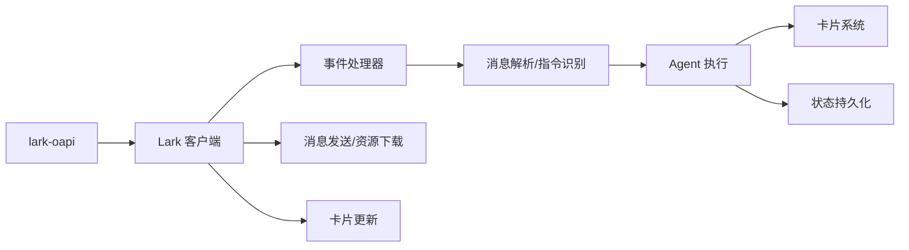

# Lark 集成

<cite>
**本文引用的文件**
- [README.md](file://README.md)
- [lark2agent_ws.py](file://lark2agent_ws.py)
- [ppt_outline_deck.html](file://ppt_outline_deck.html)
- [PPT_OUTLINE.md](file://PPT_OUTLINE.md)
</cite>

## 目录
1. [简介](#简介)
2. [项目结构](#项目结构)
3. [核心组件](#核心组件)
4. [架构总览](#架构总览)
5. [详细组件分析](#详细组件分析)
6. [依赖关系分析](#依赖关系分析)
7. [性能考量](#性能考量)
8. [故障排查指南](#故障排查指南)
9. [结论](#结论)
10. [附录](#附录)

## 简介
本技术文档围绕 Lark2Agent 的 Lark 集成功能，系统阐述 WebSocket 事件处理机制、消息解析与指令识别算法、卡片系统与 UI 交互设计，以及与 Lark 平台 API 的集成方式。文档基于仓库中的实现文件进行深入分析，提供代码级图示与流程图，帮助读者快速理解从消息接收、解析、执行到卡片更新的完整链路。

## 项目结构
- lark2agent_ws.py：主程序，负责 Lark WebSocket 事件、消息卡片、Agent 执行、审批、会话同步与 macOS 保活。
- README.md：项目说明、功能清单、安装与运行方式、常见问题等。
- PPT_OUTLINE.md 与 ppt_outline_deck.html：项目定位与功能概览的演示材料。

**图表来源**
- [lark2agent_ws.py:856-866](file://lark2agent_ws.py#L856-L866)
- [lark2agent_ws.py:1642-1652](file://lark2agent_ws.py#L1642-L1652)
- [lark2agent_ws.py:3482-3524](file://lark2agent_ws.py#L3482-L3524)
- [lark2agent_ws.py:3663-3703](file://lark2agent_ws.py#L3663-L3703)

**章节来源**
- [README.md:1-517](file://README.md#L1-L517)
- [lark2agent_ws.py:1-200](file://lark2agent_ws.py#L1-L200)

## 核心组件
- WebSocket 事件处理器：注册并处理消息接收、消息已读、卡片按钮回调事件。
- 消息解析与指令识别：解析 Lark 文本、图片/文件附件，识别自然语言指令与命令格式，提取参数。
- 卡片系统与 UI：构建与更新任务卡、计划卡、重启确认卡、桌面同步卡等，支持按钮交互与状态反馈。
- Agent 执行引擎：启动 Codex/Claude/Qoder 子进程，解析流式输出，处理审批与重试。
- 会话与状态同步：索引 Agent 会话文件，构建项目/对话面板，支持 Codex Desktop 会话监听。
- macOS 保活：在接入电源时保持脚本与网络活跃，必要时禁用系统睡眠。

**章节来源**
- [lark2agent_ws.py:1642-1652](file://lark2agent_ws.py#L1642-L1652)
- [lark2agent_ws.py:3423-3480](file://lark2agent_ws.py#L3423-L3480)
- [lark2agent_ws.py:5011-5031](file://lark2agent_ws.py#L5011-L5031)
- [lark2agent_ws.py:1655-1770](file://lark2agent_ws.py#L1655-L1770)

## 架构总览
Lark2Agent 通过 Lark OpenAPI 客户端建立 WebSocket 连接，注册事件回调；在本地维护运行时状态与任务队列，解析 Lark 消息并派发到 Agent 执行引擎；执行过程中持续更新卡片状态，支持审批、停止、重启等交互。

**图表来源**
- [lark2agent_ws.py:1642-1652](file://lark2agent_ws.py#L1642-L1652)
- [lark2agent_ws.py:3482-3524](file://lark2agent_ws.py#L3482-L3524)
- [lark2agent_ws.py:3663-3703](file://lark2agent_ws.py#L3663-L3703)
- [lark2agent_ws.py:5011-5031](file://lark2agent_ws.py#L5011-L5031)

## 详细组件分析

### WebSocket 事件处理机制
- 事件注册：通过 EventDispatcherHandler 注册消息接收、消息已读、卡片按钮回调事件。
- 连接与鉴权：使用 LARK_ENCRYPT_KEY 与 LARK_VERIFICATION_TOKEN 初始化事件处理器。
- 事件分发：on_message/on_message_read/on_card_action 分别处理消息事件、已读事件与卡片按钮回调。

**图表来源**
- [lark2agent_ws.py:856-866](file://lark2agent_ws.py#L856-L866)
- [lark2agent_ws.py:1642-1652](file://lark2agent_ws.py#L1642-L1652)

**章节来源**
- [lark2agent_ws.py:856-866](file://lark2agent_ws.py#L856-L866)
- [lark2agent_ws.py:1642-1652](file://lark2agent_ws.py#L1642-L1652)

### 消息解析与指令识别算法
- 文本消息解析：从 Lark JSON 内容中抽取纯文本，支持多层结构与富文本元素。
- 附件解析：收集 image/file 类型资源，下载到本地临时目录，记录文件路径与元数据。
- 引用上下文：根据 quote_message_id/parent_id/root_id/thread_id 等字段查找历史消息引用，拼接上下文提示词。
- 指令识别：支持 /panel、/projects、/convos、/status、/daily、/stop 等命令；支持中文别名；支持模型前缀与 Agent 前缀。

**图表来源**
- [lark2agent_ws.py:1772-1793](file://lark2agent_ws.py#L1772-L1793)
- [lark2agent_ws.py:1795-1813](file://lark2agent_ws.py#L1795-L1813)
- [lark2agent_ws.py:1815-1848](file://lark2agent_ws.py#L1815-L1848)
- [lark2agent_ws.py:1449-1540](file://lark2agent_ws.py#L1449-L1540)

**章节来源**
- [lark2agent_ws.py:1772-1848](file://lark2agent_ws.py#L1772-L1848)
- [lark2agent_ws.py:1449-1540](file://lark2agent_ws.py#L1449-L1540)

### 卡片系统与 UI 交互
- 卡片构建：统一的 base_card/md/button/action_row/fields 等组件函数，支持宽屏模式与转发。
- 任务卡：展示状态、Agent、目录、模型、耗时、Session、附件、最新结果与操作按钮。
- 计划卡：展示并发、进度、子任务状态、依赖关系、Worktree/分支、Diff 摘要与提交状态。
- 交互动作：刷新、状态、停止、取消、批准/拒绝、合并、清理等。

**图表来源**
- [lark2agent_ws.py:3735-3744](file://lark2agent_ws.py#L3735-L3744)
- [lark2agent_ws.py:3897-4026](file://lark2agent_ws.py#L3897-L4026)
- [lark2agent_ws.py:4405-4505](file://lark2agent_ws.py#L4405-L4505)

**章节来源**
- [lark2agent_ws.py:3735-4026](file://lark2agent_ws.py#L3735-L4026)
- [lark2agent_ws.py:4405-4505](file://lark2agent_ws.py#L4405-L4505)

### Agent 执行与流式输出
- 命令构造：根据 Agent 类型（Codex/Claude/Qoder）与运行时配置生成执行命令。
- 子进程启动：以流式方式读取 stdout/stderr，解析 JSON 事件，更新任务卡。
- 审批与重试：检测需要人工批准的输出，创建审批项；等待审批结果后按策略重试。
- 计划并行：Plan 子任务在独立 worktree/分支中执行，完成后进行测试与提交审批。

**图表来源**
- [lark2agent_ws.py:5012-5031](file://lark2agent_ws.py#L5012-L5031)
- [lark2agent_ws.py:5207-5255](file://lark2agent_ws.py#L5207-L5255)
- [lark2agent_ws.py:5353-5425](file://lark2agent_ws.py#L5353-L5425)
- [lark2agent_ws.py:5471-5604](file://lark2agent_ws.py#L5471-L5604)

**章节来源**
- [lark2agent_ws.py:5012-5031](file://lark2agent_ws.py#L5012-L5031)
- [lark2agent_ws.py:5207-5255](file://lark2agent_ws.py#L5207-L5255)
- [lark2agent_ws.py:5353-5425](file://lark2agent_ws.py#L5353-L5425)
- [lark2agent_ws.py:5471-5604](file://lark2agent_ws.py#L5471-L5604)

### 与 Lark 平台 API 的集成
- 客户端初始化：使用 LARK_APP_ID/LARK_APP_SECRET/LARK_DOMAIN 构造 Lark 客户端。
- 消息发送：CreateMessageRequest/CreateMessageRequestBody，支持文本卡片与交互消息。
- 资源下载：GetMessageResourceRequest 获取图片/文件资源，支持大小限制与本地存储。
- 卡片更新：PatchMessageRequest 更新已发送卡片内容。
- 事件订阅：通过 EventDispatcherHandler 注册消息接收、消息已读、卡片回调事件。

**图表来源**
- [lark2agent_ws.py:856-866](file://lark2agent_ws.py#L856-L866)
- [lark2agent_ws.py:3482-3524](file://lark2agent_ws.py#L3482-L3524)
- [lark2agent_ws.py:1475-1540](file://lark2agent_ws.py#L1475-L1540)
- [lark2agent_ws.py:3705-3733](file://lark2agent_ws.py#L3705-L3733)

**章节来源**
- [lark2agent_ws.py:856-866](file://lark2agent_ws.py#L856-L866)
- [lark2agent_ws.py:3482-3524](file://lark2agent_ws.py#L3482-L3524)
- [lark2agent_ws.py:1475-1540](file://lark2agent_ws.py#L1475-L1540)
- [lark2agent_ws.py:3705-3733](file://lark2agent_ws.py#L3705-L3733)

## 依赖关系分析
- 第三方依赖：lark-oapi（Lark OpenAPI 客户端），Python 标准库（subprocess/json/re/queue/threading/time/os 等）。
- 内部模块：事件处理器、消息解析器、卡片构建器、任务执行器、计划调度器、状态持久化等。
- 平台依赖：Lark 事件订阅、IM 消息、卡片、资源下载、消息已读。

**图表来源**
- [lark2agent_ws.py:21-31](file://lark2agent_ws.py#L21-L31)
- [lark2agent_ws.py:856-866](file://lark2agent_ws.py#L856-L866)
- [lark2agent_ws.py:1642-1652](file://lark2agent_ws.py#L1642-L1652)

**章节来源**
- [lark2agent_ws.py:21-31](file://lark2agent_ws.py#L21-L31)
- [lark2agent_ws.py:856-866](file://lark2agent_ws.py#L856-L866)
- [lark2agent_ws.py:1642-1652](file://lark2agent_ws.py#L1642-L1652)

## 性能考量
- 事件队列与并发：使用队列与锁保护共享状态，限制全局与单聊天并发任务数，避免资源争用。
- 卡片更新节流：任务卡与计划卡更新存在最小间隔，避免频繁网络请求。
- 流式输出缓冲：按时间或长度阈值刷新卡片，平衡实时性与网络负载。
- 附件下载限制：单附件大小上限与附件数量上限，防止资源滥用。
- macOS 保活：仅在接入电源时启用 caffeinate 与禁用睡眠，减少系统开销。

**章节来源**
- [lark2agent_ws.py:107-125](file://lark2agent_ws.py#L107-L125)
- [lark2agent_ws.py:4094-4144](file://lark2agent_ws.py#L4094-L4144)
- [lark2agent_ws.py:1449-1540](file://lark2agent_ws.py#L1449-L1540)
- [lark2agent_ws.py:1751-1770](file://lark2agent_ws.py#L1751-L1770)

## 故障排查指南
- 收不到 Lark 消息：检查机器人是否加入群聊、IM 权限是否开通、事件订阅是否启用、密钥与令牌是否正确。
- 发送/更新卡片失败：关注返回码与消息，若提示 receive_id 无效，将禁用该聊天发送；检查网络与权限。
- 审批未继续：确认脚本已重启并加载最新代码，检查批准后的配置（sandbox/approval policy）。
- Git 提交失败：通常为 sandbox 权限不足，批准后按批准策略重试。
- 电脑睡眠导致连接中断：在 macOS 上启用接入电源保活，必要时禁用睡眠。

**章节来源**
- [lark2agent_ws.py:1283-1291](file://lark2agent_ws.py#L1283-L1291)
- [lark2agent_ws.py:3688-3699](file://lark2agent_ws.py#L3688-L3699)
- [lark2agent_ws.py:3722-3732](file://lark2agent_ws.py#L3722-L3732)
- [README.md:474-511](file://README.md#L474-L511)

## 结论
Lark2Agent 通过 WebSocket 与 Lark OpenAPI 紧密集成，实现了从消息接收、指令解析、任务执行到卡片反馈的完整闭环。其卡片系统与 UI 交互设计直观高效，配合审批与并行计划能力，满足工程任务在协作界面中的可见性、可控性与可扩展性需求。项目采用模块化设计与严格的并发控制，兼顾稳定性与性能。

## 附录
- 项目定位与功能概览参见 PPT 材料与 README。
- 常用命令与使用方式详见 README 的“Lark 使用方式”。

**章节来源**
- [README.md:154-210](file://README.md#L154-L210)
- [PPT_OUTLINE.md:1-318](file://PPT_OUTLINE.md#L1-L318)
- [ppt_outline_deck.html:1-800](file://ppt_outline_deck.html#L1-L800)