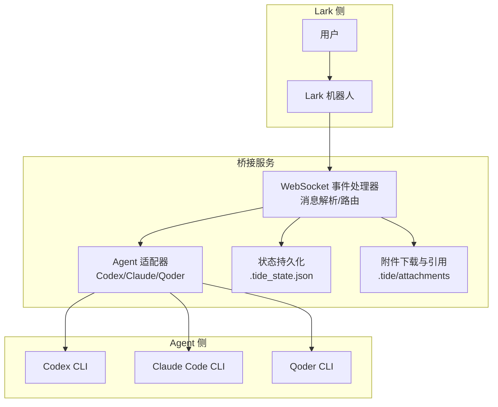
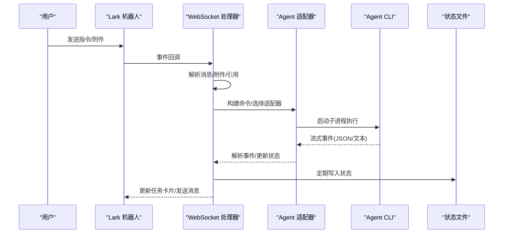
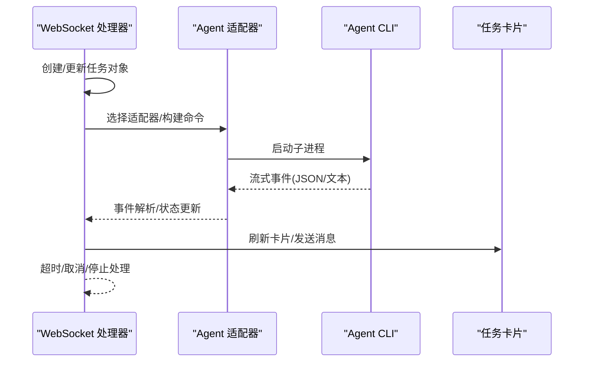
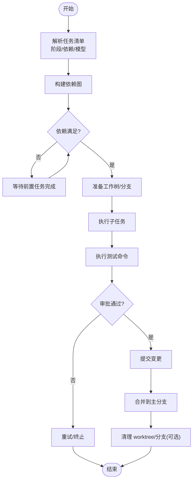
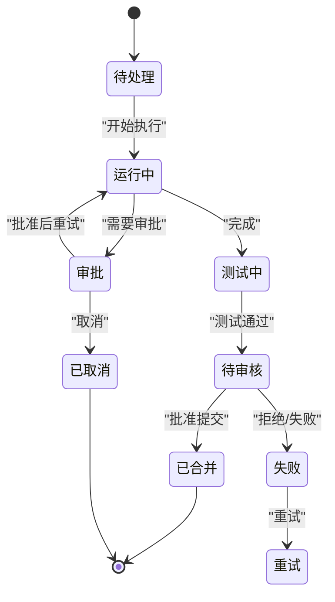
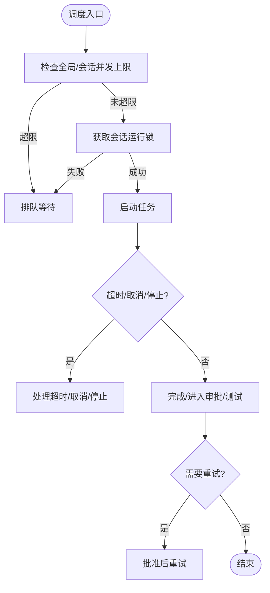
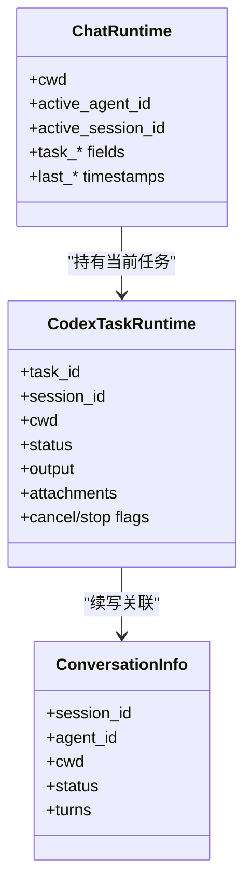
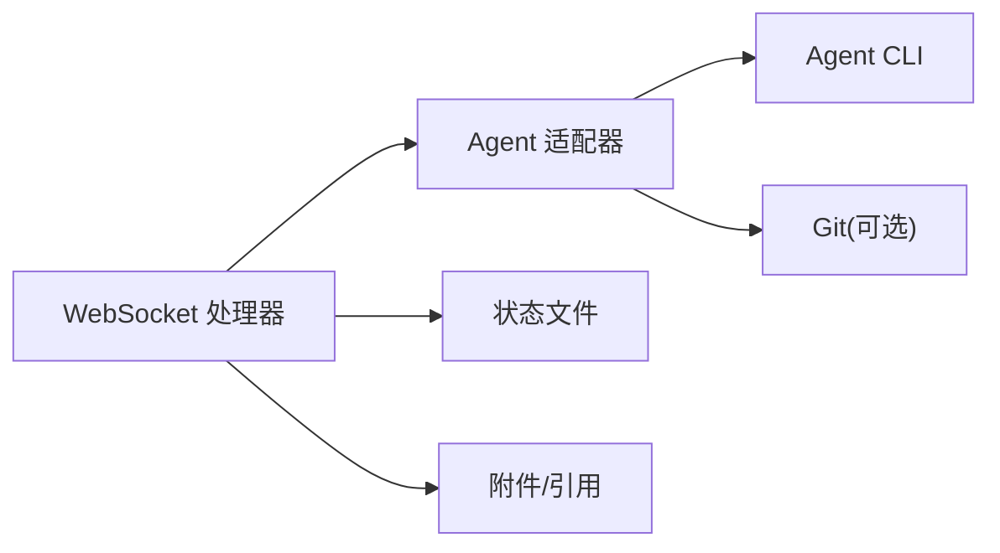

# 任务管理系统

<cite>
**本文引用的文件**
- [README.md](file://README.md)
- [tide_ws.py](file://tide_ws.py)
</cite>

## 目录
1. [简介](#简介)
2. [项目结构](#项目结构)
3. [核心组件](#核心组件)
4. [架构总览](#架构总览)
5. [详细组件分析](#详细组件分析)
6. [依赖关系分析](#依赖关系分析)
7. [性能考量](#性能考量)
8. [故障排查指南](#故障排查指南)
9. [结论](#结论)
10. [附录](#附录)

## 简介
本技术文档围绕 Tide 的任务管理系统展开，重点阐述普通任务执行流程（任务创建、Agent 调度、执行监控、结果反馈）、Plan 并行任务模式（任务拆分、依赖管理、并发控制、结果合并）、任务状态管理（状态定义、状态转换、持久化存储、异常处理）、任务调度算法（优先级管理、资源分配、超时控制、重试机制）、任务与会话的关系（会话绑定、状态同步、上下文保持），并提供可定位到源码的示例路径，帮助读者快速定位实现细节。

## 项目结构
- 主程序入口为 tide_ws.py，负责：
  - Lark WebSocket 事件接入与消息处理
  - 任务与 Plan 的生命周期管理
  - 会话与桌面同步
  - 状态持久化与恢复
  - 附件下载与引用缓存
  - 任务卡片渲染与刷新
- README.md 提供了功能概览、环境变量、使用方式与 Plan 并行模式说明。

图表来源
- [tide_ws.py:856-866](file://tide_ws.py#L856-L866)
- [tide_ws.py:849-853](file://tide_ws.py#L849-L853)
- [tide_ws.py:869-891](file://tide_ws.py#L869-L891)
- [tide_ws.py:1449-1539](file://tide_ws.py#L1449-L1539)

章节来源
- [README.md:1-517](file://README.md#L1-L517)
- [tide_ws.py:1-200](file://tide_ws.py#L1-L200)

## 核心组件
- 任务数据模型
  - 普通任务：CodexTaskRuntime（包含任务标识、会话、工作目录、状态、输出、超时、权限模式、取消/停止标记、附件等）
  - 会话运行时：ChatRuntime（包含当前工作目录、活跃 Agent、活跃项目/会话、任务卡片更新时间、计划 ID 等）
  - Plan 任务：PlanTask（包含子任务 ID、标题、prompt、阶段、依赖、状态、会话、输出、开始/结束时间、工作树/分支、diff/测试摘要、提交信息、重试次数、合并/清理状态等）
  - Plan 运行时：PlanRuntime（包含计划 ID、聊天 ID、工作目录、任务列表、最大并发、消息 ID、状态、创建时间、停止请求、合并状态/输出等）
- 适配器与命令构建
  - AgentAdapter 及其子类（CodexAdapter、ClaudeAdapter、QoderAdapter）负责根据任务上下文构建 CLI 命令、解析事件流、判断可续写性
- 状态与持久化
  - 读写状态文件（.tide_state.json），包含已知聊天、运行时、计划与子任务状态
- 附件与引用
  - 附件下载、去重、TTL 清理、消息引用缓存与查找

章节来源
- [tide_ws.py:237-273](file://tide_ws.py#L237-L273)
- [tide_ws.py:208-235](file://tide_ws.py#L208-L235)
- [tide_ws.py:342-385](file://tide_ws.py#L342-L385)
- [tide_ws.py:371-385](file://tide_ws.py#L371-L385)
- [tide_ws.py:626-646](file://tide_ws.py#L626-L646)
- [tide_ws.py:648-681](file://tide_ws.py#L648-L681)
- [tide_ws.py:702-769](file://tide_ws.py#L702-L769)
- [tide_ws.py:771-801](file://tide_ws.py#L771-L801)
- [tide_ws.py:869-891](file://tide_ws.py#L869-L891)
- [tide_ws.py:1044-1107](file://tide_ws.py#L1044-L1107)
- [tide_ws.py:1109-1149](file://tide_ws.py#L1109-L1149)
- [tide_ws.py:1449-1539](file://tide_ws.py#L1449-L1539)
- [tide_ws.py:909-953](file://tide_ws.py#L909-L953)
- [tide_ws.py:956-981](file://tide_ws.py#L956-L981)

## 架构总览
Tide 的任务管理采用“事件驱动 + 适配器 + 状态持久化”的架构：
- 事件驱动：WebSocket 接收 Lark 事件，解析消息、附件、卡片回调，路由到相应处理函数
- 适配器模式：不同 Agent（Codex/Claude/Qoder）通过统一接口构建命令、解析事件流、控制续写
- 并行执行：普通任务与 Plan 子任务均受全局与会话级并发上限约束
- 状态持久化：运行时状态与计划状态写入本地 JSON 文件，重启后恢复
- 会话绑定：任务与会话 ID 绑定，支持续写与上下文保持

图表来源
- [tide_ws.py:856-866](file://tide_ws.py#L856-L866)
- [tide_ws.py:648-681](file://tide_ws.py#L648-L681)
- [tide_ws.py:702-769](file://tide_ws.py#L702-L769)
- [tide_ws.py:771-801](file://tide_ws.py#L771-L801)
- [tide_ws.py:869-891](file://tide_ws.py#L869-L891)

## 详细组件分析

### 普通任务执行流程
- 任务创建
  - 解析 Lark 消息，提取文本与附件，构造 CodexTaskRuntime
  - 设置任务的 Agent、模型、工作目录、会话 ID、附件等
- Agent 调度
  - 依据任务类型选择适配器（Codex/Claude/Qoder）
  - 构建 CLI 命令（含模型、权限模式、续写参数等）
- 执行监控
  - 子进程异步读取事件流，解析为“会话 ID/进度/消息/工具输出/完成”等事件
  - 实时更新任务状态与输出，维护暂停/运行时长、超时控制
- 结果反馈
  - 通过 Lark 卡片与消息反馈进度、输出与最终结果
  - 支持取消、停止、重试等操作

图表来源
- [tide_ws.py:648-681](file://tide_ws.py#L648-L681)
- [tide_ws.py:702-769](file://tide_ws.py#L702-L769)
- [tide_ws.py:771-801](file://tide_ws.py#L771-L801)
- [tide_ws.py:4093-4200](file://tide_ws.py#L4093-L4200)

章节来源
- [tide_ws.py:237-273](file://tide_ws.py#L237-L273)
- [tide_ws.py:648-681](file://tide_ws.py#L648-L681)
- [tide_ws.py:702-769](file://tide_ws.py#L702-L769)
- [tide_ws.py:771-801](file://tide_ws.py#L771-L801)
- [tide_ws.py:4093-4200](file://tide_ws.py#L4093-L4200)

### Plan 并行任务模式
- 任务拆分与解析
  - 支持列表、阶段、依赖声明（如 depends:1,2）
  - 将任务清单解析为 PlanTask 列表，支持每子任务指定模型
- 依赖管理
  - 通过 depends_on 字段建立依赖图，按拓扑顺序调度
  - 依赖满足检测：前置子任务全部完成才允许启动
- 并发控制
  - 受全局最大并发与会话并发上限限制
  - 会话级运行锁保证同一会话内串行续写
- 工作树隔离（Git 仓库）
  - 为每个子任务创建独立 worktree/分支，避免互相覆盖
  - 子任务完成后执行测试命令（默认 git diff --check），生成 diff 摘要
- 结果合并
  - 提交审批后将子任务变更 cherry-pick 回主分支
  - 支持批量合并与冲突处理

图表来源
- [tide_ws.py:4274-4349](file://tide_ws.py#L4274-L4349)
- [tide_ws.py:3045-3131](file://tide_ws.py#L3045-L3131)
- [tide_ws.py:3100-3131](file://tide_ws.py#L3100-L3131)
- [tide_ws.py:3126-3131](file://tide_ws.py#L3126-L3131)

章节来源
- [README.md:283-316](file://README.md#L283-L316)
- [tide_ws.py:4274-4349](file://tide_ws.py#L4274-L4349)
- [tide_ws.py:3035-3131](file://tide_ws.py#L3035-L3131)
- [tide_ws.py:3100-3131](file://tide_ws.py#L3100-L3131)
- [tide_ws.py:3126-3131](file://tide_ws.py#L3126-L3131)

### 任务状态管理机制
- 状态定义
  - 普通任务：pending/running/approval/completed/failed/stopped/canceled 等
  - Plan 子任务：pending/running/approval/testing/review/merged/cleanup 等
  - Plan 总体：pending/running/stopping/stopped/finished 等
- 状态转换
  - 事件驱动转换：事件解析器根据流式事件推进状态
  - 手动操作：取消排队、停止运行、重试失败、批准提交、清理等
- 持久化存储
  - 本地状态文件保存聊天运行时、计划与子任务状态
  - 重启后恢复未结束的 Plan 子任务状态（标记为失败并提示重试）
- 异常处理
  - 附件下载失败、资源访问受限、会话不可续写等情况进行降级与告警

图表来源
- [tide_ws.py:1073-1107](file://tide_ws.py#L1073-L1107)
- [tide_ws.py:1125-1149](file://tide_ws.py#L1125-L1149)

章节来源
- [tide_ws.py:1044-1107](file://tide_ws.py#L1044-L1107)
- [tide_ws.py:1109-1149](file://tide_ws.py#L1109-L1149)
- [tide_ws.py:1073-1107](file://tide_ws.py#L1073-L1107)

### 任务调度算法
- 优先级与资源分配
  - 全局并发上限与会话并发上限共同约束
  - 会话级运行锁保障续写一致性
- 超时控制
  - 普通任务：根据适配器与任务类型确定超时（Qoder Quest 有独立超时）
  - Plan 子任务：受测试命令超时限制
- 重试机制
  - 审批通过后按批准策略（沙箱/权限模式）单次重试
  - Plan 子任务支持手动重试与失败标记

图表来源
- [tide_ws.py:6162-6165](file://tide_ws.py#L6162-L6165)
- [tide_ws.py:1198-1208](file://tide_ws.py#L1198-L1208)
- [tide_ws.py:513-518](file://tide_ws.py#L513-L518)
- [tide_ws.py:3100-3131](file://tide_ws.py#L3100-L3131)

章节来源
- [tide_ws.py:6162-6165](file://tide_ws.py#L6162-L6165)
- [tide_ws.py:1198-1208](file://tide_ws.py#L1198-L1208)
- [tide_ws.py:513-518](file://tide_ws.py#L513-L518)
- [tide_ws.py:3100-3131](file://tide_ws.py#L3100-L3131)

### 任务与会话的关系
- 会话绑定
  - 任务与会话 ID 绑定，支持续写
  - 会话键规范化，避免不同 Agent ID 冲突
- 状态同步
  - 会话运行时保存当前 Agent、会话、任务卡片更新时间等
  - 重启后恢复会话上下文
- 上下文保持
  - 附件引用缓存与消息引用查找，便于回复/引用场景恢复上下文

图表来源
- [tide_ws.py:208-235](file://tide_ws.py#L208-L235)
- [tide_ws.py:237-273](file://tide_ws.py#L237-L273)
- [tide_ws.py:173-197](file://tide_ws.py#L173-L197)
- [tide_ws.py:427-444](file://tide_ws.py#L427-L444)

章节来源
- [tide_ws.py:208-235](file://tide_ws.py#L208-L235)
- [tide_ws.py:237-273](file://tide_ws.py#L237-L273)
- [tide_ws.py:173-197](file://tide_ws.py#L173-L197)
- [tide_ws.py:427-444](file://tide_ws.py#L427-L444)
- [tide_ws.py:909-953](file://tide_ws.py#L909-L953)
- [tide_ws.py:956-981](file://tide_ws.py#L956-L981)

### 代码示例（路径定位）
- 创建简单任务（普通对话）
  - 示例路径：[tide_ws.py:648-681](file://tide_ws.py#L648-L681)
  - 关键点：构建 Codex 命令、解析事件、更新状态
- 创建复杂任务（带模型/权限/续写）
  - 示例路径：[tide_ws.py:702-769](file://tide_ws.py#L702-L769)
  - 关键点：Claude/Qoder 命令构建、权限模式、续写参数
- 创建并行任务（Plan）
  - 示例路径：[tide_ws.py:4274-4349](file://tide_ws.py#L4274-L4349)
  - 关键点：任务清单解析、依赖图、并发控制
- Plan 子任务工作树准备与测试
  - 示例路径：[tide_ws.py:3045-3131](file://tide_ws.py#L3045-L3131)
  - 关键点：工作树/分支隔离、测试命令、提交摘要
- 任务状态持久化与恢复
  - 示例路径：[tide_ws.py:1044-1107](file://tide_ws.py#L1044-L1107)
  - 关键点：子任务状态序列化/反序列化、重启恢复
- 附件下载与引用缓存
  - 示例路径：[tide_ws.py:1449-1539](file://tide_ws.py#L1449-L1539)
  - 关键点：附件下载、去重、TTL 清理、消息引用

章节来源
- [tide_ws.py:648-681](file://tide_ws.py#L648-L681)
- [tide_ws.py:702-769](file://tide_ws.py#L702-L769)
- [tide_ws.py:4274-4349](file://tide_ws.py#L4274-L4349)
- [tide_ws.py:3045-3131](file://tide_ws.py#L3045-L3131)
- [tide_ws.py:1044-1107](file://tide_ws.py#L1044-L1107)
- [tide_ws.py:1449-1539](file://tide_ws.py#L1449-L1539)

## 依赖关系分析
- 组件耦合
  - WebSocket 处理器与适配器松耦合，通过统一接口扩展新 Agent
  - 任务/Plan 数据模型与状态文件强耦合，确保可恢复性
- 外部依赖
  - Lark SDK 用于消息与卡片交互
  - Agent CLI 用于实际执行
  - Git（可选）用于 Plan 工作树隔离与合并
- 潜在循环依赖
  - 通过模块化组织与延迟导入避免循环依赖

图表来源
- [tide_ws.py:856-866](file://tide_ws.py#L856-L866)
- [tide_ws.py:849-853](file://tide_ws.py#L849-L853)
- [tide_ws.py:869-891](file://tide_ws.py#L869-L891)
- [tide_ws.py:1449-1539](file://tide_ws.py#L1449-L1539)

章节来源
- [tide_ws.py:856-866](file://tide_ws.py#L856-L866)
- [tide_ws.py:849-853](file://tide_ws.py#L849-L853)
- [tide_ws.py:869-891](file://tide_ws.py#L869-L891)
- [tide_ws.py:1449-1539](file://tide_ws.py#L1449-L1539)

## 性能考量
- 并发控制
  - 全局与会话并发上限避免资源争用
  - 会话运行锁减少竞态条件
- I/O 优化
  - 附件下载分块与大小限制，避免内存压力
  - 状态文件原子写入，降低损坏风险
- 事件处理
  - 事件队列最大积压控制，防止内存膨胀
- 超时与重试
  - 合理设置超时与重试策略，平衡稳定性与吞吐

## 故障排查指南
- 审批后未继续执行
  - 检查批准后的配置（沙箱/权限模式）是否正确
  - 参考路径：[tide_ws.py:599-624](file://tide_ws.py#L599-L624)
- Git 提交失败
  - 通常由沙箱权限不足导致，批准后单次重试
  - 参考路径：[tide_ws.py:499-505](file://tide_ws.py#L499-L505)
- 任务超时/取消/停止
  - 检查超时设置与任务运行时长计算
  - 参考路径：[tide_ws.py:513-518](file://tide_ws.py#L513-L518)
- 附件下载异常
  - 检查大小限制、网络与权限
  - 参考路径：[tide_ws.py:1449-1539](file://tide_ws.py#L1449-L1539)
- 状态恢复异常
  - 检查状态文件格式与权限
  - 参考路径：[tide_ws.py:869-891](file://tide_ws.py#L869-L891)

章节来源
- [tide_ws.py:599-624](file://tide_ws.py#L599-L624)
- [tide_ws.py:499-505](file://tide_ws.py#L499-L505)
- [tide_ws.py:513-518](file://tide_ws.py#L513-L518)
- [tide_ws.py:1449-1539](file://tide_ws.py#L1449-L1539)
- [tide_ws.py:869-891](file://tide_ws.py#L869-L891)

## 结论
Tide 的任务管理系统通过清晰的数据模型、事件驱动的执行流程、严格的并发与超时控制、完善的持久化与恢复机制，实现了从普通任务到 Plan 并行任务的全栈支持。其模块化的适配器设计便于扩展新 Agent，而会话绑定与上下文保持确保了任务执行的一致性与可追溯性。

## 附录
- 环境变量与配置要点（节选）
  - 并发与队列：MAX_RUNNING_TASKS、MAX_RUNNING_TASKS_PER_CHAT、LARK_EVENT_QUEUE_MAXSIZE
  - Plan：PLAN_MAX_PARALLEL、PLAN_TEST_COMMAND、PLAN_TEST_TIMEOUT_SECONDS、PLAN_USE_WORKTREES
  - 附件与消息：LARK_ATTACHMENTS_DIR、LARK_ATTACHMENT_MAX_BYTES、LARK_PENDING_ATTACHMENT_TTL_SECONDS
  - 状态与日志：TIDE_STATE_FILE、LOG_LEVEL、LOG_MESSAGE_CONTENT

章节来源
- [README.md:317-427](file://README.md#L317-L427)