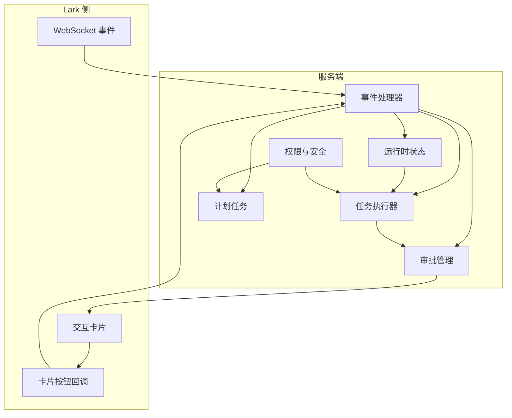
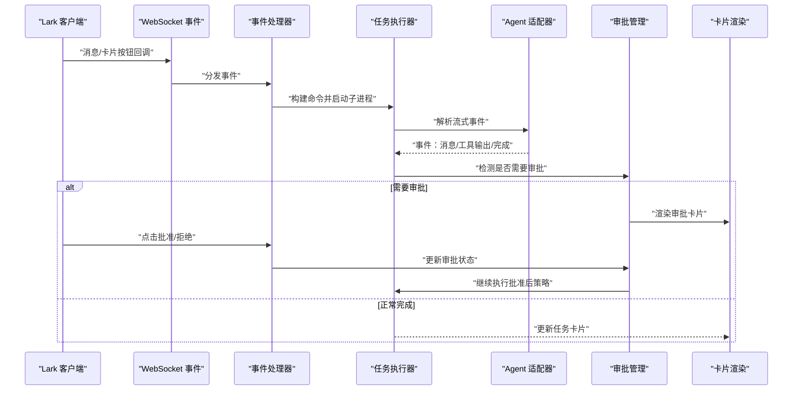
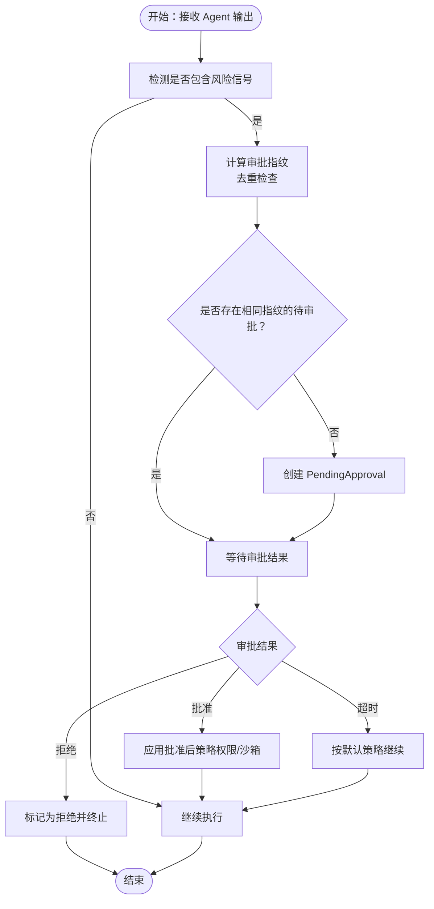
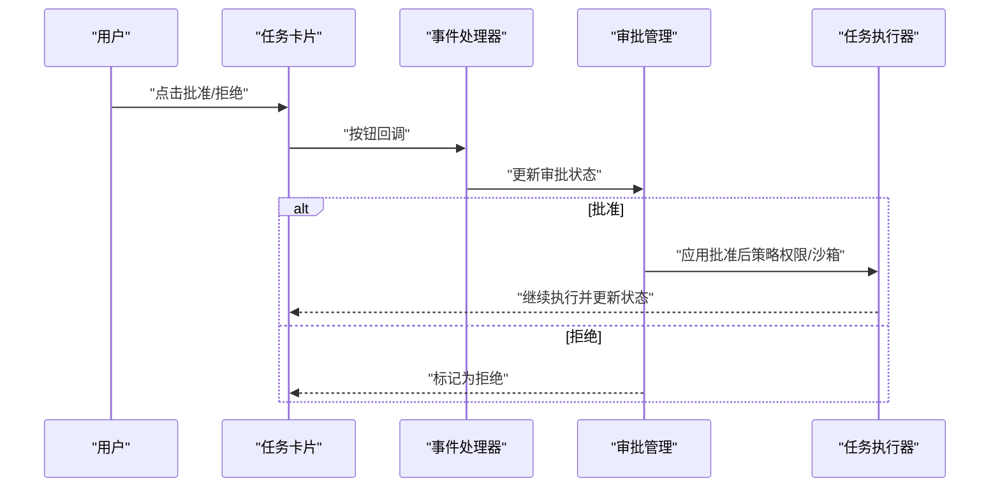
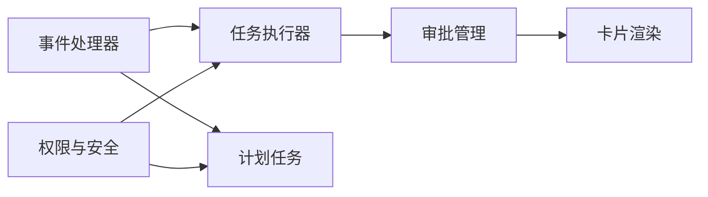

# 审批和安全

<cite>
**本文引用的文件**
- [README.md](file://README.md)
- [tide_ws.py](file://tide_ws.py)
</cite>

## 目录
1. [简介](#简介)
2. [项目结构](#项目结构)
3. [核心组件](#核心组件)
4. [架构总览](#架构总览)
5. [详细组件分析](#详细组件分析)
6. [依赖关系分析](#依赖关系分析)
7. [性能考量](#性能考量)
8. [故障排查指南](#故障排查指南)
9. [结论](#结论)
10. [附录](#附录)

## 简介
本文件聚焦 Tide 的“审批与安全”机制，系统阐述以下内容：
- 审批触发机制：风险检测算法、审批条件判断、自动触发流程
- 权限控制策略：用户权限验证、操作权限检查、安全策略配置
- 安全最佳实践：输入验证、命令注入防护、文件访问控制、沙箱机制
- Lark 卡片审批与 Agent CLI 审批的集成：流程设计、状态同步、权限提升
- 审批策略管理：策略配置、权限模式选择、重试机制
- 审计与日志：操作记录、异常监控、合规性检查

## 项目结构
Tide 的审批与安全相关逻辑主要集中在主程序文件中，围绕以下关键模块组织：
- 事件与卡片交互：WebSocket 事件分发、卡片渲染与按钮回调
- 任务执行与流式输出：Agent CLI 调用、流式事件解析、任务状态更新
- 审批管理：审批指纹、待审批集合、审批等待与轮询、审批结果处理
- 权限与安全：聊天与用户白名单、目录访问控制、环境变量安全配置
- 计划任务（Plan）：多子任务隔离、审批与提交流程、Git 工作树隔离

图表来源
- [tide_ws.py:1642-1652](file://tide_ws.py#L1642-L1652)
- [tide_ws.py:3897-4026](file://tide_ws.py#L3897-L4026)
- [tide_ws.py:5353-5424](file://tide_ws.py#L5353-L5424)
- [tide_ws.py:4405-4505](file://tide_ws.py#L4405-L4505)

章节来源
- [README.md:1-517](file://README.md#L1-L517)
- [tide_ws.py:1-200](file://tide_ws.py#L1-L200)

## 核心组件
- 审批数据结构与指纹
  - PendingApproval：待审批项实体，包含 chat_id、task_id、agent_id、cwd、命令摘要、原因、指纹等
  - approval_fingerprint：基于聊天、任务、会话、目录与命令摘要的哈希指纹，用于去重与幂等
- 审批管理
  - maybe_create_pending_approval：检测输出是否需要人工审批，必要时创建 PendingApproval
  - wait_for_pending_approval：等待审批结果（批准/拒绝/超时）
  - expire_pending_approvals：超时或取消时将状态置为 expired
- 权限与安全
  - is_authorized_lark_event：统一校验聊天与发送者是否在白名单内
  - is_allowed_cwd：限制执行目录在允许根路径集合内
  - default_permission_mode / approved_permission_mode：不同 Agent 的默认与批准后权限模式
- 计划任务（Plan）与审批
  - prepare_plan_worktree：为子任务创建 Git worktree 隔离
  - finalize_plan_task_review：子任务完成后进行测试、差异汇总、提交审批状态判定

章节来源
- [tide_ws.py:312-328](file://tide_ws.py#L312-L328)
- [tide_ws.py:3297-3314](file://tide_ws.py#L3297-L3314)
- [tide_ws.py:5353-5378](file://tide_ws.py#L5353-L5378)
- [tide_ws.py:3346-3365](file://tide_ws.py#L3346-L3365)
- [tide_ws.py:1257-1271](file://tide_ws.py#L1257-L1271)
- [tide_ws.py:2095-2096](file://tide_ws.py#L2095-L2096)
- [tide_ws.py:590-612](file://tide_ws.py#L590-L612)
- [tide_ws.py:3046-3075](file://tide_ws.py#L3046-L3075)
- [tide_ws.py:3132-3166](file://tide_ws.py#L3132-L3166)

## 架构总览
审批与安全贯穿“事件接收 → 任务执行 → 流式输出 → 审批决策 → 结果处理”的闭环。

图表来源
- [tide_ws.py:1642-1652](file://tide_ws.py#L1642-L1652)
- [tide_ws.py:5012-5034](file://tide_ws.py#L5012-L5034)
- [tide_ws.py:5207-5254](file://tide_ws.py#L5207-L5254)
- [tide_ws.py:5353-5424](file://tide_ws.py#L5353-L5424)
- [tide_ws.py:3897-4026](file://tide_ws.py#L3897-L4026)

## 详细组件分析

### 审批触发机制与风险检测
- 风险信号识别
  - 内部错误与策略拒绝：如“blocked by policy”、“rejected(...)”、“operation not permitted”等
  - 权限模式与自动拒绝：如“permission mode”、“dont_ask”、“auto-denied”等
  - Git 锁与写入受限：如“.git/index.lock”
  - Qoder 特定拒绝信号：如“dont ask”、“auto-denied”、“permission resolved”
- 审批条件判断
  - should_create_approval：综合上述信号判定是否需要人工审批
  - is_internal_codex_error：区分内部错误与外部策略拒绝
  - qoder_permission_denial_output：针对 Qoder 的权限拒绝场景
- 自动触发流程
  - maybe_create_pending_approval：若检测到需要审批且无重复，则创建 PendingApproval
  - approval_fingerprint：去重与幂等，避免重复推送
  - wait_for_pending_approval：轮询等待审批结果，超时按默认策略继续

图表来源
- [tide_ws.py:5277-5311](file://tide_ws.py#L5277-L5311)
- [tide_ws.py:5314-5335](file://tide_ws.py#L5314-L5335)
- [tide_ws.py:5353-5378](file://tide_ws.py#L5353-L5378)
- [tide_ws.py:3297-3314](file://tide_ws.py#L3297-L3314)
- [tide_ws.py:3346-3365](file://tide_ws.py#L3346-L3365)

章节来源
- [tide_ws.py:5277-5335](file://tide_ws.py#L5277-L5335)
- [tide_ws.py:5353-5424](file://tide_ws.py#L5353-L5424)
- [tide_ws.py:3297-3314](file://tide_ws.py#L3297-L3314)
- [tide_ws.py:3346-3365](file://tide_ws.py#L3346-L3365)

### 权限控制策略
- 用户与聊天授权
  - is_authorized_lark_event：统一校验聊天 ID 与发送者 open_id 是否在白名单内；支持管理员权限提升
  - LARK_ALLOWED_CHAT_IDS/LARK_ALLOWED_OPEN_IDS/LARK_ADMIN_OPEN_IDS：通过环境变量配置
- 目录访问控制
  - is_allowed_cwd：限制执行目录必须在允许根路径集合内（支持多路径）
  - CODEX_ALLOWED_ROOTS：可配置多个根路径，未配置时默认使用项目根与默认工作目录
- Agent 权限模式
  - default_permission_mode / approved_permission_mode：根据 Agent 类型与环境变量决定默认与批准后的权限模式
  - Qoder 权限模式别名与校验：对不合法值进行规范化与报错
- 管理员操作
  - sender_is_admin：在未显式配置管理员时，回退到允许用户；否则要求 open_id 在管理员集合内

章节来源
- [tide_ws.py:1229-1271](file://tide_ws.py#L1229-L1271)
- [tide_ws.py:2095-2096](file://tide_ws.py#L2095-L2096)
- [tide_ws.py:2074-2086](file://tide_ws.py#L2074-L2086)
- [tide_ws.py:590-612](file://tide_ws.py#L590-L612)
- [tide_ws.py:557-569](file://tide_ws.py#L557-L569)

### 安全最佳实践
- 输入与命令注入防护
  - Qoder/Claude 额外参数解析：使用安全的 shell 解析规则，过滤不安全参数
  - 计划任务测试命令：支持 shell 与非 shell 执行，超时保护
- 文件与附件安全
  - 附件下载：限制单附件大小、生成唯一本地路径、记录引用与去重
  - 附件提示：在 Prompt 中明确本地路径，避免跨目录越权
- 沙箱与执行隔离
  - 计划任务：Git worktree 隔离，失败时避免回退到同一目录并行修改
  - 目录限制：仅允许在允许根路径内执行，防止越权访问
- 日志与审计
  - 日志级别与内容：可配置是否记录消息内容；任务启动与失败记录详细信息
  - 审批与重启：审批卡片与重启确认卡片均记录关键字段，便于审计

章节来源
- [tide_ws.py:788-794](file://tide_ws.py#L788-L794)
- [tide_ws.py:719-725](file://tide_ws.py#L719-L725)
- [tide_ws.py:120-125](file://tide_ws.py#L120-L125)
- [tide_ws.py:1449-1539](file://tide_ws.py#L1449-L1539)
- [tide_ws.py:3046-3075](file://tide_ws.py#L3046-L3075)
- [tide_ws.py:166-170](file://tide_ws.py#L166-L170)

### Lark 卡片审批与 Agent CLI 审批的集成
- 卡片渲染
  - 任务卡片：包含状态、Agent、目录、模型、耗时、指令、附件、Session、排队状态、引导模式、审批按钮等
  - 计划卡片：包含状态、并发、进度、合并状态、子任务详情与操作按钮
- 审批流程设计
  - 审批按钮：批准/拒绝，支持超时自动继续
  - 审批结果：更新任务状态与输出，必要时应用批准后策略
- 状态同步
  - 任务与计划卡片定期刷新，保证 Lark 侧与服务端状态一致
  - 重启确认卡片：支持确认重启与取消，避免误操作

图表来源
- [tide_ws.py:3993-4004](file://tide_ws.py#L3993-L4004)
- [tide_ws.py:5414-5424](file://tide_ws.py#L5414-L5424)
- [tide_ws.py:3897-4026](file://tide_ws.py#L3897-L4026)

章节来源
- [tide_ws.py:3897-4026](file://tide_ws.py#L3897-L4026)
- [tide_ws.py:4405-4505](file://tide_ws.py#L4405-L4505)
- [tide_ws.py:3553-3591](file://tide_ws.py#L3553-L3591)

### 审批策略管理
- 策略配置
  - 普通任务：CODEX_APPROVAL_POLICY、CODEX_SANDBOX_MODE
  - 批准后重试：APPROVED_CODEX_APPROVAL_POLICY、APPROVED_CODEX_SANDBOX_MODE
  - Claude/Qoder：CLAUDE_PERMISSION_MODE/APPROVED_CLAUDE_PERMISSION_MODE、QODER_PERMISSION_MODE/APPROVED_QODER_PERMISSION_MODE
- 权限模式选择
  - default_permission_mode：根据 Agent 与环境变量选择默认模式
  - approved_permission_mode：批准后采用更宽松或特定模式（Qoder 对 auto 模式做兼容处理）
- 重试机制
  - approve_retry_text：向用户说明批准后单次重试的策略
  - approved_retry 标记：避免重复重试

章节来源
- [tide_ws.py:95-98](file://tide_ws.py#L95-L98)
- [tide_ws.py:590-612](file://tide_ws.py#L590-L612)
- [tide_ws.py:615-624](file://tide_ws.py#L615-L624)
- [tide_ws.py:255-268](file://tide_ws.py#L255-L268)

### 自定义审批规则示例（代码路径）
- 风险信号扩展
  - 在 should_create_approval 中添加新的信号关键字
  - 示例路径：[tide_ws.py:5277-5311](file://tide_ws.py#L5277-L5311)
- 权限模式扩展
  - 在 default_permission_mode / approved_permission_mode 中增加 Agent 分支
  - 示例路径：[tide_ws.py:590-612](file://tide_ws.py#L590-L612)
- 审批指纹与去重
  - 修改 approval_fingerprint 的参与字段以增强去重能力
  - 示例路径：[tide_ws.py:3297-3314](file://tide_ws.py#L3297-L3314)
- 批准后策略
  - 在批准回调中设置 runtime.next_approval_policy 与 runtime.next_sandbox_mode
  - 示例路径：[tide_ws.py:5414-5424](file://tide_ws.py#L5414-L5424)

章节来源
- [tide_ws.py:5277-5311](file://tide_ws.py#L5277-L5311)
- [tide_ws.py:590-612](file://tide_ws.py#L590-L612)
- [tide_ws.py:3297-3314](file://tide_ws.py#L3297-L3314)
- [tide_ws.py:5414-5424](file://tide_ws.py#L5414-L5424)

### 安全审计与日志记录
- 操作记录
  - 任务启动/完成/失败、计划任务状态变更、审批状态变更、重启确认等均有日志记录
- 异常监控
  - 附件下载异常、卡片更新失败、子进程启动失败、超时等均记录异常堆栈
- 合规性检查
  - 日志级别与内容可配置；附件与消息内容可选择是否记录，避免敏感信息泄露

章节来源
- [tide_ws.py:166-170](file://tide_ws.py#L166-L170)
- [tide_ws.py:1449-1539](file://tide_ws.py#L1449-L1539)
- [tide_ws.py:3687-3702](file://tide_ws.py#L3687-L3702)

## 依赖关系分析
- 事件与卡片
  - 事件处理器注册消息与卡片按钮回调
  - 任务与计划卡片通过 send_card/update_card 更新状态
- 审批与任务
  - 任务执行器在流式输出中检测审批信号，审批管理器负责状态维护与策略应用
- 权限与策略
  - 权限控制贯穿聊天、用户、目录与 Agent 权限模式
  - 策略通过环境变量与运行时配置动态生效

图表来源
- [tide_ws.py:1642-1652](file://tide_ws.py#L1642-L1652)
- [tide_ws.py:3897-4026](file://tide_ws.py#L3897-L4026)
- [tide_ws.py:4405-4505](file://tide_ws.py#L4405-L4505)
- [tide_ws.py:5353-5424](file://tide_ws.py#L5353-L5424)

章节来源
- [tide_ws.py:1642-1652](file://tide_ws.py#L1642-L1652)
- [tide_ws.py:3897-4026](file://tide_ws.py#L3897-L4026)
- [tide_ws.py:4405-4505](file://tide_ws.py#L4405-L4505)
- [tide_ws.py:5353-5424](file://tide_ws.py#L5353-L5424)

## 性能考量
- 事件与卡片更新频率
  - 任务卡片与计划卡片存在最小更新间隔限制，避免频繁更新导致 Lark 限流
- 附件处理
  - 限制单附件大小与最大附件数量，减少 IO 压力
- 计划任务隔离
  - Git worktree 隔离避免锁竞争与目录冲突，提高并发效率

## 故障排查指南
- 审批批准后未继续执行
  - 检查批准后策略配置是否正确（APPROVED_* 环境变量）
  - 章节来源：[README.md:483-494](file://README.md#L483-L494)
- Git 提交失败
  - 检查沙箱权限与 Git 状态；批准后会以更高权限重试
  - 章节来源：[README.md:495-504](file://README.md#L495-L504)
- 附件下载失败
  - 检查附件大小限制与下载异常日志
  - 章节来源：[tide_ws.py:1449-1539](file://tide_ws.py#L1449-L1539)
- 卡片按钮不可用
  - 若提示 200340，说明卡片按钮回调未投递至长连接，可改用指令操作
  - 章节来源：[tide_ws.py:4817](file://tide_ws.py#L4817)

## 结论
Tide 的审批与安全机制通过“风险信号检测 + 审批指纹去重 + 权限模式与沙箱策略 + 卡片状态同步”的闭环，实现了对高风险操作的安全管控。配合严格的目录访问控制、参数解析过滤与日志审计，整体具备良好的安全性与可观测性。建议在生产环境中：
- 明确审批策略与权限模式，结合业务场景选择合适的 APPROVED_* 配置
- 严格限制允许根路径与管理员白名单
- 启用必要的日志级别与审计字段，定期审查审批与失败记录

## 附录
- 环境变量与安全配置参考
  - 审批等待与轮询：PENDING_APPROVAL_WAIT_SECONDS、PENDING_APPROVAL_POLL_SECONDS
  - 计划任务测试命令：PLAN_TEST_COMMAND、PLAN_TEST_COMMAND_SHELL、PLAN_TEST_TIMEOUT_SECONDS
  - 访问控制：LARK_ALLOWED_CHAT_IDS、LARK_ALLOWED_OPEN_IDS、LARK_ADMIN_OPEN_IDS、LARK_REQUIRE_KNOWN_CHAT
  - 目录与沙箱：CODEX_ALLOWED_ROOTS、CODEX_APPROVAL_POLICY、CODEX_SANDBOX_MODE、APPROVED_CODEX_APPROVAL_POLICY、APPROVED_CODEX_SANDBOX_MODE
  - Claude/Qoder 权限模式：CLAUDE_PERMISSION_MODE、APPROVED_CLAUDE_PERMISSION_MODE、QODER_PERMISSION_MODE、APPROVED_QODER_PERMISSION_MODE
  - 章节来源：[README.md:406-427](file://README.md#L406-L427)