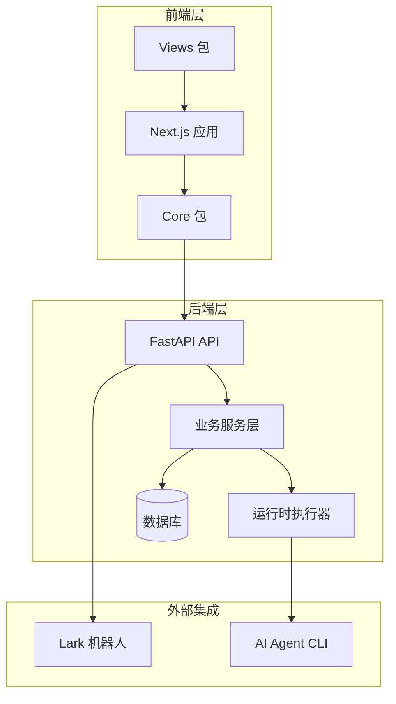
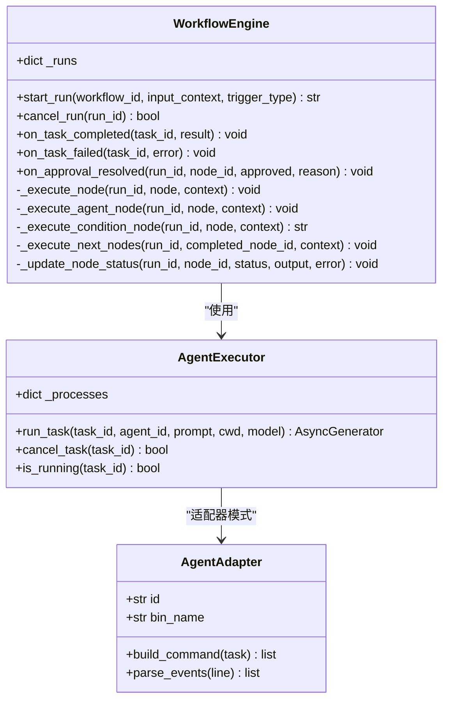
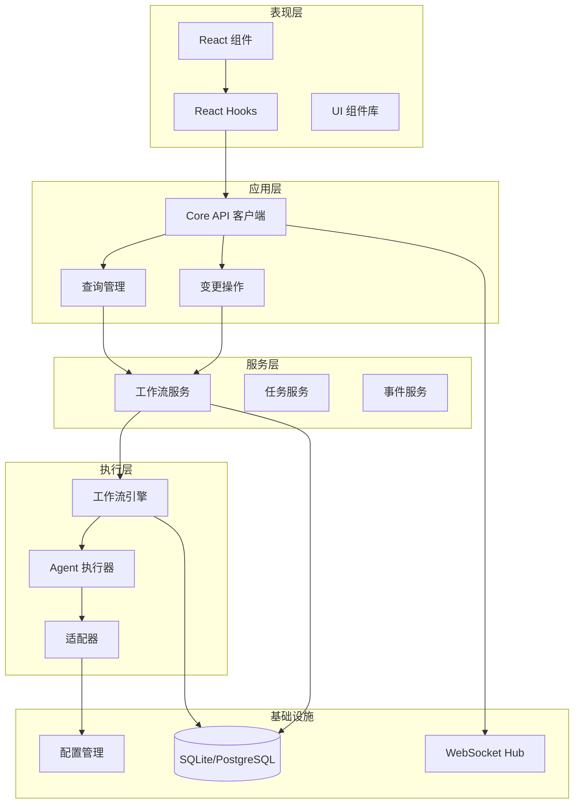
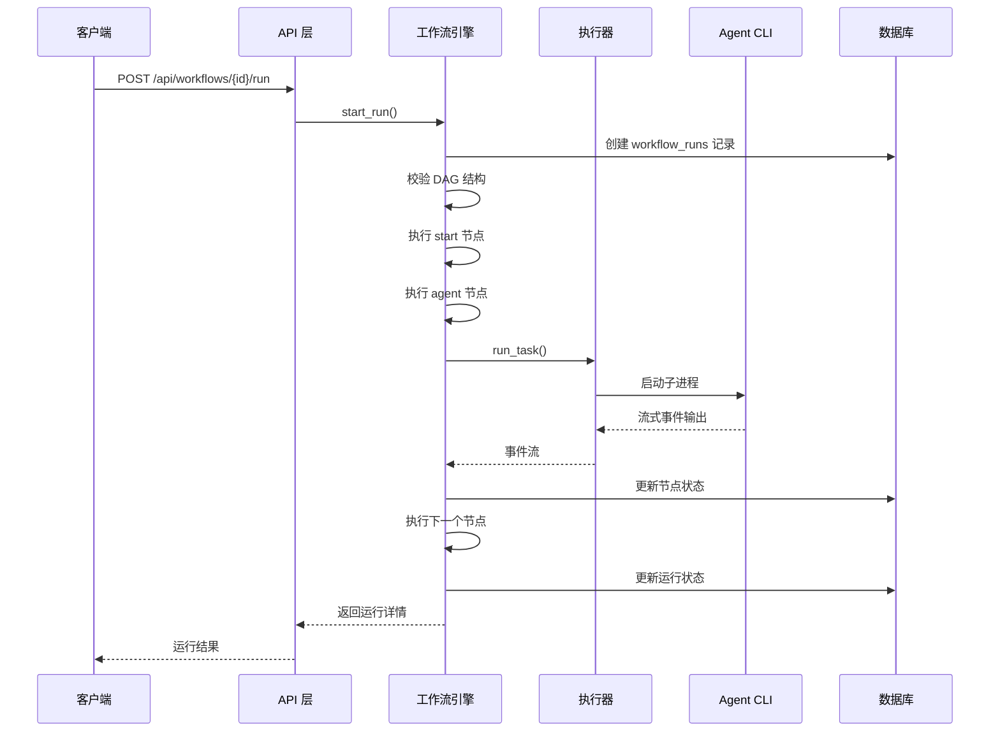
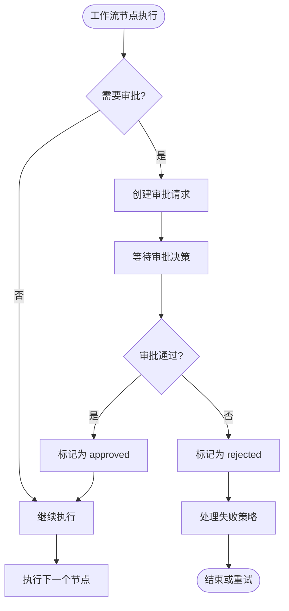
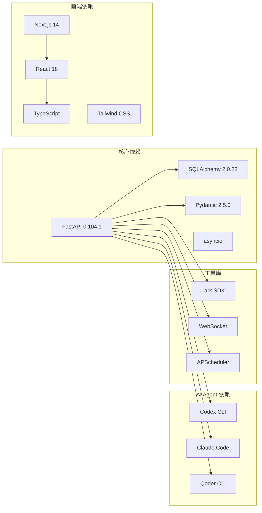

# 工作流编排系统

<cite>
**本文档引用的文件**
- [backend/main.py](file://backend/main.py)
- [backend/services/workflow_engine.py](file://backend/services/workflow_engine.py)
- [backend/services/workflow_service.py](file://backend/services/workflow_service.py)
- [backend/api/workflows.py](file://backend/api/workflows.py)
- [backend/runtime/executor.py](file://backend/runtime/executor.py)
- [backend/runtime/adapters.py](file://backend/runtime/adapters.py)
- [backend/models/schemas.py](file://backend/models/schemas.py)
- [backend/db/init.sql](file://backend/db/init.sql)
- [apps/web/app/workflows/page.tsx](file://apps/web/app/workflows/page.tsx)
- [apps/web/app/workflows/[id]/page.tsx](file://apps/web/app/workflows/[id]/page.tsx)
- [apps/web/app/workflows/[id]/runs/[rid]/page.tsx](file://apps/web/app/workflows/[id]/runs/[rid]/page.tsx)
- [packages/core/src/index.ts](file://packages/core/src/index.ts)
- [packages/views/src/index.ts](file://packages/views/src/index.ts)
</cite>

## 目录
1. [简介](#简介)
2. [项目结构](#项目结构)
3. [核心组件](#核心组件)
4. [架构概览](#架构概览)
5. [详细组件分析](#详细组件分析)
6. [依赖关系分析](#依赖关系分析)
7. [性能考虑](#性能考虑)
8. [故障排除指南](#故障排除指南)
9. [结论](#结论)

## 简介

工作流编排系统是一个基于 FastAPI 和 Next.js 构建的可视化工作流管理系统，支持多 Agent 协作的有向无环图(DAG)工作流编排。系统允许用户通过图形界面设计复杂的工作流程，集成多种 AI Agent 执行器，并提供完整的运行监控和审批机制。

该系统的核心特性包括：
- 可视化工作流设计器
- 多 Agent 执行支持（Codex、Claude、Qoder）
- 实时运行监控和状态跟踪
- 审批流程集成
- 任务队列和并发控制
- 数据持久化和历史记录

## 项目结构

系统采用前后端分离的架构设计，主要分为以下几个层次：

**图表来源**
- [backend/main.py:74-98](file://backend/main.py#L74-L98)
- [apps/web/app/workflows/page.tsx:1-73](file://apps/web/app/workflows/page.tsx#L1-L73)

**章节来源**
- [backend/main.py:1-104](file://backend/main.py#L1-L104)
- [packages/core/src/index.ts:1-268](file://packages/core/src/index.ts#L1-L268)
- [packages/views/src/index.ts:1-58](file://packages/views/src/index.ts#L1-L58)

## 核心组件

### 工作流引擎 (WorkflowEngine)

工作流引擎是系统的核心执行组件，负责处理 DAG 工作流的生命周期管理：

**图表来源**
- [backend/services/workflow_engine.py:56-800](file://backend/services/workflow_engine.py#L56-L800)
- [backend/runtime/executor.py:30-216](file://backend/runtime/executor.py#L30-L216)
- [backend/runtime/adapters.py:502-734](file://backend/runtime/adapters.py#L502-L734)

### API 层

系统提供 RESTful API 接口，支持工作流的完整生命周期管理：

| 端点 | 方法 | 描述 |
|------|------|------|
| `/api/workflows` | GET | 获取工作流列表 |
| `/api/workflows` | POST | 创建新工作流 |
| `/api/workflows/{id}` | GET/PUT/DELETE | 获取、更新、删除工作流 |
| `/api/workflows/{id}/run` | POST | 触发工作流运行 |
| `/api/workflows/{id}/runs` | GET | 获取运行历史 |
| `/api/workflows/{id}/runs/{run_id}` | GET | 获取运行详情 |
| `/api/workflows/{id}/runs/{run_id}/cancel` | POST | 取消运行 |
| `/api/workflows/{id}/runs/{run_id}/nodes/{node_id}/approve` | POST | 审批节点 |
| `/api/workflows/{id}/runs/{run_id}/nodes/{node_id}/reject` | POST | 拒绝节点 |

**章节来源**
- [backend/api/workflows.py:1-161](file://backend/api/workflows.py#L1-L161)
- [backend/models/schemas.py:210-268](file://backend/models/schemas.py#L210-L268)

## 架构概览

系统采用分层架构设计，确保关注点分离和可维护性：

**图表来源**
- [backend/main.py:38-72](file://backend/main.py#L38-L72)
- [backend/services/workflow_engine.py:56-800](file://backend/services/workflow_engine.py#L56-L800)
- [backend/runtime/executor.py:30-216](file://backend/runtime/executor.py#L30-L216)

## 详细组件分析

### 工作流节点类型

系统支持多种节点类型的可视化工作流设计：

| 节点类型 | 功能描述 | 配置参数 |
|----------|----------|----------|
| start | 开始节点 | 无 |
| end | 结束节点 | 无 |
| agent | Agent 执行节点 | agentId, model, promptTemplate, cwd |
| approval | 人工审批节点 | label, approvers |
| condition | 条件分支节点 | conditions, defaultEdge |
| parallel | 并行网关 | 无 |
| parallel_join | 并行汇聚 | 无 |
| delay | 延时节点 | seconds |

### 工作流执行流程

**图表来源**
- [backend/api/workflows.py:81-95](file://backend/api/workflows.py#L81-L95)
- [backend/services/workflow_engine.py:64-163](file://backend/services/workflow_engine.py#L64-L163)
- [backend/runtime/executor.py:36-173](file://backend/runtime/executor.py#L36-L173)

### 审批流程处理

系统集成了完整的审批流程，支持人工审批决策：

**图表来源**
- [backend/services/workflow_engine.py:243-252](file://backend/services/workflow_engine.py#L243-L252)
- [backend/api/workflows.py:123-160](file://backend/api/workflows.py#L123-L160)

**章节来源**
- [backend/services/workflow_engine.py:1-800](file://backend/services/workflow_engine.py#L1-L800)
- [backend/runtime/executor.py:1-216](file://backend/runtime/executor.py#L1-L216)
- [backend/runtime/adapters.py:1-734](file://backend/runtime/adapters.py#L1-L734)

## 依赖关系分析

系统的关键依赖关系如下：

**图表来源**
- [backend/main.py:1-104](file://backend/main.py#L1-L104)
- [backend/runtime/adapters.py:17-41](file://backend/runtime/adapters.py#L17-L41)

**章节来源**
- [backend/db/init.sql:1-209](file://backend/db/init.sql#L1-L209)
- [backend/models/schemas.py:1-291](file://backend/models/schemas.py#L1-L291)

## 性能考虑

### 并发控制
- 使用 asyncio 实现非阻塞 I/O 操作
- 限制同时运行的 Agent 任务数量
- 实现任务队列和优先级调度

### 数据库优化
- 为常用查询字段建立索引
- 使用连接池管理数据库连接
- 实现分页查询避免大数据集加载

### 缓存策略
- 缓存活跃的工作流运行状态
- 实现前端查询缓存
- 使用 WebSocket 实现实时状态更新

## 故障排除指南

### 常见问题及解决方案

**Agent CLI 未找到**
- 检查环境变量 PATH 中是否包含 Agent CLI 可执行文件
- 验证 Agent 配置是否正确
- 确认 Agent CLI 版本兼容性

**工作流 DAG 校验失败**
- 确保工作流包含起始节点和结束节点
- 检查节点连接关系，避免循环依赖
- 验证条件节点的条件表达式语法

**审批流程异常**
- 检查审批人配置是否正确
- 验证审批策略设置
- 确认审批通知渠道正常

**数据库连接问题**
- 检查数据库配置和连接字符串
- 验证数据库服务状态
- 查看数据库权限设置

**章节来源**
- [backend/runtime/executor.py:177-187](file://backend/runtime/executor.py#L177-L187)
- [backend/services/workflow_engine.py:750-797](file://backend/services/workflow_engine.py#L750-L797)

## 结论

工作流编排系统提供了一个功能完整、可扩展的工作流管理平台。通过模块化的架构设计和清晰的关注点分离，系统能够有效支持复杂的多 Agent 协作场景。

系统的主要优势包括：
- 可视化的工作流设计界面
- 灵活的节点类型和执行策略
- 完整的运行监控和审计功能
- 可扩展的 Agent 执行框架
- 实时的状态更新和通知机制

未来可以考虑的功能增强包括：
- 更丰富的节点类型和自定义节点
- 工作流模板和复用机制
- 更细粒度的权限控制
- 集成更多的外部服务和工具
- 增强的监控和告警功能