# 核心功能详解

<cite>
**本文档引用的文件**
- [lark2agent_ws.py](file://lark2agent_ws.py)
- [README.md](file://README.md)
- [ppt_outline_deck.html](file://ppt_outline_deck.html)
</cite>

## 目录
1. [简介](#简介)
2. [项目结构](#项目结构)
3. [核心组件](#核心组件)
4. [架构概览](#架构概览)
5. [详细组件分析](#详细组件分析)
6. [依赖关系分析](#依赖关系分析)
7. [性能考虑](#性能考虑)
8. [故障排除指南](#故障排除指南)
9. [结论](#结论)
10. [附录](#附录)

## 简介

Lark2Agent 是一个轻量级的多代理桥接系统，将飞书/Lark 群聊消息与多种 AI Agent CLI 工具（Codex、Claude Code、Qoder CLI）无缝连接。该系统通过 WebSocket 实时接收 Lark 事件，解析用户指令，管理任务执行流程，并通过交互式卡片实时反馈执行状态。

## 项目结构

项目采用单一 Python 文件的紧凑设计，包含完整的 WebSocket 服务器、消息处理、任务管理、卡片系统等功能模块：

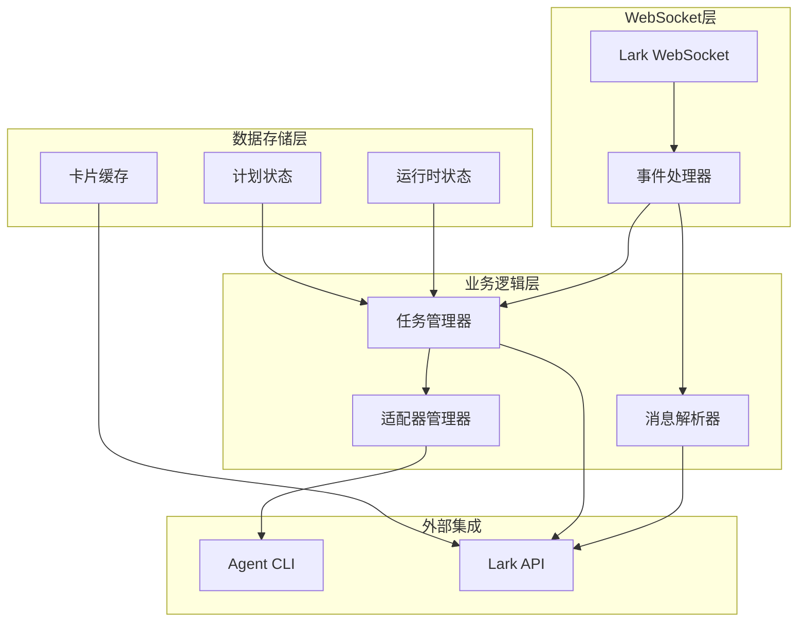

**图表来源**
- [lark2agent_ws.py:1642-1652](file://lark2agent_ws.py#L1642-L1652)
- [lark2agent_ws.py:3423-3480](file://lark2agent_ws.py#L3423-L3480)

**章节来源**
- [lark2agent_ws.py:1-150](file://lark2agent_ws.py#L1-L150)
- [README.md:1-50](file://README.md#L1-L50)

## 核心组件

### WebSocket 事件处理机制

系统通过 Lark SDK 的事件订阅机制建立 WebSocket 连接，实时处理消息事件、卡片按钮回调和消息已读事件：

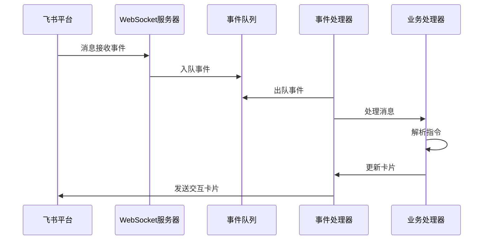

**图表来源**
- [lark2agent_ws.py:8515-8528](file://lark2agent_ws.py#L8515-L8528)
- [lark2agent_ws.py:1642-1652](file://lark2agent_ws.py#L1642-L1652)

### 消息解析和指令识别

系统实现了多层次的消息解析机制，支持自然语言指令、模型选择、代理切换等多种功能：

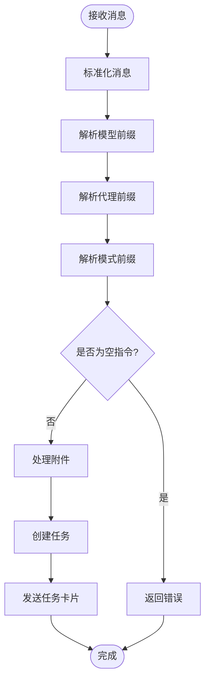

**图表来源**
- [lark2agent_ws.py:7684-7718](file://lark2agent_ws.py#L7684-L7718)
- [lark2agent_ws.py:2968-3015](file://lark2agent_ws.py#L2968-L3015)

### 卡片系统和 UI 交互

系统提供丰富的交互式卡片，支持实时状态更新、审批操作、任务控制等功能：

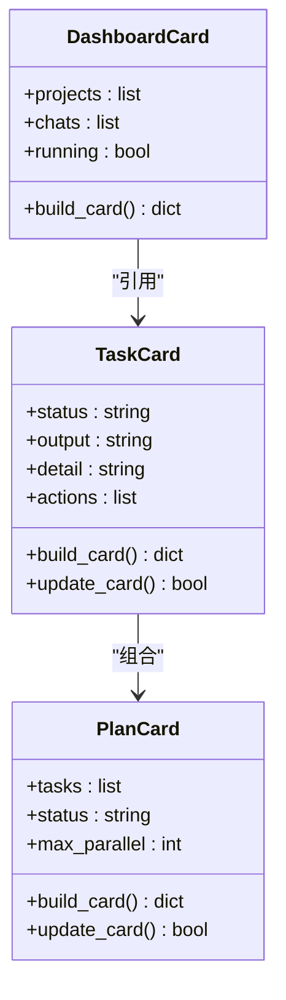

**图表来源**
- [lark2agent_ws.py:3897-4026](file://lark2agent_ws.py#L3897-L4026)
- [lark2agent_ws.py:4405-4505](file://lark2agent_ws.py#L4405-L4505)
- [lark2agent_ws.py:4704-4805](file://lark2agent_ws.py#L4704-L4805)

**章节来源**
- [lark2agent_ws.py:3423-4026](file://lark2agent_ws.py#L3423-L4026)

## 架构概览

系统采用分层架构设计，各层职责清晰分离：

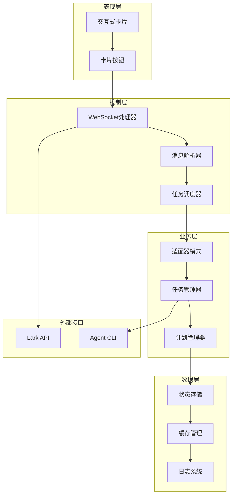

**图表来源**
- [lark2agent_ws.py:626-853](file://lark2agent_ws.py#L626-L853)
- [lark2agent_ws.py:387-406](file://lark2agent_ws.py#L387-L406)

## 详细组件分析

### Agent CLI 集成与适配器模式

系统采用适配器模式统一管理不同 Agent CLI 的差异：

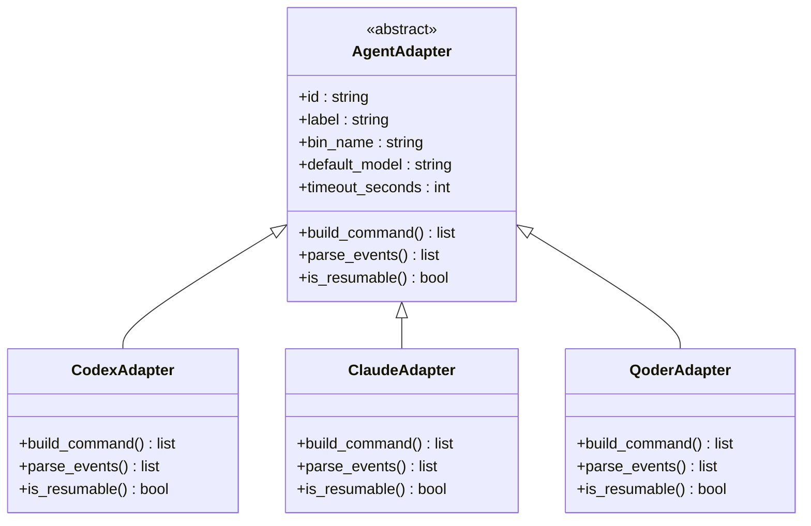

**图表来源**
- [lark2agent_ws.py:626-853](file://lark2agent_ws.py#L626-L853)

#### 适配器配置选项

每个 Agent 适配器都支持丰富的配置选项：

| 配置项 | Codex | Claude | Qoder |
|--------|-------|--------|-------|
| 默认模型 | CODEX_MODEL | CLAUDE_MODEL | QODER_MODEL |
| 超时时间 | CODEX_TIMEOUT_SECONDS | CLAUDE_TIMEOUT_SECONDS | QODER_TIMEOUT_SECONDS |
| 审批策略 | CODEX_APPROVAL_POLICY | - | - |
| Sandbox 模式 | CODEX_SANDBOX_MODE | - | - |
| 权限模式 | - | CLAUDE_PERMISSION_MODE | QODER_PERMISSION_MODE |

**章节来源**
- [lark2agent_ws.py:648-802](file://lark2agent_ws.py#L648-L802)

### 任务管理系统

系统实现了完整的任务生命周期管理，支持普通任务和 Plan 并行任务两种模式：

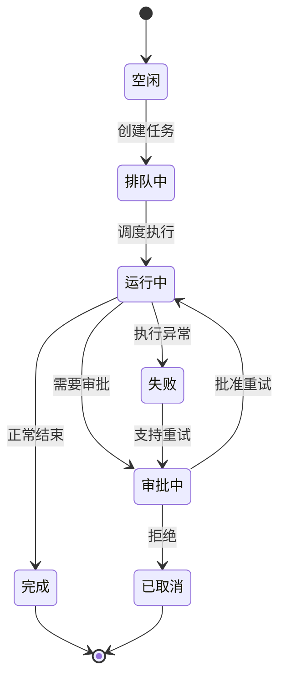

**图表来源**
- [lark2agent_ws.py:4342-4348](file://lark2agent_ws.py#L4342-L4348)
- [lark2agent_ws.py:5606-5648](file://lark2agent_ws.py#L5606-L5648)

#### 普通任务执行流程

普通任务的执行流程相对简单直接：

1. **任务创建**：解析用户指令，创建任务对象
2. **适配器选择**：根据任务配置选择合适的 Agent 适配器
3. **命令构建**：生成具体的 CLI 命令参数
4. **进程启动**：异步启动 Agent CLI 子进程
5. **事件监控**：实时解析 Agent 输出的事件流
6. **状态更新**：更新任务卡片和运行状态

#### Plan 并行任务模式

Plan 模式支持将复杂任务分解为多个子任务并行执行：

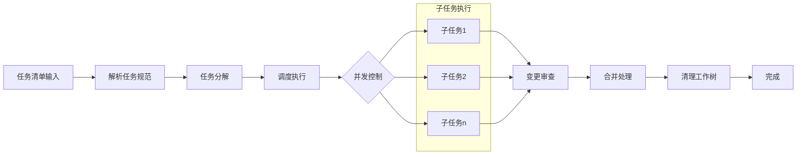

**图表来源**
- [lark2agent_ws.py:4275-4322](file://lark2agent_ws.py#L4275-L4322)
- [lark2agent_ws.py:5606-5648](file://lark2agent_ws.py#L5606-L5648)

**章节来源**
- [lark2agent_ws.py:4325-5688](file://lark2agent_ws.py#L4325-L5688)

### 审批和安全机制

系统实现了完善的审批和安全控制机制：

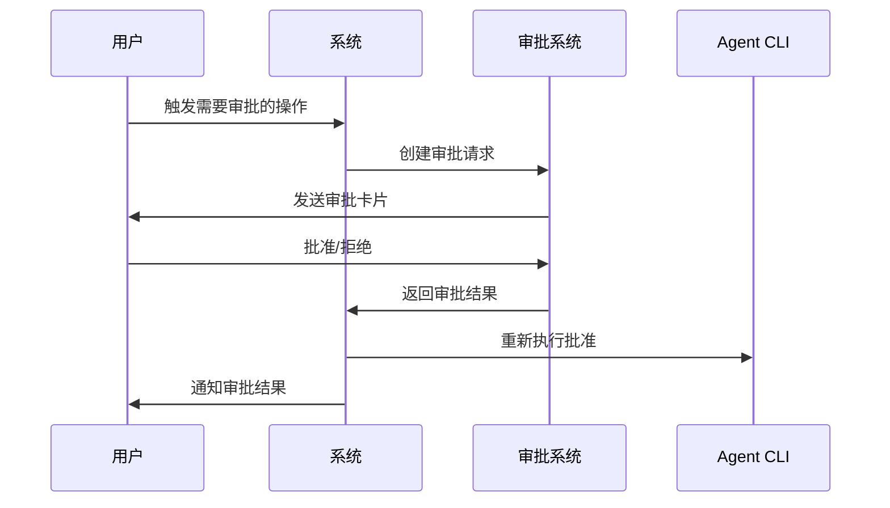

**图表来源**
- [lark2agent_ws.py:3346-3364](file://lark2agent_ws.py#L3346-L3364)
- [lark2agent_ws.py:6759-6824](file://lark2agent_ws.py#L6759-L6824)

#### 审批触发机制

系统会自动检测需要审批的操作场景：

| 触发条件 | 审批类型 | 默认行为 |
|----------|----------|----------|
| 权限不足 | 访问控制 | 需要人工审批 |
| Sandbox 限制 | 执行权限 | 需要人工审批 |
| 文件写入 | 文件操作 | 需要人工审批 |
| 网络访问 | 网络权限 | 需要人工审批 |

#### 权限控制策略

系统支持多层级的权限控制：

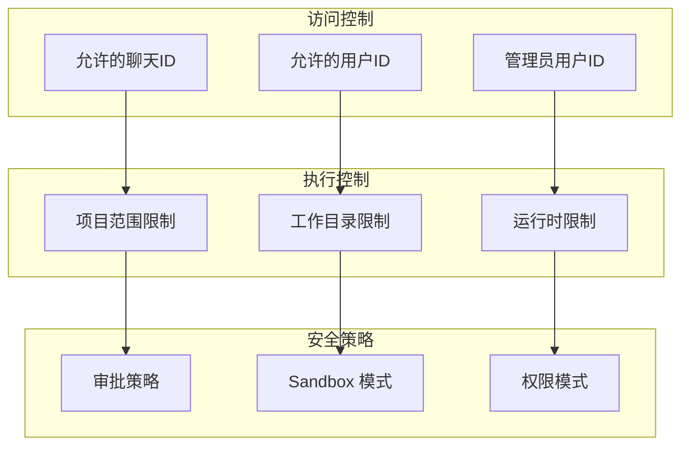

**图表来源**
- [lark2agent_ws.py:1229-1271](file://lark2agent_ws.py#L1229-L1271)
- [lark2agent_ws.py:2074-2096](file://lark2agent_ws.py#L2074-L2096)

**章节来源**
- [lark2agent_ws.py:3277-3364](file://lark2agent_ws.py#L3277-L3364)
- [lark2agent_ws.py:1211-1271](file://lark2agent_ws.py#L1211-L1271)

### 项目和对话管理

系统提供了完整的项目和对话管理功能：

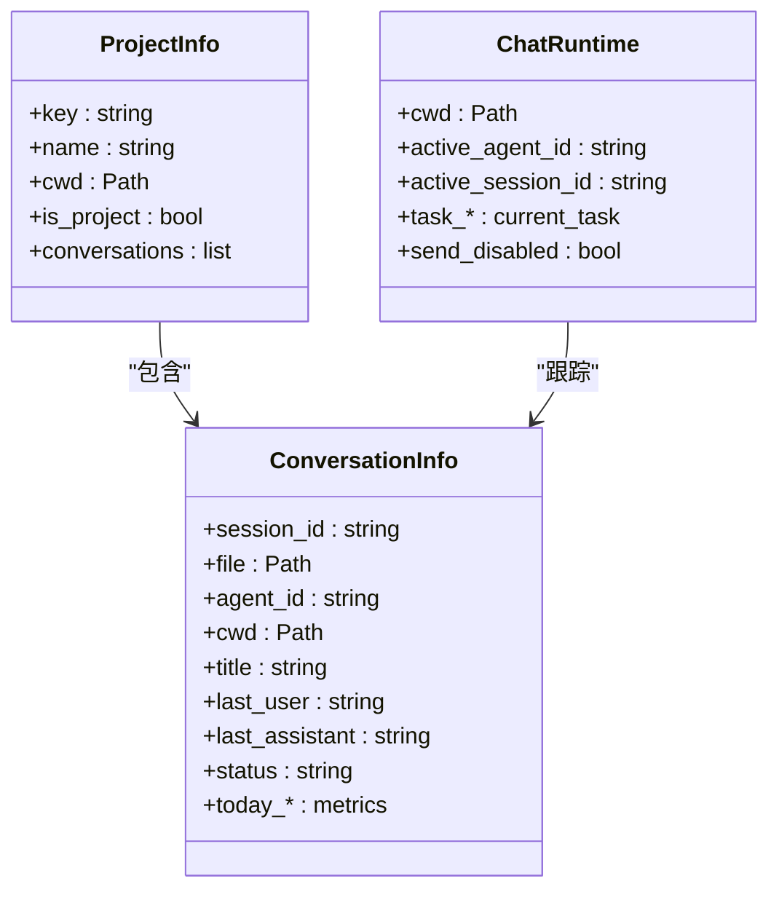

**图表来源**
- [lark2agent_ws.py:173-235](file://lark2agent_ws.py#L173-L235)
- [lark2agent_ws.py:2665-2718](file://lark2agent_ws.py#L2665-L2718)

#### 项目识别和创建

系统通过智能识别算法自动区分项目和普通对话：

| 项目标记 | 识别依据 | 项目特征 |
|----------|----------|----------|
| .git | Git 仓库根目录 | 版本控制项目 |
| package.json | Node.js 项目 | JavaScript/TypeScript 项目 |
| pyproject.toml | Python 项目 | Python 包管理 |
| go.mod | Go 项目 | Go 语言项目 |
| Cargo.toml | Rust 项目 | Rust 语言项目 |
| pom.xml | Java 项目 | Maven 构建 |
| composer.json | PHP 项目 | Composer 包管理 |
| requirements.txt | Python 项目 | pip 包管理 |
| README.md | 文档项目 | 通用文档项目 |

#### 对话和会话管理

系统维护详细的对话历史和状态信息：

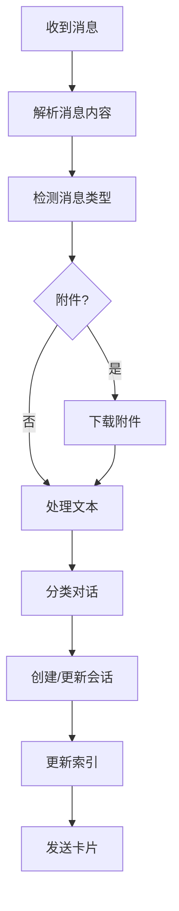

**图表来源**
- [lark2agent_ws.py:1449-1540](file://lark2agent_ws.py#L1449-L1540)
- [lark2agent_ws.py:2665-2718](file://lark2agent_ws.py#L2665-L2718)

**章节来源**
- [lark2agent_ws.py:2000-2266](file://lark2agent_ws.py#L2000-L2266)

## 依赖关系分析

系统的主要依赖关系如下：

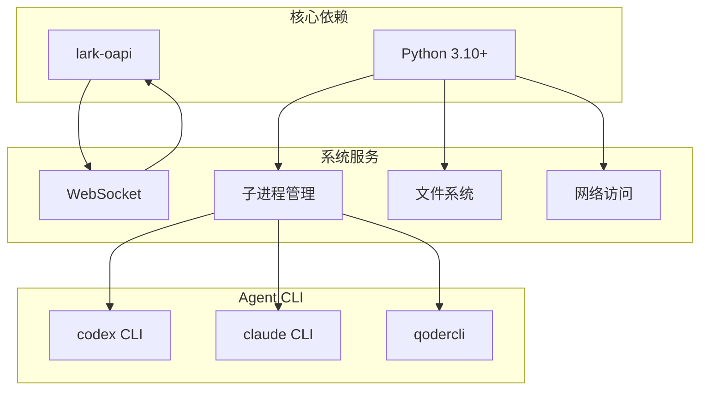

**图表来源**
- [lark2agent_ws.py:21-28](file://lark2agent_ws.py#L21-L28)
- [README.md:17-27](file://README.md#L17-L27)

**章节来源**
- [lark2agent_ws.py:1-50](file://lark2agent_ws.py#L1-L50)
- [README.md:17-73](file://README.md#L17-L73)

## 性能考虑

系统在设计时充分考虑了性能优化：

### 并发控制
- 最大运行任务数：`MAX_RUNNING_TASKS`（默认 6）
- 单聊天最大运行任务数：`MAX_RUNNING_TASKS_PER_CHAT`（默认 4）
- Plan 并发数：`PLAN_MAX_PARALLEL`（默认 3）

### 内存管理
- 事件队列最大积压：`LARK_EVENT_QUEUE_MAXSIZE`（默认 200）
- 会话文件数量限制：`MAX_SESSION_FILES`（默认 300）
- 消息引用缓存：`MAX_LARK_MESSAGE_REFS`（默认 1000）

### 磁盘 I/O 优化
- 附件下载限制：`LARK_ATTACHMENT_MAX_BYTES`（默认 50MB）
- 附件暂存 TTL：`LARK_PENDING_ATTACHMENT_TTL_SECONDS`（默认 900秒）
- 状态文件原子写入：使用临时文件 + replace 确保一致性

## 故障排除指南

### 常见问题诊断

| 问题类型 | 症状 | 诊断方法 | 解决方案 |
|----------|------|----------|----------|
| WebSocket 连接失败 | 启动后无响应 | 检查 LARK_APP_ID/SECRET | 验证飞书应用配置 |
| 任务执行失败 | 任务卡显示失败 | 查看日志中的异常信息 | 检查 Agent CLI 可用性 |
| 审批不生效 | 批准后仍不执行 | 检查批准配置 | 验证 APPROVED_* 环境变量 |
| 附件下载失败 | 附件大小限制 | 检查 LARK_ATTACHMENT_MAX_BYTES | 调整附件大小限制 |
| 卡片更新失败 | 任务状态不更新 | 检查 send_card 返回值 | 验证 Lark API 权限 |

### 日志分析

系统提供了详细的日志记录机制：

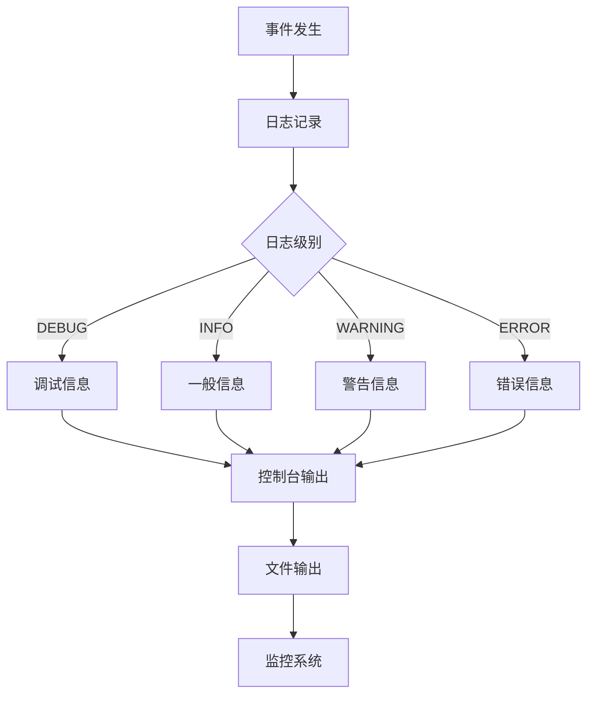

**图表来源**
- [lark2agent_ws.py:166-170](file://lark2agent_ws.py#L166-L170)

**章节来源**
- [lark2agent_ws.py:8355-8368](file://lark2agent_ws.py#L8355-L8368)
- [README.md:474-511](file://README.md#L474-L511)

## 结论

Lark2Agent 通过精心设计的架构和丰富的功能特性，成功实现了飞书与多种 AI Agent CLI 的深度集成。其核心优势包括：

1. **强大的适配器模式**：统一管理不同 Agent CLI 的差异
2. **完善的任务管理**：支持普通任务和复杂的 Plan 并行模式
3. **智能的审批机制**：确保操作的安全性和可控性
4. **丰富的 UI 交互**：通过交互式卡片提供直观的操作体验
5. **健壮的项目管理**：自动识别和管理项目与对话

该系统为团队协作和 AI 辅助开发提供了强有力的技术支撑，是现代软件开发流程中的重要工具。

## 附录

### 配置选项参考

系统支持大量的配置选项，可通过环境变量进行定制：

| 类别 | 关键字 | 默认值 | 描述 |
|------|--------|--------|------|
| Lark 基础 | LARK_APP_ID | 空 | 飞书应用 ID |
| Lark 基础 | LARK_ENCRYPT_KEY | 空 | 事件订阅加密密钥 |
| Lark 基础 | LARK_VERIFICATION_TOKEN | 空 | 事件订阅验证令牌 |
| Codex CLI | CODEX_DEFAULT_CWD | 当前目录 | 默认工作目录 |
| Codex CLI | CODEX_TIMEOUT_SECONDS | 1800 | 单次任务超时时间 |
| Claude CLI | CLAUDE_TIMEOUT_SECONDS | 1800 | 单次任务超时时间 |
| Qoder CLI | QODER_TIMEOUT_SECONDS | 1800 | 单次任务超时时间 |
| Qoder CLI | QODER_QUEST_TIMEOUT_SECONDS | 43200 | Qoder Quest 模式超时时间 |
| 性能控制 | MAX_RUNNING_TASKS | 6 | 全局最大运行任务数 |
| 性能控制 | PLAN_MAX_PARALLEL | 3 | Plan 并发执行数 |
| 卡片显示 | LARK_MESSAGE_CHUNK_SIZE | 1800 | 长消息分片大小 |
| 卡片显示 | MAX_PROJECTS_IN_PANEL | 8 | 面板最大项目数 |

### 使用场景示例

1. **日常开发协作**：在飞书中直接发起代码审查、bug 修复等任务
2. **项目管理**：通过 Plan 模式并行处理多个子任务，提高开发效率
3. **代码质量保证**：利用审批机制确保关键操作得到授权
4. **知识管理**：自动归档项目对话，便于后续查阅和审计