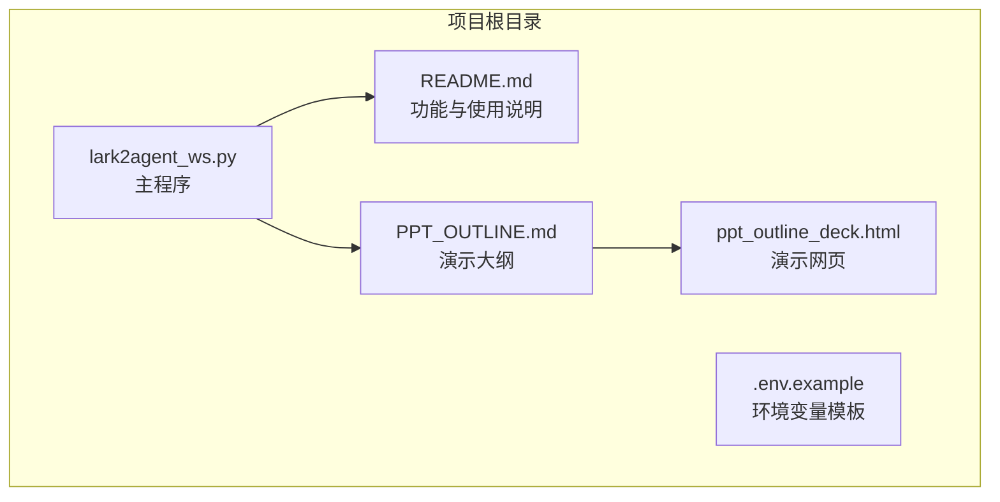
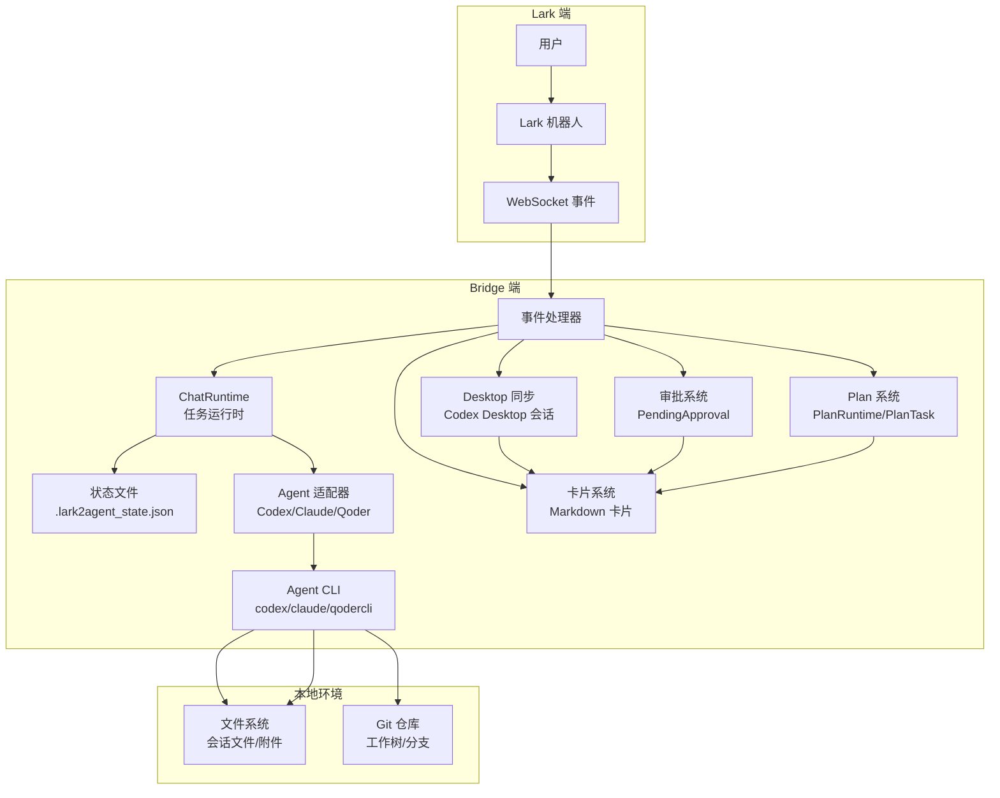
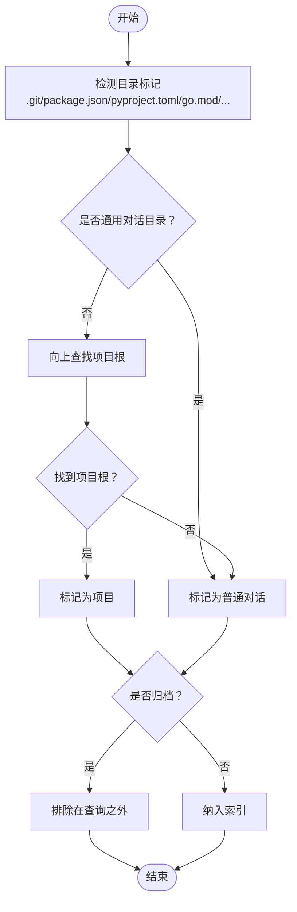
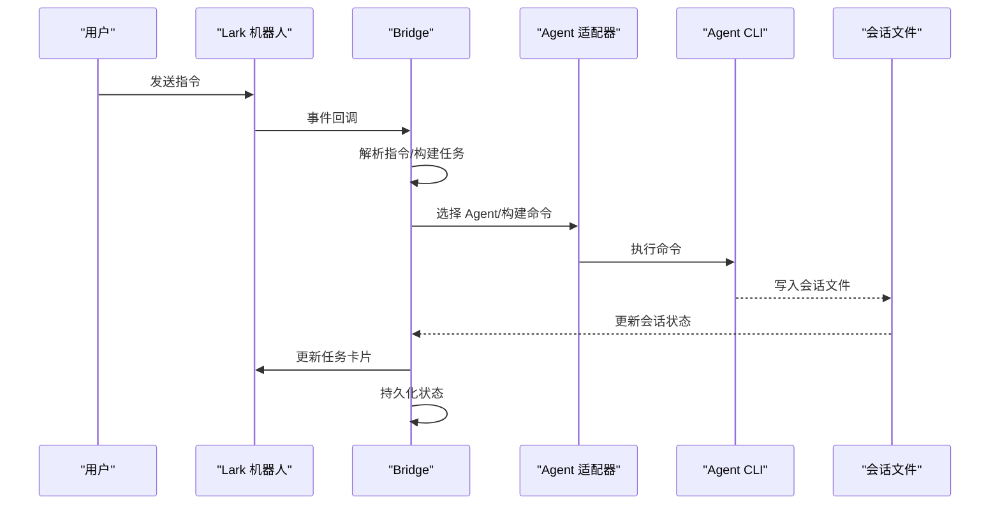
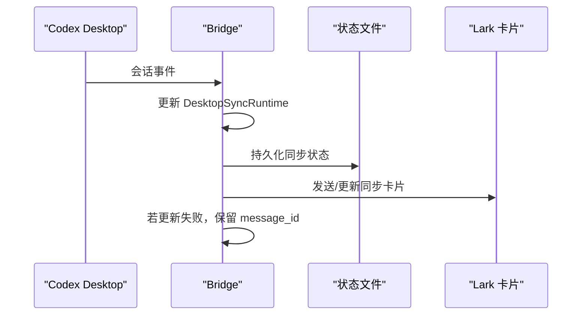
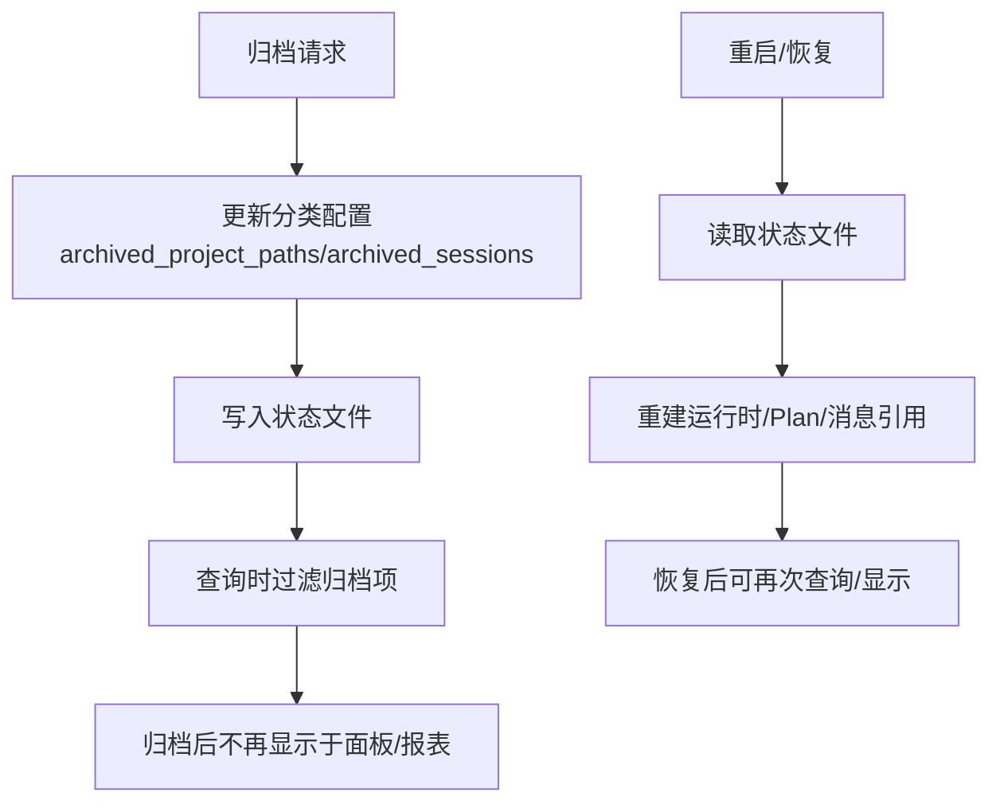
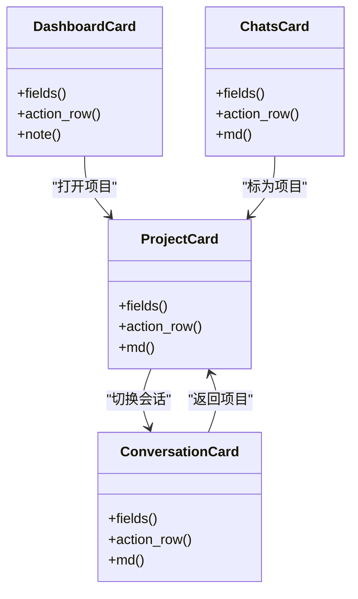
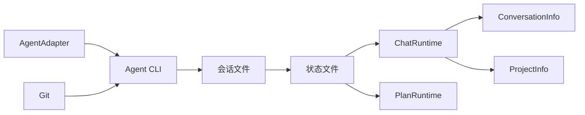

# 项目和对话管理

<cite>
**本文档引用的文件**
- [README.md](file://README.md)
- [lark2agent_ws.py](file://lark2agent_ws.py)
- [ppt_outline_deck.html](file://ppt_outline_deck.html)
- [PPT_OUTLINE.md](file://PPT_OUTLINE.md)
</cite>

## 目录
1. [简介](#简介)
2. [项目结构](#项目结构)
3. [核心组件](#核心组件)
4. [架构总览](#架构总览)
5. [详细组件分析](#详细组件分析)
6. [依赖关系分析](#依赖关系分析)
7. [性能考虑](#性能考虑)
8. [故障排除指南](#故障排除指南)
9. [结论](#结论)
10. [附录](#附录)

## 简介
本项目为 Lark2Agent，旨在将飞书/ Lark 群聊消息转化为 Codex、Claude Code 等 Agent CLI 的任务，并将执行进度、任务结果、审批操作和项目状态同步回 Lark 卡片。项目重点围绕“项目识别与创建机制”、“对话与会话管理”、“会话同步与状态持久化”、“归档与恢复策略”、“项目面板管理”以及“跨项目数据隔离与资源共享”展开。

## 项目结构
仓库采用单文件主程序 + 文档说明的组织方式：
- lark2agent_ws.py：主程序，负责 Lark WebSocket 事件处理、消息卡片构建、Agent 执行、审批、会话同步、macOS 保活等。
- README.md：项目功能、安装、运行、Lark 使用方式、环境变量、常见问题等说明。
- PPT_OUTLINE.md 与 ppt_outline_deck.html：项目介绍与演示材料。
- .env.example：环境变量模板（仓库未包含实际 .env 文件）。

**图表来源**
- [lark2agent_ws.py](file://lark2agent_ws.py)
- [README.md](file://README.md)
- [PPT_OUTLINE.md](file://PPT_OUTLINE.md)
- [ppt_outline_deck.html](file://ppt_outline_deck.html)

**章节来源**
- [README.md](file://README.md)
- [lark2agent_ws.py](file://lark2agent_ws.py)

## 核心组件
- 数据模型与运行时
  - ConversationInfo：会话信息，包含 session_id、cwd、agent_id、标题、最后用户/助手消息、状态、回合数、耗时等。
  - ProjectInfo：项目信息，包含 key、name、cwd、是否项目、会话列表。
  - ChatRuntime：聊天运行时，记录当前工作目录、活跃 Agent、活跃项目与会话、任务消息 ID、任务提示、任务状态、输出、模型、任务开始时间、最近卡片更新时间、最近状态推送时间、最近日报推送日期、发送禁用标志、最近审批指纹、活跃 Plan ID、引导任务 ID 等。
  - CodexTaskRuntime：单次任务运行时，包含任务 ID、chat_id、cwd、prompt、agent_id、model、message_id、进程句柄、状态、输出、session_id、开始时间、最近卡片更新时间、审批策略、沙箱模式、权限模式、批准重试标志、一次性 Agent 标志、最后消息路径、来源消息 ID、排队会话标志、引导请求标志、引导消息列表、取消请求标志、附件列表、Agent 模式、暂停开始时间、暂停秒数、停止请求标志、停止状态、停止详情、卡片更新失败标志、结果刷新截止时间等。
  - DesktopSyncRuntime：Codex Desktop 会话同步运行时，包含 chat_id、session_id、cwd、标题、消息 ID、prompt、status、output、updated_at、最近卡片更新时间等。
  - PendingApproval：待审批项，包含 approval_id、chat_id、task_id、agent_id、session_id、cwd、命令、原因、模型、原始 prompt、恢复 prompt、状态、创建时间、一次性 Agent 标志、指纹等。
  - PlanRuntime/PlanTask：Plan 并行任务运行时与子任务，包含 plan_id、chat_id、cwd、tasks、最大并发、消息 ID、状态、创建时间、最近卡片更新时间、停止请求标志、合并状态、合并输出等；子任务包含 task_id、title、prompt、model、phase、依赖、状态、进程、session_id、输出、开始/结束时间、批准重试标志、审批需求、worktree 路径、分支名、基 HEAD、diff 摘要、测试摘要、提交信息、提交哈希、重试次数、合并状态、清理状态、分支清理状态等。
- 适配器与命令构建
  - AgentAdapter/CodexAdapter/ClaudeAdapter/QoderAdapter：抽象与具体 Agent 适配器，负责命令构建、事件解析、可续写判断、原始 session_id 提取等。
- 状态与持久化
  - 状态文件 .lark2agent_state.json：保存已知 chat、运行面板状态、Plan/子任务状态、消息引用、分类配置（项目路径、普通会话、归档项目路径、归档会话）等。
- 附件与消息引用
  - LarkAttachment/LarkReferenceContext：附件与 Lark 引用上下文，支持消息引用查找与上下文拼接。

**章节来源**
- [lark2agent_ws.py](file://lark2agent_ws.py)

## 架构总览
Lark2Agent 通过 Lark WebSocket 接收消息与卡片按钮回调，解析指令后构建任务卡片，调用本地 Agent CLI（Codex、Claude Code、Qoder CLI）执行任务，流式解析输出并更新卡片；同时支持 Codex Desktop 会话同步、审批、Plan 并行、状态持久化与 macOS 保活。

**图表来源**
- [lark2agent_ws.py](file://lark2agent_ws.py)

**章节来源**
- [lark2agent_ws.py](file://lark2agent_ws.py)

## 详细组件分析

### 项目识别与创建机制
- 项目检测算法
  - 项目标记：通过存在 .git、package.json、pyproject.toml、go.mod、Cargo.toml、pom.xml、composer.json、requirements.txt、README.md 等文件判定为项目。
  - 通用对话目录：若位于家目录、Documents、/tmp、/private/tmp 等通用目录，则视为普通对话。
  - 计划工作树：若目录位于 .lark2agent/worktrees 或 PLAN_WORKTREE_ROOT，则视为计划工作树，可按配置决定是否计入统计。
  - 手动标记：通过 /mark-project 与 /mark-chat 手动修正项目/普通对话识别，修正信息保存在分类配置中。
- 项目初始化与配置管理
  - 项目根查找：从当前目录向上遍历，遇到项目标记或到达家目录为止，确定项目根。
  - 项目键与名称：项目键基于目录路径哈希，名称优先使用手动标记，否则使用目录名。
  - 项目目录：CODEX_PROJECTS_ROOT 为项目创建位置，默认为 CODEX_DEFAULT_CWD 的父目录；可配置 CODEX_ALLOWED_ROOTS 限制允许的根目录集合。
- 会话与项目关联
  - 会话文件索引：遍历 CODEX_SESSIONS_DIR、CLAUDE_PROJECTS_DIR、QODER_PROJECTS_DIR 下的 JSONL 文件，解析会话元数据与回合信息，构建 ConversationInfo。
  - 项目与会话聚合：按项目根聚合会话，形成 ProjectInfo 列表，支持排序与筛选。

**图表来源**
- [lark2agent_ws.py](file://lark2agent_ws.py)

**章节来源**
- [lark2agent_ws.py](file://lark2agent_ws.py)

### 对话与会话管理
- 会话创建与续写
  - 会话键：Codex 使用 session_id；Claude/Qoder 使用 "agent:session_id" 格式，避免冲突。
  - 可续写会话：根据 Agent 适配器的 is_resumable 判断，Codex 通过 originator/source 为 codex_exec/exec 判定。
  - 会话文件解析：解析 JSONL 会话文件，提取 session_meta、turn_context、event_msg、response_item 等，统计回合数、最后用户/助手消息、耗时、状态等。
- 会话状态跟踪与生命周期
  - 状态字段：未知/运行过/完成/有记录/有错误等。
  - 生命周期：从创建（task_started）、到运行（agent_message/user_message）、再到完成（task_complete），期间持续更新最后消息与耗时。
- 会话切换与激活
  - activate_conversation：切换活跃会话，更新 runtime 的 active_agent_id、active_session_id、task_session_id、cwd 等。
  - activate_project：在项目内选择或设置活跃会话，若无会话则清空。
  - focus_project：仅聚焦项目目录，不切换会话。

**图表来源**
- [lark2agent_ws.py](file://lark2agent_ws.py)

**章节来源**
- [lark2agent_ws.py](file://lark2agent_ws.py)

### 会话同步功能（Codex Desktop）
- 同步机制
  - 监听开关：SYNC_DESKTOP_SESSIONS 控制是否监听 Codex Desktop 会话更新。
  - 同步键：(chat_id, session_id) 作为唯一标识。
  - 同步卡片：构建 DesktopSyncRuntime，包含状态（监听中/用户输入/进行中/完成）、来源、目录、更新时间、标题、Session、指令、最新结果等。
- 状态持久化与冲突解决
  - 状态文件：.lark2agent_state.json 保存同步记录，重启后可恢复。
  - 冲突处理：当会话状态与本地卡片不一致时，以最新会话文件为准更新卡片；若卡片更新失败，保留 message_id 以便重试。

**图表来源**
- [lark2agent_ws.py](file://lark2agent_ws.py)

**章节来源**
- [lark2agent_ws.py](file://lark2agent_ws.py)

### 归档与恢复机制
- 归档策略
  - 项目归档：/project=archive [编号或目录]，归档路径保存在分类配置中。
  - 会话归档：/convos=archive [session_id]，/chat=archive [编号或 session_id]，归档 session_id 保存在分类配置中。
  - 查询过滤：LARK2AGENT_SHOW_ARCHIVED 控制是否在查询结果中显示归档项目/会话。
- 恢复与状态重建
  - 状态文件：.lark2agent_state.json 包含 chats、plans、message_refs、classification 等，重启后可恢复聊天运行时、Plan 状态、消息引用与分类配置。
  - 会话恢复：会话文件解析与索引重建，支持按日期统计与日报生成。

**图表来源**
- [lark2agent_ws.py](file://lark2agent_ws.py)

**章节来源**
- [lark2agent_ws.py](file://lark2agent_ws.py)

### 项目面板管理
- 面板展示
  - 总看板：显示项目数量、普通对话数量、状态、当前目录、当前 Session、当前项目、下一步建议等。
  - 项目面板：显示项目名称、阶段、对话数、最近更新时间、Agent 分布、来源分布、下一步建议等。
  - 对话面板：显示最近对话列表，支持切换、状态查看、标为项目等操作。
- 会话筛选与状态更新
  - 按来源筛选：Codex Desktop、Bridge、其他。
  - 按 Agent 筛选：Codex、Claude Code、Qoder CLI。
  - 阶段状态：等待审批、执行中、已有本地改动、今日已推进、可继续推进、尚未开始等。
- 批量管理
  - 项目切换：/project 1、/latest 1。
  - 会话切换：/conv <session_id>。
  - 归档操作：/project=archive、/convos=archive、/chat=archive。

**图表来源**
- [lark2agent_ws.py](file://lark2agent_ws.py)

**章节来源**
- [lark2agent_ws.py](file://lark2agent_ws.py)

### 项目间的数据隔离与资源共享
- 目录隔离
  - CODEX_ALLOWED_ROOTS：限制 Agent CLI 执行、/cd、项目创建与 Plan worktree 运行的目录范围。
  - is_allowed_cwd：判断目录是否在允许范围内。
- 权限控制
  - LARK_ALLOWED_CHAT_IDS/LARK_ALLOWED_OPEN_IDS/LARK_ADMIN_OPEN_IDS：限制允许的群聊与用户，管理员可执行敏感操作。
  - LARK_REQUIRE_KNOWN_CHAT：未配置允许列表时，仅允许状态文件中已存在的 chat。
- 数据保护
  - 状态文件权限：写入临时文件后再替换，确保权限为 0600。
  - 附件下载：限制大小、去重、唯一路径生成，避免覆盖与越权访问。
- 访问限制
  - 会话锁：按 conversation_key(session_id) 获取线程锁，避免并发写入会话文件。
  - 会话运行锁：按会话粒度串行执行，避免竞态。

**章节来源**
- [lark2agent_ws.py](file://lark2agent_ws.py)

## 依赖关系分析
- 组件耦合
  - ChatRuntime 与 ConversationInfo/ProjectInfo：通过会话键关联，实现会话切换与项目聚焦。
  - AgentAdapter 与 Agent CLI：通过命令构建与事件解析解耦具体 Agent 实现。
  - 状态文件与各运行时：通过序列化/反序列化实现持久化与恢复。
- 外部依赖
  - Lark SDK：事件订阅、消息发送/更新卡片。
  - Git：工作树/分支隔离、状态检查、diff 摘要。
  - Shell：Agent CLI 调用、Plan 测试命令执行。

**图表来源**
- [lark2agent_ws.py](file://lark2agent_ws.py)

**章节来源**
- [lark2agent_ws.py](file://lark2agent_ws.py)

## 性能考虑
- 事件与卡片更新节流：任务卡片与桌面同步卡片在短时间内避免频繁更新，减少 Lark API 调用压力。
- 会话文件解析优化：限制索引文件数量（MAX_SESSION_FILES），按修改时间排序，优先处理最新文件。
- 并发控制：全局与单会话任务并发上限（MAX_RUNNING_TASKS/MAX_RUNNING_TASKS_PER_CHAT），Plan 并发上限（PLAN_MAX_PARALLEL）。
- I/O 优化：附件下载使用临时文件与原子替换，避免部分写入；会话文件读取采用流式解析与缓冲。

## 故障排除指南
- 收不到 Lark 消息
  - 检查机器人是否加入群聊、IM 权限是否开通、加密密钥与校验令牌配置是否正确。
  - 查看脚本日志中 send_card/send_msg 失败与权限错误。
- 审批批准后未继续执行
  - 确认脚本已重启并加载最新代码。
  - 检查批准后的配置（APPROVED_CODEX_APPROVAL_POLICY/APPROVED_CODEX_SANDBOX_MODE、APPROVED_CLAUDE_PERMISSION_MODE、APPROVED_QODER_PERMISSION_MODE）。
- Git 提交失败
  - 输出包含 .git/index.lock 或 permission denied 时，通常为 sandbox 权限不足；批准后脚本会用批准后的 sandbox 配置单次重试。
- 电脑合盖睡眠
  - macOS 仅防止普通 idle sleep；如需合盖运行，可启用 KEEP_AWAKE_DISABLE_SLEEP 并以管理员权限设置 pmset disablesleep 1。

**章节来源**
- [README.md](file://README.md)

## 结论
Lark2Agent 通过清晰的项目识别与会话管理、完善的会话同步与状态持久化、灵活的归档与恢复机制，以及严格的权限与数据隔离策略，实现了将 Lark 群聊无缝对接到本地 Agent CLI 的工程执行闭环。项目面板与卡片系统提供了良好的协作可见性与可操作性，适合在团队中推广使用。

## 附录
- 常用指令速览
  - /panel、/projects、/convos、/chats、/status、/daily、/plan、/agent、/codex、/claude、/qoder、/stop、/restart、/project=new、/convos=new、/project=archive、/convos=archive、/chat=archive、/mark-project、/mark-chat、/approve、/reject、/cancel。
- 环境变量参考
  - Lark：LARK_APP_ID、LARK_APP_SECRET、LARK_DOMAIN、LARK_ENCRYPT_KEY、LARK_VERIFICATION_TOKEN。
  - Codex：CODEX_DEFAULT_CWD、CODEX_HOME、CODEX_SESSIONS_DIR、CODEX_BIN、CODEX_TIMEOUT_SECONDS、CODEX_MODEL、CODEX_PROJECTS_ROOT、CODEX_APPROVAL_POLICY、CODEX_SANDBOX_MODE、APPROVED_CODEX_APPROVAL_POLICY、APPROVED_CODEX_SANDBOX_MODE、CODEX_ALLOWED_ROOTS。
  - Agent/Claude/Qoder：DEFAULT_AGENT_ID、CLAUDE_BIN、CLAUDE_HOME、CLAUDE_PROJECTS_DIR、CLAUDE_TIMEOUT_SECONDS、CLAUDE_MODEL、CLAUDE_PERMISSION_MODE、APPROVED_CLAUDE_PERMISSION_MODE、CLAUDE_EXTRA_ARGS、QODER_BIN、QODER_HOME、QODER_PROJECTS_DIR、QODER_PROCESS_HOME、QODER_TIMEOUT_SECONDS、QODER_QUEST_TIMEOUT_SECONDS、QODER_MODEL、QODER_PERMISSION_MODE、APPROVED_QODER_PERMISSION_MODE、QODER_EXTRA_ARGS。
  - 访问控制：LARK_ALLOWED_CHAT_IDS、LARK_ALLOWED_OPEN_IDS、LARK_ADMIN_OPEN_IDS、LARK_REQUIRE_KNOWN_CHAT。
  - 卡片与消息：LARK_MESSAGE_CHUNK_SIZE、LARK_FINAL_REPLY_MAX_CHARS、LARK_FINAL_QUESTION_MAX_CHARS、MAX_PROJECTS_IN_PANEL、MAX_CONVERSATIONS_IN_PANEL、MAX_SESSION_FILES、MAX_RUNNING_TASKS、MAX_RUNNING_TASKS_PER_CHAT、LARK_EVENT_QUEUE_MAXSIZE、LARK_ATTACHMENTS_DIR、LARK_ATTACHMENT_MAX_BYTES、LARK_PENDING_ATTACHMENT_TTL_SECONDS、MAX_LARK_ATTACHMENTS_PER_MESSAGE、MAX_LARK_MESSAGE_REFS、TASK_CARD_REFRESH_INTERVAL_SECONDS、PLAN_MAX_PARALLEL、PLAN_TASK_OUTPUT_MAX_CHARS、PLAN_USE_WORKTREES、PLAN_WORKTREE_ROOT、PLAN_TEST_COMMAND、PLAN_TEST_COMMAND_SHELL、PLAN_TEST_TIMEOUT_SECONDS。
  - 审批：PENDING_APPROVAL_WAIT_SECONDS、PENDING_APPROVAL_POLL_SECONDS。
  - 状态/同步/持久化：STATUS_INTERVAL_SECONDS、DAILY_REPORT_TIME、LARK2AGENT_STATE_FILE、LARK2AGENT_SHOW_ARCHIVED、LARK2AGENT_INCLUDE_PLAN_WORKTREES、LARK2AGENT_WELCOME_MESSAGE、SYNC_DESKTOP_SESSIONS、SESSION_WATCH_INTERVAL_SECONDS、LARK_CARD_ENABLE_FORWARD、LOG_MESSAGE_CONTENT、LOG_LEVEL。
  - macOS 保活：KEEP_AWAKE_ON_AC_POWER、KEEP_AWAKE_CHECK_INTERVAL_SECONDS、KEEP_AWAKE_DISABLE_SLEEP。

**章节来源**
- [README.md](file://README.md)