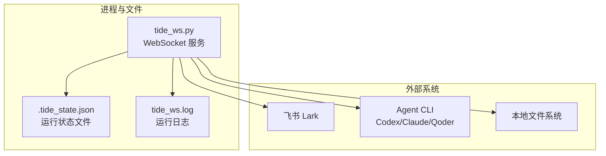
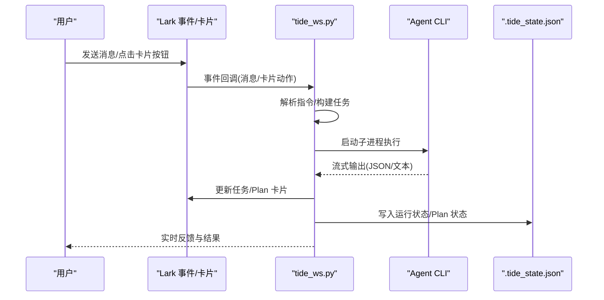
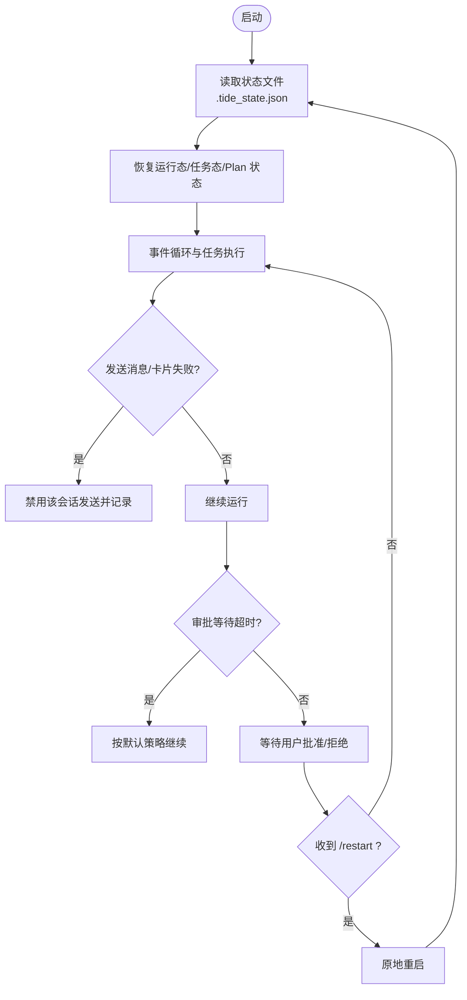
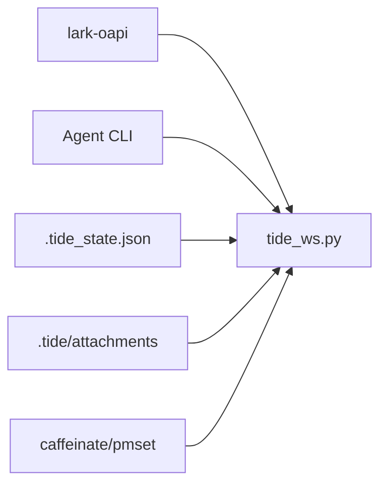

# 监控和维护

<cite>
**本文引用的文件**
- [README.md](file://README.md)
- [tide_ws.py](file://tide_ws.py)
</cite>

## 目录
1. [简介](#简介)
2. [项目结构](#项目结构)
3. [核心组件](#核心组件)
4. [架构总览](#架构总览)
5. [详细组件分析](#详细组件分析)
6. [依赖关系分析](#依赖关系分析)
7. [性能考虑](#性能考虑)
8. [故障排查指南](#故障排查指南)
9. [结论](#结论)
10. [附录](#附录)

## 简介
本文件面向 Tide 的运维与维护场景，围绕日志管理、性能监控、故障恢复、备份策略、常见问题排查与自动化运维等方面，提供系统化的指导与实操建议。文档基于仓库现有实现与说明，聚焦于 WebSocket 服务、消息与卡片交互、任务执行、审批与 Plan 并行执行、状态持久化与恢复等关键环节。

## 项目结构
- 主程序入口：tide_ws.py
- 文档与配置参考：README.md
- 状态文件：.tide_state.json（本地生成，不提交）
- 日志文件：tide_ws.log（后台运行时的标准输出与错误输出）

图表来源
- [tide_ws.py:166-170](file://tide_ws.py#L166-L170)
- [README.md:103-150](file://README.md#L103-L150)

章节来源
- [README.md:103-150](file://README.md#L103-L150)
- [tide_ws.py:166-170](file://tide_ws.py#L166-L170)

## 核心组件
- 日志系统：基于 Python logging，支持通过环境变量 LOG_LEVEL 设置级别，格式包含时间、级别、线程名与消息。
- 状态持久化：通过 .tide_state.json 保存已知会话、运行态、Plan 状态等，支持重启恢复。
- 事件与消息：基于 Lark 事件回调与卡片交互，驱动任务执行、审批、状态推送与 UI 更新。
- 任务执行：封装 Codex/Claude/Qoder CLI 的命令构建与事件解析，支持流式输出与卡片更新。
- 审批与权限：检测 Agent 输出中的审批信号，生成待审批项并等待用户在卡片中批准/拒绝。
- Plan 并行：将任务拆分为多个子任务，支持 Git worktree 隔离、测试命令、差异摘要与提交审批。

章节来源
- [tide_ws.py:166-170](file://tide_ws.py#L166-L170)
- [tide_ws.py:869-891](file://tide_ws.py#L869-L891)
- [tide_ws.py:1152-1157](file://tide_ws.py#L1152-L1157)
- [tide_ws.py:3346-3365](file://tide_ws.py#L3346-L3365)
- [tide_ws.py:4405-4505](file://tide_ws.py#L4405-L4505)

## 架构总览
Tide 以 tide_ws.py 为核心，通过 Lark 事件回调接收消息与卡片动作，解析指令后调度 Agent CLI 执行任务，实时更新卡片与状态文件，实现“消息-执行-反馈”的闭环。

图表来源
- [tide_ws.py:1642-1652](file://tide_ws.py#L1642-L1652)
- [tide_ws.py:3482-3524](file://tide_ws.py#L3482-L3524)
- [tide_ws.py:3663-3702](file://tide_ws.py#L3663-L3702)
- [tide_ws.py:869-891](file://tide_ws.py#L869-L891)
- [tide_ws.py:1152-1157](file://tide_ws.py#L1152-L1157)

## 详细组件分析

### 日志管理策略
- 日志级别与格式
  - 通过环境变量 LOG_LEVEL 设置（默认 INFO），格式包含时间、级别、线程名与消息。
  - 可通过 LOG_MESSAGE_CONTENT 控制是否在日志中记录消息与 Prompt 片段（生产环境建议关闭以降低敏感信息泄露风险）。
- 日志文件位置
  - 后台运行时输出重定向至 tide_ws.log。
- 日志轮转与清理
  - 仓库未内置日志轮转逻辑；建议结合系统工具（如 logrotate 或 systemd-journald）进行轮转与保留策略配置。
- 日志采集与集中化
  - 可将 tide_ws.log 采集至集中式日志平台（如 ELK、Loki、Splunk），便于检索与告警。

章节来源
- [tide_ws.py:166-170](file://tide_ws.py#L166-L170)
- [README.md:118-130](file://README.md#L118-L130)
- [README.md](file://README.md#L427)

### 性能监控指标
- 任务执行时间
  - 任务耗时通过 task_runtime_elapsed 计算，卡片中显示“耗时”字段；Plan 子任务同样记录 started_at/finished_at 并格式化显示。
- 内存使用
  - 仓库未内置内存采样；可在系统层面通过进程监控工具（如 top、htop、smem）观察 Python 进程内存占用。
- CPU 占用
  - 通过系统工具（如 top、htop、sar）观察进程 CPU 占用；注意并发任务与 Agent CLI 的 I/O 密集特性。
- 并发任务数
  - 全局与每会话并发上限由 MAX_RUNNING_TASKS 与 MAX_RUNNING_TASKS_PER_CHAT 控制；Plan 并发由 PLAN_MAX_PARALLEL 控制。
- 事件队列积压
  - LARK_EVENT_QUEUE_MAXSIZE 控制事件队列最大积压，避免内存膨胀。
- 附件与消息处理
  - LARK_MESSAGE_CHUNK_SIZE、FINAL_REPLY_MAX_CHARS、FINAL_QUESTION_MAX_CHARS 等参数影响消息分片与展示长度，间接影响 UI 响应与传输效率。

章节来源
- [tide_ws.py:529-531](file://tide_ws.py#L529-L531)
- [tide_ws.py:3918-3949](file://tide_ws.py#L3918-L3949)
- [tide_ws.py:4410-4415](file://tide_ws.py#L4410-L4415)
- [tide_ws.py:107-114](file://tide_ws.py#L107-L114)
- [README.md:383-398](file://README.md#L383-L398)

### 故障恢复流程
- 异常处理机制
  - 发送消息/卡片失败时记录错误并禁用该会话发送（disable_chat_send），避免重复失败。
  - 审批等待超时自动按默认策略继续；审批指纹去重，避免重复审批。
- 自动重启策略
  - 支持在 Lark 中发送 /restart 触发原地重启；后台运行时亦可通过 pkill/nohup 方式重启。
  - macOS 保活：接入电源时自动 caffeinate 与设置 disablesleep，减少睡眠导致的连接中断。
- 状态恢复与数据持久化
  - 通过 .tide_state.json 保存运行态、任务态、Plan 状态；重启后恢复。
  - Plan 子任务状态在重启后标记为失败并提示重试，确保用户可手动恢复。
- 附件与引用
  - 附件下载失败、大小超限、保存异常均有日志记录；引用消息缓存受 MAX_LARK_MESSAGE_REFS 限制并定期裁剪。

图表来源
- [tide_ws.py:869-891](file://tide_ws.py#L869-L891)
- [tide_ws.py:1152-1157](file://tide_ws.py#L1152-L1157)
- [tide_ws.py:3346-3365](file://tide_ws.py#L3346-L3365)
- [tide_ws.py:3482-3524](file://tide_ws.py#L3482-L3524)
- [tide_ws.py:1677-1769](file://tide_ws.py#L1677-L1769)

章节来源
- [tide_ws.py:869-891](file://tide_ws.py#L869-L891)
- [tide_ws.py:1152-1157](file://tide_ws.py#L1152-L1157)
- [tide_ws.py:3346-3365](file://tide_ws.py#L3346-L3365)
- [tide_ws.py:3482-3524](file://tide_ws.py#L3482-L3524)
- [tide_ws.py:1677-1769](file://tide_ws.py#L1677-L1769)

### 备份策略
- 状态文件备份
  - .tide_state.json 为运行时状态文件，建议定期备份至安全位置，以便快速恢复。
- 配置文件备份
  - .env 为关键配置文件，建议纳入版本控制或独立备份，变更前做好快照。
- 重要数据备份
  - 附件下载目录（默认 .tide/attachments）与 Plan worktree 目录为重要数据，建议定期打包备份。
- 恢复要点
  - 重启后 Plan 子任务若未结束会被标记为失败，需手动重试；确保 .env 与 Agent CLI 可用性。

章节来源
- [README.md:118-130](file://README.md#L118-L130)
- [README.md:211-218](file://README.md#L211-L218)
- [tide_ws.py:1152-1157](file://tide_ws.py#L1152-L1157)

### 常见运维问题排查
- WebSocket 连接中断
  - 检查 LARK_APP_ID/LARK_APP_SECRET/LARK_ENCRYPT_KEY/LARK_VERIFICATION_TOKEN 是否正确。
  - 关注日志中的 send_card/send_msg 失败与权限错误；必要时禁用会话发送并重试。
  - macOS 场景下确认 caffeinate/pmset 是否正常，电源状态变化是否触发保活。
- Agent CLI 执行失败
  - 检查 CODEX_BIN/CLAUDE_BIN/QODER_BIN 是否可执行；确认模型与权限模式配置。
  - 审批相关失败（如权限拒绝）需在卡片中批准后重试。
- 权限审批问题
  - 审批指纹去重，避免重复审批；超时后按默认策略继续。
  - 审批通过后，系统会按批准后的策略单次重试原任务。

章节来源
- [README.md:476-494](file://README.md#L476-L494)
- [tide_ws.py:3482-3524](file://tide_ws.py#L3482-L3524)
- [tide_ws.py:3346-3365](file://tide_ws.py#L3346-L3365)
- [tide_ws.py:5381-5424](file://tide_ws.py#L5381-L5424)

### 运维自动化与监控告警
- 进程与日志
  - 使用 pgrep/ps 辅助进程查询；tail -f 实时查看日志。
  - 结合系统日志与业务日志，设置关键字告警（如 send_card/send_msg 失败、审批超时、权限拒绝）。
- 健康检查
  - 定期检查 .tide_state.json 是否更新；监控 Plan 卡片状态变化。
- 自动化脚本示例（思路）
  - 启动/停止/重启脚本：基于 nohup/pkill，结合进程名过滤。
  - 日志巡检：grep 关键词并上报；结合外部告警系统。
  - 状态巡检：对比状态文件更新时间，发现异常及时报警。

章节来源
- [README.md:109-150](file://README.md#L109-L150)
- [tide_ws.py:3346-3365](file://tide_ws.py#L3346-L3365)

## 依赖关系分析
- 组件耦合
  - tide_ws.py 与 Lark SDK、Agent CLI、状态文件、附件目录存在直接依赖。
  - 事件处理与任务执行解耦，通过卡片与状态文件进行状态同步。
- 外部依赖
  - Lark 事件回调、IM 消息与卡片接口。
  - macOS 保活命令 caffeinate/pmset。
- 潜在环路
  - 未发现直接循环依赖；事件处理与任务执行通过状态文件解耦。

图表来源
- [tide_ws.py:21-31](file://tide_ws.py#L21-L31)
- [tide_ws.py:1677-1769](file://tide_ws.py#L1677-L1769)

章节来源
- [tide_ws.py:21-31](file://tide_ws.py#L21-L31)
- [tide_ws.py:1677-1769](file://tide_ws.py#L1677-L1769)

## 性能考虑
- 并发与资源
  - 合理设置 MAX_RUNNING_TASKS/MAX_RUNNING_TASKS_PER_CHAT 与 PLAN_MAX_PARALLEL，避免资源争用。
  - Plan 子任务启用 Git worktree 隔离，提升并行度但增加磁盘与 Git 操作开销。
- I/O 与网络
  - 附件下载受 LARK_ATTACHMENT_MAX_BYTES 限制；消息分片与展示长度参数影响网络传输与渲染性能。
- 日志与安全
  - 生产环境建议关闭 LOG_MESSAGE_CONTENT，避免敏感信息写入日志。
  - 日志轮转与保留策略需结合业务容量评估。

章节来源
- [README.md:383-404](file://README.md#L383-L404)
- [tide_ws.py:1449-1539](file://tide_ws.py#L1449-L1539)
- [tide_ws.py:3424-3438](file://tide_ws.py#L3424-L3438)

## 故障排查指南
- 收不到 Lark 消息
  - 确认机器人加入群聊、应用已发布并开通 IM 权限。
  - 检查 .env 配置与日志中的 send_card/send_msg 错误。
- 审批批准后未继续执行
  - 确认脚本已加载最新代码与 .env 中批准后的配置。
- Git 提交失败
  - 通常由 sandbox 权限不足导致；批准后按批准策略单次重试。
- 电脑仍然睡眠
  - macOS 场景下确认 caffeinate/pmset 状态；必要时启用 disablesleep 并注意散热。

章节来源
- [README.md:476-510](file://README.md#L476-L510)

## 结论
Tide 通过状态文件与卡片交互实现了稳定的任务执行与状态可视化，具备良好的可维护性与扩展性。建议在生产环境中完善日志轮转、集中化采集与告警、定期备份状态文件与配置，并结合系统工具对并发与资源进行合理规划，以获得更稳健的运行表现。

## 附录
- 关键环境变量与用途概览（节选）
  - LOG_LEVEL：日志级别
  - LOG_MESSAGE_CONTENT：是否记录消息与 Prompt 片段
  - LARK_EVENT_QUEUE_MAXSIZE：事件队列最大积压
  - MAX_RUNNING_TASKS/MAX_RUNNING_TASKS_PER_CHAT：全局与每会话并发上限
  - PLAN_MAX_PARALLEL：Plan 并发上限
  - LARK_ATTACHMENT_MAX_BYTES：附件最大字节数
  - KEEP_AWAKE_ON_AC_POWER/KEEP_AWAKE_DISABLE_SLEEP：macOS 保活策略

章节来源
- [README.md](file://README.md#L427)
- [README.md:383-404](file://README.md#L383-L404)
- [README.md:429-456](file://README.md#L429-L456)