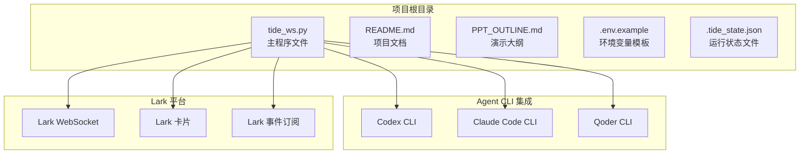
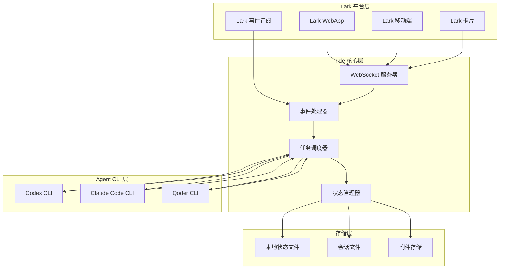
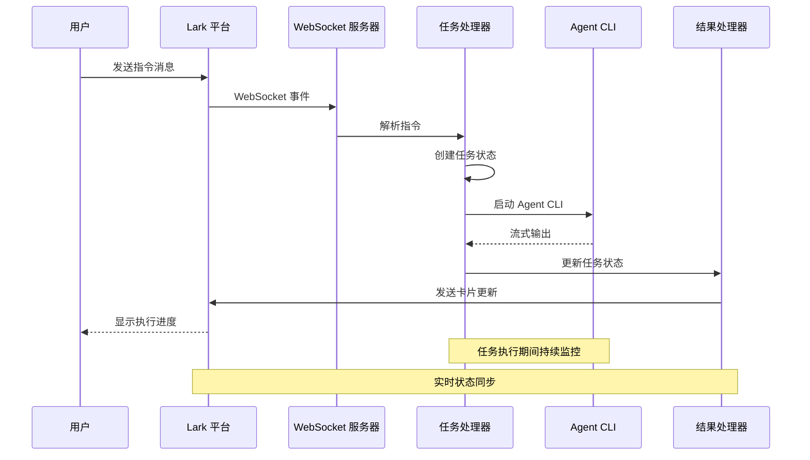
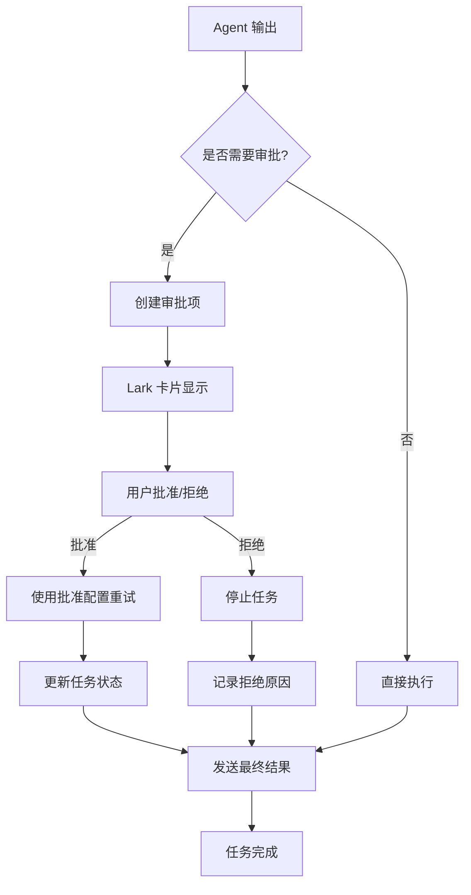
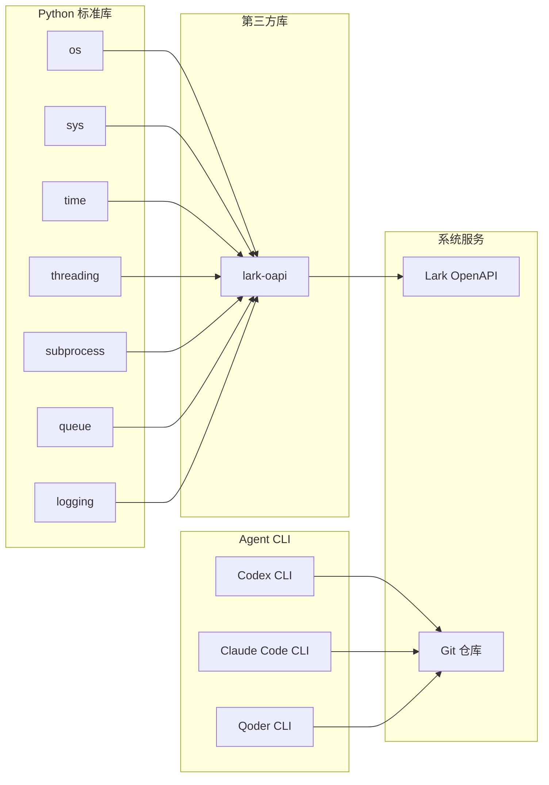
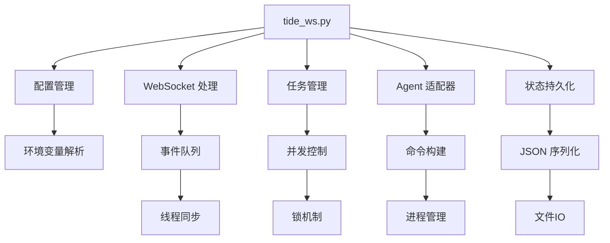

# 部署和运维

<cite>
**本文档引用的文件**
- [README.md](file://README.md)
- [tide_ws.py](file://tide_ws.py)
- [PPT_OUTLINE.md](file://PPT_OUTLINE.md)
</cite>

## 目录
1. [简介](#简介)
2. [项目结构](#项目结构)
3. [核心组件](#核心组件)
4. [架构概览](#架构概览)
5. [详细组件分析](#详细组件分析)
6. [依赖关系分析](#依赖关系分析)
7. [性能考虑](#性能考虑)
8. [故障排除指南](#故障排除指南)
9. [结论](#结论)
10. [附录](#附录)

## 简介

Tide 是一个将飞书/Lark 群聊消息转换为 Codex、Claude Code 等 Agent CLI 任务的桥梁系统。它通过 WebSocket 长连接接收 Lark 消息，将自然语言指令转换为 Agent CLI 命令执行，并将执行进度、任务结果、审批操作和项目状态同步回 Lark 卡片。

该系统专为工程团队设计，提供了一个轻量级的多 Agent 桥接解决方案，支持后台运行、任务审批、并行执行和状态同步等功能。

## 项目结构

Tide 项目采用简洁的单文件架构设计：



**图表来源**
- [tide_ws.py:1-50](file://tide_ws.py#L1-L50)
- [README.md:512-517](file://README.md#L512-L517)

**章节来源**
- [README.md:512-517](file://README.md#L512-L517)
- [tide_ws.py:1-8589](file://tide_ws.py#L1-L8589)

## 核心组件

### 主程序组件

Tide 的核心功能由以下主要组件构成：

#### WebSocket 事件处理器
- 负责建立和维护与 Lark 的 WebSocket 连接
- 处理消息接收、消息已读、卡片按钮回调等事件
- 实现事件队列管理和异步处理机制

#### Agent 适配器系统
- **CodexAdapter**: 适配 Codex CLI，支持会话续写和沙箱模式
- **ClaudeAdapter**: 适配 Claude Code CLI，支持流式输出解析
- **QoderAdapter**: 适配 Qoder CLI，支持 Quest 模式

#### 任务管理系统
- 任务状态跟踪和生命周期管理
- 并行任务调度和资源限制
- 审批流程集成和权限控制

#### 项目和会话管理
- 项目目录识别和分类
- Agent 会话索引和状态同步
- 会话文件管理和持久化

**章节来源**
- [tide_ws.py:626-800](file://tide_ws.py#L626-L800)
- [tide_ws.py:173-406](file://tide_ws.py#L173-L406)

## 架构概览

Tide 采用事件驱动的架构模式，通过 WebSocket 与 Lark 平台实时交互：



**图表来源**
- [tide_ws.py:387-406](file://tide_ws.py#L387-L406)
- [tide_ws.py:626-800](file://tide_ws.py#L626-L800)

## 详细组件分析

### 环境配置系统

Tide 通过环境变量实现灵活的配置管理：

#### Lark 平台配置
| 环境变量 | 默认值 | 说明 |
|---------|--------|------|
| `LARK_APP_ID` | 空 | Lark 自建应用 App ID |
| `LARK_APP_SECRET` | 空 | Lark 自建应用 App Secret |
| `LARK_DOMAIN` | `https://open.larksuite.com` | Lark OpenAPI 域名 |
| `LARK_ENCRYPT_KEY` | 空 | 事件订阅 Encrypt Key |
| `LARK_VERIFICATION_TOKEN` | 空 | 事件订阅 Verification Token |

#### Agent CLI 配置
| 环境变量 | 默认值 | 说明 |
|---------|--------|------|
| `DEFAULT_AGENT_ID` | `codex` | 默认 Agent 类型 |
| `CODEX_BIN` | `codex` | Codex CLI 命令路径 |
| `CLAUDE_BIN` | `claude` | Claude Code CLI 命令路径 |
| `QODER_BIN` | `qodercli` | Qoder CLI 命令路径 |
| `CODEX_TIMEOUT_SECONDS` | `1800` | Codex 任务超时时间 |
| `CLAUDE_TIMEOUT_SECONDS` | `1800` | Claude 任务超时时间 |
| `QODER_TIMEOUT_SECONDS` | `1800` | Qoder 任务超时时间 |

#### 安全和访问控制
| 环境变量 | 默认值 | 说明 |
|---------|--------|------|
| `LARK_ALLOWED_CHAT_IDS` | 空 | 允许的群聊 ID 列表 |
| `LARK_ALLOWED_OPEN_IDS` | 空 | 允许的操作用户 open_id |
| `LARK_ADMIN_OPEN_IDS` | 空 | 管理员用户 open_id |
| `LARK_REQUIRE_KNOWN_CHAT` | `1` | 仅允许已知群聊 |

**章节来源**
- [README.md:317-427](file://README.md#L317-L427)
- [tide_ws.py:54-151](file://tide_ws.py#L54-L151)

### 任务执行流程

Tide 的任务执行采用流水线模式：



**图表来源**
- [tide_ws.py:655-672](file://tide_ws.py#L655-L672)
- [tide_ws.py:674-765](file://tide_ws.py#L674-L765)

### 审批和安全机制

系统实现了多层次的安全控制：



**图表来源**
- [tide_ws.py:5277-5311](file://tide_ws.py#L5277-L5311)
- [tide_ws.py:615-624](file://tide_ws.py#L615-L624)

**章节来源**
- [tide_ws.py:5277-5311](file://tide_ws.py#L5277-L5311)
- [tide_ws.py:615-624](file://tide_ws.py#L615-L624)

## 依赖关系分析

### 外部依赖

Tide 的依赖关系相对简单，主要依赖于：



**图表来源**
- [tide_ws.py:1-31](file://tide_ws.py#L1-L31)
- [README.md:19-26](file://README.md#L19-L26)

### 内部模块依赖

系统内部模块之间的依赖关系：



**图表来源**
- [tide_ws.py:34-49](file://tide_ws.py#L34-L49)
- [tide_ws.py:387-406](file://tide_ws.py#L387-L406)

**章节来源**
- [tide_ws.py:1-31](file://tide_ws.py#L1-L31)
- [tide_ws.py:34-49](file://tide_ws.py#L34-L49)

## 性能考虑

### 资源管理

Tide 实现了多种资源管理机制：

#### 并发控制
- 全局同时运行的任务数限制：`MAX_RUNNING_TASKS`
- 单个群聊同时运行的任务数限制：`MAX_RUNNING_TASKS_PER_CHAT`
- Plan 并行执行的最大子任务数：`PLAN_MAX_PARALLEL`

#### 内存优化
- 事件队列大小限制：`LARK_EVENT_QUEUE_MAXSIZE`
- 会话文件数量上限：`MAX_SESSION_FILES`
- 附件缓存大小限制：`MAX_LARK_MESSAGE_REFS`

#### 网络优化
- WebSocket 连接保活机制
- 事件批量处理
- 异步 I/O 操作

### 性能监控指标

建议监控的关键指标：
- 任务执行成功率
- 平均任务执行时间
- 审批等待时间
- WebSocket 连接稳定性
- Agent CLI 响应时间

## 故障排除指南

### 常见问题诊断

#### Lark 消息接收问题
**症状**: 收不到 Lark 消息或消息处理失败

**诊断步骤**:
1. 检查 Lark 应用配置是否正确
2. 验证事件订阅是否启用
3. 确认机器人是否加入目标群聊
4. 查看日志中的 `send_card failed` 或 `send_msg failed` 错误

**解决方案**:
- 重新配置 Lark 应用权限
- 检查网络连接和防火墙设置
- 验证 `LARK_APP_ID`、`LARK_APP_SECRET`、`LARK_ENCRYPT_KEY`、`LARK_VERIFICATION_TOKEN`

#### 审批流程问题
**症状**: 审批批准后任务未继续执行

**诊断步骤**:
1. 确认脚本已重启并加载最新代码
2. 检查批准后的配置是否正确
3. 验证 `APPROVED_CODEX_APPROVAL_POLICY` 和 `APPROVED_CODEX_SANDBOX_MODE`

**解决方案**:
- 更新 `.env` 文件中的批准配置
- 重新发送 `/restart` 指令重启脚本
- 检查 Agent CLI 的权限设置

#### Git 提交失败
**症状**: 任务执行时报错 `Unable to create .git/index.lock`

**诊断步骤**:
1. 检查 Git 仓库状态
2. 验证 Agent CLI 的沙箱权限
3. 确认文件系统权限

**解决方案**:
- 使用审批流程批准更高的权限
- 检查并修复 Git 仓库锁定问题
- 调整 Agent CLI 的沙箱配置

#### macOS 保活问题
**症状**: 电脑仍然睡眠或无法保持运行

**诊断步骤**:
1. 检查电源状态
2. 验证 `KEEP_AWAKE_ON_AC_POWER` 设置
3. 确认 `KEEP_AWAKE_DISABLE_SLEEP` 权限

**解决方案**:
- 使用 `KEEP_AWAKE_ON_AC_POWER=1` 保持基本保活
- 如需合盖运行，使用 `KEEP_AWAKE_DISABLE_SLEEP=1`
- 手动执行 `sudo pmset -a disablesleep 1` 命令

**章节来源**
- [README.md:474-511](file://README.md#L474-L511)
- [tide_ws.py:1717-1770](file://tide_ws.py#L1717-L1770)

## 结论

Tide 提供了一个轻量级但功能完整的 Lark 到 Agent CLI 桥接解决方案。其简洁的架构设计、灵活的配置系统和强大的功能集使其成为工程团队的理想选择。

系统的主要优势包括：
- **低侵入性**: 不改变现有 Agent CLI 使用方式
- **本地执行**: 保留工程上下文和开发环境
- **协作可见**: 长任务进度和结果在 Lark 中可见
- **可审批**: 权限风险在协作界面中闭环处理
- **可并行**: 支持 Plan 模式的多任务并行执行

未来的发展方向包括增强运行态持久化、完善多用户权限管理和探索中心化部署方案。

## 附录

### 部署配置清单

#### 服务器环境准备
- Python 3.10+ 环境
- 至少一个 Agent CLI（Codex、Claude Code、Qoder）
- 飞书/Lark 自建应用
- 网络访问权限（WebSocket）

#### 依赖安装
```bash
pip3 install lark-oapi
```

#### 环境变量配置
创建 `.env` 文件，至少包含：
- `LARK_APP_ID`
- `LARK_APP_SECRET`
- `LARK_ENCRYPT_KEY`
- `LARK_VERIFICATION_TOKEN`
- `CODEX_DEFAULT_CWD`

#### 后台运行配置
```bash
nohup python3 tide_ws.py > tide_ws.log 2>&1 &
```

#### 监控和维护
- 查看日志：`tail -f tide_ws.log`
- 查询进程：`pgrep -fl tide_ws.py`
- 停止进程：`pkill -f tide_ws.py`