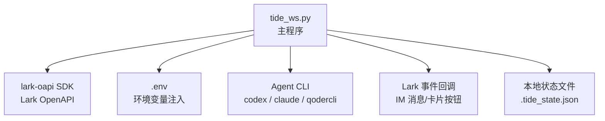
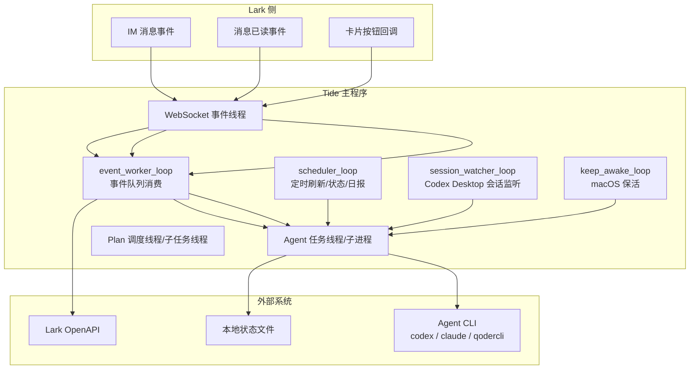
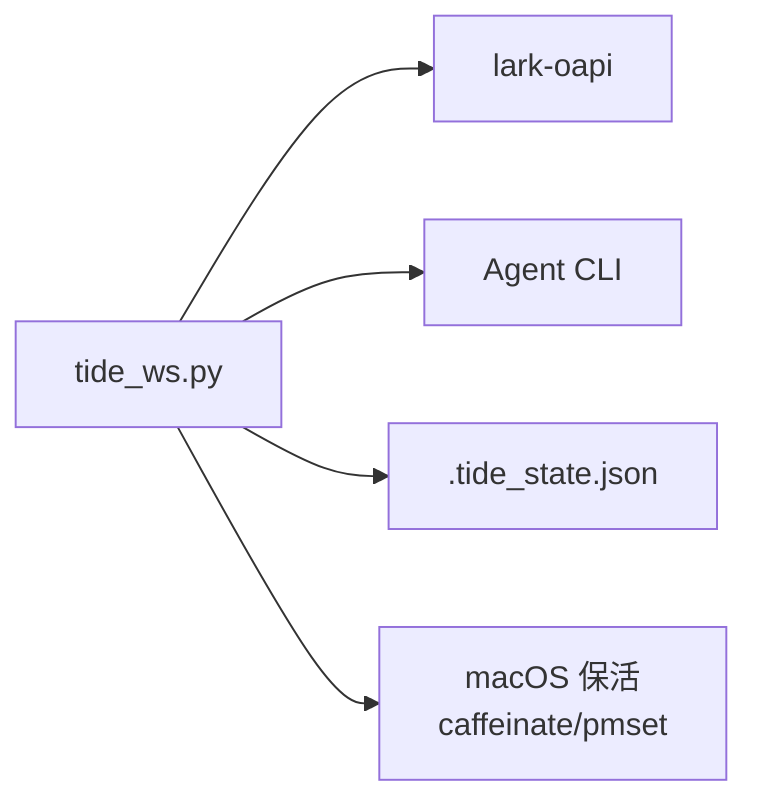

# 部署配置

<cite>
**本文引用的文件**
- [README.md](file://README.md)
- [tide_ws.py](file://tide_ws.py)
- [DEVELOPMENT.md](file://DEVELOPMENT.md)
</cite>

## 目录
1. [简介](#简介)
2. [项目结构](#项目结构)
3. [核心组件](#核心组件)
4. [架构总览](#架构总览)
5. [详细组件分析](#详细组件分析)
6. [依赖分析](#依赖分析)
7. [性能考虑](#性能考虑)
8. [故障排查指南](#故障排查指南)
9. [结论](#结论)
10. [附录](#附录)

## 简介
本文件面向生产环境部署 Tide，聚焦以下方面：
- 服务器环境准备与系统依赖
- 依赖安装步骤（pip 安装 lark-oapi）
- Lark 应用配置（App ID、App Secret、加密密钥、验证令牌）
- Agent CLI 配置（Codex、Claude Code、Qoder CLI 路径与参数）
- 环境变量配置文件 .env 的格式与全部可用配置项（Lark、Agent、超时、权限、卡片、日志、macOS 保活等）
- 不同操作系统（Linux、macOS、Windows）的部署差异与注意事项
- 防火墙、网络访问权限与安全建议

## 项目结构
仓库包含一个主程序与一份部署/使用说明文档，核心文件如下：
- tide_ws.py：主程序，负责 Lark WebSocket、消息卡片、Agent 执行、审批、会话同步与 macOS 保活
- README.md：功能、安装、运行、Lark 使用方式、环境变量与常见问题等
- DEVELOPMENT.md：开发设计、运行模型、审批模型、/plan 并行模式、macOS 保活等背景说明

图表来源
- [tide_ws.py:34-49](file://tide_ws.py#L34-L49)
- [tide_ws.py:56-60](file://tide_ws.py#L56-L60)
- [README.md:17-26](file://README.md#L17-L26)

章节来源
- [README.md:17-26](file://README.md#L17-L26)
- [README.md:49-152](file://README.md#L49-L152)
- [tide_ws.py:34-49](file://tide_ws.py#L34-L49)

## 核心组件
- Lark 应用与事件订阅：通过 Lark OpenAPI 的事件回调（消息、已读、卡片按钮）驱动业务流程
- Agent 适配器：抽象 Codex、Claude Code、Qoder CLI 的命令构建与事件解析
- 任务与会话管理：任务运行态、会话索引、审批、Plan 并行与工作树隔离
- macOS 保活：接入电源时自动保持脚本与网络活跃，必要时禁用睡眠

章节来源
- [tide_ws.py:626-798](file://tide_ws.py#L626-L798)
- [tide_ws.py:1642-1757](file://tide_ws.py#L1642-L1757)
- [DEVELOPMENT.md:21-31](file://DEVELOPMENT.md#L21-L31)

## 架构总览
Tide 以单进程 WebSocket 客户端为核心，围绕 Lark 事件与 Agent CLI 任务形成闭环。事件经由 Lark SDK 注册回调，主线程串行消费事件队列，调度器定时刷新任务卡、发送状态与日报，Agent 任务线程/子进程执行具体指令，Plan 调度线程并行执行子任务。

图表来源
- [DEVELOPMENT.md:21-31](file://DEVELOPMENT.md#L21-L31)
- [tide_ws.py:1642-1757](file://tide_ws.py#L1642-L1757)

## 详细组件分析

### 服务器环境准备与系统依赖
- Python 版本要求：Python 3.10+
- Agent CLI：至少安装并可用以下任一或多个 CLI
  - Codex CLI：命令名默认为 codex
  - Claude Code CLI：命令名默认为 claude
  - Qoder CLI：命令名默认为 qodercli
- macOS 保活依赖系统命令：caffeinate、pmset（仅 macOS）

章节来源
- [README.md:19-31](file://README.md#L19-L31)
- [README.md:67-73](file://README.md#L67-L73)

### 依赖安装步骤
- 安装 Python 依赖：pip3 install lark-oapi
- 准备 Agent CLI：确保 codex、claude、qodercli 命令可用

章节来源
- [README.md:24-26](file://README.md#L24-L26)
- [README.md:67-73](file://README.md#L67-L73)

### Lark 应用配置
- 在 Lark 开发者后台创建自建应用，至少配置以下项：
  - LARK_APP_ID
  - LARK_APP_SECRET
  - LARK_ENCRYPT_KEY（事件订阅 Encrypt Key）
  - LARK_VERIFICATION_TOKEN（事件订阅 Verification Token）
- 机器人能力与权限：启用机器人能力，加入目标群聊；开通 IM 权限（收发消息、下载资源、卡片按钮回调）
- 事件订阅：WebSocket 长连接，注册消息接收、消息已读、卡片按钮回调事件

章节来源
- [README.md:33-47](file://README.md#L33-L47)
- [tide_ws.py:1642-1651](file://tide_ws.py#L1642-L1651)

### Agent CLI 配置
- 默认 Agent：DEFAULT_AGENT_ID（codex、claude、qoder）
- Codex CLI
  - 命令路径：CODEX_BIN（默认 codex）
  - 会话目录：CODEX_SESSIONS_DIR（默认 ~/.codex/sessions）
  - 默认工作目录：CODEX_DEFAULT_CWD（默认当前目录）
  - 项目根目录：CODEX_PROJECTS_ROOT（默认 CODEX_DEFAULT_CWD 的父目录）
  - 超时：CODEX_TIMEOUT_SECONDS（默认 1800 秒）
  - 默认模型：CODEX_MODEL（为空时使用 CLI 自身配置）
  - 审批策略与沙箱模式：CODEX_APPROVAL_POLICY、CODEX_SANDBOX_MODE
  - 批准后重试策略：APPROVED_CODEX_APPROVAL_POLICY、APPROVED_CODEX_SANDBOX_MODE
  - 允许根目录：CODEX_ALLOWED_ROOTS（多个路径用 : 或 , 分隔）
- Claude Code CLI
  - 命令路径：CLAUDE_BIN（默认 claude）
  - 会话目录：CLAUDE_PROJECTS_DIR（默认 ~/.claude/projects）
  - 超时：CLAUDE_TIMEOUT_SECONDS（默认等于 CODEX_TIMEOUT_SECONDS）
  - 默认模型：CLAUDE_MODEL（为空时使用 CLI 自身配置）
  - 权限模式：CLAUDE_PERMISSION_MODE（默认 dontAsk）
  - 批准后重试权限模式：APPROVED_CLAUDE_PERMISSION_MODE（默认 acceptEdits）
  - 额外参数：CLAUDE_EXTRA_ARGS（按 shell 规则解析）
- Qoder CLI
  - 命令路径：QODER_BIN（默认 qodercli）
  - 会话目录：QODER_PROJECTS_DIR（默认 ~/.qoder/projects）
  - 超时：QODER_TIMEOUT_SECONDS（默认等于 CODEX_TIMEOUT_SECONDS）
  - Quest 模式超时：QODER_QUEST_TIMEOUT_SECONDS（默认 12 小时）
  - 默认模型：QODER_MODEL（为空时使用 CLI 自身配置）
  - 权限模式：QODER_PERMISSION_MODE（默认 dont_ask；支持 default、accept_edits、bypass_permissions、dont_ask、auto）
  - 批准后重试权限模式：APPROVED_QODER_PERMISSION_MODE（默认 bypass_permissions）
  - 额外参数：QODER_EXTRA_ARGS（按 shell 规则解析）
  - HOME 覆盖：QODER_PROCESS_HOME（为空时从 QODER_HOME 推导）

章节来源
- [README.md:319-368](file://README.md#L319-L368)
- [tide_ws.py:62-91](file://tide_ws.py#L62-L91)
- [tide_ws.py:579-613](file://tide_ws.py#L579-L613)
- [tide_ws.py:771-798](file://tide_ws.py#L771-L798)

### 环境变量配置文件 .env 的格式与可用项
- .env 文件格式：键值对，每行一个配置项，支持注释（# 开头），值可带引号
- 加载机制：启动时自动读取 .env 并注入到 os.environ（仅当环境变量未设置时才注入）
- 关键配置项（节选）
  - Lark 相关：LARK_APP_ID、LARK_APP_SECRET、LARK_DOMAIN、LARK_ENCRYPT_KEY、LARK_VERIFICATION_TOKEN
  - Agent 相关：DEFAULT_AGENT_ID、CODEX_*、CLAUDE_*、QODER_*、QODER_PROCESS_HOME
  - 访问控制：LARK_ALLOWED_CHAT_IDS、LARK_ALLOWED_OPEN_IDS、LARK_ADMIN_OPEN_IDS、LARK_REQUIRE_KNOWN_CHAT
  - 卡片与消息：LARK_MESSAGE_CHUNK_SIZE、LARK_FINAL_REPLY_MAX_CHARS、LARK_FINAL_QUESTION_MAX_CHARS、MAX_PROJECTS_IN_PANEL、MAX_CONVERSATIONS_IN_PANEL、MAX_SESSION_FILES、MAX_RUNNING_TASKS、MAX_RUNNING_TASKS_PER_CHAT、LARK_EVENT_QUEUE_MAXSIZE、LARK_ATTACHMENTS_DIR、LARK_ATTACHMENT_MAX_BYTES、LARK_PENDING_ATTACHMENT_TTL_SECONDS、MAX_LARK_ATTACHMENTS_PER_MESSAGE、MAX_LARK_MESSAGE_REFS、TASK_CARD_REFRESH_INTERVAL_SECONDS、PLAN_MAX_PARALLEL、PLAN_TASK_OUTPUT_MAX_CHARS、PLAN_USE_WORKTREES、PLAN_WORKTREE_ROOT、PLAN_TEST_COMMAND、PLAN_TEST_COMMAND_SHELL、PLAN_TEST_TIMEOUT_SECONDS
  - 审批：PENDING_APPROVAL_WAIT_SECONDS、PENDING_APPROVAL_POLL_SECONDS
  - 状态、同步与持久化：STATUS_INTERVAL_SECONDS、DAILY_REPORT_TIME、TIDE_STATE_FILE、TIDE_SHOW_ARCHIVED、TIDE_INCLUDE_PLAN_WORKTREES、TIDE_WELCOME_MESSAGE、SYNC_DESKTOP_SESSIONS、SESSION_WATCH_INTERVAL_SECONDS、LARK_CARD_ENABLE_FORWARD、LOG_MESSAGE_CONTENT、LOG_LEVEL
  - macOS 保活：KEEP_AWAKE_ON_AC_POWER、KEEP_AWAKE_CHECK_INTERVAL_SECONDS、KEEP_AWAKE_DISABLE_SLEEP

章节来源
- [tide_ws.py:34-49](file://tide_ws.py#L34-L49)
- [README.md:317-456](file://README.md#L317-L456)

### 不同操作系统（Linux、macOS、Windows）的部署差异与注意事项
- Linux
  - 无需 macOS 保活特性（caffeinate/pmset），可按常规后台运行
  - 确保 Agent CLI 在 PATH 中可用
- macOS
  - 支持接入电源自动保持活跃（caffeinate）与可选禁用睡眠（pmset disablesleep）
  - 合盖运行需谨慎，建议接电源、外接显示器、键盘与鼠标
  - 如需禁用睡眠，可能需要管理员权限；失败时可在日志中看到提示
- Windows
  - 未在仓库中提供官方支持说明；如需在 Windows 上运行，需自行验证 Agent CLI 可用性与路径配置

章节来源
- [README.md:439-456](file://README.md#L439-L456)
- [tide_ws.py:1655-1757](file://tide_ws.py#L1655-L1757)

### 防火墙、网络访问权限与安全建议
- 网络访问
  - WebSocket 长连接需可访问 Lark OpenAPI 域名（默认 https://open.larksuite.com，国内飞书可按实际环境调整）
  - 事件回调与卡片按钮需可访问 Lark 服务
- 权限与令牌
  - LARK_APP_ID、LARK_APP_SECRET、LARK_ENCRYPT_KEY、LARK_VERIFICATION_TOKEN 必须正确配置
  - 事件订阅使用 Encrypt Key 与 Verification Token 进行解密与校验
- 安全建议
  - 不要在代码中硬编码 App Secret；通过 .env 或环境变量注入
  - 限制允许使用 bridge 的群聊与用户（LARK_ALLOWED_CHAT_IDS、LARK_ALLOWED_OPEN_IDS、LARK_ADMIN_OPEN_IDS）
  - 仅在必要时开启 LARK_CARD_ENABLE_FORWARD
  - 审批流程必须在 Lark 中完成，避免直接在本地执行高危命令
  - 审批超时与轮询间隔（PENDING_APPROVAL_WAIT_SECONDS、PENDING_APPROVAL_POLL_SECONDS）可根据团队响应速度调整

章节来源
- [README.md:33-47](file://README.md#L33-L47)
- [README.md:370-377](file://README.md#L370-L377)
- [README.md:406-411](file://README.md#L406-L411)
- [tide_ws.py:1642-1651](file://tide_ws.py#L1642-L1651)

## 依赖分析
- Lark SDK：lark-oapi，用于事件回调注册与消息/资源接口调用
- Agent CLI：codex、claude、qodercli，通过命令行与流式 JSON 输出进行交互
- 本地状态：.tide_state.json，保存已知 chat、运行面板状态与 Plan/子任务状态
- macOS 保活：caffeinate、pmset，仅在 macOS 生效

图表来源
- [tide_ws.py:21-31](file://tide_ws.py#L21-L31)
- [tide_ws.py:1655-1757](file://tide_ws.py#L1655-L1757)

章节来源
- [tide_ws.py:21-31](file://tide_ws.py#L21-L31)
- [tide_ws.py:1655-1757](file://tide_ws.py#L1655-L1757)

## 性能考虑
- 事件队列容量：LARK_EVENT_QUEUE_MAXSIZE 控制积压上限，避免内存膨胀
- 并发控制：MAX_RUNNING_TASKS、MAX_RUNNING_TASKS_PER_CHAT 控制全局与单聊天并发，避免资源争用
- Plan 并行：PLAN_MAX_PARALLEL 控制 /plan 子任务并发上限
- 超时设置：各 Agent 的 TIMEOUT_SECONDS 与 QODER_QUEST_TIMEOUT_SECONDS 需结合任务复杂度与资源限制合理配置
- 日志级别：LOG_LEVEL 控制日志输出，生产环境建议 INFO 或更高

章节来源
- [README.md:391-396](file://README.md#L391-L396)
- [README.md:398-404](file://README.md#L398-L404)
- [README.md:427](file://README.md#L427)

## 故障排查指南
- 收不到 Lark 消息
  - 确认机器人已加入目标群聊
  - 确认 Lark 应用已发布并开通 IM 权限
  - 检查 LARK_APP_ID、LARK_APP_SECRET、LARK_ENCRYPT_KEY、LARK_VERIFICATION_TOKEN
  - 查看日志中是否存在 send_card/send_msg 失败或权限错误
- 审批批准后未继续执行
  - 确认脚本已重启并加载最新代码
  - 检查批准后的配置（APPROVED_CODEX_APPROVAL_POLICY、APPROVED_CODEX_SANDBOX_MODE、APPROVED_CLAUDE_PERMISSION_MODE、APPROVED_QODER_PERMISSION_MODE）
- Git 提交失败
  - 若出现 .git/index.lock 权限相关错误，通常为 Codex sandbox 权限不足；通过审批后脚本会用批准后的配置单次重试
- 电脑仍然睡眠
  - 仅防止普通 idle sleep 时默认 caffeinate 即可
  - MacBook 合盖睡眠不一定能阻止；稳定方案为接电源、外接显示器、键盘与鼠标
  - 无外接显示器合盖运行需开启 KEEP_AWAKE_DISABLE_SLEEP 或手动 sudo pmset -a disablesleep 1

章节来源
- [README.md:476-510](file://README.md#L476-L510)

## 结论
Tide 的生产部署需要：
- 准备满足 Python 3.10+ 的运行环境与所需 Agent CLI
- 正确配置 Lark 应用与事件订阅密钥/令牌
- 通过 .env 设置 Lark、Agent、超时、权限、卡片、日志与 macOS 保活等关键参数
- 在 Linux/macOS/Windows 上按平台差异进行部署与运维
- 遵循网络访问与安全最佳实践，确保事件回调与消息通道畅通

## 附录
- 启动与后台运行
  - 前台运行：python3 tide_ws.py
  - 后台运行：nohup python3 tide_ws.py > tide_ws.log 2>&1 &
  - 查询进程：pgrep -fl tide_ws.py 或 ps aux | grep '[l]ark2agent_ws.py'
  - 查看日志：tail -n 100 tide_ws.log 或 tail -f tide_ws.log
  - 停止：pkill -f tide_ws.py
  - Lark 中重启：/restart（会先提示并清理 macOS 保活状态，再原地重启）
- Lark 使用方式
  - 常用指令：/panel、/projects、/convos、/status、/daily、/restart、/stop、/plan 等
  - 图片/文件附件：自动下载至 .tide/attachments/<chat_id>/<message_id>/，支持自动消费与引用找回

章节来源
- [README.md:75-152](file://README.md#L75-L152)
- [README.md:154-210](file://README.md#L154-L210)
- [README.md:211-244](file://README.md#L211-L244)