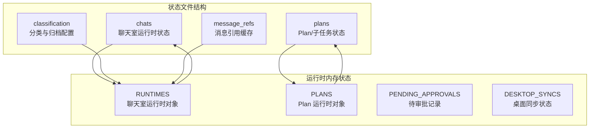
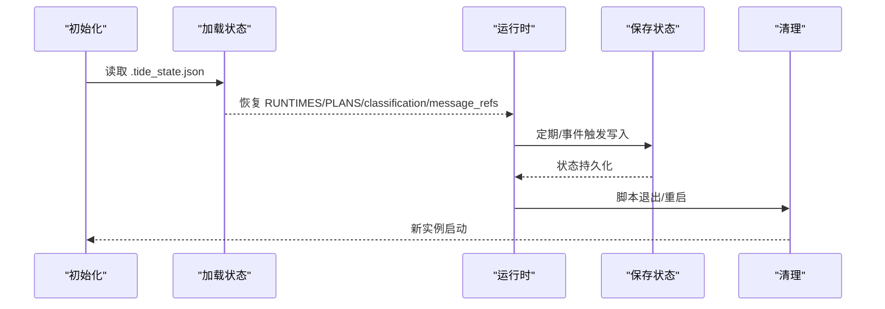
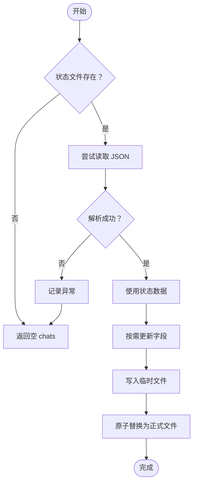
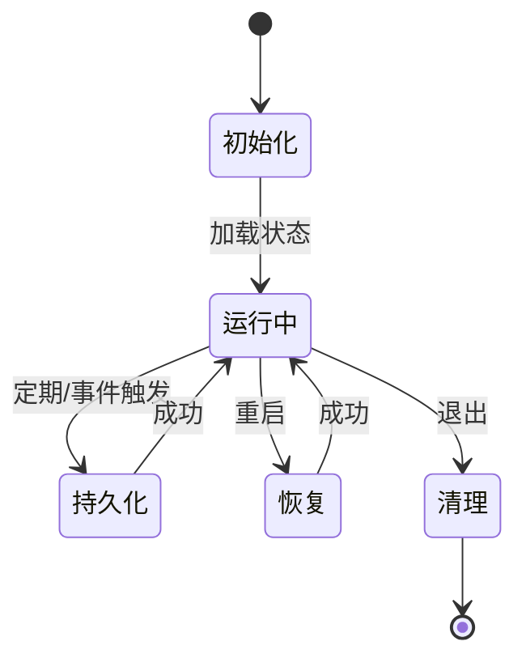
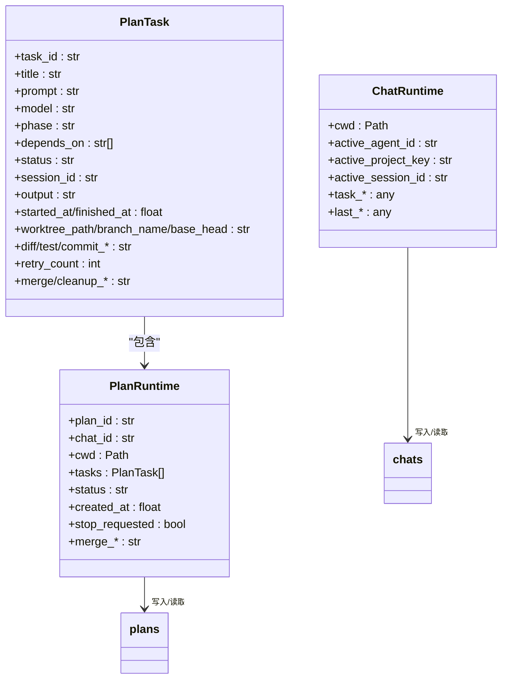
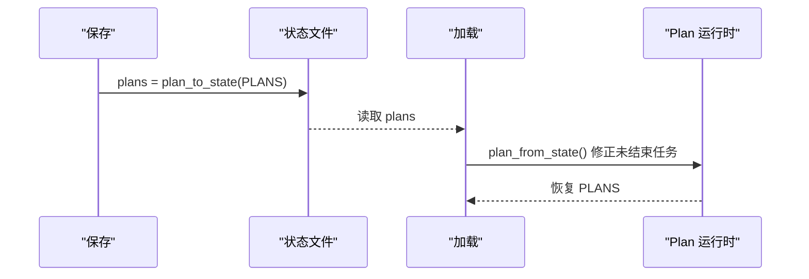
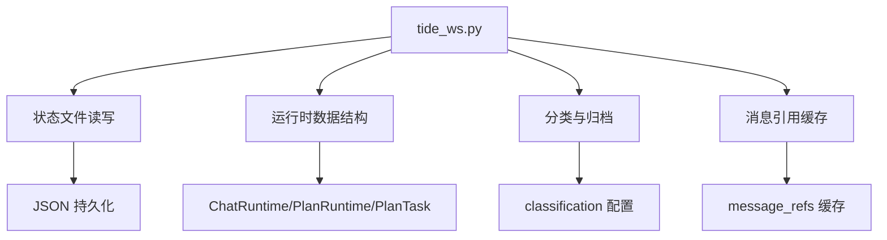

# 状态文件管理

<cite>
**本文档引用的文件**
- [tide_ws.py](file://tide_ws.py)
- [README.md](file://README.md)
</cite>

## 目录
1. [简介](#简介)
2. [项目结构](#项目结构)
3. [核心组件](#核心组件)
4. [架构概览](#架构概览)
5. [详细组件分析](#详细组件分析)
6. [依赖关系分析](#依赖关系分析)
7. [性能考虑](#性能考虑)
8. [故障排除指南](#故障排除指南)
9. [结论](#结论)
10. [附录](#附录)

## 简介
本文件系统性阐述 Tide 的状态文件管理系统，重点围绕 `.tide_state.json` 的结构、用途、生命周期管理与持久化策略。该状态文件承载以下关键信息：
- 已知聊天室记录（chats）
- 运行面板状态（当前工作目录、默认 Agent、活动会话、任务状态等）
- Plan 与子任务状态（计划 ID、任务 ID、状态、输出、工作树路径、分支名、提交信息等）
- 归档项目与对话的跟踪信息（分类配置：项目路径、普通会话、归档项目路径、归档会话）
- Lark 消息引用缓存（message_refs）

状态文件采用 JSON 格式，提供加载、保存与更新机制，确保脚本重启后可恢复运行时状态。

## 项目结构
- 状态文件位置：默认位于工作目录下的 `.tide_state.json`，可通过环境变量 `TIDE_STATE_FILE` 自定义。
- 状态文件作用域：
  - chats：记录每个 Lark chat 的运行时状态
  - plans：记录 Plan 与子任务的运行状态
  - classification：记录项目/会话的分类与归档状态
  - message_refs：记录 Lark 消息引用关系，便于回复/引用上下文恢复

**图表来源**
- [tide_ws.py:869-891](file://tide_ws.py#L869-L891)
- [tide_ws.py:983-1014](file://tide_ws.py#L983-L1014)
- [tide_ws.py:1152-1157](file://tide_ws.py#L1152-L1157)
- [tide_ws.py:2028-2057](file://tide_ws.py#L2028-L2057)
- [tide_ws.py:909-953](file://tide_ws.py#L909-L953)

**章节来源**
- [README.md:418-418](file://README.md#L418-L418)
- [tide_ws.py:126-126](file://tide_ws.py#L126-L126)

## 核心组件
- 状态文件读取与写入
  - 读取：`read_state()`，若文件不存在或读取失败，返回默认结构 `{"chats": {}}`
  - 写入：`write_state()`，先写入临时文件，设置权限 0600，再原子替换为正式文件
- 聊天室运行时状态持久化
  - `save_runtime(chat_id)`：将 RUNTIMES 中的 ChatRuntime 对象序列化到 chats
  - `load_known_chats()`：从状态文件恢复 RUNTIMES
- Plan/子任务状态持久化
  - `save_plans_state()`：将 PLANS 中的 PlanRuntime 序列化到 plans
  - `load_plans_state()`：从状态文件恢复 PLANS
- 归档与分类配置
  - `classification_state()`：访问 classification 配置
  - `marked_project_paths()`、`marked_ordinary_sessions()`、`archived_project_paths()`、`archived_sessions()`：读取分类与归档集合
  - `archive_project_path()`、`archive_session_id()`：更新归档集合
- Lark 消息引用缓存
  - `record_lark_message_ref()`：记录消息引用关系
  - `find_lark_message_ref()`、`find_lark_thread_ref()`：查找引用

**章节来源**
- [tide_ws.py:869-891](file://tide_ws.py#L869-L891)
- [tide_ws.py:983-1014](file://tide_ws.py#L983-L1014)
- [tide_ws.py:1017-1042](file://tide_ws.py#L1017-L1042)
- [tide_ws.py:1152-1157](file://tide_ws.py#L1152-L1157)
- [tide_ws.py:1160-1172](file://tide_ws.py#L1160-L1172)
- [tide_ws.py:2028-2057](file://tide_ws.py#L2028-L2057)
- [tide_ws.py:909-953](file://tide_ws.py#L909-L953)
- [tide_ws.py:956-980](file://tide_ws.py#L956-L980)

## 架构概览
状态文件管理贯穿于脚本生命周期，提供初始化、持久化、恢复与清理能力：

**图表来源**
- [tide_ws.py:869-891](file://tide_ws.py#L869-L891)
- [tide_ws.py:1017-1042](file://tide_ws.py#L1017-L1042)
- [tide_ws.py:1160-1172](file://tide_ws.py#L1160-L1172)
- [tide_ws.py:983-1014](file://tide_ws.py#L983-L1014)

## 详细组件分析

### 状态文件结构与字段定义
- 文件位置与默认值
  - 默认文件名：`.tide_state.json`
  - 可通过环境变量 `TIDE_STATE_FILE` 自定义
- 结构组成
  - chats：键为 Lark chat_id，值为聊天室运行时状态对象
  - plans：键为 Plan ID，值为 Plan 运行时状态对象
  - classification：分类与归档配置
    - project_paths：项目路径映射
    - ordinary_sessions：普通会话集合
    - archived_project_paths：归档项目路径集合
    - archived_sessions：归档会话集合
  - message_refs：消息引用缓存，键为 `chat_id:message_id`，值为引用元数据

字段类型与约束
- chats 中各字段均为字符串或数值类型，部分字段为布尔值
- plans 中包含嵌套数组与对象，需保证序列化兼容性
- classification 中集合元素为字符串或路径字符串
- message_refs 中包含时间戳字段，用于裁剪与排序

**章节来源**
- [README.md:418-418](file://README.md#L418-L418)
- [tide_ws.py:126-126](file://tide_ws.py#L126-L126)
- [tide_ws.py:983-1014](file://tide_ws.py#L983-L1014)
- [tide_ws.py:1152-1157](file://tide_ws.py#L1152-L1157)
- [tide_ws.py:2028-2057](file://tide_ws.py#L2028-L2057)
- [tide_ws.py:909-953](file://tide_ws.py#L909-L953)

### 加载、保存与更新机制
- 加载流程
  - 若状态文件不存在，返回空 chats
  - 若文件存在但解析失败，记录异常并返回空 chats
- 保存流程
  - 写入临时文件，设置权限 0600
  - 原子替换为正式文件，再次设置权限 0600
- 更新策略
  - 聊天室运行时：每次运行时更新 chats
  - Plan/子任务：定期或事件触发更新 plans
  - 归档与分类：通过专用函数更新 classification
  - 消息引用：记录新引用并裁剪超出上限的条目

**图表来源**
- [tide_ws.py:869-891](file://tide_ws.py#L869-L891)
- [tide_ws.py:879-891](file://tide_ws.py#L879-L891)

**章节来源**
- [tide_ws.py:869-891](file://tide_ws.py#L869-L891)
- [tide_ws.py:879-891](file://tide_ws.py#L879-L891)

### 生命周期管理
- 初始化
  - 启动时读取状态文件，恢复 RUNTIMES、PLANS、classification、message_refs
- 运行期
  - 持续更新状态：聊天室运行时、Plan/子任务、消息引用
- 恢复
  - 脚本重启后优先从状态文件恢复，确保运行连续性
- 清理
  - 退出时确保状态文件权限正确，避免敏感信息泄露

**图表来源**
- [tide_ws.py:1017-1042](file://tide_ws.py#L1017-L1042)
- [tide_ws.py:1160-1172](file://tide_ws.py#L1160-L1172)
- [tide_ws.py:983-1014](file://tide_ws.py#L983-L1014)

**章节来源**
- [tide_ws.py:1017-1042](file://tide_ws.py#L1017-L1042)
- [tide_ws.py:1160-1172](file://tide_ws.py#L1160-L1172)
- [tide_ws.py:983-1014](file://tide_ws.py#L983-L1014)

### 与运行时内存状态的关系与同步
- RUNTIMES 与 chats
  - 通过 `save_runtime()` 将 ChatRuntime 写入 chats
  - 通过 `load_known_chats()` 从 chats 恢复 RUNTIMES
- PLANS 与 plans
  - 通过 `save_plans_state()` 将 PlanRuntime 写入 plans
  - 通过 `load_plans_state()` 从 plans 恢复 PLANS
- 归档与分类
  - 通过 `update_classification()` 更新 classification
  - 通过 `marked_project_paths()`、`archived_project_paths()` 等读取集合
- 消息引用
  - 通过 `record_lark_message_ref()`、`find_lark_message_ref()`、`find_lark_thread_ref()` 管理 message_refs

**图表来源**
- [tide_ws.py:209-235](file://tide_ws.py#L209-L235)
- [tide_ws.py:372-385](file://tide_ws.py#L372-L385)
- [tide_ws.py:343-369](file://tide_ws.py#L343-L369)
- [tide_ws.py:983-1014](file://tide_ws.py#L983-L1014)
- [tide_ws.py:1152-1157](file://tide_ws.py#L1152-L1157)

**章节来源**
- [tide_ws.py:983-1014](file://tide_ws.py#L983-L1014)
- [tide_ws.py:1152-1157](file://tide_ws.py#L1152-L1157)
- [tide_ws.py:1017-1042](file://tide_ws.py#L1017-L1042)
- [tide_ws.py:1160-1172](file://tide_ws.py#L1160-L1172)

### 归档项目与对话的跟踪
- 归档操作
  - 项目归档：`archive_project_path()` 更新归档项目路径集合
  - 会话归档：`archive_session_id()` 更新归档会话集合
- 查询与过滤
  - `is_project_archived()`、`is_session_archived()` 判断是否归档
  - `TIDE_SHOW_ARCHIVED` 控制查询结果是否包含归档项
- 分类配置
  - `classification_state()` 提供分类配置访问入口
  - `marked_project_paths()`、`marked_ordinary_sessions()` 提供分类集合

**章节来源**
- [tide_ws.py:2135-2164](file://tide_ws.py#L2135-L2164)
- [tide_ws.py:2677-2684](file://tide_ws.py#L2677-L2684)
- [tide_ws.py:2028-2057](file://tide_ws.py#L2028-L2057)

### Plan 与子任务状态的持久化
- Plan 序列化/反序列化
  - `plan_to_state()`：PlanRuntime → dict
  - `plan_from_state()`：dict → PlanRuntime（对未结束子任务进行状态修正）
- 子任务序列化/反序列化
  - `plan_task_to_state()`：PlanTask → dict
  - `plan_task_from_state()`：dict → PlanTask（对未结束子任务进行状态修正）
- 状态恢复策略
  - 重启后未结束的子任务标记为失败，提示手动重试

**图表来源**
- [tide_ws.py:1045-1071](file://tide_ws.py#L1045-L1071)
- [tide_ws.py:1074-1107](file://tide_ws.py#L1074-L1107)
- [tide_ws.py:1110-1123](file://tide_ws.py#L1110-L1123)
- [tide_ws.py:1126-1149](file://tide_ws.py#L1126-L1149)
- [tide_ws.py:1152-1157](file://tide_ws.py#L1152-L1157)
- [tide_ws.py:1160-1172](file://tide_ws.py#L1160-L1172)

**章节来源**
- [tide_ws.py:1045-1107](file://tide_ws.py#L1045-L1107)
- [tide_ws.py:1110-1149](file://tide_ws.py#L1110-L1149)
- [tide_ws.py:1152-1172](file://tide_ws.py#L1152-L1172)

### 备份与迁移策略
- 备份
  - 建议在修改配置或升级前复制状态文件：`cp .tide_state.json .tide_state.json.bak`
- 迁移
  - 版本升级后若出现兼容性问题，可使用备份文件回滚
  - 若状态文件损坏，可删除后重启脚本，系统将重建默认结构
- 版本兼容性
  - 读取失败时返回空 chats，确保系统可继续运行
  - Plan/子任务在重启后未结束的任务会被标记为失败，需手动重试

**章节来源**
- [tide_ws.py:869-891](file://tide_ws.py#L869-L891)
- [tide_ws.py:1074-1081](file://tide_ws.py#L1074-L1081)

## 依赖关系分析
- 外部依赖
  - Python 标准库：json、os、pathlib、threading、time
  - 第三方库：lark-oapi（用于 Lark 事件处理）
- 内部依赖
  - 数据结构：ChatRuntime、PlanRuntime、PlanTask
  - 状态管理：read_state、write_state、save_runtime、load_known_chats、save_plans_state、load_plans_state
  - 分类与归档：classification_state、marked_project_paths、archived_project_paths、archive_project_path、archive_session_id

**图表来源**
- [tide_ws.py:869-891](file://tide_ws.py#L869-L891)
- [tide_ws.py:983-1014](file://tide_ws.py#L983-L1014)
- [tide_ws.py:1152-1157](file://tide_ws.py#L1152-L1157)
- [tide_ws.py:2028-2057](file://tide_ws.py#L2028-L2057)
- [tide_ws.py:909-953](file://tide_ws.py#L909-L953)

**章节来源**
- [tide_ws.py:869-891](file://tide_ws.py#L869-L891)
- [tide_ws.py:983-1014](file://tide_ws.py#L983-L1014)
- [tide_ws.py:1152-1157](file://tide_ws.py#L1152-L1157)
- [tide_ws.py:2028-2057](file://tide_ws.py#L2028-L2057)
- [tide_ws.py:909-953](file://tide_ws.py#L909-L953)

## 性能考虑
- 文件 I/O
  - 使用临时文件 + 原子替换减少竞态条件
  - 设置文件权限 0600，降低安全风险
- 内存占用
  - message_refs 通过裁剪上限控制内存增长
  - classification 与 plans 仅在需要时读取
- 并发安全
  - 使用锁保护状态文件写入与运行时状态更新

[本节为通用指导，无需特定文件分析]

## 故障排除指南
- 症状：状态文件损坏或无法读取
  - 现象：读取失败，系统返回空 chats
  - 处理：删除状态文件后重启，系统将重建默认结构
- 症状：重启后 Plan 子任务未结束
  - 现象：未结束子任务被标记为失败
  - 处理：在 Plan 面板中重试相应子任务
- 症状：消息引用丢失
  - 现象：回复/引用上下文无法恢复
  - 处理：确认 message_refs 未超过上限；必要时清理或增大上限

**章节来源**
- [tide_ws.py:869-891](file://tide_ws.py#L869-L891)
- [tide_ws.py:1074-1081](file://tide_ws.py#L1074-L1081)
- [tide_ws.py:897-907](file://tide_ws.py#L897-L907)

## 结论
Tide 的状态文件管理系统通过 JSON 文件实现了运行时状态的可靠持久化，涵盖聊天室运行时、Plan/子任务、归档与分类、消息引用等关键领域。其设计强调安全性（权限控制）、可靠性（原子替换）与可恢复性（重启后状态恢复）。遵循本文档的备份与迁移策略，可在升级与维护过程中最大限度保障业务连续性。

[本节为总结性内容，无需特定文件分析]

## 附录

### 状态文件格式规范
- 文件名：`.tide_state.json`
- 默认位置：工作目录
- 可配置项：`TIDE_STATE_FILE`
- 结构字段
  - chats：键为 chat_id，值为聊天室运行时状态对象
  - plans：键为 plan_id，值为 Plan 运行时状态对象
  - classification：包含 project_paths、ordinary_sessions、archived_project_paths、archived_sessions
  - message_refs：键为 chat_id:message_id，值为引用元数据

**章节来源**
- [README.md:418-418](file://README.md#L418-L418)
- [tide_ws.py:126-126](file://tide_ws.py#L126-L126)
- [tide_ws.py:983-1014](file://tide_ws.py#L983-L1014)
- [tide_ws.py:1152-1157](file://tide_ws.py#L1152-L1157)
- [tide_ws.py:2028-2057](file://tide_ws.py#L2028-L2057)
- [tide_ws.py:909-953](file://tide_ws.py#L909-L953)