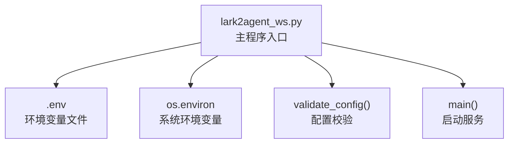

# 环境变量配置

<cite>
**本文引用的文件**
- [README.md](file://README.md)
- [lark2agent_ws.py](file://lark2agent_ws.py)
</cite>

## 目录
1. [简介](#简介)
2. [项目结构与配置入口](#项目结构与配置入口)
3. [核心配置系统](#核心配置系统)
4. [Lark 应用配置](#lark-应用配置)
5. [Agent CLI 配置](#agent-cli-配置)
6. [访问控制配置](#访问控制配置)
7. [卡片与消息配置](#卡片与消息配置)
8. [审批配置](#审批配置)
9. [状态与持久化配置](#状态与持久化配置)
10. [macOS 保活配置](#macos-保活配置)
11. [配置加载顺序与优先级](#配置加载顺序与优先级)
12. [配置验证与常见错误](#配置验证与常见错误)
13. [使用场景与推荐模板](#使用场景与推荐模板)
14. [故障排查指南](#故障排查指南)
15. [结论](#结论)

## 简介
本文件系统性梳理 Lark2Agent 的环境变量配置体系，覆盖 Lark 应用、Agent CLI、访问控制、卡片消息、审批、状态持久化与 macOS 保活等全部配置项。文档提供默认值、用途说明、使用示例与最佳实践，并解释配置加载顺序、优先级与覆盖规则，附带验证方法、常见错误与解决方案，以及不同使用场景的推荐配置模板。

## 项目结构与配置入口
- 主程序入口负责加载 .env 并初始化全局配置，随后进行配置校验与启动各功能线程。
- README 提供了完整的变量表格与说明，便于快速查阅。

图表来源
- [lark2agent_ws.py:33-47](file://lark2agent_ws.py#L33-L47)
- [lark2agent_ws.py:8531-8557](file://lark2agent_ws.py#L8531-L8557)
- [lark2agent_ws.py:8559-8584](file://lark2agent_ws.py#L8559-L8584)

章节来源
- [lark2agent_ws.py:33-47](file://lark2agent_ws.py#L33-L47)
- [lark2agent_ws.py:8531-8557](file://lark2agent_ws.py#L8531-L8557)
- [lark2agent_ws.py:8559-8584](file://lark2agent_ws.py#L8559-L8584)

## 核心配置系统
- 配置加载顺序
  1) 读取 .env 文件（若存在），逐行解析键值并注入到 os.environ（仅当该键尚未存在于 os.environ 时）。
  2) 读取系统环境变量（如通过 export 设置），其优先级高于 .env 中的同名键。
  3) 对于未设置的可选配置，采用代码中的默认值。
- 配置验证
  - 启动前执行 validate_config()，校验 Lark 应用必需字段与默认工作目录有效性，并对状态文件权限进行修正。
- 配置覆盖规则
  - 系统环境变量覆盖 .env；未设置时使用代码默认值。

章节来源
- [lark2agent_ws.py:33-47](file://lark2agent_ws.py#L33-L47)
- [lark2agent_ws.py:8531-8557](file://lark2agent_ws.py#L8531-L8557)

## Lark 应用配置
- LARK_APP_ID
  - 默认值：空
  - 说明：Lark 自建应用 App ID
  - 用途：WebSocket 与 OpenAPI 初始化
- LARK_APP_SECRET
  - 默认值：空
  - 说明：Lark 自建应用 App Secret
  - 用途：OpenAPI 签名校验与鉴权
- LARK_DOMAIN
  - 默认值：https://open.larksuite.com
  - 说明：Lark OpenAPI 域名，国内飞书可按实际环境调整
  - 用途：OpenAPI 客户端构建
- LARK_ENCRYPT_KEY
  - 默认值：空
  - 说明：事件订阅 Encrypt Key
  - 用途：消息解密
- LARK_VERIFICATION_TOKEN
  - 默认值：空
  - 说明：事件订阅 Verification Token
  - 用途：事件回调签名校验

使用示例
- 在 .env 中设置：
  - LARK_APP_ID=cli_xxx
  - LARK_APP_SECRET=xxx
  - LARK_ENCRYPT_KEY=xxx
  - LARK_VERIFICATION_TOKEN=xxx

最佳实践
- 始终通过 .env 或 export 注入，不要硬编码到代码中。
- 事件订阅需在开发者后台正确配置 Encrypt Key 与 Verification Token。

章节来源
- [README.md:33-48](file://README.md#L33-L48)
- [lark2agent_ws.py:56-59](file://lark2agent_ws.py#L56-L59)
- [lark2agent_ws.py:8531-8545](file://lark2agent_ws.py#L8531-L8545)

## Agent CLI 配置
- Codex
  - CODEX_DEFAULT_CWD
    - 默认值：当前目录
    - 说明：默认工作目录
  - CODEX_HOME
    - 默认值：~/.codex
    - 说明：Codex home 目录
  - CODEX_SESSIONS_DIR
    - 默认值：$CODEX_HOME/sessions
    - 说明：Codex 会话文件目录
  - CODEX_BIN
    - 默认值：codex
    - 说明：Codex CLI 命令路径
  - CODEX_TIMEOUT_SECONDS
    - 默认值：1800
    - 说明：单次任务超时秒数
  - CODEX_MODEL
    - 默认值：空
    - 说明：默认模型；为空时使用 CLI 自身配置
  - CODEX_PROJECTS_ROOT
    - 默认值：CODEX_DEFAULT_CWD 的父目录
    - 说明：/project=new 创建项目目录的位置
  - CODEX_APPROVAL_POLICY
    - 默认值：on-request
    - 说明：普通任务的 approval policy
  - CODEX_SANDBOX_MODE
    - 默认值：workspace-write
    - 说明：普通任务的 sandbox 模式
  - APPROVED_CODEX_APPROVAL_POLICY
    - 默认值：on-request
    - 说明：审批批准后单次重试使用的 policy
  - APPROVED_CODEX_SANDBOX_MODE
    - 默认值：workspace-write
    - 说明：审批批准后单次重试使用的 sandbox 模式
  - CODEX_ALLOWED_ROOTS
    - 默认值：CODEX_PROJECTS_ROOT 与 CODEX_DEFAULT_CWD
    - 说明：允许执行、/cd、项目创建与 Plan worktree 运行的目录范围，多个路径用 : 或 , 分隔

- Claude Code
  - CLAUDE_BIN
    - 默认值：claude
  - CLAUDE_HOME
    - 默认值：~/.claude
  - CLAUDE_PROJECTS_DIR
    - 默认值：$CLAUDE_HOME/projects
  - CLAUDE_TIMEOUT_SECONDS
    - 默认值：CODEX_TIMEOUT_SECONDS
  - CLAUDE_MODEL
    - 默认值：空
  - CLAUDE_PERMISSION_MODE
    - 默认值：dontAsk
    - 说明：--permission-mode 参数；Bridge 默认不走本机终端弹窗
  - APPROVED_CLAUDE_PERMISSION_MODE
    - 默认值：acceptEdits
    - 说明：审批批准后单次重试使用的 permission mode
  - CLAUDE_EXTRA_ARGS
    - 默认值：空
    - 说明：追加给 Claude CLI 的额外参数，按 shell 规则解析

- Qoder CLI
  - QODER_BIN
    - 默认值：qodercli
  - QODER_HOME
    - 默认值：~/.qoder
  - QODER_PROJECTS_DIR
    - 默认值：$QODER_HOME/projects
  - QODER_PROCESS_HOME
    - 默认值：空
    - 说明：启动 Qoder 子进程时覆盖 HOME；为空时从 $QODER_HOME 自动推导
  - QODER_TIMEOUT_SECONDS
    - 默认值：CODEX_TIMEOUT_SECONDS
  - QODER_QUEST_TIMEOUT_SECONDS
    - 默认值：43200（12 小时）
  - QODER_MODEL
    - 默认值：空
  - QODER_PERMISSION_MODE
    - 默认值：dont_ask
    - 说明：可选 default、accept_edits、bypass_permissions、dont_ask、auto；若误配为 ask，Bridge 会兼容映射为 dont_ask
  - APPROVED_QODER_PERMISSION_MODE
    - 默认值：bypass_permissions
    - 说明：审批批准后单次重试使用的 permission mode；批准后会启动新的 Qoder session，避免继承旧 session 的 dont_ask 拒写状态
  - QODER_EXTRA_ARGS
    - 默认值：空
    - 说明：追加给 Qoder CLI 的额外参数，按 shell 规则解析

使用示例
- 在 .env 中设置：
  - CODEX_DEFAULT_CWD=/path/to/cwd
  - CLAUDE_PERMISSION_MODE=dontAsk
  - QODER_PERMISSION_MODE=dont_ask

最佳实践
- 为不同 Agent 设置独立的 HOME 与 sessions 目录，避免会话冲突。
- 审批批准后重试时，建议使用 APPROVED_* 变量提升权限或模式。

章节来源
- [README.md:319-427](file://README.md#L319-L427)
- [lark2agent_ws.py:62-98](file://lark2agent_ws.py#L62-L98)
- [lark2agent_ws.py:557-613](file://lark2agent_ws.py#L557-L613)

## 访问控制配置
- LARK_ALLOWED_CHAT_IDS
  - 默认值：空
  - 说明：允许使用 bridge 的 Lark 群聊 ID；为空时按 LARK_REQUIRE_KNOWN_CHAT 处理，填 * 表示允许所有群
- LARK_ALLOWED_OPEN_IDS
  - 默认值：空
  - 说明：允许操作 bridge 的用户 open_id；为空表示不按用户过滤
- LARK_ADMIN_OPEN_IDS
  - 默认值：空
  - 说明：可执行审批、停止、重启、切目录、提交等敏感操作的用户 open_id；为空时沿用允许用户
- LARK_REQUIRE_KNOWN_CHAT
  - 默认值：1
  - 说明：未配置 LARK_ALLOWED_CHAT_IDS 时，仅允许状态文件里已有的 chat

使用示例
- 在 .env 中设置：
  - LARK_ALLOWED_CHAT_IDS=oc_xxx,oc_yyy
  - LARK_ALLOWED_OPEN_IDS=open_xxx
  - LARK_ADMIN_OPEN_IDS=open_admin

最佳实践
- 首次部署时建议设置 LARK_ALLOWED_CHAT_IDS，避免未知聊天被接受。
- 管理员 open_id 与允许用户 open_id 可叠加，管理员权限更高。

章节来源
- [README.md:370-378](file://README.md#L370-L378)
- [lark2agent_ws.py:145-148](file://lark2agent_ws.py#L145-L148)
- [lark2agent_ws.py:1229-1254](file://lark2agent_ws.py#L1229-L1254)

## 卡片与消息配置
- LARK_MESSAGE_CHUNK_SIZE
  - 默认值：1800
  - 说明：长消息分片长度
- LARK_FINAL_REPLY_MAX_CHARS
  - 默认值：4000
  - 说明：最终回复最大展示长度
- LARK_FINAL_QUESTION_MAX_CHARS
  - 默认值：1200
  - 说明：用户问题最大展示长度
- MAX_PROJECTS_IN_PANEL
  - 默认值：8
  - 说明：面板最多展示项目数
- MAX_CONVERSATIONS_IN_PANEL
  - 默认值：8
  - 说明：面板最多展示对话数
- MAX_SESSION_FILES
  - 默认值：300
  - 说明：每类 Agent 索引的 session 文件数量上限
- MAX_RUNNING_TASKS
  - 默认值：6
  - 说明：全局同时运行的 Agent 子进程上限；小于等于 0 表示不限制
- MAX_RUNNING_TASKS_PER_CHAT
  - 默认值：4
  - 说明：单个 Lark chat 同时运行的 Agent 子进程上限；小于等于 0 表示不限制
- LARK_EVENT_QUEUE_MAXSIZE
  - 默认值：200
  - 说明：Lark 事件队列最大积压数量
- LARK_ATTACHMENTS_DIR
  - 默认值：.lark2agent/attachments
  - 说明：Lark 图片/文件下载目录；相对路径会落到当前 Agent 工作目录下
- LARK_ATTACHMENT_MAX_BYTES
  - 默认值：52428800（50MB）
  - 说明：单个附件最大下载字节数
- LARK_PENDING_ATTACHMENT_TTL_SECONDS
  - 默认值：900
  - 说明：只有附件、没有文字的消息可被下一条指令自动消费的暂存时间
- MAX_LARK_ATTACHMENTS_PER_MESSAGE
  - 默认值：8
  - 说明：单条 Lark 消息最多处理的附件数量
- MAX_LARK_MESSAGE_REFS
  - 默认值：1000
  - 说明：缓存的 Lark 消息引用（用于回复/引用找回附件）上限；超过后按更新时间裁剪，小于等于 0 表示不限制
- TASK_CARD_REFRESH_INTERVAL_SECONDS
  - 默认值：15
  - 说明：Agent 指令面板自动刷新间隔
- PLAN_MAX_PARALLEL
  - 默认值：3
  - 说明：/plan 并行执行的最大子任务数
- PLAN_TASK_OUTPUT_MAX_CHARS
  - 默认值：1200
  - 说明：Plan 面板中每个子任务输出的最大展示长度
- PLAN_USE_WORKTREES
  - 默认值：1
  - 说明：是否为 Plan 子任务启用 Git worktree 隔离
- PLAN_WORKTREE_ROOT
  - 默认值：空
  - 说明：自定义 worktree 根目录；为空时使用当前仓库的 .lark2agent/worktrees
- PLAN_TEST_COMMAND
  - 默认值：git diff --check
  - 说明：子任务完成后、进入提交审批前执行的检查命令
- PLAN_TEST_COMMAND_SHELL
  - 默认值：0
  - 说明：是否用 shell 执行 PLAN_TEST_COMMAND
- PLAN_TEST_TIMEOUT_SECONDS
  - 默认值：120
  - 说明：Plan 检查命令超时时间

使用示例
- 在 .env 中设置：
  - MAX_RUNNING_TASKS=10
  - LARK_ATTACHMENTS_DIR=/absolute/path/to/attachments
  - PLAN_MAX_PARALLEL=5

最佳实践
- 根据服务器性能与并发需求调整 MAX_RUNNING_TASKS 与 PLAN_MAX_PARALLEL。
- 合理设置附件大小限制与消息分片长度，平衡传输效率与稳定性。

章节来源
- [README.md:379-405](file://README.md#L379-L405)
- [lark2agent_ws.py:101-124](file://lark2agent_ws.py#L101-L124)

## 审批配置
- PENDING_APPROVAL_WAIT_SECONDS
  - 默认值：300
  - 说明：推送审批后等待用户处理的时间；超时后按 Codex 默认结果继续收尾
- PENDING_APPROVAL_POLL_SECONDS
  - 默认值：2
  - 说明：审批等待轮询间隔

使用示例
- 在 .env 中设置：
  - PENDING_APPROVAL_WAIT_SECONDS=600

最佳实践
- 审批等待时间应考虑团队响应速度；轮询间隔不宜过短以免增加负载。

章节来源
- [README.md:406-412](file://README.md#L406-L412)
- [lark2agent_ws.py:116-117](file://lark2agent_ws.py#L116-L117)

## 状态、同步与持久化配置
- STATUS_INTERVAL_SECONDS
  - 默认值：0
  - 说明：定时推送状态的间隔；默认关闭；设为正整数可开启
- DAILY_REPORT_TIME
  - 默认值：19:00
  - 说明：每日项目进展日报推送时间
- LARK2AGENT_STATE_FILE
  - 默认值：.lark2agent_state.json
  - 说明：本地运行状态文件，用于保存已知 chat、运行面板状态和 Plan/子任务状态
- LARK2AGENT_SHOW_ARCHIVED
  - 默认值：0
  - 说明：是否在查询结果中显示已归档项目、普通对话和会话
- LARK2AGENT_INCLUDE_PLAN_WORKTREES
  - 默认值：0
  - 说明：是否把 /plan 创建的 worktree 子目录作为项目/对话统计进看板和日报；默认不统计
- LARK2AGENT_WELCOME_MESSAGE
  - 默认值：I'm Lark2Agent, a lightweight multi-agent bridge for Lark.
  - 说明：WebSocket 脚本启动时向已知 Lark 会话发送的欢迎语；为空则不发送
- SYNC_DESKTOP_SESSIONS
  - 默认值：0
  - 说明：是否监听 Codex Desktop 会话更新
- SESSION_WATCH_INTERVAL_SECONDS
  - 默认值：3
  - 说明：Codex Desktop 会话监听间隔
- LARK_CARD_ENABLE_FORWARD
  - 默认值：0
  - 说明：是否允许 Lark 卡片被转发
- LOG_MESSAGE_CONTENT
  - 默认值：0
  - 说明：是否在日志中记录 Lark 消息和 Agent prompt 内容片段
- LOG_LEVEL
  - 默认值：INFO
  - 说明：日志级别

使用示例
- 在 .env 中设置：
  - STATUS_INTERVAL_SECONDS=3600
  - LARK2AGENT_SHOW_ARCHIVED=1

最佳实践
- 状态文件权限建议为 600，启动时会自动修正。
- 开启 LOG_MESSAGE_CONTENT 有助于调试，但会暴露敏感内容，生产环境谨慎使用。

章节来源
- [README.md:413-427](file://README.md#L413-L427)
- [lark2agent_ws.py:125-149](file://lark2agent_ws.py#L125-L149)
- [lark2agent_ws.py:8548-8552](file://lark2agent_ws.py#L8548-L8552)

## macOS 保活配置
- KEEP_AWAKE_ON_AC_POWER
  - 默认值：1
  - 说明：接入电源时自动启动 caffeinate，保持脚本和网络活跃
- KEEP_AWAKE_CHECK_INTERVAL_SECONDS
  - 默认值：60
  - 说明：电源状态检查间隔
- KEEP_AWAKE_DISABLE_SLEEP
  - 默认值：0
  - 说明：是否尝试执行 pmset -a disablesleep 1；用于无外接显示器时合盖继续运行，通常需要管理员权限

使用示例
- 在 .env 中设置：
  - KEEP_AWAKE_ON_AC_POWER=1
  - KEEP_AWAKE_DISABLE_SLEEP=0

最佳实践
- 仅在确需合盖运行且无外接显示器时开启 KEEP_AWAKE_DISABLE_SLEEP。
- 如遇 pmset 失败，可手动执行 sudo pmset -a disablesleep 1 后再启动。

章节来源
- [README.md:429-457](file://README.md#L429-L457)
- [lark2agent_ws.py:142-144](file://lark2agent_ws.py#L142-L144)

## 配置加载顺序与优先级
- 加载顺序
  1) 读取 .env 文件（逐行解析并注入 os.environ，仅当键不存在时）
  2) 读取系统环境变量（export 设置）
  3) 未设置时使用代码默认值
- 优先级
  - 系统环境变量 > .env > 代码默认值
- 覆盖规则
  - 若系统环境变量已存在，则 .env 中同名键不会覆盖它。

章节来源
- [lark2agent_ws.py:33-47](file://lark2agent_ws.py#L33-L47)

## 配置验证与常见错误
- 配置验证
  - validate_config() 会检查：
    - LARK_APP_ID 与 LARK_APP_SECRET 是否存在
    - CODEX_DEFAULT_CWD 是否为有效目录
    - 状态文件权限修正（chmod 600）
    - LARK_REQUIRE_KNOWN_CHAT 与已知聊天的关系
- 常见错误与解决
  - 缺少 LARK_APP_ID/LARK_APP_SECRET：在 .env 中补齐或通过 export 注入
  - CODEX_DEFAULT_CWD 不是有效目录：修正为真实存在的目录
  - 事件订阅失败：核对 Encrypt Key 与 Verification Token
  - 审批批准后未继续执行：确认 APPROVED_* 配置符合预期
  - Git 提交失败：通常为 sandbox 权限不足，审批批准后会用 APPROVED_* 单次重试
  - 电脑睡眠：普通 idle sleep 可用 caffeinate；合盖睡眠需 KEEP_AWAKE_DISABLE_SLEEP 或 sudo pmset

章节来源
- [lark2agent_ws.py:8531-8557](file://lark2agent_ws.py#L8531-L8557)
- [README.md:474-511](file://README.md#L474-L511)

## 使用场景与推荐模板
- 开发调试
  - 关注日志细节：LOG_LEVEL=DEBUG，LOG_MESSAGE_CONTENT=1
  - 允许所有群聊：LARK_ALLOWED_CHAT_IDS=*
  - 允许所有用户：LARK_ALLOWED_OPEN_IDS=*
  - 关闭已知聊天限制：LARK_REQUIRE_KNOWN_CHAT=0
- 生产环境
  - 严格访问控制：设置 LARK_ALLOWED_CHAT_IDS 与 LARK_ALLOWED_OPEN_IDS
  - 合理并发：MAX_RUNNING_TASKS、PLAN_MAX_PARALLEL 依据服务器资源设定
  - 状态推送：STATUS_INTERVAL_SECONDS>0，定期推送 /status
- macOS 合盖运行
  - KEEP_AWAKE_ON_AC_POWER=1
  - 仅在确需合盖且无外接显示器时开启 KEEP_AWAKE_DISABLE_SLEEP

章节来源
- [README.md:317-457](file://README.md#L317-L457)

## 故障排查指南
- 收不到 Lark 消息
  - 确认机器人已加入目标群聊
  - 确认应用已发布并开通 IM 权限
  - 确认 LARK_* 配置正确
  - 查看日志中 send_card/send_msg 失败或权限错误
- 审批批准后未继续执行
  - 确认脚本已重启并加载最新代码
  - 检查 APPROVED_* 配置
- Git 提交失败
  - 通常为 sandbox 权限不足；审批批准后会用 APPROVED_* 单次重试
- 电脑仍然睡眠
  - 普通 idle sleep：caffeinate 即可
  - 合盖睡眠：需 KEEP_AWAKE_DISABLE_SLEEP 或 sudo pmset

章节来源
- [README.md:474-511](file://README.md#L474-L511)

## 结论
Lark2Agent 的环境变量配置体系覆盖了从 Lark 应用接入、Agent CLI 执行、访问控制、消息与卡片处理、审批流程、状态持久化到 macOS 保活的全链路需求。遵循 .env 与系统环境变量的加载顺序与优先级，配合 validate_config() 的校验与 README 的推荐模板，可在不同场景下实现稳定高效的运行。