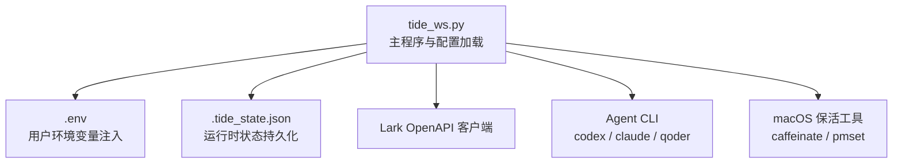
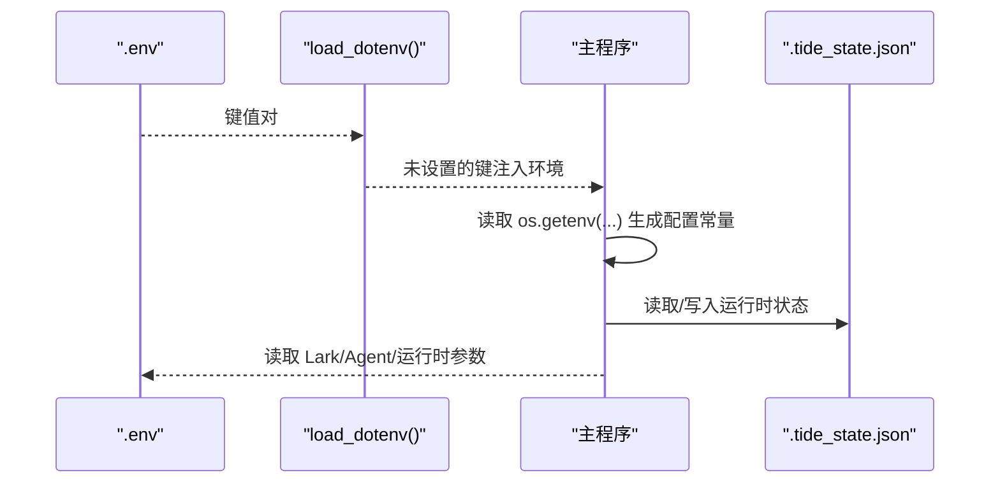
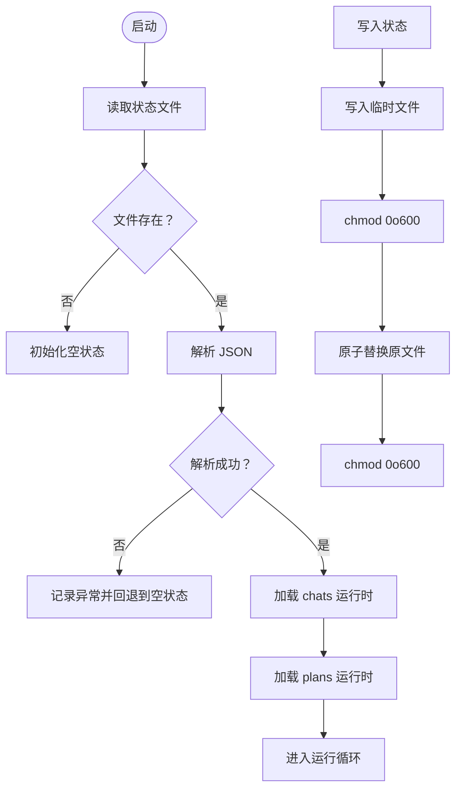
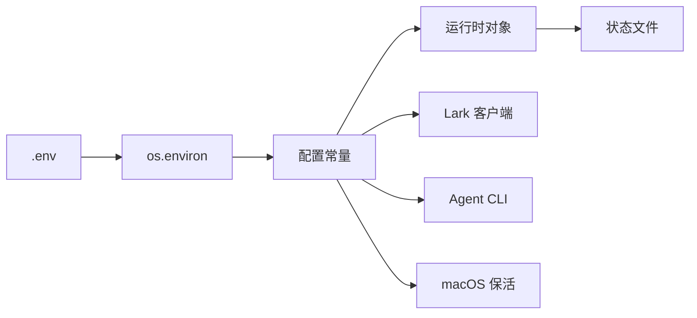

# 配置和环境

<cite>
**本文引用的文件**
- [README.md](file://README.md)
- [tide_ws.py](file://tide_ws.py)
</cite>

## 目录
1. [简介](#简介)
2. [项目结构](#项目结构)
3. [核心组件](#核心组件)
4. [架构总览](#架构总览)
5. [详细组件分析](#详细组件分析)
6. [依赖关系分析](#依赖关系分析)
7. [性能考量](#性能考量)
8. [故障排查指南](#故障排查指南)
9. [结论](#结论)
10. [附录](#附录)

## 简介
本文件系统性梳理 Tide 的配置与环境管理，涵盖：
- 环境变量配置体系：Lark 相关、Agent CLI、运行时参数、访问控制、卡片与消息、审批、状态与持久化、macOS 保活等
- 配置加载顺序、优先级与覆盖规则
- 状态文件 .tide_state.json 的格式、字段含义、数据迁移与备份策略
- 配置验证方法、常见错误与解决方案
- 不同使用场景的推荐配置模板

## 项目结构
- 主程序入口：tide_ws.py
- 文档与示例：README.md（含环境变量参考表、使用说明）
- 状态文件：.tide_state.json（本地生成，不提交）

图表来源
- [tide_ws.py:34-49](file://tide_ws.py#L34-L49)
- [tide_ws.py:856-866](file://tide_ws.py#L856-L866)
- [README.md:512-517](file://README.md#L512-L517)

章节来源
- [README.md:512-517](file://README.md#L512-L517)
- [tide_ws.py:34-49](file://tide_ws.py#L34-L49)

## 核心组件
- 环境变量加载与解析：支持从 .env 注入，未设置的键才注入，避免覆盖已有环境
- 配置常量：统一从 os.getenv 读取，带默认值与类型转换
- 状态文件：.tide_state.json，保存已知聊天、运行态、Plan/子任务状态等
- 访问控制：基于 chat_id/open_id 白名单、管理员权限与“仅已知聊天”策略
- 附件与消息：附件下载、引用缓存、消息分片与长度限制
- 审批与重试：审批等待轮询、批准后重试策略（Codex/Claude/Qoder）
- macOS 保活：电源检测、caffeinate 与可选禁用睡眠

章节来源
- [tide_ws.py:34-49](file://tide_ws.py#L34-L49)
- [tide_ws.py:54-151](file://tide_ws.py#L54-L151)
- [tide_ws.py:869-891](file://tide_ws.py#L869-L891)
- [tide_ws.py:1017-1043](file://tide_ws.py#L1017-L1043)
- [tide_ws.py:1152-1173](file://tide_ws.py#L1152-L1173)

## 架构总览
Tide 的配置与状态管理围绕“环境变量 → 运行时常量 → 状态文件”的链路展开。程序启动时优先从 .env 注入，随后读取各类配置常量；运行期通过状态文件持久化关键运行态，重启后可恢复。

图表来源
- [tide_ws.py:34-49](file://tide_ws.py#L34-L49)
- [tide_ws.py:869-891](file://tide_ws.py#L869-L891)

## 详细组件分析

### 环境变量配置系统
- 加载顺序与优先级
  - .env 注入：仅当环境变量未设置时才注入，避免覆盖已存在的环境变量
  - 运行时读取：通过 os.getenv(...) 获取，带默认值与类型转换
  - 覆盖规则：若环境变量已存在，则 .env 不会覆盖
- 关键配置类别
  - Lark：应用凭据、域名、事件加密与校验令牌
  - Agent CLI：默认工作目录、Home 目录、会话/项目索引目录、CLI 路径、超时、模型、权限模式、额外参数
  - 访问控制：允许的 chat_id/open_id、管理员 open_id、是否要求已知聊天
  - 卡片与消息：消息分片长度、最终回复/问题长度限制、面板展示数量、并发上限、事件队列容量、附件目录与大小、附件暂存 TTL、消息引用缓存上限、任务卡片刷新间隔、Plan 并行度、测试命令与超时
  - 审批：等待时长与轮询间隔
  - 状态与同步：定时状态推送、每日日报时间、状态文件、显示归档、包含 Plan worktree、欢迎语、桌面会话同步、卡片转发、日志内容与级别
  - macOS 保活：接入电源自动保持活跃、检查间隔、禁用睡眠

章节来源
- [tide_ws.py:34-49](file://tide_ws.py#L34-L49)
- [tide_ws.py:54-151](file://tide_ws.py#L54-L151)
- [README.md:317-428](file://README.md#L317-L428)

### 状态文件管理机制
- 文件位置与命名
  - 默认文件名：.tide_state.json
  - 可通过 TIDE_STATE_FILE 或 TIDE_STATE_FILE 覆盖
- 读写流程
  - 读取：不存在返回空结构；异常记录日志并回退
  - 写入：先写临时文件，chmod 0o600，再原子替换
- 数据结构要点
  - chats：按 chat_id 存储运行时状态（如 cwd、活动 Agent、会话、任务状态、计划 ID、引导任务 ID 等）
  - message_refs：消息引用缓存（按 chat_id:message_id 唯一），包含 task_id/session_id/cwd/text/source/thread/root/parent 等字段，定期裁剪
  - plans：按 plan_id 存储 PlanRuntime，包含任务列表、并发度、消息 ID、状态、创建时间、停止请求、合并状态与输出
- 数据迁移与恢复
  - 重启后从状态文件恢复 chats、plans；部分未结束的 Plan 子任务会被标记为失败并提示重试
- 备份策略
  - 建议在重要变更前手动备份 .tide_state.json

图表来源
- [tide_ws.py:869-891](file://tide_ws.py#L869-L891)
- [tide_ws.py:1017-1043](file://tide_ws.py#L1017-L1043)
- [tide_ws.py:1152-1173](file://tide_ws.py#L1152-L1173)

章节来源
- [tide_ws.py:125-126](file://tide_ws.py#L125-L126)
- [tide_ws.py:869-891](file://tide_ws.py#L869-L891)
- [tide_ws.py:1017-1043](file://tide_ws.py#L1017-L1043)
- [tide_ws.py:1152-1173](file://tide_ws.py#L1152-L1173)

### 访问控制与授权
- 允许的聊天与用户
  - LARK_ALLOWED_CHAT_IDS：允许的群聊 ID 集合；支持通配符“*”
  - LARK_ALLOWED_OPEN_IDS：允许操作的用户 open_id 集合；支持通配符“*”
  - LARK_ADMIN_OPEN_IDS：管理员 open_id 集合；若为空则沿用允许用户集合
- 已知聊天策略
  - LARK_REQUIRE_KNOWN_CHAT：未配置允许聊天时，仅允许状态文件中已记录的 chat
- 授权判定
  - is_authorized_lark_event：综合聊天/用户/管理员权限进行判定

章节来源
- [tide_ws.py:145-148](file://tide_ws.py#L145-L148)
- [tide_ws.py:1219-1271](file://tide_ws.py#L1219-L1271)

### 附件与消息处理
- 附件下载
  - 限制单附件最大字节、消息引用缓存上限、每条消息最多处理附件数量
  - 附件目录可相对当前工作目录；默认权限 0o700
- 附件暂存与消费
  - 无文本的附件消息在 TTL 内可被下一条指令自动消费
- 消息引用缓存
  - 按 chat_id:message_id 唯一；超过上限按更新时间裁剪

章节来源
- [tide_ws.py:110-114](file://tide_ws.py#L110-L114)
- [tide_ws.py:132-133](file://tide_ws.py#L132-L133)
- [tide_ws.py:1449-1540](file://tide_ws.py#L1449-L1540)
- [tide_ws.py:897-907](file://tide_ws.py#L897-L907)

### 审批与重试策略
- 审批等待
  - PENDING_APPROVAL_WAIT_SECONDS：推送审批后等待处理的时间
  - PENDING_APPROVAL_POLL_SECONDS：审批等待轮询间隔
- 批准后重试
  - Codex：APPROVED_CODEX_APPROVAL_POLICY、APPROVED_CODEX_SANDBOX_MODE
  - Claude：APPROVED_CLAUDE_PERMISSION_MODE
  - Qoder：APPROVED_QODER_PERMISSION_MODE（含别名与非法值校验）
- Qoder 权限模式规范化
  - 支持的合法值集合与别名映射；非法值抛出异常

章节来源
- [tide_ws.py:116-117](file://tide_ws.py#L116-L117)
- [tide_ws.py:96-98](file://tide_ws.py#L96-L98)
- [tide_ws.py:599-613](file://tide_ws.py#L599-L613)
- [tide_ws.py:556-569](file://tide_ws.py#L556-L569)

### macOS 保活
- KEEP_AWAKE_ON_AC_POWER：接入电源时自动 caffeinate
- KEEP_AWAKE_CHECK_INTERVAL_SECONDS：电源状态检查间隔
- KEEP_AWAKE_DISABLE_SLEEP：尝试 pmset 禁用睡眠（需管理员权限）

章节来源
- [tide_ws.py:142-144](file://tide_ws.py#L142-L144)
- [README.md:429-456](file://README.md#L429-L456)

## 依赖关系分析
- 配置依赖链
  - .env → os.environ → 配置常量 → 运行时对象/状态文件
- 外部依赖
  - Lark OpenAPI 客户端：IM v1 消息与资源接口
  - Agent CLI：codex/claude/qoder 的命令行接口
  - macOS 系统命令：caffeinate/pmset

图表来源
- [tide_ws.py:34-49](file://tide_ws.py#L34-L49)
- [tide_ws.py:54-151](file://tide_ws.py#L54-L151)
- [tide_ws.py:856-866](file://tide_ws.py#L856-L866)

章节来源
- [tide_ws.py:54-151](file://tide_ws.py#L54-L151)
- [tide_ws.py:856-866](file://tide_ws.py#L856-L866)

## 性能考量
- 并发与队列
  - 全局与单聊天并发上限、事件队列最大积压，避免过载
- I/O 与磁盘
  - 附件目录权限与原子写入状态文件，减少竞态与损坏风险
- 日志与可见性
  - LOG_LEVEL 控制日志级别；LOG_MESSAGE_CONTENT 控制是否记录消息内容片段

章节来源
- [tide_ws.py:107-109](file://tide_ws.py#L107-L109)
- [tide_ws.py:400-401](file://tide_ws.py#L400-L401)
- [tide_ws.py:166-169](file://tide_ws.py#L166-L169)
- [tide_ws.py:882-886](file://tide_ws.py#L882-L886)

## 故障排查指南
- 常见问题与定位
  - 收不到 Lark 消息：检查机器人是否加入群、权限是否开通、凭据是否正确；查看日志中的发送失败与权限错误
  - 审批批准后未继续执行：确认代码已重启并加载最新 .env；核对批准后的配置（Codex/Claude/Qoder）
  - Git 提交失败：Codex sandbox 权限不足；批准后会以批准后的 sandbox 配置单次重试
  - 电脑睡眠：caffeinate 无法阻止合盖睡眠；必要时启用禁用睡眠（需管理员权限）
- 配置验证
  - Qoder 权限模式：非法值会触发异常，需使用合法枚举值或别名
  - CSV 集合：LARK_ALLOWED_CHAT_IDS/LARK_ALLOWED_OPEN_IDS/LARK_ADMIN_OPEN_IDS 通过逗号/分号/空白分割
- 状态文件异常
  - 读取失败会记录异常并回退；写入失败会记录异常并保留原文件

章节来源
- [README.md:474-511](file://README.md#L474-L511)
- [tide_ws.py:556-569](file://tide_ws.py#L556-L569)
- [tide_ws.py:869-876](file://tide_ws.py#L869-L876)
- [tide_ws.py:884-890](file://tide_ws.py#L884-L890)

## 结论
Tide 的配置体系以 .env 为入口，通过严格的加载顺序与覆盖规则保证灵活性与稳定性；状态文件提供关键运行态的持久化与恢复能力。建议在生产环境中：
- 明确各变量作用与默认值，按需覆盖
- 定期备份状态文件
- 使用访问控制白名单与管理员权限最小化原则
- 针对 Agent CLI 与 macOS 保活场景进行专项测试与监控

## 附录

### 环境变量参考手册（摘要）
- Lark
  - LARK_APP_ID、LARK_APP_SECRET、LARK_DOMAIN、LARK_ENCRYPT_KEY、LARK_VERIFICATION_TOKEN
- Codex
  - CODEX_DEFAULT_CWD、CODEX_HOME、CODEX_SESSIONS_DIR、CODEX_BIN、CODEX_TIMEOUT_SECONDS、CODEX_MODEL、CODEX_PROJECTS_ROOT、CODEX_APPROVAL_POLICY、CODEX_SANDBOX_MODE、APPROVED_CODEX_APPROVAL_POLICY、APPROVED_CODEX_SANDBOX_MODE、CODEX_ALLOWED_ROOTS
- Agent/Claude/Qoder
  - DEFAULT_AGENT_ID、CLAUDE_BIN、CLAUDE_HOME、CLAUDE_PROJECTS_DIR、CLAUDE_TIMEOUT_SECONDS、CLAUDE_MODEL、CLAUDE_PERMISSION_MODE、APPROVED_CLAUDE_PERMISSION_MODE、CLAUDE_EXTRA_ARGS、QODER_BIN、QODER_HOME、QODER_PROJECTS_DIR、QODER_PROCESS_HOME、QODER_TIMEOUT_SECONDS、QODER_QUEST_TIMEOUT_SECONDS、QODER_MODEL、QODER_PERMISSION_MODE、APPROVED_QODER_PERMISSION_MODE、QODER_EXTRA_ARGS
- 访问控制
  - LARK_ALLOWED_CHAT_IDS、LARK_ALLOWED_OPEN_IDS、LARK_ADMIN_OPEN_IDS、LARK_REQUIRE_KNOWN_CHAT
- 卡片与消息
  - LARK_MESSAGE_CHUNK_SIZE、LARK_FINAL_REPLY_MAX_CHARS、LARK_FINAL_QUESTION_MAX_CHARS、MAX_PROJECTS_IN_PANEL、MAX_CONVERSATIONS_IN_PANEL、MAX_SESSION_FILES、MAX_RUNNING_TASKS、MAX_RUNNING_TASKS_PER_CHAT、LARK_EVENT_QUEUE_MAXSIZE、LARK_ATTACHMENTS_DIR、LARK_ATTACHMENT_MAX_BYTES、LARK_PENDING_ATTACHMENT_TTL_SECONDS、MAX_LARK_ATTACHMENTS_PER_MESSAGE、MAX_LARK_MESSAGE_REFS、TASK_CARD_REFRESH_INTERVAL_SECONDS、PLAN_MAX_PARALLEL、PLAN_TASK_OUTPUT_MAX_CHARS、PLAN_USE_WORKTREES、PLAN_WORKTREE_ROOT、PLAN_TEST_COMMAND、PLAN_TEST_COMMAND_SHELL、PLAN_TEST_TIMEOUT_SECONDS
- 审批
  - PENDING_APPROVAL_WAIT_SECONDS、PENDING_APPROVAL_POLL_SECONDS
- 状态、同步与持久化
  - STATUS_INTERVAL_SECONDS、DAILY_REPORT_TIME、TIDE_STATE_FILE、TIDE_SHOW_ARCHIVED、TIDE_INCLUDE_PLAN_WORKTREES、TIDE_WELCOME_MESSAGE、SYNC_DESKTOP_SESSIONS、SESSION_WATCH_INTERVAL_SECONDS、LARK_CARD_ENABLE_FORWARD、LOG_MESSAGE_CONTENT、LOG_LEVEL
- macOS 保活
  - KEEP_AWAKE_ON_AC_POWER、KEEP_AWAKE_CHECK_INTERVAL_SECONDS、KEEP_AWAKE_DISABLE_SLEEP

章节来源
- [README.md:317-428](file://README.md#L317-L428)

### 配置加载顺序、优先级与覆盖规则
- 加载顺序
  - 启动时先读取 .env，仅注入未设置的键
  - 程序运行期间通过 os.getenv(...) 读取配置常量
- 优先级
  - 环境变量 > .env（仅未设置时注入） > 默认值
- 覆盖规则
  - 若环境变量已存在，.env 不会覆盖
  - 某些变量存在历史别名（如 TIDE_*），新变量优先于历史别名

章节来源
- [tide_ws.py:34-49](file://tide_ws.py#L34-L49)
- [tide_ws.py:125-139](file://tide_ws.py#L125-L139)

### 状态文件字段说明（摘要）
- chats
  - cwd、active_agent_id、active_project_key、active_session_id、task_message_id、task_prompt、task_status、task_output、task_agent_id、task_model、task_session_id、task_cwd、task_started_at、last_daily_sent_date、send_disabled、last_approval_fingerprint、active_plan_id、guidance_task_id
- message_refs
  - 按 chat_id:message_id 唯一；包含 task_id、session_id、cwd、text、source、root_id、parent_id、thread_id、attachments 等
- plans
  - plan_id、chat_id、cwd、tasks（含子任务）、max_parallel、message_id、status、created_at、stop_requested、merge_status、merge_output

章节来源
- [tide_ws.py:983-1014](file://tide_ws.py#L983-L1014)
- [tide_ws.py:956-961](file://tide_ws.py#L956-L961)
- [tide_ws.py:1045-1107](file://tide_ws.py#L1045-L1107)
- [tide_ws.py:1110-1123](file://tide_ws.py#L1110-L1123)

### 配置验证方法与最佳实践
- 配置验证
  - Qoder 权限模式：非法值抛异常；建议使用合法枚举值或别名
  - CSV 集合：逗号/分号/空白分隔；支持通配符“*”
  - 数值类型：超时、并发、长度等均做类型转换与边界检查
- 最佳实践
  - 仅在必要时覆盖默认值；保持 .env 与环境变量分离
  - 对于多用户/多群场景，使用白名单与管理员权限
  - 定期备份状态文件；监控日志级别与消息内容记录开关
  - Plan 并行与测试命令需结合实际仓库与 CI 环境评估

章节来源
- [tide_ws.py:154-159](file://tide_ws.py#L154-L159)
- [tide_ws.py:556-569](file://tide_ws.py#L556-L569)
- [tide_ws.py:1310-1321](file://tide_ws.py#L1310-L1321)

### 不同使用场景的推荐配置模板
- 单人/小团队私域
  - 开启 LARK_REQUIRE_KNOWN_CHAT=1，限制允许聊天为已知 chat
  - 设置 LARK_ALLOWED_OPEN_IDS 为管理员 open_id
  - 适当提高 MAX_RUNNING_TASKS 与 PLAN_MAX_PARALLEL
- 多群协作
  - 使用 LARK_ALLOWED_CHAT_IDS 指定允许群；或设置 LARK_ALLOWED_CHAT_IDS="*" 开放全部
  - 严格管理员 open_id 白名单
- 生产/长期运行
  - 开启 KEEP_AWAKE_ON_AC_POWER=1；如需合盖运行，谨慎启用 KEEP_AWAKE_DISABLE_SLEEP 并做好权限与散热管理
  - 定期备份 .tide_state.json；设置 LOG_LEVEL=INFO 或更严格
  - Plan 测试命令与超时依据仓库规模与 CI 能力调整

章节来源
- [README.md:429-456](file://README.md#L429-L456)
- [README.md:370-428](file://README.md#L370-L428)