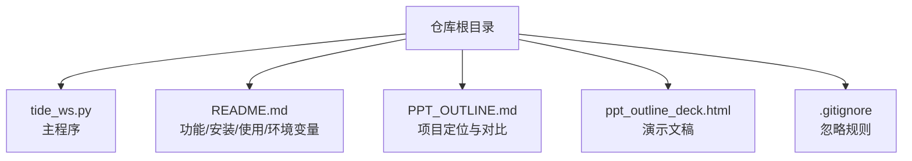
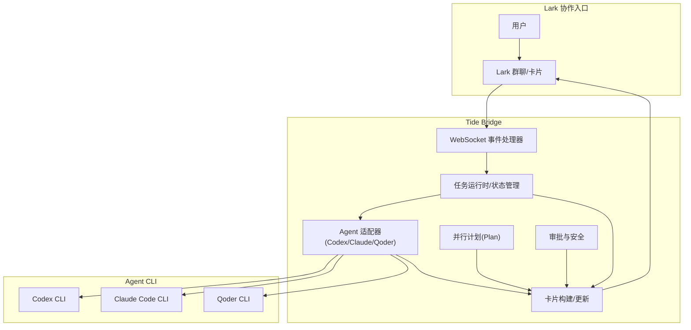
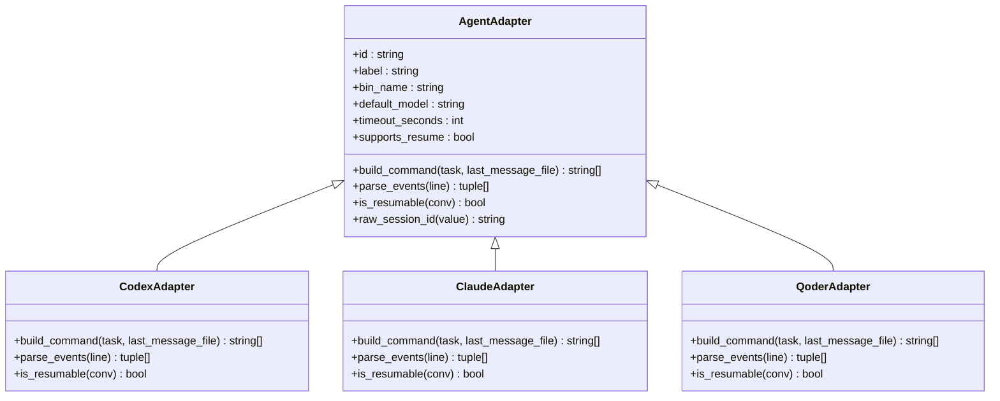
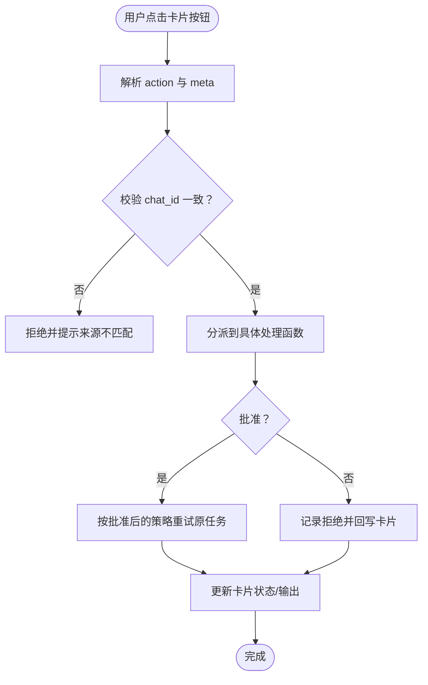
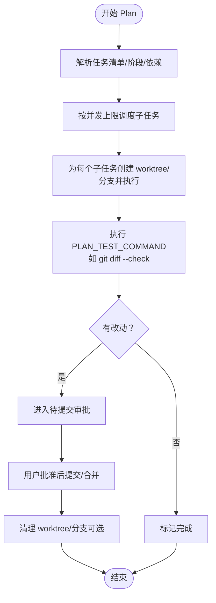
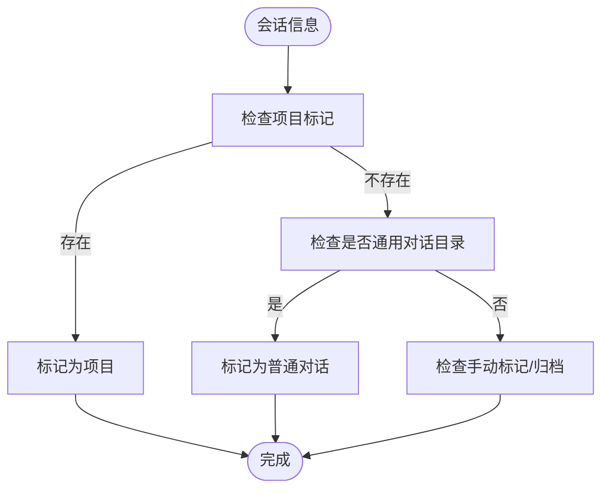
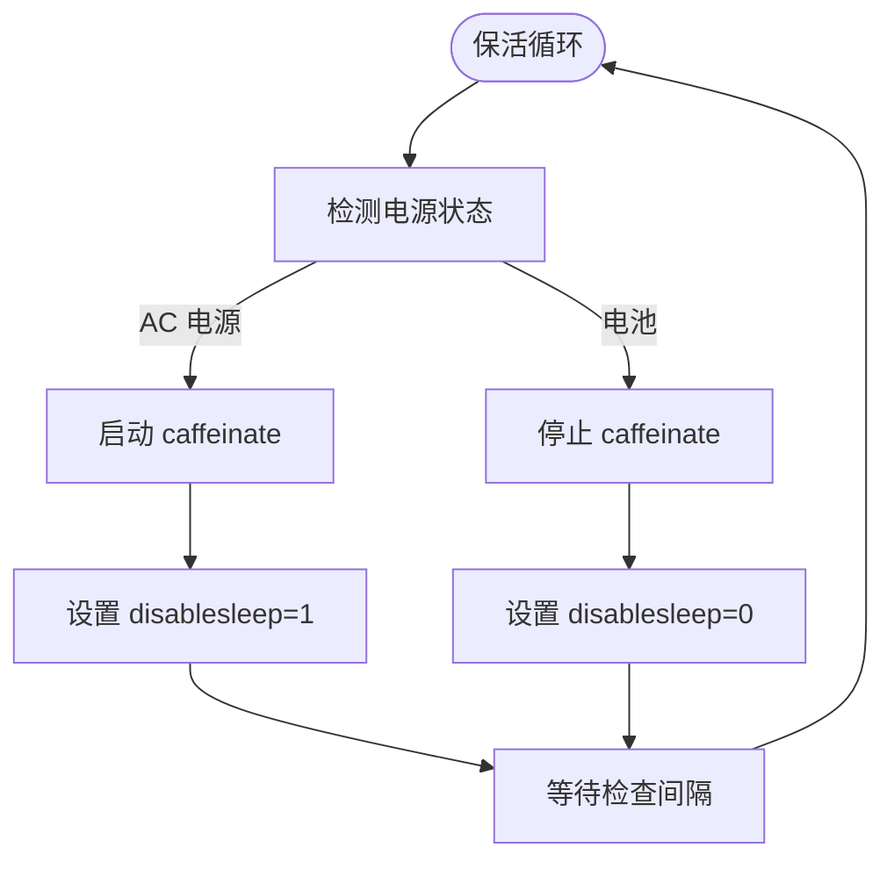
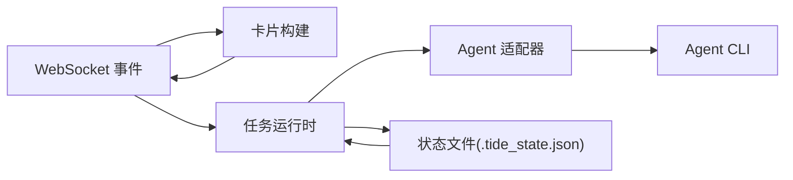

# 项目概述

<cite>
**本文档引用的文件**
- [README.md](file://README.md)
- [tide_ws.py](file://tide_ws.py)
- [PPT_OUTLINE.md](file://PPT_OUTLINE.md)
- [ppt_outline_deck.html](file://ppt_outline_deck.html)
- [.gitignore](file://.gitignore)
</cite>

## 目录
1. [简介](#简介)
2. [项目结构](#项目结构)
3. [核心组件](#核心组件)
4. [架构总览](#架构总览)
5. [详细组件分析](#详细组件分析)
6. [依赖关系分析](#依赖关系分析)
7. [性能考量](#性能考量)
8. [故障排查指南](#故障排查指南)
9. [结论](#结论)
10. [附录](#附录)

## 简介
Tide 是一个将飞书/Lark 群聊消息转化为 Codex、Claude Code、Qoder CLI 等 Agent CLI 任务的轻量桥接工具。其核心价值在于：
- 将本地 Agent CLI 的强大执行能力与 Lark 的协作入口无缝衔接，实现“在 Lark 中发起任务、在本地执行、在 Lark 中回写进度/结果/审批/状态”的闭环。
- 提供卡片化的任务面板、项目/会话管理、并行计划（Plan）、审批与安全控制、日报统计、macOS 保活等工程化能力，满足现代软件开发工作流中的协作与可追踪需求。

项目定位清晰：不是替代 Agent CLI 或构建通用 agent 平台，而是为 Agent CLI 增加一个低摩擦、可远程使用、适合团队协作的控制层。通过 Lark 卡片，用户可以直观地跟踪长任务、进行权限审批、并行拆分子任务、查看项目进展与日报。

## 项目结构
仓库采用极简结构，核心文件如下：
- tide_ws.py：主程序，负责 Lark WebSocket 事件、消息卡片、Agent 执行、审批、会话同步与 macOS 保活。
- README.md：功能说明、安装配置、使用方式、环境变量与常见问题。
- PPT_OUTLINE.md 与 ppt_outline_deck.html：项目定位与对比的演示材料，便于对外讲解。
- .gitignore：忽略本地状态文件、附件缓存、日志与临时文件。

图表来源
- [tide_ws.py](file://tide_ws.py)
- [README.md](file://README.md)
- [PPT_OUTLINE.md](file://PPT_OUTLINE.md)
- [ppt_outline_deck.html](file://ppt_outline_deck.html)
- [.gitignore](file://.gitignore)

章节来源
- [README.md](file://README.md)
- [tide_ws.py](file://tide_ws.py)
- [.gitignore](file://.gitignore)

## 核心组件
- Lark WebSocket 事件处理：注册消息接收、消息已读、卡片按钮回调事件，解析指令与卡片动作。
- 任务运行时模型：为每条 Lark 指令创建独立任务运行态，包含 task_id、chat_id、cwd、prompt、model、session_id、状态与输出等。
- Agent 适配器：抽象 Codex、Claude Code、Qoder CLI 的命令构建与事件解析，支持 resume、权限模式、超时控制等。
- 项目/会话/普通对话管理：基于 cwd 与项目标记自动区分，支持切换、归档、标记修正。
- 并行计划（Plan）：将任务清单拆分为多个子任务，使用 Git worktree/分支隔离，支持测试、审批、合并与清理。
- 审批与安全：当 Agent CLI 输出触发沙箱/权限风险时，生成审批项，用户在卡片内批准/拒绝，脚本按批准后的策略重试。
- 卡片构建与更新：动态生成看板、项目面板、会话面板、Plan 面板、日报等，支持按钮回调与自动刷新。
- 状态持久化：将运行时状态、消息引用、计划与会话信息写入本地状态文件，重启后可恢复。
- macOS 保活：在接入电源时自动保持脚本与网络活跃，必要时禁用系统休眠，保证长时间运行。

章节来源
- [tide_ws.py](file://tide_ws.py)
- [README.md](file://README.md)

## 架构总览
Tide 采用“Lark WebSocket + Python Bridge + Agent CLI”的轻量架构：
- Lark 侧：群聊消息、卡片按钮、审批动作。
- Bridge 侧：解析指令、维护状态、构建卡片、调度任务、与 Agent CLI 交互。
- Agent CLI 侧：本地执行任务、写入会话文件、产生流式事件。
- 卡片侧：回写进度、结果、失败与审批，形成闭环。

图表来源
- [tide_ws.py](file://tide_ws.py)
- [README.md](file://README.md)

## 详细组件分析

### 组件 A：Agent 适配器与任务执行
- 设计要点
  - 统一抽象 AgentAdapter，封装命令构建、事件解析、会话恢复能力。
  - Codex/Claude/Qoder 分别实现适配器，支持模型、权限模式、超时、resume 等差异化配置。
  - 任务运行时包含 prompt、cwd、session_id、状态、输出、审批策略等字段，确保任务可追踪、可恢复。
- 数据结构与复杂度
  - 任务运行时为 O(1) 常量级访问；会话锁按 conversation_key 维护，避免并发写入。
  - 事件解析为流式增量处理，复杂度与输出长度线性相关。
- 优化与健壮性
  - 为 Qoder 提供 Quest 模式超时控制与暂停/继续/终止按钮。
  - 对权限模式进行标准化与别名映射，避免错误配置导致阻塞。
- 性能影响
  - 流式事件解析减少内存峰值；并发任务受 MAX_RUNNING_TASKS 与 MAX_RUNNING_TASKS_PER_CHAT 限制。

图表来源
- [tide_ws.py](file://tide_ws.py)

章节来源
- [tide_ws.py](file://tide_ws.py)

### 组件 B：卡片交互与按钮回调
- 设计要点
  - 卡片构建函数按模块化元素组织，支持字段、富文本、操作按钮与分隔线。
  - 按钮回调通过 on_card_action 解析，区分普通用户与管理员动作，异步处理审批、停止、重启、Plan 操作等。
- 流程图（卡片审批）

图表来源
- [tide_ws.py](file://tide_ws.py)

章节来源
- [tide_ws.py](file://tide_ws.py)

### 组件 C：并行计划（Plan）与 Git 隔离
- 设计要点
  - PlanRuntime 管理整体计划，PlanTask 管理子任务，支持阶段、依赖、worktree/分支隔离、测试与提交审批。
  - 默认使用 Git worktree 与独立分支，避免并行子任务互相覆盖。
  - 支持子任务取消、停止、重试、丢弃改动、清理 worktree 等操作。
- 流程图（Plan 子任务执行）

图表来源
- [tide_ws.py](file://tide_ws.py)
- [README.md](file://README.md)

章节来源
- [tide_ws.py](file://tide_ws.py)
- [README.md](file://README.md)

### 组件 D：项目/会话/普通对话分类与管理
- 设计要点
  - 基于 cwd 与项目标记（如 .git、package.json 等）自动识别项目与普通对话。
  - 支持手动标记修正与归档，归档后可在查询时通过开关显示。
  - 会话索引按 Agent 类型与会话文件扫描，支持 resume 与跨客户端同步。
- 流程图（会话分类）

图表来源
- [tide_ws.py](file://tide_ws.py)

章节来源
- [tide_ws.py](file://tide_ws.py)

### 组件 E：macOS 保活与电源管理
- 设计要点
  - 接入电源时启动 caffeinate，保持脚本与网络活跃；必要时设置 disablesleep。
  - 提供定时检查循环与优雅停止，避免资源泄漏。
- 流程图（保活循环）

图表来源
- [tide_ws.py](file://tide_ws.py)

章节来源
- [tide_ws.py](file://tide_ws.py)

## 依赖关系分析
- 外部依赖
  - lark-oapi：Lark OpenAPI 客户端，用于消息发送、资源下载与事件订阅。
  - Agent CLI：Codex、Claude Code、Qoder CLI，作为实际执行后端。
  - macOS 系统命令：caffeinate、pmset，用于保活与休眠控制。
- 内部模块耦合
  - 事件处理器与卡片构建强耦合，保证按钮回调与状态更新一致。
  - 任务运行时与 Agent 适配器弱耦合，通过接口解耦不同 Agent 的差异。
  - 计划模块与 Git 工具链耦合，用于 worktree/分支隔离与测试。
- 潜在环路
  - 未发现直接循环依赖；状态持久化与事件处理通过单向数据流传递。

图表来源
- [tide_ws.py](file://tide_ws.py)

章节来源
- [tide_ws.py](file://tide_ws.py)

## 性能考量
- 事件流式解析：Agent CLI 输出为流式 JSON，Bridge 逐行解析，避免一次性加载大块内容。
- 并发控制：通过全局与单聊天并发上限限制，防止资源争用与系统过载。
- 卡片更新节流：自动刷新间隔与增量更新，减少 Lark API 调用频率。
- 附件处理：限制单条消息附件数量与大小，避免内存与磁盘压力。
- macOS 保活：仅在接入电源时启用，降低能耗与发热风险。

## 故障排查指南
- 收不到 Lark 消息
  - 检查机器人是否加入群聊、权限是否开通、事件订阅密钥与令牌是否正确。
  - 查看日志中是否存在 send_card/send_msg 失败或权限错误。
- 审批批准后未继续执行
  - 确认脚本已加载最新代码，检查批准后的配置（如 APPROVED_*）是否符合预期。
- Git 提交失败
  - 常见于 Codex sandbox 权限不足；批准后脚本会按批准策略单次重试。
- 电脑仍然睡眠
  - caffeinate 无法阻止所有休眠场景；合盖运行建议接入电源、外接显示器或启用 disablesleep（需管理员权限）。

章节来源
- [README.md](file://README.md)

## 结论
Tide 通过轻量桥接，将本地 Agent CLI 的工程能力与 Lark 的协作入口深度融合，解决了“本地执行与协作入口割裂”的痛点。其核心优势在于：
- 低侵入：不改变现有 Agent CLI 使用方式，不迁移开发环境。
- 协作可见：长任务进度与结果在 Lark 可见，审批动作闭环。
- 可并行：Plan 模式支持多任务并行与 Git 隔离。
- 可追踪：任务卡片与状态持久化，便于回溯与恢复。

在现代软件开发工作流中，Tide 既适合工程团队的远程协作，也适合个人开发者在移动端触发与跟踪任务。未来可围绕状态持久化、Plan 收尾与多用户部署持续增强。

## 附录
- 使用场景举例
  - 在手机或群聊中远程触发修复、检查、写文档任务。
  - 并行拆分多个子任务，使用 Git worktree 隔离改动，统一测试与审批。
  - 通过卡片查看项目状态、会话概览与日报，进行权限审批与决策。
- 与其他方案对比
  - 相比 OpenClaw（多渠道网关）与 Hermes（自改进 agent runtime），Tide 更聚焦“Lark + Agent CLI 的工程执行闭环”，不做泛化平台改造，保持简单与高效。