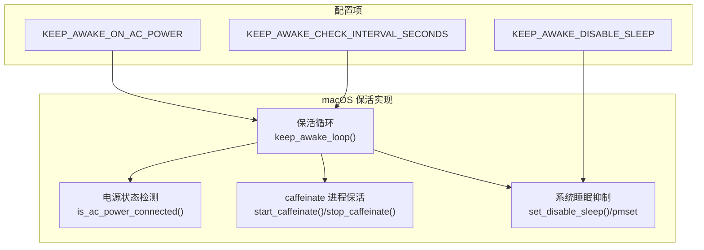
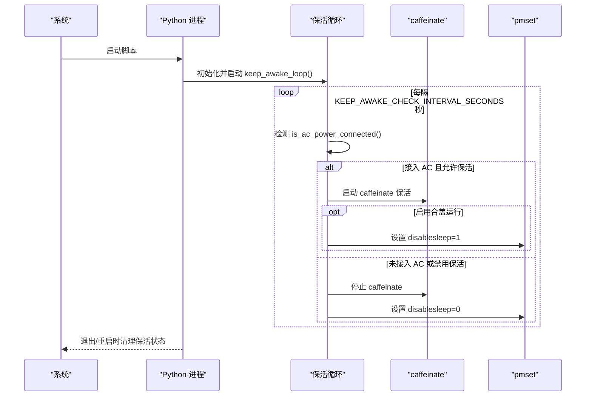
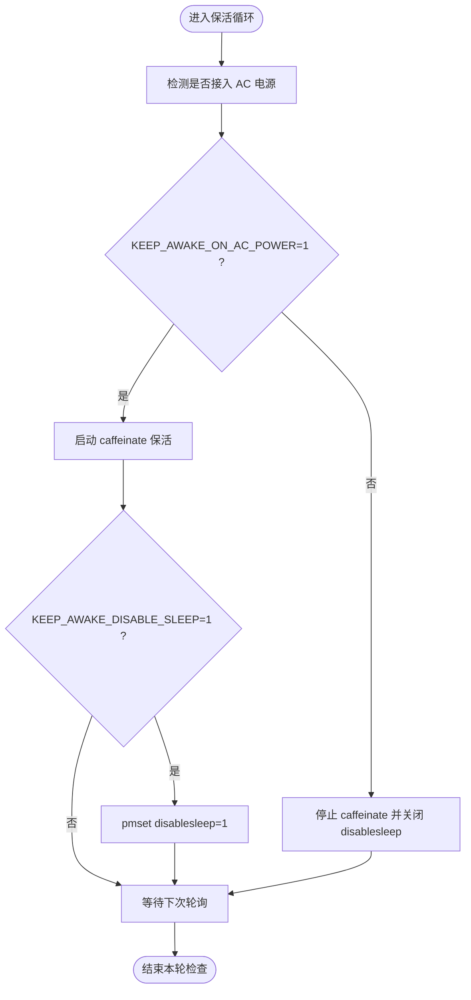
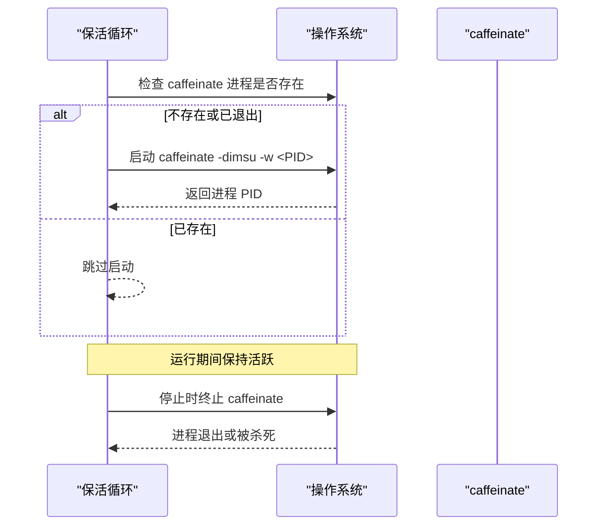
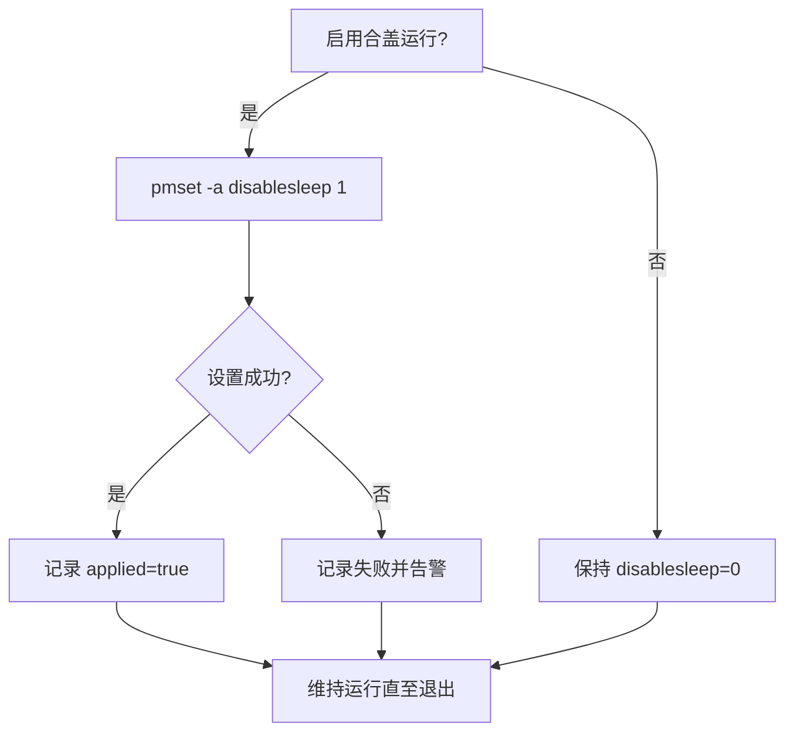
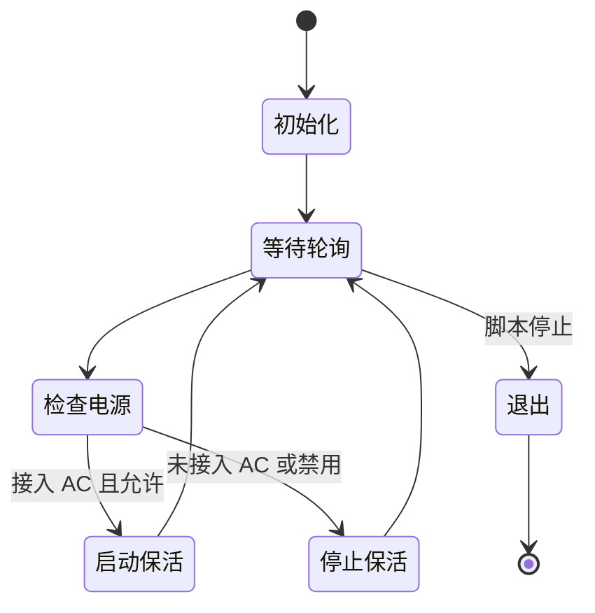
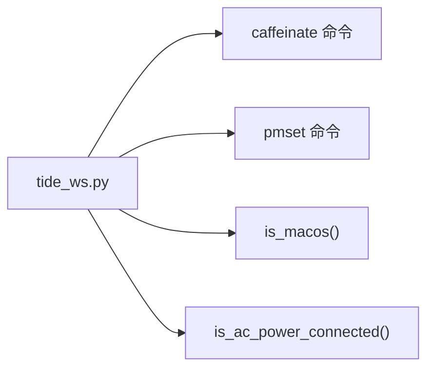

# macOS 保活

<cite>
**本文引用的文件**
- [README.md](file://README.md)
- [tide_ws.py](file://tide_ws.py)
</cite>

## 目录
1. [简介](#简介)
2. [项目结构](#项目结构)
3. [核心组件](#核心组件)
4. [架构总览](#架构总览)
5. [详细组件分析](#详细组件分析)
6. [依赖关系分析](#依赖关系分析)
7. [性能考量](#性能考量)
8. [故障排查指南](#故障排查指南)
9. [结论](#结论)
10. [附录](#附录)

## 简介
本章节面向 Tide 在 macOS 上的“保活”能力，围绕电源管理集成、睡眠控制机制、合盖运行支持与相关配置选项展开，帮助读者理解 KEEP_AWAKE_ON_AC_POWER、KEEP_AWAKE_DISABLE_SLEEP、KEEP_AWAKE_CHECK_INTERVAL_SECONDS 等选项的工作原理与最佳实践，并提供常见问题排查方法。

## 项目结构
- 主程序入口与业务逻辑集中在 tide_ws.py，其中包含 macOS 保活相关的核心实现。
- README.md 提供了环境变量与使用说明，包括 macOS 保活相关的配置项与注意事项。

图表来源
- [tide_ws.py:1655-1757](file://tide_ws.py#L1655-L1757)
- [README.md:429-456](file://README.md#L429-L456)

章节来源
- [README.md:17-32](file://README.md#L17-L32)
- [README.md:429-456](file://README.md#L429-L456)
- [tide_ws.py:1655-1757](file://tide_ws.py#L1655-L1757)

## 核心组件
- 电源状态检测：通过系统命令检测是否接入交流电源，作为保活启动/维持条件。
- caffeinate 保活：启动系统级进程，阻止系统进入空闲睡眠，保持网络与脚本活跃。
- 睡眠抑制：通过 pmset 设置 disablesleep，用于合盖无外接显示器场景维持运行。
- 保活循环：周期性检查电源状态与运行需求，动态启动/停止保活策略。

章节来源
- [tide_ws.py:1659-1676](file://tide_ws.py#L1659-L1676)
- [tide_ws.py:1677-1714](file://tide_ws.py#L1677-L1714)
- [tide_ws.py:1717-1743](file://tide_ws.py#L1717-L1743)
- [tide_ws.py:1751-1757](file://tide_ws.py#L1751-L1757)

## 架构总览
macOS 保活的整体流程如下：
- 初始化时读取环境变量配置。
- 启动保活循环线程，按轮询间隔检查电源状态。
- 若接入交流电且允许保活，则启动 caffeinate 保活。
- 若启用合盖运行策略，尝试设置 disablesleep。
- 在脚本退出或异常时，统一清理 caffeinate 与 disablesleep 状态。

图表来源
- [tide_ws.py:1659-1676](file://tide_ws.py#L1659-L1676)
- [tide_ws.py:1677-1714](file://tide_ws.py#L1677-L1714)
- [tide_ws.py:1717-1743](file://tide_ws.py#L1717-L1743)
- [tide_ws.py:1751-1757](file://tide_ws.py#L1751-L1757)

## 详细组件分析

### 电源状态检测与保活开关
- is_ac_power_connected：通过系统命令读取电源状态，判断是否接入交流电。
- KEEP_AWAKE_ON_AC_POWER：控制是否在接入 AC 时启用保活；默认启用。
- KEEP_AWAKE_CHECK_INTERVAL_SECONDS：保活循环的轮询间隔，默认 60 秒。

图表来源
- [tide_ws.py:1659-1676](file://tide_ws.py#L1659-L1676)
- [tide_ws.py:1677-1714](file://tide_ws.py#L1677-L1714)
- [tide_ws.py:1717-1743](file://tide_ws.py#L1717-L1743)
- [tide_ws.py:1751-1757](file://tide_ws.py#L1751-L1757)

章节来源
- [tide_ws.py:1659-1676](file://tide_ws.py#L1659-L1676)
- [tide_ws.py:1751-1757](file://tide_ws.py#L1751-L1757)
- [README.md:429-435](file://README.md#L429-L435)

### caffeinate 保活机制
- 启动：通过系统命令启动 caffeinate，传入当前进程 PID，使系统在脚本运行期间保持活跃。
- 停止：优雅终止 caffeinate 进程，若超时则强制杀死，确保资源回收。
- 错误处理：当系统未安装 caffeinate 或启动失败时，记录警告并跳过保活。

图表来源
- [tide_ws.py:1677-1714](file://tide_ws.py#L1677-L1714)

章节来源
- [tide_ws.py:1677-1714](file://tide_ws.py#L1677-L1714)

### 睡眠抑制与合盖运行
- set_disable_sleep：通过 pmset 设置 disablesleep=1 或 0，用于在合盖且无外接显示器时维持系统运行。
- KEEP_AWAKE_DISABLE_SLEEP：是否启用此策略，默认关闭。
- 注意：该操作通常需要管理员权限；README 提供了手动设置与恢复的方法。

图表来源
- [tide_ws.py:1717-1743](file://tide_ws.py#L1717-L1743)
- [README.md:437-454](file://README.md#L437-L454)

章节来源
- [tide_ws.py:1717-1743](file://tide_ws.py#L1717-L1743)
- [README.md:437-454](file://README.md#L437-L454)

### 保活循环与生命周期管理
- keep_awake_loop：保活循环入口，负责按轮询间隔检查电源状态并驱动 caffeinate/pmset。
- stop_power_management：退出/重启时统一清理保活状态，确保干净退出。

图表来源
- [tide_ws.py:1751-1757](file://tide_ws.py#L1751-L1757)
- [tide_ws.py:1746-1748](file://tide_ws.py#L1746-L1748)

章节来源
- [tide_ws.py:1751-1757](file://tide_ws.py#L1751-L1757)
- [tide_ws.py:1746-1748](file://tide_ws.py#L1746-L1748)

## 依赖关系分析
- 依赖系统命令：
  - caffeinate：系统级保活工具，阻止空闲睡眠。
  - pmset：系统电源管理工具，支持 disablesleep 设置。
- 依赖系统 API：
  - is_macos：判断运行平台是否为 macOS。
  - is_ac_power_connected：通过系统命令读取电源状态。

图表来源
- [tide_ws.py:1655-1676](file://tide_ws.py#L1655-L1676)

章节来源
- [tide_ws.py:1655-1676](file://tide_ws.py#L1655-L1676)
- [README.md:28-32](file://README.md#L28-L32)

## 性能考量
- 轮询开销：轮询间隔由 KEEP_AWAKE_CHECK_INTERVAL_SECONDS 控制，默认 60 秒，属于低频检查，对 CPU/IO 影响极小。
- 进程管理：caffeinate 以最小权限启动，stdin/stdout/stderr 重定向至空设备，避免产生多余输出。
- 睡眠抑制：仅在必要时启用 disablesleep，避免长时间占用系统电源策略。

章节来源
- [README.md:433-435](file://README.md#L433-L435)
- [tide_ws.py:1677-1714](file://tide_ws.py#L1677-L1714)
- [tide_ws.py:1717-1743](file://tide_ws.py#L1717-L1743)

## 故障排查指南
- caffeinate 无法启动或找不到
  - 现象：日志提示未找到 caffeinate 或启动失败。
  - 处理：确认系统已安装 caffeinate；若缺失，可临时禁用保活或在 README 指引下手动安装。
- pmset 设置失败
  - 现象：日志提示 pmset 设置 disablesleep 失败。
  - 处理：按 README 提示以管理员权限执行设置，或在退出后恢复 disablesleep=0。
- 合盖运行发热风险
  - 现象：长时间合盖无外接显示器导致设备发热。
  - 处理：谨慎启用 KEEP_AWAKE_DISABLE_SLEEP，必要时外接显示器、键盘与鼠标，避免将设备置于密闭空间。
- 电源状态误判
  - 现象：系统电源状态读取异常导致保活行为不符合预期。
  - 处理：检查系统命令返回内容，确认 is_ac_power_connected 的判定逻辑；必要时缩短轮询间隔以更快响应。

章节来源
- [README.md:443-456](file://README.md#L443-L456)
- [tide_ws.py:1677-1714](file://tide_ws.py#L1677-L1714)
- [tide_ws.py:1717-1743](file://tide_ws.py#L1717-L1743)

## 结论
Tide 的 macOS 保活通过“接入 AC 时启动 caffeinate + 可选 pmset disablesleep”的组合策略，在保证脚本与网络持续活跃的同时，兼顾了系统能耗与设备安全。合理配置 KEEP_AWAKE_ON_AC_POWER、KEEP_AWAKE_DISABLE_SLEEP 与 KEEP_AWAKE_CHECK_INTERVAL_SECONDS，可满足不同使用场景的需求；配合 README 的权限与恢复指引，可有效规避常见问题。

## 附录
- 环境变量与默认值参考
  - KEEP_AWAKE_ON_AC_POWER：默认启用，接入 AC 时启动保活。
  - KEEP_AWAKE_CHECK_INTERVAL_SECONDS：默认 60 秒，轮询间隔。
  - KEEP_AWAKE_DISABLE_SLEEP：默认关闭，启用后通过 pmset 设置 disablesleep=1。

章节来源
- [README.md:429-435](file://README.md#L429-L435)
- [tide_ws.py:142-144](file://tide_ws.py#L142-L144)