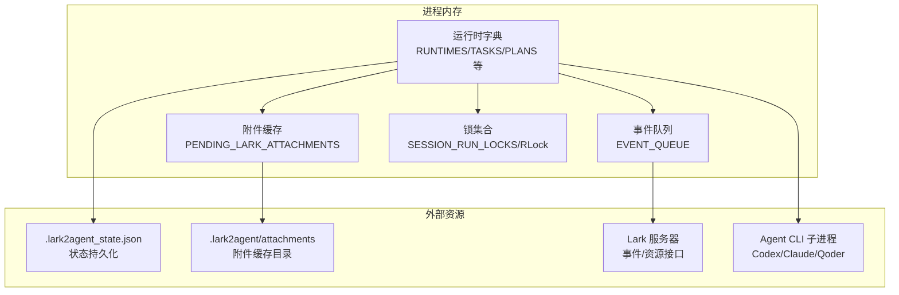
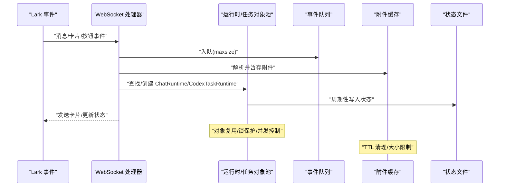
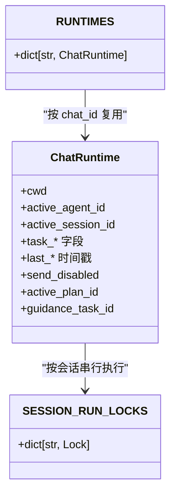
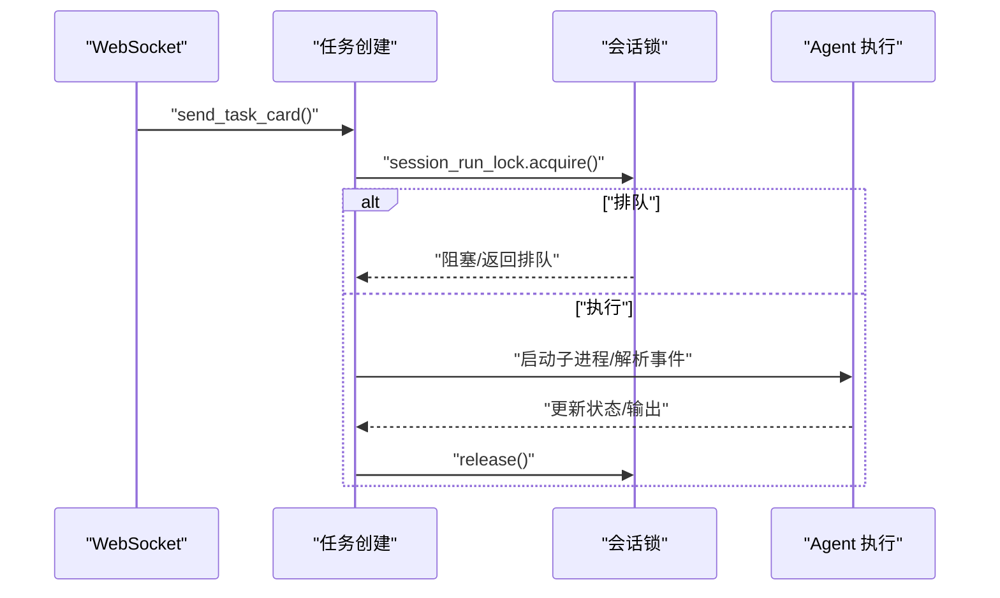
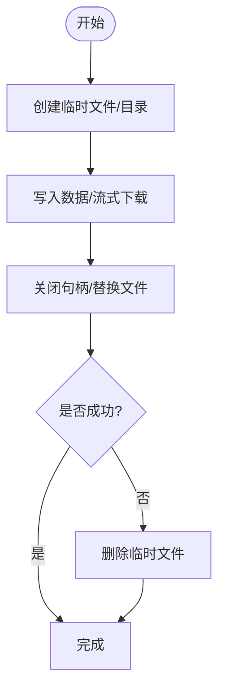
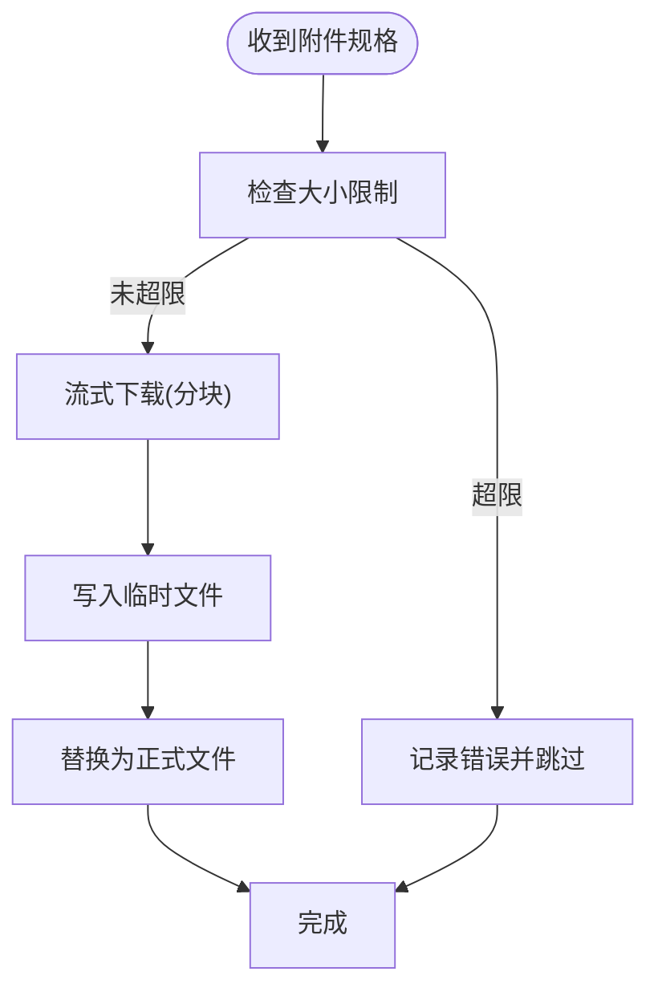
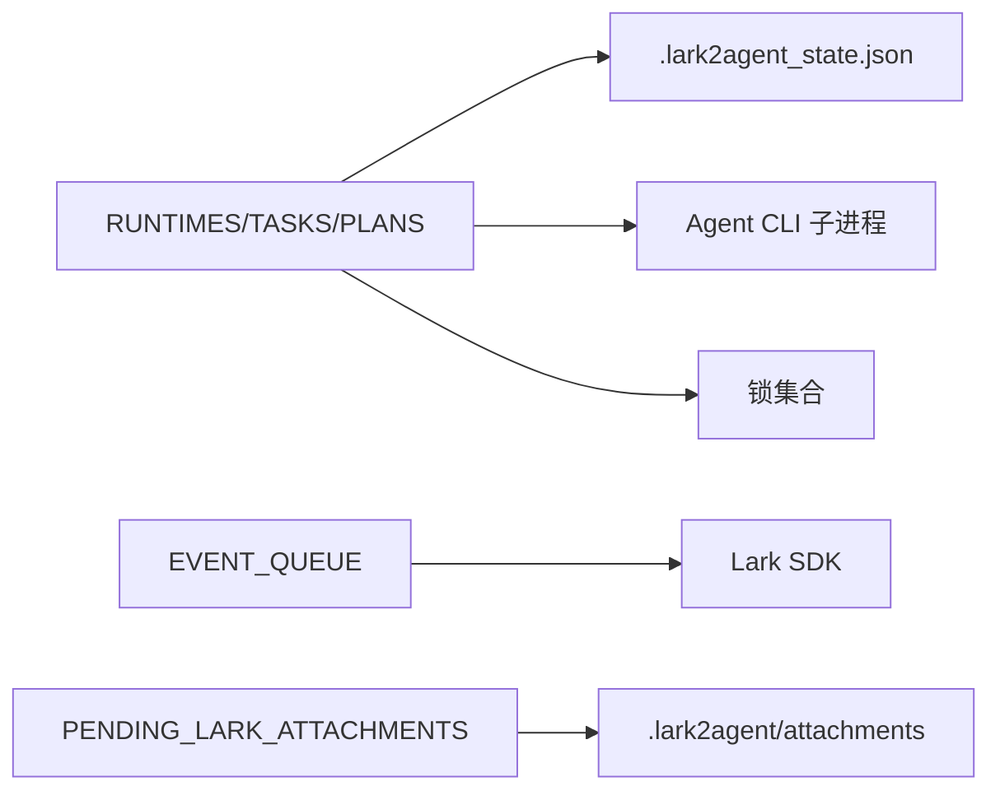

# 内存管理优化

<cite>
**本文档引用的文件**
- [README.md](file://README.md)
- [lark2agent_ws.py](file://lark2agent_ws.py)
- [.gitignore](file://.gitignore)
</cite>

## 目录
1. [简介](#简介)
2. [项目结构](#项目结构)
3. [核心组件](#核心组件)
4. [架构总览](#架构总览)
5. [详细组件分析](#详细组件分析)
6. [依赖关系分析](#依赖关系分析)
7. [性能考量](#性能考量)
8. [故障排查指南](#故障排查指南)
9. [结论](#结论)
10. [附录](#附录)

## 简介
本文件围绕 Lark2Agent 的内存管理优化展开，重点覆盖对象池与缓存策略、垃圾回收优化、内存泄漏防护、大对象处理、内存监控与配置建议。通过对主程序 lark2agent_ws.py 的数据结构、运行时状态、事件处理与资源管理机制进行深入分析，形成面向工程实践的内存优化指导。

## 项目结构
- 主程序：lark2agent_ws.py，包含 WebSocket 事件处理、任务执行、状态持久化、附件下载与缓存、macOS 保活等核心逻辑。
- 配置与环境变量：通过环境变量控制事件队列、附件大小、并发任务数、会话锁等，直接影响内存占用与并发行为。
- 状态文件：.lark2agent_state.json 用于持久化运行时状态，减少重启后的上下文重建成本。
- 附件目录：.lark2agent/attachments 用于缓存下载的图片/文件，受附件最大字节与 TTL 控制。

**图表来源**
- [lark2agent_ws.py:387-406](file://lark2agent_ws.py#L387-L406)
- [lark2agent_ws.py:400-401](file://lark2agent_ws.py#L400-L401)
- [lark2agent_ws.py:1546-1572](file://lark2agent_ws.py#L1546-L1572)
- [lark2agent_ws.py:1449-1539](file://lark2agent_ws.py#L1449-L1539)

**章节来源**
- [README.md:512-517](file://README.md#L512-L517)
- [lark2agent_ws.py:387-406](file://lark2agent_ws.py#L387-L406)

## 核心组件
- 运行时与任务对象
  - ChatRuntime：会话级运行时，包含当前工作目录、活动 Agent、任务状态、计划 ID 等字段，作为会话对象复用的核心载体。
  - CodexTaskRuntime：单次任务运行态，包含任务 ID、prompt、cwd、process、status、output、附件等，用于任务对象缓存与复用。
  - PlanRuntime/PlanTask：Plan 并行任务的运行态与子任务，便于在内存中维护计划状态，避免频繁 IO。
- 全局状态与缓存
  - RUNTIMES/TASKS/PLANS：以字典形式存储，作为对象池，避免重复创建。
  - PENDING_LARK_ATTACHMENTS：附件暂存队列，受 TTL 控制，避免无限增长。
  - EVENT_QUEUE：事件队列，受 LARK_EVENT_QUEUE_MAXSIZE 控制，防止事件堆积导致内存膨胀。
  - SESSION_RUN_LOCKS：会话级锁字典，避免并发写入会话文件。
- 资源与锁
  - RLock/RLock：全局与计划级锁，保证并发安全。
  - atexit：注册清理函数，确保进程退出时释放系统资源（macOS 保活进程）。

**章节来源**
- [lark2agent_ws.py:173-396](file://lark2agent_ws.py#L173-L396)
- [lark2agent_ws.py:387-406](file://lark2agent_ws.py#L387-L406)

## 架构总览
Lark2Agent 的内存管理围绕“对象池 + 缓存 + 队列 + 锁 + 状态持久化”展开，核心流程如下：

**图表来源**
- [lark2agent_ws.py:400-401](file://lark2agent_ws.py#L400-L401)
- [lark2agent_ws.py:1546-1572](file://lark2agent_ws.py#L1546-L1572)
- [lark2agent_ws.py:988-1014](file://lark2agent_ws.py#L988-L1014)

## 详细组件分析

### 1) 会话对象复用（ChatRuntime）
- 复用策略
  - 通过 RUNTIMES 字典按 chat_id 管理会话对象，首次访问创建并持久化，后续直接复用。
  - 会话对象包含 cwd、active_agent_id、active_session_id、task_* 等字段，避免重复解析与初始化。
- 生命周期管理
  - 通过 save_runtime/load_known_chats 将运行时状态写入/读取本地状态文件，重启后快速恢复。
  - 会话锁 session_run_lock 以 conversation_key 为键，串行化同一会话的执行，避免并发写入。
- 内存影响
  - 长期运行会累积 RUNTIMES，需配合状态文件裁剪与 TTL 清理附件，避免内存持续增长。

**图表来源**
- [lark2agent_ws.py:173-235](file://lark2agent_ws.py#L173-L235)
- [lark2agent_ws.py:387-396](file://lark2agent_ws.py#L387-L396)
- [lark2agent_ws.py:1199-1208](file://lark2agent_ws.py#L1199-L1208)

**章节来源**
- [lark2agent_ws.py:1175-1182](file://lark2agent_ws.py#L1175-L1182)
- [lark2agent_ws.py:988-1014](file://lark2agent_ws.py#L988-L1014)
- [lark2agent_ws.py:1017-1042](file://lark2agent_ws.py#L1017-L1042)
- [lark2agent_ws.py:1199-1208](file://lark2agent_ws.py#L1199-L1208)

### 2) 任务对象缓存（CodexTaskRuntime）
- 缓存策略
  - 任务对象在 send_task_card 中创建，包含 task_id、cwd、prompt、agent_id、attachments 等，避免重复构造。
  - 任务状态与输出通过 update_task_card 更新，减少中间对象创建。
- 并发与锁
  - 通过 session_run_lock 对同一会话串行化执行，避免竞争条件。
  - 任务取消/排队时及时释放锁，避免死锁。
- 内存影响
  - 高并发下 TASKS 字典增长，需结合 MAX_RUNNING_TASKS/MAX_RUNNING_TASKS_PER_CHAT 控制并发，防止内存膨胀。

**图表来源**
- [lark2agent_ws.py:4029-4062](file://lark2agent_ws.py#L4029-L4062)
- [lark2agent_ws.py:6387-6408](file://lark2agent_ws.py#L6387-L6408)

**章节来源**
- [lark2agent_ws.py:4029-4062](file://lark2agent_ws.py#L4029-L4062)
- [lark2agent_ws.py:6160-6167](file://lark2agent_ws.py#L6160-L6167)
- [lark2agent_ws.py:6387-6408](file://lark2agent_ws.py#L6387-L6408)

### 3) 临时文件管理
- 临时文件用途
  - 用于 Agent CLI 输出的最后一条消息文件，便于增量读取与状态更新。
  - Plan/合并/修复等场景使用临时文件承载中间结果。
- 生命周期
  - 通过 try/finally 或 with 上下文管理器确保文件句柄关闭与临时文件清理。
  - 附件下载采用 tmp_path 写入后替换，失败时清理临时文件，避免残留。

**图表来源**
- [lark2agent_ws.py:6378-6386](file://lark2agent_ws.py#L6378-L6386)
- [lark2agent_ws.py:5480-5486](file://lark2agent_ws.py#L5480-L5486)
- [lark2agent_ws.py:6013-6019](file://lark2agent_ws.py#L6013-L6019)
- [lark2agent_ws.py:1500-1515](file://lark2agent_ws.py#L1500-L1515)

**章节来源**
- [lark2agent_ws.py:6378-6386](file://lark2agent_ws.py#L6378-L6386)
- [lark2agent_ws.py:1500-1515](file://lark2agent_ws.py#L1500-L1515)

### 4) 事件队列与并发控制
- 事件队列
  - EVENT_QUEUE 以 maxsize 限制积压，防止事件风暴导致内存暴涨。
  - 通过 can_start_work 限制全局与会话级并发，避免资源争用。
- 并发模型
  - 全局 RLock 保护共享状态；计划级锁 PLAN_LOCK 保护 Plan 状态。
  - 会话级锁 SESSION_RUN_LOCKS 串行化同一会话的执行。

**章节来源**
- [lark2agent_ws.py:400-401](file://lark2agent_ws.py#L400-L401)
- [lark2agent_ws.py:6160-6167](file://lark2agent_ws.py#L6160-L6167)
- [lark2agent_ws.py:396](file://lark2agent_ws.py#L396)

### 5) 附件与大对象处理
- 附件下载
  - 流式下载，分块写入 tmp_path，超过阈值抛出异常，避免一次性加载到内存。
  - 附件大小受 LARK_ATTACHMENT_MAX_BYTES 限制，超出则记录错误。
- 附件缓存
  - PENDING_LARK_ATTACHMENTS 以 TTL 清理，避免长期驻留内存。
  - 附件去重与规范化，减少冗余对象。

**图表来源**
- [lark2agent_ws.py:1465-1539](file://lark2agent_ws.py#L1465-L1539)
- [lark2agent_ws.py:1546-1572](file://lark2agent_ws.py#L1546-L1572)

**章节来源**
- [lark2agent_ws.py:1449-1539](file://lark2agent_ws.py#L1449-L1539)
- [lark2agent_ws.py:1546-1592](file://lark2agent_ws.py#L1546-L1592)

### 6) 垃圾回收优化
- 手动触发
  - 代码中未显式调用 gc.collect()，但通过对象池与缓存策略减少临时对象创建，间接降低 GC 压力。
- 循环引用检测
  - 未使用 weakref，但通过明确的对象生命周期（任务结束即移除）、锁释放与状态持久化，避免长生命周期引用链。
- 弱引用使用
  - 未使用弱引用，但通过会话锁与状态文件实现“解耦”的并发控制与持久化，达到类似效果。

**章节来源**
- [lark2agent_ws.py:396](file://lark2agent_ws.py#L396)

### 7) 内存泄漏防护
- 资源清理
  - atexit 注册 stop_power_management，确保退出时停止 macOS 保活进程，避免僵尸进程占用资源。
  - 附件下载 finally 显式关闭资源流，失败时删除临时文件。
- 上下文管理器
  - 附件下载使用 with/临时文件句柄管理，确保异常路径也能释放资源。
- 异常处理中的资源释放
  - 任务执行异常时，及时释放会话锁，避免阻塞后续任务。

**章节来源**
- [lark2agent_ws.py:8562-8562](file://lark2agent_ws.py#L8562-L8562)
- [lark2agent_ws.py:1531-1534](file://lark2agent_ws.py#L1531-L1534)
- [lark2agent_ws.py:6405-6407](file://lark2agent_ws.py#L6405-L6407)

### 8) 大对象处理策略
- 大文件分块传输
  - 附件下载采用 1MB 分块读取，避免一次性加载到内存。
- 内存映射文件
  - 代码未使用 mmap，但通过流式处理与临时文件替代，降低内存峰值。
- 流式处理
  - 会话同步、任务输出解析均采用增量读取与短文本截断，避免长文本驻留内存。

**章节来源**
- [lark2agent_ws.py:1504-1514](file://lark2agent_ws.py#L1504-L1514)
- [lark2agent_ws.py:7202-7205](file://lark2agent_ws.py#L7202-L7205)

### 9) 内存使用监控
- 现状
  - 代码未集成 psutil，未提供内置内存使用统计与峰值检测。
- 建议
  - 在关键路径（任务开始/结束、附件下载完成、状态持久化）插入采样点，记录 RSS/线程数/队列长度。
  - 结合系统工具（如 top/pmap）观察进程内存曲线，定位峰值来源。

**章节来源**
- [README.md:512-517](file://README.md#L512-L517)

## 依赖关系分析
- 组件耦合
  - RUNTIMES/TASKS/PLANS 与状态文件双向耦合，通过读写函数解耦。
  - 事件队列与 WebSocket 处理器强耦合，受 maxsize 限制。
  - 附件缓存与下载器耦合，受 TTL/大小限制约束。
- 外部依赖
  - Lark SDK：事件与资源接口。
  - Agent CLI：子进程管理与输出解析。
  - macOS 系统：caffeinate/pmset 保活。

**图表来源**
- [lark2agent_ws.py:988-1014](file://lark2agent_ws.py#L988-L1014)
- [lark2agent_ws.py:400-401](file://lark2agent_ws.py#L400-L401)
- [lark2agent_ws.py:1546-1572](file://lark2agent_ws.py#L1546-L1572)

**章节来源**
- [lark2agent_ws.py:988-1014](file://lark2agent_ws.py#L988-L1014)
- [lark2agent_ws.py:400-401](file://lark2agent_ws.py#L400-L401)

## 性能考量
- 对象池与缓存
  - 通过 RUNTIMES/TASKS/PLANS 字典复用对象，减少频繁创建销毁带来的分配与 GC 压力。
- 并发与锁
  - 会话级锁串行化执行，避免并发写入；全局锁保护状态一致性。
- 队列与背压
  - EVENT_QUEUE 与 can_start_work 提供背压，防止事件/任务堆积。
- I/O 优化
  - 附件流式下载与临时文件替换，避免大对象驻留内存。
- 状态持久化
  - 周期性写入状态文件，降低重启后重建成本，减少内存峰值。

[本节为通用性能讨论，无需具体文件分析]

## 故障排查指南
- 附件下载失败
  - 检查 LARK_ATTACHMENT_MAX_BYTES 与网络状况；关注下载异常日志与临时文件清理。
- 任务卡顿或无法启动
  - 检查 MAX_RUNNING_TASKS/MAX_RUNNING_TASKS_PER_CHAT 与会话锁是否被占用。
- 事件队列积压
  - 调整 LARK_EVENT_QUEUE_MAXSIZE，观察事件处理速率。
- 状态文件异常
  - 检查 .lark2agent_state.json 权限与格式，必要时备份/清理后重启。

**章节来源**
- [lark2agent_ws.py:1471-1473](file://lark2agent_ws.py#L1471-L1473)
- [lark2agent_ws.py:6160-6167](file://lark2agent_ws.py#L6160-L6167)
- [lark2agent_ws.py:988-1014](file://lark2agent_ws.py#L988-L1014)

## 结论
Lark2Agent 通过“对象池 + 缓存 + 队列 + 锁 + 状态持久化”的组合策略，在保证并发安全与功能完整性的同时，有效控制了内存占用与 GC 压力。针对大对象与长任务，采用流式处理与临时文件替代内存映射，避免峰值过高。建议在现有基础上引入轻量内存监控与峰值告警，结合环境变量调优，进一步提升稳定性与可观测性。

## 附录
- 环境变量与内存相关配置
  - LARK_EVENT_QUEUE_MAXSIZE：事件队列容量，控制内存占用上限。
  - LARK_ATTACHMENT_MAX_BYTES：附件最大字节，防止大文件占用内存。
  - MAX_RUNNING_TASKS/MAX_RUNNING_TASKS_PER_CHAT：全局与会话级并发上限，避免资源争用。
  - LARK_PENDING_ATTACHMENT_TTL_SECONDS：附件暂存 TTL，避免长期驻留内存。
  - LARK_ATTACHMENTS_DIR：附件缓存目录，受 .gitignore 约束，避免提交。

**章节来源**
- [README.md:317-427](file://README.md#L317-L427)
- [.gitignore:1-14](file://.gitignore#L1-L14)