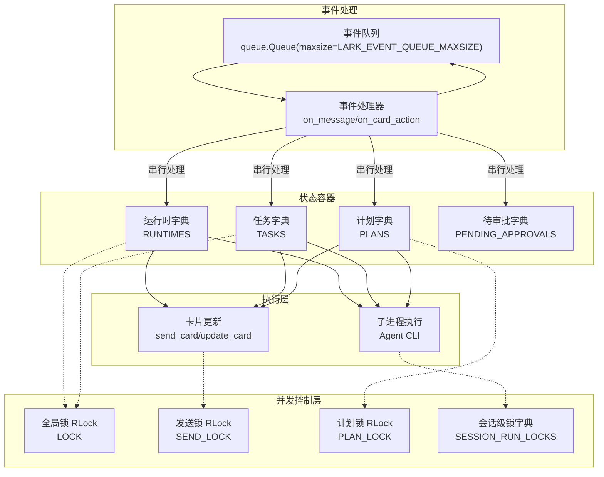
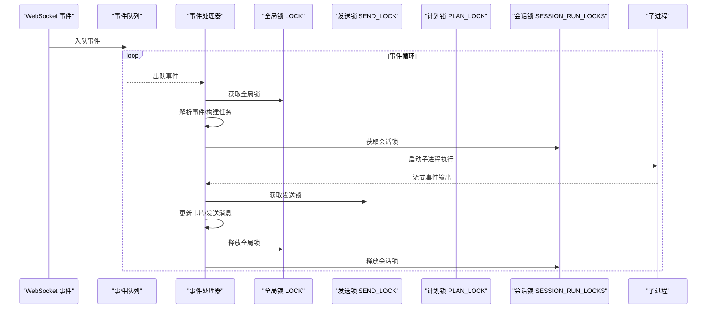
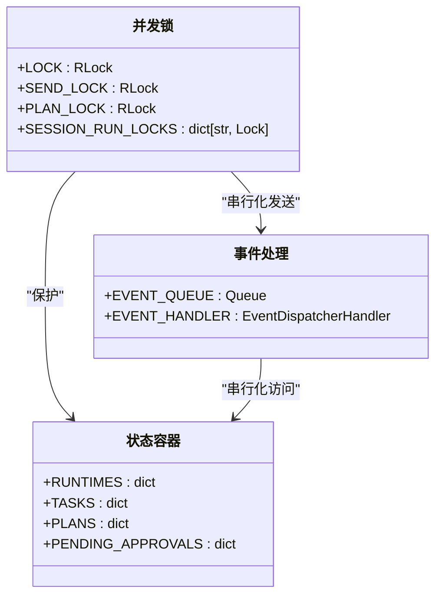
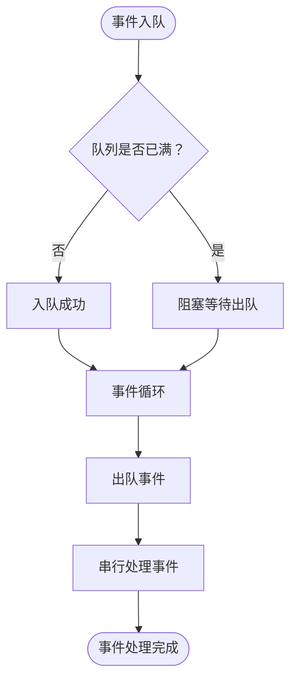
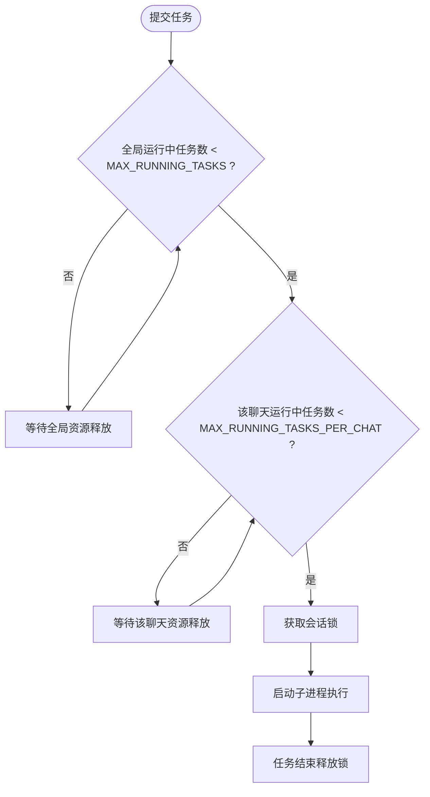
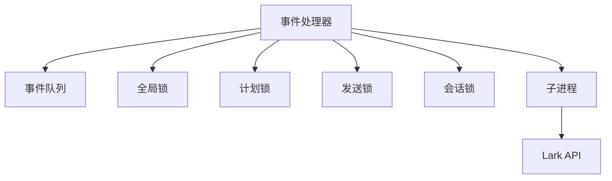

# 并发控制优化

<cite>
**本文档引用的文件**
- [lark2agent_ws.py](file://lark2agent_ws.py)
- [README.md](file://README.md)
</cite>

## 目录
1. [简介](#简介)
2. [项目结构](#项目结构)
3. [核心组件](#核心组件)
4. [架构概览](#架构概览)
5. [详细组件分析](#详细组件分析)
6. [依赖关系分析](#依赖关系分析)
7. [性能考虑](#性能考虑)
8. [故障排除指南](#故障排除指南)
9. [结论](#结论)

## 简介
本文件针对 Lark2Agent 的并发控制优化进行全面技术文档化，重点涵盖：
- 线程锁使用策略：RLock 的递归使用、锁粒度控制、死锁预防机制
- 队列管理优化：事件队列容量控制、优先级队列实现、阻塞超时设置
- 并发任务限制策略：MAX_RUNNING_TASKS 与 MAX_RUNNING_TASKS_PER_CHAT 的作用机制、任务排队算法、资源竞争处理
- 线程池管理：线程生命周期控制、任务调度策略、异常处理机制
- 并发性能监控：线程状态跟踪、锁等待时间统计、并发冲突检测
- 并发调优建议：线程数量配置、任务分解策略、资源共享优化

## 项目结构
Lark2Agent 采用单进程多线程架构，核心围绕以下关键要素组织：
- 全局状态容器：RUNTIMES、TASKS、PLANS 等字典，承载会话、任务、计划等运行时数据
- 并发控制锁：LOCK（RLock）、SEND_LOCK（RLock）、PLAN_LOCK（RLock）、SESSION_RUN_LOCKS（按会话粒度的 Lock）
- 事件队列：EVENT_QUEUE（基于 queue.Queue 的有界队列）
- 事件处理器：WebSocket 事件分发与处理
- 任务执行：子进程执行 Agent CLI，流式解析事件并更新卡片

**图表来源**
- [lark2agent_ws.py:387-406](file://lark2agent_ws.py#L387-L406)
- [lark2agent_ws.py:1642-1652](file://lark2agent_ws.py#L1642-L1652)
- [lark2agent_ws.py:3482-3524](file://lark2agent_ws.py#L3482-L3524)
- [lark2agent_ws.py:3663-3702](file://lark2agent_ws.py#L3663-L3702)

**章节来源**
- [lark2agent_ws.py:387-406](file://lark2agent_ws.py#L387-L406)
- [lark2agent_ws.py:1642-1652](file://lark2agent_ws.py#L1642-L1652)
- [lark2agent_ws.py:3482-3524](file://lark2agent_ws.py#L3482-L3524)
- [lark2agent_ws.py:3663-3702](file://lark2agent_ws.py#L3663-L3702)

## 核心组件
- 并发锁体系
  - 全局锁：LOCK（RLock），保护 RUNTIMES、TASKS、PENDING_APPROVALS 等共享状态的读写一致性
  - 发送锁：SEND_LOCK（RLock），串行化对外发送消息与卡片更新，避免 Lark API 并发冲突
  - 计划锁：PLAN_LOCK（RLock），保护 PLANS 的并发访问与持久化
  - 会话锁：SESSION_RUN_LOCKS（按会话键的 Lock 字典），隔离同一会话内的并发执行
- 事件队列：EVENT_QUEUE（queue.Queue），有界队列，受 LARK_EVENT_QUEUE_MAXSIZE 限制，避免内存膨胀
- 任务执行：通过子进程执行 Agent CLI，流式解析事件并更新卡片状态
- 并发限制：MAX_RUNNING_TASKS（全局并发任务上限）、MAX_RUNNING_TASKS_PER_CHAT（单聊天并发任务上限）

**章节来源**
- [lark2agent_ws.py:387-406](file://lark2agent_ws.py#L387-L406)
- [lark2agent_ws.py:107-108](file://lark2agent_ws.py#L107-L108)
- [lark2agent_ws.py:109](file://lark2agent_ws.py#L109)

## 架构概览
Lark2Agent 的并发控制遵循“锁最小化、队列化、串行化”的设计原则：
- 事件处理：WebSocket 事件进入 EVENT_QUEUE，由单一事件循环串行取出并处理，避免多线程竞争
- 状态访问：所有对 RUNTIMES、TASKS、PLANS 的读写均通过 LOCK/PLAN_LOCK 保护
- 发送操作：send_card/send_msg/update_card 均通过 SEND_LOCK 串行化，降低 Lark API 并发错误概率
- 会话隔离：同一会话的任务执行通过 SESSION_RUN_LOCKS 锁隔离，避免会话内资源竞争

**图表来源**
- [lark2agent_ws.py:1642-1652](file://lark2agent_ws.py#L1642-L1652)
- [lark2agent_ws.py:3482-3524](file://lark2agent_ws.py#L3482-L3524)
- [lark2agent_ws.py:3663-3702](file://lark2agent_ws.py#L3663-L3702)
- [lark2agent_ws.py:1199-1208](file://lark2agent_ws.py#L1199-L1208)

## 详细组件分析

### 线程锁使用策略
- RLock 的递归使用
  - LOCK、SEND_LOCK、PLAN_LOCK 均为 RLock，允许同一线程重复获取而不死锁
  - 示例：在 send_card/update_card 中，内部可能再次调用 send_card，RLock 可避免递归调用导致的死锁
- 锁粒度控制
  - 全局状态：RUNTIMES/TASKS/PENDING_APPROVALS 通过 LOCK 保护
  - 计划状态：PLANS 通过 PLAN_LOCK 保护
  - 发送操作：send_card/send_msg/update_card 通过 SEND_LOCK 保护
  - 会话隔离：同一会话的任务执行通过 SESSION_RUN_LOCKS 的 Lock 串行化
- 死锁预防机制
  - 明确的锁获取顺序：先获取全局锁，再获取会话锁；释放顺序相反
  - 锁持有时间尽量短：仅在必要的状态更新与持久化阶段持有锁
  - 会话级锁按需创建：session_run_lock 按需创建并缓存，避免不必要的全局锁竞争

**图表来源**
- [lark2agent_ws.py:387-406](file://lark2agent_ws.py#L387-L406)
- [lark2agent_ws.py:1642-1652](file://lark2agent_ws.py#L1642-L1652)

**章节来源**
- [lark2agent_ws.py:387-406](file://lark2agent_ws.py#L387-L406)
- [lark2agent_ws.py:1199-1208](file://lark2agent_ws.py#L1199-L1208)

### 队列管理优化
- 事件队列容量控制
  - EVENT_QUEUE 使用 queue.Queue(maxsize=LARK_EVENT_QUEUE_MAXSIZE)，默认 200
  - 当队列满时，新事件将被阻塞，避免内存无限增长
- 优先级队列实现
  - 代码中未实现显式的优先级队列；当前策略为 FIFO，通过锁与串行化保证处理顺序
- 阻塞超时设置
  - 出队使用默认阻塞行为；在需要快速响应的场景（如审批轮询）使用 STOP_SCHEDULER.wait 控制等待时间

**图表来源**
- [lark2agent_ws.py:401](file://lark2agent_ws.py#L401)
- [lark2agent_ws.py:1642-1652](file://lark2agent_ws.py#L1642-L1652)

**章节来源**
- [lark2agent_ws.py:401](file://lark2agent_ws.py#L401)
- [lark2agent_ws.py:1642-1652](file://lark2agent_ws.py#L1642-L1652)

### 并发任务限制策略
- MAX_RUNNING_TASKS（全局并发任务上限）
  - 作用：限制全局同时运行的 Agent 子进程数量，避免系统资源耗尽
  - 实现：在任务启动前检查当前运行中的任务数，超过上限则排队等待
- MAX_RUNNING_TASKS_PER_CHAT（单聊天并发任务上限）
  - 作用：限制同一 Lark chat 同时运行的任务数量，避免个别聊天占用过多资源
  - 实现：在任务启动前检查该 chat 的运行中任务数，超过上限则排队等待
- 任务排队算法
  - 基于队列的 FIFO 策略；通过锁保护状态更新，确保并发安全
- 资源竞争处理
  - 通过 SESSION_RUN_LOCKS 对同一会话的任务执行进行串行化
  - 通过 SEND_LOCK 串行化对外发送，减少 Lark API 并发错误

**图表来源**
- [lark2agent_ws.py:107-108](file://lark2agent_ws.py#L107-L108)
- [lark2agent_ws.py:1199-1208](file://lark2agent_ws.py#L1199-L1208)

**章节来源**
- [lark2agent_ws.py:107-108](file://lark2agent_ws.py#L107-L108)
- [lark2agent_ws.py:1199-1208](file://lark2agent_ws.py#L1199-L1208)

### 线程池管理
- 线程生命周期控制
  - 事件循环线程：由 lark.EventDispatcherHandler 的事件循环驱动，无需显式线程池
  - Keep Awake 线程：keep_awake_loop 通过 STOP_SCHEDULER 控制生命周期
- 任务调度策略
  - 串行调度：事件队列中的事件按序处理，避免并发竞争
  - 会话级串行：同一会话的任务通过 SESSION_RUN_LOCKS 串行化
- 异常处理机制
  - 子进程异常：捕获异常并设置任务状态为 failed，更新卡片
  - 发送异常：捕获异常并记录日志，避免影响其他任务

**章节来源**
- [lark2agent_ws.py:1751-1769](file://lark2agent_ws.py#L1751-L1769)
- [lark2agent_ws.py:5593-5599](file://lark2agent_ws.py#L5593-L5599)

### 并发性能监控
- 线程状态跟踪
  - 通过日志记录任务启动/结束、卡片更新、发送状态等关键事件
- 锁等待时间统计
  - 代码中未实现专门的锁等待时间统计；可通过外部指标系统采集
- 并发冲突检测
  - 通过日志中的异常与错误码（如 send_card/send_msg 失败）检测并发冲突
  - 会话锁的获取与释放日志可用于定位锁竞争热点

**章节来源**
- [lark2agent_ws.py:3482-3524](file://lark2agent_ws.py#L3482-L3524)
- [lark2agent_ws.py:3663-3702](file://lark2agent_ws.py#L3663-L3702)

## 依赖关系分析
- 组件耦合与内聚
  - 并发锁与状态容器高内聚：所有状态访问均通过锁保护
  - 事件处理与发送模块低耦合：通过锁实现解耦
- 直接与间接依赖
  - 事件处理器依赖事件队列与锁
  - 任务执行依赖会话锁与发送锁
  - 计划模块依赖计划锁与全局锁
- 外部依赖与集成点
  - Lark OpenAPI 客户端：通过 SEND_LOCK 串行化 API 调用
  - 子进程执行：Agent CLI 的启动与流式解析

**图表来源**
- [lark2agent_ws.py:1642-1652](file://lark2agent_ws.py#L1642-L1652)
- [lark2agent_ws.py:3482-3524](file://lark2agent_ws.py#L3482-L3524)
- [lark2agent_ws.py:3663-3702](file://lark2agent_ws.py#L3663-L3702)

**章节来源**
- [lark2agent_ws.py:1642-1652](file://lark2agent_ws.py#L1642-L1652)
- [lark2agent_ws.py:3482-3524](file://lark2agent_ws.py#L3482-L3524)
- [lark2agent_ws.py:3663-3702](file://lark2agent_ws.py#L3663-L3702)

## 性能考虑
- 锁竞争热点
  - RUNTIMES/TASKS/PENDING_APPROVALS 的频繁读写可能成为瓶颈
  - 建议：将高频读取的数据复制到局部变量，减少锁持有时间
- 事件队列容量
  - LARK_EVENT_QUEUE_MAXSIZE=200 为默认值，可根据业务峰值调整
  - 建议：监控队列长度与阻塞时间，动态调整容量
- 发送频率控制
  - SEND_LOCK 串行化发送，避免 Lark API 并发错误
  - 建议：合并小消息、批量更新卡片，减少发送次数
- 会话隔离
  - SESSION_RUN_LOCKS 有效避免会话内资源竞争
  - 建议：合理设置 MAX_RUNNING_TASKS_PER_CHAT，避免个别会话拖累整体性能

## 故障排除指南
- 发送失败（send_card/send_msg）
  - 现象：日志出现 send_card/send_msg failed，错误码 230001 或 invalid receive_id
  - 处理：调用 disable_chat_send 禁用该聊天的发送功能，避免重复失败
- 审批等待超时
  - 现象：wait_for_pending_approval 返回 timeout
  - 处理：检查 PENDING_APPROVAL_WAIT_SECONDS 设置，确认审批轮询间隔
- 子进程异常
  - 现象：任务状态变为 failed，输出异常信息
  - 处理：检查 Agent CLI 可执行文件路径与权限，查看日志定位具体异常

**章节来源**
- [lark2agent_ws.py:3482-3524](file://lark2agent_ws.py#L3482-L3524)
- [lark2agent_ws.py:3663-3702](file://lark2agent_ws.py#L3663-L3702)
- [lark2agent_ws.py:3346-3365](file://lark2agent_ws.py#L3346-L3365)
- [lark2agent_ws.py:5593-5599](file://lark2agent_ws.py#L5593-L5599)

## 结论
Lark2Agent 的并发控制通过“锁最小化、队列化、串行化”实现了稳定可靠的多任务执行。核心优化点包括：
- 使用 RLock 实现递归安全与死锁预防
- 通过锁粒度控制与会话隔离降低竞争
- 事件队列的容量控制与串行化处理
- 全局与会话级并发限制策略
- 发送操作的串行化以提升稳定性

建议在生产环境中结合监控指标持续优化锁粒度、队列容量与并发限制参数，以获得最佳性能与稳定性。