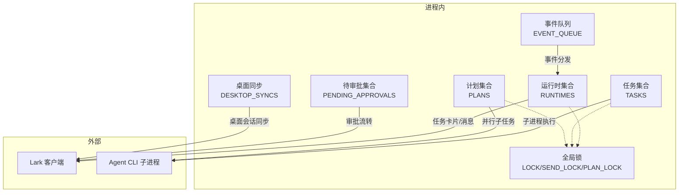
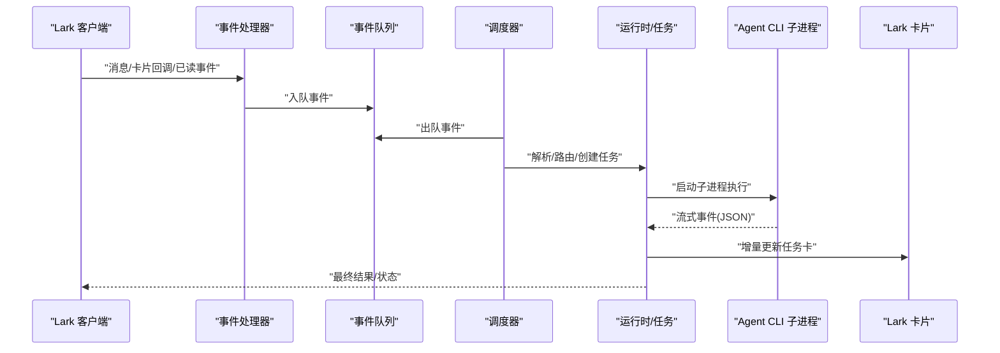
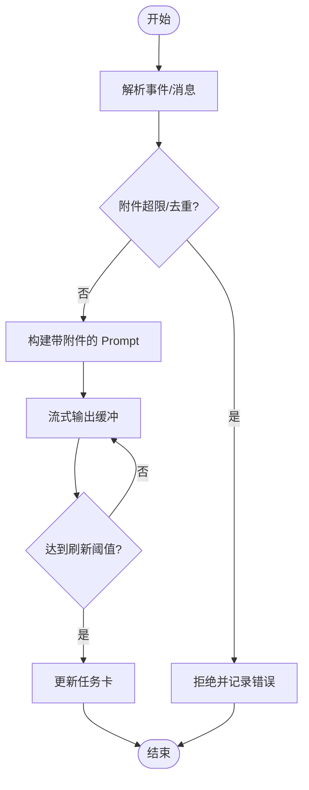
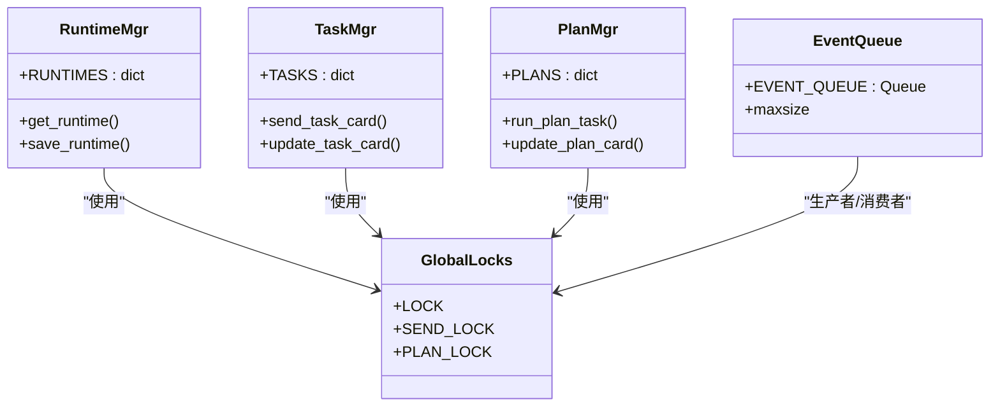
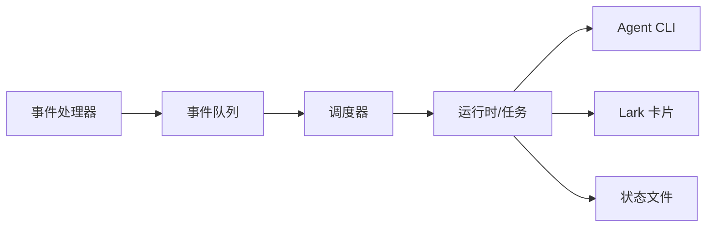

# 性能优化

<cite>
**本文引用的文件**
- [lark2agent_ws.py](file://lark2agent_ws.py)
- [README.md](file://README.md)
</cite>

## 目录
1. [简介](#简介)
2. [项目结构](#项目结构)
3. [核心组件](#核心组件)
4. [架构总览](#架构总览)
5. [详细组件分析](#详细组件分析)
6. [依赖关系分析](#依赖关系分析)
7. [性能考量与优化建议](#性能考量与优化建议)
8. [故障排查指南](#故障排查指南)
9. [结论](#结论)
10. [附录](#附录)

## 简介
本文件面向 Lark2Agent 的性能优化，聚焦于内存管理、并发控制、资源限制与监控指标，提供可落地的调优建议与测试方法。文档基于源码分析，结合配置项与运行时行为，帮助在高并发、多任务场景下稳定提升吞吐与稳定性。

## 项目结构
- 主程序入口与核心逻辑集中在单一文件中，采用模块化数据结构与锁机制组织并发与状态管理。
- 关键运行时状态包括：全局运行时、任务集合、桌面同步、待审批项、计划任务等，均通过全局字典与锁保护。
- 事件处理通过队列承载，支持 WebSocket 事件与内部任务调度。

图表来源
- [lark2agent_ws.py:401](file://lark2agent_ws.py#L401)
- [lark2agent_ws.py:387](file://lark2agent_ws.py#L387)
- [lark2agent_ws.py:393](file://lark2agent_ws.py#L393)
- [lark2agent_ws.py:394](file://lark2agent_ws.py#L394)
- [lark2agent_ws.py:395](file://lark2agent_ws.py#L395)
- [lark2agent_ws.py:396](file://lark2agent_ws.py#L396)

章节来源
- [lark2agent_ws.py:401](file://lark2agent_ws.py#L401)
- [lark2agent_ws.py:387](file://lark2agent_ws.py#L387)
- [lark2agent_ws.py:393](file://lark2agent_ws.py#L393)
- [lark2agent_ws.py:394](file://lark2agent_ws.py#L394)
- [lark2agent_ws.py:395](file://lark2agent_ws.py#L395)
- [lark2agent_ws.py:396](file://lark2agent_ws.py#L396)

## 核心组件
- 全局运行时与任务管理
  - 运行时集合与任务集合通过全局字典维护，配合全局锁保证并发安全。
  - 任务卡片与消息发送统一经由发送锁串行化，避免 Lark API 并发竞争。
- 事件队列与事件处理器
  - 事件队列支持最大积压，超出容量将阻塞入队，避免内存无限增长。
  - 事件处理器负责消息、卡片回调与已读事件的解码与路由。
- 计划并行执行
  - 计划任务支持并发度控制，子任务在独立工作树隔离执行，减少资源争用。
- 审批与权限控制
  - 审批项去重与指纹校验，避免重复审批与重复通知。
- 附件与消息处理
  - 附件下载与去重，限制单条消息附件数量与大小，避免内存膨胀。

章节来源
- [lark2agent_ws.py:387](file://lark2agent_ws.py#L387)
- [lark2agent_ws.py:393](file://lark2agent_ws.py#L393)
- [lark2agent_ws.py:394](file://lark2agent_ws.py#L394)
- [lark2agent_ws.py:395](file://lark2agent_ws.py#L395)
- [lark2agent_ws.py:396](file://lark2agent_ws.py#L396)
- [lark2agent_ws.py:401](file://lark2agent_ws.py#L401)
- [lark2agent_ws.py:1642](file://lark2agent_ws.py#L1642)
- [lark2agent_ws.py:1652](file://lark2agent_ws.py#L1652)
- [lark2agent_ws.py:3277](file://lark2agent_ws.py#L3277)
- [lark2agent_ws.py:3316](file://lark2agent_ws.py#L3316)
- [lark2agent_ws.py:1449](file://lark2agent_ws.py#L1449)
- [lark2agent_ws.py:1595](file://lark2agent_ws.py#L1595)
- [lark2agent_ws.py:3046](file://lark2agent_ws.py#L3046)

## 架构总览
Lark2Agent 采用“事件驱动 + 子进程执行”的架构：
- 事件层：WebSocket 事件经由事件处理器解析，入队后由调度器出队处理。
- 协调层：运行时、任务、计划、审批等状态集中管理，通过锁与队列协调。
- 执行层：Agent CLI 以子进程方式执行，流式输出解析并增量更新卡片。
- 同步层：桌面会话与 Lark 卡片双向同步，支持 Git 工作树隔离。

图表来源
- [lark2agent_ws.py:1642](file://lark2agent_ws.py#L1642)
- [lark2agent_ws.py:1652](file://lark2agent_ws.py#L1652)
- [lark2agent_ws.py:401](file://lark2agent_ws.py#L401)
- [lark2agent_ws.py:5012](file://lark2agent_ws.py#L5012)
- [lark2agent_ws.py:5427](file://lark2agent_ws.py#L5427)

章节来源
- [lark2agent_ws.py:1642](file://lark2agent_ws.py#L1642)
- [lark2agent_ws.py:1652](file://lark2agent_ws.py#L1652)
- [lark2agent_ws.py:401](file://lark2agent_ws.py#L401)
- [lark2agent_ws.py:5012](file://lark2agent_ws.py#L5012)
- [lark2agent_ws.py:5427](file://lark2agent_ws.py#L5427)

## 详细组件分析

### 内存管理策略
- 对象池与缓存
  - 会话文件索引与消息引用缓存受上限控制，避免无限增长。
  - 附件去重与临时文件清理，降低重复 IO 与磁盘占用。
- 垃圾回收优化
  - 流式输出缓冲按阈值刷新，避免长时间持有大文本。
  - 任务输出按最大字符限制截断，减少卡片渲染与传输压力。
- 内存泄漏防护
  - 附件下载使用临时文件与原子替换，异常路径清理临时文件。
  - 任务与计划状态定期持久化，重启后可恢复，避免重复加载造成峰值。
- 大对象处理
  - 附件大小与数量限制，超限直接拒绝，避免内存暴涨。
  - 任务输出与卡片内容分块发送，避免单次大消息导致内存峰值。

图表来源
- [lark2agent_ws.py:1449](file://lark2agent_ws.py#L1449)
- [lark2agent_ws.py:1595](file://lark2agent_ws.py#L1595)
- [lark2agent_ws.py:5427](file://lark2agent_ws.py#L5427)

章节来源
- [lark2agent_ws.py:1449](file://lark2agent_ws.py#L1449)
- [lark2agent_ws.py:1595](file://lark2agent_ws.py#L1595)
- [lark2agent_ws.py:5427](file://lark2agent_ws.py#L5427)

### 并发控制机制
- 线程锁使用
  - 全局锁保护运行时、任务、计划、审批等共享状态。
  - 发送锁串行化消息与卡片发送，避免 Lark API 并发错误。
  - 计划锁保护计划级并发与状态更新。
- 队列管理
  - 事件队列设置最大积压，避免内存无限增长。
  - 任务与计划执行通过子进程隔离，避免主线程阻塞。
- 并发任务限制
  - 全局并发与每会话并发限制，防止资源耗尽。
  - 计划子任务并发度由计划配置控制，避免 Git 工作树冲突。
- 死锁预防
  - 锁粒度最小化，尽量缩短持有时间。
  - 事件处理与任务执行分离，避免锁竞争。

图表来源
- [lark2agent_ws.py:387](file://lark2agent_ws.py#L387)
- [lark2agent_ws.py:393](file://lark2agent_ws.py#L393)
- [lark2agent_ws.py:394](file://lark2agent_ws.py#L394)
- [lark2agent_ws.py:395](file://lark2agent_ws.py#L395)
- [lark2agent_ws.py:401](file://lark2agent_ws.py#L401)

章节来源
- [lark2agent_ws.py:387](file://lark2agent_ws.py#L387)
- [lark2agent_ws.py:393](file://lark2agent_ws.py#L393)
- [lark2agent_ws.py:394](file://lark2agent_ws.py#L394)
- [lark2agent_ws.py:395](file://lark2agent_ws.py#L395)
- [lark2agent_ws.py:401](file://lark2agent_ws.py#L401)

### 资源限制策略
- 全局并发限制
  - 全局同时运行的 Agent 子进程上限，避免 CPU/IO 竞争。
  - 单个 Lark chat 同时运行的 Agent 子进程上限，避免个别会话独占资源。
- 计划并发限制
  - 计划最大并行度控制，子任务在独立工作树隔离执行。
- 事件队列限制
  - 事件队列最大积压，防止内存膨胀。
- 附件与消息限制
  - 单附件最大字节、附件数量上限、消息分片长度等，保障稳定性。

章节来源
- [lark2agent_ws.py:107](file://lark2agent_ws.py#L107)
- [lark2agent_ws.py:108](file://lark2agent_ws.py#L108)
- [lark2agent_ws.py:109](file://lark2agent_ws.py#L109)
- [lark2agent_ws.py:118](file://lark2agent_ws.py#L118)
- [lark2agent_ws.py:1449](file://lark2agent_ws.py#L1449)
- [lark2agent_ws.py:3424](file://lark2agent_ws.py#L3424)

### 性能监控指标
- 任务执行时间
  - 任务耗时格式化显示，支持累计时长统计。
- 内存使用
  - 通过附件大小限制与缓冲刷新策略间接控制内存峰值。
- CPU 占用
  - 通过并发限制与队列积压控制 CPU 使用率。
- 网络 I/O
  - 附件下载与卡片发送均受 Lark API 限制，队列与锁保障稳定性。

章节来源
- [lark2agent_ws.py:3206](file://lark2agent_ws.py#L3206)
- [lark2agent_ws.py:1449](file://lark2agent_ws.py#L1449)
- [lark2agent_ws.py:3482](file://lark2agent_ws.py#L3482)
- [lark2agent_ws.py:3663](file://lark2agent_ws.py#L3663)

## 依赖关系分析
- 组件耦合
  - 事件队列与调度器耦合度低，便于扩展。
  - 任务与计划模块通过运行时与锁耦合，需注意锁顺序。
- 外部依赖
  - Lark SDK 与 Agent CLI 子进程为关键外部依赖，需关注版本与兼容性。
- 潜在循环依赖
  - 未发现直接循环依赖；状态持久化与事件处理解耦良好。

图表来源
- [lark2agent_ws.py:1642](file://lark2agent_ws.py#L1642)
- [lark2agent_ws.py:401](file://lark2agent_ws.py#L401)
- [lark2agent_ws.py:5012](file://lark2agent_ws.py#L5012)
- [lark2agent_ws.py:3482](file://lark2agent_ws.py#L3482)

章节来源
- [lark2agent_ws.py:1642](file://lark2agent_ws.py#L1642)
- [lark2agent_ws.py:401](file://lark2agent_ws.py#L401)
- [lark2agent_ws.py:5012](file://lark2agent_ws.py#L5012)
- [lark2agent_ws.py:3482](file://lark2agent_ws.py#L3482)

## 性能考量与优化建议

### 配置参数优化
- 并发与队列
  - 根据 CPU 核心数与内存容量调整全局并发与每会话并发上限。
  - 合理设置事件队列最大积压，避免内存峰值过高。
- 附件与消息
  - 依据业务场景调整附件大小与数量上限，平衡功能与性能。
  - 适当增大消息分片长度，减少卡片更新频率。
- 计划执行
  - 根据 Git 工作树可用性与磁盘空间设置最大并行度，避免工作树冲突。

章节来源
- [lark2agent_ws.py:107](file://lark2agent_ws.py#L107)
- [lark2agent_ws.py:108](file://lark2agent_ws.py#L108)
- [lark2agent_ws.py:109](file://lark2agent_ws.py#L109)
- [lark2agent_ws.py:118](file://lark2agent_ws.py#L118)
- [lark2agent_ws.py:1449](file://lark2agent_ws.py#L1449)
- [lark2agent_ws.py:3424](file://lark2agent_ws.py#L3424)

### 硬件与系统资源
- CPU
  - 优先保证并发限制与队列积压合理，避免 CPU 饱和。
- 内存
  - 控制附件大小与消息分片，避免内存峰值过高。
- 磁盘
  - 计划工作树与附件目录需充足空间，定期清理临时文件。
- 网络
  - Lark API 限流与稳定性影响整体吞吐，建议在高峰期降低刷新频率。

章节来源
- [lark2agent_ws.py:1449](file://lark2agent_ws.py#L1449)
- [lark2agent_ws.py:3046](file://lark2agent_ws.py#L3046)

### 批量处理策略
- 事件批处理
  - 合理设置刷新阈值，减少卡片更新次数。
- 任务批处理
  - 计划任务按阶段与依赖有序执行，避免无序并发。
- 附件批处理
  - 附件去重与临时文件清理，减少 IO 压力。

章节来源
- [lark2agent_ws.py:5427](file://lark2agent_ws.py#L5427)
- [lark2agent_ws.py:4322](file://lark2agent_ws.py#L4322)
- [lark2agent_ws.py:1595](file://lark2agent_ws.py#L1595)

### 性能测试与基准
- 基准场景
  - 单会话高频消息、多会话并发、大量附件、长文本、计划并行。
- 指标采集
  - 任务平均耗时、队列积压、CPU 使用率、内存峰值、Lark API 响应时间。
- 方法建议
  - 使用系统监控工具与日志分析，对比不同配置下的指标变化。
  - 逐步扩大并发与任务规模，观察系统瓶颈点。

章节来源
- [README.md:317](file://README.md#L317)
- [README.md:405](file://README.md#L405)

## 故障排查指南
- 附件下载失败
  - 检查附件大小与数量限制、网络与磁盘空间。
- 任务卡更新失败
  - 检查发送锁状态与 Lark API 返回码，必要时降低刷新频率。
- 审批卡堆积
  - 检查审批等待轮询间隔与超时设置，避免无效轮询。
- 计划执行失败
  - 检查工作树创建与 Git 命令超时，必要时调整超时时间。

章节来源
- [lark2agent_ws.py:1449](file://lark2agent_ws.py#L1449)
- [lark2agent_ws.py:3663](file://lark2agent_ws.py#L3663)
- [lark2agent_ws.py:3346](file://lark2agent_ws.py#L3346)
- [lark2agent_ws.py:3101](file://lark2agent_ws.py#L3101)

## 结论
通过合理的并发限制、队列管理与资源控制，Lark2Agent 能在高负载场景下保持稳定与高效。建议结合业务特征与硬件条件，持续优化配置参数并建立监控体系，以获得最佳性能表现。

## 附录
- 配置项速览（节选）
  - 全局并发：MAX_RUNNING_TASKS
  - 每会话并发：MAX_RUNNING_TASKS_PER_CHAT
  - 事件队列上限：LARK_EVENT_QUEUE_MAXSIZE
  - 附件大小上限：LARK_ATTACHMENT_MAX_BYTES
  - 附件数量上限：MAX_LARK_ATTACHMENTS_PER_MESSAGE
  - 消息分片长度：LARK_MESSAGE_CHUNK_SIZE
  - 计划最大并行：PLAN_MAX_PARALLEL

章节来源
- [lark2agent_ws.py:107](file://lark2agent_ws.py#L107)
- [lark2agent_ws.py:108](file://lark2agent_ws.py#L108)
- [lark2agent_ws.py:109](file://lark2agent_ws.py#L109)
- [lark2agent_ws.py:111](file://lark2agent_ws.py#L111)
- [lark2agent_ws.py:113](file://lark2agent_ws.py#L113)
- [lark2agent_ws.py:101](file://lark2agent_ws.py#L101)
- [lark2agent_ws.py:118](file://lark2agent_ws.py#L118)