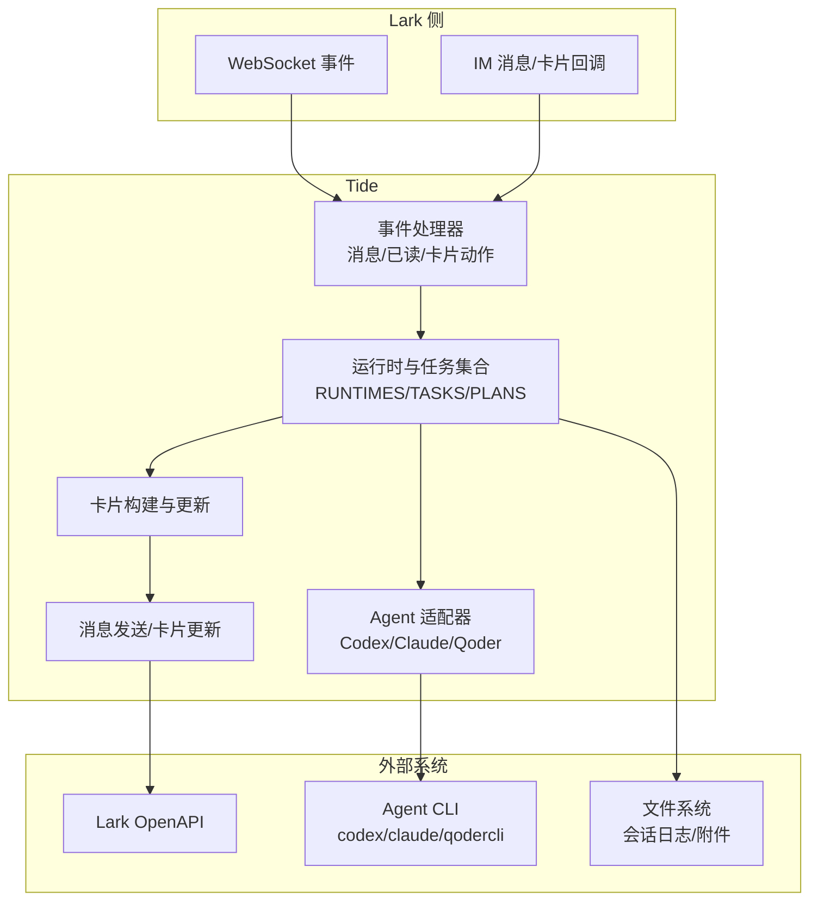
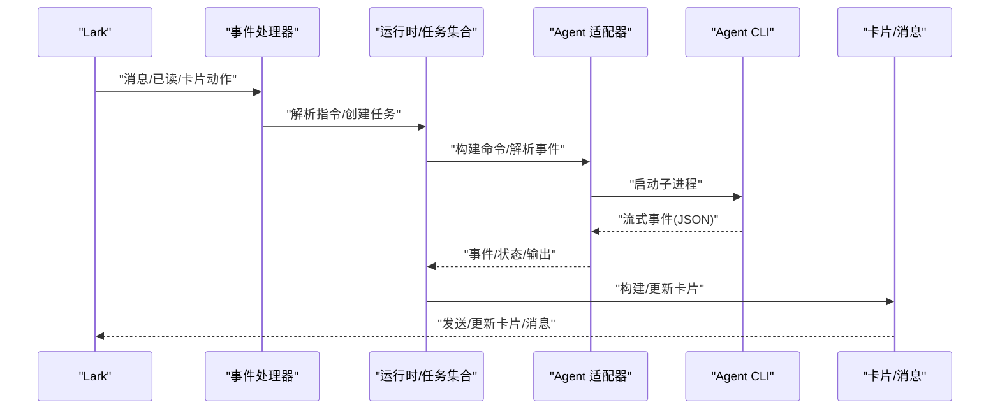
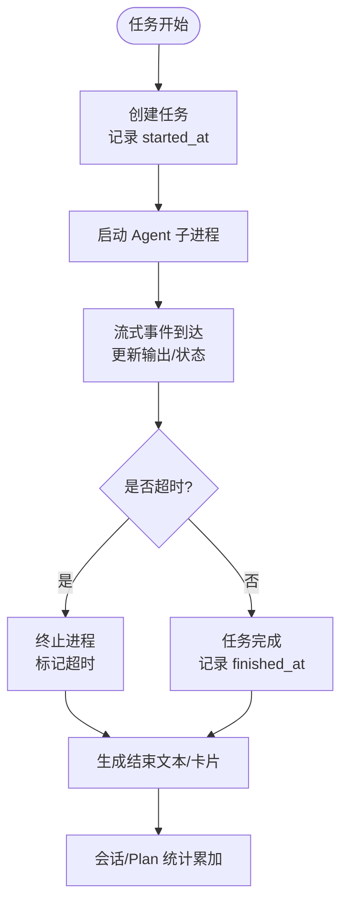
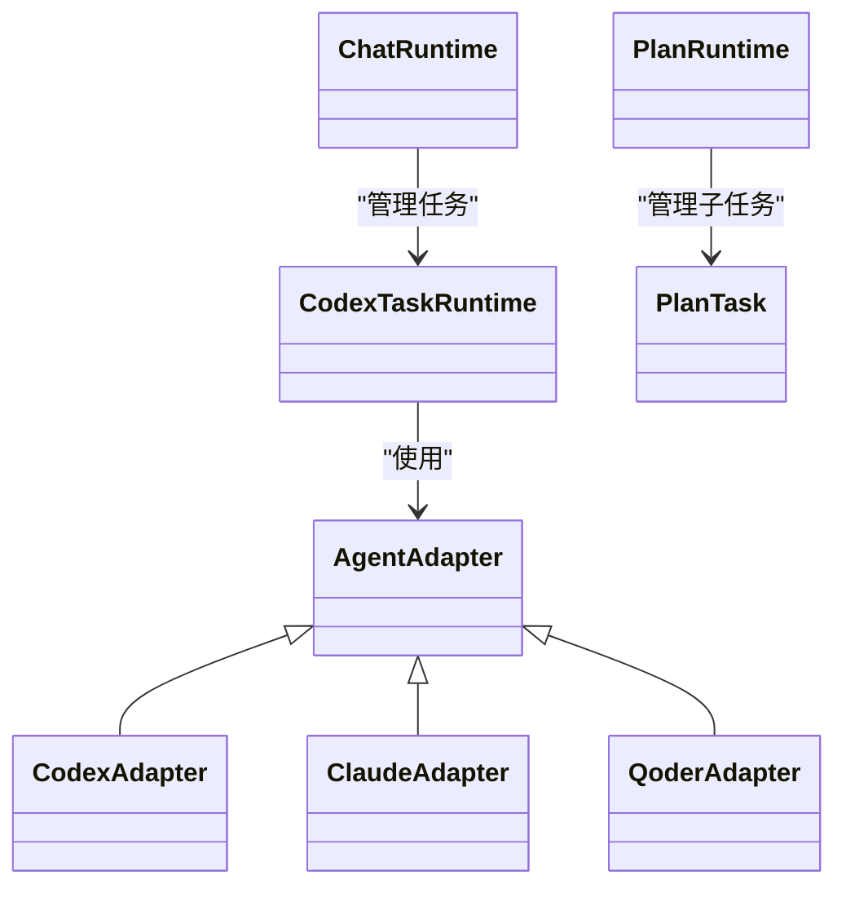

# 性能监控指标

<cite>
**本文引用的文件**
- [README.md](file://README.md)
- [tide_ws.py](file://tide_ws.py)
</cite>

## 目录
1. [简介](#简介)
2. [项目结构](#项目结构)
3. [核心组件](#核心组件)
4. [架构总览](#架构总览)
5. [详细组件分析](#详细组件分析)
6. [依赖关系分析](#依赖关系分析)
7. [性能考量](#性能考量)
8. [故障排查指南](#故障排查指南)
9. [结论](#结论)
10. [附录](#附录)

## 简介
本文件围绕 Tide 的性能监控指标体系进行系统化梳理，聚焦于任务执行时间统计（启动延迟、执行时长分布、完成率）、内存与 GC、CPU 占有率、网络 I/O（WebSocket 连接与消息吞吐）、关键性能指标（并发度、响应时间、错误率、资源利用率），并给出性能基线、阈值与回归检测建议，以及与日志分析、性能分析器及第三方监控系统的集成思路。

## 项目结构
- 主程序入口为 tide_ws.py，负责：
  - Lark WebSocket 事件接入与消息处理
  - 任务生命周期管理（创建、执行、卡片更新、超时、停止）
  - Plan 并行任务调度与状态汇总
  - 会话与桌面同步、附件下载、卡片渲染与消息发送
- README.md 提供功能说明、运行方式、环境变量与常见问题，便于定位性能相关配置项。

图表来源
- [tide_ws.py:1642-1652](file://tide_ws.py#L1642-L1652)
- [tide_ws.py:387-406](file://tide_ws.py#L387-L406)
- [tide_ws.py:626-801](file://tide_ws.py#L626-L801)

章节来源
- [README.md:1-517](file://README.md#L1-L517)
- [tide_ws.py:1-200](file://tide_ws.py#L1-L200)

## 核心组件
- 运行时与任务数据结构
  - ChatRuntime：会话级运行时状态（当前 Agent、目录、任务状态、卡片更新时间等）
  - CodexTaskRuntime：单任务运行时（启动时间、状态、输出、附件、超时策略等）
  - PlanRuntime/PlanTask：Plan 并行任务运行时（并发度、依赖、耗时、状态、Diff/提交信息等）
- 事件与卡片
  - 事件处理器注册消息、已读、卡片动作
  - 任务/Plan 卡片字段包含状态、耗时、超时、模型、目录、附件等
- Agent 适配器
  - 统一构建命令、解析事件、超时策略（含 Quest 模式）

章节来源
- [tide_ws.py:173-396](file://tide_ws.py#L173-L396)
- [tide_ws.py:626-801](file://tide_ws.py#L626-L801)
- [tide_ws.py:3897-4026](file://tide_ws.py#L3897-L4026)
- [tide_ws.py:4405-4505](file://tide_ws.py#L4405-L4505)

## 架构总览
Tide 通过 Lark 事件订阅接入消息，基于事件处理器解析指令，创建任务并启动 Agent 子进程；任务执行过程中持续更新卡片，记录会话日志；Plan 模式下并行调度多个子任务，汇总状态与输出。

图表来源
- [tide_ws.py:1642-1652](file://tide_ws.py#L1642-L1652)
- [tide_ws.py:626-801](file://tide_ws.py#L626-L801)
- [tide_ws.py:3897-4026](file://tide_ws.py#L3897-L4026)

## 详细组件分析

### 任务执行时间统计
- 启动延迟
  - 任务创建时刻与子进程首次输出之间的时间差，可用于衡量“感知到响应”的延迟。
  - 关键字段：任务创建时间戳、首次输出时间戳（由 Agent 事件流驱动更新）。
- 执行时长分布
  - 单任务耗时：任务启动时间到结束时间（含暂停累计）。
  - Plan 子任务耗时：子任务 started_at 到 finished_at。
  - 会话维度耗时：ConversationInfo.duration_seconds/today_duration_seconds 累加。
- 完成率统计
  - 会话完成事件携带 duration_ms，转换为秒累加到会话统计。
  - Plan 完成/失败/取消/排队/审批/待提交等状态计数，用于整体完成率与阻塞点分析。

图表来源
- [tide_ws.py:3185-3228](file://tide_ws.py#L3185-L3228)
- [tide_ws.py:2400-2437](file://tide_ws.py#L2400-L2437)
- [tide_ws.py:4376-4383](file://tide_ws.py#L4376-L4383)

章节来源
- [tide_ws.py:2400-2437](file://tide_ws.py#L2400-L2437)
- [tide_ws.py:3185-3228](file://tide_ws.py#L3185-L3228)
- [tide_ws.py:4376-4383](file://tide_ws.py#L4376-L4383)

### 内存使用情况监控
- 堆内存使用
  - Python 进程内存随任务并发、会话日志大小、附件缓存增长而变化；建议结合系统监控工具（如 ps/top/htop、Linux pmap）观察 RSS/VMS 变化趋势。
- 非堆内存占用
  - 附件下载缓冲、消息分片、卡片渲染对象等可能占用非堆区域；关注大附件场景下的峰值内存。
- GC 活动频率
  - Python 默认 GC 为三色分代；高并发任务与频繁卡片更新可能增加 GC 压力。建议：
    - 降低卡片更新频率（如增加最小更新间隔）
    - 控制一次性输出长度（FINAL_REPLY_MAX_CHARS/LARK_MESSAGE_CHUNK_SIZE）
    - 合理设置事件队列容量（LARK_EVENT_QUEUE_MAXSIZE）

章节来源
- [tide_ws.py:101-151](file://tide_ws.py#L101-L151)
- [tide_ws.py:3424-3438](file://tide_ws.py#L3424-L3438)

### CPU 占用率监控
- 进程 CPU 使用
  - 任务执行期间由 Agent CLI 子进程承担 CPU；Python 主进程主要负责事件循环、IO 与卡片更新。
- 线程 CPU 分配
  - 事件循环、附件下载、卡片更新等多处使用线程锁（LOCK/SEND_LOCK/PLAN_LOCK），需关注锁竞争与上下文切换。
- 计算密集型任务占比
  - 附件下载/解码、消息分片、卡片渲染、会话日志解析等为 CPU 密集环节；可通过采样工具（如 Linux perf/top）定位热点。

章节来源
- [tide_ws.py:393-406](file://tide_ws.py#L393-L406)
- [tide_ws.py:1642-1652](file://tide_ws.py#L1642-L1652)

### 网络 I/O 监控
- WebSocket 连接状态
  - 事件处理器注册消息/已读/卡片动作；建议监控连接断线次数、重连耗时、事件积压（EVENT_QUEUE）。
- 消息吞吐量
  - 单次消息分片大小（MESSAGE_CHUNK_SIZE）与最终回复长度限制（FINAL_REPLY_MAX_CHARS/FINAL_QUESTION_MAX_CHARS）影响吞吐。
- 带宽使用情况
  - 附件下载涉及大流量；受 LARK_ATTACHMENT_MAX_BYTES 与下载速率限制；建议监控下载吞吐与失败率。

章节来源
- [tide_ws.py:101-151](file://tide_ws.py#L101-L151)
- [tide_ws.py:1642-1652](file://tide_ws.py#L1642-L1652)
- [tide_ws.py:1449-1539](file://tide_ws.py#L1449-L1539)

### 关键性能指标
- 任务并发度
  - 全局并发上限（MAX_RUNNING_TASKS）、单会话并发上限（MAX_RUNNING_TASKS_PER_CHAT）、Plan 并发（PLAN_MAX_PARALLEL）。
- 响应时间
  - 任务启动延迟（首次输出）、平均/分位耗时（任务/会话/Plan）、卡片刷新间隔（TASK_CARD_REFRESH_INTERVAL_SECONDS）。
- 错误率
  - 会话日志中失败信号识别（looks_failed）、审批相关信号（looks_approval_related）、任务失败/超时/终止比例。
- 资源利用率
  - CPU/内存/GC/网络 I/O 的总体与分项占比，结合系统监控与日志分析。

章节来源
- [tide_ws.py:107-124](file://tide_ws.py#L107-L124)
- [tide_ws.py:2268-2287](file://tide_ws.py#L2268-L2287)
- [tide_ws.py:7237-7249](file://tide_ws.py#L7237-L7249)

## 依赖关系分析
- 组件耦合
  - 事件处理器与运行时强耦合，任务生命周期贯穿卡片更新与会话日志。
  - Agent 适配器抽象统一命令构建与事件解析，便于扩展与对比不同 Agent 的性能差异。
- 外部依赖
  - Lark OpenAPI、Agent CLI、文件系统（会话日志/附件）、系统电源管理（macOS 保活）。

图表来源
- [tide_ws.py:173-396](file://tide_ws.py#L173-L396)
- [tide_ws.py:626-801](file://tide_ws.py#L626-L801)
- [tide_ws.py:371-386](file://tide_ws.py#L371-L386)

章节来源
- [tide_ws.py:173-396](file://tide_ws.py#L173-L396)
- [tide_ws.py:626-801](file://tide_ws.py#L626-L801)

## 性能考量
- 任务执行
  - 合理设置任务超时（CODEX_TIMEOUT_SECONDS/CLAUDE_TIMEOUT_SECONDS/QODER_TIMEOUT_SECONDS/QODER_QUEST_TIMEOUT_SECONDS），避免长时间阻塞。
  - 通过暂停/继续（Qoder Quest）减少无效计算，降低 CPU 占用。
- 并发控制
  - 严格控制全局与会话并发上限，避免资源争用导致的抖动。
  - Plan 并发度（PLAN_MAX_PARALLEL）与工作树隔离（PLAN_USE_WORKTREES）平衡任务隔离与资源消耗。
- 卡片与消息
  - 降低卡片更新频率（TASK_CARD_REFRESH_INTERVAL_SECONDS），控制一次性输出长度（FINAL_REPLY_MAX_CHARS/PLAN_TASK_OUTPUT_MAX_CHARS），减少内存与 CPU 压力。
- 附件与网络
  - 限制附件大小（LARK_ATTACHMENT_MAX_BYTES）、消息分片（MESSAGE_CHUNK_SIZE），优化下载吞吐与失败率。
- 日志与可观测性
  - 结合日志级别（LOG_LEVEL）与消息内容开关（LOG_MESSAGE_CONTENT），在性能分析与问题定位间取得平衡。

章节来源
- [tide_ws.py:78-91](file://tide_ws.py#L78-L91)
- [tide_ws.py:107-124](file://tide_ws.py#L107-L124)
- [tide_ws.py:118-124](file://tide_ws.py#L118-L124)
- [tide_ws.py:101-151](file://tide_ws.py#L101-L151)

## 故障排查指南
- WebSocket 与消息
  - 若出现 send_card/send_msg 失败或 invalid receive_id，系统会禁用该会话发送；检查 Lark 权限与机器人加入状态。
- 任务超时与卡死
  - 超时后会终止子进程并更新卡片；若长时间无输出，检查 Agent CLI 可用性与网络状况。
- 附件下载失败
  - 超出大小限制或下载异常会记录错误；检查 LARK_ATTACHMENT_MAX_BYTES 与网络稳定性。
- macOS 保活
  - caffeinate/pmset 失败或权限不足会导致合盖休眠；按需调整 KEEP_AWAKE_* 配置。

章节来源
- [tide_ws.py:3514-3524](file://tide_ws.py#L3514-L3524)
- [tide_ws.py:6516-6534](file://tide_ws.py#L6516-L6534)
- [tide_ws.py:1471-1539](file://tide_ws.py#L1471-L1539)
- [tide_ws.py:1677-1770](file://tide_ws.py#L1677-L1770)

## 结论
Tide 已具备完善的任务生命周期与卡片可观测性，能够支撑任务执行时间统计、完成率与会话耗时等关键指标。结合系统层内存/CPU/网络监控与合理的并发/超时/输出控制策略，可形成稳定可靠的性能监控体系。建议在生产环境中引入第三方监控平台采集系统指标与日志，配合性能分析器进行热点定位与回归检测。

## 附录
- 性能基线建议
  - 正常运行时：任务平均耗时、卡片更新延迟、附件下载成功率、WebSocket 事件积压不超过阈值。
  - 异常阈值：任务超时率、失败率、内存峰值、GC 频率、网络下载失败率上升即告警。
  - 回归检测：定期对比关键指标分位值，发现趋势异常及时介入。
- 监控工具集成
  - 日志分析：ELK/Fluentd/Vector 收集日志，提取耗时、错误、超时等字段。
  - 性能分析器：perf/strace/htop/pmap 用于 CPU/内存/GC/系统调用分析。
  - 第三方监控：Prometheus/Grafana/云监控平台采集系统指标与业务指标。

章节来源
- [README.md:317-427](file://README.md#L317-L427)
- [tide_ws.py:1655-1770](file://tide_ws.py#L1655-L1770)