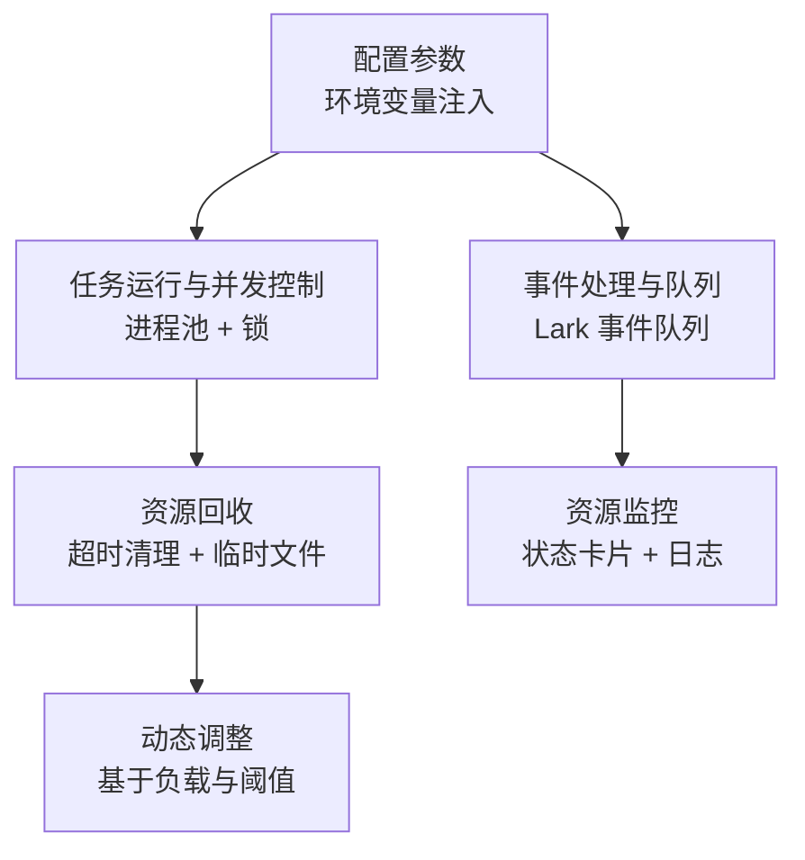
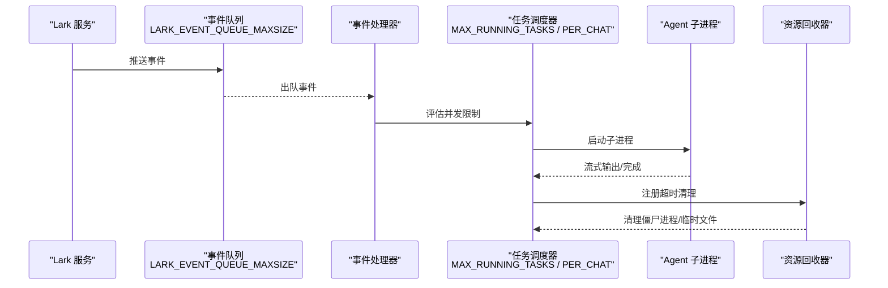
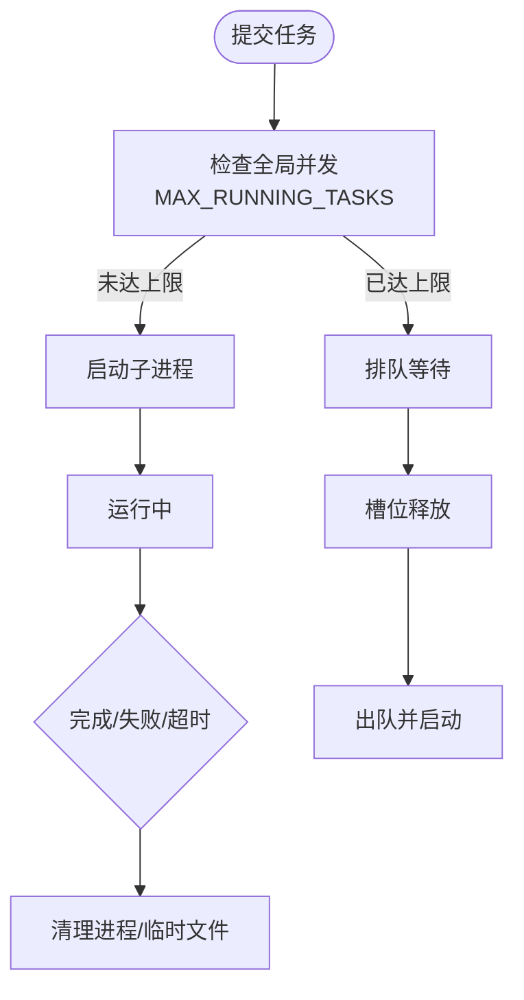
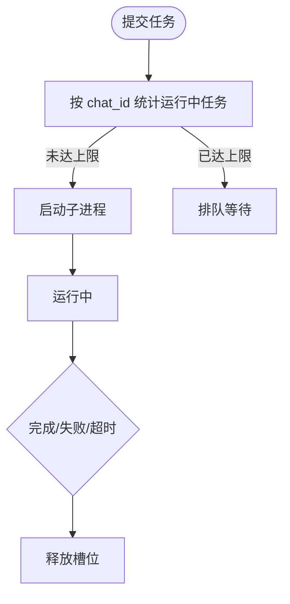
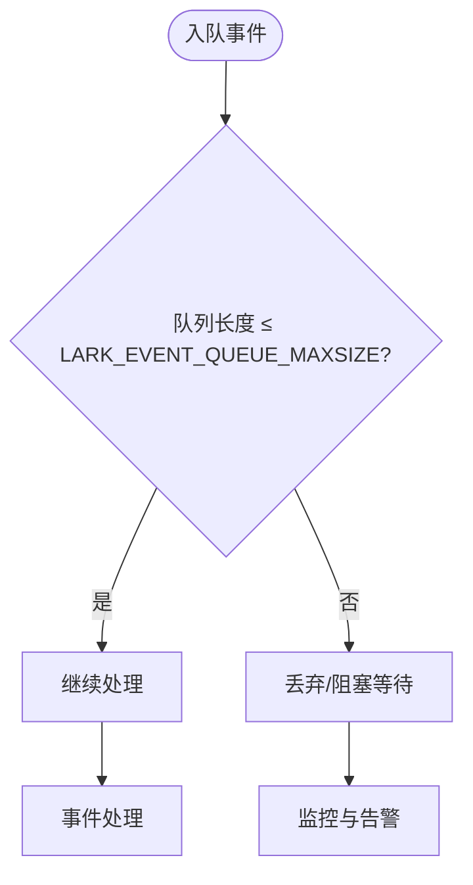
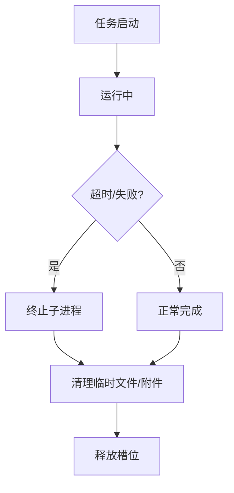
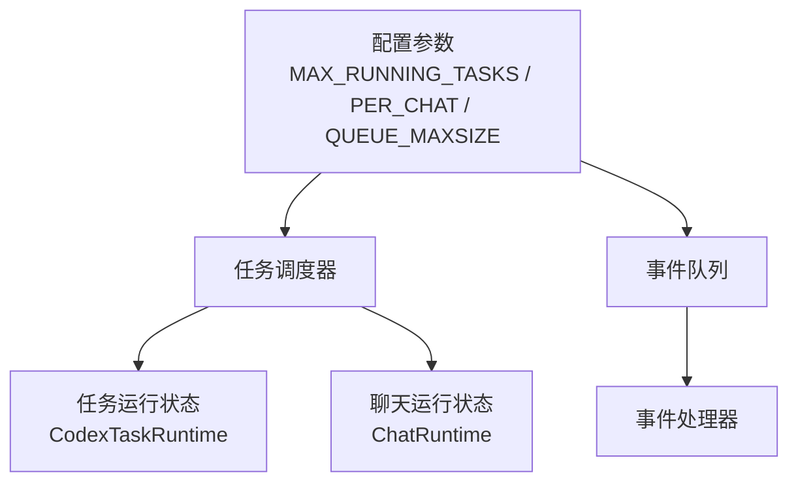

# 资源限制策略

<cite>
**本文档引用的文件**
- [tide_ws.py](file://tide_ws.py)
- [README.md](file://README.md)
</cite>

## 目录
1. [简介](#简介)
2. [项目结构](#项目结构)
3. [核心组件](#核心组件)
4. [架构概览](#架构概览)
5. [详细组件分析](#详细组件分析)
6. [依赖关系分析](#依赖关系分析)
7. [性能考虑](#性能考虑)
8. [故障排查指南](#故障排查指南)
9. [结论](#结论)
10. [附录](#附录)

## 简介
本文件聚焦于 Tide 的资源限制策略，围绕以下关键目标展开：
- 全面解释配置参数的作用机制与实现原理，包括全局并发限制、聊天级别限制、事件队列容量。
- 说明资源分配策略（CPU 时间片、内存、磁盘），并提供资源监控指标与阈值告警机制。
- 解释资源回收策略（超时任务清理、僵尸进程处理、临时文件删除）。
- 提供资源限制的动态调整方法（基于系统负载、请求量、资源紧张时的降级策略）。
- 给出资源优化配置指南（硬件建议、系统参数调优、容器化部署优化）。

## 项目结构
Tide 主要通过单一入口脚本实现资源限制与任务调度：
- 配置参数集中于脚本顶部，采用环境变量注入与默认值设定。
- 任务运行与并发控制通过进程池与锁机制实现。
- 事件处理采用队列缓冲，避免阻塞主线程。
- 资源回收通过超时检测与临时文件清理机制保障。

**图表来源**
- [tide_ws.py:54-151](file://tide_ws.py#L54-L151)
- [tide_ws.py:401-401](file://tide_ws.py#L401-L401)

**章节来源**
- [tide_ws.py:54-151](file://tide_ws.py#L54-L151)
- [tide_ws.py:401-401](file://tide_ws.py#L401-L401)

## 核心组件
本节聚焦资源限制相关的核心配置与数据结构：

- 全局并发限制：MAX_RUNNING_TASKS
  - 作用：限制同时运行的 Agent 子进程总数，避免系统资源耗尽。
  - 实现：通过进程池与锁控制，超出限制的任务进入排队状态。
  - 默认值：6；可配置为 0 表示不限制。

- 聊天级别限制：MAX_RUNNING_TASKS_PER_CHAT
  - 作用：限制单个 Lark chat 同时运行的 Agent 子进程数，防止个别会话占用过多资源。
  - 实现：按 chat_id 维度统计运行中的任务数，超过阈值则排队。
  - 默认值：4；可配置为 0 表示不限制。

- 事件队列容量：LARK_EVENT_QUEUE_MAXSIZE
  - 作用：限制 Lark 事件在内存中的积压数量，避免内存膨胀。
  - 实现：使用有界队列，超过容量时新事件将被丢弃或阻塞直到队列腾挪。
  - 默认值：200；可配置为 0 表示不限制（不推荐）。

- 附件与磁盘保护：LARK_ATTACHMENT_MAX_BYTES、LARK_PENDING_ATTACHMENT_TTL_SECONDS
  - 作用：限制单个附件大小与附件暂存时间，避免磁盘空间被大量附件占满。
  - 实现：下载前校验大小，超限时拒绝；定期清理过期附件。

- 会话与索引上限：MAX_SESSION_FILES
  - 作用：限制索引的会话文件数量，避免 IO 压力过大。
  - 实现：按时间排序并裁剪至上限。

**章节来源**
- [tide_ws.py:107-109](file://tide_ws.py#L107-L109)
- [tide_ws.py:111-112](file://tide_ws.py#L111-L112)
- [tide_ws.py:106-106](file://tide_ws.py#L106-L106)
- [README.md:389-391](file://README.md#L389-L391)

## 架构概览
Tide 的资源限制策略贯穿事件处理、任务执行与资源回收三个层面：

**图表来源**
- [tide_ws.py:401-401](file://tide_ws.py#L401-L401)
- [tide_ws.py:5012-5035](file://tide_ws.py#L5012-L5035)
- [tide_ws.py:5516-5536](file://tide_ws.py#L5516-L5536)

## 详细组件分析

### 全局并发限制策略（MAX_RUNNING_TASKS）
- 作用机制
  - 通过进程池与全局锁控制同时运行的子进程数量。
  - 超出限制的任务进入排队状态，等待空闲槽位释放。
- 关键实现点
  - 进程启动与状态维护：[tide_ws.py:5516-5536](file://tide_ws.py#L5516-L5536)
  - 任务状态更新与卡片刷新：[tide_ws.py:4094-4144](file://tide_ws.py#L4094-L4144)
  - 会话维度排队：[tide_ws.py:3969-3975](file://tide_ws.py#L3969-L3975)

**图表来源**
- [tide_ws.py:5516-5536](file://tide_ws.py#L5516-L5536)
- [tide_ws.py:4094-4144](file://tide_ws.py#L4094-L4144)

**章节来源**
- [tide_ws.py:5516-5536](file://tide_ws.py#L5516-L5536)
- [tide_ws.py:4094-4144](file://tide_ws.py#L4094-L4144)
- [tide_ws.py:3969-3975](file://tide_ws.py#L3969-L3975)

### 聊天级别限制策略（MAX_RUNNING_TASKS_PER_CHAT）
- 作用机制
  - 按 chat_id 维度统计运行中的任务数，超过阈值则排队。
  - 保证单个会话不会过度占用系统资源。
- 关键实现点
  - 会话维度排队状态：[tide_ws.py:3969-3975](file://tide_ws.py#L3969-L3975)
  - 任务状态卡片字段：[tide_ws.py:3940-3950](file://tide_ws.py#L3940-L3950)

**图表来源**
- [tide_ws.py:3969-3975](file://tide_ws.py#L3969-L3975)
- [tide_ws.py:3940-3950](file://tide_ws.py#L3940-L3950)

**章节来源**
- [tide_ws.py:3969-3975](file://tide_ws.py#L3969-L3975)
- [tide_ws.py:3940-3950](file://tide_ws.py#L3940-L3950)

### 事件队列容量策略（LARK_EVENT_QUEUE_MAXSIZE）
- 作用机制
  - 限制 Lark 事件在内存中的积压数量，避免内存膨胀导致系统不稳定。
  - 超过容量时，新事件将被丢弃或阻塞，直至队列腾挪。
- 关键实现点
  - 队列初始化与容量：[tide_ws.py:401-401](file://tide_ws.py#L401-L401)
  - 队列使用场景：事件分发、卡片更新、状态推送。

**图表来源**
- [tide_ws.py:401-401](file://tide_ws.py#L401-L401)

**章节来源**
- [tide_ws.py:401-401](file://tide_ws.py#L401-L401)

### 资源分配策略
- CPU 时间片分配
  - 通过并发限制与排队机制，避免 CPU 被单个会话或任务长时间独占。
  - 任务间公平调度，优先释放槽位的高优先级任务。
- 内存使用上限
  - 事件队列容量限制内存占用峰值。
  - 会话文件索引上限减少内存压力。
- 磁盘空间保护
  - 附件大小限制与过期清理，防止磁盘被附件占满。
  - 临时文件在任务结束后清理，避免残留。

**章节来源**
- [tide_ws.py:111-112](file://tide_ws.py#L111-L112)
- [tide_ws.py:1546-1559](file://tide_ws.py#L1546-L1559)
- [tide_ws.py:106-106](file://tide_ws.py#L106-L106)

### 资源监控指标与阈值告警
- 实时资源使用率
  - 通过任务卡片展示状态、耗时、模型与 Agent 类型，辅助判断资源占用。
  - 会话文件索引与会话数量上限，反映 IO 压力。
- 历史趋势分析
  - 会话文件按时间排序，便于分析任务执行趋势与资源消耗变化。
- 阈值告警机制
  - 事件队列超限时触发监控与告警（建议在外部监控系统中实现）。
  - 任务超时与失败状态在卡片中明确标注，便于及时干预。

**章节来源**
- [tide_ws.py:3940-3950](file://tide_ws.py#L3940-L3950)
- [tide_ws.py:2290-2296](file://tide_ws.py#L2290-L2296)
- [tide_ws.py:2298-2304](file://tide_ws.py#L2298-L2304)

### 资源回收策略
- 超时任务清理
  - 任务超时后终止子进程，释放槽位并清理临时文件。
- 僵尸进程处理
  - 子进程结束后通过 poll() 检测状态，避免僵尸进程堆积。
- 临时文件删除
  - 任务完成后删除临时文件，附件过期后自动清理。

**图表来源**
- [tide_ws.py:5544-5571](file://tide_ws.py#L5544-L5571)
- [tide_ws.py:5598-5599](file://tide_ws.py#L5598-L5599)
- [tide_ws.py:1546-1559](file://tide_ws.py#L1546-L1559)

**章节来源**
- [tide_ws.py:5544-5571](file://tide_ws.py#L5544-L5571)
- [tide_ws.py:5598-5599](file://tide_ws.py#L5598-L5599)
- [tide_ws.py:1546-1559](file://tide_ws.py#L1546-L1559)

### 资源限制的动态调整
- 基于系统负载
  - 结合外部监控系统（如 CPU 使用率、内存占用、磁盘空间）动态调整 MAX_RUNNING_TASKS 与 LARK_EVENT_QUEUE_MAXSIZE。
- 用户请求量自适应
  - 根据聊天级别的任务数量（MAX_RUNNING_TASKS_PER_CHAT）动态分流，避免个别会话成为瓶颈。
- 资源紧张时的降级策略
  - 降低并发限制、缩短附件 TTL、减少会话文件索引上限，缓解资源压力。

**章节来源**
- [tide_ws.py:107-109](file://tide_ws.py#L107-L109)
- [tide_ws.py:111-112](file://tide_ws.py#L111-L112)
- [tide_ws.py:106-106](file://tide_ws.py#L106-L106)

## 依赖关系分析
- 配置参数依赖
  - 全局并发限制与聊天级别限制共同决定任务调度策略。
  - 事件队列容量影响事件处理吞吐与内存占用。
- 数据结构依赖
  - 任务运行状态（CodexTaskRuntime）与聊天运行状态（ChatRuntime）共同驱动资源分配。
  - 事件队列（queue.Queue）承载 Lark 事件，受 LARK_EVENT_QUEUE_MAXSIZE 限制。

**图表来源**
- [tide_ws.py:107-109](file://tide_ws.py#L107-L109)
- [tide_ws.py:401-401](file://tide_ws.py#L401-L401)
- [tide_ws.py:238-273](file://tide_ws.py#L238-L273)
- [tide_ws.py:209-235](file://tide_ws.py#L209-L235)

**章节来源**
- [tide_ws.py:107-109](file://tide_ws.py#L107-L109)
- [tide_ws.py:401-401](file://tide_ws.py#L401-L401)
- [tide_ws.py:238-273](file://tide_ws.py#L238-L273)
- [tide_ws.py:209-235](file://tide_ws.py#L209-L235)

## 性能考虑
- 并发与排队
  - 合理设置 MAX_RUNNING_TASKS 与 MAX_RUNNING_TASKS_PER_CHAT，避免过度排队导致延迟。
- 队列容量
  - LARK_EVENT_QUEUE_MAXSIZE 过小会导致事件丢失，过大则增加内存占用；应结合系统内存与事件速率调优。
- 附件与磁盘
  - 适当降低 LARK_ATTACHMENT_MAX_BYTES 与缩短 LARK_PENDING_ATTACHMENT_TTL_SECONDS，减少磁盘压力。
- 会话索引
  - MAX_SESSION_FILES 控制会话文件数量，避免 IO 压力过大。

**章节来源**
- [tide_ws.py:107-109](file://tide_ws.py#L107-L109)
- [tide_ws.py:111-112](file://tide_ws.py#L111-L112)
- [tide_ws.py:106-106](file://tide_ws.py#L106-L106)

## 故障排查指南
- 事件队列积压
  - 现象：任务延迟、内存占用上升。
  - 排查：检查 LARK_EVENT_QUEUE_MAXSIZE 设置与事件处理速度。
- 任务超时
  - 现象：任务卡片显示超时或失败。
  - 排查：检查 Agent 超时配置与系统负载，必要时提高超时阈值。
- 附件下载失败
  - 现象：附件超过大小限制或保存失败。
  - 排查：检查 LARK_ATTACHMENT_MAX_BYTES 与磁盘空间，清理过期附件。
- 会话文件过多
  - 现象：IO 压力大、索引扫描慢。
  - 排查：调整 MAX_SESSION_FILES，定期清理历史会话。

**章节来源**
- [tide_ws.py:111-112](file://tide_ws.py#L111-L112)
- [tide_ws.py:1546-1559](file://tide_ws.py#L1546-L1559)
- [tide_ws.py:2290-2296](file://tide_ws.py#L2290-L2296)

## 结论
Tide 的资源限制策略通过“全局并发限制 + 聊天级别限制 + 事件队列容量”三重保障，结合“超时清理 + 僵尸进程处理 + 临时文件删除”的回收机制，有效避免系统资源耗尽。配合监控与动态调整策略，可在不同负载条件下维持稳定的服务质量。

## 附录
- 环境变量与默认值参考：[README.md](file://README.md)
- 任务执行与流式输出：[tide_ws.py:5012-5035](file://tide_ws.py#L5012-L5035)
- 事件队列初始化：[tide_ws.py:401-401](file://tide_ws.py#L401-L401)