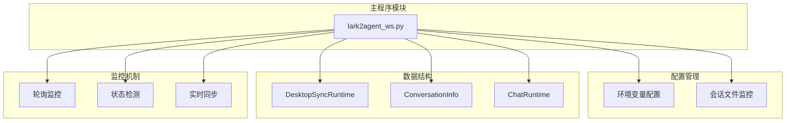
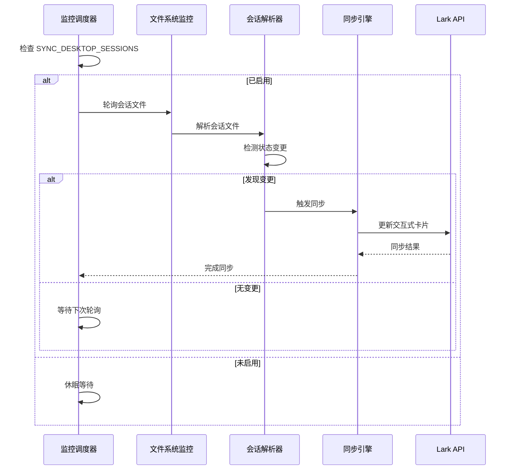
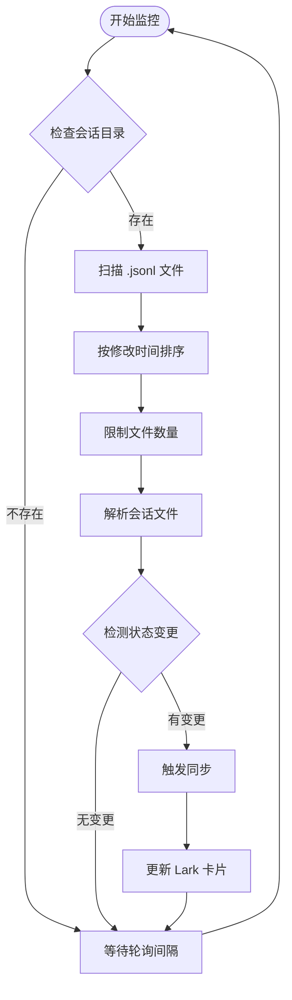
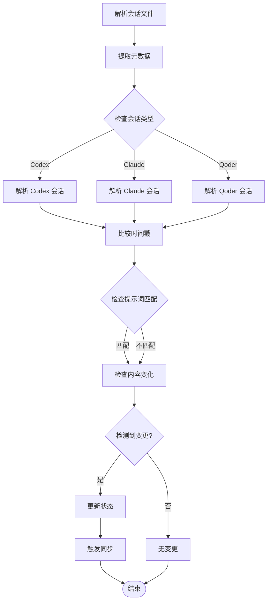
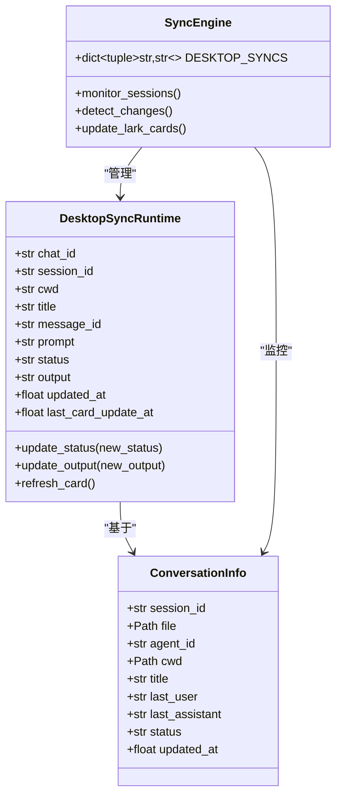
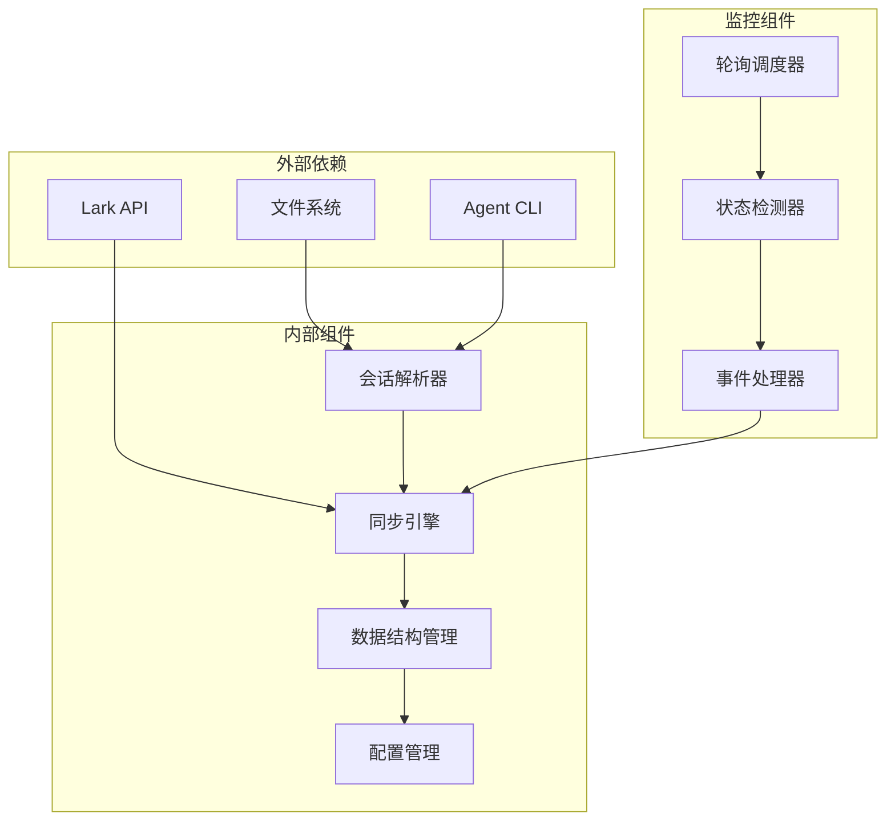

# 桌面会话同步

<cite>
**本文档引用的文件**
- [README.md](file://README.md)
- [lark2agent_ws.py](file://lark2agent_ws.py)
</cite>

## 目录
1. [简介](#简介)
2. [项目结构](#项目结构)
3. [核心组件](#核心组件)
4. [架构概览](#架构概览)
5. [详细组件分析](#详细组件分析)
6. [依赖关系分析](#依赖关系分析)
7. [性能考虑](#性能考虑)
8. [故障排除指南](#故障排除指南)
9. [结论](#结论)

## 简介

桌面会话同步是 Lark2Agent 项目的重要功能，它能够实时监控 Codex Desktop 会话的变化，并将这些变化同步到 Lark 群聊中。该功能通过轮询机制监控会话文件，检测状态变更，并在检测到新消息或任务完成时自动更新 Lark 中的交互式卡片。

该功能的主要特点包括：
- 实时监控 Codex Desktop 会话文件
- 自动识别会话状态变更
- 实时同步到 Lark 群聊
- 支持多种 Agent 类型（Codex、Claude Code、Qoder）
- 可配置的轮询间隔和监控范围

## 项目结构

基于提供的代码库，桌面会话同步功能主要集中在 `lark2agent_ws.py` 文件中，该文件包含了完整的实现逻辑。项目采用模块化的架构设计，将不同的功能模块分离到相应的函数和类中。

**图表来源**
- [lark2agent_ws.py:140-141](file://lark2agent_ws.py#L140-L141)
- [lark2agent_ws.py:298-309](file://lark2agent_ws.py#L298-L309)
- [lark2agent_ws.py:4146-4173](file://lark2agent_ws.py#L4146-L4173)

**章节来源**
- [README.md:1-517](file://README.md#L1-L517)
- [lark2agent_ws.py:1-800](file://lark2agent_ws.py#L1-L800)

## 核心组件

### DesktopSyncRuntime 数据结构

DesktopSyncRuntime 是桌面会话同步的核心数据结构，用于跟踪和管理桌面会话的同步状态：

| 字段名 | 类型 | 描述 | 默认值 |
|--------|------|------|--------|
| chat_id | str | Lark 聊天 ID | 空字符串 |
| session_id | str | 会话 ID | 空字符串 |
| cwd | str | 工作目录路径 | 空字符串 |
| title | str | 会话标题 | 空字符串 |
| message_id | str | Lark 消息 ID | 空字符串 |
| prompt | str | 用户输入的提示词 | 空字符串 |
| status | str | 会话状态 | "监听中" |
| output | str | 最新输出内容 | 空字符串 |
| updated_at | float | 更新时间戳 | 当前时间 |
| last_card_update_at | float | 最后卡片更新时间 | 0 |

### 会话监控配置

系统提供了灵活的配置选项来控制桌面会话监控行为：

| 配置项 | 默认值 | 描述 |
|--------|--------|------|
| SYNC_DESKTOP_SESSIONS | 0 | 是否启用桌面会话监控 |
| SESSION_WATCH_INTERVAL_SECONDS | 3 | 会话监控轮询间隔（秒） |
| CODEX_SESSIONS_DIR | ~/.codex/sessions | Codex 会话文件目录 |
| CLAUDE_PROJECTS_DIR | ~/.claude/projects | Claude 会话文件目录 |
| QODER_PROJECTS_DIR | ~/.qoder/projects | Qoder 会话文件目录 |

**章节来源**
- [lark2agent_ws.py:298-309](file://lark2agent_ws.py#L298-L309)
- [lark2agent_ws.py:140-141](file://lark2agent_ws.py#L140-L141)
- [lark2agent_ws.py:62-73](file://lark2agent_ws.py#L62-L73)

## 架构概览

桌面会话同步功能采用轮询监控与事件驱动相结合的架构模式：

**图表来源**
- [lark2agent_ws.py:140-141](file://lark2agent_ws.py#L140-L141)
- [lark2agent_ws.py:4206-4249](file://lark2agent_ws.py#L4206-L4249)

## 详细组件分析

### 会话文件监控机制

系统通过 `iter_session_files()` 函数监控会话文件目录，该函数实现了递归扫描和排序功能：

**图表来源**
- [lark2agent_ws.py:2290-2295](file://lark2agent_ws.py#L2290-L2295)
- [lark2agent_ws.py:4206-4249](file://lark2agent_ws.py#L4206-L4249)

### 状态变更检测算法

状态检测算法通过比较会话文件的最后修改时间和内容变化来识别状态变更：

**图表来源**
- [lark2agent_ws.py:2332-2474](file://lark2agent_ws.py#L2332-L2474)
- [lark2agent_ws.py:2477-2662](file://lark2agent_ws.py#L2477-L2662)

### 实时同步策略

实时同步策略采用增量更新的方式，只在检测到状态变更时才更新 Lark 卡片：

**图表来源**
- [lark2agent_ws.py:298-309](file://lark2agent_ws.py#L298-L309)
- [lark2agent_ws.py:4146-4173](file://lark2agent_ws.py#L4146-L4173)
- [lark2agent_ws.py:173-196](file://lark2agent_ws.py#L173-L196)

**章节来源**
- [lark2agent_ws.py:2290-2474](file://lark2agent_ws.py#L2290-L2474)
- [lark2agent_ws.py:4146-4249](file://lark2agent_ws.py#L4146-L4249)

## 依赖关系分析

桌面会话同步功能与其他系统组件存在紧密的依赖关系：

**图表来源**
- [lark2agent_ws.py:856-866](file://lark2agent_ws.py#L856-L866)
- [lark2agent_ws.py:2290-2311](file://lark2agent_ws.py#L2290-L2311)

### 关键依赖关系

1. **Lark API 依赖**: 同步功能需要调用 Lark 的消息发送和卡片更新接口
2. **文件系统依赖**: 会话文件监控依赖于文件系统的读取和监控能力
3. **Agent CLI 依赖**: 会话解析依赖于不同 Agent 的会话文件格式
4. **线程同步依赖**: 多线程环境下需要适当的锁机制保证数据一致性

**章节来源**
- [lark2agent_ws.py:387-396](file://lark2agent_ws.py#L387-L396)
- [lark2agent_ws.py:2290-2311](file://lark2agent_ws.py#L2290-L2311)

## 性能考虑

### 轮询间隔优化

系统提供了可配置的轮询间隔，以平衡监控精度和系统资源消耗：

- **默认间隔**: 3 秒（SESSION_WATCH_INTERVAL_SECONDS=3）
- **最小间隔**: 1 秒
- **最大间隔**: 60 秒

### 文件监控优化

1. **文件数量限制**: 通过 MAX_SESSION_FILES 限制同时监控的会话文件数量
2. **时间排序**: 优先监控最近修改的文件
3. **增量解析**: 只解析发生变化的文件

### 内存管理

1. **会话缓存**: 使用 DESKTOP_SYNCS 字典缓存会话状态
2. **定期清理**: 自动清理长时间未更新的会话记录
3. **内存限制**: 通过配置项控制最大会话文件数量

## 故障排除指南

### 常见问题及解决方案

#### 1. 会话监控未生效

**症状**: 设置了 SYNC_DESKTOP_SESSIONS=1 但没有看到任何同步效果

**排查步骤**:
1. 检查环境变量是否正确设置
2. 验证会话文件目录是否存在
3. 确认 Codex Desktop 正在运行并生成会话文件

**解决方案**:
- 确保 `SYNC_DESKTOP_SESSIONS=1` 已正确写入 .env 文件
- 验证 `CODEX_SESSIONS_DIR` 指向正确的会话文件目录
- 检查文件权限，确保程序有读取权限

#### 2. 同步延迟过高

**症状**: 桌面端的会话变化在 Lark 中显示延迟

**排查步骤**:
1. 检查 SESSION_WATCH_INTERVAL_SECONDS 配置
2. 监控系统负载情况
3. 检查磁盘 I/O 性能

**解决方案**:
- 适当降低轮询间隔（但不低于 1 秒）
- 优化文件系统性能
- 考虑升级硬件配置

#### 3. 会话状态显示异常

**症状**: Lark 中显示的会话状态与桌面端不一致

**排查步骤**:
1. 检查会话文件格式是否正确
2. 验证会话解析逻辑
3. 确认状态转换规则

**解决方案**:
- 确保会话文件格式符合预期
- 检查解析器的错误处理逻辑
- 验证状态转换的边界条件

#### 4. 内存泄漏问题

**症状**: 程序运行时间越长，内存占用越高

**排查步骤**:
1. 检查 DESKTOP_SYNCS 字典的增长情况
2. 监控会话对象的生命周期
3. 验证垃圾回收机制

**解决方案**:
- 实现会话对象的定期清理机制
- 优化会话状态的存储结构
- 添加内存使用监控

**章节来源**
- [lark2agent_ws.py:140-141](file://lark2agent_ws.py#L140-L141)
- [lark2agent_ws.py:106](file://lark2agent_ws.py#L106)
- [lark2agent_ws.py:4146-4173](file://lark2agent_ws.py#L4146-L4173)

## 结论

桌面会话同步功能通过精心设计的轮询监控机制、智能的状态检测算法和高效的实时同步策略，成功实现了 Codex Desktop 会话与 Lark 群聊之间的无缝集成。该功能具有以下优势：

1. **实时性强**: 通过可配置的轮询间隔实现实时监控
2. **准确性高**: 基于文件内容和时间戳的双重验证机制
3. **扩展性好**: 支持多种 Agent 类型和灵活的配置选项
4. **稳定性强**: 完善的错误处理和故障恢复机制

未来可以考虑的改进方向包括：
- 实现基于文件系统事件的实时通知机制
- 优化大规模会话场景下的性能表现
- 增强会话状态预测和缓存机制
- 提供更丰富的监控指标和告警功能

通过持续的优化和完善，桌面会话同步功能将成为 Lark2Agent 项目中不可或缺的重要组成部分，为用户提供更加流畅和高效的多平台协作体验。