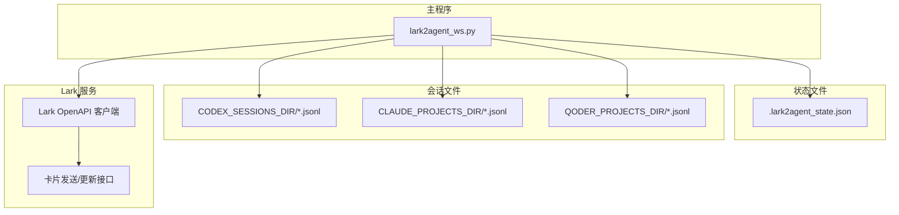
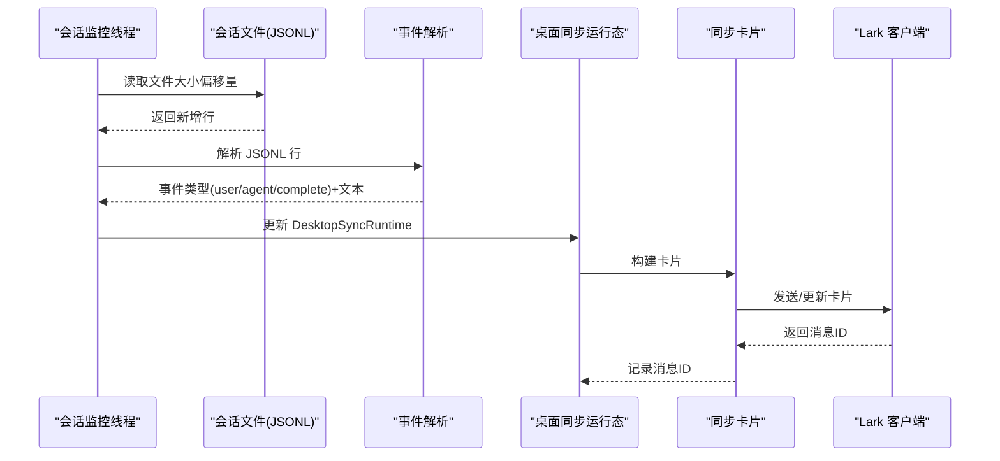
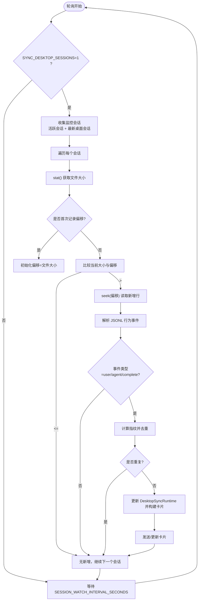
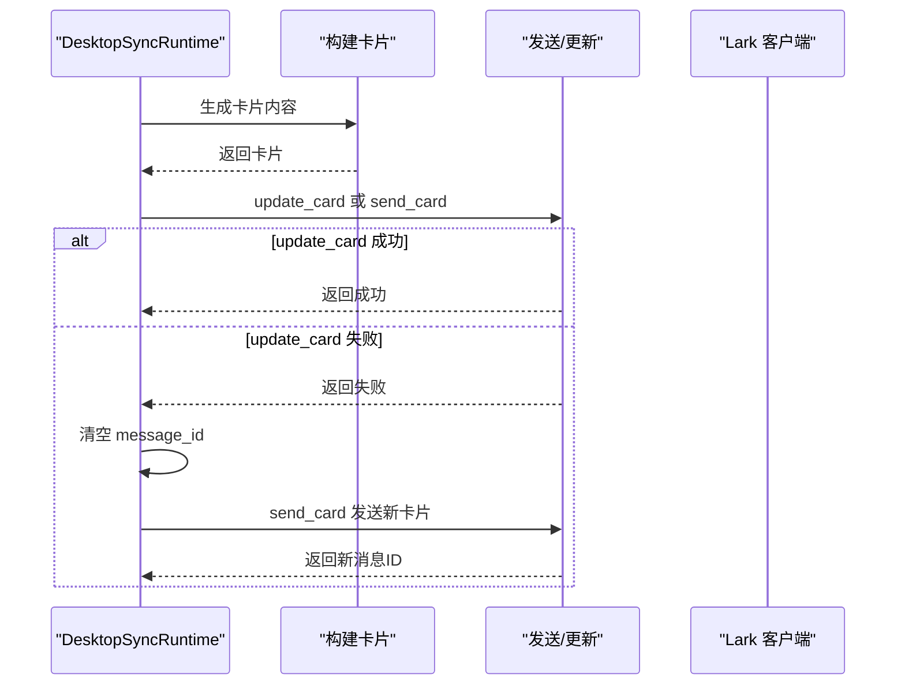
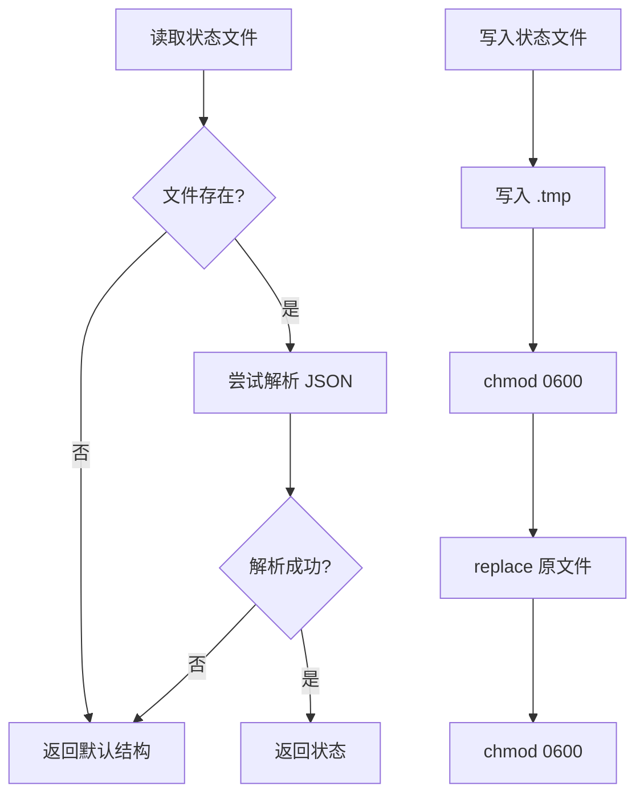
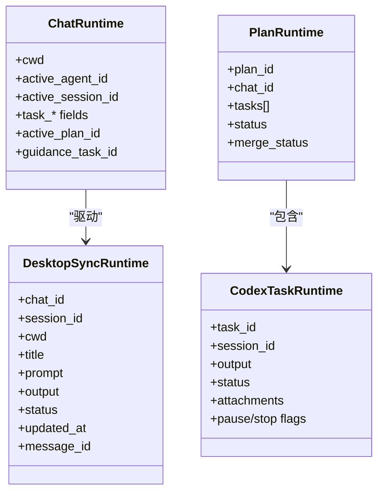

# 状态同步

<cite>
**本文引用的文件**   
- [README.md](file://README.md)
- [lark2agent_ws.py](file://lark2agent_ws.py)
</cite>

## 目录
1. [简介](#简介)
2. [项目结构](#项目结构)
3. [核心组件](#核心组件)
4. [架构总览](#架构总览)
5. [详细组件分析](#详细组件分析)
6. [依赖关系分析](#依赖关系分析)
7. [性能考量](#性能考量)
8. [故障排查指南](#故障排查指南)
9. [结论](#结论)
10. [附录](#附录)

## 简介
本文件围绕 Lark2Agent 的“状态同步”能力，系统阐述 Codex Desktop 会话同步的实现原理与运行机制，包括：
- 会话监控机制：如何发现并跟踪 Codex Desktop 会话文件变化
- 状态变更检测：如何从会话 JSONL 流中识别用户输入、Agent 输出与任务完成事件
- 实时同步策略：如何将变更回写到 Lark 卡片并进行去重与节流
- 状态持久化机制：.lark2agent_state.json 的文件格式、序列化方案与兼容性处理
- 运行时状态管理：RUNTIMES、TASKS、DESKTOP_SYNCS 等全局状态的数据结构、更新策略与并发控制
- 同步配置项：SYNC_DESKTOP_SESSIONS、SESSION_WATCH_INTERVAL_SECONDS、状态文件路径等
- 故障恢复与调试技巧：常见问题定位与排障方法

## 项目结构
Lark2Agent 的状态同步能力集中在主程序文件中，涉及会话索引、状态持久化、卡片构建与更新、并发锁与轮询线程等模块。



图示来源
- [lark2agent_ws.py](file://lark2agent_ws.py)
- [README.md](file://README.md)

章节来源
- [README.md:1-517](file://README.md#L1-L517)
- [lark2agent_ws.py:1-200](file://lark2agent_ws.py#L1-L200)

## 核心组件
- 会话监控与解析
  - 会话文件轮询：基于文件大小偏移量增量读取，解析 JSONL 行为事件
  - 事件类型识别：用户消息、Agent 输出、任务完成
- 同步卡片管理
  - 桌面同步运行态：DesktopSyncRuntime 记录会话、目录、标题、指令、结果、状态与更新时间
  - 卡片构建与更新：按状态模板渲染，支持刷新、状态查询、打开会话等按钮
- 状态持久化
  - .lark2agent_state.json：存储已知聊天、运行态、计划任务、消息引用等
  - 读写原子化：临时文件写入后替换，确保一致性
- 运行时状态
  - RUNTIMES：按 chat_id 维护会话与任务运行态
  - TASKS：按 task_id 维护任务运行态
  - DESKTOP_SYNCS：按 (chat_id, session_id) 维护桌面同步卡片状态
  - 并发控制：R锁、发送锁、计划锁、会话运行锁

章节来源
- [lark2agent_ws.py:286-310](file://lark2agent_ws.py#L286-L310)
- [lark2agent_ws.py:869-891](file://lark2agent_ws.py#L869-L891)
- [lark2agent_ws.py:983-1014](file://lark2agent_ws.py#L983-L1014)
- [lark2agent_ws.py:1152-1172](file://lark2agent_ws.py#L1152-L1172)
- [lark2agent_ws.py:3663-3732](file://lark2agent_ws.py#L3663-L3732)

## 架构总览
Lark2Agent 通过后台轮询线程监控 Codex/Claude/Qoder 的会话文件，解析事件并更新桌面同步卡片。状态持久化贯穿于运行态保存、计划任务恢复与消息引用记录。



图示来源
- [lark2agent_ws.py:7161-7234](file://lark2agent_ws.py#L7161-L7234)
- [lark2agent_ws.py:7140-7158](file://lark2agent_ws.py#L7140-L7158)
- [lark2agent_ws.py:4206-4249](file://lark2agent_ws.py#L4206-L4249)
- [lark2agent_ws.py:3663-3732](file://lark2agent_ws.py#L3663-L3732)

## 详细组件分析

### 会话监控与状态变更检测
- 监控范围
  - 仅当 SYNC_DESKTOP_SESSIONS=1 时启用
  - 监控对象：RUNTIMES 中当前活跃会话，以及同工作目录下最新的 Codex Desktop 会话
- 监控策略
  - 会话文件大小偏移量记录：SESSION_WATCH_OFFSETS
  - 增量读取：每次读取从上次偏移位置到当前文件末尾的所有行
- 事件识别
  - 事件类型：user、agent、complete
  - 文本提取：从事件负载中抽取消息内容
- 去重与节流
  - 去重指纹：基于 chat_id、session_id、事件类型与文本的哈希集合 SESSION_SYNC_SEEN
  - 刷新节流：同卡片最小更新间隔 2 秒



图示来源
- [lark2agent_ws.py:7161-7234](file://lark2agent_ws.py#L7161-L7234)
- [lark2agent_ws.py:7140-7158](file://lark2agent_ws.py#L7140-L7158)
- [lark2agent_ws.py:4206-4249](file://lark2agent_ws.py#L4206-L4249)

章节来源
- [lark2agent_ws.py:7161-7234](file://lark2agent_ws.py#L7161-L7234)
- [lark2agent_ws.py:7140-7158](file://lark2agent_ws.py#L7140-L7158)
- [lark2agent_ws.py:4206-4249](file://lark2agent_ws.py#L4206-L4249)

### 实时同步策略
- 卡片模板选择：根据状态选择绿色/蓝色模板
- 内容字段：状态、来源、目录、更新时间、标题、Session、指令、最新结果
- 按钮操作：刷新、状态、打开会话
- 更新策略
  - 若上次更新距现在不足 2 秒，则跳过更新
  - 若卡片更新失败，回退为发送新卡片并清空旧消息ID
  - 成功后记录新消息ID以便后续更新



图示来源
- [lark2agent_ws.py:4176-4203](file://lark2agent_ws.py#L4176-L4203)
- [lark2agent_ws.py:4206-4249](file://lark2agent_ws.py#L4206-L4249)
- [lark2agent_ws.py:3663-3732](file://lark2agent_ws.py#L3663-L3732)

章节来源
- [lark2agent_ws.py:4176-4203](file://lark2agent_ws.py#L4176-L4203)
- [lark2agent_ws.py:4206-4249](file://lark2agent_ws.py#L4206-L4249)
- [lark2agent_ws.py:3663-3732](file://lark2agent_ws.py#L3663-L3732)

### 状态持久化机制
- 状态文件
  - 文件名：LARK2AGENT_STATE_FILE（默认 .lark2agent_state.json）
  - 读取：若文件不存在或读取失败，返回默认结构
  - 写入：先写入 .tmp，chmod 0600，再 replace 原文件，最后 chmod 0600
- 持久化内容
  - chats：按 chat_id 存储运行态（cwd、active_agent_id、active_session_id、task_*、plan_* 等）
  - plans：按 plan_id 存储计划任务运行态（含子任务）
  - message_refs：消息引用缓存（用于回复/引用找回附件与上下文）
- 版本兼容性
  - 读取失败时返回默认结构，保证脚本可继续运行
  - 计划任务恢复时对未结束任务进行标记并提示重试



图示来源
- [lark2agent_ws.py:869-891](file://lark2agent_ws.py#L869-L891)
- [lark2agent_ws.py:983-1014](file://lark2agent_ws.py#L983-L1014)
- [lark2agent_ws.py:1152-1172](file://lark2agent_ws.py#L1152-L1172)

章节来源
- [lark2agent_ws.py:869-891](file://lark2agent_ws.py#L869-L891)
- [lark2agent_ws.py:983-1014](file://lark2agent_ws.py#L983-L1014)
- [lark2agent_ws.py:1152-1172](file://lark2agent_ws.py#L1152-L1172)

### 运行时状态管理
- 全局状态
  - RUNTIMES：按 chat_id 维护 ChatRuntime（当前工作目录、活跃 Agent、活跃会话、任务状态、计划ID等）
  - TASKS：按 task_id 维护 CodexTaskRuntime（任务ID、会话ID、输出、状态、附件、暂停/停止标志等）
  - DESKTOP_SYNCS：按 (chat_id, session_id) 维护 DesktopSyncRuntime（卡片消息ID、状态、更新时间、指令/结果）
  - PENDING_APPROVALS、PENDING_RESTARTS、PLANS：审批、重启、计划任务运行态
- 并发控制
  - 全局锁：LOCK（R锁），保护 RUNTIMES、TASKS、DESKTOP_SYNCS 等
  - 发送锁：SEND_LOCK，串行化卡片发送/更新
  - 计划锁：PLAN_LOCK，保护 PLANS 的并发访问
  - 会话运行锁：按 conversation_key 维护会话粒度锁，避免并发写入会话文件
- 会话识别
  - is_desktop_conversation：判断会话来源是否为 Codex Desktop
  - latest_desktop_conversation_for_cwd：按工作目录查找最新桌面会话



图示来源
- [lark2agent_ws.py:173-235](file://lark2agent_ws.py#L173-L235)
- [lark2agent_ws.py:237-273](file://lark2agent_ws.py#L237-L273)
- [lark2agent_ws.py:298-309](file://lark2agent_ws.py#L298-L309)
- [lark2agent_ws.py:371-385](file://lark2agent_ws.py#L371-L385)

章节来源
- [lark2agent_ws.py:173-235](file://lark2agent_ws.py#L173-L235)
- [lark2agent_ws.py:237-273](file://lark2agent_ws.py#L237-L273)
- [lark2agent_ws.py:298-309](file://lark2agent_ws.py#L298-L309)
- [lark2agent_ws.py:371-385](file://lark2agent_ws.py#L371-L385)

### 配置项与开关
- 同步开关
  - SYNC_DESKTOP_SESSIONS：是否启用 Codex Desktop 会话监听（默认 0）
- 轮询间隔
  - SESSION_WATCH_INTERVAL_SECONDS：会话监控轮询间隔（默认 3 秒）
- 状态文件路径
  - LARK2AGENT_STATE_FILE：状态文件路径（默认 .lark2agent_state.json）
- 其他相关配置
  - CODEX_SESSIONS_DIR：Codex 会话目录
  - CLAUDE_PROJECTS_DIR：Claude 会话目录
  - QODER_PROJECTS_DIR：Qoder 会话目录
  - LARK_CARD_ENABLE_FORWARD：卡片转发开关
  - LOG_MESSAGE_CONTENT：日志中是否记录消息内容

章节来源
- [README.md:413-428](file://README.md#L413-L428)
- [lark2agent_ws.py:126-141](file://lark2agent_ws.py#L126-L141)

## 依赖关系分析
- 会话文件来源
  - Codex：CODEX_SESSIONS_DIR/*.jsonl
  - Claude：CLAUDE_PROJECTS_DIR/*.jsonl
  - Qoder：QODER_PROJECTS_DIR/*.jsonl
- 事件解析
  - parse_session_sync_event：从 JSONL 行中提取事件类型与文本
- 卡片构建
  - build_desktop_sync_card：根据运行态生成卡片
  - send_card/update_card：通过 Lark 客户端发送或更新卡片
- 并发与锁
  - 会话监控线程与主事件循环共享全局锁
  - 发送锁保护 Lark API 调用
  - 会话运行锁避免并发写入

```mermaid
graph LR
Sessions["会话文件(JSONL)"] --> Parser["事件解析"]
Parser --> Sync["DesktopSyncRuntime"]
Sync --> Card["同步卡片"]
Card --> Lark["Lark 客户端"]
Lark --> Card
State["状态文件(.json)"] <- --> WS["lark2agent_ws.py"]
WS --> Sessions
WS --> State
```

图示来源
- [lark2agent_ws.py:7140-7158](file://lark2agent_ws.py#L7140-L7158)
- [lark2agent_ws.py:4176-4203](file://lark2agent_ws.py#L4176-L4203)
- [lark2agent_ws.py:3663-3732](file://lark2agent_ws.py#L3663-L3732)

章节来源
- [lark2agent_ws.py:7140-7158](file://lark2agent_ws.py#L7140-L7158)
- [lark2agent_ws.py:4176-4203](file://lark2agent_ws.py#L4176-L4203)
- [lark2agent_ws.py:3663-3732](file://lark2agent_ws.py#L3663-L3732)

## 性能考量
- I/O 优化
  - 增量读取：仅读取新增行，避免全量扫描
  - 偏移量记录：SESSION_WATCH_OFFSETS 减少 stat 次数
- 去重与节流
  - SESSION_SYNC_SEEN 防止重复事件导致的卡片抖动
  - 最小更新间隔 2 秒，降低 Lark API 调用频率
- 并发控制
  - R锁与专用锁减少锁竞争
  - 发送锁串行化 API 调用，避免并发写入
- 文件权限
  - 写入状态文件前后 chmod 0600，提升安全性

## 故障排查指南
- 同步未生效
  - 检查 SYNC_DESKTOP_SESSIONS 是否开启
  - 确认会话文件路径与权限正确
  - 查看会话监控线程日志，确认轮询是否正常
- 卡片更新失败
  - 检查 Lark API 返回码与消息
  - 若出现 invalid receive_id，脚本会自动禁用该聊天发送
  - 卡片更新失败会回退为发送新卡片
- 状态文件异常
  - 读取失败时返回默认结构，不影响运行
  - 写入采用临时文件 + replace，确保原子性
- 会话识别问题
  - is_desktop_conversation 依赖 originator/source 字段
  - latest_desktop_conversation_for_cwd 依赖 cwd 匹配
- 调试技巧
  - 开启日志：LOG_LEVEL/INFO/DEBUG
  - 开启消息内容记录：LOG_MESSAGE_CONTENT=1（谨慎使用）
  - 使用 /status 查看当前运行态与会话信息

章节来源
- [lark2agent_ws.py:3663-3732](file://lark2agent_ws.py#L3663-L3732)
- [lark2agent_ws.py:869-891](file://lark2agent_ws.py#L869-L891)
- [lark2agent_ws.py:7161-7234](file://lark2agent_ws.py#L7161-L7234)
- [README.md:474-511](file://README.md#L474-L511)

## 结论
Lark2Agent 的状态同步通过“文件增量读取 + 事件解析 + 去重节流 + 卡片回写”的闭环，实现了 Codex Desktop 会话的实时可视化与协作反馈。配合可靠的状态持久化与严格的并发控制，系统在稳定性与可维护性方面具备良好表现。建议在生产环境中合理设置轮询间隔与日志级别，并关注会话文件权限与 Lark API 的可用性。

## 附录
- 相关环境变量与默认值
  - LARK2AGENT_STATE_FILE：.lark2agent_state.json
  - SYNC_DESKTOP_SESSIONS：0
  - SESSION_WATCH_INTERVAL_SECONDS：3
  - CODEX_SESSIONS_DIR：~/.codex/sessions
  - CLAUDE_PROJECTS_DIR：~/.claude/projects
  - QODER_PROJECTS_DIR：~/.qoder/projects
  - LARK_CARD_ENABLE_FORWARD：0
  - LOG_MESSAGE_CONTENT：0
  - LOG_LEVEL：INFO

章节来源
- [README.md:413-428](file://README.md#L413-L428)
- [lark2agent_ws.py:62-74](file://lark2agent_ws.py#L62-L74)
- [lark2agent_ws.py:126-141](file://lark2agent_ws.py#L126-L141)