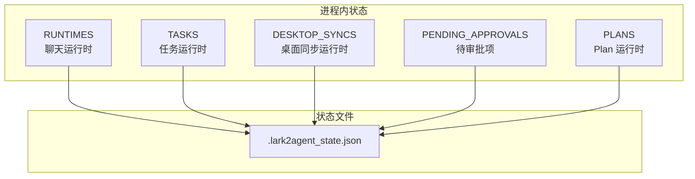
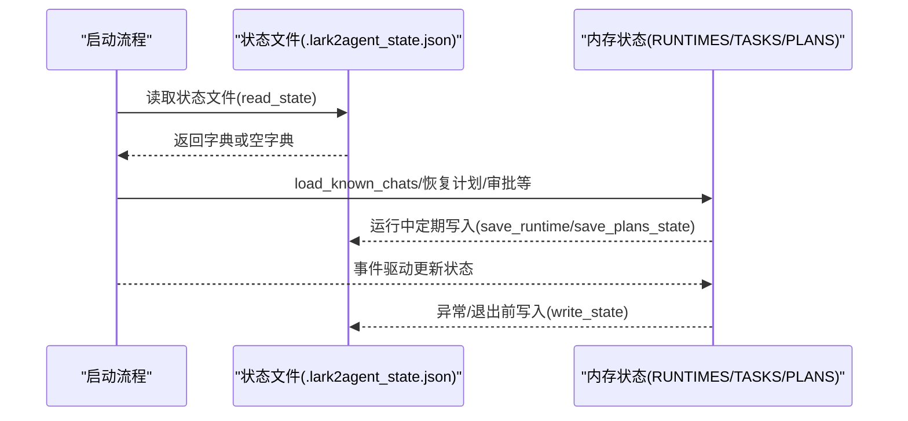
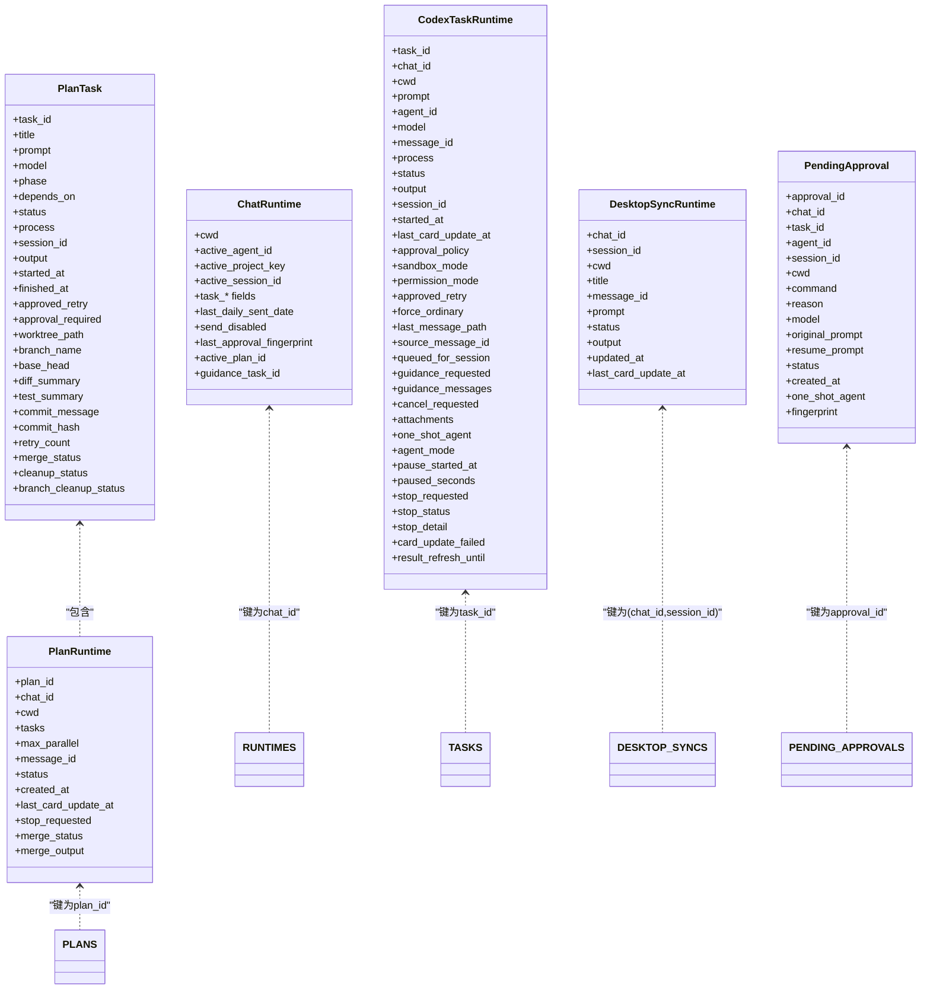
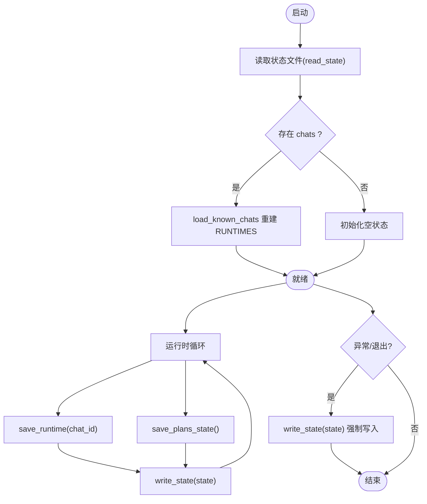
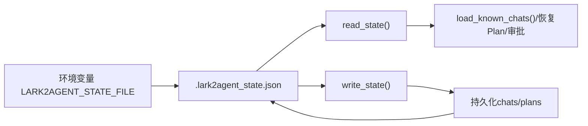

# 状态持久化

<cite>
**本文引用的文件**
- [README.md](file://README.md)
- [lark2agent_ws.py](file://lark2agent_ws.py)
</cite>

## 目录
1. [简介](#简介)
2. [项目结构](#项目结构)
3. [核心组件](#核心组件)
4. [架构总览](#架构总览)
5. [详细组件分析](#详细组件分析)
6. [依赖关系分析](#依赖关系分析)
7. [性能考量](#性能考量)
8. [故障排查指南](#故障排查指南)
9. [结论](#结论)
10. [附录](#附录)

## 简介
本文件围绕 .lark2agent_state.json 状态持久化机制进行系统化说明，涵盖状态文件的格式与结构、数据序列化方案、版本兼容性处理、文件读写策略，以及状态数据的组织方式（RUNTIMES、TASKS、DESKTOP_SYNCS、PENDING_APPROVALS、PLANS 等）。文档还解释了状态文件的加载与保存机制（启动时恢复、运行时更新、异常保护）、备份与迁移方法、损坏时的故障恢复策略与调试技巧。

## 项目结构
- 状态文件位置与命名
  - 状态文件默认名为 .lark2agent_state.json，可通过环境变量 LARK2AGENT_STATE_FILE 指定。
  - 文件位于当前工作目录，用于保存已知聊天、运行面板状态、审批记录与 Plan/子任务状态等。
- 关键模块与职责
  - 主程序入口负责初始化配置、建立 Lark 连接、维护全局运行时对象与事件循环。
  - 状态持久化模块负责读取/写入 .lark2agent_state.json，保证跨进程重启后状态可恢复。

**图表来源**
- [lark2agent_ws.py:126](file://lark2agent_ws.py#L126)
- [lark2agent_ws.py:387-396](file://lark2agent_ws.py#L387-L396)

**章节来源**
- [README.md:418-419](file://README.md#L418-L419)
- [lark2agent_ws.py:126](file://lark2agent_ws.py#L126)

## 核心组件
- 全局运行时容器
  - RUNTIMES：按 chat_id 维度存储聊天运行时信息，如当前工作目录、活动 Agent、任务上下文、计划 ID、引导任务 ID 等。
  - TASKS：按任务 ID 存储任务运行时信息，如状态、输出、会话 ID、模型、附件、暂停/停止状态等。
  - DESKTOP_SYNCS：按 (chat_id, session_id) 维度存储 Codex Desktop 会话同步状态。
  - PENDING_APPROVALS：按审批 ID 存储待审批项，包含指纹、来源任务、会话、工作目录、原因等。
  - PLANS：按 plan_id 存储 Plan 运行时，包含任务列表、并发度、合并状态等。
- 状态文件读写接口
  - read_state：读取 .lark2agent_state.json，返回字典结构；若文件不存在或损坏，返回空字典以便后续初始化。
  - write_state：将内存中的状态整体写回 .lark2agent_state.json，采用原子写策略（先写临时文件，再重命名为正式文件），降低损坏风险。
  - save_runtime：将 RUNTIMES 中某个 chat_id 的运行时快照写入 state.chats。
  - save_plans_state：将 PLANS 中所有 Plan 的状态写入 state.plans。
- 状态恢复
  - load_known_chats：从 state.chats 加载历史聊天运行时，重建 RUNTIMES。
  - plan_from_state / plan_to_state：Plan 运行时与状态字典之间的双向转换。

**章节来源**
- [lark2agent_ws.py:387-396](file://lark2agent_ws.py#L387-L396)
- [lark2agent_ws.py:988-1014](file://lark2agent_ws.py#L988-L1014)
- [lark2agent_ws.py:1017-1041](file://lark2agent_ws.py#L1017-L1041)
- [lark2agent_ws.py:1152-1157](file://lark2agent_ws.py#L1152-L1157)

## 架构总览
状态持久化贯穿启动、运行、异常与退出全流程，形成“内存状态 ↔ 状态文件”的双轨机制，确保系统重启后可恢复关键业务状态。

**图表来源**
- [lark2agent_ws.py:988-1014](file://lark2agent_ws.py#L988-L1014)
- [lark2agent_ws.py:1017-1041](file://lark2agent_ws.py#L1017-L1041)
- [lark2agent_ws.py:1152-1157](file://lark2agent_ws.py#L1152-L1157)

## 详细组件分析

### 状态文件格式与结构
- 文件位置与命名
  - 默认文件名：.lark2agent_state.json
  - 可通过环境变量 LARK2AGENT_STATE_FILE 指定
- 数据结构概览
  - chats：按 chat_id 存储聊天运行时快照，字段包括 cwd、active_agent_id、active_project_key、active_session_id、task_*、last_daily_sent_date、send_disabled、last_approval_fingerprint、active_plan_id、guidance_task_id 等。
  - plans：按 plan_id 存储 Plan 运行时快照，字段包括 plan_id、chat_id、cwd、tasks、max_parallel、message_id、status、created_at、stop_requested、merge_status、merge_output 等。
  - 其他全局状态（如 PENDING_APPROVALS、DESKTOP_SYNCS、TASKS）在当前代码中未直接持久化到 .lark2agent_state.json，但会在运行时维护，重启后可通过 chats/plans 等恢复关键上下文。
- 版本兼容性
  - 代码未显式声明版本号；读取失败或字段缺失时，采用默认值回退，保证向前兼容。
- 序列化方案
  - 使用标准 JSON 字典结构，键为字符串，值为基本类型或嵌套字典/列表。
- 文件读写策略
  - 读取：read_state 返回字典；若文件不存在或解析失败，返回空字典。
  - 写入：write_state 将完整状态写入临时文件，再原子重命名为正式文件，降低损坏概率。
  - 更新：save_runtime/save_plans_state 仅更新对应分区（chats/plans），其余字段保留。

**章节来源**
- [README.md:418-419](file://README.md#L418-L419)
- [lark2agent_ws.py:126](file://lark2agent_ws.py#L126)
- [lark2agent_ws.py:988-1014](file://lark2agent_ws.py#L988-L1014)
- [lark2agent_ws.py:1017-1041](file://lark2agent_ws.py#L1017-L1041)
- [lark2agent_ws.py:1152-1157](file://lark2agent_ws.py#L1152-L1157)

### 状态数据组织方式
- RUNTIMES
  - 结构：字典，键为 chat_id，值为 ChatRuntime 数据类实例。
  - 字段要点：cwd、active_agent_id、active_project_key、active_session_id、task_*（任务上下文）、last_daily_sent_date、send_disabled、last_approval_fingerprint、active_plan_id、guidance_task_id。
  - 写入时机：save_runtime(chat_id) 将当前 RUNTIMES[chat_id] 写入 state.chats[chat_id]。
- TASKS
  - 结构：字典，键为任务 ID，值为 CodexTaskRuntime 数据类实例。
  - 字段要点：task_id、chat_id、cwd、prompt、agent_id、model、message_id、process、status、output、session_id、started_at、last_card_update_at、approval_policy、sandbox_mode、permission_mode、approved_retry、force_ordinary、last_message_path、source_message_id、queued_for_session、guidance_requested、guidance_messages、cancel_requested、attachments、one_shot_agent、agent_mode、pause_started_at、paused_seconds、stop_requested、stop_status、stop_detail、card_update_failed、result_refresh_until。
  - 写入时机：当前代码未直接持久化 TASKS 到 .lark2agent_state.json，但可通过其他机制（如任务卡片状态）间接影响持久化。
- DESKTOP_SYNCS
  - 结构：字典，键为 (chat_id, session_id)，值为 DesktopSyncRuntime 数据类实例。
  - 字段要点：chat_id、session_id、cwd、title、message_id、prompt、status、output、updated_at、last_card_update_at。
  - 写入时机：当前代码未直接持久化 DESKTOP_SYNCS 到 .lark2agent_state.json。
- PENDING_APPROVALS
  - 结构：字典，键为 approval_id，值为 PendingApproval 数据类实例。
  - 字段要点：approval_id、chat_id、task_id、agent_id、session_id、cwd、command、reason、model、original_prompt、resume_prompt、status、created_at、one_shot_agent、fingerprint。
  - 写入时机：当前代码未直接持久化 PENDING_APPROVALS 到 .lark2agent_state.json。
- PLANS
  - 结构：字典，键为 plan_id，值为 PlanRuntime 数据类实例。
  - 字段要点：plan_id、chat_id、cwd、tasks（PlanTask 列表）、max_parallel、message_id、status、created_at、last_card_update_at、stop_requested、merge_status、merge_output。
  - 写入时机：save_plans_state 将 PLANS 写入 state.plans。

**图表来源**
- [lark2agent_ws.py:209-235](file://lark2agent_ws.py#L209-L235)
- [lark2agent_ws.py:238-273](file://lark2agent_ws.py#L238-L273)
- [lark2agent_ws.py:298-309](file://lark2agent_ws.py#L298-L309)
- [lark2agent_ws.py:312-328](file://lark2agent_ws.py#L312-L328)
- [lark2agent_ws.py:343-385](file://lark2agent_ws.py#L343-L385)

**章节来源**
- [lark2agent_ws.py:387-396](file://lark2agent_ws.py#L387-L396)
- [lark2agent_ws.py:988-1014](file://lark2agent_ws.py#L988-L1014)
- [lark2agent_ws.py:1017-1041](file://lark2agent_ws.py#L1017-L1041)
- [lark2agent_ws.py:1126-1149](file://lark2agent_ws.py#L1126-L1149)
- [lark2agent_ws.py:1152-1157](file://lark2agent_ws.py#L1152-L1157)

### 状态文件的加载与保存机制
- 启动时的状态恢复
  - load_known_chats：从 state.chats 重建 RUNTIMES，设置 last_status_sent_at 为当前时间，确保面板及时刷新。
- 运行时的状态更新
  - save_runtime：针对特定 chat_id 的运行时快照写入 state.chats[chat_id]。
  - save_plans_state：将 PLANS 写入 state.plans。
- 异常情况下的状态保护
  - write_state：采用原子写策略，先写临时文件，再重命名为正式文件，避免部分写入导致损坏。
  - read_state：解析失败或文件不存在时返回空字典，避免崩溃并允许重新初始化。

**图表来源**
- [lark2agent_ws.py:988-1014](file://lark2agent_ws.py#L988-L1014)
- [lark2agent_ws.py:1017-1041](file://lark2agent_ws.py#L1017-L1041)
- [lark2agent_ws.py:1152-1157](file://lark2agent_ws.py#L1152-L1157)

**章节来源**
- [lark2agent_ws.py:988-1014](file://lark2agent_ws.py#L988-L1014)
- [lark2agent_ws.py:1017-1041](file://lark2agent_ws.py#L1017-L1041)
- [lark2agent_ws.py:1152-1157](file://lark2agent_ws.py#L1152-L1157)

### 备份与迁移方法
- 手动备份步骤
  - 在停止服务或确认无写入时，复制 .lark2agent_state.json 到安全位置。
  - 建议同时备份当前工作目录下的 .lark2agent/attachments 等相关数据，便于完整恢复。
- 版本升级注意事项
  - 若未来引入新字段，建议在 read_state 时提供默认值，避免因字段缺失导致恢复失败。
  - 若字段结构发生重大变化，应在升级脚本中提供迁移逻辑，将旧格式转换为新格式后再写入。
- 数据恢复流程
  - 停止服务，将备份文件替换为 .lark2agent_state.json，启动服务后 load_known_chats 会自动恢复 RUNTIMES/PLANS 等状态。
  - 如需恢复审批或桌面同步状态，需确认备份文件包含相应字段；否则可通过面板或命令重新发起。

**章节来源**
- [README.md:516](file://README.md#L516)

### 损坏时的故障恢复策略与调试技巧
- 常见症状
  - 启动后面板状态异常、Plan 任务丢失、审批记录不可见。
- 恢复策略
  - 备份优先：若存在 .lark2agent_state.json.bak 或其他备份，优先使用备份恢复。
  - 降级恢复：若解析失败，read_state 返回空字典，系统将从零初始化；随后通过面板与命令逐步重建状态。
  - 局部修复：删除 state.chats 或 state.plans 中对应键，重启后系统将重建该分区。
- 调试技巧
  - 启用详细日志，观察 read_state/write_state 的调用与异常。
  - 使用最小化配置启动，排除第三方因素干扰。
  - 检查文件权限与磁盘空间，确保 .lark2agent_state.json 可正常读写。

**章节来源**
- [lark2agent_ws.py:868-878](file://lark2agent_ws.py#L868-L878)

## 依赖关系分析
- 组件耦合
  - RUNTIMES/TASKS/PLANS 等内存状态与 .lark2agent_state.json 之间通过 save_runtime/save_plans_state/read_state/write_state 解耦。
  - DESKTOP_SYNCS/PENDING_APPROVALS 当前未直接持久化，但可通过面板与命令间接影响持久化分区。
- 外部依赖
  - 环境变量 LARK2AGENT_STATE_FILE 控制状态文件路径。
  - 日志系统用于记录状态读写与异常信息。

**图表来源**
- [lark2agent_ws.py:126](file://lark2agent_ws.py#L126)
- [lark2agent_ws.py:868-878](file://lark2agent_ws.py#L868-L878)

**章节来源**
- [lark2agent_ws.py:126](file://lark2agent_ws.py#L126)
- [lark2agent_ws.py:868-878](file://lark2agent_ws.py#L868-L878)

## 性能考量
- 写入频率
  - save_runtime/save_plans_state 在状态变更时触发，建议避免过于频繁的更新，可在批处理或周期性任务中合并写入。
- 文件大小
  - 随时间增长，建议定期清理旧的计划与任务记录，或压缩历史数据。
- 原子写入
  - write_state 的原子写策略可减少损坏风险，但会增加磁盘 IO；可根据场景权衡写入频率与可靠性。

## 故障排查指南
- 症状：启动后状态丢失
  - 检查 .lark2agent_state.json 是否存在且可读。
  - 查看日志中 read_state 的错误信息。
- 症状：写入失败或文件损坏
  - 检查磁盘空间与权限。
  - 使用备份文件替换，或删除损坏文件让系统从零初始化。
- 症状：Plan/任务状态异常
  - 通过面板或命令重新发起任务，必要时清理 state.plans 对应键后重启。

**章节来源**
- [lark2agent_ws.py:868-878](file://lark2agent_ws.py#L868-L878)

## 结论
.lark2agent_state.json 是 Lark2Agent 的核心状态载体，通过 chats/plans 分区保存关键运行上下文，配合原子写策略与降级回退机制，实现了可靠的跨进程重启恢复能力。尽管部分运行时状态（如 TASKS、DESKTOP_SYNCS、PENDING_APPROVALS）未直接持久化，但通过面板与命令仍可重建关键业务状态。建议在升级与运维中重视备份与迁移策略，确保生产环境的稳定性与可恢复性。

## 附录
- 环境变量参考
  - LARK2AGENT_STATE_FILE：状态文件路径
  - LARK2AGENT_SHOW_ARCHIVED：是否显示归档内容
  - LARK2AGENT_INCLUDE_PLAN_WORKTREES：是否将 Plan worktree 作为项目统计
  - LARK2AGENT_WELCOME_MESSAGE：启动欢迎语
  - SYNC_DESKTOP_SESSIONS：是否监听 Codex Desktop 会话
  - SESSION_WATCH_INTERVAL_SECONDS：会话监听间隔
- 文件说明
  - .lark2agent_state.json：运行时状态文件，本地生成，不提交。

**章节来源**
- [README.md:418-427](file://README.md#L418-L427)
- [README.md:516](file://README.md#L516)