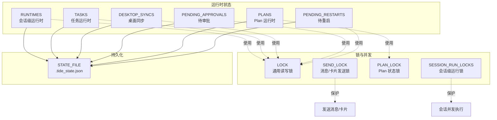
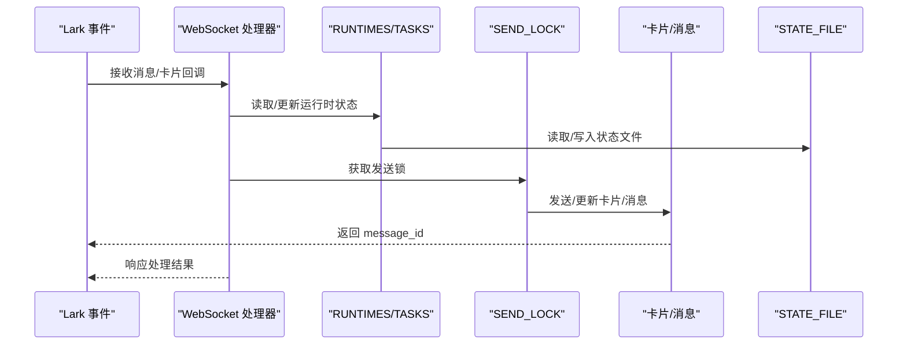
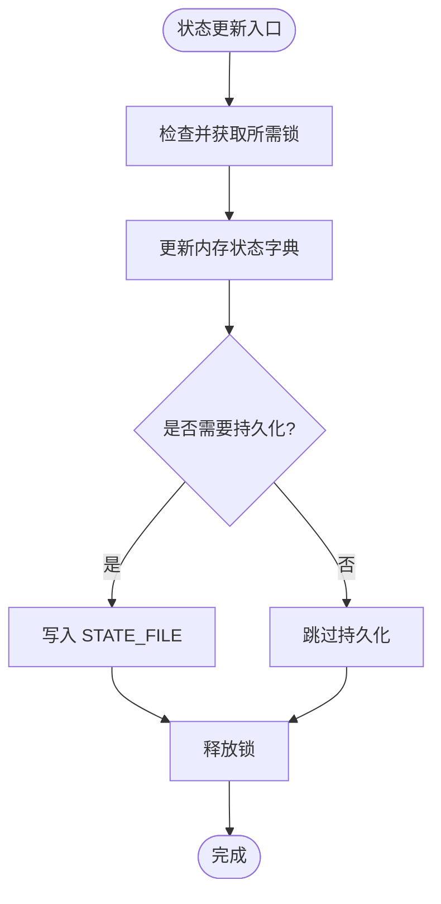
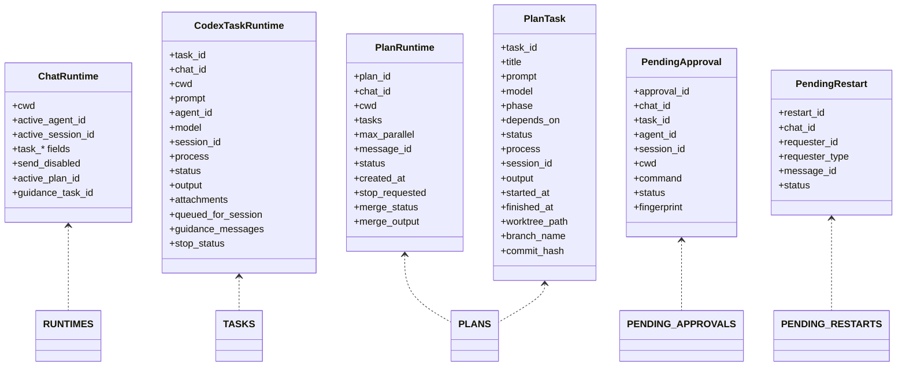

# 运行时管理

<cite>
**本文引用的文件**
- [tide_ws.py](file://tide_ws.py)
- [README.md](file://README.md)
</cite>

## 目录
1. [简介](#简介)
2. [项目结构](#项目结构)
3. [核心组件](#核心组件)
4. [架构总览](#架构总览)
5. [详细组件分析](#详细组件分析)
6. [依赖关系分析](#依赖关系分析)
7. [性能考量](#性能考量)
8. [故障排查指南](#故障排查指南)
9. [结论](#结论)
10. [附录](#附录)

## 简介
本文件聚焦于运行时状态管理，系统性阐述全局状态变量的设计与职责、状态更新策略（含线程安全、并发控制、一致性保障）、锁机制的应用场景、状态清理与回收策略、监控与调试手段，以及最佳实践与常见陷阱。内容基于代码库中的数据结构、锁与并发控制、状态持久化与恢复、以及卡片与消息的发送与更新流程进行归纳总结。

## 项目结构
- 主程序入口与运行时状态集中于单一文件，包含：
  - 全局状态字典：RUNTIMES、TASKS、DESKTOP_SYNCS、PENDING_APPROVALS、PLANS、PENDING_RESTARTS
  - 并发控制锁：LOCK、SEND_LOCK、PLAN_LOCK、SESSION_RUN_LOCKS
  - 状态持久化：STATE_FILE 与读写函数 read_state/write_state
  - 事件与消息处理：WebSocket 事件分发、卡片发送与更新、消息分片与格式化
  - 计划执行：PlanRuntime/PlanTask 的状态机与卡片渲染
  - 审批与重启：PendingApproval/PendingRestart 的生命周期管理

**图表来源**
- [tide_ws.py:387-406](file://tide_ws.py#L387-L406)
- [tide_ws.py:869-891](file://tide_ws.py#L869-L891)
- [tide_ws.py:1152-1173](file://tide_ws.py#L1152-L1173)

**章节来源**
- [tide_ws.py:387-406](file://tide_ws.py#L387-L406)
- [tide_ws.py:869-891](file://tide_ws.py#L869-L891)
- [tide_ws.py:1152-1173](file://tide_ws.py#L1152-L1173)

## 核心组件
- 全局状态字典
  - RUNTIMES：按 chat_id 管理会话级运行时，包含当前 Agent、工作目录、任务上下文、发送开关、计划与引导任务等字段。
  - TASKS：按 task_id 管理任务运行时，包含 prompt、agent/model、会话、进程、输出、排队/暂停/停止状态、附件、引导消息等。
  - DESKTOP_SYNCS：按 (chat_id, session_id) 管理 Codex Desktop 同步状态，包含标题、prompt、output、更新时间与卡片 message_id。
  - PENDING_APPROVALS：按 approval_id 管理待审批项，包含 chat_id/task_id/session_id/cwd/command/fingerprint/status 等。
  - PLANS：按 plan_id 管理 Plan 运行时，包含 tasks 列表、并发度、消息卡片、合并状态等。
  - PENDING_RESTARTS：按 restart_id 管理重启请求，包含 chat_id/requester 等。
- 锁与并发
  - LOCK：全局读写锁，保护 RUNTIMES/TASKS/DESKTOP_SYNCS/PENDING_APPROVALS/PENDING_RESTARTS 的并发访问。
  - SEND_LOCK：保护消息与卡片发送/更新的串行化，避免 Lark API 并发冲突。
  - PLAN_LOCK：保护 PLANS 的并发访问与持久化。
  - SESSION_RUN_LOCKS：按 conversation_key(session_id) 的细粒度锁，避免同一会话并发执行导致竞争。
- 状态持久化
  - read_state/write_state：读取/写入本地状态文件，确保重启后可恢复会话、Plan、消息引用等关键状态。
  - save_runtime/save_plans_state：分别持久化 RUNTIMES/PLANS 的子集。

**章节来源**
- [tide_ws.py:387-406](file://tide_ws.py#L387-L406)
- [tide_ws.py:869-891](file://tide_ws.py#L869-L891)
- [tide_ws.py:983-1014](file://tide_ws.py#L983-L1014)
- [tide_ws.py:1152-1173](file://tide_ws.py#L1152-L1173)

## 架构总览
运行时状态管理贯穿消息处理、任务执行、卡片渲染与状态持久化。整体流程如下：

**图表来源**
- [tide_ws.py:3482-3524](file://tide_ws.py#L3482-L3524)
- [tide_ws.py:3663-3702](file://tide_ws.py#L3663-L3702)
- [tide_ws.py:869-891](file://tide_ws.py#L869-L891)

## 详细组件分析

### 全局状态字典与用途
- RUNTIMES
  - 作用：维护每个 chat_id 的会话上下文，包括当前 Agent、工作目录、任务上下文、计划与引导任务、发送开关等。
  - 关键字段：cwd、active_agent_id、active_project_key、active_session_id、task_*、last_*、send_disabled、active_plan_id、guidance_task_id 等。
  - 生命周期：首次访问时创建并持久化；重启后从 STATE_FILE 恢复。
- TASKS
  - 作用：维护每个 task_id 的任务执行上下文，包括 prompt、agent/model、会话、进程、输出、排队/暂停/停止状态、附件、引导消息等。
  - 生命周期：创建后加入 TASKS，运行中持续更新，完成后保留以便查看。
- DESKTOP_SYNCS
  - 作用：维护 Codex Desktop 会话的同步卡片状态，包含标题、prompt、output、更新时间与 message_id。
  - 生命周期：按 (chat_id, session_id) 键缓存，定期刷新卡片。
- PENDING_APPROVALS
  - 作用：维护待审批项，包含指纹去重、超时处理、状态流转。
  - 生命周期：创建后加入，等待审批/拒绝/过期，最终持久化。
- PLANS
  - 作用：维护 Plan 的整体状态与子任务集合，包含并发度、消息卡片、合并状态等。
  - 生命周期：创建后加入 PLANS，运行中持续更新，重启后从 STATE_FILE 恢复。
- PENDING_RESTARTS
  - 作用：维护重启请求，包含 chat_id/requester 等，支持确认/取消。
  - 生命周期：创建后加入，等待审批/取消，最终持久化。

**章节来源**
- [tide_ws.py:387-406](file://tide_ws.py#L387-L406)
- [tide_ws.py:1017-1043](file://tide_ws.py#L1017-L1043)
- [tide_ws.py:1045-1107](file://tide_ws.py#L1045-L1107)
- [tide_ws.py:1125-1149](file://tide_ws.py#L1125-L1149)
- [tide_ws.py:4146-4173](file://tide_ws.py#L4146-L4173)
- [tide_ws.py:5381-5424](file://tide_ws.py#L5381-L5424)

### 状态更新策略与线程安全
- 通用策略
  - 所有对全局状态字典的读写均在持有 LOCK 的前提下进行，避免竞态。
  - 对 Lark API 的消息/卡片发送/更新统一使用 SEND_LOCK，确保串行化，降低 200340 等投递失败的风险。
  - 对 PLANS 的读写使用 PLAN_LOCK，避免 Plan 并发修改导致状态错乱。
  - 对特定会话的并发执行使用 SESSION_RUN_LOCKS，避免同一会话多任务并发。
- 一致性保障
  - 重要状态更新后立即持久化（如 save_runtime/save_plans_state），确保重启后可恢复。
  - 任务/Plan 的卡片更新采用节流策略（最小更新间隔），减少频繁更新带来的压力。
- 并发访问控制
  - 读多写少的场景优先使用 RLock，降低锁竞争。
  - 对共享资源（如 STATE_FILE）的写入采用临时文件 + 原子替换，避免部分写入。

**图表来源**
- [tide_ws.py:983-1014](file://tide_ws.py#L983-L1014)
- [tide_ws.py:1152-1173](file://tide_ws.py#L1152-L1173)
- [tide_ws.py:3482-3524](file://tide_ws.py#L3482-L3524)
- [tide_ws.py:3663-3702](file://tide_ws.py#L3663-L3702)

**章节来源**
- [tide_ws.py:983-1014](file://tide_ws.py#L983-L1014)
- [tide_ws.py:1152-1173](file://tide_ws.py#L1152-L1173)
- [tide_ws.py:3482-3524](file://tide_ws.py#L3482-L3524)
- [tide_ws.py:3663-3702](file://tide_ws.py#L3663-L3702)

### 锁机制的应用场景
- LOCK
  - 适用：RUNTIMES、TASKS、DESKTOP_SYNCS、PENDING_APPROVALS、PENDING_RESTARTS 的读写。
  - 示例：save_runtime、load_known_chats、pending_approvals_for_chat、find_task 等。
- SEND_LOCK
  - 适用：send_msg/send_card/update_card 的串行化，避免 Lark API 并发限制。
  - 示例：send_msg、send_card、update_card。
- PLAN_LOCK
  - 适用：PLANS 的读写与持久化。
  - 示例：save_plans_state、load_plans_state、find_plan。
- SESSION_RUN_LOCKS
  - 适用：同一会话的并发执行控制，避免重复启动或状态冲突。
  - 示例：session_run_lock。

**章节来源**
- [tide_ws.py:1175-1182](file://tide_ws.py#L1175-L1182)
- [tide_ws.py:3482-3524](file://tide_ws.py#L3482-L3524)
- [tide_ws.py:3663-3702](file://tide_ws.py#L3663-L3702)
- [tide_ws.py:1152-1173](file://tide_ws.py#L1152-L1173)
- [tide_ws.py:1199-1208](file://tide_ws.py#L1199-L1208)

### 状态清理与回收机制
- 过期状态检测
  - 待审批项：wait_for_pending_approval 在超时后将状态置为 expired，并持久化。
  - 待重启项：pending_restart_for_chat 选择最新请求，支持审批/取消。
  - 附件暂存：prune_pending_lark_attachments 按 TTL 清理，避免磁盘占用。
- 内存管理
  - 任务/Plan 结束后保留输出与状态，便于查看；长期运行可通过外部策略清理。
  - 会话级锁在会话结束或不再使用时可释放，避免锁泄漏。
- 资源释放
  - 子进程退出后清理 task.process/process.stdout。
  - 临时文件（如 Plan 最终消息文件）在使用后及时删除。
  - Lark 资源下载流在使用后关闭，避免句柄泄露。

**章节来源**
- [tide_ws.py:3346-3365](file://tide_ws.py#L3346-L3365)
- [tide_ws.py:3542-3551](file://tide_ws.py#L3542-L3551)
- [tide_ws.py:1546-1573](file://tide_ws.py#L1546-L1573)
- [tide_ws.py:5598-5600](file://tide_ws.py#L5598-L5600)

### 监控与调试方法
- 状态查看命令
  - /status：查看当前项目状态与会话摘要。
  - /panel：打开看板，查看项目/对话/任务/审批等状态。
  - /projects / /chats / /convos：查看项目/普通对话/当前项目对话。
  - /daily：输出项目进展日报。
- 性能指标监控
  - 任务/Plan 刷新间隔：TASK_CARD_REFRESH_INTERVAL_SECONDS、PLAN_MAX_PARALLEL。
  - 事件队列容量：LARK_EVENT_QUEUE_MAXSIZE。
  - 定时推送：STATUS_INTERVAL_SECONDS。
- 异常状态处理
  - 审批超时：PENDING_APPROVAL_WAIT_SECONDS，超时后按默认策略继续。
  - 发送失败：send_msg/send_card 失败时禁用该 chat 的发送（disable_chat_send）。
  - 重启确认：/restart 通过卡片确认，避免误操作。

**章节来源**
- [README.md:154-210](file://README.md#L154-L210)
- [tide_ws.py:3346-3365](file://tide_ws.py#L3346-L3365)
- [tide_ws.py:3482-3524](file://tide_ws.py#L3482-L3524)

### 最佳实践与常见陷阱
- 最佳实践
  - 严格使用对应锁：对 RUNTIMES/TASKS/DESKTOP_SYNCS/PENDING_APPROVALS 使用 LOCK；对 PLANS 使用 PLAN_LOCK；对 Lark API 使用 SEND_LOCK。
  - 状态更新后及时持久化，确保重启可恢复。
  - 控制刷新频率，避免过度更新卡片/消息。
  - 明确会话级并发边界，使用 SESSION_RUN_LOCKS 避免重复执行。
- 常见陷阱
  - 忘记加锁：直接读写全局字典导致竞态。
  - 并发发送：未使用 SEND_LOCK 导致 Lark API 投递失败。
  - 忘记清理：临时文件/附件未清理导致磁盘膨胀。
  - 锁粒度过粗：影响并发性能，应按需细化（如会话级锁）。

**章节来源**
- [tide_ws.py:983-1014](file://tide_ws.py#L983-L1014)
- [tide_ws.py:3482-3524](file://tide_ws.py#L3482-L3524)
- [tide_ws.py:1546-1573](file://tide_ws.py#L1546-L1573)

## 依赖关系分析
- 数据结构依赖
  - ChatRuntime/CodexTaskRuntime/PlanRuntime/PlanTask 等数据类定义了状态字段与行为。
  - 全局字典与锁共同构成状态容器与并发控制层。
- 外部依赖
  - Lark SDK：消息发送、卡片更新、事件回调。
  - 文件系统：STATE_FILE、临时文件、附件下载目录。
  - 子进程：Agent CLI 执行与流式输出解析。

**图表来源**
- [tide_ws.py:209-396](file://tide_ws.py#L209-L396)
- [tide_ws.py:387-406](file://tide_ws.py#L387-L406)

**章节来源**
- [tide_ws.py:209-396](file://tide_ws.py#L209-L396)
- [tide_ws.py:387-406](file://tide_ws.py#L387-L406)

## 性能考量
- 锁竞争优化
  - 使用 RLock 降低写锁持有时间，尽量缩短临界区。
  - 对不同状态域使用专用锁（如 PLAN_LOCK），避免跨域锁争用。
- 更新节流
  - 任务/Plan 卡片更新设置最小间隔，避免高频刷新。
  - 流式输出缓冲聚合，达到阈值或时间窗口再更新。
- I/O 优化
  - 状态文件写入采用临时文件 + 原子替换，减少部分写入风险。
  - 附件下载与保存使用流式写入，及时关闭资源。

[本节为通用指导，无需特定文件引用]

## 故障排查指南
- 发送失败
  - 现象：send_msg/send_card 返回失败码或 invalid receive_id。
  - 处理：记录失败原因并禁用该 chat 的发送（disable_chat_send），避免重复失败。
- 审批超时
  - 现象：待审批项长时间未处理。
  - 处理：wait_for_pending_approval 超时后置为 expired，并按默认策略继续。
- 重启异常
  - 现象：/restart 未生效或按钮不可用。
  - 处理：检查 PENDING_RESTARTS 状态，确认审批/取消流程。
- 状态不一致
  - 现象：重启后状态丢失或不正确。
  - 处理：检查 STATE_FILE 权限与内容，确认 read_state/write_state 成功。

**章节来源**
- [tide_ws.py:3482-3524](file://tide_ws.py#L3482-L3524)
- [tide_ws.py:3663-3702](file://tide_ws.py#L3663-L3702)
- [tide_ws.py:3346-3365](file://tide_ws.py#L3346-L3365)
- [tide_ws.py:869-891](file://tide_ws.py#L869-L891)

## 结论
本运行时状态管理体系通过明确的数据结构、严格的锁策略与持久化机制，实现了多会话、多任务、多 Plan 的并发安全与一致性。配合卡片与消息的串行化发送、审批与重启的生命周期管理，以及完善的监控与调试手段，能够稳定支撑 Lark 与 Agent CLI 的协同工作。遵循最佳实践、避免常见陷阱，可进一步提升系统的可靠性与性能。

## 附录
- 环境变量与运行参数
  - 状态文件：TIDE_STATE_FILE
  - 刷新间隔：TASK_CARD_REFRESH_INTERVAL_SECONDS、PLAN_MAX_PARALLEL
  - 事件队列：LARK_EVENT_QUEUE_MAXSIZE
  - 审批超时：PENDING_APPROVAL_WAIT_SECONDS、PENDING_APPROVAL_POLL_SECONDS
  - 定时推送：STATUS_INTERVAL_SECONDS
  - 附件与消息：LARK_ATTACHMENTS_DIR、LARK_ATTACHMENT_MAX_BYTES、LARK_PENDING_ATTACHMENT_TTL_SECONDS、LARK_MESSAGE_CHUNK_SIZE、LARK_FINAL_REPLY_MAX_CHARS、LARK_FINAL_QUESTION_MAX_CHARS

**章节来源**
- [README.md:317-427](file://README.md#L317-L427)