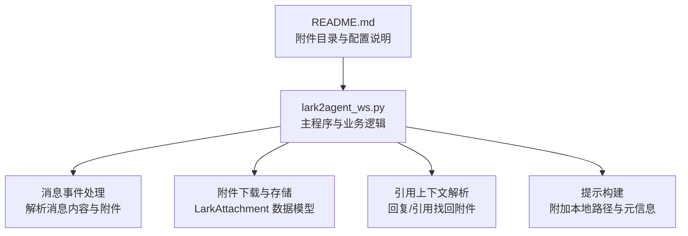
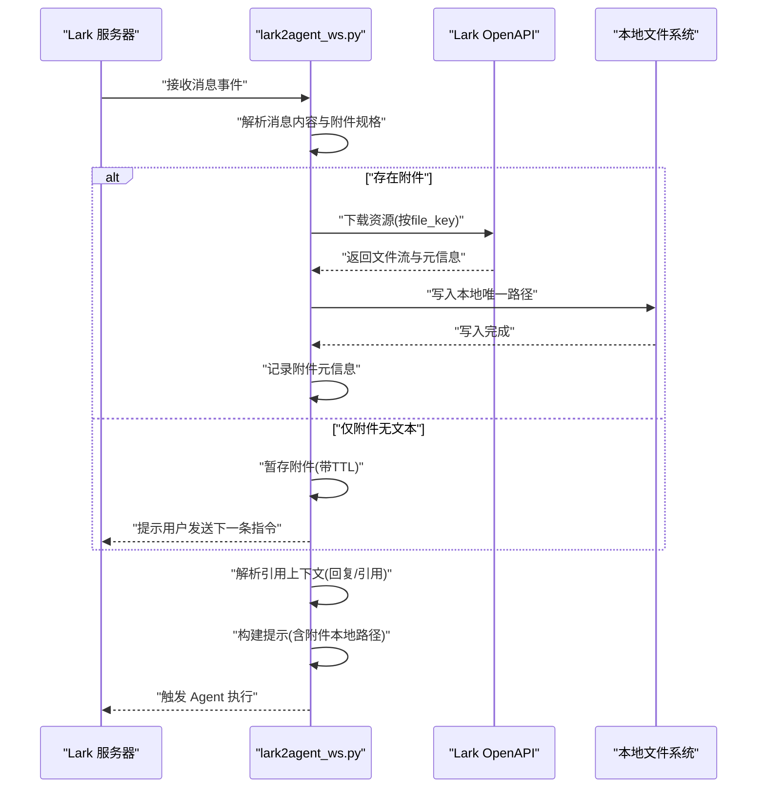
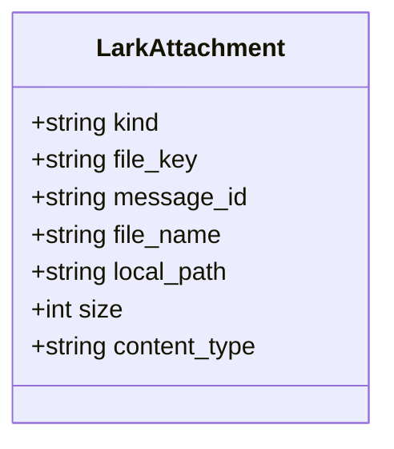
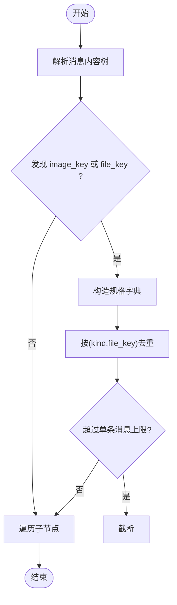
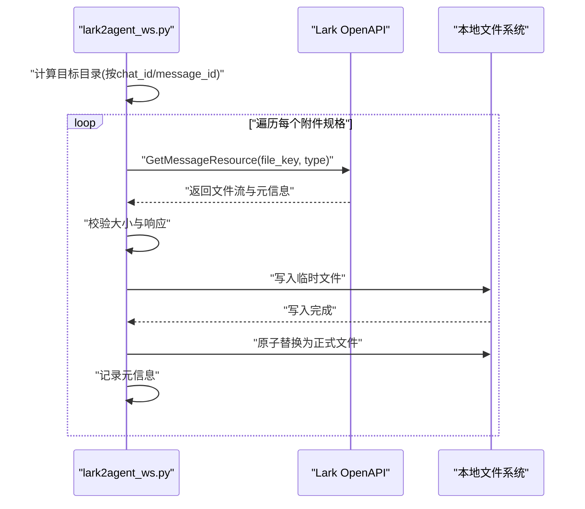
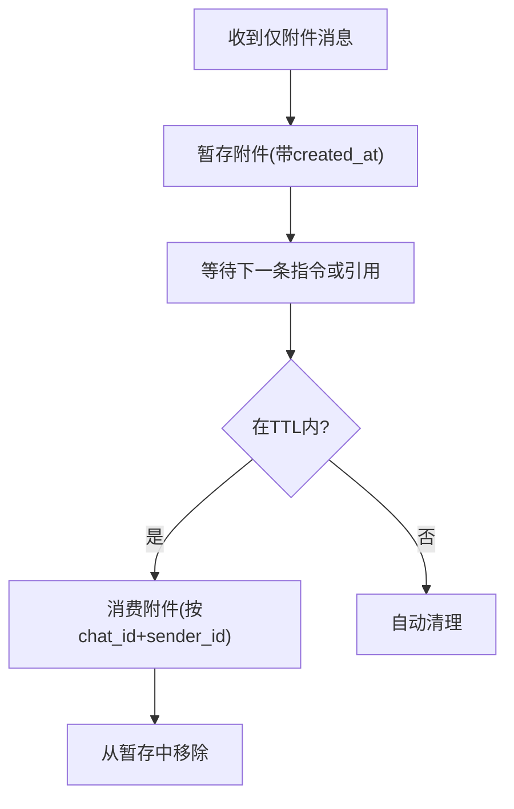
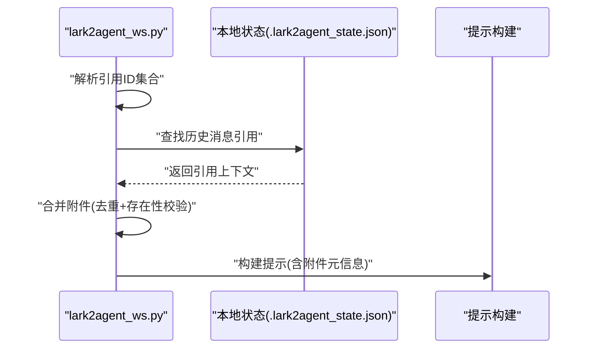
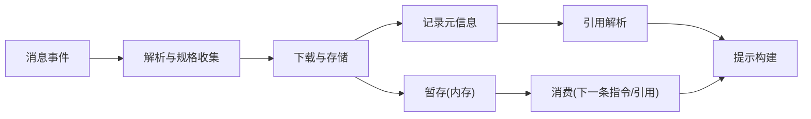

# 附件处理

<cite>
**本文引用的文件**
- [README.md](file://README.md)
- [lark2agent_ws.py](file://lark2agent_ws.py)
</cite>

## 目录
1. [简介](#简介)
2. [项目结构](#项目结构)
3. [核心组件](#核心组件)
4. [架构总览](#架构总览)
5. [详细组件分析](#详细组件分析)
6. [依赖关系分析](#依赖关系分析)
7. [性能考量](#性能考量)
8. [故障排查指南](#故障排查指南)
9. [结论](#结论)
10. [附录](#附录)

## 简介
本章节聚焦 Lark2Agent 的附件处理能力，涵盖图片与文件的上传、下载、解析与传递机制，数据模型设计、键值管理、本地路径映射策略，以及附件消费与提示策略。文档基于仓库现有实现进行深入分析，并提供最佳实践建议与配置说明。

## 项目结构
- 主程序入口与业务逻辑集中在 lark2agent_ws.py，附件处理相关代码主要分布在消息事件处理、附件下载、引用上下文解析与提示拼装等模块。
- README.md 提供了附件目录结构、默认行为与配置项说明，便于理解整体落地方式。

**图表来源**
- [lark2agent_ws.py](file://lark2agent_ws.py)
- [README.md](file://README.md)

**章节来源**
- [README.md](file://README.md)
- [lark2agent_ws.py](file://lark2agent_ws.py)

## 核心组件
- LarkAttachment 数据模型：用于描述附件的种类、文件键、消息ID、文件名、本地路径、大小与内容类型等字段。
- 附件规格收集与去重：从 Lark 消息内容中提取 image_key/file_key 规格，统一规范为标准化字典列表。
- 附件下载与本地存储：根据规格调用 Lark OpenAPI 下载资源，写入本地唯一路径，记录元信息。
- 待处理附件暂存与消费：当消息仅有附件无文本时，将附件暂存于内存字典，限定 TTL 后由下一条指令消费。
- 引用上下文解析：通过回复/引用的消息ID找回历史附件，合并到当前任务提示中。
- 提示构建：将附件信息注入到 Agent 的执行提示中，包含本地路径、消息ID等元信息。

**章节来源**
- [lark2agent_ws.py](file://lark2agent_ws.py)

## 架构总览
附件处理在消息事件处理流程中的位置如下：

**图表来源**
- [lark2agent_ws.py](file://lark2agent_ws.py)

## 详细组件分析

### LarkAttachment 数据模型
- 字段说明
  - kind：附件类型，如 image 或 file
  - file_key：Lark 资源标识
  - message_id：消息ID
  - file_name：文件名
  - local_path：本地存储路径
  - size：文件大小（字节）
  - content_type：内容类型
- 设计要点
  - 统一字段命名与类型转换，便于后续序列化与提示拼装
  - 与本地路径映射强关联，便于直接读取

**图表来源**
- [lark2agent_ws.py](file://lark2agent_ws.py)

**章节来源**
- [lark2agent_ws.py](file://lark2agent_ws.py)

### 附件规格收集与去重
- 收集策略
  - 从消息内容中递归查找 image_key 与 file_key
  - 根据消息类型决定默认 kind（如 image 消息默认 kind=image）
  - 规范化为统一字典列表，包含 kind、file_key、file_name、size 等
- 去重策略
  - 基于 (kind, file_key) 去重，限制每条消息最多处理数量
- 复杂度
  - 时间复杂度 O(N)，N 为嵌套结构节点数
  - 空间复杂度 O(K)，K 为附件规格数量

**图表来源**
- [lark2agent_ws.py](file://lark2agent_ws.py)

**章节来源**
- [lark2agent_ws.py](file://lark2agent_ws.py)

### 附件下载与本地存储
- 目录结构
  - 基础目录：可配置，相对路径时基于当前工作目录
  - 结构：.lark2agent/attachments/<chat_id>/<message_id>/
  - 权限：创建目录并尽量设置为私有权限
- 下载流程
  - 根据规格构造请求，调用 Lark OpenAPI 获取文件流
  - 校验响应与大小限制，写入临时文件后原子替换为正式文件
  - 记录本地路径、大小、内容类型等元信息
- 错误处理
  - 响应码非成功、无文件流、写入异常均记录错误并跳过该附件
- 复杂度
  - IO 流式写入，内存占用稳定

**图表来源**
- [lark2agent_ws.py](file://lark2agent_ws.py)

**章节来源**
- [lark2agent_ws.py](file://lark2agent_ws.py)

### 待处理附件暂存与消费
- 暂存策略
  - 当附件消息无文本时，暂存附件列表至内存字典，带创建时间戳
  - TTL 由配置项控制，定期清理过期项
- 消费策略
  - 下一条普通指令或回复/引用该附件消息时，按 chat_id 与发送者 ID 消费暂存附件
  - 消费后从内存中移除，避免重复使用
- 复杂度
  - 消费为 O(N) 遍历匹配，清理为 O(M) 遍历

**图表来源**
- [lark2agent_ws.py](file://lark2agent_ws.py)

**章节来源**
- [lark2agent_ws.py](file://lark2agent_ws.py)

### 引用上下文解析与附件传递
- 引用解析
  - 从消息元信息中提取引用ID集合（引用/回复/根/父/线程）
  - 在本地状态中查找历史消息引用，优先选择最近更新的候选
- 附件合并
  - 将引用消息中的附件列表合并到当前任务提示中
  - 与暂存附件合并，去重后保留本地存在的文件
- 提示构建
  - 将附件信息注入到 Agent 提示中，包含本地路径与消息ID等元信息

**图表来源**
- [lark2agent_ws.py](file://lark2agent_ws.py)

**章节来源**
- [lark2agent_ws.py](file://lark2agent_ws.py)

### 附件类型识别、内容类型与大小限制
- 类型识别
  - 依据消息类型与字段名识别 image/file
  - 优先使用 image_key/file_key，兼容大小写差异
- 内容类型
  - 从下载响应中读取 content_type，便于后续分类处理
- 大小限制
  - 单个附件大小限制由配置项控制
  - 下载过程中分块读取并累计，超过阈值抛出异常并记录错误

**章节来源**
- [lark2agent_ws.py](file://lark2agent_ws.py)

### 本地缓存管理策略
- 目录结构
  - 基础目录可配置，相对路径时基于当前工作目录
  - 采用 chat_id/message_id 两级目录隔离，避免冲突
- 文件命名与唯一性
  - 基于响应文件名或默认规则生成文件名
  - 若同名存在，追加序号或时间戳保证唯一
- 清理机制
  - 待处理附件按 TTL 清理
  - 历史消息引用上限控制，超出后按更新时间裁剪
- 磁盘空间管理
  - 未内置自动清理策略，建议结合外部策略（如定期扫描、限额监控）保障磁盘空间

**章节来源**
- [lark2agent_ws.py](file://lark2agent_ws.py)

## 依赖关系分析
- 组件耦合
  - 附件下载依赖 Lark OpenAPI 客户端与消息元信息
  - 提示构建依赖附件元信息与引用上下文
  - 暂存与消费依赖运行时上下文与锁保护
- 外部依赖
  - Lark OpenAPI SDK 用于资源下载
  - 本地文件系统用于存储与权限设置

**图表来源**
- [lark2agent_ws.py](file://lark2agent_ws.py)

**章节来源**
- [lark2agent_ws.py](file://lark2agent_ws.py)

## 性能考量
- IO 优化
  - 分块读取（1MB）降低内存峰值
  - 写入采用临时文件后原子替换，减少中断风险
- 并发与锁
  - 关键共享结构使用锁保护，避免竞态
  - 暂存字典按 chat_id+sender_id 分组，降低冲突概率
- 复杂度
  - 规格收集与去重为线性复杂度
  - 下载为流式处理，受网络与磁盘IO影响

[本节为通用性能讨论，无需具体文件分析]

## 故障排查指南
- 附件下载失败
  - 检查 Lark 响应码与消息文本，确认资源是否存在
  - 确认 file_key 与消息ID一致
- 保存失败
  - 检查目标目录权限与磁盘空间
  - 查看异常类型与错误信息
- 附件过大
  - 调整大小限制配置项
  - 对超限附件进行预处理或分片
- 暂存未消费
  - 确认 TTL 设置合理
  - 检查是否正确回复/引用原附件消息
- 引用上下文缺失
  - 确认本地状态文件存在且未被清理
  - 检查引用ID是否有效

**章节来源**
- [lark2agent_ws.py](file://lark2agent_ws.py)

## 结论
Lark2Agent 的附件处理以清晰的数据模型与稳健的下载流程为核心，结合引用上下文与暂存消费机制，实现了灵活的附件传递与提示构建。通过合理的目录结构、命名策略与清理机制，能够在保证可靠性的同时兼顾易用性。建议在生产环境中配合外部磁盘与限额策略，确保长期稳定运行。

[本节为总结性内容，无需具体文件分析]

## 附录

### 配置选项与使用示例
- 附件相关配置
  - LARK_ATTACHMENTS_DIR：附件下载目录（相对路径时基于当前工作目录）
  - LARK_ATTACHMENT_MAX_BYTES：单个附件最大字节数
  - LARK_PENDING_ATTACHMENT_TTL_SECONDS：附件暂存TTL（秒）
  - MAX_LARK_ATTACHMENTS_PER_MESSAGE：单条消息最多处理的附件数量
  - MAX_LARK_MESSAGE_REFS：消息引用缓存上限（0表示不限制）
- 使用示例
  - 在 Lark 中发送图片或文件，若消息无文本，系统会暂存附件并提示发送下一条指令
  - 回复或引用原附件消息发送指令，系统会自动带上附件
  - 附件下载后以本地路径形式注入到 Agent 提示中，便于直接读取

**章节来源**
- [README.md](file://README.md)
- [lark2agent_ws.py](file://lark2agent_ws.py)