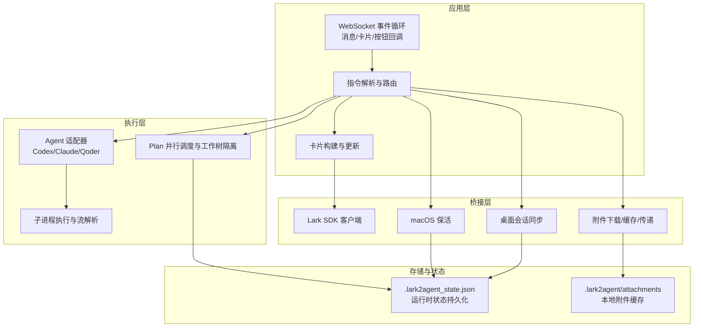
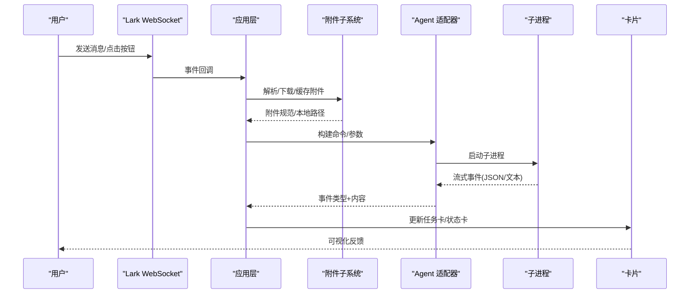
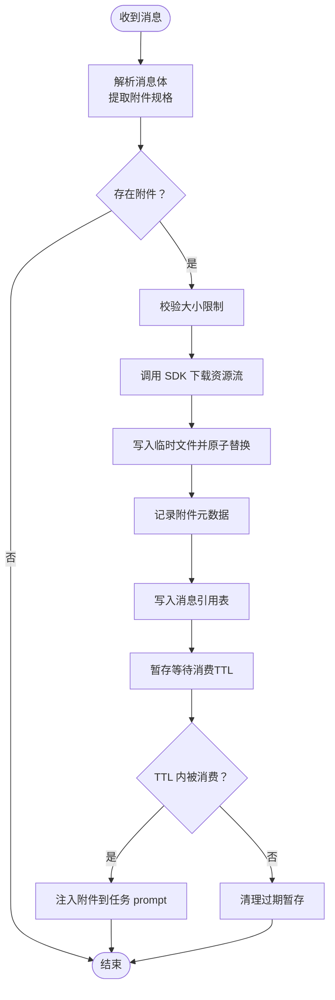
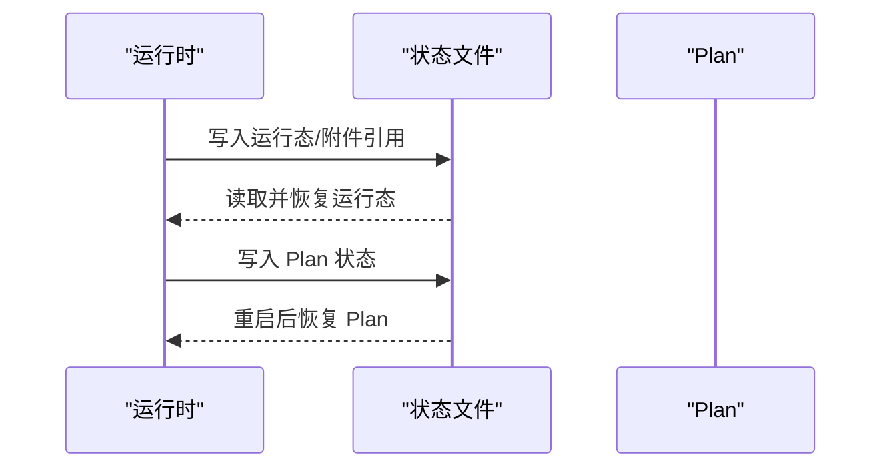
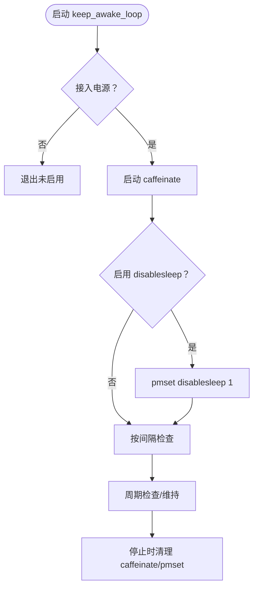
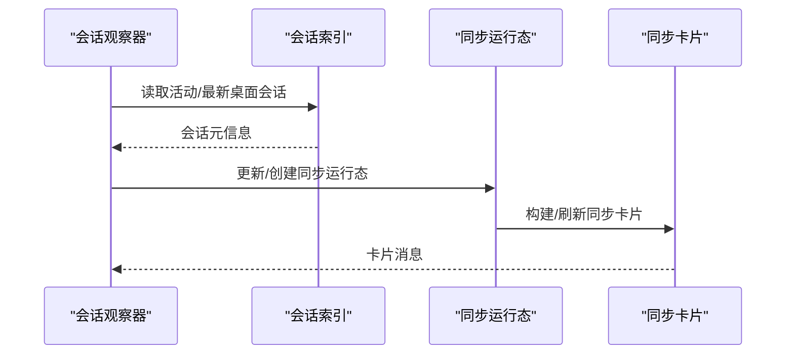
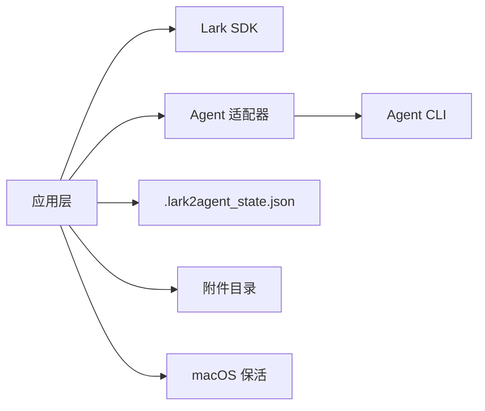

# 高级特性

<cite>
**本文引用的文件**
- [README.md](file://README.md)
- [lark2agent_ws.py](file://lark2agent_ws.py)
- [PPT_OUTLINE.md](file://PPT_OUTLINE.md)
- [ppt_outline_deck.html](file://ppt_outline_deck.html)
</cite>

## 目录
1. [简介](#简介)
2. [项目结构](#项目结构)
3. [核心组件](#核心组件)
4. [架构总览](#架构总览)
5. [详细组件分析](#详细组件分析)
6. [依赖关系分析](#依赖关系分析)
7. [性能考虑](#性能考虑)
8. [故障排除指南](#故障排除指南)
9. [结论](#结论)
10. [附录](#附录)

## 简介
本文件聚焦 Lark2Agent 的高级特性，围绕附件处理、状态同步与持久化、macOS 保活、性能与并发控制、高级配置与扩展点展开，帮助读者在理解整体架构的同时，掌握可落地的实践方法与排障技巧。

## 项目结构
- 主程序入口：lark2agent_ws.py
- 说明文档：README.md、PPT_OUTLINE.md、ppt_outline_deck.html
- 环境变量与运行参数：通过 .env 注入，README.md 提供完整配置清单

图示来源
- [lark2agent_ws.py:856-866](file://lark2agent_ws.py#L856-L866)
- [lark2agent_ws.py:1449-1539](file://lark2agent_ws.py#L1449-L1539)
- [lark2agent_ws.py:4146-4203](file://lark2agent_ws.py#L4146-L4203)
- [lark2agent_ws.py:1677-1757](file://lark2agent_ws.py#L1677-L1757)
- [lark2agent_ws.py:856-866](file://lark2agent_ws.py#L856-L866)

章节来源
- [README.md:512-517](file://README.md#L512-L517)
- [lark2agent_ws.py:856-866](file://lark2agent_ws.py#L856-L866)

## 核心组件
- 附件处理子系统：负责图片/文件的下载、去重、本地缓存、消费与传递
- 状态与持久化：运行态、Plan、消息引用、项目/会话分类等
- 桌面会话同步：监听 Codex Desktop 会话变更，回写卡片
- macOS 保活：接入 caffeinate/pmset，维持脚本与网络活跃
- 并发与资源限制：全局/会话级任务上限、会话锁、事件队列
- 执行适配器：Codex/Claude/Qoder 的命令构建、事件解析、权限模式

章节来源
- [lark2agent_ws.py:173-396](file://lark2agent_ws.py#L173-L396)
- [lark2agent_ws.py:849-853](file://lark2agent_ws.py#L849-L853)
- [lark2agent_ws.py:1175-1182](file://lark2agent_ws.py#L1175-L1182)
- [lark2agent_ws.py:1152-1173](file://lark2agent_ws.py#L1152-L1173)

## 架构总览
Lark2Agent 采用“WebSocket 事件驱动 + 本地执行 + 卡片回写”的轻量桥接架构。消息与卡片事件经由 Lark SDK 进入应用层，指令解析后选择执行路径：普通任务、Plan 并行、会话同步、macOS 保活等。执行层通过 Agent 适配器调用本地 CLI，流式事件解析并更新卡片；状态通过本地 JSON 文件持久化，保证重启后可恢复。

图示来源
- [lark2agent_ws.py:856-866](file://lark2agent_ws.py#L856-L866)
- [lark2agent_ws.py:1449-1539](file://lark2agent_ws.py#L1449-L1539)
- [lark2agent_ws.py:648-681](file://lark2agent_ws.py#L648-L681)
- [lark2agent_ws.py:702-769](file://lark2agent_ws.py#L702-L769)
- [lark2agent_ws.py:771-799](file://lark2agent_ws.py#L771-L799)

## 详细组件分析

### 附件处理与本地缓存
- 下载与解析
  - 从消息体提取图片/文件资源规格，调用 Lark SDK 获取资源流
  - 校验大小限制、生成安全文件名、写入临时文件后原子替换
  - 记录附件元数据（类型、文件名、本地路径、大小、内容类型）
- 本地缓存策略
  - 目录结构：按 chat_id/message_id 维度组织，避免冲突
  - 权限与可见性：创建目录并设置权限，忽略 .gitignore 的影响
- 附件消费与传递
  - 若消息仅有附件无文本，附件暂存于内存队列，等待同一用户在 TTL 内的下一条指令消费
  - 支持回复/引用消息找回附件，通过消息引用表记录上下文
  - 将附件信息注入到任务 prompt，便于 Agent 读取本地路径
- 附件去重与清理
  - 去重策略基于本地路径或 message_id+file_key
  - 定期修剪过期暂存附件，避免磁盘膨胀

图示来源
- [lark2agent_ws.py:1359-1410](file://lark2agent_ws.py#L1359-L1410)
- [lark2agent_ws.py:1449-1539](file://lark2agent_ws.py#L1449-L1539)
- [lark2agent_ws.py:1546-1581](file://lark2agent_ws.py#L1546-L1581)
- [lark2agent_ws.py:1622-1639](file://lark2agent_ws.py#L1622-L1639)

章节来源
- [README.md:211-218](file://README.md#L211-L218)
- [lark2agent_ws.py:1449-1539](file://lark2agent_ws.py#L1449-L1539)
- [lark2agent_ws.py:1546-1581](file://lark2agent_ws.py#L1546-L1581)
- [lark2agent_ws.py:1622-1639](file://lark2agent_ws.py#L1622-L1639)

### 状态同步与持久化
- 运行时状态
  - 会话运行态（cwd、active_agent_id、task_*、plan_id 等）写入本地状态文件
  - 加载时恢复运行态，避免重启后上下文丢失
- Plan 状态
  - 子任务状态、工作树/分支信息、测试摘要、提交信息、合并状态等持久化
  - 重启后自动恢复未结束的 Plan 与子任务
- 消息引用与附件
  - 记录消息引用（root_id/parent_id/thread_id），支持回复/引用找回附件
  - 限制引用数量，按更新时间裁剪，避免无限增长
- 会话与项目分类
  - 通过状态文件记录项目路径映射，支持手动标记项目/普通对话

图示来源
- [lark2agent_ws.py:869-891](file://lark2agent_ws.py#L869-L891)
- [lark2agent_ws.py:983-1014](file://lark2agent_ws.py#L983-L1014)
- [lark2agent_ws.py:1017-1043](file://lark2agent_ws.py#L1017-L1043)
- [lark2agent_ws.py:1152-1173](file://lark2agent_ws.py#L1152-L1173)
- [lark2agent_ws.py:1160-1173](file://lark2agent_ws.py#L1160-L1173)
- [lark2agent_ws.py:909-954](file://lark2agent_ws.py#L909-L954)

章节来源
- [lark2agent_ws.py:869-891](file://lark2agent_ws.py#L869-L891)
- [lark2agent_ws.py:983-1014](file://lark2agent_ws.py#L983-L1014)
- [lark2agent_ws.py:1017-1043](file://lark2agent_ws.py#L1017-L1043)
- [lark2agent_ws.py:1152-1173](file://lark2agent_ws.py#L1152-L1173)
- [lark2agent_ws.py:909-954](file://lark2agent_ws.py#L909-L954)

### macOS 保活与电源管理
- 保活机制
  - 接入 caffeinate，阻止单纯空闲休眠，维持脚本与网络活跃
  - 可选启用 disablesleep，实现合盖运行（需管理员权限）
- 状态与控制
  - 保活进程与系统设置状态受统一锁保护，避免竞态
  - 重启/停止时清理保活进程与系统设置
- 建议
  - 默认仅启用接入电源保活；如需合盖运行，谨慎开启 disablesleep 并评估发热风险

图示来源
- [lark2agent_ws.py:1677-1757](file://lark2agent_ws.py#L1677-L1757)
- [lark2agent_ws.py:1717-1743](file://lark2agent_ws.py#L1717-L1743)
- [lark2agent_ws.py:1746-1748](file://lark2agent_ws.py#L1746-L1748)

章节来源
- [README.md:429-456](file://README.md#L429-L456)
- [lark2agent_ws.py:1677-1757](file://lark2agent_ws.py#L1677-L1757)
- [lark2agent_ws.py:1717-1743](file://lark2agent_ws.py#L1717-L1743)
- [lark2agent_ws.py:1746-1748](file://lark2agent_ws.py#L1746-L1748)

### 性能优化与并发控制
- 并发与资源限制
  - 全局最大运行任务数、单会话最大运行任务数，避免资源争用
  - 会话级锁串行化同一会话的执行，避免 session 文件并发写入
  - 事件队列容量限制，防止积压导致内存膨胀
- 执行与流解析
  - 子进程流式解析，按阈值刷新卡片，减少频繁 IO
  - 超时控制与强制刷新，保证 UI 响应
- I/O 与缓存
  - 附件下载采用分块写入与原子替换，降低中断风险
  - 附件目录权限设置与去重，提升稳定性

章节来源
- [lark2agent_ws.py:6160-6167](file://lark2agent_ws.py#L6160-L6167)
- [lark2agent_ws.py:1199-1208](file://lark2agent_ws.py#L1199-L1208)
- [lark2agent_ws.py:129-151](file://lark2agent_ws.py#L129-L151)
- [lark2agent_ws.py:1500-1514](file://lark2agent_ws.py#L1500-L1514)

### 高级配置与扩展点
- 环境变量（节选）
  - Lark：域名、加密密钥、验证令牌
  - Agent CLI：二进制路径、默认模型、超时、权限模式、额外参数
  - 访问控制：允许的 chat/open/admin、是否仅已知 chat
  - 卡片与消息：分片长度、最大展示长度、面板数量上限、事件队列容量、附件目录/大小限制、附件 TTL、消息引用上限、刷新间隔、Plan 并行度、测试命令等
  - 状态与同步：定时推送、每日推送时间、状态文件、显示归档、欢迎语、桌面会话同步开关、轮询间隔
  - macOS 保活：接入电源保活、检查间隔、禁用睡眠
- 扩展点
  - Agent 适配器接口：新增 Agent 时实现命令构建与事件解析
  - 插件化卡片与按钮：通过卡片元素与回调扩展交互
  - 会话与项目分类：通过状态文件映射与手动标记扩展识别规则

章节来源
- [README.md:317-428](file://README.md#L317-L428)
- [lark2agent_ws.py:626-646](file://lark2agent_ws.py#L626-L646)
- [lark2agent_ws.py:849-853](file://lark2agent_ws.py#L849-L853)

### 桌面会话同步（Codex Desktop）
- 监听与聚合
  - 定时扫描活动会话与最新桌面会话，构建同步运行态
- 卡片与交互
  - 构建“Codex Desktop 同步”卡片，展示状态、来源、目录、更新时间、指令与最新结果
  - 提供刷新、状态、打开会话等按钮
- 状态更新
  - 会话元信息变化时更新卡片，保证协作界面可见

图示来源
- [lark2agent_ws.py:7161-7181](file://lark2agent_ws.py#L7161-L7181)
- [lark2agent_ws.py:4150-4173](file://lark2agent_ws.py#L4150-L4173)
- [lark2agent_ws.py:4176-4203](file://lark2agent_ws.py#L4176-L4203)

章节来源
- [lark2agent_ws.py:4146-4203](file://lark2agent_ws.py#L4146-L4203)
- [lark2agent_ws.py:7161-7181](file://lark2agent_ws.py#L7161-L7181)

## 依赖关系分析
- 组件耦合
  - 应用层与桥接层松耦合：通过适配器与 SDK 接口交互
  - 执行层与存储层弱耦合：状态文件作为外部持久化介质
- 外部依赖
  - Lark SDK：消息、资源、卡片回调
  - macOS 命令：caffeinate、pmset
  - Agent CLI：codex、claude、qoder
- 潜在环路
  - 通过状态文件与卡片回调避免循环依赖，事件驱动解耦

图示来源
- [lark2agent_ws.py:856-866](file://lark2agent_ws.py#L856-L866)
- [lark2agent_ws.py:648-681](file://lark2agent_ws.py#L648-L681)
- [lark2agent_ws.py:1677-1757](file://lark2agent_ws.py#L1677-L1757)

章节来源
- [lark2agent_ws.py:856-866](file://lark2agent_ws.py#L856-L866)
- [lark2agent_ws.py:648-681](file://lark2agent_ws.py#L648-L681)
- [lark2agent_ws.py:1677-1757](file://lark2agent_ws.py#L1677-L1757)

## 性能考虑
- I/O 与并发
  - 附件下载分块写入与原子替换，减少中断与碎片
  - 事件队列容量限制，避免内存压力
- 执行效率
  - 子进程流式解析与按阈值刷新，平衡实时性与开销
  - 会话锁避免并发写入，提高稳定性
- 资源限制
  - 全局/会话级任务上限，防止资源枯竭
  - 超时控制与强制刷新，避免卡死

## 故障排除指南
- 收不到消息
  - 检查机器人是否加入群聊、权限是否开通、密钥与令牌是否正确
  - 查看日志中 send_card/send_msg 权限错误
- 审批批准后未继续
  - 确认脚本已重启并加载最新代码
  - 检查批准后的配置（Codex 沙箱/策略、Claude/Qoder 权限模式）
- Git 提交失败
  - 常见 .git/index.lock 权限不足；批准后以更高权限策略重试
- 电脑仍然睡眠
  - caffeinate 仅阻止空闲休眠；合盖运行需启用 disablesleep（需管理员权限）

章节来源
- [README.md:474-511](file://README.md#L474-L511)

## 结论
Lark2Agent 通过轻量桥接与本地执行，将 Lark 协作入口与 Agent CLI 工程能力深度融合。附件处理、状态持久化、桌面会话同步与 macOS 保活构成了其高级特性支柱；配合严格的并发与资源限制，既保证了工程任务的可控性，也为扩展与定制提供了清晰的接口与空间。

## 附录
- 相关文档与演示
  - PPT 大纲与演示网页，便于对外讲解与展示

章节来源
- [PPT_OUTLINE.md:1-318](file://PPT_OUTLINE.md#L1-L318)
- [ppt_outline_deck.html:1-840](file://ppt_outline_deck.html#L1-L840)